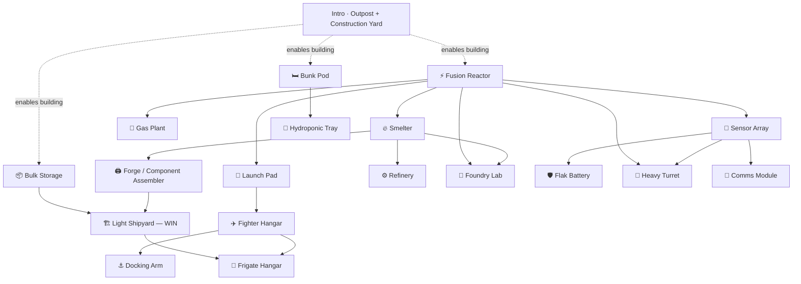
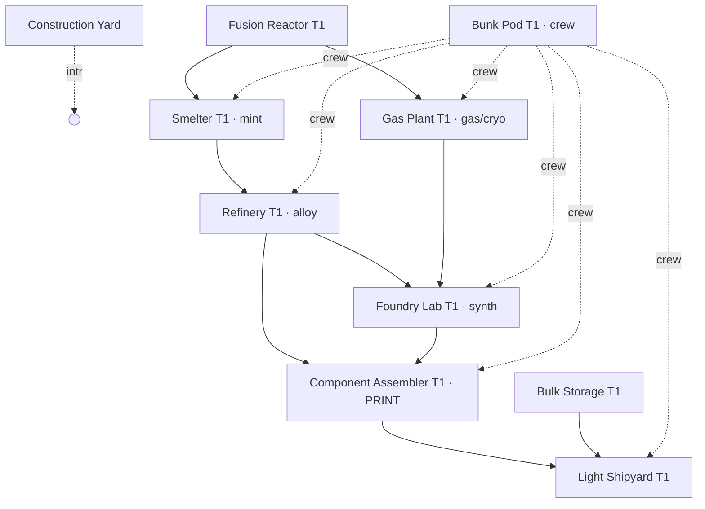

# Apex Outlaw — Combined Design Documents

_Regenerated 2026-06-04 by `regen_master_combined.ps1` — concatenates every `.md` file under `Design_Documents/` (excluding `*_OLD.md` archives) for external AI review. Run the script again any time the source docs change._

## Table of Contents
1. 00_Master_Design_Overview.md
2. admin/admin_overview.md
3. admin/admin_todo.md
4. architecture/architecture_backend_network.md
5. architecture/architecture_cloudscript_deployed.md
6. architecture/architecture_data_schemas.md
7. architecture/architecture_helion_scene_checklist.md
8. architecture/architecture_network_flow.md
9. architecture/architecture_overview.md
10. architecture/architecture_plan.md
11. combat/combat_damage_aggro.md
12. combat/combat_fog_of_war.md
13. combat/combat_mechanics.md
14. combat/combat_minimap_signatures.md
15. combat/combat_missile_system.md
16. combat/combat_overview.md
17. combat/combat_tactical_scripts.md
18. discord_todo.md
19. economy/economy_alchemy_research.md
20. economy/economy_alchemy_tech_tree.md
21. economy/economy_exchange_pricing.md
22. economy/economy_freight_contracts.md
23. economy/economy_monetization.md
24. economy/economy_npc_arbitrage.md
25. economy/economy_obligations.md
26. economy/economy_overview.md
27. economy/economy_scanning_extraction.md
28. economy/economy_trade.md
29. ground_base/ground_base_build_order.md
30. ground_base/ground_base_built_vs_todo.md
31. ground_base/ground_base_overview.md
32. ground_base/progression_base_building.md
33. ground_base/progression_production_tree.md
34. ground_base/progression_wiring.md
35. ground_base/to_do_smelter.md
36. meta/Alpha_roadmap.md
37. meta/HANDOFF_forcefield_door.md
38. meta/master_to_do.md
39. meta/meta_colortext.md
40. meta/meta_hotkeys.md
41. meta/meta_overview.md
42. meta/meta_roadmap.md
43. pipelines/pipeline_base.md
44. pipelines/pipeline_celestial.md
45. pipelines/pipeline_container.md
46. pipelines/pipeline_contract.md
47. pipelines/pipeline_cw_planet.md
48. pipelines/pipeline_recipe.md
49. pipelines/pipeline_resource_card.md
50. pipelines/pipeline_resource.md
51. pipelines/pipeline_ship.md
52. pipelines/pipeline_surface_tile_authoring.md
53. pipelines/pipeline_surface_tile.md
54. pipelines/pipeline_terrain.md
55. pipelines/pipeline_weapon.md
56. pipelines/pipelines_overview.md
57. progression/progression_dossier_infamy.md
58. progression/progression_overview.md
59. sessions/session_6.0.md
60. ships/ships_ai.md
61. ships/ships_class_index.md
62. ships/ships_hulls_classes.md
63. ships/ships_overview.md
64. ships/ships_schema.md
65. ships/ships_weapon_schema.md
66. ships/ships_weapons_armaments.md
67. social/social_alliance_guild.md
68. social/social_menus_ui.md
69. social/social_overview.md
70. social/social_titles_doctrine.md
71. social/social_war_doctrine.md
72. world/future_ideas.md
73. world/world_art_narrative.md
74. world/world_audio_vfx.md
75. world/world_low_orbit_scene.md
76. world/world_npc_ai.md
77. world/world_overview.md
78. world/world_planet_authoring.md
79. world/world_planet_entry_scene.md
80. world/world_resource_geography.md
81. world/world_sector_map.md
82. world/world_sector_rules.md
83. world/world_solar_map.md
84. world/world_story_lore.md
85. world/world_surface_scene.md
86. world/world_territory_bubbles.md

---

# === FILE: 00_Master_Design_Overview.md ===

# Master Design Overview & Project Index

> **⚠ Setting note (updated 2026-05-16):** The game is set in the **Helion** star system (custom, not Sol). Canonical factions: **FED** (Federation, homeworld Concordia, blue) and **ICE** (Iron Core Empire, homeworld Ferrum, iron-red), with the **Outlaws** as the third pole (no central authority). Real-world body names (Earth, Mars, Luna, Mercury, Pluto, Jupiter, Saturn, etc.) and legacy faction labels ("Martian Republic", "Belt", "PACT") that appear in older sections of these docs are **placeholders** being phased out — current canon is in [`world/world_story_lore.md`](./world/world_story_lore.md). Do not introduce new content using the legacy names. *(Naming history: the Federation faction was briefly renamed PACT (2026-05-03) and reverted back to "Federation" with tag "FED" on 2026-05-16. Legacy `"PACT"` strings in PlayFab data are handled by the [`Common/FactionId.cs`](../Assets/Scripts/Common/FactionId.cs) normalization shim.)*
>
> **⚠ Celestial registry as canon (2026-05-04):** Body and POI placement is **not** hand-authored in `SolarSystem.unity` anymore — the canonical source is the `CelestialRegistry` PlayFab title-data key (mirrored locally at `Assets/GameData/Celestial/seed.json`). New bodies and POIs are added by editing the registry, not by hand-baking into the scene. See [`architecture/architecture_plan.md`](./architecture/architecture_plan.md) §1.5 for the design and [`meta/master_to_do.md`](./meta/master_to_do.md) Phase 6.0 for status.
>
> **⚠ Territory as bubble geometry (2026-05-16):** Faction / alliance territory is measured the same way the jump-gate network is — as **bubble radii centered on owned anchors** (faction capitals, alliance citadels, StatComs). A point is "in PACT space" iff it falls inside any FED-owned anchor's bubble. Emergent space types (lawless, core, patrolled, contested) drop out of bubble overlap. No hand-authored sector-ownership lists. Canon: [`world/world_territory_bubbles.md`](./world/world_territory_bubbles.md).
>
> **⚠ Three-scene world model (2026-05-29 — Phase 6.9 canon):** The world view splits into **three Unity scenes** — Solar (Scene 1, existing sector map = hyperspace), Low Orbit (Scene 2, NEW; 3D Planet Forge planet with capital ships + orbital structures), and Surface (Scene 3, NEW; permit-gated, non-capital, activity-noise radar stealth). Old 2D rotating planet view (`Planet_avernus.unity`, `Planet_praedo.unity`) is **retired**; Helion unified-world is **also retired**. FOW splits into **three scopes**: my-client (narrow, renders), server-side (wide, predicts encounters + spawns Fusion runners), their-client (asymmetric). Canon docs: [`world/world_low_orbit_scene.md`](./world/world_low_orbit_scene.md) (Scene 2), [`world/world_surface_scene.md`](./world/world_surface_scene.md) (Scene 3), [`combat/combat_fog_of_war.md`](./combat/combat_fog_of_war.md) (three-FOW model + activity-noise), [`architecture/architecture_overview.md`](./architecture/architecture_overview.md) (full architecture). Meta-plan: `~/.claude/plans/if-i-was-going-mutable-parnas.md`.

## Welcome to the Game Design Document (GDD)
This folder is the complete, canonical blueprint for **Apex Outlaw** — a sandbox space MMO set in the post-Earth Helion system. The architecture is hybrid: **PlayFab** handles the slow-paced macro game (sector & planet maps, inventory, crafting, travel), and **Photon Fusion** handles short-lived tactical event instances. **Combat instances are capped at 3v3 active combatants + up to 10 spectators (16 players max per instance).**

Progression is **lateral and gear-dependent** — no character XP. Specialization is by gear and territory: Researchers, Miners, Transporters, Pirates, Mercenaries operate inside a chained economy gated by the **12,345 Alchemy Matrix** (per-player procedural resource heatmaps).

---

## How this folder is organized

The docs are split into **ten categories**. Each category folder has an `<category>_overview.md` that gives a one-page orientation and links to the detail docs. Start at the overview for any unfamiliar area.

| # | Category | Overview | Covers |
|---|---|---|---|
| 1 | **Architecture** | [`architecture/architecture_overview.md`](./architecture/architecture_overview.md) | Hybrid PlayFab/Fusion split, backend, network flow, data schemas |
| 2 | **Economy** | [`economy/economy_overview.md`](./economy/economy_overview.md) | 12,345 Alchemy heatmap & tech tree, universal DOM exchange (Bid/Ask, Maker/Limit/Stop, hidden floors), freight contracts, NPC auto-arbitrage, faction loans + planet tax + resource permits, black market + clean-goods doctrine, repair, monetization, trade |
| 3 | **Combat** | [`combat/combat_overview.md`](./combat/combat_overview.md) | "Navy battle in space" doctrine (kinetic-first, lasers-as-PD, four-pillar PD), tactical mechanics, damage/aggro math, missiles, fog of war, minimap |
| 4 | **Ships** | [`ships/ships_overview.md`](./ships/ships_overview.md) | Hull/weapon schemas, ship classes, Transporter family + Mining Outposts, naval close-combat (ramming, four-mechanism tow), hacking modules, ship AI, weapon catalogs |
| 5 | **World** | [`world/world_overview.md`](./world/world_overview.md) | Sector map & rules, territory bubbles, NPC AI, lore, art, audio/VFX |
| 6 | **Progression** | [`progression/progression_overview.md`](./progression/progression_overview.md) | Dossier & infamy |
| 7 | **Social** | [`social/social_overview.md`](./social/social_overview.md) | Alliance/guild mechanics, menus & UI |
| 8 | **Pipelines** | [`pipelines/pipelines_overview.md`](./pipelines/pipelines_overview.md) | Canonical schema-driven authoring pipelines (the six-stage pattern + per-content-type docs for base parts, ships, weapons, recipes, resources, containers, contracts, celestial) |
| 9 | **Meta** | [`meta/meta_overview.md`](./meta/meta_overview.md) | Roadmap, todo list, color/text reference |
| 10 | **Ground Base** | [`ground_base/ground_base_overview.md`](./ground_base/ground_base_overview.md) | Surface base building, production tech tree (mine→smelter→forge→assembly), parts & supply chain, build-order gating, wiring |

---

## Quick links by topic

- **"How do I add new gameplay content?"** → [`pipelines/pipelines_overview.md`](./pipelines/pipelines_overview.md) *(canonical schema-driven pipeline pattern + per-content-type docs)*
- **"How do I add a new base part?"** → [`pipelines/pipeline_base.md`](./pipelines/pipeline_base.md) *(the reference pipeline shape)*
- **"How do I build out a ground base?"** → [`ground_base/ground_base_overview.md`](./ground_base/ground_base_overview.md) *(supply chain, production tech tree, built-vs-todo board)*
- **"Where does this code go?"** → [`architecture/architecture_plan.md`](./architecture/architecture_plan.md) §3.0 *(What Runs Where)*
- **"What's the cap on a Fusion instance?"** → [`world/world_sector_rules.md`](./world/world_sector_rules.md) §1
- **"How do I add a weapon?"** → [`ships/ships_weapon_schema.md`](./ships/ships_weapon_schema.md) + [`ships/ships_weapons_armaments.md`](./ships/ships_weapons_armaments.md)
- **"How do markets / DOM work?"** → [`economy/economy_exchange_pricing.md`](./economy/economy_exchange_pricing.md) *(universal order book, bespoke listings, maker's mark, repair, black market, regional pricing, 60-day retention)*
- **"How does the Transporter role earn?"** → [`economy/economy_freight_contracts.md`](./economy/economy_freight_contracts.md) *(contract lifecycle, Hauler Profile reputation, alliance shipment manifest)*
- **"How do faction loans / planet tax / resource permits work?"** → [`economy/economy_obligations.md`](./economy/economy_obligations.md) *(reputation-gated borrowing, weekly tick, three-tier NPC enforcement including unwinnable default raids)*
- **"How does the NPC economy keep markets liquid?"** → [`economy/economy_npc_arbitrage.md`](./economy/economy_npc_arbitrage.md) *(autonomous trading posts, AI transports, NPC miners, adaptive escort)*
- **"What's the combat doctrine?"** → [`ships/ships_weapons_armaments.md`](./ships/ships_weapons_armaments.md) §0 *("Navy Battle in Space" — kinetic-first, lasers-as-PD, four-pillar PD)*
- **"Is this player in faction space?"** → [`world/world_territory_bubbles.md`](./world/world_territory_bubbles.md) *(bubble-radius territory model, `FactionId.IsFederation()` normalization shim)*
- **"What does Low Orbit (Scene 2) look like?"** → [`world/world_low_orbit_scene.md`](./world/world_low_orbit_scene.md) *(3D Planet Forge planet, RTS ship control, orbital structures, server-FOW Fusion spawn)*
- **"What does Surface (Scene 3) look like?"** → [`world/world_surface_scene.md`](./world/world_surface_scene.md) *(3D-placed surface bases, permit gate, activity-noise radar stealth)*
- **"How does FOW work in the three scenes?"** → [`combat/combat_fog_of_war.md`](./combat/combat_fog_of_war.md) *(three-scope model — my-client / server / their-client, activity-noise base reveal)*
- **"What am I supposed to be working on?"** → [`meta/master_to_do.md`](./meta/master_to_do.md)
- **"What's the development order?"** → [`meta/meta_roadmap.md`](./meta/meta_roadmap.md)
- **"What's the lore for X?"** → [`world/world_story_lore.md`](./world/world_story_lore.md)

---

*"Everything in this folder is canon. Always reference these documents before writing new C# logic."*


---

# === FILE: admin/admin_overview.md ===

# Admin — Overview

In-game tools that let a privileged user (Aaron, dev, future GM) tune live systems while playing — without recompiling or leaving the running session.

Goals:
- **Fast iteration**: change one knob (orbital speed, fleet scale, FOW alpha, etc.) and immediately see the result in the running scene.
- **Safe by default**: admin entry points are gated, never on by default in shipped builds, and never write to authoritative PlayFab state without an explicit save action.
- **Pure overlays, no scene churn**: admin tools must NOT mutate scene files (`*.unity`) at runtime — they tweak in-memory state, optionally persisted to PlayerPrefs or PlayFab title data.

## Components
- `AdminPanel` — runtime OnGUI overlay, toggle key F10. Single panel with grouped tabs.
- `AdminGate` — decides who can open the panel. Backed by `ApexOutlaw.Common.AdminRole.IsLocalPlayerAdmin`, which only returns true after the PlayFab player-tag fetch resolves AND the caller carries the `"admin"` tag. A client-side bypass would only fool the local UI — every privileged write is re-validated server-side by `cloudscript/celestial_admin.js`.
- Per-feature setting holders — small static classes (e.g. `CelestialOrbitSpeed`) the panel reads/writes. Each setting owns its own persistence (PlayerPrefs for client-local, PlayFab title data for cross-client).

## Persistence layers
1. **Client-local** (PlayerPrefs) — convenience tunings only the admin sees. Default for visual / pacing knobs.
2. **PlayFab title data** — cross-client tunings that should affect every player. Requires CloudScript handler + admin write entitlement. Off-limits until those land.

Always start a new feature in layer 1. Promote to layer 2 only when other players need to see the change.

## Adding a new admin setting — checklist
1. Add the setting holder under `Assets/Scripts/Admin/<Feature>Setting.cs` (static class, get/set, fires an event on change).
2. Wire it into the system it affects (single hook — multiple hooks = drift).
3. Add a row in `AdminPanel` under the appropriate group.
4. Decide persistence layer (1 or 2) and implement; default to PlayerPrefs.
5. Add a `*_todo.md` entry under "Done" when shipped.

See [admin_todo.md](admin_todo.md) for current work.


---

# === FILE: admin/admin_todo.md ===

# Admin — TODO

Tracks in-game admin tools. See [admin_overview.md](admin_overview.md) for the structure and persistence rules.

## In progress

_(none — pick up the next item below)_

## Backlog

### Tier 1 — Tuning knobs that we know we want now

- **Fleet visual scale multiplier** — same shape as `CelestialOrbitSpeed`, hooked at the fleet renderer.
- **FOW alpha / mask debug** — see `VesperionDebugFowColor` / `VesperionToggleFow` editor scripts for the patterns to lift into the runtime panel.
- **Sun intensity / scene tint** — currently tuned via `VesperionTuneSunIntensity` editor patcher; runtime slider would replace it.
- **Time-of-day scrub** — wire `CelestialClock.DesignerOffsetSeconds` to a slider in the admin panel. Lets you preview "where is everything in 6 hours?" without changing the orbital speed multiplier.
- **Jump-gate range controls** — add a tab/section in `AdminPanel` to view and tune jump-gate bubble radii live. Two flavors to consider: (a) a global multiplier on every gate's `JumpGateMarker.bubbleRadius` (PlayerPrefs, mirrors `CelestialOrbitSpeed` shape), useful for quick "tighter or looser links?" passes; (b) a per-gate inspector that lists every gate id + its current radius with an editable field, mirroring the existing editor-only `JumpGateAdminWindow` (`Assets/Editor/Celestial/JumpGateAdminWindow.cs`) but rendered in-game so it can be used during play. The per-gate flavor should write through to the live PlayFab `CelestialRegistry` via the existing admin path so changes are cross-client; the global multiplier stays local. Editor tooling: `ScaleJumpGateRadii.cs` + `HalveJumpGateBubbleRadii.cs` are the patterns to lift from.

### Tier 2 — Larger features (not until Tier 1 stabilizes)

- **Cross-client title-data settings** — promote select Tier-1 knobs into PlayFab title data so they affect every player simultaneously. Requires CloudScript handler `setAdminTitleData` with admin-claim guard.
- **Live entity inspector** — click any body / fleet / POI in the scene, see its current networked / registry state, tweak fields, broadcast change.
- **Replay scrubber** — record the last N seconds of fleet movement + combat ticks, scrub backwards. Useful for bug triage.

## Done

- **Orbital speed multiplier (admin slider)** — global multiplier on every `CelestialOrbiter` (planets, moons, named asteroids, procedural belt rocks). Hooked at `CelestialPositionEvaluator.AngleDegAt`, persisted to PlayerPrefs. Toggle the admin panel with **F10** and drag the slider. Non-admin players never see the panel and always experience the canonical 1.0× world (the getter rejects stored prefs for them). _Shipped: 2026-05-14._
- **Admin entitlement gate** — `AdminGate.IsAllowed` now delegates to `ApexOutlaw.Common.AdminRole.IsLocalPlayerAdmin` (PlayFab `"admin"` player tag). The hotkey, panel, and the `CelestialOrbitSpeed` setter all gate on this. _Shipped: 2026-05-14._

## Conventions

- Each Tier-1 knob is one file under `Assets/Scripts/Admin/`.
- Each knob persists to PlayerPrefs by default. Promote to PlayFab only when listed under Tier 2.
- The admin panel's row order matches the order knobs are listed in **Done** + **In progress** + **Backlog**, so the panel reads as a current snapshot of this doc.


---

# === FILE: architecture/architecture_backend_network.md ===

# MMO Backend & Network Architecture TDD

## 1. Overview: The Hybrid "Macro-Micro" Model
This MMO avoids the immense costs of a traditional 24/7 server loop by cleanly dividing gameplay into two networking models:
1. **The Macro Game:** REST-based, Serverless logic via **PlayFab**. Handles all economy, inventory, alchemy, travel math, **and the sector / planet maps** (lazy timestamp evaluation — no Fusion runner).
2. **The Micro Game:** Highly authoritative, high-tickrate **event instances** via **Photon Fusion**. Used **only** for combat encounters and mining ops. **Combat instances are capped at 3v3 active combatants + up to 10 spectators (16 players max).** Mining-op instances have a separate cap (TBD). A sector may host one or more instances. Sector maps and planet maps are **never** Fusion-driven.

---

## 2. PlayFab Backend (The Persistent State)
PlayFab (or equivalent like Nakama) is the ultimate absolute authority on the state of the universe.

- **Storage:** JSON-based Key-Value pairs.
- **The "Lazy Evaluation" System:**
  Instead of ticking player positions every second while they travel across the sector, the server simply records a timestamp. 
  - `DepartureTime_UNIX` = `1710500000`
  - `ArrivalTime_UNIX` = `1710503600` (1 hour later).
  When a player queries their status or tries to execute an action at the destination, the server checks `CurrentTime_UNIX` against the Arrival Time. If the ship hasn't arrived, the action is rejected. If it has, the state updates.
- **AFK Mining:**
  A mining laser has a `YieldPerMinute` value. A player activates the laser and logs off. The server stores `HarvestStartTime`. When the player logs back in, the server calculates: 
  `Yield = (CurrentTime - HarvestStartTime) * YieldPerMinute`, capped by the ship's maximum cargo hold.

---

## 3. Photon Fusion (The Real-Time Event Instances)
> **Scope:** Fusion is invoked **only** for event instances — combat encounters and mining ops. Sector maps and planet maps remain PlayFab macro state throughout; they never spawn a Fusion runner.

When players trigger a combat encounter or mining op, the PlayFab static data is serialized and handed to a Photon Room.

- **Entity Component System (ECS):** The Simulation relies purely on C# structs executing in a deterministic tick rate. No Unity GameObjects perform logic. 
- **The "Bridge":** 
  - Photon receives the `Instance JSON` (what modules the player has equipped).
  - It generates purely data-driven Entities with components like `[Transform]`, `[Health]`, `[Velocity]`, `[WeaponSystem]`.
  - The client Unity Engine strictly acts as a renderer, placing 3D models and particle effects wherever the ECS coordinates dictate.
- **Rollback Netcode:** Because the logic is deterministic, the clients predict physics instantly, hiding lag while the authoritative Host (or Server) double-checks for hits.

---

## 4. Anti-Hack Measures & Server Validation
- **Checksum Signatures:** Every piece of high-tier gear a player owns is "signed" by PlayFab with a hidden hash. If a client injects a JSON editor and changes a Railgun's damage from `100` to `999,999`, the checksum fails upon entering a Photon Room, and the item is deleted or the player is flagged.
- **Movement Validation:** Even during "Lazy Evaluation," the server runs a check. If a player claims they traveled 100,000 km in 3 seconds, but their engine's `MaxSpeed` dictates it should take 60 minutes, the request is immediately rejected (Rubberbanding).

---

## 5. The Launch Sequence (Vega Conflict Model)
To prevent "Ghost Loadouts" and synchronization exploits between the PlayFab economy and the Photon arena, the game uses a strict **"Modify ➔ Launch ➔ Fight"** cycle.

- **State Locking:** When a player finalizes their fleet mapping at their Base and hits "Launch," the PlayFab server flags the ships as `bIsFleetActive = true`. Once locked, API calls attempting to `EquipModule` or `ModifyShip` are explicitly rejected.
- **The Combat Snapshot:** Upon launch, the backend merges the Static Blueprint schemas and the player's unique Instance schemas (their 12,345 research values) into an immutable JSON payload (the *FleetSnapshot*). 
- **The Handoff:** This snapshot is what Photon loads to create the ECS simulation, giving the server plenty of time to buffer the data while the player navigates the Sector Map.
- **Post-Combat Reconciliation:** When the Photon room closes, a reconciliation packet is sent back to PlayFab recording Hull Integrity and Golden Logic loot, then setting `bIsFleetActive = false` so the player can re-fit.

---

## 6. Celestial Registry & POI Authority (Phase 6.0)
PlayFab title data is the single source of truth for body and POI placement. Per `Design_Documents/meta/master_to_do.md` Phase 6.0 + the canonical plan at `~/.claude/plans/in-the-solar-system-moonlit-simon.md`.

### 6.1 Title-data keys
- **`CelestialEpoch`** — single ISO-8601 UTC string. Frozen at game launch; every body's position is computed as a function of `(UtcNow - CelestialEpoch)`. Read by `CelestialEpochFetcher` on login. Local fallback `2026-01-01T00:00:00Z` flagged as BRIDGE for removal once production sets the key.
- **`CelestialRegistry`** — full JSON dataset (parents + children + meta). Schema lives in `Assets/Scripts/Schemas/Celestial/CelestialRegistry.cs`. Read by `CelestialRegistryClient` on login + on demand via `RequestRefresh()`. Local fallback `Resources/CelestialSeed.json` flagged as BRIDGE.
- **`PlanetControl_<id>`** — per-planet ownership state (alliance, grandfathered residents, granted residents, non-member tax). Schema in `Assets/Scripts/Schemas/PlanetControlState.cs`. Mutated only by Phase 5.5 control-evaluator CloudScript.

### 6.2 CloudScript handlers (alliance-built POIs — Phase 6.0.G)
Canonical sources live in the repo at `cloudscript/`. Manually deployed to PlayFab GameManager (Settings → Cloud Script → Revisions). See `cloudscript/README.md` for the deployment workflow.

- **`AllianceConstructPOI(args)`** — appends a new `CelestialChildRecord` with `source = AllianceBuilt` and `ownerAllianceId` = caller's alliance. Validates: alliance officer rank, alliance owns the host planet (via `PlanetControl_<id>`), POI type is in the alliance-buildable allow-list. Returns `{ ok, childId, reason }`.
- **`AllianceDemolishPOI(args)`** — removes a child the caller's alliance owns. Validates: officer rank, alliance owns the POI, POI is `AllianceBuilt` (static POIs can't be demolished). Returns `{ ok, reason }`.

Client-side wrapper: `Assets/Scripts/Macro/Celestial/CelestialPOIConstruction.cs` — calls `PlayFabClientAPI.ExecuteCloudScript`, parses the envelope, and on success calls `CelestialRegistryClient.RequestRefresh()` so the spawner instantiates the new POI within the next fetch cycle.

### 6.3 Authority invariants
- The client never writes `CelestialRegistry`, `CelestialEpoch`, or any `PlanetControl_<id>` key. CloudScript (or PlayFab admin tooling) is the only writer.
- All title-data writes use `server.SetTitleInternalData` so the registry can't be overwritten by leaked admin-API keys — only signed CloudScript revisions can mutate.
- Schema-version compatibility is additive only within a major version; breaking changes bump `CelestialRegistry.schemaVersion` and old clients tolerate unknown fields (Newtonsoft default).


---

# === FILE: architecture/architecture_cloudscript_deployed.md ===

# CloudScript — Currently Deployed (PlayFab)

This document tracks the CloudScript revision currently Live in the PlayFab GameManager for this title. The **source of truth** for handler code is the per-file sources under [`cloudscript/`](../../cloudscript/); the deployable bundle is auto-generated at [`cloudscript/_deploy_bundle.js`](../../cloudscript/_deploy_bundle.js).

> **Phase 6.9 CloudScript domains (planned, not yet deployed):**
> - `cloudscript/server_fow_matcher.js` (Phase 6.9.F) — Wide-FOW encounter prediction + `NetworkRunner` spawn matching per body. Adaptive cron, 15s baseline, ramps to 1s when fleets are converging.
> - `cloudscript/planet_surface_permits.js` (Phase 6.9.D) — `PlanetSurfacePermitCheck` handler. Validates Low Orbit → Surface drop eligibility: owns base / allied / defenses defeated.
> - `cloudscript/celestial_surface_bases.js` (existing, extended in Phase 6.9.A) — `BuildSurfaceBase`/`DemolishSurfaceBase` already use lat/lon; extend with first-base heightmap bake for the body.
> - `cloudscript/orbital_structures.js` (Phase 6.9.C) — `BuildOrbitalStructure` for satcom, citadels, docks, planetary defense, ring stations. Alliance-permission-gated.
>
> Canon: [`architecture_overview.md`](./architecture_overview.md), [`../world/world_low_orbit_scene.md`](../world/world_low_orbit_scene.md), [`../world/world_surface_scene.md`](../world/world_surface_scene.md).

## Bundle rule

PlayFab CloudScript revisions are **namespace-level, not file-level** — uploading one file replaces every handler. We deploy a single concatenated bundle containing every per-file source in alphabetical order.

**Update protocol — every time a new CloudScript revision is deployed:**

1. Edit the per-file source under `cloudscript/<file>.js`.
2. Rebuild the bundle: **Apex Outlaw → CloudScript → Rebuild Deploy Bundle** (or call `RebuildCloudScriptBundle.Execute` from a script). Auto-generates `cloudscript/_deploy_bundle.js` from every `cloudscript/*.js` source except files starting with `_`.
3. Upload the bundle in PlayFab GameManager → Automation → CloudScript → Revisions → Upload New Revision → Save → Deploy Revision.
4. **Append a new row to the revision history below** noting which handlers shipped + verification status.
5. Commit the per-file edits + the regenerated `_deploy_bundle.js` + this doc together.

If a revision goes Live without updating this doc, the doc is stale — the per-file sources under `cloudscript/` are still authoritative.

---

## Currently live: revision 8 (deployed 2026-05-17)

### Handlers exposed by the bundle

| Handler | Source file | Authority | Storage written |
|---|---|---|---|
| `AdminSetGateBubble` | [`celestial_admin.js`](../../cloudscript/celestial_admin.js) | PlayFab Player Tag `"admin"` | `TitleInternalData["CelestialRegistry"]` |
| `AllianceConstructPOI` | [`celestial_alliance_pois.js`](../../cloudscript/celestial_alliance_pois.js) | Alliance officer rank + planet ownership | `TitleInternalData["CelestialRegistry"]` |
| `AllianceDemolishPOI` | [`celestial_alliance_pois.js`](../../cloudscript/celestial_alliance_pois.js) | Alliance officer rank + POI ownership | `TitleInternalData["CelestialRegistry"]` |
| `BuildSurfaceBase` | [`celestial_surface_bases.js`](../../cloudscript/celestial_surface_bases.js) | Alliance officer rank + planet ownership + slot spacing | `TitleInternalData["CelestialRegistry"]` |
| `DemolishSurfaceBase` | [`celestial_surface_bases.js`](../../cloudscript/celestial_surface_bases.js) | Owner-of-record | `TitleInternalData["CelestialRegistry"]` |
| `ForgePartInstance` | [`forge.js`](../../cloudscript/forge.js) | Self only — caller becomes the Maker's Mark | `UserData["Profile"]` |
| `InventoryReadOwn` / `InventoryListOwn` / `InventoryInsert` / `InventoryExtract` / `InventoryMove` | [`inventory.js`](../../cloudscript/inventory.js) | Self only; container-ownership + mass-cap enforcement | `UserData["Profile"]` |
| `PlayerEnsureHomeLocation` | [`player_home_location.js`](../../cloudscript/player_home_location.js) | Self only; idempotent first-login default | `PlayerReadOnlyData["homeBasePlanetBodyId"]` + `["currentSolarSystemId"]` |
| `RunRecipe` | [`recipes.js`](../../cloudscript/recipes.js) | Self only; facility-tier gate + mass-cap; mints via forge.js primitive | `UserData["Profile"]` |
| `ResolveMaterialAnchors` | [`scanning.js`](../../cloudscript/scanning.js) | Self only; read-only (consults caller's `alchemySeed` + `maxDiscoveredGoods`) | None — pure compute, returns anchor indices |

### Where to read the actual deployed source

Open [`cloudscript/_deploy_bundle.js`](../../cloudscript/_deploy_bundle.js) — that file IS the deployed text (it's regenerated by step 2 above). Per-file sources under `cloudscript/<file>.js` are the canonical edit surface; the bundle is generated, not hand-maintained.

---

## Revision history

| Rev | Date | Bundle commit | Handlers added/changed | Verification |
|---|---|---|---|---|
| 1 | (pre-existing) | n/a | PlayFab default "Hello World" template. | n/a |
| 2 | 2026-05-04 | (lost) | `player_home_base.js` only. **Mistake.** Single-file upload silently dropped the celestial handlers; `AdminSetGateBubble`, `AllianceConstructPOI`, `AllianceDemolishPOI` were not live this revision. | n/a |
| 3 | 2026-05-04 | (commit landing rev-3) | Full bundle: `celestial_admin.js` + `celestial_alliance_pois.js` + `player_home_base.js`. Restored celestial handlers; first use of `_deploy_bundle.js` workflow. | (manual) |
| 4 | (undocumented) | (lost) | Intermediate deploy — protocol drifted; doc not updated. Likely added `celestial_surface_bases.js`, `forge.js`, `inventory.js`, `recipes.js`, and renamed `player_home_base.js` → `player_home_location.js`. | n/a |
| 5 | (undocumented) | (lost) | Intermediate deploy — protocol drifted; doc not updated. State of the bundle at this point matches the per-file sources committed before 2026-05-16. | n/a |
| 6 | 2026-05-16 | (commit landing Phase 3 schemas) | Adds `scanning.js` (`EnterAsteroidInstance`, `ExitAsteroidInstance`, `ScanResourceAnomaly`, `FrequencyLockAnomaly`), `beacons.js` (`DeployBeacon`, `RetrieveBeacon`, `ListBeaconsInBody`), `mining.js` (`ApplyExtractionTick`); `recipes.js` gets `recipe_telemetry_beacon`; `inventory.js` extends mass helpers with graded-stack support. | Smoke test: `EnterAsteroidInstance` → ok, `ScanResourceAnomaly` → ok (gradeHint=Refined, intensity=0.35), `FrequencyLockAnomaly` → null payload (server-side `freq` ReferenceError — fixed in rev 7), `ExitAsteroidInstance` → ok. |
| 7 | 2026-05-16 | (this commit) | Fixes `FrequencyLockAnomaly` `ReferenceError: freq is not defined` (`lockedFrequency: freq` → `lockedFrequency: freqBucket / 1000`). No other changes. | **Full end-to-end smoke test passed.** `EnterAsteroidInstance` → ok, `ScanResourceAnomaly` → ok (gradeHint=Standard, intensity=0.25), `FrequencyLockAnomaly` → ok (grade=15 / Standard / C, `improvedRecord=true` first-time stamp on `maxDiscoveredGoods.iron`), `ExitAsteroidInstance` → ok. Harness: [`Assets/Editor/Debug/ScanningHandlerFireAndLog.cs`](../../Assets/Editor/Debug/ScanningHandlerFireAndLog.cs). |
| 8 | 2026-05-17 | (this commit) | **Resource Scanner pivot.** `scanning.js` rewritten: removes `EnterAsteroidInstance` / `ExitAsteroidInstance` / `ScanResourceAnomaly` / `FrequencyLockAnomaly`; adds `ResolveMaterialAnchors(materialId, beltSeed, virtualCount)` — read-only deterministic anchor picker that returns up to 50 belt indices per material per `(alchemySeed, materialId, beltSeed, index)`. Deletes `beacons.js` (`DeployBeacon` / `RetrieveBeacon` / `ListBeaconsInBody`) and `mining.js` (`ApplyExtractionTick`) entirely — the deployable-beacon + mining-tick UX was demolished in the pivot. 9 prior handlers unchanged. | **Smoke-tested in Vesperion editor play session.** Toggle "iron" in right-side scanner panel → ~50 markers flash on belt rocks at deterministic anchor positions. Other 5 materials (carbon / silicates / titanium / helium3 / platinum) toggle independently. |


---

# === FILE: architecture/architecture_data_schemas.md ===

# MMO Data Schemas & Class Architecture TDD

## 1. The "Double-Schema" Philosophy
To maintain absolute security and modularity, the game utilizes two distinct JSON blueprints. 

1. **Static Schema:** The universal truth about an item (stored globally).
2. **Instance Schema:** A player's specific, unique version of that item (stored on their PlayFab account).

The final stats of an item in combat are a merged calculation performed dynamically by the server, preventing players from hacking stat blocks directly.

---

## 2. Global Static Schema (The Blueprint)
This defines what an item fundamentally *is*. It applies to everyone.

```json
{
  "ModuleID": "WPN_RAILGUN_T1",
  "Name": "Federation Standard Railgun",
  "Type": "Kinetic_Weapon",
  "VisualPrefab": "Assets/Ships/Weapons/PFB_Railgun.prefab",
  "BaseStats": {
    "Damage": 50,
    "HeatDraw": 15,
    "EnergyCost": 5,
    "Cooldown": 2.5
  },
  "RequiredElements": {
    "Steel": 100,
    "Tungsten": 50
  }
}
```

---

## 3. Player Instance Schema (The Loadout)
This is what sits in the player's inventory datastore. Notice how it only stores the `ModuleID` and the player's `ResearchValue`.

```json
{
  "InstanceUID": "a1b2c3d4-xxxx-yyyy",
  "OwnerID": "PlayFab_User_5928",
  "ModuleID": "WPN_RAILGUN_T1",
  "Condition": 100.0,
  "ResearchValue": 12345, 
  "MarketChecksum": "0xABC123Hash"
}
```

---

## 4. The Server Resolver (Combat Math & The Bounding Box)
When the ECS combat instance spins up, the Server dynamically interpolates the final stats using the Item's Min/Max bounding variables against the player's PartInstance Quality score.

**Formula Example (Lerping between bounds):**
`Ratio = Mathf.Clamp01(QualityScore / 12345.0f)`
`FinalWeight = Mathf.Lerp(maxWeight, minWeight, Ratio)`
`FinalDamage = Mathf.Lerp(minDamage, maxDamage, Ratio)`

Using the C# Unity Schema variables:
If `maxWeight` = 50 and `minWeight` = 20, a `12,345` Quality module weighs exactly 20. 
A flat `1` Quality module weighs 50.

If a player brings a poorly researched `Quality: 1000` Railgun, its mass is fundamentally heavier, it tracks slower, and its output is strictly weaker.

---

## 5. Ship Loadout Schema
Defines what a ship currently has equipped. Passed directly to Photon to build the ECS Entity.

```json
{
  "ShipInstanceUID": "hull_xyz_999",
  "HullID": "HULL_FRIGATE_T2",
  "CurrentHP": 5000,
  "Slots": {
    "Weapon_Left": "InstanceUID_Railgun_1",
    "Weapon_Right": "InstanceUID_Railgun_2",
    "Reactor_Core": "InstanceUID_Reactor_T1",
    "E_War_Main": "InstanceUID_Jammer_T3"
  }
}
```

---

## 6. The FleetSnapshot Structure (Macro to Micro Payload)
Because of the "Modify ➔ Launch ➔ Fight" sequence, the server bundles the Ship Schema and all its child modules into a single, immutable snapshot parameter to send to the Photon ECS Instance.

This JSON payload is the "absolute truth" of the combat room:
- **HullID:** Creates the ECS base Entity (determines Base Mass, Turn Rate).
- **SubEntityID (Linked Array):** Maps the `ModuleID` to its specific `HardpointID` defined in the ShipSchema, determining exactly where on the 3D model the ECS system should render the turret tracking.
- **Finalized Multipliers:** The server does the math *before* the match starts. The JSON payload doesn't hand Photon the formula `Lerp(min, max, ratio)`, it hands Photon a hardcoded `100 Damage` integer to save CPU cycles inside the high-tickrate simulation.

---

## 7. The Technology Tree & Fog of War Schemas
The economy gates physical progression through two specific schemas implemented into the Unity Architecture:

**1. TechnologySchema:**
Intangible network nodes. Players must permanently burn extremely high-quality Refined Materials to "Unlock" a Tech Node on their PlayFab JSON. Without the prerequisite technology node, the Item Blueprints (like Titanium Armor) remain mathematically locked.

**2. SensorSchema & EWarfareSchema (The Fog of War):**
Specialized schema expansions to enforce strict "Information Economy" rules.
- **SensorSchema:** Dictates visual Fog of War limitations (`minSensorRadius`, `maxSensorRadius`, and `eccmStrength` against jams). High quality versions can physically pierce Soft-Cover Silicate Nebulas without the 50% detection penalty.
- **EWarfareSchema:** Driven entirely by Quality bounds. If an active `JammerStrength` mechanically outscores the target's `ECCMStrength`, the target forcibly loses their minimap UI, enemy health bar UI, and breaks all active Smart Tracking locks.


---

# === FILE: architecture/architecture_helion_scene_checklist.md ===

# Helion.unity — Scene Authoring Checklist — DEPRECATED

> **DEPRECATED as of 2026-05-29.** Helion's "single continuous world" model is superseded by the **three-scene architecture** (Solar / Low Orbit / Surface). See:
> - [`architecture_overview.md`](architecture_overview.md) for the three-scene canon
> - [`../world/world_low_orbit_scene.md`](../world/world_low_orbit_scene.md) for Scene 2 authoring
> - [`../world/world_surface_scene.md`](../world/world_surface_scene.md) for Scene 3 authoring
> - Meta-plan: `~/.claude/plans/if-i-was-going-mutable-parnas.md`
>
> The checklist below is preserved for reference because **some components remain valid for Solar view (Scene 1, `Vesperion.unity`)** — specifically `MacroFOWOverlay`, `MacroSyncMesh`, `MacroPartyService`, and `MacroSelectionManager`. If you're authoring or patching the **Solar** scene, this checklist's component list is still partially useful. If you're authoring **Low Orbit** or **Surface** scenes, use the new docs above instead.
>
> **Important:** the FOW model has expanded from one shared FOW to **three scopes** (my-client, server-side, their-client). See [`../combat/combat_fog_of_war.md`](../combat/combat_fog_of_war.md). The Helion checklist's `MacroFOWOverlay` covers only the my-client-FOW visualization; the server-side scope (Phase 6.9.F `ServerFowMatcher`) is new and lives in CloudScript, not in a Unity scene.

---

## Original checklist (preserved for Solar-view reference)

Hand-author checklist for the new `Assets/Scenes/Maps/Helion.unity` scene. Mirrors the boot pattern of `SolarSystem.unity`. Do not rebuild — once Helion exists, patch in place per the "patch, don't rebuild scenes" project rule.

## Required GameObjects

1. **Root: `Helion`** (empty GameObject at world origin).
2. **`Helion/CelestialClock`** — empty + `CelestialClock` component. Drives the orbital math from `CelestialEpoch` title-data.
3. **`Helion/CelestialSpawner`** — empty + `CelestialSpawner` component. Subscribes to `CelestialRegistryClient.OnRegistryUpdated` and instantiates parents/children. Same component used by SolarSystem.unity.
4. **`Helion/MacroFOWOverlay`** — empty + `MacroFOWOverlay` component. Renders the fog quad. The overlay reads from `MacroFOWUnion`, which already consumes `MacroSyncMesh` clusters + `MacroPartyService` party union (Phase 6.7.B).
5. **`Helion/MacroSyncMesh`** — empty + `MacroSyncMesh` component. Singleton; rebuilds the friendly proximity graph each frame.
6. **`Helion/MacroPartyService`** — empty + `MacroPartyService` component. In-memory party stub (Phase 6.7.B).
7. **`Helion/MacroSyncVisualizer`** — empty + `MacroSyncVisualizer` component. Draws the player-fleet sync ring + cluster edge lines and posts "Sync lost" / "Sync regained" toasts via `NotificationManager`.
8. **`Helion/MacroSelectionManager`** — empty + `MacroSelectionManager` component. Singleton fleet registry (existing macro-layer component).
9. **`Helion/Camera`** — `Camera` (orthographic) + `HelionCameraController` + `HelionViewModeController`. Initial ortho size = 600 (Tier 0 snap default). Initial position over the player's spawn point.
10. **`Helion/EventSystem`** — standard UGUI EventSystem + InputSystemUIInputModule for the new Input System.

## Wiring

- Add `Assets/Scenes/Maps/Helion.unity` to **Build Settings → Scenes In Build** so addressables / `SceneManager.LoadScene` can target it.
- Confirm `GlobalHUDBootstrap` runs (it does — `RuntimeInitializeOnLoadMethod`); the addressable HUD installs over Helion the same way it does over other macro scenes.
- `NotificationManager` self-installs the first time something calls `Post()` — no scene wiring needed.

## Tunables to set in inspector

- `HelionViewModeController.nearPlanetRange` — defaults to 60000 world units. Tune against Helion's actual world extent so PlanetSystem-tier becomes available within ~one planet's local zone.
- `HelionCameraController` tier bounds — defaults framing assumes Helion world half-extents ≈ 250000 units. Adjust `solarMaxOrtho` to fit the system on Tier 2 without empty margin.
- `HelionCameraController.worldHalfExtents` — set to actual Helion bounds once celestials spawn.

## Verification

- Open `Helion.unity`, hit Play.
- Wait for `CelestialEpochFetcher` boot (or local `seed.json` fallback) → confirm celestials spawn.
- Default tier = Fleet (Tier 0). Press M:
  - If near a planet → switches to PlanetSystem (Tier 1).
  - If not → skips to SolarSystem (Tier 2).
- Press M again → cycles forward.
- Try mouse-wheel zoom-out at Tier 2 → confirm hard cap, no scrolling past `solarMaxOrtho`.
- Spawn a friendly test fleet near the player (alliance match) within sync radius → confirm sync ring + edge line render.
- Move it outside the radius → confirm "Sync lost" toast appears in the top-right HUD area.
- Move it back → confirm "Sync regained" toast.

## What Helion does NOT need (yet)

- Sector zone subdivisions — those land later as registry-driven logical regions, not authored GameObjects.
- Floating origin / scaled space — only needed if Helion world extent exceeds float32-safe range. Verify after initial registry spawn; if fine at raw scale, skip Phase 6.7.C.2.
- Phase 6.7.E CloudScript hooks — the scene runs entirely on client-side mesh FOW until that lands.


---

# === FILE: architecture/architecture_network_flow.md ===

# MMO Network Architecture & Global Game Flow
This document codifies the macro-level systems architecture, explicitly outlining the handshake between the Backend Economy (PlayFab), the Visual Client (Unity), and the Combat Simulation (ECS / Photon).

---

## 1. The Global Game Flow (The 4-Phase Loop)

### Phase 1: The Alchemy Matrix (Macro Economy)
- **Environment:** Safe Menu / Web Dashboard.
- **System:** PlayFab Cloud.
- **Action:** Players manage their 12,345-grid "Alchemy Matrix", research technologies, and queue industrial crafting times.
- **Network State:** Pure HTTP/JSON REST calls. No real-time physics running.

### Phase 2: The Shipyard (Loadout Assembly)
- **Environment:** 3D Hangar Bay (Safe).
- **System:** Unity Client + PlayFab Profile.
- **Action:** The client pulls `.asset` Schemas (Armor, Sensors, Cannons) locally, and requests the player's specific `PartInstance` Inventory from PlayFab. It interpolates the Min/Max Quality ratios to display exact Stats and Rarity Grades (e.g. `[Grade SS]`).
- **Network State:** Player "Commits" loadout, which pushes a final JSON Fleet Snapshot to PlayFab.

### Phase 3a: The Sector Map (Macro Navigation)
- **Environment:** Sector view — choose a body, plot a chain-mining route, browse anomalies.
- **System:** **PlayFab (lazy timestamp evaluation).** No Photon Fusion runner. No per-frame ticks.
- **Action:** The client reads sector body definitions from ScriptableObjects and queries PlayFab for player-specific state (current location, travel ETA, inventory). Travel commits go through CloudScript validation.
- **Network State:** Pure HTTP/JSON REST. The sector map *never* spawns a Fusion room.

### Phase 3b: The Event Instance (Deployment & Fog of War)
- **Environment:** Real-time Tactical Instance — entered when a **combat encounter** triggers or a **mining op** begins. (Nothing else enters this phase.)
- **System:** Photon Fusion (authoritative tick simulation).
- **Action:** Unity abandons all physics. Fusion spins up the instance using the immutable PlayFab Fleet Snapshot. Tear-down on event exit returns canonical state to PlayFab.
- **Network State:** 
  - Server dictates strict `SensorsRadius` and `JammerStrength`.
  - Client only renders what the server explicitly says it can see through the Fog of War.
  - Rollback Netcode guarantees authoritative collision between railguns and reactive armor.

### Phase 4: Extraction & Salvage (The Tow State)
- **Environment:** Real-time Tactical -> Menu Transition (High Risk).
- **System:** ECS Server -> PlayFab Cloud.
- **Action:** If a player secures Golden Logic or Raw Ore, they must survive extraction.
- **Network State:** The ECS Server compiles the final Match Results payload (Damage taken, Ore mined) and securely pushes the diff-patch directly to PlayFab. The Unity Client is re-routed back to Phase 1.

---

## 2. ECS (Entity Component System) Integration Rules
The combat relies strictly on separation of Data and View. Unity `GameObjects` are entirely cosmetic.

### The Immutable Snapshot Handshake
When a ship enters the Sector, exactly *how* does it spawn?
1. The **Matchmaker** pulls the `DraftShipID` and `equippedWeapons` Dictionary from the player's PlayFab Profile.
2. The Server intercepts the raw C# `PartInstance` (e.g., `"wpn_scrapper_autocannon_01", Quality: 7500`).
3. The Server natively interpolates that 7500 Quality against the `WeaponSchema` bounding boxes to calculate raw integers for `FinalDamage`, `FinalTrackingSpeed`, and `FinalMass`.
4. The **Photon ECS Frame 0** injects pure struct variables (int, float) directly into the simulation. No nested custom classes.

### Why Deterministic ECS is Mandatory
Because ships are restricted to forward-vector thruster speeds (`ForwardThrust`), and weapons utilize strict gimbal target-tracking logic with projectile intercepts, standard Unity Rigidbodies would immediately desync over the internet.
By utilizing ECS:
- A `[Grade S] Heavy Thruster` on Player A will always generate the exact same lateral strafe coordinates on Player B's screen.
- E-War Jammers reliably calculate range overlaps without Unity Collider latency.

---

## 3. Security Paradigms (Anti-Cheat)
- **Never Trust The Client:** Unity is only a viewer. If a hacker attempts to change their Sensor Radius via Cheat Engine, the ECS server simply will not send them enemy coordinate packets.
- **Blueprint Seam-Welding:** By forcing "TechnologySchema" unlocks to exist on PlayFab, a player cannot magically tell the ECS Server they are flying a ship they never earned. If the snapshot requests unearned modules, the network instantly rejects the extraction.


---

# === FILE: architecture/architecture_overview.md ===

# Architecture — Category Overview

The technical backbone of Apex Outlaw. This category covers the hybrid PlayFab + Photon Fusion runtime split, how data flows between them, and the canonical C# data shapes the rest of the project consumes.

## The hybrid runtime in one paragraph

The game is split into **two runtimes** with a hard scope boundary. The **macro game** (sector maps, planet maps, shipyard, alchemy lab, market, inventory, fleet loadouts, all travel) runs on **PlayFab** with **lazy timestamp evaluation** — no 24/7 ticks, no Fusion runner. The **micro game** is short-lived **Photon Fusion event instances** spawned on demand for the only two interactions that need real-time authority: **combat encounters** and **mining ops**. Combat instances are hard-capped at **3v3 + 10 spectators (16 players max)**. Fusion is torn down at event end and canonical state flows back to PlayFab.

> **If a system isn't combat or a mining op, it does not get a Fusion runner.** That single rule prevents most architectural mistakes in this project.

## The three-scene world model (Phase 6.9 — canon as of 2026-05-29)

The macro world splits into **three Unity scenes**, each with its own scope, controls, and gameplay rules. The 2D rotating planet view (`Planet_<bodyId>.unity`) is **retired** — Helion is also superseded. See the meta-plan at `~/.claude/plans/if-i-was-going-mutable-parnas.md` for the full architecture.

| Scene | Role | Gameplay scope |
|---|---|---|
| **Scene 1 — Solar** | Existing sector-map view; **also represents hyperspace** | Fleet pointers, jump-gate nav, planet POIs render as 3D Planet Forge thumbnails (NEW). No Fusion in this scene — pure PlayFab macro. |
| **Scene 2 — Low Orbit** | 3D Planet Forge planet curving below | All fleet sizes welcome (capitals stay here). Orbital structures (docks, citadels, satcom, planetary defense, jump gates). Real 3D RTS ships via `TacticalFlightEngine` + `TacticalSelectionManager`. Fusion runners spawn per-engagement-cluster. Canon: [`../world/world_low_orbit_scene.md`](../world/world_low_orbit_scene.md). |
| **Scene 3 — Surface** | Same Planet Forge planet at low altitude | **Permit-gated entry** (own base / allied / defenses defeated). Capital ships excluded. Surface bases at 3D (lat, lon), always rendered, radar-gated by activity noise. Canon: [`../world/world_surface_scene.md`](../world/world_surface_scene.md). |

Transitions:
- **Solar → Low Orbit:** voluntary planet entry, `SceneManager.LoadScene("LowOrbit")` with body ID handoff.
- **Solar → blank space combat:** interception (attack timer matures in Solar) drops into the existing `shipmanagerTestFleet.unity`-style sandbox. NOT Low Orbit, NOT Surface — pure interstellar combat.
- **Low Orbit → Surface:** permit-gated transition, capitals filtered out.

## Key concepts you should know

- **Lazy evaluation** — Macro state advances on read, not on a server tick. `Progress = (CurrentTime − DepartureTime) / (ArrivalTime − DepartureTime)`.
- **The Double-Schema** — Static blueprints (ScriptableObjects / JSON) define *what a thing is*; per-player instances store only `ModuleID + ResearchValue + Checksum`. The server recomputes stats authoritatively via `Mathf.Lerp(min, max, quality / 12345)`.
- **FleetSnapshot bridge** — When a combat or mining event starts, PlayFab bundles a `FleetSnapshot` with **pre-resolved stats** and hands it to Fusion. No formula crosses the boundary.
- **DOTS is not the combat sim.** Photon Fusion `[Networked]` state is the authoritative simulation. Unity DOTS in this project is currently a *visual subsystem only* (damage event accumulation → GPU shader arrays).
- **Fusion clusters, not Fusion per planet.** Each Fusion runner is hard-capped at **16 players (3v3 + 10 spectators per CLAUDE.md canon)**. Many parallel runners can coexist per planet — one per active engagement cluster. Most fleets at any planet are NOT in Fusion; they're in PlayFab macro state. Server-side `ServerFowMatcher` spawns runners proactively when wide-FOW circles overlap. See [`../combat/combat_fog_of_war.md`](../combat/combat_fog_of_war.md).
- **Three FOWs, three jobs.** Visibility is not one shared map:
  1. **My-client FOW** (narrow) — what THIS player's client renders.
  2. **Server-side FOW** (wide) — what the SERVER tracks; proactively predicts encounters and pre-spawns Fusion runners.
  3. **Their-client FOW** (narrow, asymmetric) — what the OTHER player's client renders.
  A ship can be networked by Fusion without appearing on the enemy's narrow client FOW — stealth ambush mechanics fall out of this naturally. Full doc: [`../combat/combat_fog_of_war.md`](../combat/combat_fog_of_war.md).
- **Activity-noise radar stealth (Surface).** Surface bases are **always physically rendered in 3D**. They appear as HUD/minimap markers for enemies only when generating noise (smelter, forge, drone build) that nearby enemy sensors detect. Silent = off-radar, NOT invisible. Visual scouting is a valid counter-strategy.
- **Helion unified world is RETIRED.** The previous Phase 6.7 attempt at a single continuous world is superseded by the three-scene model. Some Phase 6.7 mesh-FOW concepts (`syncRadius` per fleet) remain valid — the new server-FOW matcher reuses the same `SensorSchema` math.

## Docs in this category

| Doc | Purpose |
|---|---|
| [`architecture_plan.md`](./architecture_plan.md) | The foundational blueprint — runtime split, "What Runs Where" cheat sheet, factions, alchemy mechanic at a glance, double-schema. **Start here.** |
| [`architecture_backend_network.md`](./architecture_backend_network.md) | Backend & network TDD — PlayFab schema layout, lazy-eval handlers, CloudScript validation, Fusion instance lifecycle. |
| [`architecture_network_flow.md`](./architecture_network_flow.md) | Sequence diagrams for the macro ↔ micro hand-off — login, sector entry, combat entry, event end, state writeback. |
| [`architecture_data_schemas.md`](./architecture_data_schemas.md) | Global C# data shapes — `ItemSchema`, `ShipSchema`, `WeaponSchema`, `PlayerProfile`, etc. The "source of truth" structs. |
| [`../world/world_low_orbit_scene.md`](../world/world_low_orbit_scene.md) | **Scene 2** canon — Low Orbit gameplay, orbital POIs, RTS ship controls, server-FOW Fusion spawn. |
| [`../world/world_surface_scene.md`](../world/world_surface_scene.md) | **Scene 3** canon — Surface gameplay, permit gate, 3D-placed bases, activity-noise radar stealth. |
| [`../combat/combat_fog_of_war.md`](../combat/combat_fog_of_war.md) | Three-FOW model, `ServerFowMatcher` encounter prediction, activity-noise base reveal. |

## Where this category sits in the build order
Architecture work is **Phase 1** of [`meta/meta_roadmap.md`](../meta/meta_roadmap.md) — the foundation that everything else stacks on. Schemas land first ([`architecture_data_schemas.md`](./architecture_data_schemas.md)), then the PlayFab/Fusion split is wired ([`architecture_backend_network.md`](./architecture_backend_network.md)), then everything else.


---

# === FILE: architecture/architecture_plan.md ===

# MMO Architecture Plan & Development To-Do List

> **Phase 6.9 three-scene update (2026-05-29):** This plan still describes the canonical Macro/Micro split correctly. The expansion: the macro layer's *spatial* model is now three Unity scenes — **Solar** (Scene 1, sector map = hyperspace), **Low Orbit** (Scene 2, 3D Planet Forge planet), and **Surface** (Scene 3, permit-gated low altitude). Scenes 2 and 3 are still macro by default (PlayFab lazy-eval); Fusion runners spawn **per engagement cluster** inside them when the server-side wide FOW (`ServerFowMatcher`) detects fleet contact. Hyperspace combat (interception in Solar) drops into the existing blank-space combat sandbox (`shipmanagerTestFleet.unity` pattern). Canon: [`architecture_overview.md`](./architecture_overview.md), [`../world/world_low_orbit_scene.md`](../world/world_low_orbit_scene.md), [`../world/world_surface_scene.md`](../world/world_surface_scene.md).

## Architecture Overview
This game uses a **Hybrid Architecture (Macro-Mono vs. Micro-ECS)** designed to scale infinitely while keeping fixed costs near zero, separating UI/Management from high-performance simulation.

1. **The Macro Game: Management & UI (MonoBehaviours & ScriptableObjects)**
   - **System:** Standard Unity C# + PlayFab (or AWS Serverless / Nakama)
   - **Role:** This handles ~80% of the game: The Shipyard, Alchemy Lab, Market Hub, Inventory, and Fleet Loadouts.
   - **Method:** Built using traditional Unity patterns (MonoBehaviours, ScriptableObjects, JSON serialization). Uses "Timestamping & Lazy Evaluation" for server calls—the server only wakes up and performs math when a player starts or finishes an action (like mining). No 24/7 ticking loops.

2. **The Micro Game: Event Instances (Photon Fusion + Visual ECS)**
   - **System:** Photon Fusion (authoritative) + Pure C# Structs / DOTS for visual data crunching.
   - **Role:** Short-lived, on-demand **event instances** spawned for the only two interactions that need real-time authority: **combat encounters** and **mining ops**.
   - **Combat instance cap:** **3 vs 3 active combatants + up to 10 spectators (16 players max per Fusion instance).** Spectators see the fight but cannot fire, take damage, or contribute fleet stats. A sector may host more than one combat instance if traffic warrants it.
   - **Mining-op instance cap:** TBD — sized separately from combat. Mining ops are not battles and don't share the 3v3 model.
   - **Scope boundary (important):** Fusion is **NOT** used for sector maps, planet maps, travel, shipyard, market, or any macro browsing. Those are PlayFab macro state. A Fusion runner only ignites at event entry and is torn down on event exit.
   - **Method:** Combat and physics logic (strafing, firing arcs, towing, Jammers) run in Fusion's tick simulation; Unity GameObjects are strictly "Visual Puppets" that only listen to networked state to draw exhaust or laser effects.

3. **Social & Communications (Real-Time Pub/Sub)**
   - **System:** Photon Chat (or Vivox)
   - **Role:** Handles low-latency messaging separating players into different channels based on location or social groups.

---

## 1. World & Narrative Logic
- **The Setting:** The persistent **Helion** star system. Bases orbit moons or small planets to minimize gravity-well complexities and maximize tactical variety.
- **The Factions** (canonical — see `../world/world_story_lore.md` §3 for full lore):
  - **FED — Federation** (homeworld Concordia, color blue): Tax-and-registry bureaucracy controlling the largest cluster of registered trade hubs in the inner system. Levies the 35% registered-hub trade tax.
  - **ICE — Iron Core Empire** (homeworld Ferrum, color iron-red): Industrial military rival, locked in cold war with FED over Discordia and the inner system.
  - **The Outlaws** (belters, smugglers, pirates): Players and NPCs operating outside both factions' jurisdiction; concentrated in the belts and outer system (Latro, Praedo, deep belts).
- **The Jump Gate Network (dynamic — no central hub):** Every planetary body hosts its own jump gate. Each gate has a **bubble radius** (1,500–8,500 units depending on the body); a gate connects to another whenever that other gate's *current world position* falls inside the source's bubble. Because every body orbits per the `CelestialOrbiter` / `CelestialClock` system (deterministic function of `now − epoch`), the connection graph is **recomputed every frame from live positions** — routes open and close as planets drift. A few pairs are effectively permanent (the Castor ↔ Pollux twin asteroids; the Custos gateway with its 8,500-unit bubble), but most are **windows of opportunity**: a route to a distant sector may exist for ~30–45 minutes, then close until the orbital geometry realigns. Implementation: `JumpGateNetwork.BubbleReaches` + `PredictDisconnectSeconds` (`Assets/Scripts/Macro/JumpGateNetwork.cs`).
- **Faction sovereignty:** Player alliances of **50+ members** can formally claim FED or ICE for two-way defense + tax. Planetary Defense platforms can be defeated; defeat triggers AI-base respawn elsewhere in Helion. See `../world/world_story_lore.md` §4 and `../meta/master_to_do.md` Phase 5.5.

---

## 1.5 Celestial Layer — Parents, Children, Time-Anchored Positions

The body and POI layer is split into **Celestial Parents** (anything that hosts orbiters — the star, planets, moons, named asteroids) and **Celestial Children** (POIs orbiting a parent — jump gates, stations, defenses, alliance-built shipyards). Both live in PlayFab title data as a single `CelestialRegistry` blob; the client reads it on boot via `CelestialRegistryClient` and the `CelestialSpawner` instantiates the scene tree from the registry. Per the canonical plan at `~/.claude/plans/in-the-solar-system-moonlit-simon.md` and `../meta/master_to_do.md` Phase 6.0.

- **Time anchor:** Every body's position is a pure function of `(UtcNow − CelestialEpoch)`. Glacies (outermost planet) is anchored to one real day per orbit (86,400 s); sibling planets scale via Kepler's third law (`T = K · r^1.5`). Moons orbit their host with authored periods. Two clients running side-by-side see the same body at the same XZ at the same wall-clock second — no per-frame angle accumulation, no `Time.deltaTime` drift.
- **Source of truth:** PlayFab title-data keys `CelestialEpoch` (the ISO-8601 epoch) and `CelestialRegistry` (the full parent + child JSON dataset). See `architecture_backend_network.md` §6 for the schema and authority model. Local `Resources/CelestialSeed.json` is a BRIDGE fallback for dev workflows where PlayFab hasn't been seeded yet — flagged for removal in `../meta/master_to_do.md` Phase 6.0.
- **Static + dynamic POIs:** Admin-baked POIs (jump gates, NPC stations, ancient ruins) and alliance-built POIs (shipyards, defenses, trading hubs) live in the same registry, distinguished by the `source` field. Alliance construction goes through CloudScript handlers `AllianceConstructPOI` / `AllianceDemolishPOI` (canonical source: `cloudscript/celestial_alliance_pois.js`).
- **Ownership model — faction = AI alliance:** A faction (FED, ICE) is just an alliance whose decisions are driven by AI instead of player officers. Every body and every POI carries a single `ownerId` string — `"FED"` / `"ICE"` for the AI alliances, an alliance UUID for player alliances, empty for unowned. There is no "faction ownership vs. alliance ownership" split in code. A player alliance can take a planet from FED (or vice versa) with no special-case logic — it's the same `controllingOwnerId` field changing value. Schema migration tracked in [`../meta/master_to_do.md`](../meta/master_to_do.md) Phase 6.0.SCHEMA. Canon: [`../world/world_story_lore.md`](../world/world_story_lore.md) §3.
- **Sector ↔ solar map sync:** Each sector scene auto-attaches a `CelestialSectorAnchor` that exposes the host parent's current solar-system position via the same evaluator the SolarSystem map uses. Sector internal layout stays scene-authored — only the parent's apparent system position is shared.
- **Visual standard:** Every Celestial Parent renders a `CelestialParentLabel` watermark — large semi-transparent name centered on the body, with the faction tag prefixed in faction color (`[ICE] Ferrum`, `[FED] Concordia`). POI children keep the small `SolarSystemBodyLabel` style.

Key files:
- `Assets/Scripts/Schemas/Celestial/` — registry schemas
- `Assets/Scripts/Macro/Celestial/` — runtime client, clock, evaluator, spawner, parent label, sector anchor, POI construction
- `Assets/Editor/Celestial/` — seeder + MacroOrbiter migrator
- `Assets/GameData/Celestial/seed.json` — canonical seed dataset

---

## 2. The "Alchemy" Research Matrix (The Core Mechanic)
- **Unique Seeds:** Every player has a hidden, unique seed. Coords for high-value tech cannot be shared between players.
- **The Heatmap:** Every element (Iron, Helium, etc.) has a 10,000 x 10,000 matrix. 95% is "junk" (low values), while 5% contains "Peaks" up to a hidden value of 12,345.
- **Distraction Nodes:** "False peaks" (around 1,000 value) are common to trick players into thinking they’ve found the best spot.
- **Synthesis (The Alchemy):** Unlocking materials like Steel requires combining peaks from Iron and Carbon. Once Steel is unlocked, it generates its own unique heatmap for the player to explore.
- **Cumulative Quality:** The final stats of a weapon (Damage, Accuracy, Heat) are determined by the "Global Best" value the player has discovered for the required materials.

---

## 3. Technical Architecture (Serverless/Hybrid)

### 3.0 What Runs Where (cheat sheet)
| System | Runtime | Notes |
|---|---|---|
| Sector map (navigation, body selection, chain travel) | **PlayFab (lazy)** | No Fusion, no per-frame ticks. |
| Planet map (orbital view, base placement, low-orbit browsing) | **PlayFab (lazy)** | Macro layer only. |
| Shipyard / Alchemy Lab / Market / Inventory / Fleet Loadouts | **PlayFab (lazy)** | Standard Mono + ScriptableObjects. |
| Travel between sectors / bodies | **PlayFab (lazy)** | Timestamp commit + server validation. |
| **Combat encounter** | **Photon Fusion (event instance)** | Spawned on demand. **3v3 combatants + up to 10 spectators (16 max).** |
| **Mining op** | **Photon Fusion (event instance)** | Same architectural slot as combat. Cap TBD (not bound to 3v3). |
| Chat (Global / Sector / Planet / Alliance) | **Photon Chat** | Pub/sub, separate from Fusion. |

> If a feature is not "combat" or "mining op," it does not get a Fusion runner.

- **Macro-Scale: Lazy Evaluation:** The server does not run constant 24/7 loops. It uses Timestamps (UNIX) to calculate mining yields and travel progress only when a player interacts or logs in.
  - *Formula:* `Progress = (CurrentTime - DepartureTime) / (ArrivalTime - DepartureTime)`
- **Micro-Scale: Fusion Event Instances:** For combat encounters and mining ops, Fusion's authoritative tick simulation handles projectiles, rigidbodies, and weapon arcs. The client renders visual puppets driven by `[Networked]` state.
- **Event Instances & Sector Zoning:** Sectors and planets are PlayFab macro constructs — they are *not* Photon rooms. A Fusion room is spawned only when an in-sector event (combat encounter, mining op) triggers. One sector may host zero or many concurrent Fusion instances. **Combat instances are hard-capped at 3v3 active combatants + up to 10 spectators (16 players total).** Mining-op cap is sized separately (TBD).
  - *Sector transitions* (chain-mining traversal, deep-space crossings) are handled as **PlayFab travel commits** — no Fusion handoff, no sub-server load, just a server-validated state change with a new sector context.
- **The Backend Bridge:** PlayFab handles authentication, player data (JSON), and the "Discovery Seed." **Only at event entry** (combat or mining op, never sector entry) are static JSON/ScriptableObject loadouts bundled into a `FleetSnapshot` and handed to Photon Fusion. When the event ends, the canonical state flows back to PlayFab. GameObjects act as visual renderers for the networked state.

---

## 4. Item & Weapon Schema
To allow for balancing and security, the system uses a **Double-Schema** approach:
- **Blueprint JSON (Static):** Defines what a weapon is (base damage, fire rate, prefab).
- **Instance JSON (Dynamic):** Defines a specific ship's loadout (Module ID, Level, Research Value, Condition).
- **Harden Logic:** The server never trusts the client's stat claims. It re-calculates damage based on the `ModuleID` + the player’s `ResearchValue` stored in the database.

---

## 5. Economy, Player Roles, & Security
- **The Player Ecosystem (Play Your Way):** The complex Alchemy/Research system is **100% optional**. The economy is designed and balanced around specialized, interacting roles where no single player has to do everything:
  - **The Researcher (Alchemist):** Spends time scanning heatmaps, finding 12,345 peaks, and synthesizing top-tier tech. They don't have to fight; they sell their blueprints/modules for massive profits.
  - **The Miner:** Equips industrial lasers to harvest raw ore from asteroid clusters. They don't research; they bulk-sell raw materials to Researchers, Hub Cities, or Alliances.
  - **The Transporter / Smuggler:** Buys cheap ore in one sector and flies it through dangerous terrain to sell at a premium in a scarce Hub. They risk their cargo but never touch a mining laser or lab.
  - **The Pirate / Privateer:** Equips combat ships to interdict Transporters and Miners. They scavenge dropped cargo/scrap and sell it on the Black Market. 
  - **The Private Mercenary:** Hired by Transporters as heavily armed escorts to deter Pirates. 
- **The Market (Tech Commody):** 
  - Players can sell resources, raw components, or **finished, fully researched parts**.
  - A Pirate or Miner can simply amass credits and purchase a "Masterwork (12,345) Railgun" directly from the market, completely bypassing the need to interact with the Research matrix.
  - Players can sell resources or finished parts. 
  - The buyer does not see the recipe or the coordinates of the seller's peak.
  - A universal **3% Escrow Fee** applies to all trades (Market and Private) as a permanent money sink to control inflation.
- **Private Transactions (P2P Trade):**
  - **Logic:** Direct Item-for-Credit or Item-for-Item swaps (mercenary contracts, barter).
  - **Taxation:** Low (2%) registration fee compared to the Federation's high sales tax.
  - **Enforcement & Transport:** 
    - **Physical Hand-Off (0 Credits, Max Risk):** Meet in space, eject cargo. Vulnerable to piracy.
    - **Private Freight (5% Fee, Medium Risk):** Hire an NPC Freighter to transport the item. No insurance.
    - **Personal Run (0 Credits, High Risk):** Seller manually flies the item to the buyer's localized base. Susceptible to "Sting Operations" (where the buyer is actually a pirate waiting to ambush).
- **Sector Hubs & Dynamic Pricing:**
  - **Logic:** Each sector contains a "Hub City" (NPC Economic Center) with a local inventory.
  - **Scarcity:** NPC buy/sell prices fluctuate based on supply. `Price = BaseValue * (CurrentStock / TargetStock)`. Delivering "Local" resources pays poorly; delivering "Exotic" resources pays a premium.
  - **Escrow & Logistics:** Hubs serve as the start/end points for all NPC-Escorted Transports. The 3% Escrow Fee applies to all Hub transactions.
- **Inter-Alliance Trade & Standing:**
  - **Diplomatic Tiers:** Leaders set Standing (Ally, Neutral, Rival, Hostile) for other Alliances.
  - **Dynamic Premiums:** Standing determines the price hike (+0% to +300%) applied to Alliance Market listings for outsiders.
  - **Treasury Income:** All "Standing Premiums" are deposited directly into the Selling Alliance's Vault to fund base upgrades.
  - **Embargoes:** Hostile status completely blocks market access, forcing enemies to rely on the Black Market or Spies.
- **Anti-Hack Measures:**
  - **Authoritative Server:** PlayFab CloudScripts validate every move.
  - **Checksums:** High-value items are "signed" with a hash. If a player edits the JSON value, the hash breaks and the item becomes invalid.
  - **ETA Verification:** The server rejects any "Arrival" signal that happens faster than the ship's theoretical maximum speed.

---

## 6. Real-Time Combat & Chat Integration
- **PvP/PvE Rules (Photon):** Combat instances track real-time firing arcs, cooldowns, and ammo types (as defined in the `UnifiedShipSchema`).
- **Chat Systems (Vivox/Photon):**
  - **Global Chat**
  - **Sector Chat** (Dynamic based on current location)
  - **Planet Chat** (Orbit/Hub specific)
  - **Alliance Chat** (Encrypted/Private)

---

## 7. Resource & Gathering Mechanics
- **Mining Events (The Gold Rush):** Asteroids act as dynamic, high-stakes events rather than infinite nodes.
  - *Drifting Comets:* High-yield comets move through sectors, forcing players into dangerous territory to mine.
  - *Active Mining:* "Cracking" an asteroid creates a radar signature that attracts Outlaws/Pirates.
- **Resource Depletion:** Asteroids can be mined dry (turning into husks), but regions like Saturn's rings regenerate via "Orbital Resupply."
- **Space Clouds as Terrain:**
  - *Silicate Dust (Asteroid Belt):* Reduces radar range.
  - *Plasma Storms (Jupiter Orbit):* Randomly disables weapon systems or shields.
  - *Cryo-Clouds (Pluto/Neptune):* Drains ship energy.

---

## 8. Special & Utility Modules (Electronic Warfare)
- **The "Jammer" Mechanic (E-War):** Disrupts enemy UI directly based on Alchemy research values.
  - *Low-Value Jammer (Value ~1,000):* Causes the enemy's targeting arc to flicker for barely 1 second.
  - *Masterpiece Jammer (Value ~12,345):* The enemy's screen goes completely "Static," blinding them. They lose their firing arcs, shield display, and minimap for 15+ seconds.
- **Counter-Play (ECCM):** Defensive Sensors can be manufactured to combat Jammers. If the target's Sensor Value exceeds the attacker's Jammer Value, the jamming attempt fails or the duration is severely reduced.
- **Utility Builds:** A player can forego damage entirely to build a pure support/disruption ship containing:
  - **Module 1: Jammer** (Blinds the enemy)
  - **Module 2: Gravity Tether** (Prevents escape)
  - **Module 3: Energy Siphon** (Disables enemy weapons)

---

## 9. Infrastructure & Bases
- **Public Cities:** Act as safe-zone hubs in every sector. Offer Refining/Manufacturing services but with a High Federation Tax (35%).
- **Alliance Citadels:** Multi-player structures. The central focus of Alliance defense and research. Allows for "Zero-Tax" refining and Joint Projects.
- **Mobile Support Ships:** Players can build "Repair Bays," "Refinery Ships," and "Tankers." Vital for deep-space operations.
  - *Mobile Repair:* Field repairs for hulls and modules. Speed/Efficiency tied to 12345 Nanite peaks.
  - *Refinery Ships:* Allows field-refining to avoid City Taxes (35%), but is vulnerable to Interdiction.

---

## 10. Scavenging & Theft (The Golden Logic)

> **Canonical scope rule (matches [`../economy/economy_alchemy_research.md`](../economy/economy_alchemy_research.md) §4):** Stealing a component means you get *that component*. You can fit it, repair it, or sell it intact. You **cannot manufacture additional copies** — manufacturing requires the Matrix Scanner research path keyed to your own Seed. "Golden Logic" is the **Repair Recipe** unlocked alongside the loot, not a manufacturing blueprint. Pure-combat players who never research are permanent customers of the wreck-market and the open market.

- **Stolen modules:** Intact loot pulled off a wreck during deconstruction. They go straight into the looter's inventory, fittable / sellable / repairable.
- **The "Golden Logic" (Repair Recipe):** Documents the *maintenance ratios* of an enemy module so refurbishment cycles consume the right raw materials and restore Condition cleanly. Does **not** unlock manufacturing; does **not** reveal the opponent's Seed. The lore name persists from early-access misinformation.
- **The Towing Mechanic:** Wrecks emit a "Distortion Field" (Pirate Beacon) visible on the Sector Map when tethered, creating high-stakes escort missions.
- **The Scavenge Loop:**
  - **Field Strip:** Done via Mobile Scrapper in deep space. *Time: 15m. Reward: Resources/Scrap only — no intact modules, no Repair Recipes. Risk: Medium.*
  - **Forensic Decon:** Done at a Sector City. *Time: 1h. Reward: intact stolen modules + 1% chance per module to learn its Repair Recipe. Risk: High (The Tow).*
  - **Citadel Decon:** Done at an Alliance Base. *Time: 1h. Reward: intact stolen modules + 2% chance per module to learn its Repair Recipe. Risk: High (The Tow).*
- **Joint Probability:** Large ships with multiple modules offer a significantly higher cumulative chance of dropping a Repair Recipe (e.g. 20 modules at Citadel = ~33.2% chance of at least one recipe). Note this is a recipe roll, not a manufacturing-blueprint roll.

---

## 11. Development & Tech Tree Progression
- **Mined Resources (Primary Extraction):**
  - **Tier 1 (Inner Planets/Moons):** Iron (Fe), Copper (Cu), Aluminum (Al), Silicates (Sand), Helium-3, Carbon (C).
  - **Tier 2 (Asteroid Belt):** Nickel (Ni), Tungsten (W), Titanium (Ti), Sulfur (S), Platinum (Pt), Gold (Au), Silver (Ag). *(Gold and Silver are directly mineable currency-grade ore — players can mine money.)*
  - **Tier 3 (Gas Giants/Rings):** Hydrogen (H), Nitrogen (N), Methane (CH4), Water Ice (H2O), Lithium (Li), Cobalt (Co).
  - **Tier 4 (Outer Rim):** Uranium (U), Plutonium (Pu), Iridium (Ir), Dark Matter.
- **Manufactured Resources (Alchemy Synthesis):**
  - **Steel:** Iron + Carbon (Heavy Armor)
  - **Ferro-Titanium:** Iron + Titanium (Elite Tank Hulls)
  - **Stainless Alloy:** Steel + Nickel (Radiation Shielding)
  - **Super-Conductor:** Copper + Carbon + Lithium (High-Speed Railguns)
  - **Carbon-Fiber Glass:** Silicates + Carbon (Advanced Bridge Cockpits)
  - **Thermal Paste:** Silicates + Helium-3 (Weapon Cooling)
  - **Cryo-Coolant:** Nitrogen + Water Ice (High-Fire-Rate Weapons)
  - **High-Velocity Plasma:** Helium-3 + Hydrogen (Energy Weapon Ammo)
  - **Metallic Hydrogen:** Hydrogen + Extreme Pressure Lab (Endgame Propulsion)
  - **Void-Steel:** Steel + Dark Matter (Legendary Armor)
  - **Singularity Coil:** Super-Conductor + Metallic Hydrogen (Railgun Core)
  - **Antimatter Fuel:** Hydrogen + Particle Accelerator (Infinite Range)
- **The Alchemy Web:** Research is non-linear. Synthesizing two "parents" (e.g., Iron + Carbon = Steel) creates a new "child" heatmap matrix for the player to probe and map based on their unique seed.

---

## 12. Alchemy Lab Progression
- **Lab Tiering:** Upgrading the lab (at a City or Citadel) increases your "Research Precision" to find peaks faster and unlocks more dangerous elemental combinations.
  - *Tier 1 Foundry:* Basic synthesis (Steel).
  - *Tier 3 Cryo-Physics:* Unlocks plasma and advanced cooling.
  - *Tier 5 Singularity Chamber:* Outlaw-exclusive tech, highly illegal in Federation space.

---

## 13. Weapons Catalog & Crafting (Buy vs. Manufacture)
- **Store-Bought Tier (Value ~2,500):** Federation/Mars standardized weapons. Reliable, decent stats, easy to repair, but capped in performance.
- **Manufactured Tier (Custom Forged):** Created using the player's 12345 research peaks. Can drastically outperform store bought weapons.
  - **Kinetic Path:** High hull damage, low shield damage (Autocannons, Railguns). Needs Steel, Tungsten.
  - **Energy Path:** High shield damage, requires cooling (Plasma, Ion). Needs Neon, Hydrogen.
  - **Tactical Path:** Burst damage, long range. Needs Aluminum, Sulfur, Uranium.
  - **Outlaw Weapons:** Banned tech like "Singularity Beams" or "Gravity Well Generators" requiring Dark Matter and Antimatter.

---

## 14. UI & Menu Requirements
*Because 80% of the game relies on macro-management, the interfaces must feel like a high-tech command center.*

- **1. The Command Deck (Main HUD):**
  - **Sector Map (Center):** 2D/3D map of the current solar system sector, ships, planets, and asteroids.
  - **Flight Nav-Computer (Side):** Calculates ETA, fuel cost, and executes PlayFab lazy movement math.
  - **Comms Terminal:** Photon/Vivox chat channels (Global, Sector, Alliance, System Logs).
  - **Fleet Status:** Active fleet HP, shields, and cargo capacity.
- **2. The Shipyard / Garage:**
  - **Hull Carousel & Blueprint Grid:** Visual top-down/isometric slots for modules.
  - **Arsenal List & Analytics Board:** Drag-and-drop modules; dynamically calculates Power, Mass, DPS, and Firing Arcs based on 1-12345 values.
- **3. The Alchemy Lab (Research UI):**
  - **Matrix Scanner:** 10,000x10,000 coordinate grid for probing heatmap peaks.
  - **"Best Found" Ledger:** Tracks the highest values discovered (e.g., Iron: 11,200).
  - **Synthesis Crucible:** Combines "Parent" resources to unlock "Child" recipes.
- **4. The Sector City Hub (Market UI):**
  - **Trade Terminal & Dynamic Price Ticker:** Visually graphs the `CurrentStock / TargetStock` scarcity modifier.
  - **Private Contracts (P2P):** Lists direct-to-player trades (displays 3% Escrow fee).
  - **Refinery Queue:** Processes raw ore (displays 35% Federation Tax).
- **5. Alliance Citadel Management:**
  - **Diplomatic Ledger:** Sets standings (Ally, Rival) and Market Price Premiums (+0% to +300%).
  - **Golden Logic Library:** The shared **Repair Recipe** book — *maintenance* ratios for stolen / looted gear. Pooled across alliance members, gated by rank per [`../social/social_alliance_guild.md`](../social/social_alliance_guild.md). Does not include manufacturing recipes (those stay with the original Researcher's Seed).
  - **Joint Upgrade Tree:** Shared resource dumping for base defense and lab upgrades.
- **6. The Scavenger / Deconstruction UI:**
  - **Towing Status:** Blinking warning: "Tether Active - Signature Broadcasted."
  - **Autopsy UI:** Toggles between *Field Strip (15m, safe — scrap only)* and *Deep Decon (1h, intact modules + Repair Recipe roll)*.
  - **Scavenge Report:** The final loot pop-up showing if the 1%/2% joint probability logic was successfully hit.
- **7. The Tactical Arena (Photon Combat UI):**
  - **Real-Time Overlays:** Firing cones and min/max ranges painted in 3D space.
  - **Electronic Warfare (E-War):** "Jammed" status completely hides the minimap, glitches the UI with static, and obfuscates enemy health.

---

## Suggested Next Steps for Development
- [ ] **Phase 1: The Foundation (Source of Truth)**
  - [ ] 1.1 Unified Database/Schema: Map the `ShipSchema`, `ModuleSchema`, and `FleetSchema`. These C# structures must be perfectly defined first, because they act as the "Bridge" between the Mono UI, PlayFab Server, and ECS Combat instances.
  - [ ] 1.2 The Matrix: C# Noise/Seed logic for 12,345 Heatmaps.
  - [ ] 1.3 The Alchemy Engine: Math for combining/ratio discovery.
  - [ ] 1.4 ECS Relationship Scavenge Logic: Implement the `TetheredTo` relationship for towing, and the `KnowsRepairRecipe` relationship for Alliance Golden Logic. Note: this is *repair* knowledge (maintenance ratios), not manufacturing — manufacturing stays with the originating Researcher's Seed (see [`../economy/economy_alchemy_research.md`](../economy/economy_alchemy_research.md) §4).
- [ ] **Phase 2: The Lab:** Alchemy/Synthesis UI & Recipe discovery logic.
- [ ] **Phase 3: The Hubs:** Sector City logic, local scarcity pricing, and docking.
- [ ] **Phase 4: Trade & Tax:** 3% Escrow, 30% Fed Tax, and Alliance Standing Premiums.
- [ ] **Phase 5: Logistics:** NPC Escorts, Player Interdiction, and the Bluffing UI.


---

# === FILE: combat/combat_damage_aggro.md ===

# MMO Combat Math: Damage & Aggro Formulas

## 1. Damage Mitigation (Shield vs Armor)
This game avoids arbitrary "Level 50 Defense" numbers. Instead, resistance is mechanically segmented between regenerating energy fields and thick ablative plating.

### A. Shield Mechanics (The Buffer)
- **Math:** `ShieldDamageTaken = IncomingDamage * DamageTypeModifier`
- **Modifiers:** 
  - *Energy Weapons:* `1.5x` Damage against shields.
  - *Kinetic Weapons:* `0.75x` Damage against shields.
  - *Explosive:* `1.0x` Damage against shields.
- **Rule:** Shields mitigate 100% of hull damage until they hit 0. They cannot be bypassed except by extremely rare Outlaw Antimatter lances.

### B. Armor Mechanics (The Curve)
Once shields are down, physical armor mitigates damage. 
- **Math (The Armor Curve):** `FinalHullDamage = IncomingDamage * ( 100 / (100 + ArmorRating) )`
- **Logic:** This creates diminishing returns. 
  - An ArmorRating of `100` means `FinalHullDamage = IncomingDamage * 0.5` (50% reduction).
  - An ArmorRating of `300` means `FinalHullDamage = IncomingDamage * 0.25` (75% reduction).
- **Modifiers:**
  - *Kinetic Weapons:* Treat `ArmorRating` as `-50` for the calculation (Armor Piercing).
  - *Energy Weapons:* Treat `ArmorRating` as `+50` for the calculation (poor at melting physical plating).

---

## 2. PVE Threat & Aggro Generation
How NPC Pirates, Federation Police, and Automated Turrets decide who to shoot. Every entity calculates a `ThreatScore` for every player passing through their radar.

- **The Threat Formula:** 
  `Threat = (BaseThreat + DamageDone) * ThreatMultiplier + ProximityWeight`
- **Factors:**
  - **Damage Done:** The highest contributor. You shoot a pirate, they get extremely mad at you.
  - **Proximity:** If Player A is 1000m away and did 500 damage, but Player B is 50m away and did 100 damage, the NPC might prioritize the immediate physically closer threat.
  - **E-War (Huge Multiplier):** Using a Gravity Tether or Jammer on an NPC generates `5x ThreatMultiplier`, forcing the pirate to instantly switch targets to the player locking them down, saving the squishy Damage-Dealers.
  - **Healing/Logistics (Global Threat):** Repair bays generating Hull repairs permanently build threat equally across all NPCs in the room. If a repair ship isn't defended, the swarm will eventually lock onto it.


---

# === FILE: combat/combat_fog_of_war.md ===

# Fog of War (FOW) & Sensors — Reference

Vision in tactical combat is gated by what the player can detect. Every ship has a small baseline line-of-sight; **sensors** (radars) extend it. FOW is shared inside fleets — a designated scout ship lights up enemies for everyone in the same fleet. Spectators see the union of every faction's FOW so observers / streamers / replays have the full picture.

> Status: design only. Schemas (`SensorSchema`) already exist; runtime resolver, fleet-sharing layer, missile-targeting gate, **server-side wide-scope FOW (Phase 6.9.F)**, and **activity-noise base reveal (Phase 6.9.E)** are TODO.

## Three FOW scopes (Phase 6.9 canon)

FOW is **not one shared map.** There are **three independent scopes**, all driven by the same `SensorSchema` math but with different consumers:

| Scope | Owner | Job | Visible to |
|---|---|---|---|
| **My-client FOW** | Each player's client | Renders what THIS player sees — ships, bases, POIs inside the player's combined sensor union | The player who owns it |
| **Server-side FOW** | Server (CloudScript / `ServerFowMatcher`) | Wide-scope; **proactively predicts encounters** and **pre-spawns Fusion runners** before either client has revealed the other | Server only (never returned to clients) |
| **Their-client FOW** | The OTHER player's client | Renders what THEY see — asymmetric, sized from THEIR fleet's sensors | The other player, not me |

**Important consequences:**

1. **The three scopes are independent.** A ship inside the server-FOW (server tracks it) might NOT be inside the enemy player's client-FOW (their client doesn't render it). Stealth ambush mechanics fall out of this naturally.
2. **Fusion spawn is server-authoritative.** When two hostile fleets' wide-FOW circles overlap on the server, a `NetworkRunner` spawns for that cluster **before** either client has revealed the other. The attacker can be inside the server's view without showing up in the victim's client view.
3. **A ship can be networked without being rendered.** Fusion makes a ship a networked client, but the OTHER player's client only renders ships their narrow client-FOW reveals. Hidden combatants are real combat participants but invisible until the FOW lets you see them.
4. **The wide server FOW is rougher.** Adaptive cron 15s baseline ramping to 1s when fleets are approaching. Latency is fine for combat triggering because the attacker hasn't yet entered the victim's tactical FOW — there's headroom.

This canon is implemented in three places:

- **My-client FOW** — the existing `TacticalSensorResolver` + the fleet-vision aggregator described below. Per-frame rendering decisions.
- **Server-side FOW** — NEW `ServerFowMatcher` CloudScript (Phase 6.9.F). Reads `Body_<bodyId>_Presence`, computes wide circles per fleet, detects overlap, spawns / joins `NetworkRunner`s.
- **Their-client FOW** — same code as my-client FOW, running on the other player's client with their fleet's sensors. Each client computes its own FOW independently.

---

## At a glance

```
Each ship          Per-fleet union          Per-faction union          Spectator union
+--------+         +----------------+        +-----------------+        +---------------+
| ship A |         | fleet 1        |        | faction Mars    |        | ALL FOW       |
| ship B | ---->   |   ship A       | -X-X-> | (no auto-share  | -X-X-> | (observer-    |
|  ...   |         |   ship C       |        |  across fleets) |        |  side only)   |
+--------+         +----------------+        +-----------------+        +---------------+
                   shared vision           independent fleets           streaming /
                   inside the fleet        keep separate FOW            replay only
```

Combat math + UI render only what the **viewer's vision union** can see. Targeting only works on colliders inside that union.

---

## Vision tiers

| Tier | Source | Range |
|---|---|---|
| **Baseline LOS** | Every ship gets it for free. Universal — same for all hulls. | `500m` (constant in code). |
| **Sensor mounts** | Equipped `SensorSchema` modules. Stack across multiple sensors with diminishing returns. | Per-grade `sensorRadius` curve on each asset. |
| **Effective FOW** | Per-ship resolved value. | `max(baseline, baseline + bestSensor + 0.25 × sum(otherSensors))` |
| **Fleet union** | Union of every fleet member's effective FOW. | All circles OR'd together. |
| **Viewer union** | What the local client renders. Gameplay = fleet union. Spectator mode = union of every faction's FOW. | Logical, not in world. |

### Stacking formula in detail

Effective sensor contribution for one ship:

```
sensors[]      = every equipped SensorSchema with its forge grade
ranges[]       = sensors[i].SensorRadiusForGrade(grade[i])  for each i
bestRange      = max(ranges)
otherSum       = sum(ranges) - bestRange
sensorReach    = bestRange + 0.25 × otherSum

effectiveFOW   = max(BASELINE_LOS, BASELINE_LOS + sensorReach)
                                  ↑ baseline is added on top so a ship with no sensors still has 500m
```

**Why max + diminishing additive?** Pure max means extra sensors are dead weight (no reason to fit more than one). Pure sum means stacking 4 cheap radars beats 1 strong one (degenerate optimization). The 25%-of-each-other rule keeps both build paths viable: you fit the best radar you can afford, then secondaries pay off but at a discount.

> The `0.25` discount is a tuning lever — it's a constant on the resolver, not in the schema. Bump up if redundancy should pay better; bump down if the meta becomes "stuff every slot with sensors."

---

## Mount classes

Sensors are authored as a single `SensorSchema` type. The hardpoint slot determines what tier fits AND whether the sensor is omnidirectional or directional — different mount, different physical envelope.

| Slot type | Hardpoint `componentClass` | Coverage | Authoring guidance |
|---|---|---|---|
| **Exposed (turret-tier)** | `"Turret"` (shared with weapon turrets) | **Omnidirectional** (full 360°). The antenna physically rotates on the mount, so vision is a circle around the ship. | Long range (4–5km at high grade). Big antenna arrays, jammer-strong (high `eccmStrength`). Fragile — destroyed turret = lost sensor. |
| **Internal (protected)** | `"Internal"` (shared with cargo bays / utility) | **Directional cone** locked to ship-forward (like a fighter jet's nose AESA). The scan arc is a per-asset stat — narrower beams trade coverage for jammer resistance / range. | Shorter range (1.5–3km at high grade). Buried in the hull, harder to knock out. Lower `eccmStrength` (less aperture). Player has to maneuver to keep contact. |

A hull's `hardpoints[]` list mixes both — a frigate might author `1× Turret-class sensor mount` and `2× Internal sensor mounts`. Smaller hulls (interceptors / fighters) typically have only Internal mounts, forcing the "scout silhouette" to actually point at what it's spotting.

> Nothing in code stops a designer from authoring an "internal" `SensorSchema` asset with absurd range or a 360° arc. Discipline lives in authoring, not validation. If this becomes an issue, add a `SensorSchema.expectedMount` enum (Internal / Turret) and warn at equip time.

The schema needs **one new field** (`scanArcDegrees`) to support directional scans; the rest is already in place:

| `SensorSchema` Field | Purpose |
|---|---|
| `sensorRadius` (AnchorCurve) | **In-event** detection range per grade. **Not** added directly to FOW — feeds the stacking formula above. Drives `TacticalSensorResolver`. |
| `sectorRadius` (AnchorCurve) | **Macro / sector-view** detection range per grade. Larger than in-event — strategic radar reach used for the sector dark-overlay reveal, not combat targeting. Feeds the same stacking formula but at the macro layer (`MacroFleet.RecomputeSectorFOW`). |
| `scanArcDegrees` (float, NEW) | Width of the scan cone in degrees. `360` = omnidirectional (turret-tier default). `<360` = directional, locked to the equipped ship's forward axis (internal-tier default, e.g. `90°` forward wedge). Authoring narrower arcs is the lever for "long-range narrow-beam" vs. "short-range wide-coverage" tradeoffs. |
| `eccmStrength` (AnchorCurve) | Resistance to enemy signal jammers. Higher value = less FOW reduction when jammed. (Jammer system TODO — schema field is reserved.) |
| `piercesNebulaDust` (bool) | If true, the sensor ignores the 50% range penalty inside Silicate Nebulas. (Nebula system TODO — flag is reserved.) |

### Directional mechanics

When `scanArcDegrees < 360`, the sensor projects a forward cone of vision rather than a circle:

- Cone apex sits at the equipped ship's position.
- Cone center axis is `ship.forward` (XZ-projected — pitch ignored, this is a top-down tactical view).
- Cone half-angle is `scanArcDegrees / 2`.
- Range is `sensorRadius` per grade as before.

A target is "seen" if it falls inside ANY equipped sensor's coverage volume — directional cones OR the omni circles. Stacking formula still applies for range; coverage is a union of all the volumes.

**No arc is drawn in the world.** Per design: the player knows they have a forward sensor and has to learn to fly the cone. A subtle UI cue (e.g. fading vignette outside the forward arc, or a small radar reticle in the HUD) is fine if needed later, but the world itself stays clean — no firing-arc-style fan visualization to add visual noise.

> Implementation note: the directional check is `Vector3.Angle(ship.forward, target - ship.position) <= scanArcDegrees / 2 && distance <= sensorRadius`. Cheap. Works the same whether the sensor is the only equipped one or one of many — each sensor's volume is tested independently.

---

## Fleet vision sharing

Players inside the same fleet **share vision** — every fleet member contributes their effective FOW to a fleet-wide union. A scout interceptor with a max-grade Turret radar lights up enemies for the whole fleet.

### Resolution rules

1. **Same-fleet** (same `fleet_id` on both viewer and source) → shared. No per-faction or alliance check; the fleet is the unit of trust.
2. **Different fleets, same faction** → NOT shared. Two Mars fleets running parallel ops keep their FOW independent so they can scout-trade or set up flanks without leaking position.
3. **Allied factions** → NOT auto-shared. Players have to coordinate via voice or trade signal-relay items (TODO). Forcing automatic share across factions removes the "you're allies but still wary" texture the lore goes for.

### Performance

The fleet union is computed once per network tick on the server, not per-client per-frame. Each client receives `(fleet_id, fow_circles[])` and renders locally. Cap the number of contributing ships per fleet to a reasonable upper bound (suggest `32` — well above the combat-instance ceiling of 3v3 combatants + 10 spectators = 16 players).

> Edge case: a fleet member whose own ship has zero contribution (just spawned, no sensors, dead in the water) still contributes their baseline `500m`. Useful for "sit on the gate and spot" scout play.

---

## Spectator vision

Spectator mode is a **client-side privilege only** — gameplay logic is unchanged. The spectator client receives the union of every faction's fleet FOW and renders all of it as visible.

### Who's a spectator?

- A user logged in as a spectator role (no controlled ships).
- A player whose own ship has been destroyed and is in observe-the-engagement mode pre-respawn.
- Replay viewers (when replays land).

### What changes

| Subsystem | Player view | Spectator view |
|---|---|---|
| Ship rendering | Only ships inside player's fleet FOW union | All ships in the instance |
| FOW ring overlays | Player's own ship + selected fleet member | Optional — can render every ship's FOW circle with translucent fill, color-coded by faction |
| Targeting | Gated by FOW (see below) | N/A — spectators don't fire |
| Damage numbers / HP bars | Only inside FOW | All visible |

The server still authoritatively decides what each client receives. A spectator's expanded view is a dedicated stream from the server, not a client-side cheat.

---

## Missile-targeting integration

When the player presses **Shift + R** to arm a missile shot:

1. The fire controller pulls the ship's effective FOW (fleet-shared union, since the firing ship is naturally inside it).
2. The visible `TacticalRangeRing` shows `min(missileRange, effectiveFOW)` — players see the actual reach, not the missile's theoretical max.
3. On left-click, the raycast hit's `transform.position` is checked against the FOW union. If outside, the click is rejected with a feedback message — the lock doesn't complete and the cooldown isn't burned.
4. After launch, mid-flight tracking uses the firing ship's FOW at the time of the hit, not at launch. If the target slips out of FOW (jammed, scout died, target outranged the radar), behavior depends on `MissileTargetingMode`:
   - **`Smart`** → the missile loses the homing update and becomes effectively `Dumb`, flying to the last-known aimpoint. It can still hit if the target hasn't maneuvered.
   - **`Dumb`** → no behavior change; Dumb missiles never re-read the target anyway.

Hard refusal on the lock-attempt (rather than soft / blind-fire) is the design choice — it gives the player clean feedback ("you can't see that") and keeps the game readable. Soft / blind fire is reserved for a future `BarrageMode` weapon class if we ever want it.

> Implementation note: the FOW check uses `(targetPos - sourceShipPos).sqrMagnitude <= effectiveFOW²` per fleet member, OR'd. Cheap — same scaling as a click vs. union test in any RTS.

---

## Runtime architecture (TODO)

Components the implementation will need:

### `TacticalSensorResolver` (per ship)
Tracks each equipped `SensorSchema` as a separate **coverage volume** (omni circle OR forward cone) at its grade-resolved range. Exposes:
- `IsTargetVisible(Vector3 worldPos)` — point-in-volume test against the union of all equipped sensors + the baseline LOS circle.
- `EffectiveOmniRadius` — convenience scalar for UI / range-ring rendering when the player has at least one omni sensor (used to size the FOW display ring on the player's own ship).
- `CoverageVolumes` — readonly list of `(center, forward, range, halfAngleDeg)` tuples so the fleet-vision aggregator can union them across ships without re-resolving.

Recomputes on equipment / damage events (lost turret = lost coverage volume → drop from list). Pure data — no rendering. The `0.25` stacking discount applies to the **range** of secondary sensors when computing the omni radius for display, but the visibility check (`IsTargetVisible`) is a clean OR over individual volumes — no math fudge needed there.

### `TacticalFleetVision` (per fleet, server-authoritative)
Aggregates each fleet member's `EffectiveSensorRadius` + position into a fleet-union representation. Pushed to clients in the per-tick networked snapshot. One per active fleet in the tactical instance.

### `TacticalSpectatorVision` (client-only, opt-in)
For spectator clients: subscribes to every faction's `TacticalFleetVision` stream and unions them locally. Drives the spectator's expanded rendering / overlay set.

### Hooks needed on existing components
- `TacticalMissileFireController.AttemptFireAt` — add the FOW check before `selector.SelectedBay.TryFire`.
- `TacticalMissileFireController.ArmTargeting` — clamp the displayed `TacticalRangeRing` radius to `min(missileRange, effectiveFOW)`.
- `TacticalMissileEntity.TickCruising` — if `Smart` and target has slipped out of FOW, downgrade to `Dumb` (use the last-known frozen aimpoint).

### Visualization

**Sector / Solar (Scene 1).** The dark `MacroFOWOverlay` quad is the primary cue — pixels outside the friendly fleet vision union dim under the fog color; pixels inside any reveal circle become transparent. The overlay edge IS the visualization, so per-fleet cyan rings and union-outline meshes have been retired (the previous `MacroFOWView` and `MacroFleetVisionUnion` scripts are gone). On the strategic Sector Map mode the overlay disables itself and `MacroSectorMapVisibility` hides every fleet, so the strategic view is unobstructed.

**Low Orbit / Surface (Scenes 2 & 3) — NEW for Phase 6.9.** The 2D `MacroFOWOverlay` is retired in these scenes (replaced by 3D-native visibility):
- **Per-client FOW spheres** around friendly ships in orbital space — distance-fade volumes that gate which enemy ships render. Cheap; uses the existing `SensorSchema.sensorRadius` math.
- **Decal projectors on planet surface** for surface-base FOW (Scene 3). Only bases inside the fading projection circle render their HUD markers. The bases themselves are always physically rendered in 3D — see Activity-noise radar stealth below.
- The legacy planet-view `MacroFOWOverlay` (Avernus / Praedo) is **deleted in Phase 6.9.H**.

**Tactical (in-event).** TODO — match the macro pattern with a tactical-side dark overlay. Until then the per-ship `TacticalFOWRing` (cyan) and the `TacticalFleetFOWUnionRing` outline carry the load.

- Reuse `TacticalRangeRing` for the ship's own FOW omni component (always visible on selection, distinct color from missile range — suggest a soft cyan vs. the orange missile range).
- **Directional sensors render no world overlay** by design. The player learns the cone by flying. If a UI hint is needed later, a faint screen-space vignette outside the forward arc reads better than yet another world-space wedge.
- Per-fleet-member FOW volumes can be unioned into a single mesh for performance, but a stack of individual `TacticalRangeRing`s (omni only — directional contributors are invisible by design) is fine for prototype.

## Activity-noise radar stealth (Surface — Scene 3)

Surface bases get a **special visibility model** that's separate from ship FOW. The activity-noise system means:

- **Bases are always physically rendered in the 3D world.** A silent base is fully visible if you fly over it visually. Stealth is NOT invisibility.
- **Bases appear as markers on the radar/minimap/HUD** only when generating noise AND nearby enemy sensors detect it.

### How it works

Every active surface base attaches a `BaseNoiseEmitter` MonoBehaviour. It:

1. Watches the base's facility activity (smelter running, forge active, drone build queued, mining laser cutting, etc.).
2. Computes a `NoiseLevel` per-facility-contribution. Idle base = 0.
3. Each tick, checks if any enemy ship sensor (per the standard `SensorSchema.sensorRadius` math) is within the noise emission radius.
4. If yes, this base is added to that ship's `revealed-on-radar` set (which the HUD / minimap renders as a marker).
5. Stop production → `NoiseLevel` decays over ~60 s → base falls off enemy radar markers.

### Consequences

- **Defensive doctrine:** silent operations stay off the radar but remain visually discoverable. Terrain hiding (canyons, behind ridges) matters. Decoy operations matter.
- **Attacker doctrine:** active scouting (visual flyover) is a valid counter-strategy. Don't rely solely on the minimap to find enemies.
- **Stealth is interactive, not binary.** A defender who throttles back their economy gets radar-quiet but pays in production. A defender who runs at full capacity announces their position.

Canon: [`../world/world_surface_scene.md`](../world/world_surface_scene.md) "Activity-noise radar stealth" section.

---

## Jammer system

Jammers are authored on `EWarfareSchema` and equipped per ship. Each equipped jammer is a separate emitter — no per-ship stacking; multiple emitters apply independently and the strongest suppression on a given sensor wins.

### Schema fields (`EWarfareSchema`)

| Field | Purpose |
|---|---|
| `jammerStrength` (AnchorCurve) | Per-grade jamming power. Compared against enemy `SensorSchema.eccmStrength`. |
| `jammerRange` (AnchorCurve) | Per-grade radius of effect. Sensors outside this radius are unaffected. |
| `passive` (bool) | If true the jammer broadcasts continuously while equipped. If false the player toggles it (capacitor-draw integration is future work). |

### Runtime component (`TacticalJammerEmitter`)

One MonoBehaviour per equipped jammer module. Registers itself in a static `activeEmitters` list on enable / disable so the sensor resolver can walk all live emitters cheaply (allocation-free). `IsEmitting` initializes from `schema.passive`; `SetEmitting(bool)` flips the active state for the future toggle UI.

### Suppression formula

For each enemy emitter within `jammer.Range` of the sensor's host ship, per equipped sensor:

```
suppression    = clamp01((jammer.Strength - sensor.eccmStrength) / 100)
effectiveRange = sensorBaseRange * (1 - suppression)
```

Friend/foe uses the same heuristic as the minimap resolver (aggressors list OR faction differs). The effective range then feeds the normal stacking formula above.

---

## Tunables (single source of truth)

Constants the resolver / fire controller will reference. Author these in one place (`TacticalSensorResolver`) so balance can be retuned without grepping:

| Constant | Default | Meaning |
|---|---|---|
| `BASELINE_LOS` | `500m` | Free vision every ship gets. |
| `STACKING_DISCOUNT` | `0.25` | Fraction of each non-best sensor's range that adds to the resolved reach. |
| `MAX_FLEET_VISION_SOURCES` | `32` | Safety cap on contributing ships in the fleet union. |
| `JAMMER_PENALTY` (TODO) | TBD | Per-tick range reduction inflicted by enemy jammers (mediated by `eccmStrength`). |
| `NEBULA_PENALTY` (TODO) | `0.5` | Range multiplier inside Silicate Nebula volumes (bypassed by `piercesNebulaDust`). |

---

## Open threads

- **Server topology.** The fleet union resolver must run server-authoritative (Photon Fusion `NetworkBehaviour`) — clients can't be trusted with vision info they shouldn't have. Push the per-fleet circle list as a `[Networked]` snapshot.
- **Wallhack prevention.** Even with server-authoritative vision, the client receives world-state for ships in its fleet's FOW. A modded client could in theory render that data outside the FOW. Mitigation: server only sends ship transforms / state for ships actually inside the viewer fleet's FOW union. Ships outside FOW get filtered out before serialization.
- **Nebula volumes.** `piercesNebulaDust` flag exists but no nebula trigger volumes yet. Likely a per-sector authored volume that applies a multiplier inside its bounds, gated by the schema flag.
- **Per-hull baseline LOS override.** Currently universal. If specific hulls should see further (dedicated scout silhouettes), promote `BASELINE_LOS` to a `ShipSchema.baselineSensorRadius` override that defaults to the constant.
- **Fleet membership data source.** Where does `fleet_id` live? Player profile, networked component, or PlayFab title data sync? Out of scope for FOW; needs answering before the resolver lands.


---

# === FILE: combat/combat_mechanics.md ===

# MMO Combat Mechanics: Technical Design Document

> **Phase 6.9 context (2026-05-29):** Combat happens in **three contexts**: hyperspace intercept (existing blank-space testfleet sandbox), Low Orbit combat (Scene 2 — capitals allowed), and Surface combat (Scene 3 — non-capital only, capitals stay in orbit). All three use the same `TacticalFlightEngine` mechanics described in this doc. The differences are entry path, what ship classes are present, and visual backdrop. Canon: [`combat_overview.md`](./combat_overview.md), [`combat_fog_of_war.md`](./combat_fog_of_war.md), [`../world/world_low_orbit_scene.md`](../world/world_low_orbit_scene.md), [`../world/world_surface_scene.md`](../world/world_surface_scene.md).

## 1. Overview & Core Philosophy
The combat module for this hybrid MMO is designed for an authoritative **ECS (Entity Component System)** environment (e.g., Photon Quantum / Fusion). Combat must be stateless, predictable, and physics-based to allow for rollback netcode and dense player clusters. 

Unity `GameObjects` will strictly act as visual shells (VFX, Audio, Rendering) driven by the pure C# struct data of the ECS simulation. The "rock-paper-scissors" loop relies on **Locomotion, Heat/Energy Management, Electronic Warfare (E-War), and Environmental line-of-sight (LoS).**

---

## 2. Flight Dynamics & Locomotion (Physics)
Movement is the foundation of engagement and escape. Ships do not stop instantly; they are subject to simulated inertia.

- **Mass & Inertia:** Each ship tier has a base `Mass`. Freighters accelerate slowly but are hard to push; fighters accelerate rapidly.
- **Thrust Vectors:**
  - `ForwardThrust`: The primary acceleration force.
  - `StrafeThrust`: Lateral velocity capability (crucial for dodge maneuvers).
  - `TurnRate` (Rotation Speed): Degrees per second a ship can pitch/yaw.
- **Top Speed Limits:** Implemented through a simulated "Drag" coefficient that scales with velocity to naturally cap speed without hard collision walls.
- **Collision & Avoidance:** Boid-based separation logic or predictive Raycasting avoids mass clustering and clipping. 

---

## 3. Targeting & Tracking Systems
Weapons require a target to function fully, dividing engagements into "Smart" and "Dumb" fire states.

- **Radar Signature:** Every ship emits a signature. Firing weapons or using thrusters expands the signature radius.
- **Dumb Fire:** Projectiles are fired strictly along the weapon barrel's local Z-axis. Uses zero targeting resolution.
- **Smart Targeting (Lock-On):** 
  - Requires target to be within a `SensorsRadius` and unbroken Line-of-Sight (LoS).
  - Enables "Gimbal/Turret Tracking" where the weapon auto-rotates toward the target, bound by restricted **Firing Arcs** (e.g., 45-degree front cone).
  - **Projectile Leading:** Smart targeting actively calculates target velocity and distance to aim at the predictive intercept point.
- **Targeting Rotation Speed:** Heavy artillery turrets turn slowly; light point-defense cannons track rapidly. Evasive maneuvers can outrun heavy turret tracks.

---

## 4. Weapon Mechanics & Resource Management
Holding the trigger indefinitely is penalized through heat and energy management.

### A. Heat System (The Thermal Grid)
- **Heat Generation:** Firing generates a specific heat value per shot.
- **Heat Sinks:** Ships dissipate a flat amount of heat per second. (Can be upgraded via Alchemy materials like *Thermal Paste* or *Cryo-Coolants*).
- **Overheating:** Reaching 100% heat initiates a mandatory "Venting Sequence." Weapons are locked, and the ship's radar signature aggressively expands for a duration (e.g., 5 seconds).

### B. Energy / Capacitor System
- **Capacitor Storage:** The maximum energy a ship can hold.
- **Draw Rate:** Shields, Energy Weapons, and E-War modules drain the capacitor.
- **Regen Rate:** Core reactors replenish energy passively. If a player drains their capacitor, energy weapons cannot fire, and shields halt regeneration.

### C. Damage Types
- **Kinetic (Railguns/Autocannons):** Heavily impacts Hull/Armor. Minimal effect on Shields. Draws small energy, high heat.
- **Energy (Plasma/Ion):** Devastates Shields. Minimal effect on Hull. Draws high energy, low heat.

---

## 5. Defense Systems (Survivability Layers)
Damage mitigation and vehicle destruction follows a highly rigorous multi-tier lifecycle:

- **Shields (Regenerative):** Takes 100% of incoming damage first via the Capacitor grid. Disabled organically on Civilian Freighters to emphasize massive static armor blocks instead.
- **Armor / Hull (Strategic Buffer):** Once shields drop, Armor mitigates damage dynamically based on equipped modules (e.g. CFS Freighters start with a monolithic 1000f block).

### The Dual-Layer Annihilation Mechanics
To allow ships and discarded cargo to function organically as physical wreckage, ships do not instantly disappear when defeated:
- **Tier 1 (Core Shutdown / Drifting Husk):** When nominal `currentHealth` drops to 0, engines disable, cargo un-parents, and the husk enters a permanent zero-damping physical drift. Autonomous turrets aggressively conserve ammunition and *immediately drop target locks* on any target entering Tier 1.
- **Tier 2 (Structural Annihilation):** The dead husk exposes its hidden `structuralIntegrity` layer (which scales identically to its original HP). Players can use the Tactical Selection Manager to explicitly *right-click* and issue manual termination-orders on dead husks. If Structural Integrity hits zero, the ship undergoes total geometric annihilation, spawning proportional physical `debris_junk` corresponding to its surviving colliders.

---

## 6. Electronic Warfare (E-War) & Utility
Non-lethal modules designed for control and disruption based on Alchemy values.

- **Jammers (Signal Disruption):** 
  - Targeted debuff that forcefully breaks Smart Targeting locks.
  - Against players: Blanks out the minimap, scrambles UI, and hides enemy health bars.
- **Gravity Tethers (Tractor Beams):**
  - Severely cuts the `TopSpeed` and `StrafeThrust` of the target, preventing escape. 
  - Has a maximum tether range. If the target manages to break distance, the tether snaps.
- **Energy Siphons:** 
  - Drains the target's Capacitor and transfers a percentage back to the attacker, shutting down their energy weapons.
- **ECCM (Counter-Measures):** Defensive sensor suites that resist Jammer strength. If `ECCM_Value > Jammer_Value`, the debuff duration is slashed.

---

## 7. Environmental Hazards & Terrain
Space geography forces tactical repositioning.

- **Asteroid Fields (Hard Cover):** Physically block projectiles and immediately break Smart Targeting LoS.
- **Silicate Dust / Nebulas (Soft Cover):** Reduces the `SensorsRadius` by 50%. Ideal for smuggling or ambushes.
- **Plasma Storms (Hazard Phase):** Slowly drains Shields to 0% and disables regenerating while inside. Creates high-risk/high-reward flanking routes.
- **Cryo-Clouds:** Drains Ship Capacitor at a rapid rate, shutting down energy weapons and E-War modules.

---

## 8. The Scavenging "Tow" State (Asymmetric Combat)
When a player secures a wreck to pull intact components and roll for the wreck's **Repair Recipe** ("Golden Logic" — see [`../economy/economy_alchemy_research.md`](../economy/economy_alchemy_research.md) §4), they enter a vulnerable state. Note: stolen components go straight into inventory and can be fitted / repaired / sold — they cannot be manufactured into duplicates without the original Researcher's Seed.

- **The Towing Debuff:** Towing a destroyed chassis applies a massive drag scalar (`TowDrag_Multiplier = 0.3x speed`). 
- **The Pirate Beacon:** Activating a tow cable immediately broadcasts a global UI marker to the current Sector map: `"Salvage Operation Detected."`
- **Towed Physics:** The wrecked hull becomes a joint-tethered Rigidbody dragging behind the player, susceptible to asteroid collisions and physics bouncing if the player flies too erratically. This turns extraction into a highly defensive escort sequence.

---

## 9. Sub-Entity Targeting (Tactical Dismantling)
Because combat is calculated via ECS, every 3D model is functionally a collection of "Child Entities" (Weapons, Engines, Radars) parented to the main Ship Hull. Players can tactically break these components to cripple a ship without destroying it.

- **Ablative Hardening (The Module Armor Curve):** Modules are protected under the ship's massive global Shield Buffer. Once shields are down, modules calculate damage using a specialized hardening curve: `FinalModuleDamage = IncomingDamage * (100 / (100 + ArmorRating + 50))`. Meaning, you need exceptionally high-penetration Kinetic Railguns to "snipe" an engine block.
- **Tactical Breaches:** 
  - **Engine Kill:** Destroys Thrusters. Results in a stackable -25% penalty to `ForwardThrust` and `TurnRate`. *Required step to successfully attach a Towing Cable to a target.*
  - **Radar Kill:** Reduces `SensorsRadius` by 70%, completely breaking the target's ability to "Smart Lock" weapons.
  - **Reactor Kill:** Halves `Capacitor Regen`, eventually forcing energy weapons offline.
- **The Scavenger's Dilemma:** You can snipe a Dreadnought's guns to win the fight safely, but **destroying a module destroys the loot** — both the intact stolen component and the chance of rolling its Repair Recipe ("Golden Logic"). A safer fight produces a poorer wreck. Win choices are real.

---

## 10. Hybrid Visuals & Damage FX (Schema-Driven ECS)
Visualizing combat trauma is heavily optimized for massive scale, employing a Hybrid ECS structural pipeline that mechanically buffers geometry modifications without stalling the main thread.

- **The GPU Bridge (`TacticalDamageRenderer`):** Ships naturally construct an ECS proxy entity upon spawning. Damage events natively feed into a `FixedList4096Bytes` struct buffered by the Burst compiler (preventing internal 32-element array clipping). This array pumps strictly into assigned `DamageFX_URP` materials mapped on the vessel. Cargo automatically dynamically acquires its own rendering matrix upon detachment.
- **Schema-Driven Weapon FX (Roadmap):** To elegantly uncouple rendering from base shader logic, future weapon arrays will be completely dictated by `WeaponDamageProfile` ScriptableObjects attached natively to the hull schema. This enables precise per-weapon visual instantiation (e.g., Artillery Spawns vs Energy Spawns) securely managed at the `TacticalHitbox.ApplyPrecisionDamage` layer.


---

# === FILE: combat/combat_minimap_signatures.md ===

# Minimap & Radar Signatures — Reference

The minimap is a screen-space tactical overview anchored to the **bottom-left corner**. It shows the **entire sector** with no fog of war — every ship that's broadcasting a detectable radar signature renders as a colored dot, sized by signature strength. Stealth ships either render as a tiny dot or don't render at all.

> **Key inversion vs. classic RTS minimap:** the minimap intentionally bypasses FOW. Information asymmetry comes from the **`radarSignature`** stat, not from vision range. Stealth-class ships pay for low signatures; brute-force ships are bigger pings the moment they enter the sector.

This pairs with the FOW system in [combat_fog_of_war.md](combat_fog_of_war.md) — FOW gates the **main view** (rendering + targeting), while the minimap gives a **strategic snapshot** that stealth can mask.

> **Phase 6.9 minimap canon for Surface scene (Scene 3):** Surface bases have a separate visibility model from ship signatures. Bases appear as minimap markers ONLY when generating noise (smelter, forge, drone build active) AND within an enemy's `sensorRadius`. Silent bases stay off-minimap but **remain physically rendered in the 3D world** — visual scouting is a valid attacker counter-strategy. Defenders trade production noise for radar exposure. Implementation: `BaseNoiseEmitter` MonoBehaviour. Canon: [`combat_fog_of_war.md`](combat_fog_of_war.md) "Activity-noise radar stealth" + [`../world/world_surface_scene.md`](../world/world_surface_scene.md).

---

## At a glance

```
                     +------------------------+
                     |    bottom-left HUD     |
                     |   +----------------+   |
                     |   |  ·   ·         |   |   tiny dots = stealth
                     |   |        ●       |   |   ●  = your fleet (highlighted)
                     |   |   ·   ·    ·   |   |   ·  = signature-detected ships
                     |   |       ·  ●     |   |
                     |   |  ·   ·         |   |
                     |   +----------------+   |
                     +------------------------+
                              (no FOW — entire sector visible)
```

---

## Radar signature

A new stat on `ShipSchema`:

| Field | Type | Notes |
|---|---|---|
| `radarSignature` | AnchorCurve | "Loudness" of this hull on enemy radar. **Lower = stealthier.** F = noisiest (worst-forge); Fl = quietest (best-forge stealth tuning). Default range tuned per hull class — interceptors quieter than freighters. |

Per-grade because forge tuning matters: a smuggler's well-forged hull bleeds less detectable energy than a budget knockoff. Fl-grade hull = best stealth.

### Signature → dot size mapping

```
SIGNATURE_INVISIBLE_THRESHOLD = 5     // below this, no dot at all
SIGNATURE_DOT_FLOOR_PX        = 2     // smallest visible dot in pixels
SIGNATURE_DOT_CEILING_PX      = 12    // largest dot (huge cap ship signature)
SIGNATURE_DOT_SCALING_REF     = 100   // signature value that maps to ceiling

// pixel size = lerp(floor, ceiling, sig / scaling_ref), clamped, OR 0 if sig <= invisible_threshold
```

Tuning: a stealth interceptor with `signature=3` is **invisible**. A signature=10 dot is `~3px` (subtle ping). A `signature=100` capital ship dot is `12px` (impossible to miss). Tune the constants in one place (`TacticalMinimap`) so balance can be adjusted without poking the schemas.

### Signature modulation (TODO)

Future levers — not in v1:
- **Active-fire bump**: firing weapons / engines at full burn briefly raises signature. Stealth ships have to choose between offense and concealment.
- **Cloaking module** (`EWarfareSchema` variant): lowers effective signature while active. Adds capacitor draw. Disabled when firing.
- **Sector-modifier nebulas**: Silicate Nebulas reduce all signatures inside the volume. Pairs with the existing `SensorSchema.piercesNebulaDust` flag.

For v1, signature is a flat per-grade stat read off the hull. Modulation lands when stealth modules + firing-state tracking ship.

---

## Visibility rules

The visibility gate runs through the relationship resolver — **trusted** relationships bypass it entirely.

| Relationship | Always visible? | Dot size | Dot color |
|---|---|---|---|
| `Self` | yes | ceiling (white) | white |
| `Friend` (same fleet) | yes | ceiling | blue |
| `Alliance` | yes | ceiling | green |
| `Foe` | only if `signature > 5` | scales with signature | red |
| `Neutral` | only if `signature > 5` | scales with signature | gray |
| (Spectator override) | yes for ALL | scales with signature | per-relationship as above |

> Relationships are perspective-relative. A Mars player and a Federation player viewing the same Belt freighter could see different colors depending on their respective alliances — the resolver runs per-viewer.

---

## UI layout

| Property | v1 default |
|---|---|
| **Anchor** | Bottom-left of the screen. |
| **Size** | `200 × 200 px` (square). Scales with screen DPI. |
| **Shape** | Square with a 1px faction-neutral border. Round-clipped variant available later if a circular HUD aesthetic wins out. |
| **World scale** | Map covers the entire tactical sector. Sector bounds come from a `TacticalSectorBounds` MonoBehaviour or a fallback fixed `5km × 5km` if absent. |
| **Background** | Faint grid tiled over a dark translucent panel — readable but not overpowering. |
| **Dot rendering** | One `Image` per visible ship, parented to a `RectTransform` mask. Dot positions update each frame from `worldPos.xz → minimap UV`. |
| **Self indicator** | Player's own ship dot is rendered with a small directional triangle instead of a circle so heading is visible at a glance. |

The minimap is independent of the worldspace ship HUD — it's a screen-space canvas that doesn't move with the camera.

---

## Dot colors — relationship-driven

Color is **perspective-relative**, not faction-relative. A Federation player and a Mars player both see "friends as blue" rather than having to memorize each faction's hue. The viewer doesn't think "is that Mars red on my minimap?" — they think "is that red?" and the answer means "shoot it."

| Relationship | Color | Meaning |
|---|---|---|
| `Self` | `#ffffff` (white) | The local player's own ship. Always rendered at ceiling size with a distinctive shape so you can locate yourself at a glance. |
| `Friend` | `#3aa2ff` (blue) | Same fleet as the viewer. Always visible regardless of stealth. |
| `Alliance` | `#7be07b` (green) | Allied faction / fleet (peace-treaty trust, not shared vision normally — but trusted enough to render on the minimap). Always visible regardless of stealth. |
| `Foe` | `#ff5333` (red) | Hostile to the viewer. Signature-gated — stealth ships shrink or vanish. |
| `Neutral` | `#bbbbbb` (gray) | No allegiance to either side (Civilian craft, NPC freighters). Signature-gated. **Upgrades to Foe (red) if the viewer has dealt damage to it** — provoked-neutral rule, standard MMO mechanic: you make your own enemies. The upgrade is per-viewer (other players still see Neutral until they also pull a trigger). State persists for the engagement; no expiry in v1. |

### Trust gate

Self / Friend / Alliance always render — they bypass the signature gate AND draw at ceiling size for legibility. Foe / Neutral are signature-gated AND signature-sized, so stealth reads visually.

### Provoked neutrals

Aggressor tracking lives on `TacticalFlightEngine.aggressors` (per-victim `HashSet<Transform>` of attacker roots). `TacticalProjectile` and `TacticalMissileEntity` (both primary impact + splash) call `victim.RegisterAggressor(firedByRoot)` after damage is applied. The minimap resolver checks `ship.HasAggressor(viewer.transform)` when classifying neutrals and upgrades the relationship to `Foe` if true.

Splash damage counts — AOE'ing a neutral makes it hostile. Self-damage is filtered (your own splash can't make you your own enemy).

No expiry in v1. Cleared explicitly via `TacticalFlightEngine.ClearAggressors()` if a despawn / sector-jump / pardon mechanic eventually wants to forget grudges.

### v1 limitations

Until fleet membership and faction-relationship tables wire up:
- **Friend** falls back to "same non-Civilian faction as the viewer" (stand-in for fleet).
- **Alliance** is implemented via the `TacticalFactionRelations` static registry. PlayFab persistence and an alliance-management UI are still TODO.

When the relationship data lands, the only file that needs updating is `TacticalMinimap.ResolveRelationship` — the rendering layer just reads the resolved relationship.

---

## Runtime architecture

### `TacticalMinimap` (screen-space UI, one per scene)
Scans all `TacticalFlightEngine` instances each frame, computes per-ship visibility for the local viewer (faction / fleet / spectator role), projects world XZ → minimap UV, and pools `Image` dots from a small pre-allocated cache (no per-frame allocation).

Lives on a screen-space canvas — typically attached to the scene's UI root, not parented to any ship. Auto-creates its dots, faction palette, and the background panel procedurally so no UI prefab authoring is required.

### `TacticalSectorBounds` (optional, scene-level)
Provides the world-space bounds the minimap maps from. If absent, the minimap falls back to `5km × 5km` centered at world origin. When sectors get authored as proper objects this component reads off them.

### Hooks needed on existing components
- `ShipSchema.radarSignature` — new `AnchorCurve` field (added now, even if signature modulation isn't wired yet — keeps assets future-proof).
- `TacticalFlightEngine` — exposes `radarSignatureGrade` (the equipped hull's instance grade) so the minimap can resolve signature without re-walking the loadout.

---

## Tunables (single source of truth)

Locked on `TacticalMinimap` for v1; promote to a config asset if balance tuning becomes frequent:

| Constant | Default | Meaning |
|---|---|---|
| `SIGNATURE_INVISIBLE_THRESHOLD` | `5` | Below this signature value, no dot. Pure stealth. |
| `SIGNATURE_DOT_FLOOR_PX` | `2` | Smallest visible dot. |
| `SIGNATURE_DOT_CEILING_PX` | `12` | Largest dot (cap ships, sieges). |
| `SIGNATURE_DOT_SCALING_REF` | `100` | Signature value that maps to ceiling. |
| `MINIMAP_SIZE_PX` | `200` | Square edge length. |
| `SECTOR_FALLBACK_HALF_EXTENT` | `2500m` | Half-edge of the assumed sector if no `TacticalSectorBounds` is present. |

---

## Open threads

- **Signature modulation.** v1 reads the hull's static curve. Active-fire bumps + cloaking-module integration come with the stealth-loadout pass.
- **Network bandwidth.** Sending every ship's worldpos + faction + fleet + signature to every viewer scales as `O(ships)` per tick. With the combat-instance ceiling of 3v3 + 10 spectators (16 players) this is trivial, but flagging for future review if instance sizes ever change.
- **Round vs. square.** Square is easier to implement and read. If a curved HUD aesthetic is chosen project-wide, a circular mask + edge-clip is a one-day refactor.
- **Click-to-jump-camera.** Standard RTS feature: clicking the minimap snaps the camera to that world position. Easy to add — gated until camera control gets centralized.
- **Dot-overlap clustering.** With many ships in a small area, dots overlap into mush. Post-v1: cluster dots within `Npx` and render a count badge.
- **Stealth fairness.** A signature=4 ship is invisible to enemies on the minimap AND inside their FOW (if it stays out of sensor range). Layered stealth — make sure the design doesn't produce uncounterable ships. Counterplay: scout sweeps with high-grade Internal directional radars (FOW system) + sector-wide passive scans (future faction-asset deployable).


---

# === FILE: combat/combat_missile_system.md ===

# Missile System — Reference

The missile system models warheads as **mini ships**: manufactured per-unit, one-shot consumable, fly under their own power, can be shot down, and detonate a payload on impact. This doc maps how the schemas, runtime entities, and player input wire together so you can author content and debug behavior without re-reading every script.

> Status: schemas + runtime are in place. Inventory consumption (PlayFab) and networked authoritativeness (Photon Fusion) are deferred — see [Open Threads](#open-threads).

---

## At a glance

```
                                              FIRES                 FLIES               DETONATES
+----------------+   shift+R   +-------------+        +----------+         +---------+
|  Player input  | ---------> |  Bay /      | ---->  | Missile  | ----> | Payload |
| (Fire ctrlr)   |   click    |  Launcher    |        | Entity   |         | Damage  |
+----------------+   target    +-------------+        +----------+         +---------+
        |                            ^                      ^
        | shift+wheel                | TacticalMissileBay   | TacticalMissileEntity
        v                            | TacticalMissileLauncher
+----------------+                   | (both : IMissileMount)
| Mount Selector |
+----------------+
```

---

## Schemas (`Assets/Scripts/Schemas/`)

All five schemas inherit `ItemSchema`, so they get **mass / structural HP curves**, `prefabIdentifier`, `displayName`, `requiredMaterials`, and the auto construction-time formula (`weight × admin_construction_factor`) for free.

### `MissileSchema` — the missile itself
The "mini ship" identity. Carries the cinematic signature, survivability, and references its engine + payload.

| Field | Type | Notes |
|---|---|---|
| `faction`, `missileClass`, `mark`, `version` | enums + ints | Auto-generates `itemID` as `missile_<faction>_<class>_mk<n>_v<n>`. `displayName` stays author-editable so you can ship "Junkyard Hornet". |
| `targetingMode` | `Dumb` / `Smart` | Dumb = lock target position at launch; Smart = chase the moving target each tick. |
| `missileEngine` | `MissileEngineSchema` | Required. Drives thrust / burn / agility. |
| `payload` | `MissilePayloadSchema` | Required. Drives damage on detonation. |
| `rangeMeters` | AnchorCurve | Hard kill-after distance. Beyond this the missile self-destructs harmlessly. |
| `shieldCapacity` | AnchorCurve | Built-in shield (no separate ShieldSchema reference). |
| `durability` | inherited AnchorCurve | Structural HP — when shield + HP collapse the missile is shot down without delivering its payload. |
| `missilePrefab` | GameObject | The flying body / mesh. Spawned at launch. |
| `contrailPrefab` | GameObject | Persistent smoke trail. Reparented to the world on detonation so it dissipates per its own particle lifetime. |
| `explosionPrefab`, `explosionScale` | GameObject + float | Detonation VFX. |
| `firingSound`, `thrusterLoopSound`, `explosionSound` | AudioClips | One-shot at launch, looped during burn, one-shot at impact. **`thrusterLoopSound` should match the ship thruster clip** (`TacticalFlightEngine.engineSound`) for audio consistency. |

> No armor field by design — missiles are shield + HP only.

### `MissileEngineSchema` — propulsion module
| Field | Type | Notes |
|---|---|---|
| `thrustNewtons` | AnchorCurve | F=MA on the missile's mass curve → acceleration profile. Default `15kN → 35kN`. |
| `burnDurationSeconds` | AnchorCurve | After this the engine cuts and the missile coasts on momentum. Default `4s → 8s`. |
| `turnRateDegPerSec` | AnchorCurve | Course-correction agility. Default `20° → 100°/s`. |
| `flareCoreColor`, `flareEdgeColor` | Color | **Same color picker pattern as `EngineSchema`** — author the missile's flame style directly. |
| `flareBaseScale` | Vector3 | Procedural flame size at peak burn. Default sized smaller than ship thrusters (`0.18 × 0.18 × 0.5`). |
| `flareLightRange` | float | Bloom radius of the flame's point light. Default `4m`. |

The exhaust is built at runtime via `TacticalExhaustFactory.BuildExhaust(...)` — the same factory ship engines use. Procedural cross-shaped vertex-colored mesh + URP additive material + tinted point light.

### `MissilePayloadSchema` — warhead module
Pure damage chemistry. No VFX (the missile owns visuals).

| Field | Type | Notes |
|---|---|---|
| `damageType` | `AmmunitionDamageType` enum | Reuses `Kinetic / Explosive / Thermal / EMP` taxonomy. |
| `baseDamage` | AnchorCurve | Direct hit damage. Default `400 → 950`. |
| `blastRadius` | AnchorCurve | AoE radius for splash falloff. `0` = single-target only. |
| `armorPenetration` | AnchorCurve | `0` = surface impact, `1` = ignores all armor. |

**Splash damage** is capped at `0.75 ×` direct damage (`SPLASH_MAX_FRACTION` in `TacticalMissileEntity`), then linearly falls off to `0` at `blastRadius`. This guarantees splash victims always take less than the primary target.

### `MissileLauncherSchema` — single-shot mount
Mounts on a hardpoint with `componentClass = "Missile"`. Holds exactly one pre-loaded missile; rearm at station between battles.

| Field | Type | Notes |
|---|---|---|
| `acceptedMissileSize` | string | "Small" / "Medium" / "Large". Must match loaded missile's `size`. |
| `launchType` | `MissileLaunchType` | `Vertical` / `Forward` / `DropBay`. Default `Forward`. |
| `launchVelocity` | AnchorCurve | Initial kickoff before missile engine ignites. Default `40 → 120 m/s`. |
| `launchVFX`, `launchSound` | GameObject + AudioClip | Tube-side cosmetic on launch. |

### `MissileBaySchema` — multi-shot mount
Mounts on an `Internal` hardpoint. Holds multiple missiles with per-bay reload between launches.

| Field | Type | Notes |
|---|---|---|
| `acceptedMissileSize` | string | All loaded missiles in the magazine must match. |
| `launchType` | `MissileLaunchType` | Default `DropBay`. |
| `capacity` | AnchorCurve | Tubes per grade. Default `1 → 10`. Float curve, floor-rounded to int (`CapacityForGrade(g)`). |
| `reloadTimeSeconds` | AnchorCurve | Per-bay cooldown between launches. Default `8s → 3s`. **Lower-is-better** (F-grade = slowest). |
| `launchVelocity` | AnchorCurve | Same as launcher. |

> **Per-bay cooldowns are independent.** Two bays with 30s reload each: fire bay 1, immediately fire bay 2, then wait. The bay timers don't gate each other — only their own.

### Launch types

| Launch Type | Phase 1 (Launching) | Phase 2 (Cruising) | Use case |
|---|---|---|---|
| `Vertical` | Booster kicks straight up (0.4s, engine off). Then auto-thrusters reorient toward target at 2× turn rate (0.8s). | Pure-pursuit homing. Engine on. | Top-mounted launchers. |
| `Forward` | Forward kickoff, engine ignites immediately. | Quadratic Bézier spline arc to the aimpoint. Last 15% hands off to pure pursuit for terminal homing. | Nose-mounted single-shot launchers. |
| `DropBay` | Free-fall (0.6s, engine off, slight downward gravity bias). | Bézier spline (built fresh after free-fall). | Ventral cargo-class bays. |

### Targeting modes

| Mode | Behavior |
|---|---|
| `Dumb` | `frozenAimpoint` set at launch and never updated. Missile flies to that point regardless of target movement. Cheap, brittle vs. mobile targets. |
| `Smart` | Aimpoint chases the target's `Transform.position` each tick. Bézier endpoint regenerates so the spline follows the target. Authored on better-grade missiles. |

---

## Runtime entities (`Assets/Scripts/Tactical/`)

### `TacticalMissileEntity`
Lives on each in-flight missile (added at spawn by the bay/launcher). Drives the state machine, physics, guidance, and impact.

**State machine:** `Launching → [Reorienting?] → Cruising → Terminal → Detonated`. Reorienting only fires for `Vertical` launches. Engine flame visible only when `(Cruising || Terminal) && burnTimer < burnDuration`.

**Survivability:** `TakeDamage(float)` — shield first, then HP. At `HP ≤ 0` the missile detonates cosmetically without applying its warhead (a "shot-down" — VFX/audio still play so spectators see the kill, but the target is unscathed).

**Lifetime guards:** distance traveled ≥ `rangeMeters` OR `lifeTimer > 30s` (safety) → `Detonate(currentPosition, null)` (no target, no damage).

### `IMissileMount`
Common interface implemented by every per-instance missile mount runtime — `TacticalMissileBay` (multi-shot) and `TacticalMissileLauncher` (single-shot) today, plus any future mount kind. The selector / fire controller / HUD all address mounts through this interface so they don't care which kind they're driving.

| Member | Notes |
|---|---|
| `MountNumber` | Author-facing 1, 2, 3... display number. Selector cycles in this order. |
| `CurrentLoaded` | Missiles ready to launch. |
| `IsOnCooldown` / `CooldownRemaining01` | Per-mount reload signal. Always `false` / `0f` for single-shot launchers (no in-battle reload). |
| `IsEmpty`, `CanFire` | Selectability gates. |
| `TryFire(target, firingShipRoot)` | Returns `true` if a missile dispatched. |
| `LoadedMissile` + `LoadedMissileGrade` | Currently-loaded round; the fire controller reads these to size the targeting range ring. |

### `TacticalMissileBay`
Per-bay-instance state component (implements `IMissileMount`). One per equipped bay slot.

| Property | Notes |
|---|---|
| `schema` | The `MissileBaySchema` asset. |
| `grade` | Forge grade of this specific bay instance (drives capacity + reload + velocity). |
| `bayNumber` | Display number for HUD readout (1, 2, 3...). |
| `loadedMissile` + `loadedMissileGrade` | Missile type + grade currently in the magazine. (Future: pulled from PlayFab inventory.) |
| `launchAnchor` | Optional child Transform marking the missile spawn point. Falls back to bay's own transform. |
| `CurrentLoaded` | Decrements on each fire. Reset to capacity by `Rearm()`. |
| `IsOnCooldown`, `CooldownRemaining01` | Per-bay timer. The HUD radial-sweep widget reads `CooldownRemaining01` and maps it to a clockwise `Image.fillAmount`. |
| `TryFire(target, firingShipRoot)` | Returns `true` if a missile dispatched. Instantiates `loadedMissile.missilePrefab`, attaches `TacticalMissileEntity`, calls `Configure`, decrements load, starts cooldown. |

### `TacticalMissileLauncher`
Per-launcher-instance state component (implements `IMissileMount`). One per equipped single-shot launcher.

| Property | Notes |
|---|---|
| `schema` | The `MissileLauncherSchema` asset. |
| `grade` | Forge grade of this specific launcher instance (drives launch velocity). |
| `launcherNumber` | Display number for HUD readout — shares the 1, 2, 3... numbering with bays so the selector cycles all mounts in a single ordered list. |
| `loadedMissile` + `loadedMissileGrade` | Pre-loaded round. (Future: pulled from PlayFab inventory.) |
| `launchAnchor` | Optional child Transform marking the missile spawn point. Falls back to launcher's own transform. |
| `CurrentLoaded` | `1` while loaded, `0` after firing. Reset by `Rearm()`. |
| `IsOnCooldown`, `CooldownRemaining01` | Always `false` / `0` — single-shot launchers have no in-battle reload. Once fired, the tube is spent for the engagement; `Rearm()` only happens at a station between battles. |
| `TryFire(target, firingShipRoot)` | Same dispatch path as the bay — instantiates `loadedMissile.missilePrefab`, attaches `TacticalMissileEntity`, calls `Configure` with the launcher's `launchType` and grade-resolved kickoff velocity. Latches the spent state on success. |

### `TacticalMissileMountSelector`
One per ship. Scans for any component implementing `IMissileMount` in children (sorted by `MountNumber`) and tracks which one is "active" for firing. Covers bays and launchers in a single ordered list. Listens for **shift + mouse wheel** to cycle when there's more than one mount.

`SelectedMount` getter exposes the currently active mount to the fire controller and HUD.

### `TacticalMissileFireController`
One per player-controlled ship. Runs the fire flow:

1. **Shift + R** — arms the next click as a target-select. Logs why if it can't (no bay / empty / on cooldown). Plays `lockWarningSound` at the ship's position as a **3D-spatialized world sound** — every nearby player hears "this ship is locking on" and has a window to react / maneuver / pop countermeasures before the click confirms. Also shows a `TacticalRangeRing` around the ship at the loaded missile's grade-resolved range so the player can see exactly how far they can target.
2. **Left click** — raycasts from `Camera.main` to find a collider under the cursor. Clicked collider's `transform` becomes the target (supports subsystem-level targeting — clicking an engine collider homes to the engine).
3. Calls `selector.SelectedBay.TryFire(target, transform)`.
4. `Esc` or right-click cancels targeting without firing.

The clicked collider's exact `Transform` is passed in (not just the root), so a `Smart`-targeted missile chases the specific subsystem as it moves with the parent ship.

**Targeting policy: anything but self.** Friendly fire (faction-mates, fleet members, allied factions) is intentionally allowed — players can missile any collider that isn't on their own ship. The lock-warning sound makes the system fair: every potential victim hears the lock before the missile flies.

### `TacticalMissileBayHUD`
Worldspace widget — circle with mount number + analog-clock cooldown sweep. Mounts on the ship root next to `TacticalMissileMountSelector`. Renders south of the ship below the existing stats HUD, only when the ship is locally selected and has at least one equipped mount. Player-facing language stays "Bay" — launchers reuse the same widget by design (their `CooldownRemaining01` is always `0`, so the radial sweep just stays empty, which reads correctly as "ready / spent").

The cooldown overlay is an `Image` with `FillMethod.Radial360`, `fillClockwise = true`, `fillOrigin = Top`. `fillAmount` tracks `mount.CooldownRemaining01` each frame, so the sweep visibly shrinks clockwise as the cooldown expires (just-fired = full overlay, ready = empty). The mount number text comes from `mount.MountNumber`. Cycling via shift+wheel updates the displayed number + cooldown immediately.

The circle sprite is generated procedurally at startup (one shared static `Sprite` across all bay HUDs) — no asset wiring required.

### `TacticalRangeRing`
Reusable flat indicator drawn on the XZ plane around a ship. Built from a procedural mesh with two concentric vertex rings — outer ring fully opaque, inner ring fully transparent — so only a thin band near the radius is visible. The ship in the middle is unobstructed because the interior of the inner edge isn't drawn at all.

Defaults: `bandWidthFraction = 2%` of radius (clamped to a `5m` minimum so very small rings stay legible). Color is a semi-transparent orange. Material is URP unlit alpha-transparent (not additive — additive would bloom out the band against bright skyboxes).

The `TacticalMissileFireController` instantiates one of these per ship and toggles it on Shift+R / off on fire-or-cancel. Same component can later show FOW radii, jammer halos, etc. — just `SetRadius` + `Show`/`Hide`.

### `TacticalExhaustFactory`
Static factory, not a MonoBehaviour. Builds the procedural cross-shaped flame mesh + URP additive glow material + child GameObject with a tinted point light. Used by both `TacticalFlightEngine` (ship engines/thrusters) and `TacticalMissileEntity` (missile thruster) so missiles inherit the same visual style by construction.

---

## Player inputs

| Input | Action |
|---|---|
| **Shift + Mouse Wheel** | Cycle which missile mount is selected (only when > 1 mount; bays and launchers cycle together). |
| **Shift + R** | Arm next click as missile target-select. |
| **Left Click** (while armed) | Resolve target collider, fire selected mount. |
| **Esc** or **Right Click** (while armed) | Cancel targeting. |

---

## Authoring a new missile (asset wiring)

1. **Engine asset** → `Assets/Resources/Schemas/MissileEngines/`. Author thrust / burn / turn rate curves and pick the flame colors directly.
2. **Payload asset** → `Assets/Resources/Schemas/MissilePayloads/`. Author damage / blast radius / AP curves and pick `damageType`.
3. **Missile prefab** → `Assets/Prefabs/Missiles/`. Mesh + colliders for the flying body. The `TacticalMissileEntity` component is added automatically at spawn if missing.
4. **Contrail prefab** → wherever you keep VFX. Configure it as a particle system that lingers and dissipates after the parent stops moving (set Stop Action: Destroy + suitable particle Lifetime).
5. **Explosion prefab + sounds** → standard prefab + audio assets.
6. **Missile asset** → `Assets/Resources/Schemas/Missiles/`. Set `faction`, `missileClass`, `mark`, `version` (auto-fills `itemID`), wire in the engine + payload + prefabs + audio. Pick `targetingMode`.
7. **Bay or launcher asset** → `Assets/Resources/Schemas/MissileBays/` or `MissileLaunchers/`. Pick `launchType` and tune curves.
8. **Hull hardpoint** → on the hull's `hardpoints[]` list, add a `Missile` (for launchers) or `Internal` (for bays) slot with a matching size.

## Wiring a player ship to fire missiles

On the player ship root (the same GameObject that holds `TacticalFlightEngine`):

1. Add a `TacticalMissileMountSelector` component. Set `acceptsLocalInput = true`.
2. Add a `TacticalMissileFireController` component. Set `acceptsLocalInput = true`. (It auto-grabs the selector via `[RequireComponent]`.) Plug in a `lockWarningSound` AudioClip (broadcasts on Shift+R as a 3D world sound).
3. Add a `TacticalMissileBayHUD` component for the on-screen mount readout. (Auto-grabs the selector via `[RequireComponent]`. Optional — skip if you don't want the widget.)
4. Under that ship, add a mount component on each missile-carrying hardpoint — pick the type that matches the schema:
   - **Multi-shot bay** (Internal hardpoint, `MissileBaySchema`): add a `TacticalMissileBay` with:
     - `schema` → the `MissileBaySchema` asset
     - `grade` → forge grade of this bay instance
     - `bayNumber` → 1, 2, 3, ... (in the order the player should cycle through them)
     - `loadedMissile` + `loadedMissileGrade` → magazine contents (future: PlayFab inventory)
     - `launchAnchor` → child Transform at the bay's exit (optional; falls back to the bay's transform)
   - **Single-shot launcher** (Missile hardpoint, `MissileLauncherSchema`): add a `TacticalMissileLauncher` with the same fields, except:
     - `schema` → the `MissileLauncherSchema` asset
     - `launcherNumber` → 1, 2, 3, ... shares the cycle ordering with bays so a ship can mix and match
     - The tube is single-shot — once fired, the launcher is spent for the engagement and rearms only at a station via `Rearm()`.
   - Both kinds implement `IMissileMount`, so the selector / fire controller / HUD work transparently regardless of which is mounted.

NPCs can use the same components but with `acceptsLocalInput = false` and AI-driven `TryFire` calls.

---

## Future weapons in this family

The schemas + entity already support being shot down (shield + HP + `TakeDamage(float)`), but nothing currently shoots at missiles. Two new weapon types are planned to close the loop:

### Interceptor missiles
A `MissileSchema` whose `payload` is tuned for hitting other missiles — small `blastRadius`, high `armorPenetration` (since target missiles have shield + HP, not armor), short `rangeMeters`. Fired from a bay/launcher targeting an enemy missile's `TacticalMissileEntity` via `Smart` mode. Existing fire controller works unchanged — the player just clicks an inbound missile collider.

### Auto near-defense turrets
A new `WeaponSchema` variant that auto-targets nearby `TacticalMissileEntity` instances inside its arc and applies `TakeDamage(...)` per shot. Lives on a `Weapon` or `Turret` hardpoint, runs server-side, no player input. The plumbing is the same as existing weapons; the targeting AI just adds missiles to the priority list.

> Both rely on `TacticalMissileEntity.TakeDamage(float)` already being public — no schema/entity changes needed to add them.

---

## Open threads

- **Networking.** `TacticalMissileEntity` is a plain `MonoBehaviour` matching the existing `TacticalProjectile` pattern. Once point-defense vs. missile combat goes live it should evolve into a Photon Fusion `NetworkBehaviour` with `[Networked]` shield/HP so all clients agree on whether a missile got shot down.
- **Inventory consumption.** `TacticalMissileBay.loadedMissile` is currently authored on the component. When PlayFab inventory wiring lands, each `TryFire` should decrement a missile from the player's stock and refuse to fire if the inventory is empty (separate from the magazine load).
- ~~**Bay HUD.**~~ Built — `TacticalMissileBayHUD` renders the circle + radial sweep widget driven by `CooldownRemaining01`.
- ~~**Single-shot launcher runtime.**~~ Built — `TacticalMissileLauncher` mirrors the bay, holds exactly one round, and exposes the same `IMissileMount` surface so the selector / fire controller / HUD treat it transparently.
- **Ammo-grade tracking.** `TacticalFiringMechanism` samples ammo curves at the weapon's grade as a placeholder. Same compromise applies to missiles whose `payload` curves currently use the missile's grade. Wire ammo / payload inventory grades when the inventory model gets per-stack grade support.


---

# === FILE: combat/combat_overview.md ===

# Combat — Category Overview

Real-time tactical combat happens inside short-lived **Photon Fusion event instances**. Combat is the only place authoritative physics matter, so the combat layer is the only place [`Networked]` state and tick-rate simulation are allowed.

## The combat instance in one paragraph

A combat instance is a Fusion runner spawned on demand by the macro layer when an engagement triggers. It accepts a pre-resolved `FleetSnapshot` for every participant (no formulas cross the boundary), runs authoritative tick simulation for flight, weapons, shields, capacitor, heat, and aggro, and at end-of-combat reports deltas back to PlayFab. **Hard cap: 3 vs 3 active combatants + up to 10 spectators (16 players max per instance).** Spectators see the fight but cannot fire, take damage, or contribute fleet stats.

## Key concepts

- **Three combat contexts (Phase 6.9 canon):**
  1. **Hyperspace intercept** — when a fleet in Solar (Scene 1) is caught by an attack-timer maturation, it drops into the existing blank-space combat sandbox (`shipmanagerTestFleet.unity` pattern). Pure interstellar combat with skybox + nearby-body backdrops. NOT Low Orbit, NOT Surface.
  2. **Low Orbit combat (Scene 2)** — when hostile fleets converge on a planet's orbital space and their server-side wide-FOW circles overlap, a `NetworkRunner` spawns for that cluster in-scene. Capitals can be present here.
  3. **Surface combat (Scene 3)** — same model as Low Orbit, but at surface altitude. Capitals are excluded (per the permit gate); only non-capital ships engage.
- **Authority is Fusion, not the client.** All damage application, shield/armor/hull math, capacitor drain, heat, and aggro live behind `HasStateAuthority` gates. Mod-resistant by design.
- **Damage-event accumulation → GPU shader arrays** is the *only* place Unity DOTS is in use right now (`Assets/Scripts/ECS/ShipDamageSystem.cs`). It's a visual subsystem, not the combat sim.
- **Three FOW scopes drive combat visibility.** My-client FOW renders ships; server-side wide FOW predicts encounters and pre-spawns Fusion runners; their-client FOW is asymmetric to mine. A ship can be networked without being rendered on the enemy's client — stealth ambush mechanics fall out of this naturally. See [`combat_fog_of_war.md`](./combat_fog_of_war.md).
- **Server-driven Fusion spawn.** `ServerFowMatcher` CloudScript detects fleet-encounter clusters proactively. Spawns one `NetworkRunner` per cluster (16-player cap each). Multiple parallel runners per planet are normal.
- **Signature & Minimap** drive both visibility and stealth play — a low-signature hull may not render as a dot at all on enemy minimaps. Surface bases additionally have **activity-noise radar stealth** (silent bases = off-radar but NOT invisible). See [`combat_minimap_signatures.md`](./combat_minimap_signatures.md).

## Docs in this category

| Doc | Purpose |
|---|---|
| [`combat_mechanics.md`](./combat_mechanics.md) | Flight engine, weapon firing arcs, e-war jammers, overheating, capacitor management. The high-level combat TDD. |
| [`combat_damage_aggro.md`](./combat_damage_aggro.md) | Shield → armor → hull math, armor curves, aggro / threat multipliers. |
| [`combat_tactical_scripts.md`](./combat_tactical_scripts.md) | Inventory of tactical-layer scripts (`TacticalFlightEngine`, `TacticalHitbox`, etc.) and their responsibilities. |
| [`combat_missile_system.md`](./combat_missile_system.md) | Missile fire-control, smart vs. dumb behavior, fog-of-war interactions. |
| [`combat_fog_of_war.md`](./combat_fog_of_war.md) | Sensor coverage volumes, fleet vision aggregation, jammer/nebula effects, spectator stream. |
| [`combat_minimap_signatures.md`](./combat_minimap_signatures.md) | Minimap rendering, hull signature curves, faction colors, dot-clustering. |

## Where this category sits in the build order
Combat is **Phase 4** of [`meta/meta_roadmap.md`](../meta/meta_roadmap.md). The Fusion layer is currently scaffolded — most of [`combat_mechanics.md`](./combat_mechanics.md) and [`combat_damage_aggro.md`](./combat_damage_aggro.md) is implemented; [`combat_fog_of_war.md`](./combat_fog_of_war.md) is a partial pass with the open work tracked in [`meta/master_to_do.md`](../meta/master_to_do.md) Phase 4.6. Server-authority hardening (Phase 4.5) is the immediate predecessor of any further combat content.


---

# === FILE: combat/combat_tactical_scripts.md ===

# MMO Tactical Scripts Architecture Overview

The `ApexOutlaw.Tactical` namespace houses the core deterministic simulator logic for all in-game ship combat and environments. The following is a comprehensive architectural breakdown of every script actively governing the physics, targeting, and visual pipelines.

---

### Core Engineering & Vitality
* **`TacticalFlightEngine.cs`** 
  The single most structurally complex engine powering every ship. It organically parses the hull schema and attached modules to calculate literal Newtonian drag, rigid-body mass, multidirectional thrust arrays, and defense capabilities (Armor/Shields/Capacitor). This natively ensures all combat is 100% physically deterministic.
* **`TacticalHitbox.cs`** 
  The structural receptor for all physical collisions. Maps damage securely to individual components, processes the "Dual-Layer Annihilation" (Tier 1 Shutdown vs Tier 2 Wreckage Detonation), and triggers the newly implemented `WeaponDamageProfile` shader rendering commands upon penetration.

### Weapons & Artificial Intelligence
* **`TacticalTurretAI.cs`** 
  The automated aiming brain. Natively respects ammo conservation (explicitly dropping locks on drifting/dead husks) and manages Gimbal tracking to predictive target intercept points using Line of Sight.
* **`TacticalWeaponArc.cs`**  
  Calculates restriction zones. Mathematically restricts turret rotation angles based on the physical socket they are welded into (e.g., stopping guns from physically clipping/firing through their own hull).
* **`TacticalFiringMechanism.cs`** 
  The literal trigger mechanism. Executes the actual round discharge, generates standard muzzle-flash VFX, and structurally links the specific `AmmunitionSchema`/`WeaponDamageProfile` to the bullet organically before it launches.
* **`TacticalProjectile.cs`** 
  The roaming physical bullet payload. Handles Raycast trajectory mapping independently, brutally detonates exactly on impact with both living objects and the `Environment` layer (dead wreckage), and pushes its inherited Damage Schema into the target's hitbox.

### User Interface & Input Commands
* **`TacticalSelectionManager.cs`** 
  The RTS (Real-Time Strategy) command interface. Allows the commander to right-click targets in 3D space to issue manual hit orders, forcefully overriding the Turret AI to track dead husks or specific cargo modules.
* **`TacticalShipHUD.cs`** 
  The dynamic tactical ring beneath every vessel. Organically reads the `TacticalFlightEngine`'s live states to map exact health, armor, and shield layers. It intuitively collapses unpowered UI elements explicitly the millisecond the core shuts down.

### Ecosystem & Graphics
* **`TacticalDamageRenderer.cs`** 
  The ECS GPU bridge. Safely reads the mathematically aggressive Entity Component System (Burst Compiler) data arrays and injects them directly into the target's Universal Render Pipeline (`DamageFX_URP`) materials to render glowing score marks completely free of C# thread lag.
* **`TacticalExplosiveCargo.cs`** 
  Handles isolated detonations for specialized environmental obstacles that can be triggered tactically during dogfights.
* **`TacticalCameraController.cs`** 
  Provides smooth, decoupled isometric tracking of targeted vessels during intense maneuvers without aggressive screen-shake clipping.

### Fleet Spawning & Simulation Bootstrapping
* **`TacticalFleetLoader.cs`** 
  The authoritative Shipyard-to-Combat loader. Pulls down the Commander’s exact drafted profile from the PlayFab servers, natively streams the raw Hull geometries via Unity Addressables, and asynchronously welds every engine and turret onto the ship recursively in real-time.
* **`TacticalSimulatorBootstrapper.cs`** 
  Initializes the overall test arena, building the scene topology natively, wiping illegal legacy code combinations, and rendering an authoritative exit UI strictly to break network loops gracefully.
* **`ShipLoadoutConfig.cs`**
  A structural configuration data script bridging logic for specific loadout formatting across networked transitions.


---

# === FILE: discord_todo.md ===

# 🚀 Apex Outlaw — Development Progress Update

**Last Updated:** May 21, 2026

Hey everyone — here's where we stand on the build. Each phase unlocks the next, so order matters. Items marked ✅ are done and in the build. Items marked ⏳ are next up.

---

## Phase 0 — Project Setup
**Status:** ██████████ Done (in practice)
> Unity 6 project is live, URP pipeline active, all third-party packages imported (PlayFab, Photon Fusion, Shift UI, Photon Chat, DOTS). Folder structure established. Formal checkboxes were never ticked but the work is done.

---

## Phase 1 — Core Database & Foundation
**Progress:** ████░░░░░░ ~23% (20/88)

### ✅ Completed
- **Double-Schema system** — Item, Ship, Weapon, and Player Profile schemas all built with the split client/server stat model
- **PlayFab backend** — Login, authentication, player data read/write all wired
- **Inventory system** — Full container model with mass-cap math, cargo capacity on ships, CloudScript handlers for insert/extract/move
- **Inventory UI** — InventoryView, RemoteTerminalView panels built
- **33 Resource assets authored** — All Tier-1 raw materials (Iron, Copper, Titanium, Uranium, Helium-3, etc.) plus Tier-2 refined outputs (Steel, Carbon-Fiber Glass, Super-Conductor, etc.)
- **Recipe & Refining system (Slice 2)** — 14 canon recipes, RecipeSchema, facility-tier gating, server-validated RunRecipe CloudScript handler
- **Forge UI** — Recipe browser, detail panel, run-with-toast feedback, tier-locked row display
- **Maker's Mark system (Slice 3a)** — Every forged item stamps the crafter's identity with tamper-proof v3 checksums
- **Dev seed migration** — New accounts auto-populate with starter inventory

### ⏳ Still To Do
- Server math validation prototype (formula checking)
- PlayFab starting inventory migration (move hardcoded grants to CloudScript)
- CloudScript deploy to PlayFab GameManager
- Author mass values on all resource & ship assets
- Utility modules (Mining Laser, Salvage Beam)
- Hacking & Intel module chain (11 modules — waiting on Alliance system)
- External Crates & Crate-Push Rail system
- Transporter hull family (Light Hauler → Bulk Hauler)
- Mining Outpost deployable structures
- **Full economy systems** — DOM exchange, freight contracts, currency model, repair system, NPC auto-arbitrage, faction standing, loans, taxes, permits (these are massive — Phase 5+ scope living under Phase 1's tracking)

---

## Phase 2 — Dashboard & Shipyard
**Progress:** ██████░░░░ 66% (4/6)

### ✅ Completed
- **Main Dashboard** — Login → dashboard scene transition using Shift UI
- **Top Bar HUD** — Commander name, PlayFab ID, live Credits / Premium currency display
- **Shipyard visuals** — Ship hulls and hardpoints rendered from PlayFab inventory data
- **Ship Visualizer** — Top-down orthographic blueprint camera with RenderTexture

### ⏳ Still To Do
- Notification system for server status / live updates
- **Drag-and-drop hardpoint editing** — Drag a weapon onto a slot, write back to PlayFab

---

## Phase 2.5 — Fleet Roster & Launcher
**Progress:** ░░░░░░░░░░ 0% (0/3)

### ⏳ Still To Do
- Launched Fleet Roster bar (bottom HUD)
- Fleet Launcher dock (right-edge panel)
- SectorMapHUD controller (range rings, beacons, waypoints, gate overlay)

---

## Phase 3 — Resource Scanning & Extraction
**Progress:** ███████░░░ 71% (10/14)

### ✅ Completed
- **Grade system** — Quality grades with Flaw shortcodes
- **Graded inventory** — GradedStack, MaxDiscoveredGoods, anomaly schemas, mining laser schema
- **6 anomaly assets** — Iron, carbon, silicates, titanium, helium-3, platinum with tuned grade probability curves
- **CloudScript scanning** — Server-side `ResolveMaterialAnchors` handler, per-player deterministic from alchemy seed
- **Resource Scanner UI** — Panel + markers that track orbiting asteroid rocks
- **CloudScript deploy bundle auto-generator** — Editor menu item
- **Canon docs updated** — Scanning & extraction design doc rewritten
- **Deployed & smoke tested** — PlayFab revision 8, marker visualization confirmed working ✓

### ⏳ Still To Do
- Remove hardcoded catalog mirrors (waiting on title-data export pipeline)
- Replace programmatic scanner UI with designer-authored prefab
- Wire graded inventory paths

---

## Phase 4 — Combat (Photon Fusion)
**Progress:** ░░░░░░░░░░ 0% (0/9)

### ⏳ Still To Do
- Fusion SDK integration & architecture boundary
- Sector serverless map (PlayFab-only, no Fusion outside events)
- **Battle Room system** — 3v3 combatant cap + 10 spectator slots
- Spectator role (read-only view)
- Combatant overflow / instance spilling rules
- Mining-op Fusion instances
- Hardware loadout → Fusion entity translation
- **Flight & combat dynamics** — F=MA physics in Fusion networked state

---

## Phase 4.5 — Anti-Cheat & Authority
**Progress:** ░░░░░░░░░░ 0% (0/5)

### ⏳ Still To Do
- Convert TacticalHitbox to NetworkBehaviour
- Server-authoritative damage application via RPC
- Authority gate audit across all networked writes
- Capacitor/power-out server validation
- Remove client-side damage guesses

---

## Phase 4.6 — Fog of War & Sensors
**Progress:** ░░░░░░░░░░ 0% (0/6)

### ⏳ Still To Do
- Sensor schema assets
- Fleet vision aggregator (server-authoritative)
- Wallhack mitigation (server-side transform filtering)
- Spectator vision system
- Jammer/ECCM integration
- Nebula visibility penalties

---

## Phase 5 — Economy & Alliances
**Progress:** ░░░░░░░░░░ 0% (0/4)

### ⏳ Still To Do
- Hub pricing model (supply/demand scarcity)
- Economy taxes (3% Escrow, 35% FED Tax)
- Alliance registration & diplomacy
- **The Golden Towing Sequence** — Wreck dragging, speed penalties, forensic deconstruction

---

## Phase 5.5 — Sovereignty & Territory
**Progress:** ░░░░░░░░░░ 0% (0/9)

### ⏳ Still To Do
- Sector control = 100% POI ownership
- Planetary defense systems (destructible orbital platforms)
- Alliance faction-claim system (50+ member gate)
- Faction defeat & AI respawn mechanics
- Planet-level ownership (50% rule)
- Planet residency / access gates
- Non-member planetary tax

---

## Phase 6.0 — Celestial Engine
**Progress:** █░░░░░░░░░ 6% (2/30)

### ✅ Completed
- **Time-anchored orbit evaluator** — All orbital positions computed as pure function of `(now − epoch)`. Two clients sync to the second.

### ⏳ Still To Do
- Registry-driven scene building (replace hand-authored bodies)
- Alliance-built POI system
- PlayFab title data seeding (epoch, registry, CloudScript)
- Owner schema unification (faction = alliance, single `ownerId`)
- End-to-end multi-client verification

---

## Phase 6.7 — Planet Scenes & Helion Split
**Progress:** █████░░░░░ 50% (14/28)

> **⚠ SUPERSEDED 2026-05-29 by Phase 6.9 (three-scene world architecture).** Helion unified-world was removed 2026-05-17; the per-planet Vega-Conflict-style 2D scenes were retired by the three-scene split (Solar / Low Orbit / Surface). The "Still To Do" items below referencing Helion, planet click → roster popup, and per-planet scenes are **archival only** — the equivalent work tracks now live under Phase 6.9.A–H in [`meta/master_to_do.md`](meta/master_to_do.md). See [`world/world_low_orbit_scene.md`](world/world_low_orbit_scene.md) + [`world/world_surface_scene.md`](world/world_surface_scene.md) for canon.

### ✅ Completed
- Sensor sync radius system
- Sync mesh proximity graph & clustering
- Party trust group service
- FOW union refactor (cluster + party-based)
- **Helion camera & view system** — Fleet / PlanetSystem / SolarSystem zoom tiers
- Notification manager (toast UI with auto-dismiss)
- Sync visualizer (rings + cluster edge lines + toasts)
- Planet player roster schema
- **Planet Avernus prototype scene** — First planet scene built (Vega Conflict-style near-orbit view) — **RETIRED 2026-05-29** by the three-scene architecture (Phase 6.9). Replaced by `LowOrbit.unity` + `Surface.unity` template scenes; see [`world/world_low_orbit_scene.md`](world/world_low_orbit_scene.md) + [`world/world_surface_scene.md`](world/world_surface_scene.md).

### ⏳ Still To Do
- Hand-author Helion.unity scene
- CloudScript AoI spatial grid system
- Server-FOW filtered entity payloads
- Logout persistence (auto-travel-to-safety)
- Planet roster client + CloudScript dock/undock handlers
- Helion planet click → roster popup
- Launch flow (planet → undock → Helion)
- Remaining planet scenes

---

## Phase 6.8 — Registry-Driven World
**Progress:** █░░░░░░░░░ 12% (2/16)

### ✅ Completed
- **Asteroid belt registry migration** — Belts now spawn from celestial registry data, not hand-authored scene objects

### ⏳ Still To Do
- Schema extensions for planet/moon properties
- Buildable slot system per body
- CloudScript build/demolish handlers
- Full CelestialSpawner integration
- FOW-driven asteroid lazy spawning
- Asteroid depletion & regeneration
- New-account onboarding flow

---

## Phase 6.9 — Resource Geography
**Progress:** █░░░░░░░░░ 13% (3/22)

### ✅ Completed
- **Resource geography doc** — Frost-line principles, Tier-1 location matrix, body signature resources
- **Future ideas doc** — Fleet Graveyard, Generation Ship, Black Hole, Rogue Planet concepts
- Main Belt category refinement (removed pre-frost-line ice families)

### ⏳ Still To Do
- Surface mining per-body resource composition
- Radiation hazard mechanics (Avernus uranium)
- Lore-coded moon resource leans
- The Ring (Castor) — Ancient Alloy debris, intact arc segments, precursor resources
- Outlaw hub at Praedo (black market, hidden asteroid interior)
- Wandering body system (5-10 bodies with unique compositions)
- Per-asteroid hand-tuned material lists for 7 named asteroids

---

## Phase 7 — Pre-Launch Polish
**Progress:** ░░░░░░░░░░ 0% (0/8)

### ⏳ Still To Do
- First-time user experience (tutorial loop)
- NPC content (behavior trees, wave encounters)
- Hull & weapon catalog fill + balance pass
- Audio & VFX pass (vacuum-authentic sound design)
- Monetization wiring (cosmetic shop, FED License)
- Live-ops infrastructure (crash reporting, telemetry)
- Pre-launch testing (closed → open beta → soft launch)
- **BRIDGE code sweep** — Every temporary scaffold must ship or be replaced before launch

---

## 📊 Overall Summary

| Phase | Description | Progress |
|-------|-------------|----------|
| 0 | Project Setup | ✅ Done |
| 1 | Core Database & Foundation | 23% |
| 2 | Dashboard & Shipyard | 66% |
| 2.5 | Fleet Roster & Launcher | 0% |
| 3 | Resource Scanning | 71% |
| 4 | Combat (Fusion) | 0% |
| 4.5 | Anti-Cheat & Authority | 0% |
| 4.6 | Fog of War & Sensors | 0% |
| 5 | Economy & Alliances | 0% |
| 5.5 | Sovereignty & Territory | 0% |
| 6.0 | Celestial Engine | 6% |
| 6.7 | Planet Scenes & Helion | 50% |
| 6.8 | Registry-Driven World | 12% |
| 6.9 | Resource Geography | 13% |
| 7 | Pre-Launch Polish | 0% |

**Current active work:** Phases 1–3 (foundation, shipyard, scanning) + Phase 6.7–6.8 (world building)

---

*Questions? Drop them in the thread. 🛸*


---

# === FILE: economy/economy_alchemy_research.md ===

# MMO Alchemy & Research Mechanics TDD

## 1. The Core Alchemy Philosophy
The single unique defining feature of this MMO is that high-tier equipment cannot be predictably farmed. It must be discovered organically through the "Alchemy" Matrix. A player's progression is tied intrinsically to a unique, hidden numerical seed tied to their account.

---

## 2. The 10,000 x 10,000 Matrix
Every base element (Iron, Helium, Carbon) generates a massive 2D matrix of "Quality" based on the player's seed via procedural noise (e.g., Perlin/Simplex).

- **The Variables:**
  - 95% of the matrix returns "Junk" values (e.g., Quality 1-500).
  - "False Peaks" exist to distract players (Quality ~1,000).
  - Exact localized "True Peaks" reach the maximum theoretical limit of `12,345`.
- **The Loop:** The player clicks around a UI grid (or drives a specialized sensor-ship) to uncover coordinates. Once they find a 12,345 peak coordinate, they lock it in on their *Best Found Ledger*. That element is forever optimized for them.

---

## 3. Synthesis & "Child" Elements
Finding raw elements is only Step 1. Crafting high-tier items requires synthesizing elements.

- **Synthesis Rules:**
  - `Iron [Best: 12,000]` + `Carbon [Best: 11,500]` = `Steel Blueprint Unlocked`.
- Once Steel is unlocked, it generates its *own* unique 10,000x10,000 matrix. The player must now scan the *Steel Matrix* to find high-quality steel.
- The base quality of the "Parent" elements acts as a multiplier ceiling for the "Child" matrix. If your Iron and Carbon are terrible, your maximum possible Steel peak will be severely kneecapped until you find better parent materials.

---

## 3.5. Quality Grading (Player-Facing Tiers)

The underlying integer quality (0-12345) drives ALL combat math via `Mathf.Lerp(min, max, quality / 12345)`. Players never see the raw number — they see a **letter grade** that maps to a band of qualities. This achieves two things:
1. **Inventory readability.** Without grades, every forged variant of "Plasma Cannon" would clutter the inventory as a separate row (one per integer roll). Banding by grade collapses the list — "5x [D] Plasma Cannon" stacks all D-band rolls into one entry.
2. **Discoverability gating.** The top tiers occupy a *narrow* slice of the 12345 range, so even players who have unlocked a recipe almost never roll into the top bands. The full statistical curve is preserved (math still uses the integer); only the player's *visible signal* is grade-banded.

The 16 grades, top to bottom:

| Grade | Code | Band (default curve) | Player-facing tier |
|---|---|---|---|
| Flawless    | Fl  | 12100 - 12345 | Vanishingly rare. Only attainable when every parent material in the synthesis chain rolls an Fl-tier peak. |
| Epic        | E   | 11700 - 12099 | World-class. Reserved for veteran grinders with deep alchemy chains. |
| Super       | S   | 11000 - 11699 | Top-tier. Universally desired. |
| Grandmaster | A+  | 10000 - 10999 | Elite endgame. |
| Master      | A   |  9100 -  9999 | High-end. |
| Elite       | A-  |  8100 -  9099 | Strong. |
| Exemplary   | B+  |  6900 -  8099 | Above-average raid gear. |
| Excellent   | B   |  5700 -  6899 | Solid mid-tier. |
| Strong      | B-  |  4500 -  5699 | Reliable mid. |
| Refined     | C+  |  3300 -  4499 | Workhorse. |
| Standard    | C   |  2300 -  3299 | Default mid. |
| Decent      | C-  |  1500 -  2299 | Just-above-floor. |
| Solid       | D+  |   900 -  1499 | Floor-tier-plus. |
| Average     | D   |   400 -   899 | The default forge result for early players. |
| Awful       | D-  |   100 -   399 | Bad rolls / failed synthesis. |
| Failed      | F   |     0 -    99 | Total junk. Sometimes vendored or recycled. |

Bands are authored in `Resources/Schemas/Grades/grade_table_default.asset` (a `GradeSchema` ScriptableObject). The curve is **tunable in the Inspector**, not in code — designers can re-shape the rarity distribution in real time. Top-tier slices are intentionally narrow so almost every roll lands in F → C territory; Fl occupies only ~2% of the integer range, and most of THAT is gated behind needing all parent materials at peak quality.

Quality 700 (the default seed grant for fresh accounts) lands in the **D band** — confirms that brand-new accounts forge "Average" gear, not C / B / A.

---

## 4. Harvesting Enemy Tech ("Golden Logic")
How do PvP players progress if they hate scanning grids? **By stealing — but stealing has hard limits.**

> **Canonical rule (read this carefully).** A stolen component is a **single physical item**. The pirate gets *that* component into their inventory and can fit it, repair it, or sell it intact. They **cannot manufacture additional copies of it.** The only path to *producing* a high-quality component is the Matrix Scanner research path (§§1–3 above) — and that requires the player to do their own peak hunting against their own Seed. A pirate who never researches will never *manufacture* anything; they will always be a consumer of items produced by Researchers (or by their own past kills). This is the load-bearing rule that keeps Researchers economically valuable.

### 4.1 What you can do with a stolen module
- **Fit it.** Drop the component into a hardpoint and use it as-is. Quality / grade / current Condition all transfer with the physical item.
- **Repair it.** Stolen modules degrade like any other module. If the wreck recovery yielded a viable **Repair Recipe** ("Golden Logic" — see §4.4), the owning player can refurbish the module at a Citadel or Sector Hub using *raw materials*, restoring Condition without consuming the module. Without the recipe, repair is partial / lossy.
- **Sell it.** Intact stolen components are tradeable on the open market and on the black market for a premium — they're often a Researcher's only path to a high-quality module they haven't synthesized yet.
- **Field Strip it.** Break it down for raw resources / scrap.

### 4.2 What you cannot do with a stolen module
- **You cannot manufacture a copy.** The component's *manufacturing* recipe (the Matrix peak coordinates that produced it) belongs to the Researcher who made it, keyed to *their* Seed. Stealing the component does not steal their Seed. A stolen masterpiece can be fitted, repaired, sold, or destroyed — but never duplicated.
- **You cannot transfer the manufacturing capability** to your own Researchers. They have to find their own peaks.

### 4.3 The Tow
- **The Mechanic:** When an enemy ship is destroyed, the wrecked chassis becomes a physics object in space.
- **The Tow:** Players tether the wreck. This broadcasts a "Pirate Beacon" to the sector and cuts thrust speed by 70%.
- **Deconstruction options:**
  - *Field Strip (Deep Space):* Immediate scrap/ore. No intact components recovered, no Repair Recipes.
  - *Forensic Decon (Sector Hub):* Takes 1 hour. Up to N intact stolen modules pulled from the wreck (configurable per module type), plus a 1% chance per module to learn its **Repair Recipe**.
  - *Citadel Decon (Alliance Base):* Takes 1 hour. Same intact-module recovery as Sector Hub, plus a 2% chance per module to learn the Repair Recipe.

### 4.4 Repair Recipes ("Golden Logic")
- **What it is.** A Repair Recipe documents the *maintenance ratios* of an enemy module — what raw materials a refurb cycle consumes and how Condition is restored. It does **not** document the manufacturing peaks (those live with the original Researcher's Seed).
- **What it unlocks.** Once a player learns the Repair Recipe for a module, every copy of that module they ever loot — including stolen masterpieces, Researcher-grade gear they bought legally, and anything an alliance member kicks in — can be refurbished cleanly at full Condition recovery.
- **Where it lives.** In the player's personal *Golden Logic Library*. Alliances also keep an alliance-shared Library that pools recipes contributed by members (subject to the rank gate in [`../social/social_alliance_guild.md`](../social/social_alliance_guild.md) §2.2).
- **Lore framing.** "Golden Logic" was a misnomer carried over from the early-access lore where pirates thought they were stealing manufacturing secrets. They were stealing *maintenance* secrets — the great powers' ability to keep capital ships running indefinitely without burning through Researcher labor was always the real prize. The name stuck.

### 4.5 Why this matters economically
The whole game's role interdependence rests on this rule:
- **Researchers** produce new, high-quality components by hunting peaks. They are the *source* of supply.
- **Miners** feed Researchers raw materials.
- **Pirates / Mercenaries** redistribute existing components by violence — stealing intact items, recovering Repair Recipes that keep stolen items operational, and selling on the black market.
- **Pure-combat players who don't research** are *permanent customers* of the market — for new gear, for repairs, for anything they can't loot off a kill. This is by design.

> If you are *just* a fighter — never opening the Matrix Scanner, never running synthesis cycles — you will always rely on the store, on Researcher allies, or on what you can rip off a wreck. This is the load-bearing tension that keeps the economy alive.


---

# === FILE: economy/economy_alchemy_tech_tree.md ===

# MMO Alchemy & Synthesis Tech Tree

This document outlines the hierarchical "Alchemy Map" for the game. Players must physically mine (or buy) raw materials and combine their 12,345-peak values in a Lab to produce these advanced materials.

## The Synthesis Flowchart

Below is a visual representation of how raw mined elements combine to form advanced manufactured polymers, alloys, and exotic fuels. 

*(If your markdown viewer supports Mermaid, this will render as a visual flowchart.)*

```mermaid
graph TD
    %% Styling Classes
    classDef raw fill:#2B3A42,stroke:#00A896,stroke-width:2px,color:#fff;
    classDef t2 fill:#3F5A36,stroke:#8DB600,stroke-width:2px,color:#fff;
    classDef t3 fill:#6B2D5C,stroke:#E01A4F,stroke-width:2px,color:#fff;
    classDef exotic fill:#1A1A1D,stroke:#F4B41A,stroke-width:3px,color:#F4B41A;
    classDef final fill:#4E0E2E,stroke:#FF0054,stroke-width:3px,color:#fff;

    %% Raw Tier 1 & 2 (Mined)
    Iron[Iron]:::raw
    Carbon[Carbon]:::raw
    Titanium[Titanium]:::raw
    Nickel[Nickel]:::raw
    Copper[Copper]:::raw
    Lithium[Lithium]:::raw
    Silicates[Silicates]:::raw
    Helium3[Helium-3]:::raw
    Hydrogen[Hydrogen]:::raw
    Nitrogen[Nitrogen]:::raw
    Xenon[Xenon]:::raw
    Neon[Neon]:::raw
    Methane[Methane]:::raw
    Sulfur[Sulfur]:::raw
    Tungsten[Tungsten]:::raw
    Uranium[Uranium]:::raw
    WaterIce[Water Ice]:::raw
    Gold[Gold / Aurum]:::raw
    Silver[Silver]:::raw
    ScrapMetal[Scrap Metal]:::raw
    DarkMatter[Dark Matter]:::exotic

    %% Tier 2 Combinations (Basic Refining)
    Steel(Steel):::t2
    FerroTi(Ferro-Titanium):::t2
    CarbonFiber(Carbon-Fiber Glass):::t2
    ThermalPaste(Thermal Paste):::t2
    SuperCond(Super-Conductor):::t2
    IonPlasma(Ion Plasma):::t2
    SynPoly(Synthetic Polymer):::t2
    Electrum(Electrum Wire):::t2
    NickelPlate(Nickel-Iron Plating):::t2
    Ammonia(Ammonia):::t2
    GoldIngot(Gold Ingot):::t2
    Aerogel(Aerogel Mesh):::t2
    RAMPigment(Radar-Absorbent Pigment):::t2

    %% Scrap Metal feeds the base metals it yields (multi-output)
    ScrapMetal --> Iron
    ScrapMetal --> Copper
    ScrapMetal --> Titanium
    ScrapMetal --> Nickel
    ScrapMetal --> Gold
    ScrapMetal --> Silver

    Iron --> Steel
    Carbon --> Steel
    
    Iron --> FerroTi
    Titanium --> FerroTi

    Silicates --> CarbonFiber
    Carbon --> CarbonFiber

    Silicates --> ThermalPaste
    Helium3 --> ThermalPaste

    Copper --> SuperCond
    Carbon --> SuperCond
    Lithium --> SuperCond

    %% Alt path: higher-quality Super-Conductor variant using Silver byproduct
    Electrum --> SuperCond
    Silver --> Electrum
    Copper --> Electrum

    Xenon --> IonPlasma
    Hydrogen --> IonPlasma

    Methane --> SynPoly
    Carbon --> SynPoly

    Nickel --> NickelPlate
    Iron --> NickelPlate

    Nitrogen --> Ammonia
    Hydrogen --> Ammonia

    Gold --> GoldIngot

    SynPoly --> Aerogel
    Silicates --> Aerogel

    Carbon --> RAMPigment
    Methane --> RAMPigment

    %% Tier 3 Combinations (Advanced Chemistry)
    Stainless(Stainless Alloy):::t3
    Cryo(Cryo-Coolant):::t3
    Plasma(High-Velocity Plasma):::t3
    MetHydro(Metallic Hydrogen):::t3
    PolyCeramic(Polymer-Ceramic Composite):::t3
    AblativeCoat(Ablative Coat):::t3
    ReactivePlating(Reactive Plating):::t3
    HyperLattice(Hyper-Conductor Lattice):::t3
    PlasmaCell(Capital Plasma Cell):::t3
    IonCatalyst(Ion Catalyst):::t3
    LightComposite(Lightweight Composite):::t3
    StealthCoat(Stealth Coating):::t3
    FusionVessel(Fusion Containment Vessel):::t3
    PulseChamber(Plasma Burn Chamber):::t3
    Dielectric(Dielectric Foam):::t3
    SlowCell(Slow-Bank Cell):::t3
    BurstCell(Burst Cell):::t3

    Steel --> Stainless
    Nickel --> Stainless
    %% Alt path: Ferro-Titanium base instead of Steel — higher grade ceiling
    FerroTi --> Stainless

    Nitrogen --> Cryo
    WaterIce --> Cryo
    %% Alt path: Ammonia base instead of raw Nitrogen — Salvager / Outlaw route
    Ammonia --> Cryo

    Helium3 --> Plasma
    Hydrogen --> Plasma
    %% Alt path: Ion Plasma feedstock instead of raw Hydrogen — higher tech ammo
    IonPlasma --> Plasma

    Hydrogen --> MetHydro
    %% (Plus Extreme Pressure Lab requirement)

    SynPoly --> PolyCeramic
    CarbonFiber --> PolyCeramic

    SynPoly --> AblativeCoat
    ThermalPaste --> AblativeCoat

    NickelPlate --> ReactivePlating
    Ammonia --> ReactivePlating

    SuperCond --> HyperLattice
    Electrum --> HyperLattice

    Plasma --> PlasmaCell
    SynPoly --> PlasmaCell

    IonPlasma --> IonCatalyst
    Ammonia --> IonCatalyst

    CarbonFiber --> LightComposite
    SynPoly --> LightComposite
    %% Alt path: Aerogel-cored structural — even lighter, requires Ferro-Ti spine for strength
    Aerogel --> LightComposite
    FerroTi --> LightComposite

    RAMPigment --> StealthCoat
    PolyCeramic --> StealthCoat
    %% Alt path: single-use cheap stealth via Ablative bond
    AblativeCoat --> StealthCoat

    %% Reactor materials
    Stainless --> FusionVessel
    HyperLattice --> FusionVessel

    PlasmaCell --> PulseChamber
    ReactivePlating --> PulseChamber

    %% Capacitor materials
    SynPoly --> Dielectric
    Aerogel --> Dielectric

    SuperCond --> SlowCell
    Dielectric --> SlowCell
    %% Alt path: capital-grade slow bank using Hyper-Lattice — even higher cap, slower recharge
    HyperLattice --> SlowCell

    Electrum --> BurstCell
    PolyCeramic --> BurstCell
    %% Alt path: violent-discharge burst cell — Reactive Plating handles current spike via spalling
    ReactivePlating --> BurstCell

    %% Ammunition & Warhead Chains
    %% Cannon rounds
    APRound(AP Steel Round):::t2
    HEShell(HE Shell):::t2
    FlakShell(Flak Shell):::t2
    TungstenPen(Tungsten Penetrator):::t3
    DUSlug(Depleted Uranium Slug):::t3
    APIRound(API Round):::t3

    Steel --> APRound
    Carbon --> APRound

    Steel --> HEShell
    Sulfur --> HEShell

    Steel --> FlakShell
    Sulfur --> FlakShell
    NickelPlate --> FlakShell

    Tungsten --> TungstenPen
    FerroTi --> TungstenPen

    Uranium --> DUSlug
    Stainless --> DUSlug

    APRound --> APIRound
    Sulfur --> APIRound

    %% Laser cells
    PulseCell(Pulse Laser Cell):::t2
    UVCell(UV Laser Cell):::t2
    MiningCell(Mining Laser Cell):::t2
    IRCell(IR Laser Cell):::t3
    XrayCell(X-ray Laser Cell):::t3
    SalvageCell(Salvage Beam Cell):::t3

    SuperCond --> PulseCell
    Hydrogen --> PulseCell

    SuperCond --> UVCell
    Xenon --> UVCell
    %% Alt: Neon-bias UV — higher precision at the cost of rarer gas
    Neon --> UVCell

    SuperCond --> MiningCell
    Silicates --> MiningCell

    PulseCell --> IRCell
    ThermalPaste --> IRCell

    HyperLattice --> XrayCell
    Helium3 --> XrayCell

    PulseCell --> SalvageCell
    SynPoly --> SalvageCell

    %% Plasma ammunition (Standard Plasma Bolt sits at T2 as the cheap ammo;
    %% the existing Tier 3 High-Velocity Plasma is the upgrade path.)
    PlasmaBolt(Standard Plasma Bolt):::t2
    IonCharge(Ion Beam Charge):::t3

    Hydrogen --> PlasmaBolt
    Helium3 --> PlasmaBolt

    IonPlasma --> IonCharge
    PlasmaCell --> IonCharge

    %% Interceptor missile (Iron Dome PD ammo)
    Interceptor(Interceptor Missile):::t2
    Steel --> Interceptor
    Sulfur --> Interceptor
    CryptoSub --> Interceptor

    %% Machine Gun ammo (anti-fighter / anti-drone)
    MGDrum(Machine Gun Drum):::t2
    Steel --> MGDrum
    Sulfur --> MGDrum

    %% Naval close-combat & blockade
    ReinforcedProw(Reinforced Prow Plate):::t3
    Tungsten --> ReinforcedProw
    FerroTi --> ReinforcedProw
    Stainless --> ReinforcedProw

    %% Tow Cable component — physical cable tow / grapple system
    TowCable(Tow Cable Spool):::t2
    FerroTi --> TowCable
    SynPoly --> TowCable
    CryptoSub --> TowCable

    %% Outpost Structural Frame — pushable deployable mining infrastructure
    OutpostFrame(Outpost Structural Frame):::t3
    Stainless --> OutpostFrame
    FerroTi --> OutpostFrame
    Aerogel --> OutpostFrame

    %% External Crates — pushed by Transporter haulers
    StandardCrate(Standard Crate):::t2
    ExplosiveCrate(Explosive Crate):::t2
    GasCrate(Explosive Gas Crate):::t2

    Steel --> StandardCrate
    NickelPlate --> StandardCrate

    Steel --> ExplosiveCrate
    Sulfur --> ExplosiveCrate

    Steel --> GasCrate
    SynPoly --> GasCrate
    %% Gas crates need pressure-rated polymer liner; specific contents (Hydrogen / Methane / Xenon)
    %% are loaded into the crate after manufacture, so the crate itself is content-agnostic.

    KineticMine(Kinetic Mine):::t2
    Steel --> KineticMine
    Sulfur --> KineticMine
    CryptoSub --> KineticMine

    EMPMine(EMP Mine):::t3
    EMPHead --> EMPMine
    CryptoSub --> EMPMine

    NuclearMine(Nuclear Mine):::t3
    NuclearHead --> NuclearMine
    CryptoSub --> NuclearMine

    MassDriverBoulder(Mass Driver Boulder):::t2
    Tungsten --> MassDriverBoulder
    %% Alt path: cheap iron mass for budget blockaders
    Iron --> MassDriverBoulder

    %% Stealth Missile (expensive — full Stealth Coating + standard warhead)
    StealthMissile(Stealth Missile Body):::t3
    StealthCoat --> StealthMissile
    Steel --> StealthMissile
    CryptoSub --> StealthMissile

    %% Warheads (missile / torpedo payloads)
    KineticHead(Kinetic Warhead):::t2
    HEHead(HE Warhead):::t2
    EMPHead(EMP Warhead):::t3
    ThermiteHead(Thermite Warhead):::t3
    ClusterHead(Cluster Warhead):::t3
    PenetratorHead(Penetrator Warhead):::t3
    NuclearHead(Nuclear Warhead):::t3

    Steel --> KineticHead
    NickelPlate --> KineticHead

    Steel --> HEHead
    Sulfur --> HEHead

    SuperCond --> EMPHead
    Xenon --> EMPHead

    Iron --> ThermiteHead
    Sulfur --> ThermiteHead

    HEHead --> ClusterHead
    Steel --> ClusterHead

    TungstenPen --> PenetratorHead
    FerroTi --> PenetratorHead

    Uranium --> NuclearHead
    Tungsten --> NuclearHead

    %% Hacking & Intel Chain
    CryptoSub(Crypto Substrate):::t2
    SignalDecoder(Signal Decoder Array):::t2
    CypherKey(Quantum Cypher Key):::t3
    PhantomRelay(Phantom Relay):::t3
    QBackdoor{Quantum Backdoor}:::final

    SuperCond --> CryptoSub
    SynPoly --> CryptoSub

    CryptoSub --> SignalDecoder
    PulseCell --> SignalDecoder

    HyperLattice --> CypherKey
    Electrum --> CypherKey

    SignalDecoder --> PhantomRelay
    StealthCoat --> PhantomRelay

    CypherKey --> QBackdoor
    Antimatter --> QBackdoor

    %% Exotic / Endgame Tier 4 (Outlaw / Capital)
    VoidSteel{Void-Steel}:::final
    Singularity{Singularity Coil}:::final
    Antimatter{Antimatter Fuel}:::final
    AntiHead{Antimatter Warhead}:::final
    AMReactor{Antimatter Reactor Core}:::final
    AMCell{Antimatter Cell}:::final
    PhaseCloak{Phase Cloak Field}:::final
    AMLance{Antimatter Lance}:::final
    SingDrive{Singularity Drive}:::final
    GravWell{Gravity Well Generator}:::final
    QJammer{Quantum Jammer}:::final

    Steel --> VoidSteel
    DarkMatter --> VoidSteel

    SuperCond --> Singularity
    MetHydro --> Singularity
    %% Alt path: Hyper-Lattice base lifts the grade ceiling — Silver-gated endgame variant
    HyperLattice --> Singularity

    Hydrogen --> Antimatter
    %% (Plus Particle Accelerator requirement)

    Antimatter --> AntiHead
    Tungsten --> AntiHead

    Antimatter --> AMReactor
    HyperLattice --> AMReactor

    BurstCell --> AMCell
    Antimatter --> AMCell

    StealthCoat --> PhaseCloak
    DarkMatter --> PhaseCloak

    Antimatter --> AMLance
    HyperLattice --> AMLance

    MetHydro --> SingDrive
    Singularity --> SingDrive

    Singularity --> GravWell
    DarkMatter --> GravWell

    HyperLattice --> QJammer
    Antimatter --> QJammer
```



---

## Technical Breakdown of the Tree

### Tier 1: The Raw Commodities (Mined)
These materials are obtained directly by shooting Mining Lasers at asteroids. They have a base matrix of 10,000 x 10,000 coordinates to scan.

**Vein-typed primary materials** — each has its own ore vein / cloud / icefield, and mining that vein produces a stack of the corresponding raw resource:

- **Iron** (vein)
- **Copper** (vein)
- **Titanium** (vein)
- **Nickel** (vein)
- **Lithium** (vein)
- **Tungsten** (dense vein — slow to mine, low yield per pass; feedstock for armor-piercing ammunition and capital-class warheads)
- **Uranium** (rare radioactive vein — restricted in FED/ICE core space, freely mined in Outlaw belts; feedstock for depleted-uranium rounds and nuclear warheads)
- **Silicates** (vein — sand / silicate-rich regolith)
- **Sulfur** (vein — volatile mineral deposit; feedstock for explosive warheads and incendiary ammunition)
- **Carbon** (vein)
- **Helium-3** (gas cloud)
- **Hydrogen** (gas cloud)
- **Nitrogen** (gas cloud)
- **Xenon** (rare gas cloud — used in e-war / ion drives)
- **Neon** (rare gas cloud — feedstock for high-precision energy weapon ammunition)
- **Methane** (volatile cloud — refining feedstock)
- **Water Ice** (icefield)

**Byproduct-only materials** — no dedicated veins. These come out of the refining process when a vein-typed raw is processed (Dune-Awakening-style multi-output), with yield scaling by player tech and primary-vein purity:

- **Gold / Aurum** — trace byproduct from Copper, Iron, and Silicates refining. The hard-asset currency feedstock; minted into bank-redeemable gold at a refining station, then physically hauled to a bank terminal for credit conversion. See [`../meta/master_to_do.md`](../meta/master_to_do.md) Phase-1+ slice 5 (bank / currency).
- **Silver** — trace byproduct from Copper and Lead-bearing veins. Industrial conductor; used in higher-tier Super-Conductor variants.

Byproducts are NOT separately mineable. The only way to obtain them is to refine vein-typed raw materials — which means gold and silver supply is *gated by mining volume of other materials*, naturally creating a constant trickle of high-value cargo without players needing to seek out dedicated gold/silver veins.

**Salvage-sourced materials** — no veins, no refining byproducts. Obtained by salvaging combat wrecks, derelicts, abandoned stations, and junkfields. Closes the combat → economy → combat loop and supports a Salvager playstyle distinct from the Miner role:

- **Scrap Metal** — pulled from wreckage with a Salvage Beam (counterpart to the Mining Laser). Refining scrap yields a **mixed multi-output** of base metals (Iron, Copper, Titanium, Nickel, Lithium, occasionally trace Gold/Silver) with lower yield-per-tonne than refining a dedicated vein-typed ore, but no prospecting cost — every destroyed ship in the system is a potential deposit. Yield ratios scale with what was wrecked: a smashed Battleship leaves richer scrap than a smashed Frigate, and the per-metal mix reflects the wreck's actual material composition (a Ferro-Titanium hull's scrap pulls more Titanium; a Steel hull's scrap pulls more Iron). The refining recipe is single-input (Scrap Metal) with multiple weighted outputs — see slice 4 (refining) for the multi-output math.

### Tier 2: Industrial Foundations (Basic Lab)
Requires a basic Foundry or standard City Hub Lab. Combining these generates a *new* matrix based on the parent's math (e.g., your maximum Steel quality is capped by how good your Iron Ingot and Carbon peaks were).

**Recipe model — alt paths are canon from Tier 2 onward.** Every Tier 2 output may have multiple recipes that produce it. The schema (`RecipeSchema`, slice 2 of the inventory plan) supports many recipes targeting the same `outputItemID`. Which recipe a player can actually run is gated by their tech tree (slice 3) and which inputs they have on hand — this is what makes the tech tree non-linear and lets Salvager + Miner specializations converge on the same materials via different routes.

#### 2026-05-27 — Mandatory minting step for all metals + facility split

**Every raw metal must be smelted into an ingot before it can feed alloy / composite recipes.** This makes the smelter essential infrastructure — you can't skip straight from raw ore to Steel. Each metal has a 1:1 minting recipe (single-input, single-output, smelter Tier 1) plus a corresponding **ingot ResourceSchema** in `Refined Materials/`. Carbon, gases, silicates, etc. (non-metals) are consumed directly — no ingot step.

**Facility split (added 2026-05-27 later same day):**
- **Smelter** — minting only. Raw metal → corresponding ingot. Nothing else.
- **Refinery** — metal combining + scrap-refining. Ingot + Ingot/non-metal → alloy. Scrap Metal → mixed raws. All multi-input metal recipes live here.
- **Lab** — chemistry + synthesis (Super-Conductor, polymers, ammonia, plasma, paste, etc.)

The Smelter and Refinery are separate facility types so a player who only wants to mint stock (e.g. a trader hauling ingots to market) doesn't need to build the Refinery, and vice-versa for a fabricator player who buys ingots and only alloys them. `FacilityType.Refinery = 4` in `Assets/Scripts/Schemas/FacilityType.cs`.

Minting recipes (canonical):
- **Iron Ingot** = Iron (raw)
- **Copper Ingot** = Copper (raw)
- **Nickel Ingot** = Nickel (raw)
- **Titanium Ingot** = Titanium (raw)
- **Tungsten Ingot** = Tungsten (raw)
- **Lithium Ingot** = Lithium (raw)
- **Uranium Ingot** = Uranium (raw)
- **Silver Ingot** = Silver (raw byproduct)
- **Gold Ingot** = Gold (raw byproduct) — also the bank-redeemable form for currency conversion (see slice 5 of the inventory plan)

**All alloy / compound recipes downstream consume ingots, not raws.** The Tier 2 list below reflects this — every metal input is the ingot form.

**Core Tier 2 materials (canonical recipes):**

- **Steel** = Iron Ingot + Carbon *(base armor, autocannons)*
- **Ferro-Titanium** = Iron Ingot + Titanium Ingot *(elite tank hulls)*
  - *Alt:* Ferro-Titanium = Scrap-derived Iron Ingot + Titanium Ingot *(Salvager path — Scrap refining yields raws that get minted, then alloyed; same recipe, different supply origin)*
- **Carbon-Fiber Glass** = Silicates + Carbon *(Advanced Cockpits, stealth ships — non-metal, no ingot step)*
- **Thermal Paste** = Silicates + Helium-3 *(Heat Sinks for sustained-fire weapons — non-metal, no ingot step)*
- **Super-Conductor** = Copper Ingot + Carbon + Lithium Ingot *(Railguns, Sensor Arrays)*
  - *Alt:* Super-Conductor = Electrum Wire + Lithium Ingot *(higher quality ceiling — uses the Silver byproduct path, harder to source but better max grade)*

**New Tier 2 materials (added to cover the expanded Tier 1 list):**

- **Ion Plasma** = Xenon + Hydrogen *(ammunition for Ion Beam weapons; non-metal feedstock)*
- **Synthetic Polymer** = Methane + Carbon *(flex armor, cable jackets, gasket sealant; non-metal feedstock for higher-tier composites)*
- **Electrum Wire** = Silver Ingot + Copper Ingot *(intermediate conductor; gates the higher-quality Super-Conductor variant behind Silver byproduct supply)*
- **Nickel-Iron Plating** = Nickel Ingot + Iron Ingot *(cheap armor floor; used by Outlaw "scrap-fit" hulls and as inner bulkhead plating on industrial vessels)*
- **Ammonia** = Nitrogen + Hydrogen *(coolant precursor; non-metal, feeds Tier 3 Cryo-Coolant alongside Water Ice)*

**Specialty Tier 2 materials (feed the lightweight + stealth Tier 3 paths):**

- **Aerogel Mesh** = Synthetic Polymer + Silicates *(ultra-low-density structural foam — used as inner bulkhead filler and as the spine of the Tier 3 Lightweight Composite alt-path. Feels solid but masses almost nothing; fragile in raw form, structural once laminated)*
- **Radar-Absorbent Pigment (RAM)** = Carbon + Methane *(matte-black radar-absorbent coating precursor. Useless on its own as armor — its job is purely to suppress the `radarSignature` AnchorCurve on the host hull. Feedstock for the Tier 3 Stealth Coating)*

**Scrap Metal refining (single-input multi-output, new shape):**

Scrap Metal is the first Tier 2 recipe with a single input and multiple weighted outputs. The schema slot is `RecipeSchema.byproducts[]` (slice 2 of the inventory plan).

- **Scrap Refining** = Scrap Metal → **weighted mix** of { Iron, Copper, Titanium, Nickel, trace Gold, trace Silver }. The exact ratios scale with what was wrecked: a Battleship-class wreck pulls more Titanium and trace precious metals; a Frigate-class wreck pulls more Iron with less variety. The player's refinery tech determines yield-per-tonne; the wreck's material composition determines the ratio. See [`../ships/ships_weapons_armaments.md`](../ships/ships_weapons_armaments.md) §D for the Salvage Beam module that produces Scrap Metal.

### Tier 3: Advanced Chemistry (Cryo-Physics Lab)
Requires upgraded Alliance Citadels or heavily taxed Federation Core Labs. Tier 3 mixes Tier 2 outputs with rare raws — most recipes here need two intermediate materials rather than just two raws.

**Core Tier 3 materials (canonical recipes):**

- **Stainless Alloy** = Steel + Nickel *(Radiation Shielding against Plasma Storms; standard hull armor mid-tier)*
  - *Alt:* Stainless Alloy = Ferro-Titanium + Nickel *(higher grade ceiling — the Ferro-Ti base lifts the max quality at the cost of needing rarer Titanium inputs)*
- **Cryo-Coolant** = Nitrogen + Water Ice *(Required for High Fire-Rate energy weapons without melting the hull)*
  - *Alt:* Cryo-Coolant = Ammonia + Water Ice *(Salvager / Outlaw route — uses the Tier 2 Ammonia output instead of raw Nitrogen; same output ceiling, different supply chain)*
- **High-Velocity Plasma** = Helium-3 + Hydrogen *(Plasma Caster ammunition)*
  - *Alt:* High-Velocity Plasma = Helium-3 + Ion Plasma *(higher tech variant — Ion Plasma feedstock raises the base damage anchor at the cost of needing Xenon supply)*
- **Metallic Hydrogen** = Hydrogen + Extreme Pressure Module *(endgame propulsion for ridiculous max speeds — Tier 3 in chemistry tier but locks the path to Tier 4 propulsion)*

**New Tier 3 materials (covering the expanded Tier 2 list):**

- **Polymer-Ceramic Composite** = Synthetic Polymer + Carbon-Fiber Glass *(next-gen stealth hull plating — lower mass than Stainless Alloy with comparable radar absorbance. Doctrinal fit for BLT stealth fighters and FED recon hulls)*
- **Ablative Coat** = Synthetic Polymer + Thermal Paste *(single-use heat-sink lamination — applied as a hull coating that absorbs the first wave of energy-weapon damage before flaking off. Burns away under sustained fire)*
- **Reactive Plating** = Nickel-Iron Plating + Ammonia *(spalling armor that detonates outward when hit by kinetic alpha-strike — devastating vs. railguns and torpedoes, useless vs. ion beams. ICE doctrine staple)*
- **Hyper-Conductor Lattice** = Super-Conductor + Electrum Wire *(capital-tier sensor / e-war substrate. Gates XL Sensor Arrays, large-scale Jammers, and the long-range sensor uplinks on StatCom hulls)*
- **Capital Plasma Cell** = High-Velocity Plasma + Synthetic Polymer *(insulated plasma battery for XL plasma weapons — the Polymer's heat tolerance is what makes capital-scale plasma weapons survivable to fire)*
- **Ion Catalyst** = Ion Plasma + Ammonia *(mid-tier ion propellant — slower than Metallic Hydrogen but doesn't require a Pressure Lab. Fills the propulsion gap between standard chemical engines and endgame Metallic Hydrogen drives)*

**Specialty Tier 3 materials (Lightweight + Stealth doctrines):**

- **Lightweight Composite** = Carbon-Fiber Glass + Synthetic Polymer *(primary hull plating for interceptors, fighters, and smuggler frigates. Lower structural HP than Stainless Alloy but cuts hull mass by ~40% — feeds straight into the `ShipSchema.weight` AnchorCurve, lifting top speed and turn rate without engine upgrades. Doctrinal fit: BLT smuggler hulls, FED interceptor wings, MAR scouts)*
  - *Alt:* Lightweight Composite = Aerogel Mesh + Ferro-Titanium *(even lighter — Aerogel core gets the mass floor lower, but the Ferro-Ti spine is mandatory to keep the hull from crumpling under combat g-loads. Higher tech cost, higher Titanium consumption)*
- **Stealth Coating** = Radar-Absorbent Pigment + Polymer-Ceramic Composite *(applied as outer hull skin — dramatically lowers the `radarSignature` AnchorCurve on the host ship, pushing it below the minimap's invisibility threshold at high grades. The Polymer-Ceramic base is what makes the coating durable enough to survive sustained engagement; bare RAM Pigment scratches off in hours. Doctrinal fit: BLT infiltrators, FED Q-Ships, MAR recon Cruisers)*
  - *Alt:* Stealth Coating = Radar-Absorbent Pigment + Ablative Coat *(cheaper "burn-off stealth" — the Ablative base lets the coating bond fast and cheaply, but the first sustained-fire engagement strips the stealth away. One-mission tool used by smugglers who only need to slip past a single picket, not survive a fight)*

**Doctrinal note — Lightweight vs. armor:** Lightweight Composite and the heavy-armor materials (Stainless Alloy, Reactive Plating, Polymer-Ceramic Composite) compete for the same armor hardpoint. A fighter that picks Lightweight gives up bulk damage resistance for speed; a brawler that picks Stainless gives up speed for survivability. This is the canonical mass-vs-survivability axis the game is built around — combat math at [`../combat/combat_mechanics.md`](../combat/combat_mechanics.md) reads `ShipSchema.weight` (mass) and `ShipSchema.durability` (structural HP) and these Tier 3 outputs shift those AnchorCurves in opposite directions.

**Doctrinal note — Stealth Coating layers on top:** Stealth Coating doesn't replace armor; it's a surface-skin material that *also* mounts at the armor hardpoint (or a dedicated cosmetic-skin hardpoint if slice 2 introduces one). At schema level it'll likely be modeled as a `componentClass = "Armor"` exclusive that overrides the hull's `radarSignature` curve. TBD with slice 2 hardpoint design — flagging here so the recipe doesn't get auto-binned with structural armor by mistake.

**Reactor materials (power generation — slow steady vs. bursty pulse):**

Reactors are the ship's primary power plant. The Tier 3 reactor materials split the doctrine along an output-curve axis:

- **Fusion Containment Vessel** = Stainless Alloy + Hyper-Conductor Lattice *(body of a **slow steady fusion reactor** — high baseline sustained output, low spike capability. Recovers slowly after damage because the magnetic confinement field has to spool back up before fuel can re-ignite. Doctrinal fit: Battleships, Dreadnoughts, StatCom hulls, freighters that need long-haul efficiency)*
- **Plasma Burn Chamber** = Capital Plasma Cell + Reactive Plating *(body of a **fast pulse reactor** — lower sustained output but can dump huge power spikes briefly, and recovers from depletion in seconds. The Reactive Plating layer is what survives the thermal shock of repeated burns. Doctrinal fit: Interceptors, Bombers, dogfighter Frigates, anything that wants alpha-strike capability without a capital-class hull behind it)*

**Capacitor materials (power storage — long discharge vs. fast recharge):**

Capacitors buffer power between the reactor and high-draw modules (weapons, shields, jammers, jump drives). The two cell-type materials are doctrinally opposite — like Reactive vs. Ablative armor, a ship picks one curve, not both:

- **Dielectric Foam** = Synthetic Polymer + Aerogel Mesh *(insulator filling for capacitor banks. Useless on its own; required as input for both cell types below — it's what stops the high-voltage stack from arcing through itself)*
- **Slow-Bank Cell** = Super-Conductor + Dielectric Foam *(**high-capacity, slow-recharge** cell stack. Huge reserve, takes a long time to top off from the reactor. Pairs well with continuous-discharge weapons — sustained Ion Beams, long-burn railgun salvos, capital shield buffers. Doctrinal fit: Battleships, energy-weapon platforms, capital shield ships)*
  - *Alt:* Slow-Bank Cell = Hyper-Conductor Lattice + Dielectric Foam *(**capital-grade slow bank** — pushes the capacity ceiling even higher at the cost of even slower recharge. Endgame caps for Dreadnoughts and StatCom power buffers. Gated behind the Lattice's transitive Silver supply chain)*
- **Burst Cell** = Electrum Wire + Polymer-Ceramic Composite *(**low-capacity, fast-recharge** cell stack. Drains in seconds, refills in seconds. Pairs well with instantaneous-pulse weapons — single-shot railguns, plasma alpha-strikes, jump-drive spool. Doctrinal fit: Interceptors, glass-cannon Frigates, smuggler hulls that need to dump everything into a single shot then bolt)*
  - *Alt:* Burst Cell = Electrum Wire + Reactive Plating *(**violent-discharge variant** — handles much larger current spikes via Reactive Plating's spalling layer absorbing the overflow, at the cost of cell durability dropping per discharge. Outlaw / BLT doctrine: trade lifespan for a single devastating alpha shot)*

**Doctrinal note — reactor + capacitor combos drive ship archetypes:** The four-corner combination of slow-vs-fast reactor and slow-vs-fast capacitor is what gives each hull its energy personality. Slow + Slow = capital sustained-fire platform. Slow + Fast = interceptor with reliable but limited spike. Fast + Slow = brawler that pulses hard but takes time to recover its reserve. Fast + Fast = pure glass-cannon dogfighter. Slice 2 will need to model these as `componentClass = "Core"` exclusivity — a ship can fit one reactor and one capacitor, not stack two of either kind.

---

## Ammunition & Warhead Chains

Ammo and warheads are **consumable manufactured goods** — they live in inventory as graded `PartInstance` rows (so they can be forged with different quality ceilings via the Alchemy Matrix) but are spent on fire. They sit alongside intermediate materials at Tier 2/3 rather than as a separate tier because their recipes consume the same lab infrastructure as alloys and composites. Schema-wise, each ammo type maps to an existing `AmmunitionSchema` row keyed by `AmmunitionFamily` + `size` (see [`WeaponSchema.acceptedAmmunitionFamily`](../../Assets/Scripts/Schemas/WeaponSchema.cs)).

### Cannon Rounds (Kinetic Path)

Tier 2:
- **AP Steel Round** = Steel + Carbon *(standard armor-piercing kinetic. The default Autocannon / light Railgun feed. Cheap to produce; baseline damage with mild penetration)*
- **HE Shell** = Steel + Sulfur *(high-explosive shell — soft-target killer; high damage vs. unarmored hulls and exposed internals, falls off badly against armored capitals)*
- **Flak Shell** = Steel + Sulfur + Nickel-Iron Plating *(turreted close-range shrapnel burst. Anti-fighter / anti-missile point defense. Per [`../ships/ships_weapons_armaments.md`](../ships/ships_weapons_armaments.md) §A "Flak Batteries")*

Tier 3:
- **Tungsten Penetrator** = Tungsten + Ferro-Titanium *(high-density single-shot sniper round for Railguns. The Tungsten core gets through Stainless Alloy plating that AP Steel just bounces off. ICE doctrine staple — pairs with their Slow+Slow reactor/cap setup)*
- **Depleted Uranium Slug** = Uranium + Stainless Alloy *(anti-capital armor-cracker; leaves a radiation-contamination effect zone around the impact site that damages crew over time. Banned by FED under nuclear non-proliferation. Outlaw doctrine; possession alone flags you as hostile in FED core space)*
- **API Round** = AP Steel Round + Sulfur *(armor-piercing incendiary — combines AP penetration with sustained thermal damage. The Sulfur charge ignites on impact and burns through internals after penetration. Effective vs. unshielded armored hulls)*

### Laser Cells (Energy Path)

Lasers are charged from a Capacitor and pull a "Laser Cell" consumable that defines the beam wavelength + duration. Different cells produce different beam profiles.

Tier 2:
- **Pulse Laser Cell** = Super-Conductor + Hydrogen *(cheap red-spectrum pulse — the default Pulse Laser feed. Decent dogfight DPS, no special effect)*
- **UV Laser Cell** = Super-Conductor + Xenon *(ultraviolet beam — partially bypasses shield resistance, ideal anti-shield ammo. Pairs with Burst Cell capacitors for alpha-strike shield-stripping)*
  - *Alt:* UV Laser Cell = Super-Conductor + Neon *(higher precision tracking at higher cost — Neon-bias UV is what Federation Q-Ship snipers use)*
- **Mining Laser Cell** = Super-Conductor + Silicates *(rock-cutting beam — high heat output, low damage profile vs. armored hulls. Standard ammo for the Mining Laser industrial module, see [`../ships/ships_weapons_armaments.md`](../ships/ships_weapons_armaments.md) §D)*

Tier 3:
- **IR Laser Cell** = Pulse Laser Cell + Thermal Paste *(infrared heat-saturator — doesn't deal alpha damage, instead pumps heat into the target's reactor until it shuts down. Anti-energy-weapon counter — overloads their heat sinks)*
- **X-ray Laser Cell** = Hyper-Conductor Lattice + Helium-3 *(capital-tier penetration beam — bypasses both shields and outer armor, hits internals directly. Gates XL spinal laser mounts on Dreadnoughts; transitively Silver-gated via the Hyper-Lattice path)*
- **Salvage Beam Cell** = Pulse Laser Cell + Synthetic Polymer *(precision low-temperature beam that cuts wreckage apart without vaporizing the salvageable materials. Standard ammo for the Salvage Beam industrial module — Polymer's heat-tolerance is what keeps the beam cool enough not to melt the scrap before extraction)*

### Plasma Ammunition (Energy Path)

Plasma weapons consume plasma cartridges, with the existing Tier 3 **High-Velocity Plasma** acting as the upgrade target above standard ammo.

Tier 2:
- **Standard Plasma Bolt** = Hydrogen + Helium-3 *(basic plasma cartridge — the starter Plasma Caster feed. Already exists in code as `standard_plasma_bolt`. Higher heat output than kinetic but no special properties)*

Tier 3 (already in canon):
- **High-Velocity Plasma** = Helium-3 + Hydrogen *(upgraded plasma ammo — see Tier 3 above. Higher base damage anchor than Standard Plasma Bolt. Has its own alt path via Ion Plasma feedstock)*

Tier 3 (new):
- **Ion Beam Charge** = Ion Plasma + Capital Plasma Cell *(capital-grade ion beam ammunition — sustained anti-shield beam for L/XL Ion Beam weapons. Devastating to shields, mitigated by armor; pairs with Slow-Bank capacitors for sustained-discharge platforms)*

### Point-Defense Ammunition

Point-defense (PD) is its own ammo subclass — designed to shoot down *incoming projectiles* (missiles, torpedoes, fighters at close range) rather than damage hulls directly. PD modules consume two distinct ammo types depending on the doctrine (laser PD vs. interceptor PD); flak PD reuses standard kinetic shells.

Tier 2:
- **Interceptor Missile** = Steel + Sulfur + Crypto Substrate *(small fire-and-forget interceptor — automatically tracks the nearest incoming threat and detonates on proximity. The Crypto Substrate is the onboard guidance / target-discrimination chip; without it the missile fires straight and useless. Cheap by missile standards but expensive vs. flak shells; the trade is "expensive ammo per intercept, but works against all projectile types including kinetic + missile + bomblets". Iron Dome modules consume these per intercept; see [`../ships/ships_weapons_armaments.md`](../ships/ships_weapons_armaments.md) §C)*
- **Machine Gun Drum** = Steel + Sulfur *(belt-fed kinetic ammunition for Machine Gun PD turrets. Cheap, mass-produced. Effective vs. fighters, drones, and missile bodies in flight; useless vs. armored hulls. The doctrine equivalent of wet-navy 20mm CIWS rounds — high-ROF, anti-small-target, no penetration. See [`../ships/ships_weapons_armaments.md`](../ships/ships_weapons_armaments.md) §A "Machine Guns" and §3.1 four-pillar PD)*

### Naval Close-Combat & Blockade Components

The naval-doctrine close-combat layer — ramming equipment, mines, and the dedicated blockade munitions called out in [`../ships/ships_weapons_armaments.md`](../ships/ships_weapons_armaments.md) §3.2.

Tier 2:
- **Kinetic Mine** = Steel + Sulfur + Crypto Substrate *(deployable proximity-trigger HE munition. Drifts in space at the deployment point, detonates on non-friendly proximity. Friend/foe IFF lives in the Crypto Substrate. Cheap per unit; cheap per intercept-or-blockade because mines just sit there until something rams into them. Doctrinal fit: blockade fleets seeding transit lanes between jump gates)*
- **Mass Driver Boulder** = Tungsten *(refined high-density mass for cheap blockade ammunition — accelerated to high velocity and lobbed into a transit corridor. No guidance, no warhead, just kinetic mass. XL-class ammo for dedicated Mass Driver weapons on Outlaw blockade hulls)*
  - *Alt:* Mass Driver Boulder = Iron *(budget blockader version — Iron costs much less than Tungsten but the round masses less per unit volume, so it has worse penetration. Doctrinal fit: "we don't have a real munitions chain, we have an asteroid belt and a launcher")*

Tier 2 (continued):
- **Tow Cable Spool** = Ferro-Titanium + Synthetic Polymer + Crypto Substrate *(reinforced high-tensile cable wound on a power winch, with onboard IFF coupling. Feedstock for **Tow Cable Winch** modules. The Ferro-Ti core is what survives the load when a fully-laden freighter is being dragged; the Polymer jacket prevents the cable from welding to itself under sustained tension; the Crypto Substrate carries the friend/foe handshake so allied targets can be towed cooperatively rather than struggling. Mass-produced — cheapest of the four tow-mechanism components, see [`../ships/ships_weapons_armaments.md`](../ships/ships_weapons_armaments.md) §3.2 "Four-Mechanism Tow-Class")*

Tier 3:
- **Reinforced Prow Plate** = Tungsten + Ferro-Titanium + Stainless Alloy *(hardened nose-plate material for **Ramming Spike** AND **Pusher Prow** modules — same material, two different module configurations. Three-input recipe: Tungsten for impact density, Ferro-Ti for bending strength, Stainless for radiation/heat tolerance. Heaviest single-input requirement in the kinetic tree; doctrinally a "build once, use many times" investment that survives across many engagements)*
- **EMP Mine** = EMP Warhead + Crypto Substrate *(proximity-triggered EMP — disables ship systems briefly when triggered, doesn't deal hull damage. The defensive-blockader's tool: forces enemy ships to coast through the affected zone with disabled sensors / shields / capacitor, where the blockading fleet picks them off)*
- **Nuclear Mine** = Nuclear Warhead + Crypto Substrate *(capital-killer area-denial. Same legal status as the standard Nuclear Warhead — possession outside Outlaw space is grounds for immediate hostility flag. Doctrinally a "do not cross this line" tool, deployed at jump-gate chokepoints by Outlaw blockade fleets to force fleets onto detour routes)*

### Outpost Structural Frame (Pushable Mining Infrastructure)

The hull-equivalent material for **Mining Outposts** — capital-mass deployable structures that are towed into asteroid belts by a Pusher Prow–equipped hauler and anchored in place to function as forward mining bases. Canon: [`../ships/ships_class_index.md`](../ships/ships_class_index.md) "Mining Outpost (Pushable / Deployable)".

Tier 3:
- **Outpost Structural Frame** = Stainless Alloy + Ferro-Titanium + Aerogel Mesh *(the structural skeleton of a Mining Outpost. Stainless gives radiation tolerance for long-duration belt deployment; Ferro-Ti is the load-bearing spine that survives the slow-tow stress when a Pusher Prow drags the Outpost between belts; Aerogel keeps total mass low enough that a single Bulk Hauler can actually move it. Three-input recipe; capital-scale yield per recipe run. Doctrinally an alliance / rich-player investment — a single Outpost frame is roughly the material cost of a Heavy Freighter hull)*

The full Outpost is assembled at a Shipyard / Drydock from this frame + variant-specific subsystems: Mining Laser bank (Standard variant), Refinery module (Refining variant), or PD turrets + Iron Dome socket (Fortified variant). The three variants are not separate recipes — they're hardpoint configurations on the same base frame, chosen at assembly time the way a Ship's hardpoints are configured.

### External Crates (Transporter Cargo Containers)

Crates are **external pushable containers** that ride on a hauler's Crate-Push Rail (see [`../ships/ships_weapons_armaments.md`](../ships/ships_weapons_armaments.md) §D). They are distinct from internal ship cargo — crates extend a hauler's effective capacity by carrying cargo *outside* the hull, where it's visible to other players and can be jettisoned in emergencies.

Schema-wise, every Crate is a [`ContainerInstance`](../../Assets/Scripts/Schemas/ContainerSchemas.cs) with `containerType = ExternalCrate` and a new `crateHazard` enum field. The slice 1 inventory mass-cap math applies normally — the hauler's hull declares how many crates it can rail, each crate has its own mass cap, and the hauler's tow / push thrust budget caps the total combined mass.

**Crate variants (Tier 2 — mass-produced industrial containers):**

There are **two physical container form factors**, distinguishable at engagement range by silhouette alone before color is even read:

- **Solid Container (Crate)** — rectangular box. Standard freight crate shape: corners, flat faces, stackable. Used for Standard cargo and Explosive solids.
- **Gas Container (Cylinder)** — pressurized cylindrical tank with end-caps and external pressure valves. Reads instantly as "this is a pressure vessel, not a box." Used for Explosive Gas and (forward-looking) Cryo. The silhouette difference is load-bearing: a pirate scanning a convoy at engagement range sees *crate vs. cylinder* before they ever resolve the color, which is the first cut in the "is this safe to attack?" decision.

The variants:

- **Standard Crate** = Steel + Nickel-Iron Plating *(unmarked grey/white industrial **solid container** — rectangular box, no hazard. Holds resources or modules per normal inventory rules. The default crate; most freight is shipped in these. Visual canon: matte grey rectangular box, no markings beyond a plain manufacturer ID stencil)*
- **Explosive Crate (Red)** = Steel + Sulfur *(**solid container** — same rectangular box silhouette as Standard, distinguished by **bright red exterior** with hazard stencils `EXPLOSIVE / DO NOT FIRE UPON`. Holds explosive contents — warheads, mines, missile bodies, propellant. **Damage to the crate detonates it** with a blast radius scaled to the contents; nearby attackers and the hauler itself take damage. The red color is canonical and **must be visible at engagement range** so pirates can make a snap "is this convoy safe to attack?" decision. Attacking a convoy of red crates with kinetic weapons is a doctrinal mistake; precision-armed pirates use stealth missile single-strike or ion-beam shield-strip to disable the hauler first)*
- **Explosive Gas Cylinder** = Steel + Synthetic Polymer *(**gas container** — pressurized cylindrical tank with visible end-caps and pressure valves. Silhouette alone tells attackers "this is a pressure vessel". Yellow / orange exterior with pressure-gauge markings and `VOLATILE GAS / ZERO IGNITION` stencils. Polymer liner holds the pressure; Steel shell survives normal handling. Content-agnostic at manufacture — Hydrogen, Methane, or Xenon is loaded after, and the marking band updates to indicate the loaded gas. **Damage releases a gas cloud that ignites on contact with weapons fire**, creating a lingering AoE detonation zone rather than the pinpoint blast of an Explosive Crate. A fleet that punctures a Gas Cylinder has to clear the area before resuming weapons fire or it ignites their own munitions)*

**Crate doctrine (silhouette + color = snap recognition):**

| Silhouette | Color | Hazard | Pirate Response |
|---|---|---|---|
| Box (crate) | Grey / white | None — standard cargo | Safe to attack with any weapon; standard blockade target |
| Box (crate) | **Red** | Explosive — solid detonation | Avoid kinetic; use ion-beam shield-strip → stealth missile disable, or capture-and-tow |
| Cylinder (tank) | **Yellow / orange** | Explosive gas — lingering AoE cloud | Avoid any weapon that creates plasma / sparks; surgical kinetic from outside cloud radius, or stand-off torpedo from range |

The visual canon is load-bearing on two levels: **silhouette tells you the container *type*** (box = solid, cylinder = gas), and **color tells you the *hazard level* within that type**. Pirates resolve silhouette first at long range, then color as they close in. This two-stage recognition is what lets fleets make snap "is this convoy safe to attack?" decisions *without* needing a Cargo Sniffer (T2 hacking gear). Color alone wouldn't be enough — a player who's colorblind, or viewing on a low-saturation display, or fighting at long range where color resolution suffers, can still read the cylinder-vs-box silhouette and avoid the worst tactical mistake (firing kinetic into a Gas Cylinder cloud).

This is also what makes hazardous transport more profitable per haul — the visual markers warn off casual pirates, but careful pirates can still extract the cargo, which is the risk the Transporter is being paid to absorb.

**Forward-looking variants (deferred, not in current canon):**

- **Cryo Cylinder** — *gas container* (cylinder silhouette, blue exterior) for refrigerated Tier 3+ materials per [`progression_base_building.md`](../ground_base/progression_base_building.md) Cryo-Silos canon. Damage releases cryogenic gas — different hazard profile from explosive gas (cold-shock damage rather than ignition AoE).
- **Radioactive Crate** — *solid container* (box silhouette, green-and-yellow trefoil exterior) for Uranium / Depleted Uranium / Nuclear Warhead transport. Damage releases contamination zone; FED hostility flag on any nearby attacker.

These are tracked in [`../meta/master_to_do.md`](../meta/master_to_do.md) as future variants; they don't need to land in slice 1.

### Stealth Missile (Tier 3 Specialty Ammo — Expensive by Design)

Per [`../ships/ships_weapons_armaments.md`](../ships/ships_weapons_armaments.md) §3.4 "Stealth Cost Doctrine" — stealth is expensive across the board, and stealth missiles are the most concentrated expression of that doctrine. Each Stealth Missile Body consumes a full Stealth Coating unit during manufacture, putting its material cost roughly **4× a standard HE missile**.

- **Stealth Missile Body** = Stealth Coating + Steel + Crypto Substrate *(coated missile chassis with dramatically reduced radar signature. Combine with any standard warhead at the missile-assembly step — HE, Thermite, Penetrator, EMP, even Nuclear if you can afford the contraband risk on top of the material cost. PD systems (Flak / Machine Gun / Iron Dome / UV Laser PD) have a significantly degraded lock chance against Stealth Missiles; the missile slips through and the warhead lands. **Doctrinal use:** one decisive missile that MUST hit, against a target whose PD coverage would shred a standard missile salvo. Not for spam — a fleet that fires Stealth Missiles like HE missiles is bankrupting itself per engagement)*

### Warheads (Missile / Torpedo Payloads)

Warheads are the payload component of missiles and torpedoes — the missile body (frame, fuel, guidance) is a separate module; the warhead determines what happens on impact.

Tier 2:
- **Kinetic Warhead** = Steel + Nickel-Iron Plating *(simple dumb mass — no explosive, just hits hard. Cheapest warhead; useful for cluster-launch saturation. Banned in zero-g civilian sectors due to debris field generation)*
- **HE Warhead** = Steel + Sulfur *(standard high-explosive — the default missile payload. Reasonable damage, no special effect)*

Tier 3:
- **EMP Warhead** = Super-Conductor + Xenon *(electromagnetic pulse — disables target shields, sensors, and capacitor systems for a brief window. Does zero hull damage. The standard "soften target before commit" tactic; pairs with a follow-up kinetic strike)*
- **Thermite Warhead** = Iron + Sulfur *(sustained incendiary burn-through — adheres on impact and burns through armor over time. Different damage curve from HE: lower alpha, much higher sustained damage that ignores armor mitigation while burning. Anti-capital favorite when paired with a Penetrator strike to lodge the warhead inside the hull)*
- **Cluster Warhead** = HE Warhead + Steel *(submunition dispersal — fragments mid-flight into N smaller HE bomblets. Anti-fighter / anti-formation; useless vs. single armored targets but devastating vs. swarms)*
- **Penetrator Warhead** = Tungsten Penetrator + Ferro-Titanium *(single deep-strike anti-capital. The Tungsten core punches through outer armor and detonates inside the hull. Slow, expensive, requires a clear shot line)*
- **Nuclear Warhead** = Uranium + Tungsten *(massive AoE — destroys everything inside the blast radius and leaves a radiation contamination field for hours / days. Strictly banned in FED core space; ICE permits with military license; Outlaw belts unregulated. Possession outside Outlaw space is grounds for immediate hostility flag. Capital-killer of last resort)*

Tier 4:
- **Antimatter Warhead** = Antimatter Fuel + Tungsten *(endgame capital-killer — annihilation reaction on impact. Larger blast than Nuclear with no radioactive contamination, but the Antimatter Fuel feedstock requires a Particle Accelerator to produce. Federation outright illegal, Outlaw "if you can afford it" tech. See Tier 4 below)*

### Doctrinal notes

1. **Ammunition is graded — same recipe, different quality ceilings.** A Tungsten Penetrator forged with a 12,345 Tungsten peak is dramatically better than one forged with a 200-peak Tungsten. The schema slot is `PartInstance.grade`; the matrix math is the same as for modules. This is what keeps Researcher / Miner specializations valuable to combatants — better peaks make better ammo, not just better hulls.
2. **Restricted / illegal ammo types are doctrinally faction-tagged.** Depleted Uranium, Nuclear, and Antimatter possession trips automatic hostility flags in FED (and partially in ICE) core space. Outlaw belts are where the manufacture and trade actually happen. This creates a natural "smuggling" gameplay loop for transporters carrying contraband ammo to legal-fringe customers.
3. **Cluster and Penetrator are doctrinally opposite anti-target paths.** Cluster = many cheap hits across a swarm; Penetrator = one expensive hit on one capital. A fleet probably wants both, on different missile launchers, just like Reactive vs. Ablative armor split.
4. **Salvage Beam Cell vs. Mining Laser Cell** — both are industrial laser cells, but tuned for different work. Mining = high-heat rock-cutting; Salvage = low-temp precision cut that preserves the target. Same hardpoint class, different consumable, different downstream resource yield.

---

## Hacking & Intel Chain

The hacking chain produces **read-only intelligence-gathering** components — not theft, not sabotage, not destruction. Every hacking tool extracts information that the target wouldn't voluntarily share, but never modifies the target's state. This is a deliberate design constraint: hacking is **information warfare**, not asset transfer.

The tiering reflects the value (and difficulty) of the information being extracted:

- **Tier 2** — read individual ships and their cargo. Tactical-level intel; small-scope.
- **Tier 3** — read alliance public surfaces (chat, notice board). Strategic-level intel; alliance-scope.
- **Tier 4** — read alliance internal state (tech tree progress, research peaks). Apex intel; the kind of thing a faction war is won or lost on.

Every higher tier is gated by needing the lower-tier component as input — a Tier 4 Quantum Backdoor literally has a Tier 3 Quantum Cypher Key inside it.

### Tier 2 — Tactical Intel Components

- **Crypto Substrate** = Super-Conductor + Synthetic Polymer *(basic crypto-processing IC — the chip that runs every hacking module. Useless on its own; required substrate for any of the tools below. Most factories can manufacture it freely)*
- **Signal Decoder Array** = Crypto Substrate + Pulse Laser Cell *(active scan probe — pings a single target ship at close range and decodes the returned signature into a readable manifest. Feedstock for two distinct Tier 2 modules:*
  - *Sensor Probe — reads the target ship's currently fitted modules (weapons, engines, armor, capacitor)*
  - *Cargo Sniffer — reads a transporter's current packing slip (resource stacks + module instances by itemID, but NOT graded ResearchValue / Alchemy Matrix peaks)*
  
  *Both modules are detectable by the target — running an active probe lights up the hacker on the target's e-war sensor screen, so this isn't covert intel; it's "I'm scanning you and you know it")*

### Tier 3 — Strategic Intel Components

- **Quantum Cypher Key** = Hyper-Conductor Lattice + Electrum Wire *(heavyweight crypto-breaker. Required as input for any alliance-tier intrusion. Transitively Silver-gated via the Hyper-Lattice → Electrum pathway, which is intentional — alliance-tier hacking should be supply-chain-throttled even before the tech gate is reached)*
- **Phantom Relay** = Signal Decoder Array + Stealth Coating *(covert long-range receiver — passive, no active ping, target sees nothing. The Stealth Coating skin is what hides the receiver's emission silhouette while it listens. Feeds four distinct Tier 3 modules:*
  - *Signal Tap — captures alliance chat traffic in a sector-wide radius. Requires the hacker to be physically present in the same sector as an alliance member who is actively chatting. Captured messages appear in the hacker's intel log on a delay (decryption time)*
  - *Notice Board Decryptor — reads the alliance's public notice board (announcements, member calls, contract postings). Slower decrypt than chat because the board is bulk-encrypted at write time, not in-flight*
  - *Supply-Chain Tap — parses chat + notice + sector-passive logistics traffic into a structured manifest of inbound AND outbound shipments scheduled to / from the target alliance. Output entries: sender, receiver, cargo (count + itemID only — no grade), origin sector, destination sector, ETA, predicted route. **This is the intel that enables blockade and ambush gameplay** — the hacker's clients (or the hacker themselves, if they're a pirate) use the manifest to set up intercepts along the predicted route before the convoy arrives. Same passive-detection profile as the other Phantom Relay modules*
  - *Roster Sniffer — reads the target alliance's membership roster and rank structure. Output entries: member playerId / display name, rank title, rank tier index, last-seen timestamp, last-seen sector. Public ranks (publicly displayed roles like "Officer", "Recruit") decrypt fast; rank tier index and last-seen telemetry are derived from chat header metadata, so the more chat traffic the relay captures, the more accurate the roster snapshot becomes. **The "who's who" intel that enables targeted hacking** — once a hacker knows which named player holds the highest rank, they can focus other modules (Sensor Probe, Cargo Sniffer, Supply-Chain Tap filters) on the high-value targets specifically*
  - *Transaction Ledger Tap — reads a target member's **recent transaction history** captured while the relay listens: market buys / sells, contract completions, credit transfers, alliance armory draws. Limited scope by design: only transactions whose metadata leaks during the relay session are visible; the hacker cannot see balance, deep history before the relay turned on, or transactions routed through proxies / aliases. Strategic value: identifies which named members are flush with credits (rich targets to bait into trades), which are running specific contraband ("Member X has been buying Stealth Missile Bodies"), and which contracts are paying off. Feeds into target-selection for blockades and bounties*
  - *Combat Record Tap — reads a target player's **recent combat engagements** captured from intercepted combat-report traffic: timestamp + sector + opponent IDs + ship-class matchups + outcome (kill / loss / disengagement) + weapons used. Limited scope: only engagements whose reports leak during the relay session are visible. **Cannot see** lifetime stats, win/loss ratios, named-opponent kill counts, or any aggregate — those live in private state readable only via Member Dossier (T4). Strategic value: identifies which players are actually winning fights (vs. just claiming to), which fleet ops they've joined recently, and which named opponents they've recently faced. This is the **"is this target actually dangerous?"** intel — distinguishes paper tigers from real threats before committing a fleet to engagement. Combat statistics are otherwise **private state** that even alliance leadership cannot see for non-members; hacking is the only path to read them*
  
  *All five modules use the Phantom Relay's passive nature — they cannot be detected by the alliance being hacked, only by another hacker actively scanning for Phantom Relay emissions)*

### Tier 4 — Apex Intel Components

- **Quantum Backdoor** = Quantum Cypher Key + Antimatter Fuel *(the apex hacking component — the only thing that can read an alliance's deepest internal state OR a single named member's full history. Even at Tier 4 this is **view-only**: the hacker sees the data but cannot copy, steal, or modify it. The Antimatter Fuel feedstock is what provides the raw decryption energy needed to break alliance-internal state — distinct from Tier 3 which only reads public surfaces. Each Backdoor is single-use; it burns out after one read and must be re-forged. Feeds three modules:*
  - *Tech Tree Spy — produces a one-time transcript of the target alliance's current tech-tree state at the moment of intrusion, including unlocked researches and their highest 12,345 peaks per Alchemy element*
  - *Privilege Ledger Decryptor — produces a one-time readout of the target alliance's **rank-based privilege table**: which equipment each rank tier is permitted to draw from the alliance armory, special-issue gear allocated to officers, hidden contracts tied to specific named members, the **power asymmetry inside the alliance** between top-tier and low-tier members. This is the "what each rank actually gets" intel that Roster Sniffer (Tier 3) only sees the *names* of. Roster tells you the org chart; Privilege Ledger tells you the salary table. **Strategic use:** identifies which named members are worth defecting, capturing, or assassinating, AND lets potential recruits compare actual privilege between rival alliances before joining*
  - *Member Dossier Decryptor — produces a one-time **deep-dive readout of a single named member**, including everything Tier 3 Combat Record Tap and Transaction Ledger Tap can see in session-scope, plus the deep history they can't: full historical transaction ledger, past loadout snapshots indexed by timestamp / engagement (so you can see what they were flying during a specific past battle), current credit balance, active contract list, alliance armory draws over time, AND the **lifetime combat record** — total fights, win/loss ratio, kill count by ship class, total losses by ship class, named-opponent kill counts (so you see "Velkov has killed Smith 7 times, Smith has killed Velkov twice"), highest-grade kill achieved, fleet engagement participation. The combat record is otherwise **purely private** — even alliance leadership doesn't see non-member combat stats. Doctrinal use: high-stakes single-target decisions — should we recruit this player, defect to their alliance, bait them with a trade, ambush their next convoy, or put a bounty on them? The Dossier turns a named player into a fully legible target across both economic and combat axes. **The deepest privacy violation in the game by design** — this is the apex of "alliance internal politics as gameplay surface"*

  *All three modules are detectable by the alliance / target after the fact — they see an "internal data access event" log entry naming the sector and the data category (tech-tree vs. privilege-ledger vs. member-dossier) but not the specific hacker. This is a deliberate compromise: apex intel is too valuable to be perfectly covert)*

### Doctrinal notes

1. **Hacking is exclusively read-only.** No Tier of this chain produces theft, sabotage, account-takeover, or asset transfer. If a future system wants those mechanics, they're a separate chain (probably "Cyberwarfare" or "Sabotage") — don't shoehorn destructive cyber ops into the Hacking chain or the design intent gets muddied. **The intel itself is what enables destructive gameplay** — a Supply-Chain Tap doesn't steal cargo, but it tells the pirate fleet exactly where and when to ambush the convoy that's carrying it. Read-only intel + lethal kinetic action = the canonical Apex Outlaw blockade loop.
2. **Detection vs. covertness scales inversely with intel value.** Tier 2 = openly detectable, gives small intel. Tier 3 = covert during use, detectable to other hackers, gives strategic intel. Tier 4 = detected after the fact, gives apex intel. Players have to trade noise for value.
3. **Alliances and individual members need defenders.** The hacking chain implies a counter-chain on two levels:
   - *Alliance-side:* encryption upgrades, anti-tap modules, decoy chat noise generators, tech-tree compartmentalization, decoy ranks, fake privilege tables published to Notice Board while the real privilege ledger lives encrypted, rank obfuscation.
   - *Member-side (new with Transaction Ledger Tap + Member Dossier Decryptor):* proxy-routed transactions (transactions attributed to a wallet alias instead of the player's primary identity), loadout history retention limits (a member can configure their dossier to only retain the last N loadout snapshots), credit-balance scrambling (balance encrypted at rest, only the member sees true value).
   
   These should land alongside the hacking modules, not after. Tracked in [`../meta/master_to_do.md`](../meta/master_to_do.md).
4. **Server-side: the read is authoritative.** A modded client cannot simply pretend to have a Quantum Backdoor and ask the server for tech-tree state. Every Tier 2/3/4 read goes through a CloudScript handler that validates the caller actually has the consumable + meets the proximity / sector requirement. Per CLAUDE.md "Don't trust the client" — hacking is exactly the system where weak validation gets exploited.

**Recipe shape notes:**

- Stainless Alloy, Cryo-Coolant, and High-Velocity Plasma each have an alt path now — same `outputItemID`, multiple `RecipeSchema` rows. This is the canon pattern for non-linear tech: the player's tech tree decides which recipes they can run; their input supply decides which they *will* run.
- Hyper-Conductor Lattice depends on the *alt* Super-Conductor recipe being unlocked first (Electrum Wire pathway). This is intentional: top-tier sensor / e-war is gated behind the Silver byproduct supply, not just generic mining.
- Reactive Plating + Ablative Coat are doctrinally opposite damage-mitigation paths — Reactive trades durability for huge alpha-strike resistance, Ablative trades alpha resistance for sustained heat dissipation. A hull can fit one or the other, not both (slice 2 will model this as `componentClass` exclusivity at the armor hardpoint).

### Tier 4: The Exotic & Outlaw Tech (Singularity Labs)
Highly illegal under Federation Law. These combinations require traversing the most dangerous sectors (e.g., the outer Oort cloud), and most need either a **Particle Accelerator** or a **Singularity Lab** to manufacture. Possession of any Tier 4 component outside Outlaw space is grounds for immediate FED hostility flag; ICE permits military-license possession of some entries.

**Core Tier 4 materials & components (canonical):**

- **Void-Steel** = Steel + Dark Matter *(legendary armor that practically nullifies radar signature even without Stealth Coating. The Dark Matter inclusions scatter sensor returns at a quantum level. Used in Federation Black-Ops hulls and Outlaw flagship plating)*
- **Singularity Coil** = Super-Conductor + Metallic Hydrogen *(the magnetic-confinement core required to fire Black-Hole / Singularity XL weapons and to host smaller-scale gravity-distortion modules)*
  - *Alt:* Singularity Coil = Hyper-Conductor Lattice + Metallic Hydrogen *(higher grade ceiling — the Lattice's stronger conductivity raises the coil's containment ceiling. Transitively Silver-gated)*
- **Antimatter Fuel** = Hydrogen + Particle Accelerator *(annihilation reaction feedstock. Requires a sustained Particle Accelerator facility — not a portable lab piece. Used in warheads, capital reactors, capital weapons, and capital jamming systems)*

**Exotic Reactor:**

- **Antimatter Reactor Core** = Antimatter Fuel + Hyper-Conductor Lattice *(third reactor doctrine alongside Fusion Containment + Plasma Burn Chamber. **Extreme sustained output with extreme fragility** — a critical hit on an AM reactor doesn't just disable it, it annihilates the host ship. The Lattice provides the containment field; the Antimatter Fuel is the burn. Capital-class only; cannot fit on hulls smaller than Battleship)*

**Exotic Capacitor:**

- **Antimatter Cell** = Burst Cell + Antimatter Fuel *("shot of god" single-discharge capacitor — stores one cataclysmic discharge then needs full refurbishment back at a station. Pairs with XL spinal weapons that fire once per engagement. Doctrinal use: single-target capital snipe before retreat)*

**Exotic Weapons:**

- **Antimatter Lance** = Antimatter Fuel + Hyper-Conductor Lattice *(L/XL energy weapon — fires an annihilation beam that deals pure unmitigated damage to BOTH shields and hull equally, ignoring resistance entirely. Per [`../ships/ships_weapons_armaments.md`](../ships/ships_weapons_armaments.md) §E, carries a 5% per-shot chance to critically overload the user's reactor)*
- **Gravity Well Generator (Tether)** = Singularity Coil + Dark Matter *(utility module — fires a local distortion field that anchors a target's velocity, preventing warp / jump-gate escape. Per [`../ships/ships_weapons_armaments.md`](../ships/ships_weapons_armaments.md) §E. Pirate-doctrine staple for ambush setups)*
- **Antimatter Warhead** = Antimatter Fuel + Tungsten *(see Ammunition & Warhead Chains above — endgame capital-killer missile payload)*

**Exotic Propulsion:**

- **Singularity Drive** = Metallic Hydrogen + Singularity Coil *(alternative endgame propulsion — uses a micro-singularity to drag the ship forward via gravitational well rather than reaction mass. Higher max speed than pure Metallic Hydrogen drives; massive radar signature when active because the well distorts spacetime detectably. Doctrinal use: Outlaw "raid hulls" that don't care about being seen on the way in, only about being there first)*

**Exotic E-war / Stealth:**

- **Phase Cloak Field** = Stealth Coating + Dark Matter *(active cloak module — ship vanishes entirely from sensors while running. Drains capacitor heavily; cannot fire weapons while cloaked; firing instantly drops the cloak with a brief cooldown before it can re-engage. The Stealth Coating skin is what the field "modulates" — without a passive stealth layer underneath, the Phase Cloak has nothing to extend)*
- **Quantum Jammer** = Hyper-Conductor Lattice + Antimatter Fuel *(suppresses jump-gate activation within a large radius — fleets in the affected zone cannot use any nearby gate until the jammer is disabled. Pirate-doctrine apex tool: trap a victim convoy in a sector, force the fight, then disable the jammer to exit. Possession is grounds for immediate ICE hostility flag in addition to FED)*

**Doctrinal notes:**

1. **Every Tier 4 entry has a downside that prevents universal adoption.** AM Reactor = ship-killing fragility; AM Cell = one shot per resupply; Antimatter Lance = self-reactor risk; Singularity Drive = signature spike; Phase Cloak = can't fire while active; Quantum Jammer = legal radioactivity. These downsides are what stop Tier 4 from being the only thing anyone fits — there's always a reason to keep Tier 3 in the mix.
2. **Dark Matter, Antimatter Fuel, and Hyper-Conductor Lattice are the three "endgame gates".** Most Tier 4 entries need at least one of them, often two. Each gate has its own supply chain: Dark Matter from deep-space anomalies (no recipe — pure mining in dangerous space); Antimatter Fuel from Particle Accelerator facilities (Alliance-citadel infrastructure); Hyper-Lattice from Silver byproduct chain. A faction that locks down any one of these gates can throttle the entire endgame meta.
3. **Tier 4 is where Outlaw doctrine wins.** FED and ICE both have legal frameworks restricting most Tier 4 manufacture and possession. Outlaw belts have no such laws. This means Outlaw players have *cheaper access* to endgame tech than law-abiding factions — a deliberate tension that fuels the smuggling economy and gives the Outlaw faction a doctrinal identity beyond "pirates".

---

## The "Parent to Child" Math Principle
When an Alchemist drops two elements into the crucible, the server checks the player's saved `12,345` peak.

**Example: Forging Steel**
1. Player finds Iron Peak: **10,000**
2. Player finds Carbon Peak: **8,000**
3. Average Parent Quality: **9,000**
4. *Result:* The game generates a brand new Steel Matrix for the player. However, the theoretical max peak `12,345` on this new matrix is artificially capped at **9,000** (or a derived scaled formula). 

*To make mathematically perfect Void-Steel at endgame, the player must have found the 12,345 peak of every single parent and grandparent element all the way down the tree to raw Iron.*


---

# === FILE: economy/economy_exchange_pricing.md ===

# Exchange & Pricing — Universal DOM Market

This document is the canonical pricing mechanism for **every market in Apex Outlaw**. Currency exchange, commodity trading, module sales, even alliance armory bulk buys — all of them use the same underlying system: a **Level-2 Depth-of-Market order book** with Bid / Ask sides, three order types, a matching engine, and a **hidden admin-controlled price floor/ceiling** that acts as the invisible market-maker.

The single-system design is deliberate. A player who learns how to trade FED credits for Gold uses the exact same UI, order types, and mechanics to trade Iron Ore for credits or to flip a Forged Railgun on the resale market. One system, one mental model, infinite markets.

---

## 1. What the player sees — the Order Book (Level-2 DOM)

Every market is a **two-sided order book**, just like real commodity / forex / stock exchanges:

```
            BID (buyers)        |        ASK (sellers)
            ─────────────       |        ─────────────
            qty   price         |        price   qty
            ─────────────       |        ─────────────
            5,000  482           |        489  3,200
            2,400  481           |        490  1,800
              800  478           |        492    700
                                ...
            Last Trade: 485 FED / Gold       Spread: 7
```

**Bid side** = outstanding buy orders, sorted highest-price-first (the best price a buyer is willing to pay sits at the top).
**Ask side** = outstanding sell orders, sorted lowest-price-first (the best price a seller is willing to accept sits at the top).
**Spread** = lowest Ask − highest Bid. Tight spreads mean a liquid market; wide spreads mean illiquid.
**Last Trade** = price of the most recent executed trade. Drives the chart / ticker display.

Each row aggregates volume at that price level — multiple players sitting at price 482 with various quantities are summed into the single visible row.

This is identical in shape to a Level-2 quote from a commodity broker. Players who've traded real markets recognize it instantly; players who haven't can learn it once and apply it across every market in the game.

---

## 2. Order types

Three order types cover the vast majority of trading strategies. They're the canonical commodity-market triad.

### Market Order
**"Buy / sell at whatever price is best, right now."**
- Executes immediately against the best available counter-orders.
- Walks the opposite side of the book, consuming volume at each price level until the order is filled.
- **Risk:** in a thin market, a large market order can "walk the book" and execute at progressively worse prices (slippage). Bad for big trades; fine for small ones.
- **Use case:** "I need 100 Steel right now, don't care about exact price."

### Limit Order
**"Buy / sell at this exact price or better — wait if you have to."**
- Player specifies price + quantity.
- Order goes into the book at the specified price; sits there until either filled by a counter-order or cancelled by the player.
- A buy limit at 480 will only fill if/when the Ask side drops to 480; a sell limit at 490 will only fill if/when the Bid side rises to 490.
- **Risk:** never fills if the market doesn't reach your price.
- **Use case:** "Buy 1000 Iron Ore but only if it drops to 50 FED / unit."

### Stop Order
**"Watch the price — when it crosses X, convert to a market order."**
- Triggered by the last-trade price reaching the stop level.
- On trigger, converts to a market order and executes immediately at whatever price is currently available (with full slippage risk).
- **Two flavors:**
  - **Stop-loss** (for sells): trigger when price *drops to* the stop. "If Steel falls to 60, sell my position before it falls further."
  - **Stop-buy** (breakouts): trigger when price *rises to* the stop. "If Stealth Coating rises to 5,000, buy before it spikes further."
- **Use case:** unattended risk management. A miner heading into a dangerous belt can place a stop-loss on their cargo so it auto-sells if prices crash during the mining run.

### What we deliberately don't include (yet)
- **Stop-Limit** (stop trigger → limit order at specified price) — useful for slippage control but adds UI complexity. Defer until player feedback shows demand.
- **Trailing Stop** (stop level moves with the market) — same reasoning.
- **Iceberg / Hidden orders** — show only partial volume in the book. Defer until market manipulation becomes a real problem.
- **Conditional / OCO** (one-cancels-other) — defer.

---

## 3. The Matching Engine

When a new order arrives, the server runs **price-time priority** matching:

1. **Price priority** — best price wins. A buy order at 485 fills before a buy order at 484. A sell at 488 fills before a sell at 489.
2. **Time priority** — at the same price, oldest order fills first. First-come-first-served within a price level.

**Matching flow:**
- **Market buy** → walks the Ask side, taking lowest-price asks until quantity is filled.
- **Market sell** → walks the Bid side, taking highest-price bids until quantity is filled.
- **Limit buy at P** → check if any Ask at or below P exists; if yes, fill against it (taker pays the Ask price, not P); if no remaining quantity, the rest goes into the book at P on the Bid side.
- **Limit sell at P** → mirror image: fill against Bids at or above P; rest sits on the Ask side at P.
- **Stop order** → held off-book until triggered; when triggered, becomes a market order and matches as above.

**Partial fills** are first-class — a 1000-unit market buy might fill 600 at 489 and 400 at 490 if the book only has 600 at 489.

Every fill emits a `Trade` event with `(buyerId, sellerId, qty, price, timestamp)` for the chart, the trade history log, and for tax accounting (the 3% Escrow + 35% FED tax / ICE tariff still apply on top — see [`./economy_trade.md`](./economy_trade.md)).

---

## 3.5 Price Bands on Liquid Markets

For markets with established price history, the engine rejects orders that fall **too far outside the recent clear-price range**. This is the standard "price banding" rule used by real commodity / stock exchanges (NYSE Limit Up-Limit Down, CME price banding) — it prevents wild-distortion listings that would never legitimately clear and which players otherwise use to abuse the trading post as free storage.

The band complements the [Restocking Fee on Unsold Withdrawal](#restocking-fee-on-unsold-withdrawal-anti-storage-abuse) — the restocking fee makes parking *unprofitable*; the price band makes the most absurd parking attempts *impossible*. Together they close the storage-abuse loophole at both ends.

### When the band applies

- **Liquid markets only.** A market is liquid once it has accumulated meaningful trade history — default threshold: **at least 5 trades in the past 7 days**. Below threshold, the market is in "price discovery" mode and orders are unrestricted.
- **Fungible markets only.** Bespoke listings have no band — uniqueness justifies free pricing (a famous-maker premium might legitimately be 10× fungible value). The restocking fee remains the sole friction on bespoke parking.

### How the band is computed

For each liquid market, the engine maintains a **reference price** — a rolling clear-price average across recent fills. Default formula: volume-weighted average price across the **last 100 fills OR the last 7 days, whichever covers more trades**.

An admin-tunable band percentage (`market.priceBandPercent`, default **50%**) defines the legal range around the reference:

```
minLegal = referencePrice * (1 - priceBandPercent)
maxLegal = referencePrice * (1 + priceBandPercent)
```

So a market with reference price 500 FED and 50% band accepts orders between 250 and 750. Orders outside this range are **rejected at submission time** with an error envelope:

```
{ ok: false, err: "OUTSIDE_PRICE_BAND",
  referencePrice: 500, minLegal: 250, maxLegal: 750 }
```

The client UI surfaces the allowed range alongside the price input so players see the constraint before they hit submit:

```
List Iron Ore at: [   ___ ] FED
  Market reference: 500   Allowed band: 250 – 750
```

### Per-market admin overrides

The default 50% band is a global. Admin can override per market in PlayFab title internal data:

- **Currencies** typically run tight bands (±10–15%) — currency stability is a design goal.
- **Common commodities** run the default ±50% — wide enough for legitimate market shifts.
- **Exotic / Tier 4 modules** may run wider (±100%) — rare-item prices legitimately swing harder.

### What the band doesn't do

- **Doesn't replace the restocking fee.** Both apply — band-compliant listings that still go unsold still incur the withdrawal fee.
- **Doesn't affect the invisible hand.** The hidden floor/ceiling (see §4) operates *outside* the visible price-band system — when the hand intervenes, it's matching against player orders that already passed the band check. The band and the hand are independent layers.
- **Doesn't apply to bespoke listings.** Forged-provenance premium pricing requires free pricing latitude; bespoke listings remain unrestricted.

### Why this design

- **Storage abuse via absurd pricing is impossible**, not just unprofitable. A player can't list 100 Iron Ore at 999,999,999 FED to park them — the engine rejects the listing outright.
- **Market signals stay clean.** Visible book volume reflects real intent to trade, not parking. Spreads stay meaningful as a liquidity indicator instead of being inflated by junk listings at the extremes.
- **New / illiquid markets stay free** during price discovery. The band only kicks in once the market has enough trade history to establish a reference. This avoids the chicken-and-egg problem of "can't list because there's no reference price."
- **Single admin dial per market.** If a market is getting gamed, tighten the band. If a market is being too restrictive, loosen it. One value, immediate effect.

---

## 4. The Invisible Hand (Hidden Admin Floor/Ceiling)

This is the canonical "the game makes the market" mechanism. It is **invisible to players by design** — they will never see a Federation Treasury order in the book, never see an admin price-band announcement, never see a tooltip indicating "this trade was matched against the invisible hand". The mechanic exists to:

1. **Provide a liquidity floor** — in markets with no player counter-parties, the invisible hand still trades, so the economy never seizes.
2. **Cap inflation / deflation** — keep currencies and commodities in designer-acceptable bands so the game stays balanced.
3. **Absorb shock** — sudden dumps (alliance collapse, market crash) or sudden squeezes (cartel manipulation) are dampened by the hand stepping in.

### Mechanism

For every market, admin sets two values in PlayFab title internal data:

```
market.<marketId>.floorPrice    // hand will buy unlimited at this price
market.<marketId>.ceilingPrice  // hand will sell unlimited at this price
```

The matching engine treats these as **phantom counter-parties**:

- If a player submits a **sell** order at or below `floorPrice`, and no player Bids exist at that level, the engine matches against the phantom buyer at `floorPrice`. The hand absorbs the seller's inventory; FED credits are minted from thin air and paid to the player.
- If a player submits a **buy** order at or above `ceilingPrice`, and no player Asks exist at that level, the engine matches against the phantom seller at `ceilingPrice`. The hand delivers the goods (also minted from thin air, or drawn from a virtual treasury); FED credits are paid to the hand and effectively burned.

The phantom orders **never appear in the visible book**. From the player's perspective:
> "My limit sell at 450 filled but the book showed no Bids below 478. Weird. Must have been a whale order that came in and out fast."

This is the load-bearing illusion. **Players must not be able to tell when they've traded against the hand**, because the moment they can, they game the floor (front-run it, exploit it, force the hand to defend against deliberate attacks).

### What the hand is, lore-wise

The invisible hand isn't acknowledged in lore at all. In-fiction explanations for "huge orders that came in and out fast" are left ambiguous — "must have been a Federation Treasury op", "must have been the Iron Core Reserve managing the float", "must have been some whale". The ambiguity is the point. The mechanic is the game balancing itself, not a faction acting visibly.

### Admin control

The floor/ceiling values live in PlayFab title internal data, write-restricted to admin-tag accounts (the same admin pattern as [`celestial_admin.js`](../../cloudscript/celestial_admin.js)). Admins adjust them by hand or via scheduled jobs — there is no player-visible mechanism. A future-design idea: data-driven adjustment based on rolling supply/inflation metrics. For now, manual.

### When admins should and shouldn't intervene

- **Should:** new markets with no player liquidity yet; runaway inflation in a currency; cartel-driven price manipulation; designed price bands for restricted goods (e.g. Uranium has a hard ceiling because the design intent is "this is expensive and rare, not free with a glitched recipe").
- **Should not:** routine trading; punishing players for finding legitimate arbitrage; reacting to single events (let the band absorb the shock, don't move the band in response).

---

## 5. Per-Market Structure

Every traded thing has its own DOM. The matching engine is the same; the market IDs are what scope them.

**Currency markets (the original ask):**
- `market.gold_to_pact` — Gold Ingots ↔ FED credits
- `market.gold_to_ice` — Gold Ingots ↔ ICE credits
- `market.pact_to_ice` — FED credits ↔ ICE credits (could be derived from the gold pairs, OR have its own book; current design preference is **own book** so players can arb the triangle, which adds gameplay depth)

**Commodity markets** (one per raw / refined material, one per region / hub):
- `market.iron_ore.pact_hub_concordia` — Iron Ore priced in FED credits at the Concordia hub
- `market.iron_ore.ice_hub_ferrum` — Iron Ore priced in ICE credits at the Ferrum hub
- **Regional price differences are intentional and admin-curated** — see the "Regional Pricing Doctrine" subsection below.

**Module markets** (per item, per grade, per hub) — this is where player-forged modules and ships get resold:
- `market.power_core_fusion_01.A.pact_hub_concordia` — Grade-A Fusion Reactors at the Concordia hub
- `market.power_core_fusion_01.B.pact_hub_concordia` — Grade-B Fusion Reactors at the same hub (different market entirely)
- `market.power_core_fusion_01.A.ice_hub_ferrum` — Grade-A Fusion Reactors at the Ferrum hub (regional price differences vs. Concordia → arb gameplay)

**Every distinct (itemID, grade, hub) tuple is its own market** — and within each, units are fungible. A seller listing a Grade-A Fusion Reactor doesn't list "their" specific instance; they list one unit at the Grade-A market, and the buyer receives an equivalent unit from the pool. Same mechanics as commodity wheat: "Grade-1 wheat" is fungible regardless of which farmer grew it. The grade IS the spec.

The market ID scheme is `market.<asset>[.<grade>].<location_or_pair>` — grade segment present only when the asset is graded (modules, ships, refined goods). Raw materials and currencies skip it.

### Regional Pricing Doctrine — proximity drives price

**Prices are deliberately different from one trading post to another.** This is the canonical mechanism that makes Apex Outlaw's geography economically meaningful — and it's the entire reason the Transporter role exists as a profitable specialty. The mechanism: admins set the invisible-hand **floor/ceiling values per hub with regional logic**, so a commodity is cheap near its source and expensive far from it. Players' DOM trading then closes the gap, but transport cost, risk, and time mean the gap never fully closes — and that *persistent spread* is the arbitrage gameplay.

**Concrete pattern — proximity to source = cheaper floor/ceiling:**

| Commodity | Cheap at | Expensive at |
|---|---|---|
| Hydrogen / Methane / Xenon gases | Hubs orbiting gas planets (Helium-3 belts, deep-atmosphere gas giants) | Inner-system rocky-planet hubs |
| Iron / Copper / Nickel / Tungsten ores | Hubs adjacent to metal-rich asteroid belts | Refined-industry hubs far from belts |
| Water Ice / Volatiles | Ice-field-adjacent hubs (outer system, comet belts) | Inner-system hubs |
| Silicates | Hubs near silicate-rich regolith bodies | Hubs in metal-belt regions |
| Tier 2/3 refined goods | Refinery-hub regions | Frontier / industrial-consumption hubs |
| Tier 4 exotics, restricted ordnance | Outlaw-adjacent fringe hubs (illegal-trade routes) | FED/ICE core hubs (where they're contraband) |

The admin's job is to set floor/ceiling values that reflect this regional logic — **cheap floor + low ceiling at the source hub, higher floor + higher ceiling at the destination hubs**. Players who haul commodity between them earn the spread, minus transport cost, minus blockade risk, minus the time they could have been doing something else.

**Why the spread is *persistent*, not closed by arbitrage:**

In a perfectly frictionless market, arbitrage would close the gap instantly — buy cheap, sell expensive, repeat until prices equalize. In Apex Outlaw, three frictions keep the spread open:

1. **Transport cost** — fuel, ammunition, crate manufacturing, hauler maintenance. Real currency cost per haul.
2. **Transport risk** — Supply-Chain Tap hackers leak the convoy schedule; pirates ambush; cargo is lost. The expected value of arbitrage has to exceed the expected loss to piracy.
3. **Transport time** — every haul is hours of player attention and ship downtime. The hauler could have been doing something else.

These three frictions are not bugs — they're what make the Transporter role *meaningful*. A player who masters route selection, escort doctrine, blockade evasion, and timing earns the spread. A player who does it sloppily loses to the frictions. **The spread is the wage of skill.**

**Doctrinal implications:**

- **Set floor/ceiling values with regional intent at market creation.** Don't default-to-global — every hub should have hub-aware pricing for every commodity from day one.
- **Iterate band values as routes get exploited.** If a single arbitrage route gets too profitable, narrow the ceiling at the destination (reducing the spread). If a route is being ignored, widen the spread to incentivize it.
- **Mining Outpost placement interacts with this directly.** An alliance that deploys a Refining Outpost (see [`../ships/ships_class_index.md`](../ships/ships_class_index.md) "Mining Outpost") near a gas-cheap hub is essentially manufacturing the spread for themselves — buy gas cheap locally, refine on-site into volatiles, sell the refined goods at higher hubs. The Refining Outpost is a vertically-integrated arbitrage facility.
- **Outlaw fringe hubs benefit from being the cheap end of restricted-ordnance trade routes.** Tier 4 exotics manufactured Outlaw-side are cheap at the Outlaw fringe but expensive (and dangerous to hold) in core space. The transporter who runs that route is the canonical smuggler.

**One emergent consequence worth flagging:** because each hub's prices are partially admin-set via floor/ceiling, **alliances that control hubs control regional pricing** by controlling which admin (or admin-equivalent alliance governance role) tunes those values. If alliance governance ever gets the power to adjust local floor/ceilings on alliance-owned hubs, that becomes a *significant* alliance-political lever — alliances would compete for hub control partly to optimize their pricing for their own members. Defer the alliance-side hub-pricing power to a future canon decision; flagged here so it stays on the design radar.

### Player-instance listing mechanics

When a player lists a graded module instance on the DOM, several things happen server-side:

1. **Eligibility check** — the instance must be at **full durability** to list. Damaged modules can't go to DOM. They must be repaired at a shipyard first OR sold via direct player-to-player trade (which is a separate system out of scope for this doc). This avoids a "used market" UI that would balloon market complexity.
2. **Checksum + grade validation** — the seller's instance has its `IntegrityChecksum` validated against `(itemID, grade, sellerPlayFabId, sellerAlchemySeed, pepper)`. Tampered instances are rejected; legitimate ones are accepted into escrow.
3. **Atomization to escrow** — the seller's `PartInstance` is moved from their inventory to a server-side market escrow keyed by `(marketId, sellerId, listingId)`. From the player's perspective the instance disappears from their inventory the moment the order goes live.
4. **Order goes into the book** — same as any other Sell order. Bid/Ask, price-time priority, partial fills.
5. **On fill: re-stamping for the buyer** — when a buyer's order matches, the matching engine destroys the escrowed instance and **mints a fresh instance for the buyer** with `(itemID, grade, buyerPlayFabId, buyerAlchemySeed, pepper)` — i.e. a freshly-checksummed instance signed for the buyer's account. The buyer can't replay the seller's instance against their own profile, and the checksum chain stays clean.
6. **On cancel** — if the seller cancels an unfilled listing, the escrowed instance is **re-stamped back to the seller** (in case `alchemySeed` rotated mid-listing) and returned to inventory.

Buyers have the full set of order types available:
- **Market buy** at the Grade-A Fusion Reactor market → "give me one now at lowest Ask"
- **Limit buy** → "I'll pay 50,000 FED for a Grade-A Fusion Reactor, wait until someone lists one at that price or lower"
- **Stop buy** → "If Grade-A Fusion Reactors break above 80,000 FED, auto-buy one (anticipating further spike)"

This means a player who wants a specific grade can simply place a buy order and wait — they don't need to manually browse listings. The market routes the inventory to them.

### Bespoke listings — one-of-a-kind instances

Not every sale is a commodity sale. A player can choose to list a specific instance as **bespoke** — preserving its unique configuration, naming, paint, fitted modules, and combat history rather than atomizing it into a fungible pool. This is the canonical path for selling **individually designed ships** with custom builds, famous combat records, or unique cosmetic / loadout combinations.

The seller chooses at listing time:
- **Fungible listing** → standard market (`market.power_core_fusion_01.A.pact_hub_concordia`). Atomizes into the pool. Lower price ceiling but immediate liquidity from any matching Bid.
- **Bespoke listing** → unique market (`market.bespoke.<instanceId>.<hub>`). Single-seller, single-unit market. Higher possible price for a desirable build, lower liquidity (only buyers specifically looking for *that* instance fill it).

This creates a real seller-side decision: commoditize for liquidity, or sell as one-off for premium pricing. A famous Battleship with a known combat record sells for far more bespoke than its fungible equivalent — but it might also sit unsold for months.

**Bespoke listing mechanics (differs from fungible in four ways):**

1. **No atomization.** The actual `PartInstance` (or `ShipInstance` with its full `equippedParts` dict) is what's listed — not a pool unit. The escrowed package carries the original name, paint, custom hardpoint configuration, and combat history metadata.
2. **Single-unit market.** Each bespoke listing creates its own market keyed by `instanceId`. The Ask side has exactly one order; the Bid side works normally (multiple buyers can compete with limit / market / stop orders).
3. **Whole-ship transfers include fitted modules by default.** If a Ship is sold bespoke, the buyer receives the hull plus every currently-fitted module as a single package — the way buying a used car includes whatever's in it. The seller can choose to **strip first** (remove specific modules back to inventory before listing) if they don't want to part with everything.
4. **On fill, the original instance transfers with re-stamped checksum.** Unlike fungible (where the instance is destroyed and a new one minted), bespoke transfers preserve the *exact* instance — same instanceId, same custom name, same combat history — but the IntegrityChecksum is re-signed for the new owner's `(playFabId, alchemySeed)`. The buyer inherits the ship's identity.

**Display differences:**

A fungible market shows aggregate book volume — players don't see individual sellers. A bespoke listing shows the full configuration card: ship name, hull class, current grade, every fitted module by name and grade, optional combat-record summary ("23 confirmed kills, lost zero engagements"), optional paint job, optional seller's note. It's a *product page*, not a row in a book.

The DOM UI exposes bespoke listings via a separate "Bespoke" tab — fungible markets and bespoke markets live side-by-side in the same Bank Terminal panel but with different display affordances.

**Why this design:**

It lets player-forged identity matter. A Researcher who spends months hunting the right Alchemy peaks to build "the perfect Frigate" can sell that specific frigate as a recognized one-off, not just as anonymous Grade-A inventory. The Forged-vs-Store-Bought economic identity (see [`./economy_alchemy_research.md`](./economy_alchemy_research.md) §4 and [`../ships/ships_weapons_armaments.md`](../ships/ships_weapons_armaments.md) §4) extends naturally into the resale market. A Forged module commoditized in the fungible market is just a Grade-A unit; the same Forged module listed bespoke can sell for 5× or 10× the fungible price if its provenance is desirable.

### Maker's Mark — the forger's signature

Every player-forged item carries a permanent **maker's mark** identifying the original forger. The mark is stamped on the instance at forge time and persists through every subsequent resale — like a swordsmith's signature on a blade. A ship forged by Velkov, sold to a pirate, captured, looted, and resold three more times is still "Velkov's Frigate" — the buyers can see it; the bespoke listing displays it; the reputation accrues to Velkov for the rest of the ship's lifetime.

**Schema:**

Two immutable fields are added to `PartInstance` at forge time:

```
forgerPlayFabId    : string   // the player who actually forged this instance
forgerDisplayName  : string   // snapshot of their display name at forge time
```

Once set at forge, neither field is mutable — not by the forger, not by subsequent owners, not by admins under normal operations. The fields **survive resale checksum re-stamping** because they're part of the instance identity, not the owner identity. The integrity checksum's pepper covers them so they can't be hand-edited in a saved JSON.

**Display behavior depends on listing mode:**

- **Fungible listings** — maker's mark is **invisible to buyers**. The whole point of fungibility is anonymous commoditization. The mark still exists on the instance and the buyer inherits it, but the DOM doesn't surface it at sale time. (A buyer who later opens the instance's detail panel sees "Forged by: Velkov" — but they didn't pay a premium for it because they bought commodity.)
- **Bespoke listings** — maker's mark is **prominently displayed** on the listing card, with a clickable link to the forger's **MakerProfile**. Buyers paying bespoke prices are explicitly paying for the maker's identity, so the mark is a primary selling point.

**Reputation — emergent from data, not awarded:**

A `MakerProfile` for any player aggregates statistics across every item they've ever forged:

- **Total volume** — count of forged items in circulation
- **Grade distribution** — what fraction of their output is at each grade (a maker known for Grade-A+ output reads differently from one with bulk D-grade volume)
- **Specialization** — what item types they forge most (a player known for reactors vs. one known for weapons)
- **Sale-price premium** — average bespoke sale price relative to the fungible-market average for the same `(itemId, grade)`. This is the load-bearing reputation metric: a maker whose Grade-A Reactors consistently sell bespoke at 5× fungible price has demonstrably better reputation than one whose bespoke listings clear at fungible parity.
- **Downstream combat record** — items forged by this maker, when fitted on ships that fought, win-loss / kill metrics. (Requires combat-record metadata on instances — flagged as a dependency.)

Reputation **is not awarded by admin**. No designer-curated "famous makers" list, no badge system, no manual rank. Reputation is computed from the data and rises (or falls) on its own. A maker becomes famous by *making things people pay premium for and that perform well in fights*. The market signal IS the reputation.

**MakerProfile UI:**

A page accessible from any forged item's detail panel (click the mark → open profile) AND from a top-level "Famous Makers" browsable directory in the Bank Terminal trading panel. Each profile shows:

- Maker's display name + portrait
- Total volume + grade distribution histogram
- Top specializations
- Current open bespoke listings (with one-click "browse all by this maker")
- Sample notable items (highest-grade pieces, items with strong combat records)
- A "follow" toggle that pings the player when this maker posts new bespoke listings

**Why this design:**

- **Researchers and forgers get a real reputational surface.** Today their value is the *items* they make; with maker's marks, the value extends to *who they are* as a builder. A long-running Researcher accumulates a recognizable name over years of play.
- **Maker reputation is a player-driven discovery surface.** New players looking for "the best gear" can browse by maker reputation rather than wading through anonymous fungible listings. Veterans get recognized for excellence.
- **Sale-price premium is a self-balancing metric.** If a maker's bespoke listings stop clearing at premium, their reputation metric falls — they have to either reduce their bespoke prices (collapsing the premium) or improve their forging. The market enforces the standard, not an admin.
- **The mark survives resale, which means it survives combat.** A captured ship retains its maker's identity. This creates a small but real cultural surface — pirates know which forgers are worth stealing from, alliances know which forgers are worth allying with, and the *items themselves carry stories* across the player base.

### Goods at the trading post (physical-presence requirement)

**You can't list goods you don't have at the trading post.** Listings are not abstract IOUs — the seller must physically haul the goods to a Bank Terminal / hub before listing, and the goods sit in the trading post's escrow inventory during the entire listing lifetime. Same rule applies on the other side: the buyer collects the goods physically at the same trading post where the listing was placed.

**Listing flow:**
1. Seller flies their cargo / ship / module to the Bank Terminal at, say, Concordia hub.
2. Seller opens the DOM, picks the market (fungible or bespoke), submits a Sell order.
3. The matching engine transfers the goods from the seller's local inventory at that hub into a **per-hub escrow** keyed by `(marketId, hub, sellerId, listingId)`.
4. The goods are physically located at Concordia for the duration of the listing. From the seller's perspective they're gone from inventory but visible in "My Listings".
5. On cancel: goods return to the seller's local pickup queue at the same hub. If the seller isn't physically at Concordia at cancel time, they pick up next time they're docked there.

**Buy flow:**
1. Buyer's order matches an Ask in the Concordia book.
2. The escrowed goods are reserved for the buyer; payment debits the buyer's currency balance.
3. The goods are now in the **buyer's pickup queue at Concordia**, NOT teleported to the buyer's home. The buyer must travel to Concordia (or send a hauler) to collect.

**Why this is load-bearing:**

- **Hub control is economically meaningful.** A hub that's contested, blockaded, or destroyed becomes a graveyard of stranded listings. Alliances that control hub access *control market access*.
- **Transporters get an arbitrage loop for real.** Buying low at Hub A and listing high at Hub B requires physically hauling the cargo between them. The price gap and the haul risk are both real costs in the player's decision.
- **The Supply-Chain Tap blockade loop extends into purchases.** A player who market-buys from a remote hub creates an inbound shipment to their home; that shipment is intel for hackers and a target for pirates. **Buying creates risk, not just selling.**
- **Different hubs have different effective inventory.** A module that's plentiful in Concordia may be scarce in Ferrum. Regional supply asymmetry is what drives the inter-hub trade routes that make the game's geography matter economically.

The matching engine's per-market state already lives per `(itemId, grade, hub)` tuple (see [Per-Market Structure](#5-per-market-structure)), so this is a clean extension — the escrow inventory is keyed by the same hub, and "physical presence at the trading post" is a property of the underlying inventory location, not a new concept.

### Storage fees on parked goods (anti-storage-abuse)

Listings cost money to keep open. The trading post charges a **periodic storage fee** on every listed good for as long as it sits unsold — the system isn't free warehouse space, and pricing it accordingly prevents players from exploiting the trading post as parking inventory in escrow indefinitely.

**Mechanics:**

- An admin-tunable percentage **per economy tick** (weekly by default) is debited from the seller's wallet for every active listing, billed against the **fungible market value** of the listed goods.
- Default rates (admin-tunable per trading post in PlayFab title internal data):
  - **Mainstream faction hubs (FED / ICE core hubs, alliance citadels):** 0.5% / week of fungible market value
  - **Black market trading posts:** 0.1% / week of fungible market value (see [Black Market](#the-black-market) below — the storage-fee discount is one of two key advantages)
- The fee compounds weekly. A Grade-A Reactor with fungible market value 50,000 FED listed for four weeks at a mainstream hub accumulates 1,000 FED in storage fees; the same listing at a black market accumulates 200 FED.
- Fees are charged at the **Weekly Economy Tick** (see [`./economy_obligations.md`](./economy_obligations.md) §6) — same scheduled job that runs taxes and loan auto-debits.
- The **listing price** is irrelevant to the fee math — listing at 999,999,999 still costs storage fees against true fungible value. There's no way to game the fee down by absurd pricing.

**Payment:**

Storage fees auto-debit from the seller's wallet at the weekly tick. If the wallet doesn't hold enough currency to cover the fee:

1. **For fungible commodity listings:** the system auto-sells a portion of the listed goods at fungible market price to cover the shortfall. The remaining inventory stays listed.
2. **For bespoke listings:** the listing is frozen — no further fees accrue, but no buyer can fill it either, until the seller pays the back-owed fees and reactivates. This prevents bespoke listings from accidentally vaporizing themselves through auto-liquidation.
3. **For any listing where back-owed fees exceed the goods' total fungible value:** the listing is **forfeited** to the trading post operator. The goods become the trading post's, the listing closes. This is the hard backstop against truly abandoned listings.

**Where the fee goes:** burned. Storage fee revenue is removed from the economy as a currency sink, the same way taxes and the invisible-hand ceiling fills function. The cumulative storage fees provide steady deflationary pressure on the live currency supply.

**Display:**

The expected weekly storage cost is shown before the listing is placed:

```
List Grade-A Fusion Reactor at 50,000 FED?
  Storage fee:  ~250 FED/week (0.5% of fungible market value)
  [Confirm] [Cancel]
```

The seller's open-listings panel shows accumulated storage costs per listing, with a clear "running total since listing" so players can see what their parking is costing them.

**Why this design:**

- **Parking goods as free storage actively loses money over time.** A 50,000-FED-value listing parked at a mainstream hub for a year accrues ~26,000 FED in storage fees — over half the value of the goods. There is no scenario where parking is cheaper than just owning inventory.
- **Legitimate listings face only proportional cost.** A seller pricing fair and getting the listing filled within a week pays maybe 250 FED total — trivial relative to the trade value. The friction scales with how long indecision lasts.
- **Black market becomes the parking-friendly alternative.** Sellers who legitimately want long-term listings can route to black-market hubs at 1/5th the storage cost — at the price of also losing faction protection, hub safety, and accessibility (see below).
- **Hard backstop on abandoned listings.** Once back-owed fees exceed the goods' value, the listing forfeits. There's no permanently stuck "I forgot about this listing for two years" state polluting the books.

### The Black Market

A small number of **black market trading posts** exist on the system map. They function mechanically the same as any other Bank Terminal — DOM order book, all order types, the same matching engine — but they offer two specific advantages and several specific drawbacks that make them a deliberately niche choice for specific use cases.

**Advantages:**

1. **No faction transaction tax.** Trades at a black market avoid the 35% FED Federation tax, ICE military tariff, AND the 3% universal market escrow. A black market trade is the cheapest possible transaction in the game, fee-wise.
2. **Reduced storage fees.** 0.1% / week against fungible market value, vs. 0.5% at mainstream hubs. Five-times-cheaper parking for long-term listings.
3. **Accepts contraband, stolen goods, and Outlaw-doctrine items.** Three classes of listings that mainstream hubs reject outright are accepted here:
   - **Restricted ordnance** — Depleted Uranium, Nuclear Warheads, Antimatter, Quantum Jammer, etc. See [`../ships/ships_weapons_armaments.md`](../ships/ships_weapons_armaments.md) §3.3.
   - **Stolen goods (contraband)** — items recovered from looted wrecks, captured cargo, or raid takings that still carry a `stolenFrom` provenance tag. **The tag is territory-dependent — see "Clean goods doctrine" below.** FED/ICE hubs reject any listing whose item carries this tag; black markets list them freely. Sellers who want to fence tagged stolen goods either run them to a black market OR pay the laundering fee (see below) to clear the tag and list them mainstream. **The original owner can see their stolen items appear on black market listings** — this is intentional intel surfacing, and a meaningful gameplay surface (a player whose Forged Fusion Reactor was stolen in faction-patrolled space can spot it on a black market, then trace the seller / hunt them down).
   - **Outlaw-doctrine items** — modules whose recipes require Outlaw labs (Gravity Well Generator, Singularity Drive, Antimatter Lance, Phase Cloak Field, etc.). These items are technically legal but politically charged; mainstream FED hubs may refuse to list them. Outlaw-doctrine items always have a clear home at black markets.

**Clean goods doctrine — territory determines whether loot carries a `stolenFrom` tag.**

The `stolenFrom` tag isn't applied to every piracy event — only when the act of piracy happens within **patrolled territory**. "Patrolled territory" is defined geometrically by **territory bubbles** centered on faction / alliance anchors — same primitive as the jump-gate network. See [`../world/world_territory_bubbles.md`](../world/world_territory_bubbles.md) for the full territory model. This is the territorial gameplay layer that makes geography matter for both pirates and victims.

| Where the piracy happens | Player victim's loot | NPC victim's loot |
|---|---|---|
| **FED-patrolled space** (FED core sectors) | `stolenFrom = victimPlayerId` — tagged, mainstream-blocked, requires black-market fence or laundering | No tag (NPCs have no provenance) — but patrol response triggers immediate hostility flag on the attacker |
| **ICE-patrolled space** (ICE core sectors) | `stolenFrom = victimPlayerId` — same | Same as above for ICE |
| **Alliance-controlled space with active patrols** | `stolenFrom = victimPlayerId` — alliance patrols count as witnesses | No tag; alliance hostility flag applies |
| **Outlaw belts / lawless space / neutral contested** | **No tag** — clean goods, sellable at any mainstream hub | No tag, no patrol response, no consequences |

**The strategic geography:**

- **Pirate in faction space →** loot is tagged → must fence via black market (15% launder fee) or sell at black market (no faction tax but no mainstream price either). Victim has visible intel and recovery path.
- **Pirate in Outlaw space →** loot is clean → sellable at FED/ICE/alliance hubs at full mainstream price. Victim has no recovery path; loss is final.

This creates **two distinct piracy doctrines**:

1. **Faction-space piracy** — higher-volume targets (more players, more transports, more wealth in core space), but loot is tagged. Pirates pay either the laundering fee or the black-market sell-side discount. Net margin is modest but volume is high. The victim has a recovery loop (Cargo Sniffer / Roster Sniffer to scan the black market for their items, bounty contracts, alliance recovery ops).
2. **Outlaw-space piracy** — lower-volume targets (fewer players willing to venture there), but loot is clean. Pirates sell at full mainstream price. Net margin is high per kill but kills are rarer. The victim has *no* recovery path — venturing into Outlaw space means accepting losses as final.

**The doctrine also makes Outlaw space genuinely dangerous to travel.** Players hauling valuable cargo through Outlaw belts know that if they're killed, their cargo is gone permanently — no black-market spotting, no recovery contract, no bounty hunter chasing the loot. This is the *real* cost of running a smuggler / Tier 4 contraband route through Outlaw space, and it's what makes the canonical "high-pay smuggler contract" actually feel risky.

**For victims with recovery loops:** stolen items appearing on black markets after faction-space piracy creates the canonical revenge gameplay arc — see your gear, hire bounty hunters, raid the seller. Outlaw-space losses don't generate this loop, but they also tell the victim *not to fly that cargo there again*. Both are valid teaching mechanics.

**Drawbacks:**

1. **Hidden location.** Black markets are *not on the standard map* — they don't appear in the sector map's known-bank-terminals list by default. A player has to **discover** the location through one of several paths: (a) being told the coordinates by another player who knows, (b) following an alliance-internal directive that reveals it, (c) running a discovery quest in Outlaw space, (d) pirating a courier carrying coordinate intel. Once known, the location is added to the player's personal map; it's not lost when the player relogs, but the *general player base* never gets a public listing.
2. **No legal recourse.** Trades at a black market have no faction insurance, no audit trail accessible to faction governance, no FED-bounty-hunter retrieval if the buyer's payment fails to clear (which it always does on the DOM, but lore-wise — there's no faction backing the contract). For purely DOM-mediated trades this rarely matters in practice; for adjacent gameplay like player-to-player side deals, it matters a lot.
3. **No FED/ICE patrol coverage.** Black markets live in lawless or Outlaw-controlled space. Travel to and from a black market is at the player's own risk; faction patrols don't escort, and Outlaw raiders treat trade-post-adjacent space as a hunting ground.
4. **Smaller liquidity.** Black market order books typically have less depth than mainstream hub books because fewer players know the location and bother traveling. Spreads are wider; market orders slip more. This is the natural consequence of obscurity, not a system-imposed penalty.
5. **Restricted-ordnance routing.** Because black markets don't enforce faction contraband law, they're the *only* legal venue for trading the items in [`../ships/ships_weapons_armaments.md`](../ships/ships_weapons_armaments.md) §3.3 Restricted Ordnance (Depleted Uranium, Nuclear Warheads, Antimatter, Quantum Jammers). FED/ICE hubs reject restricted-ordnance listings outright; black markets accept them. This is doctrinally the *primary* use case for black markets — not tax evasion, but contraband legality.

**Contraband laundering service (black market only):**

Sellers who want to convert stolen goods into mainstream-tradeable inventory can pay a **launder fee** at any black market terminal:
- Fee: admin-tunable percentage (`market.launderFeePercent`, default **15%**) of fungible market value, payable in any currency.
- Effect: clears the `stolenFrom` provenance tag from the item. The item is now mainstream-tradeable.
- Risk: the laundering transaction itself is private (it doesn't appear in any public ledger), but the goods retain their underlying instance identity — a forensic player who saw the item's original `stolenFrom` mark *before* laundering could in theory recognize it later by its other immutable properties (maker's mark, custom name on bespoke ships, etc.). For commodity items the laundering is effectively perfect; for bespoke items it's only as good as the seller's ability to also strip identifying marks.
- **Natural laundering through refining.** Raw stolen ore that gets refined into refined metal loses the stolen tag — the output of a refining recipe is a freshly-stamped instance, not a re-stamped version of the input. This means stolen raw materials are easy to launder by simply processing them. Stolen finished goods (modules, ships) are much harder to launder cleanly.

**Why this design:**

- **Tax-free trading is a real prize that has to be earned.** Knowing where a black market is is privileged information; getting there is dangerous; market depth is thinner. The tax savings have to be substantial to be worth the cost — which means players who go through the trouble are usually doing high-value trades (big-ticket modules, capital ships, restricted ordnance), not routine commodity flow.
- **The storage discount is the long-term-listing escape hatch.** A player who legitimately wants to park a Forged bespoke ship hoping for the right buyer can route to a black market and pay 1/5th the storage. The discount makes long-tail listings viable instead of bleeding the seller out.
- **Contraband / restricted / Outlaw items get a single coherent home.** Without black markets, three distinct categories of "things mainstream hubs reject" have no legal place to clear — they'd have to be sold via direct player trades, which is much less efficient. The black market gives the smuggling economy a structural anchor.
- **Stolen-goods surfacing is a feature, not a bug.** Players seeing their looted gear appear on black market listings creates real, unscripted drama — recovery missions, revenge ops, bounty contracts. This is the kind of emergent gameplay that scripted content can't replicate.
- **Discoverability is the doctrinal cost.** A black market that everyone knows about is just another tax haven. A black market that requires player-to-player knowledge transfer is *valuable* to know — and that value is a social-trading-asset in itself ("I know where a black market is" becomes useful intel a player can sell).

### Repair System — restoring durability for resale

Combat degrades module durability. The DOM listing eligibility check requires **full durability** ([§5 "Player-instance listing mechanics"](#player-instance-listing-mechanics)). So a player who wants to resell a damaged module must repair it first. The repair system is the mechanic that closes that loop.

**Where you can repair:**

| Facility | Restrictions | Cost premium |
|---|---|---|
| **FED / ICE faction hubs (Shipyards, Repair Bays)** | Refuse items carrying `stolenFrom` provenance tag. Refuse restricted-ordnance items. | Standard rates |
| **Alliance citadels with repair modules** | Member discount; non-members pay 25% surcharge (matches the alliance non-member toll ceiling) | Standard ± alliance pricing |
| **Black markets** | Accept anything — stolen goods, restricted ordnance, Outlaw items | **20% premium** over mainstream rates (the black-market repair tax is the inverse of the no-transaction-tax advantage; faction hubs subsidize repair via tax revenue, black markets don't) |
| **Mining Outposts (Fortified variant)** | Limited capacity — emergency repairs only, can't restore to full durability, caps at ~80% | Standard rates within capacity |

**Repair cost formula:**

```
repairCost = (1 - currentDurability/maxDurability) * baseRepairCost * gradeMultiplier
```

Where:
- `currentDurability` / `maxDurability` — the item's current vs. schema-defined max
- `baseRepairCost` — admin-tunable per item type (`item.baseRepairCost`)
- `gradeMultiplier` — scales with grade tier (Grade Fl items cost more to repair than Grade F)

Payment is in the local hub's preferred fiat currency. Repair materials (a small amount of corresponding refined materials — Steel for hull modules, Super-Conductor for energy components, etc.) are consumed in addition to the currency cost, drawn from the player's local inventory at the hub.

**Repair speed:**

- **Queued repair** — default. Repair completes at the next Weekly Economy Tick. Cheap. Player can leave and come back; the module is ready when they next visit.
- **Express repair** — instant, available at premium rate (default 3× cost). For when the player needs the module *now* for an immediate engagement or listing.
- **Capital-class repairs** (Battleship hulls, capital module variants) always queue regardless of price tier — repair time scales with module mass, and capital repairs take real time at the shipyard.

**Repair eligibility — what can't be repaired:**

- **Destroyed instances** (durability = 0 from a combat-kill) cannot be repaired back. The instance is gone; the player loses it permanently. Repair restores from `1 ≤ durability < maxDurability`, not from zero.
- **Consumable ammunition** (Missile bodies, Warheads, Laser Cells, Plasma Bolts) is not repairable — these are single-use by design.
- **Tier 4 exotic single-use items** (Antimatter Cells, Quantum Backdoors) are not repairable — they're consumables by category.

**Schema:**

Persistent durability lives on `PartInstance` as a new field separate from the existing runtime state:

```
PartInstance
  ...existing fields...
  currentDurability    : float   // 0..maxDurability; persistent across sessions
  // (existing) runtimeHealth and runtimeDestroyed remain for combat-tick state
```

`maxDurability` is derived from the schema's existing `ItemSchema.durability` AnchorCurve, evaluated at the instance's grade. The repair handler `RepairInstance(instanceId, hubId, expressMode)` validates location, charges currency + materials, restores `currentDurability` to `maxDurability`, and re-stamps the integrity checksum (since the durability field is covered by the pepper).

**Why this design:**

- **Damaged goods get an exit path other than scrap.** Without a repair system, a player who takes 30% damage on a Forged Fusion Reactor has only two options: keep using it at reduced effectiveness, or scrap it for partial material recovery. Repair adds a third path: restore + sell. This is what completes the combat→damage→repair→resale loop.
- **The repair facility map mirrors the trading facility map.** Faction hubs offer mainstream repair; black markets offer contraband-friendly repair at a premium; alliance citadels offer member discounts; Mining Outposts offer emergency capacity. The same geographic considerations that drive trading also drive repair, which means the same Transporter doctrine applies (haul damaged goods to the right repair facility for the goods' status).
- **Repair-then-resell is a coherent profession.** A player who specializes in buying damaged goods cheap (from combat losses, salvage operations) and repairing them for resale at full price is doing a real arbitrage. The spread is the repair cost; the skill is finding undervalued damaged goods.
- **Capital-class repair time is a real strategic constraint.** A Battleship that takes serious damage in a fleet engagement can't be back in service the next day — it sits in dry dock at the shipyard. This means **fleet doctrine has to account for repair turnaround time**, which is a meaningful constraint that distinguishes capital combat from frigate skirmishes.

### Cross-currency buyer convenience (fiat ↔ fiat auto-conversion)

**The seller picks what currency they want to be paid in.** When listing, the seller selects one of:
- **FED credits**
- **ICE credits**
- **Gold Ingots**

Whatever the seller picks, that's exactly what they receive on fill. The seller doesn't worry about which currencies buyers have.

**If the buyer has the listed currency**, the trade is straightforward — debit buyer, credit seller, transfer goods, done.

**If the buyer doesn't have the listed currency** (e.g. listing is in FED, buyer only has ICE), the DOM shows the buyer the price **in both currencies** at current exchange rate:

```
Grade A Fusion Reactor — Concordia hub
Asked: 50,000 FED credits  (≈ 64,200 ICE credits at current rate)
```

If the buyer clicks Buy, the system executes the transaction **atomically as two linked orders**:
1. A market BUY for 50,000 FED on `market.pact_to_ice`, paid for with the buyer's ICE credits. Slippage from this conversion is **absorbed by the buyer** — they pay whatever ICE the actual fill required (might be 64,200, might be 64,800 if the book was thin).
2. The acquired 50,000 FED is delivered to the seller as their listed payment.

Either both legs execute or neither does — there's no partial state where the conversion succeeded but the goods purchase didn't. If the currency conversion can't be filled (e.g. the FED↔ICE book is too thin), the whole transaction aborts and the buyer is told to acquire FED manually first.

**Gold is excluded from auto-conversion.** Gold-priced listings require the buyer to have physical Gold Ingots in their inventory at the hub. Gold is a finite physical commodity, not a balance — it can't be conjured from a fiat conversion at buy time. A buyer who wants a gold-priced module must trade for the gold separately (via the `market.gold_to_pact` / `market.gold_to_ice` markets) and have the gold physically present *before* the goods purchase. This preserves gold's scarcity / hard-asset role.

**Why this design:**

- **Sellers don't have to think about currency strategy.** They pick what they want to be paid in based on what they personally need (FED for hub access, ICE for ICE-faction repairs, Gold for hard-asset storage). The system handles the rest.
- **Buyers don't have to manually trade currency before buying.** One click executes the full chain. This dramatically lowers the friction of inter-faction trading.
- **Slippage is the buyer's cost.** This is the right incentive — buyers with rare currency holdings pay more, naturally pressuring them to maintain balanced currency portfolios or accept the slippage tax as a convenience fee.
- **The FED↔ICE DOM has guaranteed organic demand.** Every cross-currency purchase generates trade volume on the currency DOM, keeping it liquid even when no one is actively trading currencies directly.

---

## 6. Access — What Requires Physical Presence vs. What Doesn't

Not all banking happens at a Bank Terminal. The access model splits cleanly along **what has to physically move** to make the transaction work: anything that's pure balance state (currency, market orders) is universally available; anything that needs goods to physically transfer requires presence at the relevant facility.

### Available anywhere — no Bank Terminal required

- **Fiat currency exchange (FED ↔ ICE).** Pure balance conversion between the two faction fiat currencies. Players can do this from any location, mid-flight, in deep space, in an Outlaw belt. Why: FED and ICE credits are pure balance state — nothing physical needs to move.
- **Viewing markets and placing orders.** A player can browse markets, read books, and place limit / market / stop orders for goods from anywhere — they can't always *list* (which needs physical goods to escrow) but they can buy.
- **Buying goods.** A player can market-buy or limit-buy goods from any location. The trade settles atomically — currency debits from the buyer's wallet, goods move from the seller's escrow into the **buyer's pickup queue at the trading post** where the listing lived. The buyer didn't have to be at the hub to *buy*. They will have to be at the hub to *collect* (see below). **Markets are reachable; goods are not.**
- **Cross-currency auto-conversion as part of a goods purchase.** Since both the underlying fiat exchange AND the goods purchase itself can now be initiated remotely, the whole transaction works from anywhere. Auto-conversion fires when the buyer's wallet lacks the listed currency; the two legs execute atomically; the goods land in the buyer's pickup queue.

### Requires physical presence at a Bank Terminal / Trading Post

- **Listing goods for sale.** The goods must physically be at the trading post when the listing is created (see [§5 "Goods at the trading post"](#goods-at-the-trading-post-physical-presence-requirement)). The seller hauls cargo to the hub first, then lists. Listing is a one-direction-only constraint — the goods have to be IN the hub to enter escrow.
- **Collecting goods from the pickup queue.** Goods you've bought (or unsold listings you've cancelled) sit in your **per-hub pickup queue**. Collecting them requires you (or a hauler you send) to be physically docked at that hub. The goods move from queue into your local ship cargo / base storage at pickup time.
- **Converting Gold to / from fiat.** Gold is physical commodity, not a balance. Converting Gold Ingots into FED or ICE credits requires the Gold to be **deposited at a Bank Terminal first**. The reverse (using fiat to buy gold) also requires the buyer to be at a Bank Terminal because the purchased gold has to materialize as physical inventory somewhere — that somewhere is the buyer's pickup queue at the bank.

### The pickup queue — buyer-side storage between purchase and collection

Every player has an implicit **pickup queue at every trading post they've ever transacted at**. The queue holds:

- Goods bought through the DOM, sitting until the buyer collects.
- Unsold goods returned from cancelled listings (when the seller wasn't at the hub at cancel time).
- Gold withdrawn from the bank, sitting until the player picks it up physically.

**The pickup queue incurs the same periodic storage fees as listed inventory** — 0.5% / week at mainstream hubs, 0.1% / week at black markets, against the fungible market value of the queued goods. This means **leaving purchased goods in the queue costs money over time**. A player who buys remotely and doesn't pick up for months will eventually see their purchase value erode to storage fees.

Same auto-recovery rules apply as for listings:
- Wallet insufficient at the weekly tick → commodity goods auto-liquidate a portion to cover; bespoke items freeze pending payment.
- Back-owed fees exceed goods' value → goods forfeit to the trading post.

**Why this design (buy-anywhere, pickup-at-hub):**

- **Market access is friction-free; goods transfer is the choice point.** A trader can spot a deal from anywhere and execute the buy instantly — they don't have to physically race to the hub to beat another buyer. Whoever submits the order first wins, regardless of location.
- **Pickup logistics become a deliberate gameplay decision.** Once you've bought, you decide *when* and *how* to collect. Send a fast Light Hauler now? Wait for a convoy with escort? Let it sit until you're already going that way? Each choice has different cost/risk tradeoffs.
- **The Transporter role gets a buy-side gameplay loop, not just sell-side.** A player can specialize in "pickup logistics" — getting hired by other players to fly out to remote hubs and collect their purchased goods. This is a new service-role that the Transporter family enables.
- **Storage fees apply symmetrically.** Sellers pay storage on unsold listings; buyers pay storage on uncollected purchases. The trading post is non-trivially-priced warehouse space in both directions.

### What this means for each space

- **FED / ICE core space:** Full DOM access everywhere — players in any sector can buy goods from any FED/ICE hub. Listing + collection require physical presence at the hub.
- **Mixed / contested space:** Same access rules; alliance-controlled hubs are reachable from anywhere for buy-side, accessibility for listing/collection depends on whether the player can safely dock.
- **Outlaw belts:** No banks at all means no DOM access from the Outlaw belt itself. **But** an Outlaw player can still buy from any FED/ICE/alliance hub remotely — the buy is universal, only the pickup requires going there. They'd need to fly to the hub to actually take possession. Many Outlaws may simply never collect; the goods sit in the pickup queue accruing storage until forfeited. Fiat exchange still works from anywhere as a pure balance op.

A future-design extension: **Portable Trading Terminals** as a Tier 3+ utility module that would let a hull *list* goods remotely at a transaction fee penalty (the current canon already allows buying remotely; the future extension would close the listing side). Defer — not in canon yet. Gold conversion stays gated to physical bank presence regardless.

---

## 7. Schema Implications

Brief sketch of the data model. Full implementation is currency-and-banking slice.

```
Order
  orderId       : string (UUID)
  marketId      : string
  ownerId       : string (playerId)
  side          : enum { Buy, Sell }
  type          : enum { Market, Limit, Stop }
  price         : float           // for Limit / Stop; ignored for Market
  qty           : int             // remaining unfilled quantity
  qtyFilled     : int
  status        : enum { Open, Filled, Cancelled, Triggered }
  placedUtc     : long
  triggerPrice  : float           // for Stop only
  triggerSide   : enum { Above, Below }  // for Stop only
```

```
Trade
  tradeId       : string
  marketId      : string
  buyerId       : string
  sellerId      : string          // may be "INVISIBLE_HAND" for phantom fills
  price         : float
  qty           : int
  executedUtc   : long
```

```
MarketState (one per marketId, in PlayFab title internal data)
  marketId       : string
  bidBook        : Order[]        // sorted desc by price, asc by placedUtc within price
  askBook        : Order[]        // sorted asc by price, asc by placedUtc within price
  lastTradePrice : float
  floorPrice     : float          // admin-set, hidden from clients
  ceilingPrice   : float          // admin-set, hidden from clients
```

**Server-authoritative:**
- All order placement / cancellation / matching goes through CloudScript handlers.
- The matching engine runs server-side per submission; a player cannot see the book state and then submit a doctored client-side fill.
- `floorPrice` / `ceilingPrice` are read by the matching engine but NEVER returned to clients in any response payload. Per CLAUDE.md "Don't trust the client" — leaking these values via any code path defeats the invisible-hand design.
- Trade history is queryable but throttled (rate-limited reads to prevent screen-scraping the entire history for analysis).

---

## 8. UI Requirements

Roughly what the Bank Terminal trading panel should show:

- **Market selector** — searchable list of currently-tradable markets (Currency / Commodity / Module tabs).
- **Level-2 DOM display** — Bid column / Ask column, price ladder, volume per level, last-trade marker.
- **Order entry form** — buy/sell, type (Market/Limit/Stop), price (greyed out for Market), qty, submit button. Form should pre-fill the limit/stop price to the current best Bid/Ask so one-click submission is reasonable.
- **My Open Orders panel** — list of player's own open / triggered orders with cancel buttons.
- **Trade history strip** — most recent N trades in this market, time + price + qty. Drives a tiny ticker chart.
- **Account summary** — player's balance in each currency, plus current holding qty of the traded commodity if applicable.

The UI is *deliberately busy* — a DOM should feel like a real trading terminal. Players who don't want to engage with it can use Market orders exclusively and treat the system as a simple buy/sell button; players who do engage get full commodity-trading depth.

---

## 9. What this replaces / supersedes

The previous canon at [`./economy_trade.md`](./economy_trade.md) described **scarcity-based hub pricing** — `currentStock / targetStock` formula determining prices. That model is **superseded** by the DOM model for trades involving actual exchange between players.

The scarcity formula is **retained for NPC seed pricing** — when a market first opens, or when the invisible hand sets floor/ceiling values, those defaults come from the scarcity model. So:
- New market opens → scarcity formula seeds floor/ceiling
- Players trade → DOM takes over
- Floor/ceiling slowly adjust as long-run scarcity shifts → admin (or future automated job) updates the band

`economy_trade.md` should get a "see also" pointer to this doc and a note that DOM has superseded the static-price model for live markets. Tracked in master_to_do.

---

## 10. Data Retention and Aggregation (60-day rolling)

PlayFab storage is finite and per-key write throughput is metered. A live MMO economy generates a huge volume of transient records — every DOM fill, every closed order, every weekly tax payment, every loan auto-debit, every hacking event. If retained indefinitely, the database grows without bound and we hit cost/performance walls fast.

**Canonical retention rule:** **Raw transaction records are deleted after 60 days.** Before deletion, a maintenance job rolls them up into long-lived aggregates that preserve the gameplay-meaningful signal without keeping every individual event.

### What gets pruned after 60 days

| Record type | 60-day retention | Aggregated into |
|---|---|---|
| `Trade` (DOM fills) | Yes | Per-(market, day) volume-weighted price summaries; MakerProfile stats |
| `Order` (closed orders — filled, cancelled, expired) | Yes | Per-player order-count totals + sale-price premium metric on MakerProfile |
| Loan payment history (individual weekly debits) | Yes | Per-(player, loan) "weeks paid / missed" counter; standing-history rollup |
| Tax payment history | Yes | Per-(player, planet) "weeks paid / missed" counter |
| Expired Resource Permits | Yes (deleted from active list at expiry, full record retained 60 days post-expiry for audit) | Per-(player, alliance) permit-purchase-count counter |
| Hacking event log (intel-access events, patrol-engagement events) | Yes | Aggregated into faction / alliance enforcement-stats; flagged hostile players retain reputation hit |
| Restocking / storage fee debits | Yes | Aggregated into per-player lifetime-fees-paid counter |

### What's retained indefinitely

- **MakerProfile aggregates** — total volume, grade distribution, specialization, average sale-price premium. These are the rolled-up reputation that survives the trade-record deletion.
- **Open orders** — orders sitting in a DOM book are *not* transient; they persist until filled or cancelled. 60-day retention applies only after the order moves to a closed status.
- **Active Loans** — open loans persist regardless of age. The 60-day rule deletes individual payment events but the loan itself stays until paid off or defaulted.
- **Active permits** — same as loans.
- **`PartInstance` and `ShipInstance` records** — player inventory is permanent. No retention rule on the items themselves.
- **Standing values per (player, faction)** — current state, not transactional. Persists forever.
- **Per-market daily VWAP summaries** — aggregated price history retained long-term for chart display. (Implementation: a daily roll-up job summarizes every trade in that market for the day into one summary record; the underlying trades are deleted at 60 days but the daily summary lives on.)

### Maintenance job

A scheduled CloudScript job runs **daily**:
1. For every transient record older than 60 days, compute its contribution to the corresponding aggregate (MakerProfile, market VWAP summary, player counter).
2. Update the aggregates in place.
3. Delete the raw record.

The job is idempotent — running it twice doesn't double-count — and tolerant of partial failures (interrupted runs resume from where they left off). It piggybacks on the Weekly Economy Tick infrastructure (see [`./economy_obligations.md`](./economy_obligations.md) §6) but runs daily because retention is by individual record age, not by weekly cycle.

### What this means for designers and implementers

- **No design surface should depend on raw-trade-history older than 60 days.** If a mechanic needs to query "every trade this player has ever made," it must read from the rolled-up aggregate, not the raw records.
- **Price-band reference calculations are well under retention.** Bands use last-100-fills or last-7-days, both << 60 days. Safe.
- **MakerProfile is the load-bearing aggregate.** If the rollup is broken or lossy, maker reputation rots silently. The maintenance job's correctness on this specific path is critical.
- **Audit / dispute flows are bounded.** A player who claims "I was wrongly charged 73 days ago" has no underlying record to verify — the raw data is gone, only the aggregated counter exists. Disputes have to be raised within the 60-day window. This is the same operational rule as real-world credit card chargeback windows; flag it in the player-facing trade-history UI so players understand the window.

---

## 11. Why this design

Three load-bearing reasons:

1. **One mental model across every market.** Currency exchange, commodity trading, module flipping all use the same DOM mechanics. Players learn it once.
2. **Player skill matters.** Smart limit orders, well-placed stops, and reading the book are real skills that distinguish a good trader from a bad one. This rewards the Researcher / market-savvy player archetype without requiring combat or mining skill.
3. **Designer control without designer visibility.** The hidden floor/ceiling lets the dev team manage the economy without breaking immersion. Players never feel "the game is interfering" because they can't see the interference — the band is just one more market dynamic to read around.


---

# === FILE: economy/economy_freight_contracts.md ===

# Freight Contracts — the Transporter Role's Gameplay Loop

This document is the canonical design for the **freight contract system** — the formal mechanism by which one player commissions another player to physically move cargo from one location to another for payment. Contracts are the Transporter role's primary gameplay surface: without them, Transporters can only do speculative arbitrage hauls; with them, Transporters can be *hired* to deliver freight on commission, which is the canonical livelihood of the role.

Contracts are also the **structured form** of the data that Supply-Chain Tap (T3 hacking) reads as the "alliance shipment manifest." Until now, that manifest has been hand-wavy; with contracts as a real schema, the manifest is a concrete query against the contract store.

---

## 1. What a Contract Is

A **Freight Contract** is a posted job with this structure:

> "Pick up *cargo* at *origin hub* and deliver it to *destination hub* by *deadline*. Payment is *amount* in *currency*. Hauler must post *collateral* on claim."

Both the **cargo** and the **payment** are escrowed by the system at the moment the contract is posted — the cargo physically sits at the origin hub in contract escrow; the payment is held in a system wallet. Neither moves until the lifecycle resolves.

### Visibility — three contract scopes

- **Open Contract** — visible to any hauler at any Bank Terminal. Filterable by route, payment, cargo class, hauler-reputation-required. The default.
- **Direct Contract** — addressed to a specific named hauler. Only they can claim. Used when the poster has a preferred hauler (personal trust, alliance member, repeat business).
- **Alliance Contract** — restricted to members of a named alliance. Visible only on the alliance's internal contract board. Used for alliance supply chains — alliance treasury pays a member-hauler to run an internal route.

A contract can be additionally tagged **Contraband** — must originate AND deliver at black markets. Higher pay reflects the risk. Mainstream haulers (those whose Hauler Profile reads as faction-aligned with FED/ICE patrol respect) will typically avoid these; Outlaw-affiliated haulers specialize in them.

---

## 2. Contract Lifecycle

Six canonical states with strict transitions.

```
  [posted] ──claim──▶ [claimed] ──pickup──▶ [in_transit] ──deliver──▶ [delivered] ──pay──▶ [closed]
      │                   │                       │
      │                   │                       └──fail──▶ [failed]
      │                   │
      │                   └──hauler_default──▶ [failed]
      │
      └──poster_cancel──▶ [cancelled]
```

### Posted

Poster creates the contract. At post time, atomically:
- **Cargo escrow:** the cargo physically moves from the poster's local inventory at the origin hub into a contract-specific escrow keyed by `contractId`. Poster cannot withdraw it except by cancelling the contract.
- **Payment escrow:** the payment amount moves from the poster's wallet into system escrow. Same — held until lifecycle resolves.
- **Listing fee:** small admin-tunable fee (`contract.listingFeePercent`, default 1% of payment) is debited from the poster as a sink. Discourages spam-posting low-value or impossible contracts.

A posted contract is visible on the appropriate board (Open / Direct / Alliance) and remains posted until claimed or until the **post deadline** expires (default 7 days). If post deadline expires unclaimed, the contract auto-cancels and both escrows return to the poster.

### Claimed

A qualifying hauler claims the contract. At claim time:
- If the contract requires **collateral**, the hauler's collateral moves from their wallet into escrow. (Collateral is the poster's protection against hauler default; on success it returns, on failure it forfeits to the poster.)
- The hauler's `Hauler Profile` reputation must meet the contract's minimum threshold (if set by the poster). Sub-threshold haulers are rejected at claim.
- The contract transitions to `claimed` and is hidden from other haulers.

The hauler now has until the **delivery deadline** to complete the run. Until they physically pick up the cargo, they're in `claimed` status but not yet `in_transit`.

### In Transit

The hauler is physically at the origin hub and collects the cargo from the contract escrow into their ship's cargo (or onto their Crate-Push Rail for crate-based cargo). At pickup:
- The cargo leaves contract escrow and enters the hauler's local inventory.
- Contract transitions to `in_transit`.
- The cargo carries a **contract-bound flag** during transit: the hauler can't list it on the DOM, can't sell it directly, can't repurpose it. It must be delivered to the named destination to clear the flag.
- The contract data is added to the **alliance shipment manifest** (or the poster's personal manifest) that Supply-Chain Tap can read — see [`./economy_exchange_pricing.md`](./economy_exchange_pricing.md) hacking chain references.

The cargo in transit is vulnerable to combat loss. If the hauler is destroyed and the cargo lost, the contract enters the `failed` state at the next delivery-check.

### Delivered

The hauler arrives at the destination hub and offloads the cargo into the contract's destination escrow. Server validates:
- All cargo specified in the contract is present (item-by-item match against the contract's cargo manifest).
- Cargo integrity is intact (checksums match — no swapped, tampered, or partial items).
- Delivery is within the deadline (server-side clock comparison).

On valid delivery, the contract transitions to `delivered`. The cargo sits in the destination escrow until the *poster* (or the poster's recipient) collects it from their pickup queue at the destination hub.

### Closed

Payment is released from escrow to the hauler's wallet on delivery. Collateral returns to the hauler's wallet. Both parties tick up in reputation:
- **Hauler Profile** — +1 contract completed, on-time delivery rate updated, cargo value delivered added to lifetime, optional bonus reputation if delivered ahead of deadline.
- **Poster reputation as a customer** — separate sub-metric, less prominent. Reliable posters who pay fairly accumulate good standing as freight customers; deadbeat posters get flagged by haulers and avoided.

Contract record retains for 60 days for audit (per data retention canon, [`./economy_exchange_pricing.md`](./economy_exchange_pricing.md) §10), then aggregates into both parties' rolling stats and is deleted.

### Failed

Three failure paths, all converging on `failed`:

- **Deadline missed.** Server-side check at deadline-passed. If contract isn't `delivered`, it fails. Hauler forfeits collateral to poster; cargo (if still in transit / origin escrow) is returned to the poster's origin pickup queue.
- **Cargo lost in transit.** Hauler ship destroyed with contract-flagged cargo aboard. Contract fails at the next server tick. Same forfeit + return rules.
- **Hauler default.** Hauler explicitly cancels their claim before pickup. Collateral forfeited; cargo returns to poster. Hauler reputation takes a hit (default rate is a tracked stat — chronic defaulters end up unable to claim high-value contracts).

Failed contracts also retain 60 days before aggregating + deleting.

### Cancelled

Poster cancels a contract *before* it's claimed. Cargo + payment both return to the poster. Listing fee is forfeited (already paid at post-time; non-refundable). Cancellation is impossible once a hauler has claimed — at that point the only paths are completion, mutual agreement to release (handled as a special edge case requiring both parties' confirmation), or failure.

---

## 3. Hauler Profile — reputation as a service economy

Mirror of `MakerProfile` for hauler reputation. Every player has a profile tracking their delivery work, regardless of whether they actively haul.

```
HaulerProfile (server-side aggregate, updated by the 60-day retention rollup)
  totalContractsCompleted     : int
  totalContractsFailed        : int
  onTimeDeliveryRate          : float
  totalCargoValueDelivered    : long   // sum of payment across all completed contracts
  averagePaymentPerHaul       : long
  defaultRate                 : float  // % of claimed contracts that hauler defaulted on
  routeSpecializations        : List<RouteRoute>  // hub→hub pairs they run most
  cargoSpecializations        : List<string>      // itemId families they haul most
  contrabandRunsCompleted     : int    // visible on the profile — being a known smuggler is intel
  blocklist                   : List<playerId>    // posters this hauler refuses to work for
```

**Discovery — Hauler Directory UI:**

Contract posters can browse a "Find Haulers" directory at any Bank Terminal, filtering by:
- Minimum on-time rate
- Cargo specialization (looking for someone who runs Tier 4 modules specifically)
- Route specialization (looking for someone who runs Avernus → Ferrum frequently)
- Reputation tier
- Faction alignment (mainstream haulers won't take contraband; contraband haulers may not be welcome at FED hubs)

A poster can then issue a **Direct Contract** to a specific named hauler from the directory — same as MakerProfile's "follow" / "browse listings" UX.

**Why this design:**

- Haulers compete on reputation, not just price. A new hauler with no history undercuts on price to build profile; a veteran charges premium because they have a verified track record.
- Reputation is **emergent from data**, not awarded (same doctrine as MakerProfile). No admin-curated "best haulers" list. The data IS the reputation.
- Cargo and route specialization let players build niche identities. "The Avernus-Ferrum gas-cylinder specialist" is a recognizable role someone can grow into.

---

## 4. Contract Pricing & Risk

Contract payment is set by the poster. Market forces determine what clears — high-paying contracts get claimed fast, lowball contracts sit unclaimed until they auto-cancel.

**Honest pricing guideline (admin-facing only — players figure this out themselves):**

```
fairPayment ≈ baseHaulCost + riskPremium + timePremium + collateralOpportunityCost
```

Where:
- **baseHaulCost** — distance + cargo mass + fuel + ammo provisioning. Roughly known per route.
- **riskPremium** — proportional to the cargo value × probability of pirate ambush on the route. High for contraband or hot-zone routes; low for safe inner-FED runs.
- **timePremium** — bonus for tight deadlines; haulers can charge more for rush jobs.
- **collateralOpportunityCost** — if the contract requires collateral, the hauler is locking up that capital for the haul duration; the payment should compensate.

A poster who lowballs (offers payment well below fair) will find their contract unclaimed. A poster who overpays gets fast claims but loses margin. Market equilibrium emerges.

**Collateral mechanics:**

- Collateral is **optional but recommended** for high-value cargo.
- The collateral protects the poster: if the hauler defaults or loses the cargo, the poster collects the collateral as compensation for the loss.
- Typical collateral ratio: 25-50% of cargo value. A 100,000 FED cargo might require 30,000 FED collateral.
- High-reputation haulers (low default rate, high on-time rate) sometimes negotiate zero-collateral contracts based on reputation alone. This is a privilege earned through history, not a baseline right.

---

## 5. Integration with Existing Canon

The contract system isn't a standalone — it integrates with most of the rest of the economy.

**Supply-Chain Tap (T3 hacking):**
The alliance shipment manifest that Supply-Chain Tap reads is **the contract store filtered by alliance affiliation and status `in_transit`**. Every active contract with an alliance as poster, destination, or origin appears on the alliance's manifest. Pirates use this intel to plan ambush points along the predicted route. The contract's `originHub`, `destinationHub`, and `deadlineUtc` give pirates a time-window for the intercept; the cargo manifest (what's being shipped, in counts not grades) gives them the value calculation for whether the haul is worth attacking.

**Bulk Hauler / Heavy Freighter doctrine:**
Bulk Hauler convoy doctrine (always-convoyed, escort frigates, Iron Dome cover) emerges as a *response* to contracts being readable through Supply-Chain Tap. A high-value Bulk Hauler contract is a known target the moment it's posted, so posters / haulers price escort fees into the payment.

**Iron Dome / PD doctrine:**
A hauler's PD loadout (whether they fit Iron Dome, Talos, MGs, Flak) is *visible* on their Hauler Profile via past loadout snapshots from combat-record metadata. Posters can prefer haulers who run PD-equipped configurations for risky routes.

**Stealth missile attacks:**
A pirate group that has Supply-Chain Tap intel on an inbound convoy + Stealth Missile inventory + Aggressive Tractor for capture-and-tow can target high-value contract cargo specifically. The contract value gives them their go/no-go threshold (is the haul worth a Stealth Missile?).

**Black market routing:**
Contraband contracts route through black markets at both ends. They don't appear in the standard Open Contract pool — they're discoverable only at black-market Bank Terminals. The Outlaw / smuggler hauler economy clears here.

**Maker's Mark + Bespoke listings:**
A poster shipping a unique bespoke item (one Forged ship being moved to a new owner) declares the specific item by `instanceId` in the contract cargo, not by category. The hauler delivers *that exact instance*; the contract escrow holds the actual `PartInstance` with its maker's mark intact.

**Faction Standing:**
A hauler with high FED standing can take FED-paying contracts and pass through FED space without patrol harassment. A hauler with negative FED standing can't even claim FED-affiliated contracts because FED patrols would attack them on the route. The Faction Standing layer gates *who can haul what to where*.

**Insurance (future canon):**
When insurance lands, it integrates here — a poster can buy contract insurance that pays out if cargo is lost. A hauler can buy hauler insurance that covers their own ship-loss risk. Both are layered on top of the contract.

---

## 6. Schema Sketch

```
Contract
  contractId           : string (UUID)
  status               : enum { Posted, Claimed, InTransit, Delivered, Closed, Failed, Cancelled }
  posterPlayerId       : string
  haulerPlayerId       : string?    // null until claimed
  scope                : enum { Open, Direct, Alliance }
  scopeTargetId        : string?    // hauler playerId for Direct; allianceId for Alliance; null for Open
  contraband           : bool       // true forces black-market origin + destination
  originHubId          : string
  destinationHubId     : string
  cargoEscrowKey       : string     // points to per-contract container holding the goods
  cargoManifest        : CargoManifest  // declared items + counts at post time
  payment              : { currency, amount }
  collateralRequired   : { currency, amount }?  // optional
  collateralEscrowKey  : string?    // null until claimed
  minHaulerReputation  : float?     // optional threshold
  postedUtc            : long
  postDeadlineUtc      : long       // auto-cancels if not claimed by this time
  claimedUtc           : long?      // null until claimed
  deliveryDeadlineUtc  : long       // auto-fails if not delivered by this time
  pickedUpUtc          : long?
  deliveredUtc         : long?

CargoManifest (declared at post time, verified at delivery)
  resourceLines : Dictionary<resourceId, qty>
  instanceLines : List<string>     // specific instanceIds for bespoke / unique items

HaulerProfile  (server-side aggregate, per-playerId)
  ...fields per §3 above...
```

CloudScript handlers:
- `ContractPost(payload)` — creates contract, escrows cargo + payment, debits listing fee
- `ContractCancel(contractId)` — poster cancel before claim; returns escrows
- `ContractClaim(contractId)` — hauler claim; locks collateral
- `ContractPickup(contractId)` — hauler at origin, cargo moves to hauler inventory + flagged
- `ContractDeliver(contractId)` — hauler at destination, cargo moves to destination escrow, validates, transitions
- `ContractCollectDelivery(contractId)` — poster collects delivered cargo from destination pickup queue
- `ContractAutoTick` — runs on Weekly Economy Tick (and a faster intra-week tick for deadline expiry) — auto-cancels stale posts, auto-fails missed deadlines

All escrows live as `ContainerInstance` records with `containerType = ContractEscrow` (new enum value).

---

## 7. Open Design Questions

Flagged but not yet decided:

1. **Multi-leg contracts.** "A → B → C" with stops. Adds significant complexity. Default position: not in v1; defer until single-leg contracts prove out.
2. **Subcontracting.** A claimed hauler hires another hauler for the actual run. Adds another layer of reputation + payment splits. Defer.
3. **Partial delivery.** Hauler delivers some of the cargo, loses the rest. Partial payment with proportional collateral forfeit? Or all-or-nothing? Default position: all-or-nothing for v1.
4. **Contract auction.** Instead of fixed payment, posters list a contract and haulers bid down the price. More market-y but more complex UX. Defer.
5. **Insurance integration.** Out of scope for v1 — insurance is its own pending canon. Contracts assume the hauler eats their own risk unless they buy a separate insurance product.

---

## 8. Why This Design

- **The Transporter role finally has a job mechanism.** Speculative haul-arb is for veterans; contracts are how new Transporters get into the role and how working Transporters earn steady livelihood.
- **Contracts are the canonical Supply-Chain Tap data source.** What was hand-wavy "alliance shipment manifest" becomes a concrete contract-store query.
- **Reputation creates a real service economy.** Haulers compete on history, not just price. A high-rep Hauler Profile is a player-earned identity that travels across alliances and economic cycles.
- **Failure modes are calibrated.** Forfeit-on-default protects posters; reputation drag punishes chronic failures; ahead-of-deadline bonuses reward excellence. The system has both stick and carrot.
- **Integration with existing canon is end-to-end.** Contracts touch Supply-Chain Tap, Iron Dome doctrine, Stealth Missiles, Maker's Mark transfers, black markets, repair, storage fees, currency exchange, and Faction Standing — and the integration works without retcons because the underlying primitives were designed compositionally.


---

# === FILE: economy/economy_monetization.md ===

# MMO Monetization & Economy Strategy

## 1. Core Philosophy (Non-P2W)
Given the hardcore, player-driven economy built around the "12,345 Alchemy Matrix", selling pure power (like direct stat upgrades or best-in-slot weapons) would instantly ruin the integrity of the game. Monetization is entirely focused on **Cosmetics, Convenience, and Subscription Access**.

---

## 2. Currency Mechanics
To maintain separation between what is earned and what is bought:

### A. Federation Credits (Soft Currency)
- Earned entirely in-game (mining, trading, contracts, bounties).
- Used for literally everything tangible: ship hulls, materials, market taxes, and weapon forging.

### B. Palladium Notes (Hard/Premium Currency)
- Purchased entirely with real-world money (e.g., $9.99 = 1,000 Palladium).
- Used ONLY for ship skins, UI themes, and account convenience features. Cannot be converted back into Federation Credits to prevent Pay-to-Win market crashing.

---

## 3. Subscription Model: "The Federation Pilot License"
*Optional monthly subscription (e.g., $14.99/mo) modeled after EVE Online's Omega clone status or standard MMO VIP tiers. This provides the primary revenue stream.*

**License Benefits:**
- **Tax Reduction:** Reduces the 35% Federation Refinery/Hub tax down to 15%. (Incentivizing heavy industrialists to subscribe).
- **Market Orders:** Increases the maximum active buy/sell market listed orders from 5 to 50.
- **Fleet Command:** Allows the player to invite more than 2 friends to a structured Fleet/Party.
- **Alchemy Scanner Efficiency:** Increases the scan radius of the Matrix by a small percentage, lowering the tedium of clicking coordinates. 

*Note: Free-to-play users can easily hunt pirates and dogfight, but hardcore industrialists scaling massive supply chains will strongly desire the License.*

---

## 4. Microtransactions (Cosmetic Shop)
- **Ship Emissives:** Changing the default blue/red engine thruster color to Neon Green, Deep Purple, or Void Black.
- **Hull Paints:** Visual overlays applying camo patterns, rusted/Outlaw aesthetics, or pristine glossy whites.
- **Shift UI Skins:** Because we are using the highly customizable Michsky Shift UI, players can purchase Premium UI Themes (e.g., "Martian HUD" amber/orange theme, "Pirate HUD" glitchy red theme) that alter their client's menus in the macro-game.
- **Account Badges:** Titles and border flares for their commander portrait in Chat.


---

# === FILE: economy/economy_npc_arbitrage.md ===

# NPC Auto-Arbitrage — Trading Posts as Autonomous Market Agents

This document is the canonical design for the **NPC auto-arbitrage system** — the mechanism that makes trading posts behave as autonomous economic agents that detect their own stock shortages, place buy orders against the DOM at other hubs, and dispatch AI transport ships to physically move the goods between locations.

The system serves four simultaneous design goals:

1. **NPC seed liquidity.** New markets bootstrap autonomously — empty hubs detect their shortage and begin sourcing, no admin intervention needed.
2. **Self-maintaining regional pricing.** The admin's per-hub floor/ceiling values (see [`./economy_exchange_pricing.md`](./economy_exchange_pricing.md) §5 "Regional Pricing Doctrine") are *enforced* by the NPC system actively moving goods from cheap-source hubs to expensive-destination hubs.
3. **Steady pirate prey.** AI transport ships traveling predictable routes are recurring targets — losing one doesn't break the supply chain (the hub just sends another), so piracy generates *ongoing* income rather than one-off windfalls.
4. **Coexistence with player Transporters.** AI handles routine commodity flow; players handle high-value cargo, player-to-player contracts, contraband, time-critical runs. Each fills a niche the other can't.

---

## 1. Per-Hub Stock Targeting

Every trading post tracks **target stock levels** for every commodity it handles. The targets are admin-tunable in PlayFab title internal data, set with regional logic (a gas-planet hub targets large gas reserves and small metal reserves; a refinery hub targets large refined-goods reserves; etc.).

```
HubStockLevel  (one per (hubId, itemId), in PlayFab title internal data)
  hubId               : string
  itemId              : string
  targetStock         : long       // ideal amount to hold
  replenishThreshold  : long       // when currentStock drops below this, trigger replenish
  replenishOrderSize  : long       // how much to order per replenish event
  currentStock        : long       // updated in real time
  maxStock            : long       // ceiling — won't accept inbound past this
```

The stock model is the NPC equivalent of a player's inventory at the hub. NPC stock fills player asks (AI is the buyer of last resort when no player wants the commodity) and fills player bids (AI is the seller of last resort when no player wants to sell).

**Visibility:** current stock levels are **publicly readable** at every Bank Terminal — it's market intel any player can see. This prevents the asymmetric-information abuse where a single player has private knowledge that hub X is about to crash. Everyone sees stock; the question is who acts first.

**Target levels are NOT publicly visible** — only admins (and the AI itself) know the trigger thresholds. Players have to *infer* from observed restock patterns when a hub is about to source.

---

## 2. The Restock Cycle

A scheduled CloudScript job runs at every **Weekly Economy Tick** (per [`./economy_obligations.md`](./economy_obligations.md) §6 — same job that handles taxes / loans / storage fees). For every `(hubId, itemId)` pair:

1. **Check stock.** If `currentStock < replenishThreshold`, the hub is **under-stocked** and needs to source.
2. **Compute order.** The hub wants to acquire `replenishOrderSize` units to push back toward `targetStock`.
3. **Scan source hubs.** The system queries the DOM for the cheapest available Ask across all hubs that hold this commodity. Sources are ranked by:
   - Lowest Ask price
   - Shortest physical transit distance from source to destination
   - Faction compatibility (FED hubs source from FED-affiliated hubs preferentially; ICE from ICE)
   - Cargo class (Restricted Ordnance never auto-arbitrages — those routes require player smugglers)
4. **Place buy order.** The system places a **market buy** on `market.<itemId>.<destinationHub>` for the needed quantity. The order fills against existing player Asks AND/OR against the invisible-hand ceiling at the destination hub (creating immediate phantom liquidity if no player Asks exist).
5. **Dispatch AI transport.** The system spawns an AI transport ship at the source hub to physically carry the goods. The transport's route is `source → destination`, ETA computed from the transit distance and the transport's hull class.

The order placement and the AI dispatch happen atomically — if the buy can't be filled (no Asks AND no invisible-hand response), no transport is dispatched. If the buy fills but the AI dispatch fails (e.g., source hub destroyed), the order rolls back.

**Why the buy goes through the DOM rather than direct inventory transfer:** because the existing DOM machinery already handles per-hub escrow, currency settlement, price discovery, and matching. Reusing it means NPC orders are indistinguishable from player orders to the matching engine — same code paths, no special-cased NPC logic. The buy is just a market order with `playerId = NPC_<hubId>`.

---

## 3. AI Transport Ships

The NPC transport itself is a **server-spawned ship** with these properties:

- **Hull class:** scaled to cargo volume. Small orders → Light Hauler; medium → Heavy Freighter; large alliance-grade orders → Bulk Hauler. The system picks the appropriate hull at dispatch.
- **PD loadout:** scaled by route risk. Hubs in FED/ICE core space dispatch unarmed haulers. Routes through contested or fringe space dispatch escorted convoys (Light Hauler + 1-2 escort Frigates). Routes through known piracy zones may dispatch Armed Haulers with Iron Dome coverage. Admin tunable per route.
- **Cargo:** the goods purchased via the DOM at source hub. The cargo sits in the transport's hold during transit and is **lootable on destruction**.
- **Behavior:** travels the straight-line route between source and destination at hull-class speed. Does not deviate. Fires PD on incoming threats. Will not engage in offensive combat — the AI transport's job is to survive, not to fight back.
- **Vulnerability:** can be destroyed by player pirates. On destruction, cargo drops as a recoverable wreck (looted same way as player ship loot).

**On successful arrival:** transport reaches destination hub, cargo unloads into the hub's `currentStock` for that commodity. Transport despawns.

**On destruction / loss:** transport ship lost. Cargo wreck remains briefly for player salvage. The destination hub's `currentStock` is *not* replenished. At the next Weekly Economy Tick, the hub's threshold check will trigger another restock attempt — this time spending more on PD escort if the route has accumulated recent losses (the system learns).

### Schema

```
AITransport  (server-side runtime state)
  transportId       : string
  sourceHubId       : string
  destinationHubId  : string
  hullClass         : enum { LightHauler, HeavyFreighter, ArmedHauler, BulkHauler }
  escortCount       : int
  cargoManifest     : CargoManifest
  cargoValue        : long      // for loot/insurance accounting
  position          : Vector3   // current location, ticked per simulation tick
  etaUtc            : long
  status            : enum { Dispatched, InTransit, Arrived, Destroyed }
```

---

## 4. Stock Flow Mechanics

How goods actually flow through the system across all hubs:

**The cheap-source / expensive-destination logic emerges naturally:**

A gas-planet hub has admin-set high `targetStock` and low `floorPrice` for gases — it expects to hold a lot and sell cheap. Player miners with gas cargo find this hub a poor seller (low price) and prefer to sell at distant hubs (high price). Result: gas accumulates at the gas-planet hub.

An inner-system hub has low `targetStock` and high `ceilingPrice` for gases — it doesn't expect to hold much, and what it does hold is expensive. Player consumers buy cheap from the source hub or pay premium here. Result: gas chronically below threshold at the inner-system hub.

The auto-arbitrage system detects the inner-system hub's shortage and sources from the gas-planet hub. AI transports flow gas inward; gas-planet hub's stock decreases; gas-planet hub's `currentStock` may eventually need replenishing too (from mining — see below).

**Where does new supply come from at the source end?**

Two paths:

1. **Player mining.** Player miners sell raw materials at the cheap-source hub for the local floor price. This refills `currentStock` at the gas-planet hub as the AI drains it. Players who mine at the source hub provide the upstream supply that powers the auto-arbitrage flow.

2. **Admin-simulated production at "production hubs."** Some hubs are designated **production hubs** with effectively infinite supply at the floor price — typically lore-justified as "the gas planet itself is the supply." Admin sets these hubs' `currentStock` to auto-refill from a virtual source equal to the floor's invisible-hand. This is the canonical bootstrap for early-game economies before player mining can sustain demand.

In practice, both happen. Production hubs guarantee the system never seizes; player mining displaces NPC production as the economy matures. Admin can tune the balance per commodity (gas might stay NPC-produced even endgame because the lore says "gas planets are inexhaustible"; rare metals shift entirely to player mining as the player base grows).

**Selling at NPC asks:**

The destination hub holds inventory it bought via auto-arbitrage. That inventory is **available for player buyers** at the local ceiling price (or whatever price market dynamics push it to). When a player buys a gas at the inner-system hub, they're buying from NPC stock that arrived via AI transport. The hub's `currentStock` decreases; if it drops below `replenishThreshold` again, the cycle repeats.

This means the player buyer at the destination hub is effectively *paying for the arbitrage opportunity that the AI just performed*. The spread between source floor and destination ceiling is the AI's "profit" — but the AI doesn't keep it; the spread is **burned** as a currency sink (the AI bought low and sells high; the difference disappears, contributing to deflationary pressure that balances new currency mintings).

---

## 4.5 NPC Miners — the supply side of the NPC economy

Auto-arbitrage moves goods *between* hubs. But goods have to enter the system somewhere — and "production hubs with admin-simulated infinite supply" is the cheap fallback. The richer answer is **NPC miners**: faction-employed (or alliance-employed) AI mining ships that physically extract raw materials from belts and gas clouds, then haul their cargo to nearby hubs to sell into NPC stock.

NPC miners are the **upstream of the auto-arbitrage system** — they replace the lore-handwave "hub has infinite gas because lore" with "five FED mining contractors are working the local belt around the clock, each cycling 8 hours." More realistic, more attackable, more interactive.

### Mechanics

```
NPCMiner  (server-side runtime state)
  minerId            : string
  factionId          : string         // FED / ICE / alliance owner
  spawnSectorId      : string
  miningSite         : Vector3        // specific position within the sector
  destinationHubId   : string         // where they sell their cargo
  hullClass          : enum { LightMiner, MediumMiner, HeavyMiner }
  cargoCapacityKg    : float
  currentCargoKg     : float
  miningRateUnitsPerTick : float
  escortCount        : int            // 0 in core space; 1-2 in contested; full convoy in hostile
  state              : enum { Spawning, Mining, Returning, Selling, Despawning }
  cycleStartedUtc    : long
```

**Lifecycle:**

1. **Spawn.** Admin configures per (sectorId, commodityId) how many concurrent NPC miners a site supports. At the Weekly Economy Tick (or faster — a per-day cycle works better for mining), under-saturated sites spawn new miners. Spawning happens at the site itself; the miner appears flying toward the asteroid / gas cloud.
2. **Mine.** The miner runs its mining laser / extraction beam on the local commodity for a configured duration (typically 4-12 in-game hours). Cargo accumulates at `miningRateUnitsPerTick`. The miner is **vulnerable during this phase** — stationary, attached to the resource, easy target for pirates.
3. **Return.** When cargo reaches capacity (or a max-time cap is hit), the miner disengages from the site and flies to its `destinationHubId`. The route is straight-line, same as NPC transports. Vulnerable during transit too.
4. **Sell.** At the hub, the miner posts its cargo as a sell order on the local DOM at the hub's current ask price (or the floor, whichever is higher). The order fills against any player buy orders + the invisible-hand floor, replenishing the hub's `currentStock`.
5. **Despawn (or re-cycle).** Per admin config, the miner either despawns at the hub (returning the slot for a fresh spawn at the site next tick) OR flies back to the site to mine another load. Re-cycling is cheaper to run; despawn-and-respawn is more flexible for tuning.

### Lore framing — why they're there

- **FED mining contractors.** Federation-licensed independent miners selling to FED hubs at the local floor price. Lore says these are real people; mechanically they're NPC ships.
- **ICE military extraction crews.** Iron Core has formal military mining ops (Tungsten for railguns, Uranium for warheads) — these are armed mining ships with escort patrols built in.
- **Alliance mining ops.** Alliance-owned hubs can deploy their own NPC miners on alliance-controlled belts. Same mechanic, different owner. Alliance treasury collects the difference between mining cost and hub sale price.

### Coexistence with player miners

NPC miners compete with players for the same belts. Three competitive dynamics:

1. **Price competition at the hub.** NPC miners sell at hub-floor price; player miners selling at the same hub also get hub-floor price. When NPC saturation is high, hub stock fills up and floor drops (or players have to sell elsewhere). When NPC miners are getting destroyed by pirates and supply is thin, prices rise — player miners get better rates.
2. **Site competition.** A belt has limited extraction capacity per tick. NPC miners take a share; player miners compete for the remainder. Larger belts support more concurrent miners.
3. **Attackability.** Player miners can attack NPC miners. **There are consequences:** attacking a FED mining contractor in FED space triggers patrol response; attacking an alliance NPC miner in alliance space triggers alliance patrol response; attacking an Outlaw-fringe NPC miner is usually safe. Looted cargo carries no `stolenFrom` tag (NPCs aren't "real players" for provenance purposes) but FED/ICE may still treat the *miner* as a victim and flag the attacker.

### Permit interaction

In alliance-controlled territory, NPC miners face the same permit rules as players. Three configurations admins can pick:

- **Alliance-deployed NPC miners** — alliance-owned, permit-exempt (the alliance owns them).
- **Faction-licensed NPC miners with permit** — alliance has issued the faction a permit; FED/ICE miners can work the belt without patrol intervention.
- **Faction-licensed NPC miners without permit** — alliance hasn't licensed the faction; if FED spawns miners there anyway, alliance patrols treat them as poachers same as player non-permit miners. Lore: tense diplomatic friction.

This means alliances can **selectively cut off the NPC supply chain** in their territory by denying faction permits — forcing the upstream supply to flow only through alliance-deployed or player miners. Strategic lever for alliance economic warfare.

### Schema integration

NPC miners feed the same `currentStock` field that the auto-arbitrage system reads. From the destination hub's perspective, an NPC miner selling its cargo is indistinguishable from an AI transport delivering cargo — both increment `currentStock`. The hub doesn't care where supply came from; it just cares about its stock level relative to threshold.

This means the **NPC miner → NPC transport → distant hub** chain is one coherent flow:
- NPC miner at gas planet belt extracts gas → sells to gas-planet hub → gas-planet hub stock fills
- Inner-system hub drops below gas threshold → auto-arbitrage triggers → AI transport dispatches to gas-planet hub
- AI transport buys from gas-planet hub stock (which the miner filled) → flies to inner-system hub → unloads

Two NPC steps, one player intervention point at each (mining, transport), one pirate intervention point at each. The whole chain runs autonomously if no players interact; players can plug in at any step to mine, haul, attack, or trade.

### Recurring prey, layer 2

NPC miners are **a second tier of recurring pirate prey** distinct from NPC transports:

| Target | Where | Cargo | PD profile |
|---|---|---|---|
| **NPC miner (stationary, mining phase)** | At the belt itself | Whatever they're mining, partial-cycle | Usually unescorted in core space; escorts in contested |
| **NPC miner (returning, transit phase)** | Route from belt to hub | Full load of raws | Same |
| **NPC transport (transit)** | Hub-to-hub route | Bulk commodity from auto-arbitrage | Variable — admin-tuned by route risk |

Pirates choose: hit miners (easier target, smaller cargo) or transports (harder target, bigger cargo). Each has different escort doctrine and different ambush tactics. **Mining sites become canonical low-tier piracy hunting grounds** — pirates who can't yet take on escorted transport convoys can still earn at mining ambushes.

### Admin tuning

- `(sectorId, commodityId) → maxConcurrentMiners` — how many NPC miners a site supports
- `(sectorId, commodityId) → spawnFrequency` — how fast destroyed miners replace
- `(commodityId) → npcMiningRate` — extraction speed per miner (higher = faster supply; lower = more dependence on player miners)
- `(routeId) → npcMinerEscortCount` — PD scaling for returning miners on this route
- Per-hub: `hubId → preferredNpcDestinations` — which NPC miners prefer to sell at this hub vs. alternatives

Single-dial-per-knob, same pattern as the rest of the NPC economy.

---

## 5. Piracy Integration — the recurring prey loop

AI transports are **the canonical recurring pirate target**. The design is:

- Routes are predictable (source-to-destination, straight line, on a schedule).
- Visibility is partial — players don't see the AI's *internal* schedule, but they can infer from public stock levels (a hub depleting below threshold means a transport is incoming within ~1 week).
- **Supply-Chain Tap (T3 hacking) reads AI transport manifests** — same data source as alliance shipment manifests, with `posterPlayerId = NPC_<hubId>` and `haulerPlayerId = AI_TRANSPORT`. Pirates with Tap intel can intercept AI transports precisely the same way they intercept player convoys.
- Loss of an AI transport is **not a system catastrophe** — the destination hub just dispatches another at the next tick, possibly with stronger PD escort if the system tracks repeated losses on the route. The supply chain self-heals, but each loss is a one-off pirate windfall.

**Why this is load-bearing for pirate gameplay:**

Without recurring NPC prey, the only attackable targets are player Transporters, which puts the pirate economy fully dependent on player activity in target zones. With NPC transports as a baseline prey source, **pirates have a guaranteed income floor** that doesn't require players to be on those routes. This makes piracy viable as a primary livelihood, not just opportunistic raiding.

The cargo from a destroyed AI transport drops as **standard wreckage** — player loot follows normal salvage rules (Salvage Beam, scrap metal yield, intact items recoverable). Pirates fence the loot at black markets (no faction tax + accepts stolen-tagged goods).

---

## 6. Coexistence with Player Transporters

The AI system handles **routine commodity flow** — predictable bulk hauls of raw materials and Tier 2 refined goods between known hubs. Player Transporters retain four distinct niches the AI doesn't serve:

| Cargo type | AI auto-arbitrage | Player Transporters |
|---|---|---|
| Raw commodities (Iron, Gas, Silicates) | ✓ Primary | Optional / arbitrage edge cases |
| Tier 2 refined goods (Steel, Synthetic Polymer) | ✓ Primary | Same |
| Tier 3 components (Hyper-Lattice, Stealth Coating) | Partial — only between FED/ICE hubs | ✓ Primary, especially to alliance hubs |
| Tier 4 exotic / capital components | ✗ Never | ✓ Exclusive |
| Bespoke / Forged items | ✗ Never | ✓ Exclusive (per [`./economy_freight_contracts.md`](./economy_freight_contracts.md)) |
| Contraband / restricted ordnance | ✗ Never (FED/ICE-affiliated AI won't carry illegal cargo) | ✓ Exclusive (smuggler livelihood) |
| Stolen goods (`stolenFrom` tag) | ✗ Never | ✓ Black-market routes |
| Time-critical / rush deliveries | ✗ AI operates on weekly tick | ✓ Player contracts with tight deadlines |
| Player-to-player named-recipient | ✗ Never | ✓ Direct contracts |

**The AI competes with players only on routine commodity bulk hauls.** Everywhere else, player Transporters have an exclusive niche. And even on routine hauls, players can compete by **undercutting the AI's effective rate** — a player who's willing to haul gas from gas-planet to inner-system for less than the AI's emergent spread (because they have a faster ship, or they're already going that way) wins business from posted contracts that route around the AI.

---

## 7. Tuning Levers (admin)

The auto-arbitrage system exposes several admin knobs per hub or per route:

- `HubStockLevel.targetStock` / `replenishThreshold` / `replenishOrderSize` per (hubId, itemId)
- `HubStockLevel.maxStock` — prevents over-buying
- Route-level PD scaling: which routes deserve escorted AI convoys vs. unarmed haulers (affects AI survivability vs. pirate income)
- Production hub designation: which hubs auto-refill at floor price as if mining was bottomless
- Admin override: pause / resume / force-trigger restock for a given hub-commodity pair

If a route is too lucrative for pirates (haulers destroyed too often, supply not getting through), admin increases PD escort scaling. If pirates aren't getting enough prey, admin reduces escort. If a hub is over-stocking on a commodity nobody wants, admin lowers `targetStock`. Single-dial-per-knob tuning.

---

## 8. Why This Design

- **NPC seed liquidity is solved as a side effect.** Day-1 hubs with zero inventory are below threshold immediately; the system begins sourcing on the first Weekly Economy Tick. No special bootstrap logic needed.
- **Regional pricing becomes self-enforcing.** Admin sets the band; the AI flow naturally moves goods to maintain the spread. Player arbitrage layers on top but doesn't need to do all the work.
- **Pirates get a recurring income source.** AI transports are predictable, lootable, and self-replacing. Piracy becomes viable as a livelihood, not just opportunistic.
- **Player Transporters retain exclusive niches.** AI never takes the high-value, contraband, time-critical, or bespoke work. Player Transporters have plenty to do; the AI just handles the boring bulk flow.
- **The currency sink emerges naturally.** The spread between source floor and destination ceiling — what would be the AI's "profit" if it were a player — disappears into the burn pool, providing steady deflationary pressure that balances new currency entering the economy.
- **Markets never fully seize.** Even in low-population periods or contested zones where players aren't trading, the AI keeps goods flowing at a reduced volume. The economy has a heartbeat regardless of human activity.

---

## 9. Locked Design Decisions

The original open-questions list resolved as follows:

### 9.1 Cross-faction sourcing — NO

**FED hubs never source from ICE hubs. ICE hubs never source from FED hubs.** The auto-arbitrage source-scan filters strictly by faction alignment — implemented as a **territory-bubble check** (see [`../world/world_territory_bubbles.md`](../world/world_territory_bubbles.md)): a candidate source hub is only eligible if it falls within the requesting faction's territory bubbles. FED and ICE anchor bubbles are non-overlapping by design, so cross-faction sourcing fails the territory check geometrically.

**Strategic implication:** if a FED hub runs critically low on a commodity that's only abundant in ICE space, the NPC system **cannot** restore supply. The shortage persists at the FED hub until either (a) a FED-affiliated source begins producing it, (b) the admin manually intervenes, or (c) **player smugglers haul the commodity across the faction line** for the now-extreme price differential.

This is **deliberate economic warfare leverage**. ICE has commodity X in abundance, FED can't reach it through legitimate channels, the gap widens until it's worth a smuggler's risk to run a cross-faction freight contract. The cross-faction trade route becomes a player-driven smuggling layer that the NPC system explicitly *cannot* compete with.

Alliances inherit this restriction by their own faction alignment:
- FED-aligned alliance hubs source from FED NPC supply only.
- ICE-aligned alliance hubs source from ICE only.
- **Neutral / Outlaw-aligned alliances** opt out of faction-side NPC sourcing entirely; they're on their own (player Transporters, alliance mining ops, or accepting persistent shortage).

### 9.2 Alliance-hub participation — opt-in

Alliance-owned hubs are **opt-in** to the auto-arbitrage system, per commodity. New per-hub config field:

```
allianceHub.npcArbitrageOptIn : Dictionary<commodityId, bool>
```

Defaults to `false` for every commodity. Alliance leadership explicitly enables auto-arbitrage on the commodities they want stable NPC supply for.

**Tradeoffs the alliance faces:**

- *Opt-in for commodity X* → stable NPC supply at the hub, AI transports auto-deliver when stock drops below threshold. But: hub stock levels become **publicly readable** (the same as faction hubs), exposing the alliance's logistical state to competitors and hackers. Also accepts NPC transport traffic at the hub (more lootable targets for pirates near alliance space).
- *Opt-out for commodity X* → alliance retains full information control; no NPC traffic. But: the alliance is fully responsible for supplying that commodity through alliance mining ops, member effort, or player Transporter contracts.

Most alliances opt-in selectively — bulk commodities yes (stable supply matters more than secrecy), strategic commodities no (Tier 4 components, refined alloys for capital hulls — supply through controlled channels only).

### 9.3 Adaptive PD escalation — auto-learn from losses

The system **auto-tunes escort strength per route** based on observed losses. This replaces the "admin manually tunes every route" model with a learning feedback loop.

**Mechanism:**

```
routePDState  (per (sourceHubId, destinationHubId))
  baselineEscortCount       : int      // admin-set floor
  currentEscortCount        : int      // dynamic, what the system actually dispatches
  lossesInWindow            : int      // count over rolling 30-day window
  lossesThreshold           : int      // admin-tunable, default 3
  escalationStep            : int      // how much to add per threshold breach, default 1
  deescalationCooldown      : long     // time in low-loss state before de-escalating
```

**Behavior:**

- At every Weekly Economy Tick, the system reviews each route's losses over the last 30 days.
- If `lossesInWindow >= lossesThreshold`: `currentEscortCount += escalationStep`, up to an admin-configured ceiling.
- If `lossesInWindow == 0` and `deescalationCooldown` has elapsed since the last escalation: `currentEscortCount -= 1`, down to `baselineEscortCount`.
- Escort scaling affects both AI transports AND returning NPC miners on that route.

**Pirate-side implications:**

- Pirates who farm a route too aggressively will see escorts scale up — eventually past the point of profitable raiding.
- Pirates who **moderate their hunting** keep escort levels low and maintain a sustainable raiding pace. This is intentional emergent gameplay: the smart pirate doesn't kill every transport, they thin the herd.
- Admin tuning still applies — admin can hard-cap escalation, force-reset levels, or override per-route. Auto-learning sits *on top of* admin-set baselines.

**Lore framing:** factions and alliances "notice" repeated losses and assign protection details. Doesn't require any in-fiction acknowledgment that the system is learning.

### 9.4 Mining Outpost integration — no direct AI ↔ outpost link

**The NPC auto-arbitrage system never buys directly from a Mining Outpost.** Outposts are not trading hubs and they're not DOM-addressable. Goods flow through trading hubs only.

The outpost-to-AI pipeline works in two distinct steps:

1. **Outpost output → trading hub:** the outpost's owner (alliance or player) is responsible for physically hauling extracted / refined goods from the outpost to a trading hub. This is normal player Transporter work — a freight contract, an alliance supply run, or the owner hauling personally.
2. **Trading hub → AI fill:** once the goods are listed on the hub's DOM as sell orders, the auto-arbitrage system can match those listings the same way it matches any other player ask. The NPC market-buy doesn't know or care that the listed goods originated at an outpost.

In short: **outposts produce, players haul, hubs distribute.** This preserves the canonical rule that *all trading goes through trading posts* and means outposts integrate cleanly into the system without any special outpost-to-AI plumbing.

A side benefit: outposts in remote locations (alliance space, fringe regions) require their owners to actually run the haul. There's no "set up an outpost and let NPCs come buy from it" autopilot — the outpost is a production asset, not a market endpoint.

---

## 10. Still-Open Design Questions

5. **Visibility of AI schedule.** Currently the design has public hub stock levels (visible at any Bank Terminal) and hidden internal restock schedules. But because stock dropping below `replenishThreshold` deterministically triggers a restock, a player watching public stock data can effectively predict AI transports without hacking — which arguably makes Supply-Chain Tap intel on AI traffic less valuable.

   Options worth considering:
   - **Keep current design.** Public stock = inferable schedules. Treats it as a feature: low-tier pirates target NPC traffic by watching stock, high-tier pirates target player traffic via hacking. Tiered prey, tiered intel cost.
   - **Hide stock levels too.** Stock becomes T2-hacking-readable. Public board shows only "available / low / out" coarse states. Restores Supply-Chain Tap as the primary AI-traffic-prediction tool.
   - **Hybrid: hide thresholds but show stock.** Players see stock numbers but don't know the trigger thresholds, so they have to *guess* when a restock will fire. Approximate prediction without certainty.

   Defer to playtest data — pick the option that produces the right pirate-vs-trader balance once player behavior reveals which way the system tilts.


---

# === FILE: economy/economy_obligations.md ===

# Obligations, Loans & Licenses — the Governance Layer of the Economy

This document is the canonical design for the three mechanics that bind players to faction/alliance authority through ongoing economic relationships:

1. **Faction Loans** — borrow capital against reputation, repay or default.
2. **Planet Tax** — weekly tax to the planet's owner (faction or alliance).
3. **Resource Permits** — license to harvest in alliance-controlled territory.

All three share a common pattern: a **recurring or one-time obligation** between a player and a governing body, with **escalating NPC enforcement** if the obligation goes unmet. The enforcement is what makes the obligations bite — without server-spawned consequence fleets, players would just ignore the systems. Together these mechanics turn faction / alliance affiliation from a cosmetic tag into a real lifestyle: FED citizens pay taxes and obey permit law in exchange for loans and protection; Outlaws have no taxes and need no permits but also have no banks, no DOM access, and no NPC defenders.

---

## 1. Faction Standing — the prerequisite layer

Every player has a numerical **standing** with each major faction (FED, ICE) and every alliance they've interacted with. Standing values:

- Range from **-10,000 (sworn enemy)** to **+10,000 (decorated ally)**.
- Start at **0 (neutral)** for every new player against every faction.
- Change based on actions: completing faction contracts raises standing, attacking faction members lowers it, paying taxes on time raises it slightly over time, defaulting on a loan tanks it.

Standing **gates** the obligation systems below — a player with -2,000 FED standing cannot take a FED loan; a player with +5,000 ICE standing gets favorable ICE loan terms; an Outlaw with -8,000 FED standing is *shoot-on-sight* in FED patrols regardless of any other status.

The full standing system is a forward-looking topic — flagged here as a dependency, deferred to a future canon doc. For this doc, assume standing exists and is queryable per `(playerId, factionId)`.

---

## 2. Faction Loans

Players can borrow capital from a faction's bank if their standing is high enough. Use cases: capital ship investment, restocking ammunition for a major operation, paying off debts to another faction.

### Loan terms

- **Eligibility:** minimum standing requirement (admin-tunable, default +1,000 for any loan).
- **Maximum principal:** scales with standing (admin-tunable curve; default rough rule = `standing * 10` FED credits, so +5,000 standing → up to 50,000 FED loan).
- **Interest rate:** admin-set per faction. Default 8% APR for FED, 12% APR for ICE (ICE is the harder-money lender, lore-justified by Iron Core's industrial discipline). Compounds weekly.
- **Loan currency:** in the faction's own fiat. FED loans pay out FED credits; ICE loans pay out ICE credits.
- **Term:** open-ended. Players pay weekly minimum (5% of remaining balance) and may prepay in full at any time.

### Repayment

- A weekly payment of `remainingBalance * 0.05` is auto-debited from the player's faction-currency wallet at every weekly tick.
- If the wallet doesn't have enough currency to cover the auto-debit, the loan moves to **delinquent** status (see escalation below).
- Players can manually pay extra at any time, reducing principal directly.
- Standing rises slowly with consistent on-time payment — completing a loan in full grants a meaningful one-time standing bonus.

### Non-payment escalation

Three-tier escalation that's deliberately slow and forgiving up front, catastrophic at the end:

1. **First missed week — Late Fee.** A flat 10% penalty is added to the remaining balance. No further consequences yet. The player is notified by in-game message: "Your FED loan is overdue. A 10% fee has been applied."
2. **Continued non-payment — Grace Period (2 more weeks).** Late fee compounds weekly at the same 10%. Player standing begins to drop slowly. No physical consequence.
3. **Default — Overpowered Fleet Raid.** After three total missed payments, the faction marks the loan defaulted and dispatches a server-spawned **NPC raid fleet to the player's base**. The fleet is **scaled to be unwinnable** — adequate to overwhelm even a well-defended base. The fleet raids the base for resources / cargo / ship inventory equal to the **full remaining loan balance + accumulated fees**, plus a punitive surcharge (default 25% on top). Loan is marked closed; player standing with the faction craters (typically -3,000); player is locked out of further loans from that faction for 60 in-game days.

The "unwinnable raid fleet" is load-bearing on the design: if defaulters could fight off the collection raid, the entire loan system becomes a free-money exploit (borrow, default, kill the raid). The fleet has to be scaled to **always win**. Lore-cover: a faction-deployed enforcement fleet is the army of an entire nation-state, not a single squad — of course it wins.

If the player's base doesn't hold enough resources to cover the debt, the raid fleet takes what's there and the remainder is forgiven (but the standing penalty applies in full). Players cannot dodge the consequence by emptying their base — the standing damage is the floor.

---

## 3. Planet Tax

Every player who maintains a base on a planet owes weekly tax to the planet's owner. The owner is a **faction** (FED-owned planets like Concordia, ICE-owned like Ferrum) OR an **alliance** (player-controlled planets in alliance space).

### Assessment

- Tax owed = a function of the player's base footprint on the planet: number of base modules × module tier × an admin-tunable per-planet rate.
- Default rates: FED core planets 100 FED/week base, ICE core 80 ICE/week, alliance-owned variable (alliance sets the rate, capped at 25% per existing canon — see [`./economy_overview.md`](./economy_overview.md) key constants).
- Tax is assessed at every weekly tick. Players see an upcoming-tax notice in their dashboard before the tick.

### Payment

- Auto-debited from the player's wallet in the planet owner's currency at the weekly tick.
- Players can pre-pay multiple weeks in advance (useful before going dark / AFK for a stretch).
- Paying on time gives a small standing tick-up with the planet's owner.

### Non-payment escalation

Same three-tier pattern as loans, scaled differently:

1. **First missed week — Late Fee.** 20% penalty added to the owed amount.
2. **Grace Period (1 more week).** No additional fee, but a tax-collector notice is posted.
3. **Tax Collector Raid.** After two missed weeks, NPC tax collectors are dispatched. **These are defeatable** — they're scaled to be a meaningful fight but not unwinnable, unlike the loan-default fleet. If the player wins the fight, the tax is uncollected this cycle but the obligation persists (and a worse fleet comes next week). If the collectors win, they take **resources due plus a surcharge** (typical 50% over owed amount — "and more sometimes" per design intent), and the player's standing with the planet owner takes a meaningful hit.

The tax-collector fleet being defeatable is a deliberate contrast with the loan-default fleet. Loans are **opt-in debt** — the player consciously took on the obligation, so the default consequence is absolute. Tax is **passive obligation** — the player might be missing payments because of accident, attack, or temporary cash flow problems, so the consequence is firm but survivable.

### Alliance-owned planets vs. faction planets

When an alliance owns a planet, the alliance leadership sets:
- The tax rate (within the 25% non-member ceiling)
- Whether tax is owed in FED, ICE, Gold, or a combination
- The grace period before tax collectors are dispatched
- Optional tax exemptions for ranked alliance members (alliance privileges — see [`../social/social_alliance_guild.md`](../social/social_alliance_guild.md))

This is one of the load-bearing reasons alliance leadership matters: an alliance can fund its own treasury by taxing the players living on its planet, and the tax-collector enforcement is what makes the tax actually flow rather than being optional.

---

## 4. Resource Permits

Alliances control territory — specific sectors, asteroid belts, gas clouds. By default, **only alliance members can harvest resources in alliance territory** without consequence. Non-members can be granted access by buying a **Resource Permit** from the alliance.

### Permit structure

A permit is a server-side record:

```
ResourcePermit
  permitId          : string
  issuingAllianceId : string
  holderPlayerId    : string
  sectorIds         : List<string>     // which sectors the permit covers
  resourceScope     : enum { All, MetalsOnly, GasesOnly, SpecificItem }
  expiresUtc        : long
  costPaid          : { currency, amount }
```

### Issuance

- Alliances post permits to the DOM as listings — same mechanics as commodity listings (price, currency, quantity available).
- Buyers purchase like any other DOM transaction.
- Alliance treasury receives the payment; permit is bound to the buyer's playerId and active until expiry.
- Some permits are non-transferable (single-use); some can be resold on a secondary market.

### Enforcement

When a player attempts to harvest resources in an alliance-controlled sector:
1. **Permit check.** Server checks for a valid permit covering this sector + this resource scope.
2. **Member check.** If no permit, server checks whether the player is a member of the controlling alliance.
3. **If neither:** the alliance's standing **patrol fleet** in that sector is alerted. Patrols are scaled to be defeatable but meaningful — a single Frigate poacher can usually outrun them; a fleet of poachers will get a real fight.
4. **Combat:** patrol engages the poacher. If poacher wins, they keep mining (but a stronger patrol may show up later). If patrol wins, poacher loses their cargo + suffers an insurance hit + takes a standing penalty with the alliance.

Players can buy a permit **retroactively** to clear an in-progress violation, at a 2× penalty rate. This is the "I didn't realize this was alliance space, my apologies" path — the alliance gets paid more, the poacher avoids the fight.

### Permit doctrine

- **Permits are a meaningful alliance revenue stream.** A well-controlled alliance with valuable belts can fund its treasury entirely from permit sales.
- **Permits create a "poaching" gameplay loop for Outlaws.** Outlaws who refuse to buy permits face patrol risk every time they mine in alliance space. The risk is the price; some Outlaws prefer fighting patrols to paying alliances.
- **Permits are temporary.** Default 7-day expiry. This creates recurring permit-purchase events, which keeps the alliance economy flowing.
- **Permit pricing is alliance-set.** Alliances compete with each other on permit price to attract miner customers. An alliance pricing permits too high drives miners elsewhere; one pricing too low under-funds its treasury.

---

## 5. NPC Enforcement Doctrine

The three obligation systems above each rely on server-spawned NPC fleets to enforce consequences. There are three distinct enforcement tiers, intentionally non-overlapping:

| Tier | Spawned by | Win condition for player | Scaling |
|---|---|---|---|
| **Patrols** | Alliance / faction standing security in their territory | Defeatable with adequate fleet | Scaled to sector threat level; stronger fleets in higher-value sectors |
| **Tax Collectors** | Planet owner after 2 weeks of unpaid tax | Defeatable but obligation persists; future collectors come stronger | Scaled to tax owed × debt-age multiplier |
| **Default Raid Fleet** | Faction bank after 3 weeks of unpaid loan | **Unwinnable** — scaled to overwhelm any base defense | Scaled to loan balance + always-superior-to-defender bonus |

The unwinnable-default-raid is the keystone. Without it, the loan system becomes a free-money exploit. With it, taking on a loan is a real risk decision — the player is consciously betting that they'll be able to repay, with catastrophic consequences if they can't.

**Lore framing:** none of the three tiers is treated as "the game is mad at you." Patrols are "we're protecting our territory." Tax collectors are "the planet's owner is collecting what's owed." Default raids are "you defaulted on a national bank loan — the nation's military is collecting." All three are diegetic, in-fiction enforcement actions, not game-mechanic-shaped abstractions.

---

## 6. Schema sketch

```
PlayerProfile
  ...existing fields...
  reputations  : Dictionary<factionId, int>   // standing per faction / alliance
  loans        : List<Loan>
  permits      : List<ResourcePermit>
  // Planet tax obligations are derived state, computed from base presence; no field.

Loan
  loanId             : string
  lenderFactionId    : string
  principal          : long
  interestRate       : float       // APR, compounds weekly
  originatedUtc      : long
  weeklyPaymentDue   : long
  remainingBalance   : long
  accruedFees        : long
  missedPayments     : int         // 0 / 1 / 2 / 3 → triggers escalation
  status             : enum { Current, Delinquent, Default, Closed }

ResourcePermit
  permitId            : string
  issuingAllianceId   : string
  holderPlayerId      : string
  sectorIds           : List<string>
  resourceScope       : enum { All, MetalsOnly, GasesOnly, SpecificItem }
  expiresUtc          : long
  costPaid            : { currency, amount }
```

CloudScript handlers:
- `LoanApply`, `LoanRepay`, `LoanPrepayFull`
- `TaxPay`, `TaxPrepay`
- `PermitPurchase`, `PermitCheck` (called by harvesting handlers)
- Scheduled job: `WeeklyEconomyTick` — runs auto-debits, applies fees, marks delinquencies, dispatches enforcement fleets at threshold

All currency movements feed the existing currency-state mintings / burnings — late fees burn; payments transfer; raid-fleet collections destroy the player's resources (sink) while the loan principal is marked recovered.

---

## 7. Why this design

- **Faction affiliation becomes a real economic relationship.** FED citizens pay taxes, can borrow, get permits — and bear the cost of breaking faith. Outlaws skip all of it but lose the upside. The choice is meaningful.
- **Recurring obligations create natural rhythms.** Weekly tax + weekly loan payment + recurring permit purchases mean players have *predictable demand* for currency every week, which keeps the DOM markets active even when nothing dramatic is happening.
- **NPC enforcement is the consequence that makes the system real.** Without it, all three mechanics are honor-system suggestions. With it, the obligations bite — and the differing severity (defeatable patrols vs. unwinnable default raids) creates a calibrated risk ladder.
- **Alliance leadership matters mechanically.** Setting tax rates, permit prices, and enforcement strength is the *job* of alliance leadership. A well-run alliance is one that prices these correctly and enforces them consistently; a poorly-run alliance hemorrhages members and treasury.


---

# === FILE: economy/economy_overview.md ===

# Economy — Category Overview

Apex Outlaw's economy is the spine of the game. Because there is no character XP, *every* progression curve runs through the economy: gear quality, base building, alliance reach. Specialization (Researcher / Miner / Transporter / Pirate / Mercenary) only matters because the economy forces interdependence.

> **Phase 6.9 economic asset placement (2026-05-29):** Player surface bases (smelters, forges, drone bays, refineries, storage) now live as **3D world objects in the Surface scene (Scene 3)** at registered (lat, lon) on the planet's terrain mesh. The old 2D arc-based placement is retired. **Production activity emits radar noise** via `BaseNoiseEmitter` — running a smelter / forge / drone build broadcasts to nearby enemy sensors. Silent bases stay off the radar but remain visually discoverable. Defenders balance economic throughput against radar exposure. Canon: [`../world/world_surface_scene.md`](../world/world_surface_scene.md), [`../ground_base/progression_base_building.md`](../ground_base/progression_base_building.md).

## Foundational principles

These three principles are the *why* of the economy — every concrete mechanism downstream serves one or more of them.

1. **The 12,345 Alchemy Matrix** — Every player has a unique seed. Each element (Iron, Helium, etc.) is a 10,000×10,000 heatmap; ~95% is junk, ~5% holds peaks up to a hidden value of 12,345. Final stats lerp between min and max by `quality / 12345`. Synthesis (e.g. Iron + Carbon = Steel) unlocks new heatmaps. Per-player seeds mean coords *cannot* be shared — the only way to benefit from another player's research is to **trade their output**.
2. **Specialization without level-gating** — Roles are gear and territory, not XP. A Researcher never has to fight; a Miner never has to research; a Transporter risks cargo through dangerous space; a Maker / Forger stakes reputation on the quality of what they ship. The economy's interdependence is what forces collaboration.
3. **Physical-presence trading** — Goods listed for sale must physically be at a Bank Terminal. Buyers can purchase from anywhere, but they (or a hauler) must travel to collect from the per-hub pickup queue. Geography matters; teleporting cargo never happens; the Transporter role exists because of this.

> **Load-bearing rule:** Stealing a component gets you *that component* (fittable, repairable, sellable) — never a manufacturing blueprint. The only path to *producing* new high-quality modules is the Matrix Scanner research path, keyed to the Researcher's own Seed. Pure-combat players who never research are **permanent customers** of the market and the wreck-economy. This is by design and it's what keeps Researchers economically valuable. See [`economy_alchemy_research.md`](./economy_alchemy_research.md) §4 for the full canon.

## System layers (concrete mechanisms)

The principles above are realised by these concrete systems, stacked roughly bottom-up:

1. **Inventory & Storage** — Location-bound containers, mass caps, auto-sort. Schema implemented in slice 1. Canon for downstream: every subsequent system reads/writes inventory through this layer.
2. **Universal DOM Exchange** — Two-sided order book (Bid/Ask), Market/Limit/Stop orders, price-time priority matching, **hidden admin floor/ceiling** ("invisible hand") that defends per-hub price bands. Applies to currencies, commodities, AND graded modules — one engine, every market. See [`economy_exchange_pricing.md`](./economy_exchange_pricing.md).
3. **Bespoke listings + Maker's Mark** — Player-forged items carry an immutable forger identity that travels through every resale. Bespoke listings preserve specific instances (custom name, paint, fitted modules, combat record); fungible listings commoditize at the grade level. `MakerProfile` reputation is emergent from data — no admin-curated rankings. See [`economy_exchange_pricing.md`](./economy_exchange_pricing.md) §5 "Bespoke" / "Maker's Mark".
4. **Regional pricing + NPC auto-arbitrage** — Per-hub floors/ceilings set with regional logic (cheap near sources, expensive at consumption hubs). NPC miners + NPC transports physically maintain the flow; AI transports are predictable pirate prey. See [`economy_npc_arbitrage.md`](./economy_npc_arbitrage.md).
5. **Freight contracts** — Formal commission mechanism for the Transporter role. Post → claim → ship → deliver → pay, with cargo + payment + optional hauler collateral all escrowed. Drives the alliance shipment manifest that Supply-Chain Tap (T3 hacking) reads. See [`economy_freight_contracts.md`](./economy_freight_contracts.md).
6. **Black market + clean-goods doctrine** — Hidden trading posts that accept restricted ordnance, stolen goods, and Outlaw-doctrine items. The `stolenFrom` provenance tag is **territory-dependent** — piracy in patrolled space tags loot, piracy in Outlaw space leaves loot clean. See [`economy_exchange_pricing.md`](./economy_exchange_pricing.md) §5 + [`../world/world_territory_bubbles.md`](../world/world_territory_bubbles.md).
7. **Obligations layer (loans + tax + permits)** — Faction loans (reputation-gated, three-tier default escalation ending in unwinnable raid fleet), weekly planet tax (defeatable tax collectors), alliance resource permits (patrol enforcement). Every obligation runs through the **Weekly Economy Tick**. See [`economy_obligations.md`](./economy_obligations.md).
8. **Repair system** — Restores durability to `1.0` so damaged items can be DOM-listed. Facility tiers: faction hubs (mainstream-only), alliance citadels (member discount), black markets (accept anything, 20% premium). See [`economy_exchange_pricing.md`](./economy_exchange_pricing.md) §5.
9. **60-day data retention** — Transient transaction records (trades, closed orders, payments, hacking events) auto-prune after 60 days. Long-lived aggregates (MakerProfile, HaulerProfile, daily VWAP, per-player counters) survive forever. See [`economy_exchange_pricing.md`](./economy_exchange_pricing.md) §10.

## Key constants (don't reinvent these — link the doc)
- **12,345** — quality cap / lerp denominator. See [`economy_alchemy_research.md`](./economy_alchemy_research.md).
- **35%** — Federation tax on hub sales. See [`economy_trade.md`](./economy_trade.md) and [`economy_exchange_pricing.md`](./economy_exchange_pricing.md).
- **3%** — Universal market escrow on standard hubs. (Black markets bypass this.) See [`economy_trade.md`](./economy_trade.md).
- **25%** — Hard ceiling on alliance-set non-member planet toll. See [`../world/world_story_lore.md`](../world/world_story_lore.md) §4.5.
- **5% / 0.5% / 0.1%** — Storage fee defaults: legacy restocking-on-withdrawal (5%), mainstream weekly parking (0.5%), black-market weekly parking (0.1%). See [`economy_exchange_pricing.md`](./economy_exchange_pricing.md) §5.
- **±50%** — Default price band around volume-weighted clear price for liquid markets. Per-market admin override. See [`economy_exchange_pricing.md`](./economy_exchange_pricing.md) §3.5.
- **60 days** — Data retention window before transient records aggregate + prune. See [`economy_exchange_pricing.md`](./economy_exchange_pricing.md) §10.

## Implementation status (what's in code vs. paper)

The economy canon above is *richly designed* but unevenly *implemented*. Honest status:

**In code (live):**
- **Inventory & Storage** — slice 1 of the original 5-slice plan. Location-bound containers, mass caps, auto-sort, server-authoritative CloudScript handlers, basic inventory UI. Schemas at [`ContainerSchemas.cs`](../../Assets/Scripts/Schemas/ContainerSchemas.cs), CloudScript at [`cloudscript/inventory.js`](../../cloudscript/inventory.js), client wrapper at [`InventoryClient.cs`](../../Assets/Scripts/Networking/InventoryClient.cs), UI at [`Assets/Scripts/UI/Inventory/`](../../Assets/Scripts/UI/Inventory/). Plan file: `~/.claude/plans/looking-at-the-game-glowing-piglet.md`.
- **Slice 3a — schema + checksum + forge mint** — `PartInstance` carries `forgerPlayFabId`, `forgerDisplayName`, `currentDurability`, `stolenFrom`, all now covered by the v3 `IntegrityChecksum` domain on both C# and CloudScript sides ([`PlayerProfile.cs`](../../Assets/Scripts/Networking/PlayerProfile.cs), [`cloudscript/inventory.js`](../../cloudscript/inventory.js)). One-shot v2→v3 migration in `ValidateAll` re-stamps legacy saves on first login. `ForgePartInstance` CloudScript handler ([`cloudscript/forge.js`](../../cloudscript/forge.js)) is the canonical mint primitive (used by Slice 2 recipes once they land); dev-seed grants use the in-process `PartInstance.ForgeSystem` factory with the SYSTEM forger sentinel. `InventoryInsert` / `InventoryMove` reject any client-introduced non-default Maker's Mark whose checksum doesn't pre-validate (`INVALID_INSTANCE_ORIGIN`). **Pending:** combat-driven durability writes (Phase 4 Fusion→PlayFab path), repair handler, `stolenFrom` mutation (piracy / laundering), MakerProfile aggregation — all tracked in `master_to_do.md` Phase 5+.
- **Slice 2 — Production foundation (Recipes & Refining)** — `RecipeSchema` ScriptableObject ([`Assets/Scripts/Schemas/RecipeSchema.cs`](../../Assets/Scripts/Schemas/RecipeSchema.cs)) + 14 authored canon Tier-2 recipes under [`Assets/Resources/Schemas/Recipes/`](../../Assets/Resources/Schemas/Recipes/) (Steel, Ferro-Titanium, Nickel-Iron Plating, Electrum Wire, Gold Ingot mint, Scrap refining w/ byproducts, Carbon-Fiber Glass, Thermal Paste, Super-Conductor, Ion Plasma, Synthetic Polymer, Ammonia, Aerogel Mesh, Radar-Absorbent Pigment). 30+ canon Tier-1 / Tier-2 `ResourceSchema` assets seeded under [`Assets/Resources/Schemas/Resources/`](../../Assets/Resources/Schemas/Resources/). Server-authoritative `RunRecipe` CloudScript handler ([`cloudscript/recipes.js`](../../cloudscript/recipes.js)) validates inputs, scales by run count, enforces a per-facility-type tier gate (`Refinery` / `Lab` / `Miner` / `Forge`), reuses inventory.js mass math, and emits resource adds (and reserved module-mint slot via `forge.js`). Client wired through `RecipeClient.Run` ([`Assets/Scripts/Networking/RecipeClient.cs`](../../Assets/Scripts/Networking/RecipeClient.cs)) and `RecipeCatalogLoader` ([`Assets/Scripts/Schemas/Catalog/RecipeCatalogLoader.cs`](../../Assets/Scripts/Schemas/Catalog/RecipeCatalogLoader.cs)). Minimal `ForgePanel` + `RecipeRow` UI under [`Assets/Scripts/UI/Forge/`](../../Assets/Scripts/UI/Forge/) — un-met-tier rows render greyed so players see the upgrade path. Dev seed bumped to grant the Tier-1 canon raws so recipes round-trip on a fresh account. **Pending:** per-recipe unlocks / tech-tree gating (Slice 3), graded-module fabrication recipes (later slice when alchemy matrix lands), per-base facility installations (Phase 6.8 — flat per-player level fields on `PlayerProfile` are the explicit bridge today).

**Paper-only canon (designed, not yet built):**
- DOM exchange engine + matching + price bands + invisible hand
- Currency model expansion (`pactCredits` → already `federationCredits` post-rename; `iceCredits` field needs adding)
- Bespoke listings + MakerProfile aggregation
- Bank Terminal access enforcement + pickup queue
- Storage fees + Weekly Economy Tick scheduler
- Repair system
- Freight contracts + HaulerProfile aggregation
- NPC arbitrage (HubStockLevel + AI transports + NPC miners)
- Obligations layer (loans + tax + permits + three-tier NPC enforcement)
- Hacking modules + intel routing
- Stolen-goods provenance tracking + black market + laundering
- 60-day data retention + daily aggregation job
- Territory bubble model (depended on by NPC arbitrage cross-faction filter, clean-goods rule, patrol response)

All of the above is tracked deliverable-by-deliverable in [`../meta/master_to_do.md`](../meta/master_to_do.md) Phase 5+ Economy section.

**Recommended next implementation slice (Slice 3 — Market Infrastructure):**
DOM engine + currency migration + price bands + bank-terminal access + storage fees + Weekly Economy Tick framework. Unlocks the most downstream gameplay per unit of engineering work. Mining mechanics + refining process design can run in parallel (pure canon work, no implementation contention) and unblock Slice 2 (Production Foundation) afterward.

## Docs in this category

| Doc | Purpose |
|---|---|
| [`economy_trade.md`](./economy_trade.md) | Taxes, transporter risk, escrow, sub-space comm intel. (Pricing model superseded by `economy_exchange_pricing.md`.) |
| [`economy_exchange_pricing.md`](./economy_exchange_pricing.md) | **Universal DOM order-book** — Bid/Ask, Market/Limit/Stop orders, matching engine, hidden admin floor/ceiling. Applies to currencies, commodities, and module markets. |
| [`economy_obligations.md`](./economy_obligations.md) | **Faction loans + planet tax + resource permits** — the governance layer. Reputation-gated borrowing, weekly tax to planet owners, alliance-issued harvest licenses, escalating NPC enforcement (patrols, tax collectors, unwinnable default raid fleets). |
| [`economy_freight_contracts.md`](./economy_freight_contracts.md) | **Freight contracts** — the Transporter role's primary gameplay loop. Contract lifecycle (post → claim → ship → deliver → pay), escrow on both cargo and payment, hauler collateral, reputation-as-service-economy, integration with Supply-Chain Tap intel. |
| [`economy_npc_arbitrage.md`](./economy_npc_arbitrage.md) | **NPC auto-arbitrage** — trading posts as autonomous economic agents. Detect own stock shortages → scan other hubs via DOM → dispatch AI transport ships to physically move goods. Solves NPC seed liquidity, self-maintains regional pricing, generates recurring pirate prey, coexists with player Transporters by niche. |
| [`economy_monetization.md`](./economy_monetization.md) | Real-money model — cosmetics, "FED License" subscription, what's not for sale. |
| [`economy_alchemy_research.md`](./economy_alchemy_research.md) | The 12,345 peak-scanning system — heatmap math, false peaks, distraction nodes. |
| [`economy_alchemy_tech_tree.md`](./economy_alchemy_tech_tree.md) | Synthesis paths from raw elements through processed goods to Exotic Void-Steel. |

## Where this category sits in the build order
Economy was nominally Phase 5 in [`../meta/meta_roadmap.md`](../meta/meta_roadmap.md), but the canon has grown substantially and the implementation order is now slice-driven rather than phase-driven. Slice 1 (Inventory) is in code. Slice 3 (Market Infrastructure — DOM, currency, bank terminal, storage fees, weekly tick) is the recommended next implementation push and doesn't depend on combat being live. The Alchemy engine ([`economy_alchemy_research.md`](./economy_alchemy_research.md)) remains Phase-3-era — it's a progression layer that has to be playable before deep production mechanics matter.


---

# === FILE: economy/economy_scanning_extraction.md ===

# Resource Scanner — Sector-View Material Anchors

> **Phase 6.9 scanning canon (added 2026-05-29):** Sensors use the three-radii `SensorSchema` curves: `sensorRadius` (tactical / Scene 2 + 3), `sectorRadius` (Solar / sector map), and `syncRadius` (FOW mesh share between friendlies). On the **Surface scene (Scene 3)** specifically, enemy surface bases are revealed on the radar/minimap ONLY when their `BaseNoiseEmitter` is emitting noise (smelter, forge, drone build active) AND within sensor range. Silent bases stay off-radar but remain physically rendered in 3D — visual scouting is a valid counter-strategy. Canon: [`../combat/combat_fog_of_war.md`](../combat/combat_fog_of_war.md) "Activity-noise radar stealth", [`../world/world_surface_scene.md`](../world/world_surface_scene.md).

> **Scope.** Sector-view Resource Scanner menu only. The follow-on mining scene (where the player actually pulls ore + discovers new max grades) is **not yet designed** — discovery currently bridges off a hardcoded default. The named-asteroid scenes (planned per `Asteroid_<bodyId>.unity` pattern) are also separate and undecided. **Note:** the Vega-Conflict-style `Planet_<bodyId>.unity` 2D rotating planet view referenced in some earlier docs is **retired** — surface gameplay now happens in Scene 3 (`Surface.unity` template). See [`../world/world_surface_scene.md`](../world/world_surface_scene.md).
>
> This doc supersedes the earlier "Resource Discovery vertical slice" (TDD pasted 2026-05-16). That earlier model — fly-and-lock in 3D space, deploy physical Telemetry Beacons, mining-tick extraction — was scrapped 2026-05-17. The data layer (schemas + admin-curve PDF + `maxDiscoveredGoods` cache) survived; everything else is rebuilt.

## 1. The Loop

```
   Sector view (Vesperion)
   ──────────────────────
   open Resource Scanner panel  ──►  per-material toggles, right side

   toggle "iron" ON
      ↓
   client → ResolveMaterialAnchors(materialId, beltSeed, virtualCount)
      ↓
   server reads profile.maxDiscoveredGoods.iron (BRIDGE: A=9 default)
      ↓
   server walks belt indices 0..virtualCount, deterministically rolls a grade
   per (alchemySeed, materialId, beltSeed, index) against anomaly PDF
      ↓
   returns up to 50 indices where rolled grade ≤ player's max
      ↓
   client spawns ResourceScannerMarker at each rock's evaluated world
   position; marker tracks the rock as it orbits, pulses, tinted by the
   player's max-grade band color

   toggle "iron" OFF → markers despawn
```

## 2. The Sector-View Panel

`ResourceScannerPanel` auto-installs into any loaded scene that contains a `MacroAsteroidBelt` (Vesperion-style per-system scenes). It builds a right-anchored UGUI panel listing one toggle per `ResourceAnomalySchema` asset under `Resources/Schemas/Anomalies/`.

- v1 panel is **programmatic UGUI, no prefab dependency.** Replace with a designer-authored prefab when one is ready.
- Toggles are independent — multiple materials can be active simultaneously, each with its own ~50 markers (cap is per-material, not aggregate).
- Markers persist across belt rotation; they re-evaluate position every frame via `CelestialPositionEvaluator` using the rock's orbit params (read via `MacroAsteroidBelt.TryGetRockOrbit`).

## 3. Per-Player Determinism

Anchor placement is a pure function of `(player.alchemySeed, materialId, beltSeed, asteroidIndex)`. Two players standing in the same Vesperion will see the **same rocks** (the field is shared, seed-deterministic at the scene level) but **different anchors** (which of those rocks carries which material at which grade is per-player secret).

This means:
- Player A may find their [Flaw] iron at rock #2174; Player B at rock #883.
- Both players see all 6000 rocks in the same positions.
- An Apex grade typically resolves to ~1 anchor for that player; a Baseline grade resolves to many (up to the 50 cap).

## 4. Discovery — Where `maxDiscoveredGoods` Gets Stamped

**Not in this slice.** The mining scene that does the actual ore-pull is unbuilt. When it lands, the player extraction event compares the rolled grade against `profile.maxDiscoveredGoods.bestGradeByResource[materialId]` and writes if better.

Until the mining scene ships, the server **BRIDGE** treats every material's `maxGrade` as `A` (byte 9) when the player has no entry. The Resource Scanner panel still works — it just shows the "A-grade iron lives at these rocks" anchor set even though the player has never actually discovered iron. Tracked in `master_to_do.md`.

## 5. Server Handler

[`cloudscript/scanning.js`](../../cloudscript/scanning.js) — single handler:

```
ResolveMaterialAnchors({ materialId, beltSeed, virtualCount })
  → { ok, materialId, playerMaxGrade, anchorIndices[], anchorCount }
```

- Validates `materialId` against the hardcoded `ANOMALY_CATALOG` mirror (BRIDGE — same removal moment as `RECIPE_CATALOG`, when title-data export pipeline ships).
- Pulls `playerMaxGrade` from profile cache (or default A=9 BRIDGE).
- Hashes `(alchemySeed, materialId, beltSeed, index)` per rock, samples the admin-tuned PDF, collects up to 50 indices where rolled grade ≤ player max.
- Server cap: `virtualCount ≤ 50000` (anti-DOS).
- No PlayFab write — read-only.

The PDF sampler + per-material curves are the same admin-controlled `AnchorCurve` model from the earlier slice. Designers tune `Assets/Resources/Schemas/Anomalies/anomaly_<id>.asset` in the Inspector; rebuild the bundle to push.

## 6. What Survives From the Earlier Slice

**Kept** (data layer, still load-bearing):
- `GradedStack`, `MaxDiscoveredGoods`, `ResourceAnomalySchema` (admin probability curves), `MiningLaserSchema`, `TelemetryBeaconSchema` (schema only — entity concept dead).
- Grade table tweak (`[Flaw]` shortCode).
- 6 anomaly assets under `Resources/Schemas/Anomalies/`.
- `PlayerProfile.maxDiscoveredGoods` + `gradedInventory` fields.
- `ContainerInstance.gradedStacks` + mass-cap math (both Unity + `cloudscript/inventory.js`).
- Admin-tuned distribution curves verified via [`cloudscript/tests/scanning_distribution.test.js`](../../cloudscript/tests/scanning_distribution.test.js).

**Deleted** (gameplay layer — wrong model):
- `Assets/Scripts/Macro/AsteroidInstance/` (entire folder — Loader, Host, Interface, PresenceClient, EntryClickHandler, EntryRegistrar, Scanner UX).
- `Assets/Scripts/Macro/Beacons/` (TelemetryBeaconEntity, BeaconDeployAffordance, BeaconExtractionSession).
- `Assets/Scripts/Macro/SectorMap/AsteroidInstanceIndicator.cs`.
- `cloudscript/beacons.js`, `cloudscript/mining.js` — DeployBeacon, RetrieveBeacon, ListBeaconsInBody, ApplyExtractionTick.
- `recipe_telemetry_beacon.asset` — the deployable concept is dead.
- `entryEnabled` + `candidateResourceFamilies` on `CelestialParentRecord` and in `seed.json`.
- `CelestialSpawner.EnsureAsteroidInstanceEntry` — there's no per-named-asteroid runtime click target anymore.
- `MacroAsteroidBelt.bypassFowStreaming` — no runtime instance scene needs it.
- The runtime `AsteroidInstance.unity` programmatic scene loader.

## 7. Out of Scope (Future Work)

- **Mining scene** — where the player actually scans individual rocks for better grades, deploys miner ships / outposts, pulls ore. Click any belt rock → load this scene. Aaron to design.
- **Discovery event** — extraction inside the mining scene writes to `maxDiscoveredGoods`. Removes the bridge default.
- **Named asteroid scenes** — `Asteroid_castor.unity` etc., mirroring `Planet_avernus.unity`. Click on the large named asteroid in the sector view → load that body's scene. Contents undecided.
- **`MacroMiningBridge.cs`** stays as the live placeholder for click-belt-rock → 5-min timer until the mining scene ships.
- **Title-data export pipeline** — same future removal as the recipes mirror. Until then, `cloudscript/scanning.js` `ANOMALY_CATALOG` is a hand-maintained JSON-array mirror of the asset files.

## 8. Critical File Index

**Code (active):**
- [`Assets/Scripts/Macro/ResourceScanner/ResourceScannerPanel.cs`](../../Assets/Scripts/Macro/ResourceScanner/ResourceScannerPanel.cs) — auto-installed right-side UI.
- [`Assets/Scripts/Macro/ResourceScanner/ResourceScannerMarker.cs`](../../Assets/Scripts/Macro/ResourceScanner/ResourceScannerMarker.cs) — per-anchor world marker.
- [`Assets/Scripts/Macro/MacroAsteroidBelt.cs`](../../Assets/Scripts/Macro/MacroAsteroidBelt.cs) — `TryGetRockOrbit` accessor + existing virtual-roster streaming.
- [`Assets/Scripts/Schemas/ResourceAnomalySchema.cs`](../../Assets/Scripts/Schemas/ResourceAnomalySchema.cs) — admin probability curve schema.
- [`Assets/Scripts/Schemas/MaxDiscoveredGoods.cs`](../../Assets/Scripts/Schemas/MaxDiscoveredGoods.cs) — per-player best-grade cache.
- [`Assets/Scripts/Schemas/GradedStack.cs`](../../Assets/Scripts/Schemas/GradedStack.cs) — graded raw-material stack.

**CloudScript (active):**
- [`cloudscript/scanning.js`](../../cloudscript/scanning.js) — `ResolveMaterialAnchors`.

**Assets (active):**
- `Assets/Resources/Schemas/Anomalies/anomaly_<id>.asset` — 6 files (iron, carbon, silicates, titanium, helium3, platinum).
- `Assets/Resources/Schemas/Grades/grade_table_default.asset` — `[Flaw]` shortCode tweak.

**Verification harness:**
- [`cloudscript/tests/scanning_distribution.test.js`](../../cloudscript/tests/scanning_distribution.test.js) — Node smoke test for the admin-curve PDF. Mode at C, ~90% baseline, 0.1–1% apex per family.


---

# === FILE: economy/economy_trade.md ===

# MMO Economy & Trade Systems TDD

## 1. Core Economic Philosophy
The game does not force players into every activity. The economy is structured to create extreme inter-dependency between player roles:
- **Researchers** find Blueprints but need raw materials.
- **Miners** gather raw materials but need protection and hauling.
- **Transporters** move goods from cheap sectors to expensive Hubs but need escorts.
- **Pirates/Privateers** force the need for escorts by taking cargo by force.

---

## 2. Hub Cities & Dynamic Pricing
Every sector has a neutral Federation or Mars hub functioning as a marketplace. The Hub does not have infinite money or static item values.

- **The Scarcity Formula:** 
  `SalePrice = BaseValue * (CurrentStock / TargetStock)`
- **Logic:** If a Hub wants 10,000 units of Iron, the first 1,000 units delivered will pay a massive premium. As the stock fills, the purchase price drops to pennies. Players must use the Nav-Computer to haul ore to distant Hubs that are starving for resources.

---

## 3. Taxation & Sinks
To combat MMO inflation, currency must constantly be destroyed.

- **The 3% Universal Escrow:** All market transactions, direct P2P trades, and contract postings incur a permanent 3% fee deleted from the game.
- **The 35% Federation Hub Tax:** Using a public City refining lab or crafting table strips 35% of the efficiency away globally (compared to owning a private Alliance Citadel).

---

## 4. Private Contracts (P2P Board)
Players can post jobs with Escrow guarantees.
- **Courier Run:** Player A places an item in Escrow, sets a destination, and offers 10,000 credits. Player B assigns themselves to the contract. If Player B dies to pirates, they forfeit a collateral fee to Player A. If they succeed, they get the 10,000 credits.
- **Bounty Systems:** Hired hits on Outlaw players with High Wanted Levels.

---

## 5. Alliance Diplomacy & Tariffs
Alliance Citadels feature their own markets. Leaders can set diplomatic standings with outsiders that dynamically affect the economy:
- **Ally:** 0% Premium overhead on market items.
- **Neutral:** 15% Premium overhead.
- **Rival:** 100%+ Premium overhead.
- **Hostile:** Embargoed (Market access completely denied).
All Premium overheads collected are deposited entirely into the Alliance Vault to fund Citadel upgrades and NPC defense fleets.


---

# === FILE: ground_base/ground_base_build_order.md ===

# Ground Base — Module Build Order

> **The recommended order to build base modules**, phased by what's reachable at each step. This is a hand-curated reading of the prereq data — the source of truth is the unlock map in [`progression_base_building.md`](progression_base_building.md) §5.D, and the runtime unlock state is whatever the `ProductionTreeResolver` computes from it. If a prereq changes, edit §5.D first, then refresh this view.
>
> **Spine = the intro-short path** (locked 2026-06-04): `Reactor → Smelter → Forge → Light Shipyard`. The longer material-chain prereqs proposed in [`progression_production_tree.md`](progression_production_tree.md) §4.1 (Forge ← Refinery + Lab) were **declined** in favour of the shorter T1 win path. Refinery, Foundry Lab, and Gas Plant are valuable *depth* modules but are **not** on the critical path.

## Intro (given — placed in the freighter cinematic)

**Outpost chassis + Construction Yard.** The CY's drone builds everything below; nothing is reachable without it.

## Phase 1 — Foundations · *no prereqs, build immediately*

| Module | Role |
|---|---|
| ⚡ **Fusion Reactor T1** | Power. Almost everything downstream needs it — build first. |
| 🛏 **Bunk Pod T1** | Crew housing. Production modules sit idle without crew to run them. |
| 📦 **Bulk Storage T1** | Holds the raw materials you're about to process. |

## Phase 2 — First active modules · *need power / crew*

| Module | Gate | Role |
|---|---|---|
| 🔥 **Smelter T1** | Reactor | Ore → ingots. *(built end-to-end today)* |
| 💨 **Gas Plant T1** | Reactor | Raw gas → gas products. |
| 📡 **Sensor Array T1** | Reactor | Gate for all intel / defense / comms. |
| 🛬 **Internal Launch Pad T1** | Reactor | Gate for all docking. |
| 🌱 **Hydroponic Tray T1** | Bunk Pod | Food to sustain crew. |

## Phase 3 — Production & first defenses

| Module | Gate | Role |
|---|---|---|
| 🖨 **Forge / Component Assembler T1** | Smelter | Materials → **graded parts**. The printer. |
| ⚙️ **Refinery T1** | Smelter | Ingots → alloys *(depth — off the win path)*. |
| 🧪 **Foundry Lab T1** | Smelter + Reactor | Synthesis: super-conductor, composites *(depth)*. |
| 🛡 **Flak Battery T1** | Sensor Array | Point defense. |
| 🎯 **Heavy Turret T1** | Sensor Array + Reactor | Anti-ship. |
| 📶 **Communication Module T1** | Sensor Array | Market / intel relay. |
| ✈️ **Fighter Hangar T1** | Internal Launch Pad | Store & launch fighters. |

## Phase 4 — Assembly · 🏁 *T1 win condition*

| Module | Gate | Role |
|---|---|---|
| 🏗 **Light Shipyard T1** | Forge + Bulk Storage | Parts → hulls → **build a Light Ship**. |
| ⚓ **Docking Arm T1** | Fighter Hangar | Extra mooring. |

## Phase 5 — Capital docking

| Module | Gate | Role |
|---|---|---|
| 🚢 **Frigate Hangar T1** | Fighter Hangar + Light Shipyard | Dock frigate-class hulls. |

## Critical path to the T1 win

`Fusion Reactor → Smelter → Forge → Light Shipyard` (+ Bunk Pod for crew, Bulk Storage for the shipyard). This is the 9-step spine in [`progression_base_building.md`](progression_base_building.md) §5.F.

## Dependency graph



## Outside the tree (always available)

Conduits, chassis pieces, and cosmetic decor have no prereqs and no power draw — place them whenever. Structural pieces are never gated; see [`progression_base_building.md`](progression_base_building.md) §4 (catalog) + §5.D.

## Status & backlog

Per-module built ✅ / to-build ❌ status: [`ground_base_built_vs_todo.md`](ground_base_built_vs_todo.md). Authoring tasks: [`../meta/master_to_do.md`](../meta/master_to_do.md) Phase 6.10.


---

# === FILE: ground_base/ground_base_built_vs_todo.md ===

# Ground Base — Built vs. To-Build

> **Status board for the ground-base supply chain.** This is a *curated snapshot* — the **live source of truth** for "what's authored" is the ScriptableObject catalog (`Assets/GameData/Bases/…` + `Assets/Resources/Schemas/Recipes/…`), auto-discovered by the build UI. This doc tracks the chain at a glance and links each item to its canon. Reconciled 2026-06-04 from [`progression_production_tree.md`](progression_production_tree.md) §2, [`progression_base_building.md`](progression_base_building.md) §5, and [`to_do_smelter.md`](to_do_smelter.md).

## Production chain — facility by facility

| Layer | Facility | Status | Notes / canon |
|---|---|---|---|
| Mint | **Smelter T1** | ✅ built end-to-end | Placement/snap, doors, production state machine, visuals, UI, ingot intermediate. [`to_do_smelter.md`](to_do_smelter.md) |
| Metallurgy | **Refinery T1** | ❌ author | Module SO + prefab (reuse the Smelter pattern). The alloy step. [`progression_production_tree.md`](progression_production_tree.md) §7 |
| Gas / Cryo | **Gas Plant T1** | ❌ author | New `FacilityType.GasPlant = 5` + JS mirror; re-point 5 gas recipes Lab→GasPlant. |
| Synthesis | **Foundry Lab T1** | ✅ module SO authored | Recipes gate via `requiredFacility`. |
| Fabrication | **Forge / Component Assembler T1** | ⚠️ shell only | Module SO exists; **zero part-recipes authored** — the printer has no outputs yet (Railgun, reactor, jammer …). |
| Assembly | **Construction Yard** | ✅ authored | Bootstrap industrial module; drone build/stock loop works. |
| Assembly | **Light Shipyard T1** | ✅ module SO authored | T1 win-condition target. |

## Modules & infrastructure

**✅ Built / authored:** Outpost_Starter chassis · Fusion Reactor T1 · Bunk Pod T1 · Bulk Storage T1 · `BaseDroneFleet` build+stock lifecycle · unified crate inventory (`CrateInventoryPanel`) · surface tile builder (stacked levels, floor-peel logic) · themed part sets (Smuggler, Hanger kit) · ~156-SO module pool (pre-consolidation).

**❌ To build / author:**
- **`ProductionTreeResolver`** + `BaseModuleUnlockResolver` (+ CloudScript mirrors) — the unlock/reachability engine. [`progression_production_tree.md`](progression_production_tree.md) §5
- **Tech-tree screen** — browsable UI rendering the resolver.
- **`buildCost` wiring** + `BuildCostValidator` — field reserved, not active. [`progression_base_building.md`](progression_base_building.md) §6
- **Module catalog consolidation** — ~156 SOs → ~25–30 buildable. [`progression_base_building.md`](progression_base_building.md) §4
- **Forge part-recipes** — the first printable parts (own design pass).
- **External armor layer** — designed, deferred to Phase 6.11. [`progression_base_building.md`](progression_base_building.md) §7
- **Wiring build-out** — Phase 6.12. [`progression_wiring.md`](progression_wiring.md)

## Authoring order (Phase 6.10 spine)

Per [`progression_production_tree.md`](progression_production_tree.md) §7, in dependency order: (1) `GasPlant` enum, (2) audit 22 recipes vs. the phase rule, (3) `Refinery_T1` SO + prefab, (4) `GasPlant_T1` SO + prefab, (5) Forge part-recipes, (6) `ProductionTreeResolver` + 3 UI consumers, (7) tech-tree screen, (8) doc reconciliation. Tracked in [`../meta/master_to_do.md`](../meta/master_to_do.md).


---

# === FILE: ground_base/ground_base_overview.md ===

# Ground Base — Category Overview

> **The single home for building a ground base** — the supply chain, the parts catalog, the production tech tree (mine → smelter → refinery → gas plant → lab → **forge** → assembly), wiring, and the build-order gating that ties them together. New category as of 2026-06-04 (pulled out of `progression/` + `meta/`).
>
> **Scope:** *ground* bases — non-capital surface structures placed in the Surface scene (Scene 3). Capital-scale and orbital structures (citadels, heavy shipyards, Aegis shields) live in space (Scene 2) — see [`../world/world_low_orbit_scene.md`](../world/world_low_orbit_scene.md). This category is everything you build on the dirt.

## The map — raw commodity → finished part

Everything converges on the **Forge** (the "3D printer" that mints graded parts). The full facility spine, tier ladders, and the derive-don't-draw resolver are canon in [`progression_production_tree.md`](progression_production_tree.md); this is the orientation:

```
LAYER 0  Extraction       mine metal ore · mine gas · salvage scrap
LAYER 1  Mint             SMELTER       ore → ingots
LAYER 2  Metallurgy       REFINERY      ingots → alloys (steel, ferro-Ti …)
LAYER 2g Gas / Cryo       GAS PLANT     raw gas → ammonia, ion-plasma, cryo
LAYER 3  Synthesis        LAB           alloys + gas-products → super-conductor, composites
LAYER 4  Fabrication  ★   FORGE         materials → GRADED parts   (the 3D printer)
LAYER 5  Assembly         SHIPYARD → hulls   ·   CONSTRUCTION YARD → base modules / conduits
```

- **Recipes** run *inside* a processing facility (Smelter / Refinery / Gas Plant / Lab) and output **materials**; the **Forge** outputs **graded parts**.
- **`buildCost`** is what the Construction Yard drone consumes to erect base modules — a placement-time deduction, not a recipe.
- The **material DAG** (what combines into what) is authored separately in [`../economy/economy_alchemy_tech_tree.md`](../economy/economy_alchemy_tech_tree.md); the production tree doesn't re-list recipes, it gates them by facility.

## Docs in this category

| Doc | Purpose |
|---|---|
| [`progression_base_building.md`](progression_base_building.md) | The module catalog, the unlock tech tree (T1 unlock map), build-cost ladder, freighter-intro bootstrap, the T1 "build a Light Ship" win condition, external armor, and the surface build interaction (floor-peel). |
| [`progression_production_tree.md`](progression_production_tree.md) | The facility-gated production tree (smelter → forge), tier ladders, the `ProductionTreeResolver`, and the "derive the tree, don't draw it" rule. |
| [`ground_base_build_order.md`](ground_base_build_order.md) | **Module build order** — the phased tree (power → … → shipyard), the critical path to the T1 win, and the dependency graph. |
| [`progression_wiring.md`](progression_wiring.md) | Conduit-holders + power-routing wires (Phase 6.12). |
| [`to_do_smelter.md`](to_do_smelter.md) | Smelter session handoff — the one production facility that's **built end-to-end** today. |
| [`ground_base_built_vs_todo.md`](ground_base_built_vs_todo.md) | **Status board:** what's built ✅ vs. still to author ❌ across the whole supply chain. |

## Related canon (other categories)

- [`../economy/economy_alchemy_tech_tree.md`](../economy/economy_alchemy_tech_tree.md) — the material recipe DAG the production tree gates.
- [`../world/world_surface_scene.md`](../world/world_surface_scene.md) — the Scene-3 placement model + activity-noise radar stealth bases run under.
- [`../pipelines/pipeline_base.md`](../pipelines/pipeline_base.md) — the authoring pipeline for adding a new base part (chassis / connector / module / armor).
- [`../pipelines/pipeline_surface_tile.md`](../pipelines/pipeline_surface_tile.md) — surface tile authoring.
- [`../meta/master_to_do.md`](../meta/master_to_do.md) — active build tasks (Phase 6.10 = the T1 production spine).

## Where this sits in the build order

Phase **6.10** is the T1 win-condition spine: the player walks the chain from spawn to a working Light Shipyard and queues a Light Ship. See [`progression_base_building.md`](progression_base_building.md) §5.F for the 9-step path and [`progression_production_tree.md`](progression_production_tree.md) §7 for the authoring backlog.


---

# === FILE: ground_base/progression_base_building.md ===

# MMO Base Building & Core Progression

> **Phase 6.9 base placement model (canon as of 2026-05-29):** Bases are placed in real 3D world space inside the **Surface scene (Scene 3)** at their registered (lat, lon) coordinates on the planet's terrain mesh. The old 2D arc-based placement (`MacroSurfaceBasePoi` markers, `PlanetSurfaceBaseSpawner`, planet-rotation-driven view) is **retired**. Bases are **always physically rendered** in 3D — visual scouting can find them. However, their **HUD/minimap markers** are gated by `BaseNoiseEmitter` activity-noise stealth: a base shows up as a marker for an enemy player only when generating noise (smelter, forge, drone build) AND nearby enemy sensors detect it. Silent operations = off radar, NOT invisible. Full canon: [`../world/world_surface_scene.md`](../world/world_surface_scene.md).
>
> **Capital ship surface block** — capital chassis (flagged `canEnterAtmosphere = false`) cannot enter Scene 3; they stay in Low Orbit. So **all base modules below are for non-capital surface bases**. Capital-class facilities (Heavy Shipyard, citadel-scale Aegis) live as orbital structures in Scene 2 instead — see [`../world/world_low_orbit_scene.md`](../world/world_low_orbit_scene.md).

## 1. The "Play Your Way" Economy
The game is completely agnostic to how a player earns their money. If a player absolutely hates the "Alchemy Matrix Scanner" mini-game, they never have to touch it. 
- *The Fighter* can hunt bounties, earn Credits, and buy a mathematically perfect `12,345` peak Railgun from the Hub City Market that a Researcher forged.
- *The Miner* can simply crack asteroids and use the raw material profits to buy entire ships off the market.

However, having the raw Credits means nothing if you don't have the **Infrastructure** to support your purchases.

---

## 2. Comprehensive Base Modules (The Progression Gate)
Instead of traditional "Class Levels" (e.g., reaching Level 20 to fly a Frigate), your progression is 100% determined by your **Base Modules**. You cannot buy, build, or field equipment that your personal Command Center (or Alliance Citadel) cannot physically accommodate or power.

### A. Docking & Mooring (Fleet Storage)
You cannot purchase a massive ship if you have nowhere to park it.
- **Internal Launch Pads:** Standard inside the station. Unlocks Interceptors and Heavy Fighters.
- **External Dry Docks:** Unlocks Frigates and Destroyers. Encases the ship in a protected repair scaffolding.
- **Orbital Mooring Tethers:** Cruisers and Dreadnoughts are too massive to physically dock. They must be tethered in zero-G orbit around the base, drawing power from the station via umbilical cords. *Risk:* If the base's Aegis Shield goes down in Null-Sec, tethered Capital ships are sitting ducks.

### B. Heavy Industry (The Builders)
If you rely on the Market, you only need Docks. If you want to *manufacture* your own fleet or sell fully-built ships, you need massive industrial infrastructure.
- **Component Assembler (Level 1-5):** Required to forge weapons, reactors, and jammers using Alchemy blueprints.
- **The Heavy Shipyard (Macro-Assembler):** Requires thousands of units of Steel, Titanium, and Super-Conductors over a multi-day span. Required to physically build Frigate and Cruiser hulls from scratch.
- **Smelters & Refineries:** Process raw asteroid ore into usable components directly at your base, completely bypassing the 35% Federation Hub tax.

### C. The Power Grid (Base Management)
A Base is constrained by its Total Power Output (`Capacitor Grid`). You cannot run every module at Level 5 simultaneously at the start.
- **Fusion Reactor (Level 1-3):** Basic base power.
- **Antimatter Core (Level 5):** Endgame base power. 
- *Routing Logic:* A solo player might aggressively route all Base Power to their `Heavy Shipyard` to finish a Frigate build in 12 hours, but doing so forces them to power down their `Orbital Mooring Tethers`, leaving them vulnerable to attack.

### D. Defensive Operations
For players building Citadels in Null-Sec (The Outlaw Rim), Federation Police will not save you.
- **Automated Flak / Torpedo Batteries:** Defend the orbital space around the base while the player is offline.
- **E-War Obfuscators (Jammers):** Scrambles the radar signature of the base so Pirates scanning the sector cannot easily pinpoint your coordinates.
- **Aegis Shield Generator:** Projects a massive protective dome over the station and any tethered Capital ships. Draws immense Reactor power.

### E. Intelligence & Storage
- **Storage Vaults / Cryo-Silos:** Expand base inventory limits. Cryo-silos (Level 3+) are required to safely store volatile Tier 3 materials (like High-Velocity Plasma) before they degrade. At Level 5, Vaults hold enough inventory for players to actively manipulate Hub City market scarcity.
- **Comms Array (Sub-Space Relay):** Allows the player to remotely view the Market Tickers of Hubs 5 jumps away, planning massive trade routes without flying blindly into volatile sectors.

### F. The Laboratory (For the Researchers)
If a player *chooses* the Alchemy path, they must upgrade their lab to synthesize higher tiers.
- **Lab Lvl 1 (Foundry):** Can melt Tier 1 elements into Steel.
- **Lab Lvl 3 (Cryo-Physics Lab):** Required to handle Nitrogen and Helium for Tier 3 components.
- **Lab Lvl 5 (Singularity Chamber):** Illegal in Federation space; required to synthesize Tier 4 Dark Matter items.

---

## 3. Maintenance & The Money Sink
Bases require continuous upkeep (Energy and Credits) relative to their size. 
- A fully maxed-out pirate who owns an Orbital Mooring, an Antimatter Core, and a Fleet of Cruisers must constantly hunt bounties or steal cargo to pay their weekly Base Maintenance. 
- If maintenance fails, Base Modules automatically shut down. The player cannot launch their Cruiser or build ships until they pay their debts, creating a dynamic, self-balancing economy.

---

## 4. Module Catalog & Consolidation

The `Assets/GameData/Bases/Modules/T1/` folder currently holds ~156 ScriptableObjects — a mix of true gameplay modules, door-state variants of the same module, turret pieces (body + barrel) authored separately, cosmetic billboards, and generic mesh fragments that belong to chassis-builder source pools. Before the build-cost + tech-tree wire-up (Phase 6.10) we collapse this to a canonical buildable set.

### 4.A Merge rules

**1. Door-state variants → one asset + `doorState` field.** Hangars with separate `*Module` / `*ModuleAnimated` / `*ForceField` SOs are the same module in different mesh states. Merge with a new `FacilityModuleSchema` field:

```csharp
public enum DoorState { None, Closed, Open, Animated }
public DoorState doorState = DoorState.None;
```

- `FighterHangarModule` + `FighterHangarModuleAnimated` + `FighterHangarForceField` → **1 asset**.
- `FrigateHangarModule` + `FrigateHangarDoorLower` + `FrigateHangarDoorUpper` + `FrigateHangarDoorAnimated` → **1 asset**.
- `MS2_Hangars_red` stays separate if visually distinct.

**2. Turret Body + Barrel splits → one turret per MK with variant fields.** `StationTurretMKI/II/III` each have separate `*Body` SOs and three `*Barrel*` variants (Static / Animated1 / Animated2). They're not independently buildable — body needs a barrel and vice versa. Merge to one asset per MK:

```csharp
public enum BarrelArmament { Standard, Missile, Torpedo }
public BarrelArmament barrelArmament = BarrelArmament.Standard;
public bool animatedBarrel = false;
```

- `StationTurretMKI Body` + `*BarrelMinigunStatic` → 1 asset.
- `StationTurretMKII Body` + `*BarrelAnimated1` + `*BarrelAnimated2` → 1 asset.
- `StationTurretMKIII Body` + `*BarrelStatic` + `*BarrelAnimated1` + `*BarrelAnimated2` → 1 asset.
- `StationMissileTurretBarrel` → variant on MKII/MKIII with `barrelArmament = Missile`.
- `StationTorpedoBankx2` / `x3` stay separate (different platform, not just a barrel swap).

**3. Cosmetic decor stays buildable** under a new `BaseModuleCategory.Cosmetic` bucket. Smuggler advertisements, station tops (`Top_*`), crew silhouettes (`CrewPart_*`), `FiveStars`, etc. remain placeable — they're part of the "make my base look how I want" loop. **No power draw, no crew cost, no facility gating** — small material cost only. Move into `T1/Cosmetic/` and tag `category = Cosmetic`.

**4. Generic mesh fragments → not modules.** `IndustrialPart_03/05/06/08/09`, `Farmland2/3`, `Farm1/2/4`, `Hangar_Central_Platform`, `Hangar_Extport_Structure`, `IndustrialSection` and similar are chassis-builder source pieces composed by `BaseChassisSchema`. Move to `Assets/GameData/Bases/ChassisPieces/` and remove from the module pool. If any double as buildable modules, author a proper module SO for that role.

### 4.B Schema additions

```csharp
[Header("Visual variants — multi-mesh modules")]
public DoorState doorState = DoorState.None;
public BarrelArmament barrelArmament = BarrelArmament.Standard;
public bool animatedBarrel = false;
```

```csharp
// in BaseModuleCategory.cs
/// <summary>H — cosmetic decor (billboards, station-top spines, crew silhouettes). No power/crew/gate. Pure flavor + small material cost.</summary>
Cosmetic = 7,
```

### 4.C Post-merge target

Canonical set: ~25–30 buildable gameplay modules across categories A–G, plus ~15–20 Cosmetic items. Authoring pass: copy/rename one canonical SO per merged group, point `prefabAddress` at the existing prefab, set the variant field(s), delete redundants.

---

## 5. Tech Tree & Unlock Gates

Module availability is **hybrid: named prereqs + same-family tier-count**. Mirrors the "based on what is built" progression model — every unlock is observable on the player's base.

### 5.A Schema additions

```csharp
[Header("Tech Tree")]
[Tooltip("Player must have built at least one of EACH listed module before this one unlocks.")]
public List<string> prereqModuleIds = new List<string>();

[Tooltip("Player must also have built this many modules of the same category at the previous tier. Default 2.")]
[Range(0, 10)] public int prereqSameCategoryAtPrevTier = 2;
```

### 5.B Unlock resolver

New service `BaseModuleUnlockResolver` queries the player's `MacroBaseRecord` on the body being built:

```csharp
public UnlockState Resolve(FacilityModuleSchema candidate, MacroBaseRecord baseState);
// UnlockState: Unlocked | LockedMissingPrereq(List<string>) | LockedNeedsMoreTierBelow(int)
```

Called by the build panel on every render (grey/ungrey cards) **and** at placement-confirm time. Server CloudScript runs the identical resolver against the canonical record — don't trust the client.

### 5.C UI contract

Locked modules **always show** in the build panel, greyed, with hover-tooltip listing missing prereqs. Players see the goal. **Do not hide locked content** — that breaks goal visibility and makes the tech tree opaque.

### 5.D Canonical T1 unlock map

**Structural pieces are always available — never gated.** Two asset families sit outside the tech-tree resolver, plus the two intro-delivered foundational pieces:
- **Conduits** ([`BaseConnectorSchema`](../../Assets/Scripts/Schemas/BaseConnectorSchema.cs)) — the structural skeleton modules snap to. Different asset type from modules; never enters the unlock resolver.
- **T1 Outpost chassis** ([`Outpost_Starter.asset`](../../Assets/GameData/Bases/Chassis/Outpost_Starter.asset)) — the player's first chassis. Built and placed by the player during the freighter intro (see § 5.E). Assembled AMINT pieces — landing pad + drone hangar + station body + dock + dock-full-storage + hangar + extport + drone-hangar-doors + two BaseSnapNeck conduits. The Outpost prefab lives at [`Assets/Prefabs/Bases/Chassis/Outpost_Starter/Outpost_Starter.prefab`](../../Assets/Prefabs/Bases/Chassis/Outpost_Starter/Outpost_Starter.prefab).
- **Construction Yard** ([`Construction_Yard_T1.asset`](../../Assets/GameData/Bases/Modules/T1/Construction_Yard_T1.asset)) — the bootstrap industrial module. Built and placed by the player during the freighter intro, right after the Outpost. Once the CY exists, normal drone routing (CY → site) takes over for all subsequent builds. CY has no prereqs.

The unlock map for everything else:

| Module | Prereqs (must have built) | Same-cat at prev tier |
|---|---|---|
| Construction Yard T1 | *(none — placed during intro)* | 0 |
| Fusion Reactor T1 | *(none — starter)* | 0 |
| Bunk Pod T1 | *(none — starter)* | 0 |
| Bulk Storage T1 | *(none — starter)* | 0 |
| Hydroponic Tray T1 | Bunk Pod T1 | 0 |
| Smelter T1 | Fusion Reactor T1 | 0 |
| Component Assembler T1 | Smelter T1 | 0 |
| Light Shipyard T1 | Component Assembler T1, Bulk Storage T1 | 0 |
| Foundry Lab T1 | Smelter T1, Fusion Reactor T1 | 0 |
| Sensor Array T1 | Fusion Reactor T1 | 0 |
| Communication Module T1 | Sensor Array T1 | 0 |
| Flak Battery T1 | Sensor Array T1 | 0 |
| Heavy Turret T1 | Sensor Array T1, Fusion Reactor T1 | 0 |
| Internal Launch Pad T1 | Fusion Reactor T1 | 0 |
| Fighter Hangar T1 | Internal Launch Pad T1 | 0 |
| Frigate Hangar T1 | Fighter Hangar T1, Light Shipyard T1 | 0 |
| Docking Arm T1 | Fighter Hangar T1 | 0 |

**Tier ladder.** To unlock any T(N+1) module, player needs 2× T(N) modules in the same category built and operational, **plus** the named prereqs of the T(N+1) module itself. So unlocking the Antimatter Core T5 means having walked the Power category from T1 through T4 (2× each tier) and met the named requirements at the top.

### 5.E Freighter intro bootstrap

The scene a new player walks into is **empty** — no chassis, no cargo, no drone. The bootstrap is a scripted cinematic the player watches, then participates in:

1. **Freighter arrives.** [`Target_Small_Freighter_MK1`](../../Assets/Prefabs/Hulls/Frieghter/Target_Small_Freighter_MK1.prefab) flies in along a scripted path, decelerates to a hover near the plot.
2. **Loader drone delivers cargo.** [`CB11LoaderDroneMasterPrefab`](../../Assets/Art_Assets/3D_Ships/Assets%20Ships/CivilianFreighterSpaceshipCollection/Prefabs/CB11LoaderDrone/CB11LoaderDroneMasterPrefab.prefab) shuttles between the freighter and the plot, depositing every cargo crate from the freighter pack (~20 `ScifiCargoContainer*` variants) in a grid on the ground.
3. **Freighter departs.** Loader drone returns, both fly off-screen.
4. **Smuggler frigate arrives.** [`Smuggler_Frigate_MK1`](../../Assets/Prefabs/Hulls/Frigate/Smuggler_Frigate_MK1.prefab) flies in, hovers above the plot.
5. **Player's construction drone deploys** from the frigate's hangar.
6. **Player picks where to place the Outpost.** Build panel reveals; player drags the [`Outpost_Starter`](../../Assets/GameData/Bases/Chassis/Outpost_Starter.asset) card onto the plot, clicks to confirm.
7. **Player's drone builds the Outpost.** Existing [`BaseDroneFleet`](../../Assets/Scripts/Macro/BaseDroneFleet.cs) lifecycle consumes pieces from the cargo crates (visual: crates shrink/dissolve as materials are pulled).
8. **Player picks where to place the Construction Yard.** Same flow — drag the `Construction_Yard_T1` card, click to place.
9. **Player's drone builds the CY.** Once the CY exists, normal build mode unlocks (`BaseBuildController.BuildStage = Building`).
10. **Smuggler frigate lands** on the Outpost's landing pad (`station_hangar_centr_platform` child of the Outpost prefab).

After the intro, the player has a working Outpost + CY and can continue with the rest of the T1 ladder (§ 5.F).

**Implementation.** The intro is orchestrated by [`IntroSequence.cs`](../../Assets/Scripts/Macro/IntroSequence.cs), a one-shot MonoBehaviour on a scene GameObject in `Base.unity`. It uses two helper scripts:
- [`CinematicShip.cs`](../../Assets/Scripts/Macro/CinematicShip.cs) — generic scripted-flight (FlyTo / Hover / FollowPath / LandOn). Pure transform interpolation; no physics, no AI.
- [`DeliveryEvent.cs`](../../Assets/Scripts/Macro/DeliveryEvent.cs) — reusable "freighter arrives, loader drone drops cargo, freighter leaves" coroutine. Designed to be invoked recurrently (post-FTUE resupply events use the same component).

**Recurring resupply.** The same `DeliveryEvent` plays whenever the player qualifies for / requests a resupply — the FTUE is just the first instance of the recurring mechanic. Trigger logic (cron-based? on-request? cost-gated?) is a Phase 6.10.+ design item; the system itself is designed reusable from day one.

**Skip on replay.** `IntroSequence` is intended to check a `PlayerProfile.introCompleted` flag at scene start and skip the cinematic if set. Currently a BRIDGE — the flag isn't on PlayerProfile yet, so the intro plays every scene load. Tracked in master_to_do under Phase 6.10.A.

**Cargo crates → ContainerInstance.** The crates delivered by the loader drone are visual scene objects today; the proper Slice-1 inventory wiring (each crate becomes a `ContainerInstance` row owned by the player, written via `cloudscript/inventory.js`) is a BRIDGE per CLAUDE.md "live or tracked" rule — tracked in master_to_do.

### 5.F T1 win condition

**Phase 6.10 / T1 design target: the player can build a Light Ship.** That's the explicit end-state for this design pass. The shortest path from spawn to Light Shipyard operational:

1. Watch freighter intro, place T1 Outpost chassis when prompted (§ 5.E).
2. Place Construction Yard when prompted (§ 5.E).
3. Lay conduits.
4. Build Fusion Reactor T1 (powers everything that follows).
5. Build Bunk Pod T1 (crew for production modules).
6. Build Smelter T1 (refines raw alloys → steel, ferro-titanium).
7. Build Component Assembler T1 (assembles components from refined alloys).
8. Build Light Shipyard T1 (requires Component Assembler T1 + Bulk Storage T1 — the pod's cargo bay satisfies the latter).
9. Queue a Light Ship build.

This 9-step path is the spine the T1 module catalog, costs, and unlock prereqs are tuned around. T2 chassis (HQ) and T2+ modules are deferred — see § 5.G.

### 5.G Out of scope for T1 (forward pointers)

Designed but **not** implemented in Phase 6.10:
- **T2 HQ — a separate second building on the plot, not an in-place upgrade of the T1 Outpost.** The Outpost is the player's first chassis; the HQ is a second chassis placed alongside it (possibly bridged via conduits — TBD). Open design questions deferred until T1 ships: does HQ have its own connector/module slots, or is it a single-purpose structure providing HQ-tier services (capital docking, alliance citadel role, longer mesh-network reach)? Does the player have multiple chassis on a plot once HQ lands, and if so how do they share power/crew/inventory? Authored in a later phase once those questions are decided.
- **T2+ modules** — every module in the canonical catalog has a T2/T3/T4/T5 slot reserved; only T1 is authored for Phase 6.10.
- **External Armor Layer** (§ 7) — design is canon, implementation deferred to **Phase 6.11**. Armor is not required for the T1 win condition, and the Defense category at T1 ships with active turrets only.

---

## 6. Build Resource Costs (Materials)

### 6.A Cost shape

Activate the reserved `buildCost` field on `FacilityModuleSchema` (currently commented out at [`FacilityModuleSchema.cs:78`](../../Assets/Scripts/Schemas/FacilityModuleSchema.cs)):

```csharp
[Header("Build economics")]
public List<RecipeInput> buildCost = new List<RecipeInput>();
```

`RecipeInput.resourceID` references existing `ResourceSchema` assets — there are already 33 authored (Tier-1 raws + Tier-2 refined) per the Slice 2 recipe pass. **No new material types needed** — the mining → refining → building chain reuses the same resource pool the rest of the economy already runs on.

### 6.B Material tier philosophy

- **Conduits / chassis pieces**: raw alloys (iron, aluminum, titanium). Cheap, bulk.
- **T1 Modules**: refined alloys (steel, ferro-titanium, super-conductor) + small qty of components. The Construction Yard can refine raws at build time if the player only has raw mats on hand.
- **T2–T3 Modules**: refined alloys + assembled components (which themselves need a Component Assembler module to forge). This is what makes the tech tree **physical**: you can't build a T2 Heavy Turret without first running a Component Assembler, and that module unlocked at T1.
- **T4–T5 Modules**: rare refined (gold ingot, electrum wire, aerogel mesh) + complex components.
- **Armor plates** (§ 7): same material tiers as defense modules, lighter qty per plate.

### 6.C Cost ladder (rough scale, exact numbers in authoring pass)

| Module class | Raw alloy | Refined alloy | Components |
|---|---|---|---|
| Conduit segment | 50 | — | — |
| T1 Storage / Sensor / Comms | 100 | 30 steel | — |
| T1 Reactor / Smelter / Turret | 200 | 60 steel + 20 ferro-ti | 5 |
| T1 Shipyard / Lab / Heavy Turret | 400 | 100 ferro-ti + 30 super-cond | 15 |
| T2 modules | ~2× T1 | ~2× | ~2× |
| T5 antimatter core | — | rare-only | 100+ |

### 6.D Validation

`BuildCostValidator` runs on placement-confirm:

1. Resolve `buildCost` → required `ResourceSchema` quantities.
2. Read base bulk storage (any installed `G8_Bulk_Storage_T1` instances) for available qty.
3. If satisfied: deduct, mark drone as carrying the load (visual: drone hauls glowing crates scaled to volume), build proceeds.
4. If not satisfied: ghost stays red, "Insufficient materials" tooltip lists shortfall by resource.

Same CloudScript-side check on the server (Double-Schema rule).

---

## 7. External Armor Layer

A new structural-armor system: **angled half-hex plates** that clad the exterior of conduits and modules. **HP-bearing, repairable** — the first system that lets a base meaningfully *absorb* a raid instead of just deflecting it with turrets.

### 7.A Geometry

- **Shape**: angled half-hexagon. One flat edge is the attach face (mates with an `ArmorSocket`); the hex perimeter projects outward at a slight outward angle. Reference silhouette: TIE fighter wing panels.
- **Size**: one plate covers one ArmorSocket. Conduit segment = ~4 sockets per segment (one per exposed side). Large module face = a 2×2 or 3×3 socket grid (4–9 sockets per face).
- **Tiers**: T1 thin plate, T2 layered, T3 composite — same silhouette, different material + emissive color so coverage tier is readable at a glance during raids.

### 7.B Schema

New file: `Assets/Scripts/Schemas/BaseArmorPlateSchema.cs`

```csharp
[CreateAssetMenu(fileName = "New Armor Plate", menuName = "Apex Outlaw/Schemas/Base Armor Plate Schema")]
public class BaseArmorPlateSchema : ScriptableObject
{
    public string plateID;
    public string displayName;
    [TextArea(2, 4)] public string description;
    [Range(1, 3)] public int tier = 1;

    [Header("Combat")]
    public int hp = 500;                          // per plate; tier scales
    public float incomingDamageMultiplier = 1.0f; // T2/T3 plates reduce incoming
    public float repairTimeSeconds = 30f;

    [Header("Build")]
    public List<RecipeInput> buildCost = new List<RecipeInput>();
    public List<RecipeInput> repairCost = new List<RecipeInput>(); // typically ~30% of build

    [Header("Visual")]
    public string prefabAddress;
    public float placementScale = 1f;
}
```

### 7.C ArmorSocket discovery

A new socket type — **separate** from `ConnectorEndpoint` so modules can be placed bare without armor:

```csharp
public class ArmorSocket : MonoBehaviour
{
    public string socketId;
    public float plateScale = 1f;
    [HideInInspector] public BaseArmorPlateSchema installedPlate;
    [HideInInspector] public GameObject installedPlateInstance;
}
```

Editor utility `BaseArmorSocketBuilder` (mirror of [`BaseSnapNeckBuilder.cs`](../../Assets/Editor/BaseSnapNeckBuilder.cs)) tiles `ArmorSocket` GameObjects across the exterior faces of every module/conduit prefab. Faces detected from mesh normals pointing outward; the tiler walks each face and places sockets on a regular grid sized to the plate's footprint.

### 7.D Placement flow

Build panel → **Armor tab** → pick tier → click a module or conduit exterior face. **The whole face auto-conforms**: every ArmorSocket on that face gets a ghost plate, click again to confirm, drones deliver and install plate-by-plate via the existing `BaseDroneFleet` pipeline. (Per-plate manual placement is a follow-up only if needed — auto-conform is the default and the only path Phase 6.10 ships.)

A "Strip armor" action removes plates from a face and refunds materials at 50% recovery.

### 7.E Combat damage routing

When a base module takes incoming combat damage:

1. Server queries `ArmorSocket` instances on the targeted module's faces.
2. If plates exist with HP > 0: damage routes to the nearest plate (along the incoming hit vector), drains `currentHp`, applies `incomingDamageMultiplier`.
3. When a plate's `currentHp` hits 0: plate destroyed, visual debris, exposes the module face behind it.
4. Damage that exceeds remaining plate HP overflows into the module HP itself.

(Implementation crosses into the Fusion combat layer when raid encounters are wired — out of scope for this doc; canon for combat damage routing lives in [`../combat/combat_damage_aggro.md`](../combat/combat_damage_aggro.md). This section defines the *base side* of the contract.)

### 7.F Repair

Destroyed plates rebuild via the existing `BaseDroneFleet` lifecycle: drone launches from CY → fabricates plate → carries to site → installs. Out-of-combat repair runs at `repairTimeSeconds` per plate (~30s default). In-combat repair is suppressed — drones don't fly during a live raid; they queue and dispatch once the encounter ends.

### 7.G Unlock gating

- **Armor T1**: unlocked when player has built 1× any Defense module.
- **Armor T2**: requires 2× Defense modules built at T1.
- **Armor T3**: requires 2× Defense modules built at T2.

Armor is intentionally locked behind the Defense category — players who go pure-economy don't get armor "for free." Defense investment buys both active turrets *and* the passive armor that protects the rest of the base.

---

## 8. Surface Build Interaction — Build Levels & View Culling (Floor Peel)

The surface tile builder ([`SurfaceTilePlacer.cs`](../../Assets/Scripts/Macro/SurfaceBase/SurfaceTilePlacer.cs)) builds in real 3D across stacked **levels**:

- **Build level control** — **Shift+W raises**, **Shift+S lowers** the active level (`currentBuildLayer`). L0 = surface; clamped to `[MinBuildLayer (−10), ∞)` so players can terrace *down* into the ground as well as up. The active level forces which layer square foundations land on and where the anchor's dashed grid guide is drawn.
- **View culling (floor peel)** *(Phase 6.12 prerequisite)* — when the active level changes, **all structure strictly above it hides** (Sims/RTS cutaway), restored as the level is raised back up. This is tied directly to `currentBuildLayer` (no separate "view level"). Every placed tile is its own GameObject under the base anchor carrying `layer` + `schema.role` ([`BaseTileInstance.cs`](../../Assets/Scripts/Macro/SurfaceBase/BaseTileInstance.cs)), so the peel is a visibility toggle over `layer > currentBuildLayer` — not a new subsystem (a small `SurfaceBaseLevelView` helper subscribing to the level change).

**Why:** multi-level bases bury lower floors (and anything routed along them — see the wire/conduit system, [`progression_wiring.md`](progression_wiring.md)) under the floors above. Peeling to the active level gives a clean birds-eye sightline to build, inspect, and wire the level you're on. General builder QoL; first *required* by Phase 6.12 wiring.

Scene/camera canon for the surface build view: [`../world/world_surface_scene.md`](../world/world_surface_scene.md).

---


---

# === FILE: ground_base/progression_production_tree.md ===

# Base Production Tech Tree

> **Status: DRAFT for review — canon proposal as of 2026-06-04.** Defines the facility-gated production tree that takes raw mined commodities (metal / mineral / gas) up through processing to the **Forge** — the "3D printer" that mints finished graded parts — and into the base/ship build process. This doc is the **spine** that unifies two trees that already exist separately:
>
> - **The materials DAG** — what combines into what — already authored in [`../economy/economy_alchemy_tech_tree.md`](../economy/economy_alchemy_tech_tree.md).
> - **The facility ladder** — what you must build to produce — partially in [`progression_base_building.md` §5](progression_base_building.md).
>
> This doc does **not** re-list the material recipes (that's the alchemy doc) or the module catalog (that's base-building §4). It defines the **production facility families, their tiers, the build-order gating, and the rule by which the tree is *derived* rather than hand-drawn.**

---

## 0. Core thesis — derive the tree, don't draw it

A hand-maintained tech-tree graph rots the moment a recipe changes. Instead we author **two small axes** and let the tree **compute itself**:

- **Axis A — the facility ladder** (this doc §2–§4): each facility family × tier, with build-prereqs, power, and crew.
- **Axis B — recipe→facility bindings** (already on every `RecipeSchema`: `requiredFacility` + `requiredFacilityTier`): which facility runs each recipe.

A production node is **unlocked** iff:

```
node.facility is built at ≥ node.requiredFacilityTier   AND   every input node is itself reachable
```

That's a transitive reachability closure over the recipe DAG, gated by what the player has built. One resolver computes it (§5); the same result drives the build-panel grey-out **and** the browsable tech-tree screen. **Adding a new material or part later is a one-line job: author the recipe, bind its facility — the tree updates itself.** This is the same schema-driven, auto-discovery philosophy the rest of the content pipeline uses (CLAUDE.md "schema-driven pipeline").

---

## 1. The production spine

Three raw classes enter at the bottom; everything converges on the Forge:

```
LAYER 0 · EXTRACTION        ┌─ Metal ore ─┐  ┌─ Minerals ─┐  ┌── Gas ──┐   (+ Scrap from salvage)
  mining ops / salvage      │ Fe Cu Ti Ni │  │ Si C S ice │  │H N He³ …│
                            └──────┬──────┘  └─────┬──────┘  └────┬────┘
LAYER 1 · MINT              ┌──────┴──────┐        │              │
  SMELTER (fac 0)           │ ore → ingot │ (metal only)         │
                            └──────┬──────┘        │              │
LAYER 2 · METALLURGY  ┌────────────┴──────────┐    │              │
  REFINERY (fac 4)    │ ingot+ingot/mineral → │    │              │
                      │ Steel, Ferro-Ti, …    │    │              │
                      │ + scrap → mixed raws  │    │              │
                      └───────────┬───────────┘    │              │
LAYER 2g · GAS/CRYO   ─ ─ ─ ─ ─ ─ │─ ─ ─ ─ ─ ─ ─ ─ │ ─ ─ ─ ┌──────┴──────┐
  GAS PLANT (fac 5) NEW           │                │       │ raw gas →    │
                                  │                │       │ Ammonia, Ion │
                                  │                │       │ Plasma, Cryo │
                                  │                │       └──────┬───────┘
LAYER 3 · SYNTHESIS         ┌─────┴────────────────┴──────────────┴─────┐
  LAB (fac 1)               │ alloys + gas-products + minerals →         │
                            │ Super-Conductor, Composites, Stainless …  │
                            └─────────────────────┬─────────────────────┘
LAYER 4 · FABRICATION   ╔══════════════════════════╩═══════════════════╗
  ★ THE 3D PRINTER ★    ║ FORGE / Component Assembler (fac 3)           ║
                         ║ materials → GRADED PartInstances             ║
                         ║ (weapons, reactors, jammers, ammo, modules)  ║
                         ╚══════════════════════════╦═══════════════════╝
LAYER 5 · ASSEMBLY        ┌──────────────────────────┴──────────────────┐
                          │ SHIPYARD → hulls   │   CONSTRUCTION YARD →   │
                          │                    │   base modules/conduits │
                          └────────────────────┴─────────────────────────┘
```

**Two distinct output mechanisms feed off the materials tree — don't conflate them:**
- **Recipes** (`RecipeSchema`) run *inside* a processing facility: Smelter / Refinery / Gas Plant / Lab produce **materials** (`kind:Resource`); the Forge produces **parts** (`kind:Module`, graded PartInstances).
- **`buildCost`** (`BuildCostRow` on `FacilityModuleSchema`) is consumed by the **Construction Yard drone** to erect base modules/conduits. Not a recipe — a placement-time material deduction validated by `BuildCostValidator`.

---

## 2. Facility families

The processing facilities are the `FacilityType` enum ([`FacilityType.cs`](../../Assets/Scripts/Schemas/FacilityType.cs)). This doc **adds one** family:

| Fac | `FacilityType` | Role | Output | T1 module | Status |
|-----|----------------|------|--------|-----------|--------|
| 0 | `Smelter` | **Mint** — raw metal ore → ingot (1:1) | Resource | `Smelter_T1` | ✅ authored |
| 4 | `Refinery` | **Metallurgy** — ingot + ingot/mineral → alloy; scrap → mixed raws | Resource | — | ❌ **author** |
| 5 | `GasPlant` **NEW** | **Gas & Cryo** — raw gas → gas products, cryogenics, liquefaction | Resource | — | ❌ **author** + enum |
| 1 | `Lab` | **Synthesis** — alloys + gas-products + minerals → composites/exotics (no raw-gas input) | Resource | `Foundry_Lab_T1` | ✅ authored |
| 3 | `Forge` | **Fabrication / 3D printer** — materials → graded parts | **Module** | `Component_Assembler_T1` | ✅ module; ❌ recipes |
| 2 | `Miner` | Mining-yield bonuses (reserved, slice 4) | — | — | reserved |

Assembly sinks (not recipe facilities — they consume the tree's output):
- **Construction Yard** (`facilityType 99`/None, bootstrap) — builds base modules + conduits from `buildCost`. ✅ authored.
- **Light Shipyard** — assembles hulls from parts + materials. ✅ `Light_Shipyard_T1`.

> **New enum value:** `GasPlant = 5` in `FacilityType.cs`. The JS mirror (`cloudscript/recipes.js`) and any `requiredFacility` switch must add the case.

### 2.1 Why Gas Plant is its own family (decision 2026-06-04)

Gases are mechanically distinct *everywhere else already* — `ResourcePhase.Gas` vents on recycle, needs the cylindrical pressure-tank crate mesh, and stores one-type-per-tank (see [`ResourceSchema.cs`](../../Assets/Scripts/Schemas/ResourceSchema.cs) + the unified-inventory design). Giving gas its own **processing** facility makes that distinction consistent end-to-end and creates a real specialization fork: a gas-focused refiner (fuel/coolant/propellant supplier) is a different industrial build than a metals-focused one. This supersedes the older "gas folds into the Lab" framing in [`economy_alchemy_tech_tree.md` §Tier 2](../economy/economy_alchemy_tech_tree.md) — that doc's facility split is updated by §3 below.

---

## 3. The binding rule (Axis B) — mechanical, phase-driven

Because every `ResourceSchema` already declares `phase`, the Gas-Plant boundary is **derivable, not hand-assigned**:

> **A material recipe (`kind:Resource`) whose inputs include any `phase == Gas` resource is Gas-Plant-gated. Otherwise it follows the metal/synthesis rules below. Part recipes (`kind:Module`) are always Forge-gated regardless of inputs.**

Raw gases (`phase == Gas`): `hydrogen`, `methane`, `nitrogen`, `neon`, `xenon`, `helium3`.

This puts the **first** gas transformation at the Gas Plant and downstream assembly (which consumes gas-*derived intermediates*, not raw gas) at the Lab. Concrete bindings for currently-authored recipes:

| Recipe | Inputs | Current `requiredFacility` | Correct under this doc | Action |
|--------|--------|---------------------------|------------------------|--------|
| `iron_ingot` (+ 7 other mints) | raw metal | 0 Smelter | 0 Smelter | ✓ keep |
| `steel`, `ferro_titanium`, `nickel_iron_plating`, `electrum_wire` | ingots/mineral | 4 Refinery | 4 Refinery | ✓ keep |
| `scrap_refining` | scrap | 4 Refinery | 4 Refinery | ✓ keep |
| `super_conductor`, `carbon_fiber_glass`, `aerogel_mesh` | ingots/minerals (no gas) | 1 Lab | 1 Lab | ✓ keep |
| `ammonia` | nitrogen + hydrogen | **1 Lab** | **5 GasPlant** | ⚠️ re-point |
| `ion_plasma` | xenon + hydrogen | **1 Lab** | **5 GasPlant** | ⚠️ re-point |
| `synthetic_polymer` | methane + carbon | **1 Lab** | **5 GasPlant** | ⚠️ re-point |
| `thermal_paste` | silicates + helium3 | **1 Lab** | **5 GasPlant** | ⚠️ re-point |
| `radar_absorbent_pigment` | carbon + methane | **1 Lab** | **5 GasPlant** | ⚠️ re-point |

Tier-3 gas recipes (cryo-coolant, high-velocity plasma, metallic hydrogen) likewise bind to Gas Plant when authored. The full audit of all 22 recipes against this rule is the first authoring task (§6).

---

## 4. Tier ladders (Axis A)

Each facility has a **T1→T5** ladder. **Facility tier caps the recipe tier it can run** (`requiredFacilityTier`). The unlock rule is the same hybrid model as base-building §5: to unlock **T(N+1)** of a facility you need **2× T(N) modules of the same category built** + the named prereqs below.

### 4.1 T1 — concrete (Phase 6.10 target)

Existing authored T1 values (read from the SOs); **Refinery T1** and **Gas Plant T1** are the new rows (proposed, tunable — derived from the §6.C cost-ladder philosophy in base-building):

| Facility T1 | Category | `facilityType` | powerDraw | crew | Build prereq | Unlocks recipe tier |
|-------------|----------|----------------|-----------|------|--------------|---------------------|
| Smelter T1 | Industry | 0 | 8 | 2 | Fusion Reactor T1 | mint T1 |
| **Refinery T1** | Industry | 4 | ~30 *(prop.)* | ~2 | **Smelter T1** | alloy T1 (Steel) |
| **Gas Plant T1** | Industry | 5 | ~12 *(prop.)* | ~1 | **Fusion Reactor T1** | gas T1 (Ammonia, Ion Plasma) |
| Foundry Lab T1 | Lab | 1 | 25 | 3 | **Refinery T1** *(was Smelter)* | synth T1 (Super-Conductor) |
| Component Assembler T1 (Forge) | Industry | 3 | 40 | 4 | **Refinery T1 + Foundry Lab T1** *(was Smelter)* | fabricate T1 parts |

> **Prereq changes vs. base-building §5.D** (proposed — for review): Foundry Lab now requires Refinery (it synthesizes *alloys*, so alloys must be makeable first); Component Assembler now requires both Refinery + Lab (it prints from both material streams). These edges make the dependency chain match the *material* chain. §5.D's table predates the Refinery/Gas-Plant split and gets a Refinery + Gas-Plant row added.

### 4.2 T2–T5 — the ladder rule, not 200 invented numbers

Per-tier scaling is a **rule**, not a hand-authored table, so the ladder stays tunable:

- **Recipe-tier unlock:** facility Tier N runs recipes with `requiredFacilityTier ≤ N`. (E.g. `ferro_titanium` is `requiredFacilityTier: 2` → needs **Refinery T2**, while `steel` runs at Refinery T1.)
- **Power / crew / throughput** scale ~per the base-building §6.C ladder (≈2× per tier).
- **Named tier identities** (already in lore): Reactor T1 Fusion → T5 Antimatter; Lab T1 Foundry → T3 Cryo-Physics → T5 Singularity; Gas Plant T3 = the "Cryo-Physics" gas tier that handles He-3 / metallic-hydrogen.

Only T1 is authored for Phase 6.10; T2–T5 are reserved slots filled in later phases.

---

## 5. The build-order graph + resolver

### 5.1 Cross-facility prereq DAG (proposed canon)



### 5.2 `ProductionTreeResolver` contract

One service, consumed in three places (build panel, recipe/production UI, tech-tree screen). Server mirror in CloudScript (Double-Schema rule — don't trust the client).

```csharp
// Input: the player's built facilities on this body (from MacroBaseRecord).
// Output: reachability verdicts for modules, recipes, and materials/parts.
public sealed class ProductionTreeResolver
{
    UnlockState ResolveModule(FacilityModuleSchema m, MacroBaseRecord baseState);   // prereqs met?
    bool        CanRun(RecipeSchema r, MacroBaseRecord baseState);                  // facility @ tier built?
    Reach       ResolveMaterial(string resourceID, MacroBaseRecord baseState);     // transitive closure
}
// Reach: Reachable | LockedNeedsFacility(FacilityType, tier) | LockedNeedsInput(string resourceID)
```

`ResolveMaterial` is the closure: a material is **Reachable** iff some recipe producing it `CanRun` **and** all that recipe's inputs are themselves Reachable (or mineable / market-buyable — leaf nodes). This is the function the tech-tree screen renders: green = reachable now, greyed = locked with the *reason* (which facility/tier or which missing upstream material).

This **extends, doesn't replace**, the `BaseModuleUnlockResolver` named in base-building §5.B (which still doesn't exist) — module unlock is the `ResolveModule` half.

---

## 6. Worked example — raw → printed Railgun

The full vertical slice the whole tree exists to enable:

| Step | Facility (tier) | Recipe | Consumes → Produces |
|------|-----------------|--------|---------------------|
| Mine | — | — | iron, copper, lithium, carbon ore |
| Mint | Smelter T1 | `iron_ingot`, `copper_ingot`, `lithium_ingot` | ore → ingots |
| Alloy | Refinery T1 | `steel` | iron_ingot + carbon → steel |
| Synthesize | Foundry Lab T1 | `super_conductor` | copper_ingot + carbon + lithium_ingot → super_conductor |
| **Print** | **Forge T1** | `railgun` *(Fabrication, `kind:Module`)* — **not authored yet** | steel + super_conductor → **graded Railgun PartInstance** |

So "print a Railgun" transitively requires **Smelter + Refinery + Lab + Forge**, each powered + crewed — and the resolver derives exactly that chain from the recipe inputs. No hand-drawn tree.

---

## 7. Authoring backlog (what this doc requires building)

In dependency order:

1. **`FacilityType.GasPlant = 5`** — enum + JS mirror + any `requiredFacility` switch.
2. **Audit all 22 recipes** against the §3 phase rule; re-point the 5 gas recipes Lab→GasPlant.
3. **`Refinery_T1` module SO** + prefab (reuses the Smelter pattern; the gap flagged in base-building §5.D).
4. **`GasPlant_T1` module SO** + prefab.
5. **Forge part recipes** (`RecipeCategory.Fabrication`, `kind:Module`) — the printer's actual outputs (Railgun, reactor, jammer…). These don't exist yet (`RecipeSchema` reserves the shape; Slice 2 authored none).
6. **`ProductionTreeResolver`** (+ CloudScript mirror) + the three UI consumers.
7. **Tech-tree screen** — render the alchemy Mermaid annotated with facility+tier gates from the resolver.
8. **Doc reconciliation** — add Refinery + Gas Plant rows to base-building §5.D; update its §6.A `RecipeInput`→`BuildCostRow` drift; update the alchemy doc's facility-split note.

Phase placement: items 1–4 are Phase 6.10 (T1 win-condition spine); items 5–7 gate the first printed part; item 8 is housekeeping alongside.

---

## 8. Open decisions (flagged for review)

- **§4.1 proposed numbers** (Refinery/Gas-Plant power+crew) are placeholders pending an authoring pass — not yet tuned.
- **§4.1 prereq changes** (Lab←Refinery, Forge←Refinery+Lab) revise base-building §5.D; confirm before the §5.D edit lands.
- **Forge part-recipe scope** — which parts are T1-printable is its own design pass (weapons? reactors? both?), tracked when item 5 starts.
- **Construction Yard "refine raws at build time"** (base-building §6.B) — does the CY shortcut the Smelter/Refinery for `buildCost` material, or must the player run the real chain? Affects whether the tree is mandatory or a convenience. **TBD.**


---

# === FILE: ground_base/progression_wiring.md ===

# Progression — Wire / Conduit Power Routing

> **Status: implementation IN PROGRESS (Phase 6.12).** Conduit placement + floor-peel + the Run Wire tool +
> spline + bundling + the **two-look** (one 5-slot clamp; **clamp→clamp = a round steel PIPE tube**, **loose
> runs = the black SAGGING WIRE**; clamp highlight + delete-anywhere) are all **committed** (`2d5b968` onward).
> The two-look batch also landed **floor-peel for wires/pipes** (they now hide with the level like tiles) and
> **fully axis-aligned (orthogonal) clamp→clamp bends** (no diagonal legs). **6.12.D + the clamp re-theme (#3, steel
> U-saddle clamps) are committed. Next: #13 wall-clip standoff (#4).** See [Implementation status / handoff](#implementation-status--handoff-2026-06-02)
> just below for the exact done/next state + gotchas. Tracked in [`../meta/master_to_do.md`](../meta/master_to_do.md) **Phase 6.12**.

## Implementation status / handoff (2026-06-02)

**Built & committed (`2d5b968` on `master`):**
- **Floor-peel view culling** — [`SurfaceBaseLevelView.cs`](../../Assets/Scripts/Macro/SurfaceBase/SurfaceBaseLevelView.cs)
  hides every tile with `layer > anchor.GridLayer`; hooked into `SurfaceBaseAnchor.SetGridLayer` +
  `SurfaceBaseRenderer.SpawnTile`. Shift+W/S drives it. (Verified: terrace-down stays visible.)
- **Corner-snap layer fix** — the unified corner-snap path in `SurfaceTilePlacer` now stamps
  `pose.layer = currentBuildLayer` (was persisting `layer 0`, which broke the peel + host-level gating
  off level 0).
- **`TileRole.ConduitHolder`** + `slotCapacity` + `wireRailAxis` on `BaseTileSchema`.
- **3 placeholder conduit brackets** (1 / 3 / 5-wire) — [`WireConduit_T1_Setup.cs`](../../Assets/Editor/WireConduit_T1_Setup.cs)
  bakes flat-tray prefabs + relabels the core theme → **"Core"**. Assets under
  `Assets/GameData/Bases/SurfaceTiles/T1/Tile_conduit_*.asset` + `Assets/Prefabs/Bases/Conduits/`.
- **Core → Power menu** — `BaseBuildPanel`: on the surface the core theme shows only a **POWER** tab;
  `CountCardsForTab` / `PopulateCards` cross-list `ConduitHolder` tiles into the Power category,
  **controller-independent** (the surface has no orbital `BaseBuildController`).
- **Flush placement** — `SurfaceTilePlacer.ResolveConduitFlush`: conduit lies flush against the surface
  under the cursor (floor/wall/ceiling), oriented to the hit normal, **Shift+Q/E** yaw. Bypasses the
  socket snap engine (ConduitHolder → empty sockets in `TileSocketLibrary.DeriveSockets`).
- **Stability exclusion** — `SurfaceStabilityGraph`: `ConduitHolder` + `Decorative` are marked fully
  stable and skipped in the collapse pass (they're non-structural). *This fixed the "conduit spawns
  then instantly vanishes" bug — it was collapsing as unsupported.*

**Built & committed since (on `master`):**
- **`3868bb1` — Run Wire tool (6.12.B):** `WirePlacer.cs` (routing / extend / drag-to-plug / Shift+RMB aim-delete),
  `SurfaceCursorRay.cs` (shared precision-safe cursor ray), the Power-tab **Run Wire** card (`WireToolCard.cs` +
  `BaseBuildPanel.BuildWireToolCard`), a straight black `LineRenderer` render in `SurfaceBaseRenderer`, and the wire
  data model (`WireNode`/`WireRecord`/`SurfaceBaseRecord.wires` + `SurfaceBaseStore.AddWire/RemoveWire/UpdateWire` +
  `OnWireAdded/Removed/Changed`).
- **`143dbe0` — spline (6.12.C):** Catmull-Rom + catenary sag + bundling + the "empty-space clicks shape the curve"
  placement model; added `railWidth` to `BaseTileSchema` (re-baked brackets).
- **`7dd786e` — Group 1 polish:** wire width `0.1`; the wire-spline tuning fields are now **`[NonSerialized]`** (code is the
  single source of truth — a stale scene-serialized `wireWidth=0.4` had been overriding every change → the "wire won't shrink"
  saga); clip rail `0.15`; Shift+RMB delete selects a wire **anywhere along its rendered length** (samples the cached spline).

**Built & committed this session (the two-look batch — Aaron signed off on the look 2026-06-02):**
- **Spline shape (Group 2)** in `SurfaceBaseRenderer`: wire **seats IN the clamp centre** (not on its face); **centripetal
  Catmull-Rom** for loose runs (no overshoot/kinks); **clamp→clamp = right-angle run** (`EmitRightAngleRun`: straight out the
  dominant base axis → rounded 90° corner → straight in; radius `wireCornerRadius`); loose runs stay smooth + sagging.
- **Placement model revised** (`WirePlacer.RoutingClick`): **every left-click appends a node and the run keeps going** — click
  clamps in a row (clamp→clamp = tight) and/or ground (loose = saggy); **only RMB/Esc ends** (clicking a clamp no longer stops it).
- **#11 parallel bundle:** a wire's slot offset is applied to BOTH endpoints, so multiple wires through the same clamps are
  parallel translates (stay evenly spaced through bends). Slots fill lowest-first (one side → across the rail).
- **#12 clamp highlight while wiring** (`WirePlacer.UpdateClampHighlights`): placed clamps tint **blue** (floor/wall) / **yellow**
  (ceiling, by mount-normal facing down) while the tool is armed; cleared on disarm.
- **One-clamp model** (`WireConduit_T1_Setup`): a single **"Conduit Clamp"** — `slotCapacity 5`, rail `1.5`, thin band `0.2`,
  holds 5 pipes flat across with gaps. The 1/3/5 bracket variants are **hidden** (`menuPlacement = Upgrade`, kept on disk).
- **Two-look render** (`SurfaceBaseRenderer`): **clamp→clamp = a procedural round PIPE tube** (`BuildPipeMesh` sweeps a ring along
  the right-angle run, parallel-transport framed, double-sided) skinned with a **one-colour steel** material (the SciFi Warehouse Kit
  `Structure Props Mat` instanced, albedo map cleared → `pipeColor`); **loose runs stay the black sagging WIRE** (the line draws the
  full path; the tube overlays the clamp→clamp parts). Pipe radius `0.1175` (≈ Pipes 06 Ø0.235); tunables `pipeRadius`/`pipeSides`/`pipeColor`.

- **Clamp nudge-snap** (`SurfaceTilePlacer.ResolveConduitFlush` + `NudgeAlignConduit`): placing a clamp pulls it into line
  with the nearest **same-facing** clamp (each anchor-local axis within `conduitAlignSnapMetres`, 0.75 m) so clamp→clamp runs
  come out **straight, not jogged**. Applies to the ghost too — you see it align before you click.
- **Floor-peel for wires + pipes** (`WireRecord.layer`, `SurfaceBaseLevelView.OnApplied`, `SurfaceBaseRenderer`): wires/pipes
  are standalone GameObjects (not grid tiles), so the level-view peel never hid them. `WireRecord` now carries a `layer`
  (stamped at creation = `SurfaceBaseAnchor.GridLayer`); the level view fires `OnApplied`, and the renderer hides each wire's
  line + pipe by `layer <= activeLevel` (also on `SpawnOrUpdateWire`, so loaded/edited wires land right). Clamps already peeled
  — they're tiles.
- **Orthogonal clamp→clamp bends** (`SurfaceBaseRenderer.EmitRightAngleRun`): the old single-corner L left a **diagonal** second
  leg whenever two clamps differed on >1 axis. Now it routes a fully axis-aligned (Manhattan) path — leave along clamp A's axis,
  any middle axis, arrive along clamp B's axis — with a rounded 90° corner at each turn. No diagonal legs.

**Committed in the two-look batch (specific paths, never `-A`; the scene stays untracked):**
`Assets/Scripts/Macro/SurfaceBase/SurfaceBaseRenderer.cs`, `…/WirePlacer.cs`, `…/SurfaceTilePlacer.cs`, `Assets/Editor/WireConduit_T1_Setup.cs`,
`Assets/GameData/Bases/SurfaceTiles/T1/Tile_conduit_{clip,bracket3,bracket5}_t1.asset`,
`Assets/Prefabs/Bases/Conduits/conduit_clip_t1/conduit_clip_t1.prefab`, `…/_SharedMaterials/Conduit_Grey.mat`.

**Remaining — to do next (rough order):**
1. ~~Verify the two-look → commit the batch.~~ **DONE 2026-06-02** — look signed off; floor-peel-wires + orthogonal bends landed; batch committed.
2. ~~Wall pass-through + snapping.~~ **DONE 2026-06-02** — implicit model: `SurfaceTilePlacer.SnapAcrossWall` aligns a clamp to an
   opposite-face clamp on the same wall; `SurfaceBaseRenderer.ClampExitDir` exits along the mount normal for a through-wall run, so a
   wire plugged across crosses straight through. Same commit also fixed **corner routing** — clamp→clamp runs on different surfaces now
   HUG the faces and turn at the inside corner (`EmitRightAngleRun`), so a curve can't cross to the back of a wall ("follow the clamp side").
3. ~~Clamp re-theme.~~ **DONE 2026-06-02** — in-place reskin: the clip is now 5 steel U-saddle clamps on a backing strip
   (Blender FBX baked via `WireConduit_T1_Setup` → `BakeThemedFbxPrefab`); snap contract unchanged. Hidden 3/5 brackets stay boxes.
4. **#13 wall-clip** — pin down where a wire/pipe clips a wall (behind the clamp vs along the run) and add a small surface standoff.
5. **#8 ceiling clamps** — Shift+Q/E placement cycle includes "attach to the **ceiling above**" (hidden by floor-peel) with a **yellow ghost**.
6. **#7 gravity-fall** — an unclamped wire drops to the ground.
7. **6.12.E PowerNetwork** + wire the dormant `Source`/`Consumer` hit-test (needs power-bearing surface tiles first — a **generator**;
   see the generator-design discussion: orbital already has `PowerGenerator`/`Fusion_Reactor_T1` modules + a `G8_Reactor_Core` surface chassis).
8. Optional pipe-look refinements (exact Pipes-06 diameter via mesh inspection; the kit texture instead of a flat colour).

**Gotchas for the next session (important):**
- The working tree has lots of **unrelated** uncommitted work — **leave it alone**; commit only the wiring files listed above
  (specific paths, never `-A`). The surface scene `PlanetTest_Alythar.unity` is **untracked** — don't bake into it.
- **Wire-spline tuning is code-only (`[NonSerialized]` in `SurfaceBaseRenderer`):** `wireWidth`, `wireSagFactor`, `wireMaxSag`,
  `wireCatenaryTightness`, `wireCornerRadius`, `pipeRadius`, `pipeSides`, `pipeColor`. A code-default change **always** applies on the
  next play (no scene override). For instant in-play preview, `set_property` them LIVE (reverts on stop).
- **Recompiles only land in EDIT mode** — Coplay defers `RequestScriptCompilation` while playing, so script edits don't reach a running
  session. Stop play → let it recompile → re-enter. (This was the "wire won't shrink" / "changes don't apply" saga.)
- **Coplay quirk:** `execute_script` (the `_WireCompileNudge` refresh, or `WireConduit_T1_Setup.Execute`) often times out mid-recompile —
  harmless; verify with `check_compile_errors`. Asset bakes (`Execute`) must run in **edit mode**.
- The **conduit clamp** is now ONE part (`Tile_conduit_clip_t1`, displayName "Conduit Clamp", cap 5); the 3/5-wire brackets are hidden.
  `SurfaceBaseRenderer` is **scene-placed** on `SurfaceBaseRoot`; `WirePlacer` is **auto-added** by `SurfaceTilePlacer.Awake`.
- Conduits are **offGrid** (`RegisterLoose`), excluded from stability, record `layer = currentBuildLayer`.
- Routing still uses **ConduitSlot + Loose** only; `Source`/`Consumer` node kinds are typed but **dormant** until 6.12.E.

## Context / why

## Context / why
A surface base needs to route **power** from sources to powered facilities. Players want to (a) place
**conduit-brackets** that hide/route wires along walls/ceilings/floors, (b) **run wires** from a power source
through brackets to the thing being powered, with the wire rendering as a clean **black spline** — straight when
the hold-points line up, **curving/sagging** when a point is off-axis, and a **loose sine-wave droop** when a wire
just lies across the floor — (c) bundle **multiple wires side-by-side** in one bracket (1-, 3-, or 5-slot), and (d)
pass a wire **through a wall** via a plug/grommet. Power **sources matter**: multiple sources give redundancy so the
base keeps running if one is destroyed in an attack. This is the first system that makes a base's power *physical and
attackable* (cut the wire / kill the generator → things go dark).

## Player flow (UX) — freeform "wire the home" model
1. From the build menu's **Power** section (Main Parts), place conduit-brackets (snap to walls/ceilings/floors like
   any tile) wherever wires should be hidden/guided.
2. Pick the **Run Wire** tool (same Power section). **Click to start** the wire — on a source, a conduit slot, or
   **bare ground** (start anywhere).
3. **Each left-click on empty space drops a curve point** — the wire is a Catmull-Rom through them, so clicks SHAPE
   the run as it grows, and it **keeps going**. The run **STOPS** only when the player **(A) plugs into a conduit**
   (a free slot — caps 1 / 3 / 5; a full conduit isn't pluggable, so clicking it just drops a curve point) **or
   (B) right-clicks / Esc** (ends with a loose, unconnected end at the last point). A wire may have **both ends loose**.
   *(A wire connects two endpoints with curve points between — to chain several brackets, run a wire per hop.)*
4. **Plug loose ends later** — grab a loose end and **drag** it onto a free slot / source / consumer to connect it
   (terminate the cable after the run is pulled). Full slots reject the drop. **Extend** a wire by clicking its loose
   end to resume routing.
5. Segment shape: **straight** between aligned hold-points; **curve** when a point is off-axis; **catenary droop** for
   a floor run or a loose end (wire lying/hanging).
6. Bundling: more wires on a bracket **fan out side-by-side** up to its slot cap, re-spaced; a wire past the cap is
   rejected.
7. Cross a wall → drop a **wall pass-through plug** on any existing wall; the wire continues on the far side.
8. **Power**: a consumer goes live only with an **unbroken _plugged_ path to a live source** — a loose end is an open
   circuit (no power past it) until plugged. Several sources = redundancy.
9. **Delete** (Shift+RMB, red hover-preview): aim at a wire's **dangling tail** → trims back to the **last connected
   conduit**; aim at the wire's **source/origin** → deletes the **whole wire**. The preview shows exactly what goes.

> **Seeing buried wires.** Routing along lower floors means upper floors hide the work. The surface builder's
> **level view culling (floor peel)** — Shift+W/S sets the active level and hides all structure above it — is the
> companion that makes wiring lower levels practical. Canon:
> [`progression_base_building.md` § 8](progression_base_building.md). It is a Phase 6.12 prerequisite.

## Architecture — reuse vs net-new (grounded in the repo)
**Reuse (brackets ride the existing surface-tile pipeline):**
- Placement/snap: [`SurfaceTilePlacer.cs`](../../Assets/Scripts/Macro/SurfaceBase/SurfaceTilePlacer.cs)
  (`TryResolveSocketSnap`, `CanMate` mate table), `SurfaceBaseAnchor.cs`, `SurfaceGridManager.cs`,
  `BaseTileInstance.cs`.
- Schema/catalog/UI: [`BaseTileSchema.cs`](../../Assets/Scripts/Schemas/BaseTileSchema.cs) (+ `TileShape` /
  `TileRole` / `TileSocketKind` enums), `SurfaceTileCatalog.cs`, `BaseBuildPanel.cs`, `themeId`.
- **Build-menu home:** the wiring parts surface in the **`Power` category of the Main Parts menu**
  ([`BaseBuildPanel.cs`](../../Assets/Scripts/UI/BaseBuildPanel.cs)), next to the reactors — *not* a standalone tab
  and *not* a themed surface-tile tab. `DraggableCard` already routes a `BaseTileSchema` card to
  `SurfaceTilePlacer.SelectSchema` (snaps), so the brackets/plug are cross-listed into the `Power` tab with no new
  placement system. The **Run Wire** entry is a small mode card in that tab that arms `WirePlacer`.
- Asset bake: [`BaseTileSetupHelpers.cs`](../../Assets/Editor/BaseTileSetupHelpers.cs) `BakeThemedFbxPrefab`;
  per-part `Tile_*_Setup.cs`; socket-from-transform pattern in `Smelter_T1_AddDualConduitSockets.cs`. Theming via
  the `theme-base-part` skill.
- Persistence/render events: `SurfaceBaseRecord.cs` + `SurfaceBaseStore.cs` (`OnTileAdded/Removed`) →
  `SurfaceBaseRenderer.cs`. (BRIDGE: in-memory now → PlayFab later, same as tiles.)

**Net-new (build from scratch):**
- **WirePlacer** — a routing tool/mode (armed by the Run Wire menu card) plus wire editing: click-to-route with
  **loose ends**, **drag-to-plug** a loose end onto a free slot, **extend** from a loose end, and **aim-based delete**
  (trim-to-last-conduit vs whole-wire) layered on the builder's existing Shift+RMB delete + red hover-preview.
- **Spline renderer** — curve sampling + sag; reuse `LineRenderer` patterns: `MacroTargetLineRenderer.cs`
  (dashed/procedural-texture line), `JumpGateNetworkVisualizer.cs` (parallel line bundles + scrolling-flow texture
  — great for the multi-strand bundle and an optional "power flowing" effect), `MacroWaypointRenderer.cs` (polyline),
  `MacroDashedRing.cs` (procedural mesh if we go tube-mesh). **No Bézier/Catmull/catenary exists — author it.**
- **PowerNetwork** — graph of sources/consumers/wire-edges; connectivity + (later) capacity; redundancy; recompute
  on break. `FacilityModuleSchema.cs` already has `powerDraw`/`powerProvided` (int, **UI-only today** — wire the
  runtime eval).

## Data model (new)
- **ConduitBracket** = a `BaseTileSchema` instance with the new **`ConduitHolder` `TileRole`** (excluded from the
  stability graph; snaps via new wall/ceiling/floor `TileSocketKind`s). **Three variants by `slotCapacity`:**
  - **Conduit Clip** — `slotCapacity = 1` (cheap, snaps anywhere, short single runs)
  - **Conduit Bracket (3-wire)** — `slotCapacity = 3`
  - **Conduit Bracket (5-wire)** — `slotCapacity = 5`

  Each carries a wire-rail axis + mount socket(s). Menu home = **`Power` category of Main Parts** (cross-listed), not
  a surface-tile role tab. (`ConduitHolder` is the code-side `TileRole` constant; "bracket/clip" is the display term.)
- **WireNode** = one point along a wire: `kind ∈ {Source, Consumer, ConduitSlot, Loose}`; plus `portRef` / `slotIndex`
  for connected kinds, or `worldPos` (anchor-local) for `Loose`. A `Loose` node is an unplugged terminus.
- **WireRecord** = `{wireId, List<WireNode> nodes, cachedSplineControlPoints[], color/gauge, isBreached}` — an
  **ordered node list**, not a fixed from/to. Drag-to-plug flips a `Loose` node to a connected kind; extend appends
  nodes from a loose end; trim-delete pops trailing nodes back to the last connected conduit; full-delete removes the
  record. Add `List<WireRecord> wires` to `SurfaceBaseRecord`; `SurfaceBaseStore.AddWire/RemoveWire/UpdateWire` +
  `OnWireAdded/Removed/Changed` events for the renderer.
- **WallPassThrough** = a plug add-on that mounts on **any existing wall**, with a coincident hold-point on each face,
  linked so a wire crosses.
- **PowerSource / PowerConsumer** = derived from `powerProvided`/`powerDraw`; `PowerNetwork` resolves the live set.

## Spline behavior (the look)
- Route = ordered hold-points (source → brackets → consumer). Evaluate **per segment** between consecutive points.
- **Straight** if the two points are collinear with the bracket rail within a tolerance; else a **curve** —
  Catmull-Rom through the route points (C1-continuous, no tangent authoring) is the cleanest v1; per-segment cubic
  Bézier if we want manual tangents later.
- **Sag/droop**: for an *unsupported* segment (floor run, or a point far off the bracket line) apply a
  **catenary** `y = a·cosh(x/a)` (bigger `a` = looser) so it reads as wire resting/looping; bracket-to-bracket taut
  runs get little/no sag. This is the "sine-wave loose line on the floor."
- **Bundling**: a bracket carrying *k* wires assigns each a lateral offset along the rail at
  **spacing = railWidth / `slotCapacity`**; the spline passes through the offset point at that bracket so the *k*
  strands run parallel. A wire past `slotCapacity` is rejected. Render as *k* offset `LineRenderer`s (**v1**) or one
  merged tube mesh (v2 polish).
- Sample the final curve into `LineRenderer` positions (N samples/segment). Black wire material.

## Power model (phased)
- **v1 — connectivity** *(locked)*: a consumer is powered iff an unbroken wire path reaches *any* live source (graph
  BFS). Redundancy falls out for free (multiple sources/paths). Breaking a wire or destroying a source recomputes.
- **v2 — capacity**: sources provide W, consumers draw W; sum per connected network; over-subscription drops
  lowest-priority consumers. Hook destruction (`BasePartBreakable` / wire breach) → recompute → consumers deactivate.

## Asset generation
- **Black wire material** — URP/Lit, near-black base, metallic ≈ 0.2, smoothness ≈ 0.15 (matte insulation).
  Optional procedural **dash/flow texture** (copy `MacroTargetLineRenderer`'s dash texture; `JumpGateTunnel.shader`
  for animated "power flowing" if wanted). Author via a `MakeMat` in an Editor setup script. **This + a
  `LineRenderer` IS the "black spline line."** No FBX needed for the wire itself in v1.
- **Conduit-bracket prefabs** — three placeholders first (a thin rail + 1 / 3 / 5 marked slots) so placement works
  day 1; Blender-authored + themed (Smuggler) via `theme-base-part` later. Hold-points = baked child transforms or
  schema sockets (mirror `Smelter_T1_AddDualConduitSockets.cs`).
- **Wall pass-through plug prefab** — grommet/hole that mounts on any wall with a hold-point each side.
- **Editor setup scripts** — `WireConduit_Bracket_Setup.cs` (emits all three brackets), `WallPassThrough_Setup.cs`
  mirroring `Tile_*_Setup.cs` (materials → `BakeThemedFbxPrefab` → schema). Schemas under `Assets/GameData/Bases/...`;
  prefabs under `Assets/Prefabs/Bases/...`. Set `prefabAddress` now (Addressables not wired yet — BRIDGE, same as
  tiles).
- **Tube-mesh (v2 only)** — adapt `MacroDashedRing.cs`'s procedural-mesh pattern to extrude a ring along the spline
  for chunky sagging cables.

## Build order
0. **(Prerequisite) Level view culling (floor peel)** — Shift+W/S active level hides all structure above it so wires
   on lower floors are visible to route/inspect. Canon:
   [`progression_base_building.md` § 8](progression_base_building.md).
1. **Bracket parts** — new `ConduitHolder` `TileRole` + new socket kinds + three placeholder prefabs (1/3/5-slot);
   snap via the existing placer; cross-list into the `Power` menu category. Verify snap.
2. **Wire tool** — `WirePlacer` armed by the Run Wire card: click source → brackets → consumer, build a `WireRecord`,
   persist via the store.
3. **Spline renderer** — `LineRenderer` + Catmull-Rom sampling; straight & curve segments; black material.
4. **Sag/droop** — catenary for unsupported/floor segments.
5. **Bundling** — lateral offsets, up to each bracket's `slotCapacity` parallel strands.
6. **Wall pass-through** plug part.
7. **PowerNetwork v1** — connectivity graph + consumer activation gate + redundancy + recompute-on-break.
8. **Later** — capacity (v2), PlayFab persistence, themed brackets, flow shader.

## Resolved decisions (2026-06-01)
- **Bracket role:** dedicated **`ConduitHolder` `TileRole`** (snap semantics + stability-graph exclusion). Its menu
  home is the **`Power` category of Main Parts** (cross-listed), *not* its own surface-tile tab.
- **Bracket variants:** three by `slotCapacity` — **1-wire Clip, 3-wire Bracket, 5-wire Bracket**.
- **Build-menu placement:** wiring parts (the three brackets + wall-plug + a **Run Wire** mode card) live in the
  **`Power` section of the Main Parts menu**, beside the reactors.
- **Wire input (freeform "wire the home", revised 2026-06-01):** click-to-start anywhere (source / conduit slot /
  ground); **each left-click on empty space drops a curve point and the run keeps going** (Catmull-Rom through the
  points). The run **stops only** when the player **(A) plugs into a conduit/device** or **(B) right-clicks / Esc**
  (loose end). A wire connects two endpoints with curve points between — chaining multiple brackets is a wire per hop
  (not one wire threaded through all). **Drag** a loose end onto a free slot/source/consumer to plug it later; **click
  a loose end to extend**. Segment shape auto-derived (collinear → straight, off-axis → Catmull-Rom curve,
  unsupported/loose → catenary sag).
- **Wire delete:** Shift+RMB with red preview — aim at the dangling tail trims to the **last connected conduit**, aim
  at the source/origin deletes the **whole wire**.
- **Wall crossing:** a **plug add-on** that mounts on any existing wall (not a dedicated holed-wall tile).
- **Power model (v1):** **connectivity-only** (BFS to any live source; redundancy free); capacity → v2.
- **Bundle render (v1):** ***k* offset `LineRenderer`s**; merged tube mesh → v2.
- **Floor peel:** **full peel** — Shift+W/S active level hides all structure strictly above it; tied to
  `currentBuildLayer`. (Companion surface-builder feature; canon in `progression_base_building.md` § 8.)

## Verify (when built)
- Place 2+ brackets on a wall → run a wire: straight when aligned, curves when one is off-axis; floor run sags.
- Stack 5 wires on the 5-bracket → they fan parallel, the 6th is rejected; 3 on the 3-bracket → the 4th is rejected;
  the 1-wire clip refuses a 2nd.
- The three brackets + Run Wire + wall-plug all appear in the build menu's **`Power`** section.
- Power a consumer from source A; destroy A; confirm it dies unless also wired to source B (redundancy).
- Pass a wire through a wall plug and power something on the far side.
- Start a wire on bare ground, click two conduits, end on ground → it persists with **two loose ends**; the consumer
  stays unpowered until both are plugged.
- Drag a loose end onto a free conduit slot → it plugs and re-splines; drag onto a **full** slot → rejected.
- Click a loose end → routing resumes (extend); add another conduit.
- Shift+RMB the dangling tail → trims to the last connected conduit; Shift+RMB the source → whole wire removed; the
  red preview matches in both cases.
- Shift+W/S to a lower level hides the floors above so a buried wire is visible; raising the level restores them.
- Reload the base (store round-trip) → brackets + wires + power links restore.


---

# === FILE: ground_base/to_do_smelter.md ===

# Smelter — Session Handoff

Last touched 2026-05-27 at end of a long session. The smelter is now a working production module end-to-end (UI → input deduction → craft timer → drone export). This doc is the running-state snapshot for the NEXT agent — what works, what's open, where the moving parts live.

## Vocabulary update

The building was renamed **Refinery → Smelter** in this session. `FacilityType.Refinery` is now `FacilityType.Smelter` (enum value 0 unchanged, recipes still serialize correctly). A future generalized "Refinery" facility can be added as a new enum value when needed — Aaron explicitly carved out that namespace.

## What works now

### Placement / snap
- `Smelter_T1.asset` lives at `Assets/GameData/Bases/Modules/T1/Smelter_T1.asset`. Schema sockets reference the **two** embedded conduit outer-tips (Aaron added a second `Conduit_Small_Straight (1)` this session, on the opposite face).
- Prefab at `Assets/Prefabs/Bases/Industry/Smelter_T1/Smelter_T1.prefab`. Root scale 11.877×, root rotation 90°X.
- **Q/E cycle between the two snap points** when the smelter is the ghost. `BaseBuildController.GetSelectedPartSocketCount` reads `schema.sockets.Count` and cycles `ghostInputSocketIndex`.
- **Side-mount disabled** on the smelter (`FacilityModuleSchema.disableSideMountSnap = 1`) so the standard socket-to-socket snap fires instead of perpendicular-conduit mounting.
- Snap rotation convention: schema sockets store the INWARD-facing rotation (Socket_Output direction flipped 180° around Y). If you re-author the sockets, run `Smelter: Add Dual Conduit Sockets (Q/E cycle)` THEN `Smelter: Flip Socket Rotations 180Y`.

### Door choreography
- `HangarDoorOpener.cs` drives the two hangar door pieces (`FrigateHangarDoorUpper` / `FrigateHangarDoorLower`) directly via `Quaternion.Slerp` between a closed pose (captured at Awake) and an open swing delta. **No Animator** — direct Transform manipulation, no animation-clip-path problems.
- Per-door swing is configured in the inspector (`upperOpenSwing` / `lowerOpenSwing`). Currently set so doors swing outward (signs flipped from initial).
- Public API: `HangarDoorOpener.Open()` / `Close()` / `Toggle()`. `SmelterState` drives these during the craft cycle.

### Production state machine — `SmelterState.cs`
Component on the smelter root. Owns the cycle:
- **Idle** → checks `autoRefineToggles` each Update; if a toggle is on AND a nearby player-owned crate has enough of the matching raw, deducts and transitions to Crafting.
- **Crafting** → timer runs (`secondsPerOutputTon × output[0].qty`, default 10s/ton, 100-ton cap). Drives `HangarDoorOpener.Close()` and `SmelterActiveVisuals.SetRefining(true)`.
- **Exporting** → on completion: spawns a refined-output `CrateInstance` at `outputSpawnLocalOffset`, dispatches `BaseDroneFleet.RequestStockJob` to the nearest empty `CargoSlotState`. Door opens, closes after `exportDoorOpenSeconds` (4s). Transitions back to Idle when the export crate is picked up.

Recipe catalog: `BuildRecipeCatalog` filters all `RecipeSchema` to `requiredFacility == Smelter` AND `inputs[0]` is an authored Raw resource AND `outputs[0]` is in the hardcoded `MetalOutputIDs` set. Result: only `iron+carbon→steel`, `iron+titanium→ferro_titanium`, `gold→gold_ingot`, `silver+copper→electrum_wire`, `nickel+iron→nickel_iron_plating`, `super_conductor`, `scrap_metal→iron`, etc.

### Visuals — `SmelterActiveVisuals.cs`
- 4× `GrateGlow_N` point lights (orange→orange-red, intensity 0 idle → 70 active, range 8). `idleGlowIntensity = 0` so lights are completely OFF when not refining (Aaron pref).
- 8× `Smoke_N` ParticleSystems with horizontal +X drift. Material `Assets/Materials/Refinery/RefinerySmokeParticle.mat` (URP/Particles/Unlit so no shader-error pink).
- `RefineryHum` 3D `AudioSource` playing `ambience_hum_machinery_working.wav` on a loop while refining.
- Space-wind ParticleSystem was removed — directional smoke alone reads better.
- Glow transitions smoothly between idle/active over `glowTransitionSeconds` (1.2s).
- `testRandomToggle` exists but `SmelterState` disables it on Awake (state machine owns the IsRefining flag now).

### UI — `SmelterControlPanel.cs`
- Right-edge panel, opens when player clicks a placed smelter (subscribes to `OnPlacedPartSelected`, shows iff selected part has `SmelterState`).
- Header + IDLE / REFINING-X% status + progress bar.
- Auto-discovered toggle list (one row per refinable raw, label `RawName → OutputName`). Toggle background is a dark inset square with blue outline; amber-fill checkmark when on.
- Wires into `SmelterState.SetAutoRefine(resourceID, bool)`.
- Bottom raised to Y=220 so it doesn't overlap the build strip.

### Inventory panel (separate UI work this session)
`CrateInventoryPanel.cs` — left list compressed: 45% pane width, padding 6/4/2, row height 26px, icon 22px, font 12pt. Grade chip removed; fill bar (translucent blue, alpha 0.50) shows per-row share of visible-tab tons. List expands vertically (panel VLG `childControlHeight = true`).

## Landed 2026-05-27 — Option 2 ingot intermediate

**Every raw metal now smelts to an ingot first; alloys consume ingots, not raws.** Implementation:
- 8 new ingot ResourceSchemas under `Refined Materials/` (iron, copper, nickel, titanium, tungsten, lithium, uranium, silver — gold_ingot already existed)
- 8 new raw→ingot Minting recipes under `Recipes/`
- 5 existing alloy recipes (steel, ferro_titanium, nickel_iron_plating, electrum_wire, super_conductor) updated to consume ingot inputs
- `SmelterState` refactored from per-raw to per-recipe toggles (`AutoRefineToggle.recipeID`, `AvailableRecipeIDs()`, `GetRecipe(recipeID)`)
- `SmelterControlPanel` refactored to render one toggle per recipe with "Iron → Iron Ingot" / "Iron Ingot + Carbon → Steel" labels
- `RequestInputs` now correctly handles ALL inputs (multi-input verify-then-deduct), not just inputs[0]
- `MetalOutputIDs` HashSet removed entirely — `requiredFacility == Smelter` is the only filter
- Canon doc updated: `economy_alchemy_tech_tree.md` §Tier 2 now lists the minting step + all alloys with ingot inputs

## Open items / next session

### Container color tinting (carry-over)
Storage yard accent-band color = dominant contents category (Yellow=raw, Blue=refined, Red=explosive, Cyan=coolant, etc). Color table in the original to_do; needs a `StorageYardColorTinter` component on each yard variant. Not started.

### Drone-driven INPUT delivery
Phase C currently deducts inputs INSTANTLY from a nearby crate. Adding a visible drone fly-in for the input crate (analogous to the existing Stock job for output) would close the visual loop. Pattern: extend `BaseDroneFleet` with a `JobKind.SmelterFeed` that mirrors `JobKind.Stock` but targets the smelter interior instead of a `CargoSlotState`.

### `MetalOutputIDs` is a hardcoded set
`SmelterState.cs` has a hand-maintained `HashSet<string>` of metal output IDs (steel, ferro_titanium, etc.). When new metal recipes are authored, that set needs updating. Cleaner: add a `ResourceCategory` enum to `ResourceSchema` (Metal / Polymer / Gas / Ceramic) and filter by `schema.category == Metal`. Lab recipes would gate the same way later.

### Some `Refinery` references remain
Intentionally left untouched:
- `MassHousekeepingMover.cs` — historical migration script, already executed.
- `Smelter_T1_Setup.cs` — legacy from-scratch creator with old `Refining/Refinery_T1.prefab` paths in `const` strings. Won't run by accident (the prefab already exists); update when next touched.
- Other design docs (`pipeline_recipe.md`, `economy_*.md`, `architecture_plan.md`, `ships_*.md`) — mention "Refinery" in broader category contexts. Sweep when each doc is next edited; risky to do all at once because some uses might be intentional category language.

### Editor patcher inventory
All in `Assets/Editor/`. Most are one-shot or idempotent. Keep around — they're how the smelter prefab is maintained.
- `Smelter_T1_AddDualConduitSockets.cs` — rebuild schema sockets[] from current conduit positions
- `Smelter_T1_FlipSocketRotations.cs` — flip socket eulers 180Y (run once after Add)
- `Smelter_T1_AddRefineryState.cs` — adds `SmelterState` + wires door/visuals refs
- `Smelter_T1_AddActiveVisuals.cs` — creates the lights + smoke + hum GameObjects
- `Smelter_T1_RenameAndWireVisuals.cs` — re-collects after manual duplications
- `Smelter_T1_WireDirectDoorOpener.cs` — wires `HangarDoorOpener` to Aaron's door children
- `Smelter_T1_FlipDoorSwings.cs` — flips upper/lower swing signs
- Plus a handful of one-off snap-debugging diagnostics

## Critical files to know about

- **Runtime**: `Assets/Scripts/Macro/SmelterState.cs`, `SmelterActiveVisuals.cs`, `SmelterDoorAnimator.cs` (legacy, unused), `HangarDoorOpener.cs`
- **UI**: `Assets/Scripts/UI/SmelterControlPanel.cs`, `Assets/Scripts/UI/Inventory/CrateInventoryPanel.cs`
- **Schema**: `Assets/GameData/Bases/Modules/T1/Smelter_T1.asset`
- **Prefab**: `Assets/Prefabs/Bases/Industry/Smelter_T1/Smelter_T1.prefab`
- **Recipes**: `Assets/Resources/Schemas/Recipes/*.asset` (filter by `requiredFacility: 0`)
- **Drone job system**: `Assets/Scripts/Macro/BaseDroneFleet.cs` (look at `RequestStockJob` for the export pattern)

## Tested working

- Place a smelter → both conduits' tips serve as snap points, Q/E cycles them.
- Flip a raw-material toggle in the right panel → smelter finds matching crate → deducts → grates light orange-red, smoke streams +X, hum loops.
- Timer counts down; output crate spawns at exit point; drone picks it up and stocks it in nearest empty cargo slot; cycle repeats while toggle is on.

## Known visual gotchas

- Output crate is `Object.Instantiate`'d from the first crate in `CrateInstance.All` as a template (the crate's prefab path isn't known to us). Visually it looks like one of the freighter crates — that's fine but if you want a smelter-specific crate prefab later, swap the template lookup for an Addressables / explicit prefab reference in `SpawnOutputCrate`.
- Lights / smoke / particle scaling: smelter prefab is at 11.877× scale and visuals use `ParticleSystemScalingMode.Local`, so particle sizes are tuned for refinery-local units. If you re-scale the prefab, particles need re-tuning.


---

# === FILE: meta/Alpha_roadmap.md ===

# Alpha Roadmap — Apex Outlaw

> **Goal:** Get the game to a **testable alpha** — a buildable client that ~10 invited testers can run, log into with persistent accounts, play through one mining loop and one combat loop, see each other on the map, and submit bugs. Not feature-complete. Not balanced. Stable enough to find real bugs.

> **Relationship to other roadmaps.** [`meta_roadmap.md`](meta_roadmap.md) is the full development plan and [`master_to_do.md`](master_to_do.md) is the granular checklist of every system the game will eventually have. This document is the **alpha-specific subset** — it picks the minimum playable slice from those lists and orders it in a build path. Items marked **[DEFER]** are deliberately scoped out of alpha, not forgotten — they live in `master_to_do.md` for post-alpha phases.

---

## Definition of "testable alpha"

A tester invited via Discord can install a build, sign in with credentials we issue them, and do the following without crashing — submitting bug reports back to us as they go:

1. **Log in** with a real account (no more mock auth). Credentials persist across sessions.
2. **See the world.** Sector map renders the live PlayFab celestial registry; gates, planets, and belts are visible and labeled.
3. **Travel.** Click a jump gate → fleet moves → arrive in a new sector with state preserved server-side.
4. **Earn something.** Click a belt rock → extract ore → ore lands in cargo → sell at a faction hub → credits go up.
5. **Spend something.** Buy a module at a hub → it lands in inventory → fit it to a ship in the Shipyard.
6. **Fight something.** Get ambushed by an NPC pirate (or duel another tester) → damage persists across re-login.
7. **Repair.** Pay credits at a hub → durability restored → re-deploy.
8. **Chat.** Type in a global channel; another tester sees it.
9. **Quit and resume.** Re-login the next day — fleet is at the last sector, credits and cargo intact.

That's the bar. **Everything else is post-alpha.**

---

## What we leverage (built, mostly working)

| System | % done | Alpha role |
|---|---|---|
| Inventory + recipes (slice 1 + 2) | ~70% | Keep — graded stacks, mass caps, container model. |
| Sector map (Vesperion) + FOW client | ~75% | Keep — celestial registry, gate visuals, scanner panel. |
| Shipyard drag/drop UI | ~60% | Finish PlayFab write-back (α2.4). |
| Combat (Fusion: flight + weapons + damage) | ~65% | Finish state writeback + server authority. |
| Resource Scanner Toggle | shipped | Keep — flashing belt-rock markers already work. |
| CelestialRegistry + `CelestialClock` | shipped | Keep — two clients sync to the second. |
| Planet view + low-orbit camera | ~50% | Render-only for alpha; base persistence deferred. |
| Schemas + CloudScript bundle | shipped | Keep — inventory / recipes / scanning handlers live. |

## What we explicitly defer (DO NOT BUILD IN ALPHA)

Tracked here so we don't drift into them. Every entry below stays in [`master_to_do.md`](master_to_do.md) for its appropriate post-alpha phase.

- **Alliance system** ([`../social/social_alliance_guild.md`](../social/social_alliance_guild.md)) — 8-rank ladder, departments, squadrons, treasury, wars, alliance vaults. Massive scope. Alpha runs solo-player + NPC + small-group chat only.
- **DOM order book exchange** ([`../economy/economy_exchange_pricing.md`](../economy/economy_exchange_pricing.md)) — Alpha uses a flat hub price table (`floorPrice`/`ceilingPrice` per item per hub). Real Bid/Ask/Limit/Stop is post-alpha.
- **Faction loans, permits, planet tax** ([`../economy/economy_obligations.md`](../economy/economy_obligations.md)) — Out. Only the universal 3% Escrow is enforced; FED 35% trade tax stubs at 0 for alpha.
- **Base building persistence** — Low-orbit base placement stays visual-only. Storage = ship cargo + hub vault, period.
- **Hacking module suite** — Out. The whole chain depends on alliance data that doesn't exist yet.
- **Maker's Mark UI / MakerProfile aggregation** — Stamps land via the existing slice-3a forge, no profile pages.
- **NPC mining + NPC auto-arbitrage** ([`../economy/economy_npc_arbitrage.md`](../economy/economy_npc_arbitrage.md)) — Out. Markets are populated by admin-seeded `HubStockLevel` only.
- **Manufacturing tech tree beyond Tier-2** — Tier-1 raws + the 14 existing Tier-2 recipes are enough. Tier-3+ deferred.
- **Mining-Op Fusion instance** (Phase 4.2d) — Mining stays macro. `MacroMiningBridge.cs` is the alpha surface; Fusion promotion is post-alpha.
- **Multiple star systems** — Alpha ships **one system scene (Vesperion)** plus existing planet scenes (Concordia, Ferrum if built, Avernus). No new star systems.
- **Repair Recipes / Golden Towing** — Out. Repair is a flat credit cost at a hub.
- **Capital ships, mass driver, towing, ramming, close-combat naval** — Out.
- **Black markets, contraband, laundering, stolen-goods tracking** — Out.

If you're tempted to build any of the above for alpha, stop. Move it to a post-alpha entry in [`master_to_do.md`](master_to_do.md) and keep going.

---

## Alpha Phases — build order

Phases are sequential. Don't start phase N+1 until phase N's exit criteria are met.

### α0 — Production Foundation (~1 week)
**Goal:** The build can be handed to a tester who isn't us, on a machine that isn't ours.

- [ ] **α0.1 Real PlayFab auth.** Promote `PlayFabManager` past the dev stub. Email/password registration via `RegisterPlayFabUser`; login via `LoginWithEmailAddress`. Session ticket cached locally. Auto-relogin on launch. Hide any "skip login" path behind a build flag.
- [ ] **α0.2 CloudScript deploy automation.** Editor menu `Apex Outlaw → CloudScript → Push Revision` using `PlayFabAdminAPI` to upload the deploy bundle. Today it's manual paste-into-GameManager (per [`master_to_do.md`](master_to_do.md) §3.A3) — a recurring footgun.
- [ ] **α0.3 Title-data export pipeline.** Editor menu pushes `RecipeCatalog`, `ResourceCatalog`, `AnomalyCatalog`, `CelestialRegistry`, `CelestialEpoch` from local assets to PlayFab title data. Kills three hardcoded mirror bridges in `cloudscript/recipes.js`, `inventory.js`, `scanning.js` simultaneously.
- [ ] **α0.4 Build pipeline.** Document the editor-driven Windows player build. No CLI yet. Tester install: ship a `.zip`, expect they unzip + run.
- [ ] **α0.5 Crash + log capture.** Unity Cloud Diagnostics (or equivalent) — every crash uploads with stack + recent log. Required on day one of alpha.
- [ ] **α0.6 Bug-submit UI.** F8 (or pause-menu button) opens a small form: title, description, auto-attach last 200 log lines + screenshot, POST to a Google Form or webhook. Bar is "we can iterate on bugs without telephone in Discord."

**Exit criteria:** Aaron + one external tester each register a new account from a built executable, log in, see the dashboard, submit a fake bug, see it land in our intake.

---

### α1 — Persistent Macro Loop (~1 week)
**Goal:** Travel is server-authoritative. Where you log out is where you log back in. State across two clients agrees.

- [ ] **α1.1 Gate-jump CloudScript handler.** `GateJump(sourceGateId, targetGateId)` — server validates bubble reachability via the canonical `JumpGateNetwork` rules, updates `PlayerProfile.currentSectorId` + `currentPosition`, returns target scene id. Client loads scene on success.
- [ ] **α1.2 Resume-at-last-sector.** On login, `PlayerProfile.currentSectorId` determines the scene to load, not a default.
- [ ] **α1.3 Fleet state authoritative.** `PlayerFleet` lives on PlayFab — position, ship list, cargo, durability all server-side. Client reads are cached but never authoritative.
- [ ] **α1.4 Logout auto-travel** — on logout, fleet auto-travels to nearest safe spot (faction hub or jump gate). In transit = vulnerable (huntable); on arrival = safe + idle. Persists in PlayFab. Canon for Phase 6.7.E, but we need the safe-arrival behavior in alpha so logouts don't strand testers in lawless space.
- [ ] **α1.5 Sector view fleet roster** ([`meta_roadmap.md`](meta_roadmap.md) Phase 2.5.1) — bottom transparent bar listing launched fleets. Alpha-critical UX: "see your fleet on the map."
- [ ] **α1.6 Top-bar live credits + commander name.** Already partly built; finish the PlayFab subscription so credits update on every server response.

**Exit criteria:** Two testers each log in, jump through three gates, log out, log back in, find themselves at the same gate they ended at. Credit balances persist accurately.

---

### α2 — Economic Loop MVP (~1.5 weeks)
**Goal:** Player mines ore, hauls to a hub, sells it, buys a module, fits it. Real currency moves through real handlers.

- [ ] **α2.1 Mining loop closure.** Click belt rock on sector view → `MacroMiningBridge` opens timer panel → 60-second extract (alpha-shortened; canon is 5 min) → ore lands in cargo as a `GradedStack`. Use existing `MacroMiningSession` bridge code as the surface; wire it cleanly to PlayFab writes. **Mining Fusion instance stays deferred.**
- [ ] **α2.2 Hub buy/sell.** Each faction hub has a static stock list (admin-seeded `HubStockLevel`). Player at a hub opens a Trade panel; sells stacks at `floorPrice`, buys at `ceilingPrice`. **No DOM, no orders, no listings.** Direct atomic swap; 3% Escrow tax burns to currency sink.
- [ ] **α2.3 Cargo enforcement.** Ship `cargoCapacityKg` finally honored — overweight pickups reject. Container math from slice 1 is live; enforce in UI feedback.
- [ ] **α2.4 Module fitting writeback** ([`meta_roadmap.md`](meta_roadmap.md) Phase 2.4) — drag-drop in Shipyard calls `EquipModule` CloudScript handler that mutates `ShipInstance.hardpoints` server-side.
- [ ] **α2.5 Resource Scanner Toggle integration.** Already shipped — smoke-test after α0 title-data migration. Likely 30 min, not a build task.
- [ ] **α2.6 Starter credits + starter fleet.** New accounts spawn with 1 Frigate, 2 Light weapons, 500 PACT credits, 0 cargo. Authored as a PlayFab CloudScript `OnPlayerCreated` handler — closes the existing C# hardcoded starter-inventory bridge ([`master_to_do.md`](master_to_do.md) Phase 1.5).

**Exit criteria:** Tester mines 100kg of Iron, hauls to Concordia, sells for X credits, buys a Light Pulse Laser, fits it to their frigate. All values match across two open clients.

---

### α3 — Combat Loop MVP (~2 weeks)
**Goal:** Two players (or 1 player + 1 NPC) engage in a Fusion combat instance. State writes back. Damage persists across re-login.

- [ ] **α3.1 FleetSnapshot bridge.** Per [`../architecture/architecture_data_schemas.md`](../architecture/architecture_data_schemas.md) §6 — when combat triggers, PlayFab assembles `FleetSnapshot` with pre-resolved stats and hands it to Fusion. Fusion does not call PlayFab during the fight.
- [ ] **α3.2 Combat trigger handler.** Two routes: (a) player attack on a visible target on the sector map, (b) NPC pirate ambush in hostile-rated space. Both fire `StartCombatInstance(playerIds[], encounterId)` CloudScript handler, returns a Fusion room ticket.
- [ ] **α3.3 3v3 + 10-spectator cap enforcement** ([`meta_roadmap.md`](meta_roadmap.md) Phase 4.2a/b). Hard at 16 seats. Late combatants spectate; spectator slots overflow with "fight is full" macro message.
- [ ] **α3.4 End-of-combat writeback.** When the Fusion instance ends: server resolves loser/winner, applies durability damage + module losses to canonical `ShipInstance` records via `ResolveCombatResult` CloudScript handler. Fusion tears down. Client returns to sector view with a damaged ship.
- [ ] **α3.5 Server-authority hardening — subset of [`meta_roadmap.md`](meta_roadmap.md) Phase 4.5.** Promote `TacticalHitbox` to `NetworkBehaviour` (4.5.1). Damage RPC server-resolved (4.5.2). Audit `[Networked]` writes for authority gates (4.5.3). **Required for alpha** because external testers will probe for cheats.
- [ ] **α3.6 FOW server filtering — subset of [`meta_roadmap.md`](meta_roadmap.md) Phase 4.6.** Author the two minimum `SensorSchema` assets (4.6.1: omni turret + directional internal). Implement `TacticalFleetVision` aggregator (4.6.2). Server-side transform filtering (4.6.3). Without 4.6.3, any modded client wallhacks the moment alpha opens.
- [ ] **α3.7 Repair at hub.** Flat-credit repair restores `currentDurability`. No tiered facilities, no queue, no Repair Recipes. Dock + pay = full bars. Cost: `(1 - dur/max) * baseRepairCost * gradeMultiplier`.

**Exit criteria:** Two testers spawn into a 1v1, fight, one wins, both log out, log back in. The loser's ship is damaged. The winner pays to repair theirs and re-deploys.

---

### α4 — NPC Content (~1.5 weeks)
**Goal:** The world has hostile and friendly NPC ships. Solo testers have something to fight. Safe sectors feel safe.

- [ ] **α4.1 NPC pirate spawner.** Lawless / Outlaws-controlled / contested sectors get random pirate spawns at low density. NPC ships use existing `ShipSchema` + minimal `ShipAI`. Doctrine: engage if player is in range + alone + lower-rated; flee if outnumbered.
- [ ] **α4.2 NPC patrol spawner.** FED Police in FED core; ICE Garrison in ICE core. Idle most of the time; respond to hostile acts (player firing on a hub or another player in patrolled space). Minimum viable: 2-ship patrol response within 30s of any hostile act in faction core.
- [ ] **α4.3 Pirate loot drops.** Defeated pirate → wreck with ungraded scrap + maybe one low-grade module. Simple loot list, no Golden Towing. Player loots via "Loot Wreck" sector-view click.
- [ ] **α4.4 NPC AI doctrine — minimum viable.** Engage range, kite distance, weapon trigger. Just enough that combat isn't trivially gamed. Defer alliance-grade doctrine, escort scaling, threat learning to post-alpha.
- [ ] **α4.5 Faction standing skeleton.** Just enough to gate patrol response: `PlayerProfile.reputations[factionId] : int` field. Not exposed to UI yet, not used to gate access.

**Exit criteria:** A solo tester logged into Vesperion gets ambushed by a pirate within ~15 minutes of play. A tester who attacks a hub in Concordia gets jumped by FED Police within 30 seconds.

---

### α5 — Social MVP (~1 week)
**Goal:** Testers can find each other.

- [ ] **α5.1 Photon Chat integration.** Three channels: Global, Sector (auto-joined based on current sector), Private (DM by player name).
- [ ] **α5.2 Chat UI.** Bottom-left collapsible panel. Tabbed channels. Mute/block. No alliance/squadron channels yet.
- [ ] **α5.3 Player presence on sector map.** Other testers in the same sector show as dots/icons (subject to FOW from α3.6). Click → "Hail" opens DM.
- [ ] **α5.4 Friend list.** Add/remove by player name; persisted in `PlayerProfile.friends`. Online/offline status visible.
- [ ] **α5.5 Naïve matchmaking.** "Find Sparring Partner" button on the dashboard pulls online tester names; pick one → both opt in → server spawns a 1v1 combat instance with both fleets. **BRIDGE: remove when matchmaking proper ships.** Throwaway tester convenience.

**Exit criteria:** Two testers chat globally, locate each other in the same sector, hail, accept a sparring match, fight.

---

### α6 — Stabilization & Tester Onboarding (~1 week)
**Goal:** Polish rough edges so first-impression bugs aren't system-design bugs.

- [ ] **α6.1 First-run tutorial overlay.** 5-7 hint pop-ups on first login: "this is your sector map", "click a gate to travel", "click a belt rock to mine", "open the trade panel at a hub", "right-click a target to engage." No tutorial mission — just signage.
- [ ] **α6.2 Tester onboarding doc.** `ALPHA_TESTER_GUIDE.md` shipped in-build: known issues, how to submit a bug, the 10-minute "what to try first" loop, expected downtime windows.
- [ ] **α6.3 Performance budget pass.** 60fps minimum on a mid-range 2024 laptop in Vesperion with 5+ launched fleets + 2 NPC patrols + asteroid belt visible. Profile and fix obvious offenders.
- [ ] **α6.4 Telemetry dashboard.** PlayFab events for: login, gate jump, combat start/end, mining session, hub trade, crash. Lets us see what testers actually do.
- [ ] **α6.5 Audio pass — minimum viable.** Engine hum, weapon fire, hit, explosion, UI clicks, ambient sector music. Alpha without any audio feels broken.

**Exit criteria:** A tester who's never seen the game launches the build and completes the alpha core loop end-to-end in under 30 minutes without asking a question on Discord.

---

### α7 — Closed Alpha Test Run (rolling)
**Goal:** Iterate with real testers.

- [ ] **α7.1 Recruit ~10 testers.** Discord channel, NDA-lite invite.
- [ ] **α7.2 Cadence.** Weekly client build drops. CloudScript hot-patches as needed (no client patch required).
- [ ] **α7.3 Weekly retro.** What broke, what was fun, what was confusing. Triage to `master_to_do.md` post-alpha phases.
- [ ] **α7.4 Server-side reset capability.** Editor menu `Apex Outlaw → PlayFab → Reset Tester Account` for unsticking testers without destroying telemetry.
- [ ] **α7.5 Exit criteria for alpha → beta.** (a) alpha loop stable across 100+ player-hours, (b) no P0 crashes in last two weeks, (c) we've decided which beta scope to enter (post-alpha doc outlines beta based on alpha learnings).

**Exit criteria for the alpha phase as a whole:** Aaron is confident enough in the build to expand from 10 testers to 50+ without us being the bottleneck on every bug report.

---

## Total alpha effort estimate

| Phase | Effort | Cumulative |
|---|---|---|
| α0 — Production foundation | 1.0 wk | 1.0 |
| α1 — Persistent macro loop | 1.0 wk | 2.0 |
| α2 — Economic loop MVP | 1.5 wk | 3.5 |
| α3 — Combat loop MVP | 2.0 wk | 5.5 |
| α4 — NPC content | 1.5 wk | 7.0 |
| α5 — Social MVP | 1.0 wk | 8.0 |
| α6 — Stabilization | 1.0 wk | 9.0 |
| α7 — Closed alpha run | rolling | — |

**~9 weeks of focused solo work** to alpha-ready, plus rolling iteration during α7. With one part-time collaborator on art/audio, alpha tester guides, and bug triage, the effective timeline halves.

---

## Risks (sequence-critical)

1. **PlayFab auth (α0.1) gates everything.** If real auth slips, every later phase slips. **Mitigation:** ship α0.1 first; refuse to skip ahead.
2. **Combat writeback (α3.4) is the highest-risk delta** from the current state. State has to survive Fusion teardown, mid-fight network drops, and concurrent edits. **Mitigation:** lean on the existing `FleetSnapshot` design in [`../architecture/architecture_data_schemas.md`](../architecture/architecture_data_schemas.md) §6; don't invent a new pattern.
3. **Server-authority hardening (α3.5) cannot ship after testers start playing.** A modded-client damage exploit in week one of alpha would force a tester wipe. **Mitigation:** ship 4.5.1 + 4.5.2 + 4.5.3 before any external tester gets a build.
4. **Scope creep is the biggest risk.** "Just add alliances", "just add the DOM", "just add bigger ships" — each will torpedo the timeline. **Mitigation:** rigid adherence to the **DEFER** list above. Anything not on this roadmap is a post-alpha entry, full stop. Run any temptation through the CLAUDE.md "no throwaway code" + "live data or tracked TODO" filters before accepting it.
5. **NPC AI tuning (α4.4).** Too aggressive → testers can't play; too passive → world feels empty. **Mitigation:** ship with admin-tunable density/aggressiveness; tune live during α7.
6. **Title-data export pipeline (α0.3).** Three bridges (recipes, inventory mass-cap, scanning anomaly catalog) all gate on this single piece of infra. Worth doing carefully so we don't have to revisit. **Mitigation:** treat α0.3 as one task that closes three bridges — design the export contract first, then implement.

---

## Non-goals at alpha (post-alpha tracked separately)

- Cross-system travel (multiple star systems).
- Capital ships and capital battles.
- Heavy cannons, mass driver, capital weapons.
- Anything black-market, contraband, or piracy-doctrine.
- Crate-Push Rails, towing, naval close-combat, ramming.
- Hauler Profile reputation / Maker's Mark UI / MakerProfile aggregation.
- Faction wars, sovereignty flips, planet capture.
- Mobile / Steam Deck builds.

These belong in [`master_to_do.md`](master_to_do.md) under their existing post-alpha phases, not in this document.

---

## Bridge code introduced in alpha (must be removed before beta)

Per CLAUDE.md "Building durably — no throwaway code", every scaffold added during alpha is tracked here and code-flagged with `// BRIDGE:` for grep-ability.

- [ ] **`HubStockLevel` admin-seeded stock list** (α2.2) — flat price table; remove when DOM order book ships (`master_to_do.md` Phase 5+ Economy).
- [ ] **60-second mining extract** (α2.1) — alpha-shortened tick; restore to 5-min canon when mining-op Fusion instance lands (Phase 4.2d).
- [ ] **Flat-credit repair** (α3.7) — no facility tiers, no Repair Recipes; replace when full repair system ships (`master_to_do.md` Phase 5+ Economy → Repair system).
- [ ] **Naïve matchmaking "Find Sparring Partner"** (α5.5) — throwaway dashboard button; replace when real matchmaking ships post-alpha.
- [ ] **Tutorial hint pop-ups** (α6.1) — placeholder onboarding; replace with a proper first-run tutorial mission post-alpha.
- [ ] **Faction standing field without UI** (α4.5) — `PlayerProfile.reputations` is written but not surfaced; close when Phase 5+ standing UI ships.

---

## Living doc

When an alpha phase ships, mark its exit-criteria check-box, log the date, note any scope changes. When all phases ship, archive this and write `Beta_roadmap.md`.

*Created 2026-05-21.*


---

# === FILE: meta/HANDOFF_forcefield_door.md ===

# Session handoff — Smuggler base parts (curved set, floor, force-field door)

**Date:** 2026-06-02. Read this, then continue the **force-field door** (the only unfinished part).

---

## 1. COMMITTED & done (branch `smuggler-floor-curved-parts`, commit `1e5edac`)
Not yet merged to `master`, not pushed. To land: `git checkout master && git merge smuggler-floor-curved-parts`.
- **Curved wall** (`Tile_Wall_Curved_T1_Smuggler`) + **curved rail** (`Tile_Railing_Curved_T1_Smuggler`) — 90° arcs that snap to the rounded foundation's new **arc `FoundationTop` socket** `(-5.657,4,5.657)`.
- **Floor/Ceiling** (`Tile_Floor_Square_T1_Smuggler` + `_Lit`) — rusted-steel deck top, 3D I-beam underside, Lit = yellow fluorescent tubes + 6 real point-lights.
- **Build menu:** WALLS tab now splits into **RAILS / WALLS** dividers (`BaseBuildPanel.IsRailingTile`).
- **`SurfaceTilePlacer` fixes:** **cursor-cell lock** (candidates filtered to the cell under the cursor; fills key off the placed piece, non-fills off their host tile; fallback keeps full set if nothing lands in-cell), default-pick ranks by placement footprint-centroid, and the wall overlap-guard now compares centroids (fixes corner-pivot curved walls false-blocking on a shared-centre circle).
- ⚠️ **NOT play-tested yet** — Aaron never confirmed the placer fixes in play mode. First task next session could be: play-test placement (snap to pointed cell, complete a 4-piece curved-wall circle, rounded-foundation flat-side clamping).
- Unrelated SciFi-pack `.mat` URP conversions are dirty in the working tree — **leave them**, not ours.

## 2. IN PROGRESS — Force-field door (NOT baked)
Goal (Aaron's ref image): smuggler wall with an **arched opening** holding a **blue energy force field**, + a **conduit-styled power plug** in the wall.

**Geometry DONE** — saved at `Assets/Prefabs/Bases/Tiles/Forcefield_Door_T1_Smuggler/Forcefield_Door_T1_Smuggler_WIP.fbx`
(also live in Blender as object `FF_Door_WIP`). Submeshes: **0 hull · 1 molding · 2 frame+plug+edge-trim**. It's the imported straight wall, boolean-cut with an arch, + a conduit plug (bottom-left front) + slim left/right edge trim. Symmetric height = same 8 m wall snap.

**KEY architecture decision (Aaron):** the force field is **power-dependent** — when power is off the field is off. So **DO NOT bake the field into the wall mesh.** Build it as a **separate, game-controlled toggleable child** (energy plane + blue point-light) that code switches on/off with power. Default it ON for now + add `// BRIDGE: remove when surface-tile power gating lands` and a `master_to_do.md` entry. (Conduit plug = where it's powered; wire to [progression_wiring.md] when that system reaches surface tiles.)

**Force-field textures generated** (blue energy): `Temp/ff_tex_1.png` (electric radial — most "shield"), `ff_tex_2.png` (tech rings), `ff_tex_3.png` (organic webs). Aaron's last input was ambiguous ("2", then interrupted) — **CONFIRM the field pick** before applying. They came out more electric than his pale-mottled reference; offer a softer re-gen (ComfyUI up at `127.0.0.1:8188`, SDXL RealVisXL set; see the `forcefield` prompt I used — pure SDXL, no IP-Adapter).

**"Top/bottom must match the other walls"** (Aaron's last note): the white top/bottom in the Blender preview is just the **untextured imported-FBX molding material** — cosmetic. The fix is at BAKE: assign **slot 0 = `Smuggler_WallHull`** (SM3_Yellow + SM3_Normal) and **slot 1 = `Smuggler_WallMolding`** (the straight wall's baked rust `.mat`, at `Assets/Prefabs/Bases/Tiles/Wall_Straight_T1_Smuggler/Materials/Smuggler_WallMolding.mat`) so the door's hull + crown/base molding are identical to the straight wall. Slot 2 (frame/plug/trim) = a rusted iron (`Smuggler_Iron`).

### Next steps to finish the door
1. **Confirm the field texture** with Aaron (and whether to re-gen softer).
2. In Blender: build the **force-field arch plane** as a SEPARATE object (arch profile, flat, in the opening), emissive blue + translucent, with the chosen `ff_tex`. Export separately.
3. **Setup script** `Tile_Forcefield_Door_T1_Smuggler_Setup.cs` — mirror `Tile_Window_T1_Smuggler_Setup.cs` for hull/molding (use the straight wall's mats per above) + frame; bake the door prefab `[hull, molding, frame]`; then like the ramp/floor `_Lit` (`AddGuideLights`/`AddTubeLights`) **add a child "ForceField" GameObject** (the field plane + emissive material + a blue point-light), default active, with the BRIDGE/TODO. Schema: copy dev wall dims, `DeriveSockets(Wall,Wall,8,8)` (WallBottom@-4/WallTop@+4), role=Wall, theme=smuggler, FLOORS… no — it's a **Wall** (WALLS tab).
4. Bake + verify (mirror `Temp/_RunFloor.cs`) + present.

## 3. Smuggler set status
Done: foundations (square/triangle/rounded), walls (straight/window/**curved**), railings (flat/inc45/inc22/**curved**), ramps (45/half22 +Lit), **floor (+Lit)**. In progress: **force-field door**. Remaining: pillars/columns, roofs, regular door, stairs, half-walls.

## 4. Env / gotchas
- Blender MCP connected; scene UNSAVED (has FF_Door_WIP, CMP_Wall comparison wall, conduit clip, baked floor/rail objects). ComfyUI `127.0.0.1:8188`. Unity not in play mode.
- **FBX X-mirror:** net-new authored asymmetric meshes bake Blender→Unity as `(-Bx,Bz,-By)` — author Blender **+X−Y** → Unity **−X+Z**; verify bounds-center quadrant. (Door is symmetric, N/A.)
- **Generate our own textures, don't atlas-map** the SF_Vol17 ship pack (drags engine/portholes onto parts). See `feedback_generate_theme_textures` memory.
- `theme-base-part` skill drives all this; it self-heals.

**Tell the next session: read `Design_Documents/meta/HANDOFF_forcefield_door.md` and continue §2.**


---

# === FILE: meta/master_to_do.md ===

# Apex Outlaw — Implementation To-Do List

This document translates the master design and roadmap into an actionable, tracked checklist. **Phases are listed in the likely build order to reach a ready game.** Items higher in the list unlock items lower in the list.

> **How to read this list.** Each phase has a *goal* — the user-visible / functionally observable thing that exists when the phase ships. Don't treat tasks as independent — the order matters because later phases assume earlier ones landed. If you find yourself tempted to jump phases, check whether the prereq in the upstream phase is actually done.

---

## 🔥 ACTIVE — Surface Base Tile System: wire the Blender-built parts (2026-05-31)

**Where we are:** the unified socket-snap tile system works (equilateral triangles, foundation↔
foundation + ceiling all-side snapping, any-shape start — all in `PlanetTest_Alythar`). 24 new part
**meshes** were modeled in Blender and exported to `Assets/Prefabs/Bases/Tiles/<Name>/<Name>.fbx`, but
they are **mesh-only — not schema-wired, not play-tested.** Design + per-part list + math:
[`../pipelines/pipeline_surface_tile_authoring.md`](../pipelines/pipeline_surface_tile_authoring.md)
(§9b = the 24-mesh build log, §7 = the data path for wiring a part).

### Wiring steps (in order)
- [ ] **1. FBX import settings** on each new `.fbx` — `useFileScale=false`, `globalScale=1`, no auto
      camera/light import (Blender→Unity 0.01× scale trap). Confirm in-Unity bbox matches the 8 m
      module dims listed in §9b.
- [ ] **2. `PartDef` rows** in [`Assets/Editor/Tile_DataDriven_Setup.cs`](../../Assets/Editor/Tile_DataDriven_Setup.cs)
      for each STRAIGHT-EDGED part — `prefabAddress` → the part's prefab, set shape/role/cell/rise/menu.
      One row each, no new code; `DeriveSockets` makes the sockets. Placeable now: CornerColumn,
      Pillar_Section, Stairs, HalfRamp, Hatch, AngledRoof, TriangleRoof, TriangleWall,
      HalfTriangleWall, Passageway, Door, Ladder, RailingGate, Rooftop, AngledRoofCorner.
- [ ] **3. New socket kinds / mates** where needed: Ladder → wall-face mount socket kind + one
      `CanMate` row; AngledRoof / TriangleRoof → confirm wall-top / foundation-top mates.
- [ ] **4. Socket Matrix diag** (`Apex Outlaw → Diag → Surface Tile Socket Matrix`) — verify each new
      part's ✓/— row; fix socket DATA (not the engine) on anything wrong.
- [ ] **5. Play-test** the straight-edged batch in `PlanetTest_Alythar`; promote 🔵→✅ in §9b.
- [ ] **6. Replace placeholder geometry** (doors are box-cut; AngledRoofCorner is a rough hip) after
      placement is confirmed.

### 🔴 Blocked on subsystems (meshes built, can't place yet)
- [ ] **Curved-mesh placement subsystem** → unblocks RoundedFoundation, RoundedFloor, RoundedWall,
      RoundedInwardFloor (authoring doc §8.1).
- [ ] **Multi-cell occlusion layer** → unblocks LargeGate (16×16=2×2), WideDoor, TallDoor,
      WideStairs, WideRamp (authoring doc §8.2).

### 🧹 Cleanup (deferred from this session)
- [ ] Delete dead per-shape resolvers in `SurfaceTilePlacer.cs` (`ResolveTrianglePlacement`, triangle
      branches of `GetHostEdgeLocal` / `TargetEdgeMidpoint` — unreachable since the unified engine).
- [ ] Remove one-shot diags `Tile_TriPlacement_Diag.cs` + `Tile_TriangleSnap_Diag.cs` (keep
      `Tile_SocketMatrix_Diag.cs` for QA).
- [ ] Banner `pipeline_surface_tile.md` as superseded by `_authoring.md` (geometry/snap sections).
- [ ] Git commit the play-verified surface-tile milestone once confirmed.

---

## Phase 0 — Project Initialization
**Goal:** Empty Unity project that compiles, has the third-party packages, and the folder layout the rest of the work assumes.

- [ ] Initialize a new Unity Project (Universal Render Pipeline).
- [ ] Set up the internal folder structure (`Scripts`, `Scenes`, `Prefabs`, `ScriptableObjects`, `UI`).
- [ ] Import required third-party packages (PlayFab SDK, Photon Fusion, Michsky Shift UI).

---

## Phase 1 — Core Database & Foundation (Macro)
**Goal:** A logged-in player can pull their inventory from PlayFab, deserialize it, and the server can validate stat math.

- [x] **1.1 Global Schemas:** Write the C# structures (`ItemSchema.cs`, `ShipSchema.cs`, `WeaponSchema.cs`, `PlayerProfile.cs`) using the **Double-Schema** approach.
- [x] **1.2 PlayFab Integration:** Configure PlayFab backend, implement player Login/Authentication.
- [x] **1.3 Inventory Retrieval:** Fetch a mock player state from PlayFab, deserialize in Unity, print Ship Stats.
- [ ] **1.4 Server Math Prototype:** Code the basic formula checking (`BaseStat * ResearchValue`) securely.
- [ ] **1.5 PlayFab Starting Inventory Migration:** Move the hard-coded C# starting-inventory array into PlayFab via CloudScripts or server-side Player Registration.

### 1.6 Inventory & Storage (slice 1 of 5)
Location-bound container model. See [`../economy/economy_overview.md`](../economy/economy_overview.md) "Inventory & Storage" + the plan file in `~/.claude/plans/`.

- [x] Add `cargoCapacityKg` (kg) to [`ShipSchema.cs`](../../Assets/Scripts/Schemas/ShipSchema.cs).
- [x] Add `massPerUnitKg` to [`ResourceSchema.cs`](../../Assets/Scripts/Schemas/ResourceSchema.cs).
- [x] Create [`ContainerSchemas.cs`](../../Assets/Scripts/Schemas/ContainerSchemas.cs) (`ContainerInstance`, `ContainerType`, `ContainerMath`).
- [x] Extend `PlayerProfile` with `List<ContainerInstance> containers`; sweep `IntegrityChecksum.StampAll` / `ValidateAll` over container `moduleInstances`.
- [x] Write [`cloudscript/inventory.js`](../../cloudscript/inventory.js) handlers (`InventoryReadOwn`, `InventoryListOwn`, `InventoryInsert`, `InventoryExtract`, `InventoryMove`).
- [x] Splice inventory.js into [`cloudscript/_deploy_bundle.js`](../../cloudscript/_deploy_bundle.js).
- [x] Write [`InventoryClient.cs`](../../Assets/Scripts/Networking/InventoryClient.cs) PlayFab wrapper.
- [x] Write [`InventoryView`](../../Assets/Scripts/UI/Inventory/InventoryView.cs) + [`InventoryRow`](../../Assets/Scripts/UI/Inventory/InventoryRow.cs) + [`RemoteTerminalView`](../../Assets/Scripts/UI/Inventory/RemoteTerminalView.cs).
- [ ] Upload new CloudScript revision to PlayFab GameManager + update [`architecture_cloudscript_deployed.md`](../architecture/architecture_cloudscript_deployed.md).
- [ ] Author `massPerUnitKg` on every existing `ResourceSchema` asset (Iron exists; rest don't yet — pair with the raw-materials authoring pass below).
- [x] Author Tier-1 raw-material `ResourceSchema` assets per the canon list in [`../economy/economy_alchemy_tech_tree.md`](../economy/economy_alchemy_tech_tree.md). Landed with Slice 2 (33 ResourceSchema assets total): Iron, Copper, Titanium, Nickel, Lithium, Tungsten, Uranium, Silicates, Sulfur, Carbon, Helium-3, Hydrogen, Nitrogen, Xenon, Neon, Methane, Water Ice (raw); Gold, Silver, Scrap Metal (rare/byproduct/salvage); Steel, Ferro-Titanium, Carbon-Fiber Glass, Thermal Paste, Super-Conductor, Ion Plasma, Synthetic Polymer, Electrum Wire, Nickel-Iron Plating, Ammonia, Gold Ingot, Aerogel Mesh, Radar-Absorbent Pigment (Tier-2 refined). Tier-3+ outputs added as recipes land in later slices.
- [ ] Author `cargoCapacityKg` on every existing `ShipSchema` asset (currently all default to 0).
- [ ] Author the first base storage module schema (separate ScriptableObject, slot in [`progression_base_building.md`](../ground_base/progression_base_building.md) §E "Storage Vaults / Cryo-Silos"). Defer to Phase 6.8 base-building if not blocking.
- [ ] **UtilityModuleSchema + Mining Laser + Salvage Beam:** new `UtilityModuleSchema : ItemSchema` for industrial/utility hardpoint modules (sibling to `WeaponSchema`). First two instances: Mining Laser (extracts vein-typed raws from asteroids) and Salvage Beam (extracts Scrap Metal from wrecks). Both share the `Weapon` hardpoint `componentClass` but reject combat-only slots. Canon: [`../ships/ships_weapons_armaments.md`](../ships/ships_weapons_armaments.md) §D "Industrial & Utility Modules". Defer to slice 2 (recipe / production schema) — these are the first non-combat modules that need recipes.
- [ ] **Hacking & Intel modules** (Sensor Probe, Cargo Sniffer, Signal Tap, Notice Board Decryptor, **Supply-Chain Tap**, **Roster Sniffer**, **Transaction Ledger Tap**, **Combat Record Tap**, Tech Tree Spy, **Privilege Ledger Decryptor**, **Member Dossier Decryptor**) — `UtilityModuleSchema` instances per canon at [`../ships/ships_weapons_armaments.md`](../ships/ships_weapons_armaments.md) §D and the material chain at [`../economy/economy_alchemy_tech_tree.md`](../economy/economy_alchemy_tech_tree.md) "Hacking & Intel Chain". Every hacking *read* must go through a server-authoritative CloudScript handler that validates the caller's consumable inventory + proximity / sector requirement before returning data. Per CLAUDE.md "Don't trust the client": the client must never see alliance internal state, another player's private data, OR combat statistics in any code path other than the handler's response payload. Defer to the Alliance system phase (current placeholder: Phase 6.x social) — needs the alliance data model to exist first.
- [ ] **Alliance schema must include rank + privilege model.** The Privilege Ledger Decryptor (T4) reads a rank-based privilege table — which means alliance data needs to actually have one. When the alliance system is authored, the data model must include: (a) ordered rank ladder with tier indices, (b) per-rank equipment-draw permissions from alliance armory, (c) per-rank special-issue gear allocations, (d) per-member rank assignment, (e) per-member contract list, (f) last-seen telemetry harvested from chat / sector activity. Without this structure the hacking modules have nothing to read. Pair with the alliance system itself, not the hacking modules — the data model is the prerequisite.
- [ ] **Per-player historical data persistence.** Member Dossier Decryptor (T4) and Transaction Ledger Tap (T3) require historical per-player state to read from — neither can exist without the data behind it. Required structures: (a) **Transaction ledger** — every market buy/sell, contract completion, credit transfer, alliance armory draw recorded as an append-only event log keyed by `playerId`; (b) **Loadout snapshots** — periodic capture of each player's equipped modules indexed by timestamp / engagement, written automatically before combat encounters and on significant loadout changes. Both structures live in PlayFab player data (or a sibling key) with retention policy: dossier reads always show the full retained history; transaction tap only shows what leaked during the relay session. Pair with the Alliance + Combat phases — these structures need to start being written *before* any hacking module is implemented, otherwise the modules launch with empty intel.
- [ ] **Hacking counter-chain — member-side privacy modules** (canon: [`../economy/economy_alchemy_tech_tree.md`](../economy/economy_alchemy_tech_tree.md) Hacking chain doctrinal note #3). New defender tools that protect individual member data: proxy-routed transactions (route via wallet alias, transactions attributed to the alias not the primary playerId), loadout-history retention limits (player can configure their dossier to retain only the last N snapshots), credit-balance scrambling (balance encrypted at rest, only the member sees true value). Without member-side defenses, the only counter to Dossier hacking is "don't be on anyone's radar", which is bad gameplay. Pair with the hacking modules, not after.
- [ ] **Alliance shipment manifest data structure** (required for Supply-Chain Tap to have anything to read) — a PlayFab title-data structure per alliance listing scheduled inbound + outbound shipments: sender, receiver, cargo summary, origin/destination sector, ETA, predicted route. Hauler contracts and player-fleet auto-routing both write to it; Supply-Chain Tap reads a filtered subset via CloudScript. Without this layer the Tap module has no source data to parse — it's the literal prerequisite for blockade gameplay. Pair with the Hauler / Transporter role system.
- [ ] **External Crates as `ContainerInstance` variant.** Extend slice 1's `ContainerType` enum with `ExternalCrate`, and add two new fields: `crateForm` (`Solid | Gas` — drives the visual mesh / silhouette) and `crateHazard` (`None | Explosive | ExplosiveGas | Cryo | Radioactive` — drives the hazard color overlay and damage behavior). Crates are deployable container instances that ride a hauler's Crate-Push Rail. Mass-cap math from slice 1 applies. Canon: [`../economy/economy_alchemy_tech_tree.md`](../economy/economy_alchemy_tech_tree.md) "External Crates". **Visual canon is two-stage: silhouette (box vs. cylinder) + color**. Both are load-bearing — pirates resolve silhouette first at long range, then color as they close. UI / visual asset pass on crate prefabs has to enforce both axes; do NOT let crate variants ship with similar silhouettes OR similar colors that defeat snap recognition. Solid forms use the box mesh; Gas forms use the cylindrical pressure-tank mesh with visible end-caps and valve geometry.
- [ ] **Crate-Push Rail utility module** (M/L/XL) — `UtilityModuleSchema` instance. Holds N external `ExternalCrate` containers depending on rail size. Crate combined mass counts against the hauler's tow/push thrust budget. Crates on the rail are exposed to enemy fire (intentional). Canon: [`../ships/ships_weapons_armaments.md`](../ships/ships_weapons_armaments.md) §D.
- [ ] **Transporter hull family** — Light Hauler, Heavy Freighter (existing canon), **Armed Hauler**, **Bulk Hauler**. New `ShipSchema` instances per canon at [`../ships/ships_class_index.md`](../ships/ships_class_index.md). All four fit a Crate-Push Rail; Armed Hauler and Bulk Hauler trade rail capacity for multiple defensive turret hardpoints. Bulk Hauler is capital-tonnage and is the primary Supply-Chain Tap blockade target.
- [ ] **Future crate variants** — Cryo Crate (for refrigerated Tier 3+ materials per Cryo-Silos canon) and Radioactive Crate (for Uranium / DU / Nuclear transport). Different hazard profiles; same `ContainerInstance` extension. Defer until those material classes have authored content in inventory.
- [ ] **Mining Outposts (pushable deployable structures)** — three variants (Standard / Refining / Fortified) per canon at [`../ships/ships_class_index.md`](../ships/ships_class_index.md). Built on the Tier 3 Outpost Structural Frame (Stainless + Ferro-Ti + Aerogel). Towed into a belt via Pusher Prow, anchored in place, auto-mines + stores yield in attached external crates. Powers down systems while in transit (no mining, no defenses). Schema-wise: new `OutpostSchema` (or extend `ShipSchema` with `deployable = true` flag, TBD with slice 2 — Outpost shares more with base-building modules than with hulls). Outpost ownership transfers if captured by Aggressive Tractor + Pusher Prow tow to friendly anchorage. Pair with the base-building system (Phase 6.8) — Outposts are doctrinally adjacent to base modules but mobile rather than fixed.

### 1.6.2 Recipes & Refining (Slice 2 of 5) — **LANDED**
Server-authoritative production handler + Tier-2 canon recipe set + facility-tier gating. Implementation summary in [`../economy/economy_overview.md`](../economy/economy_overview.md).
- [x] [`RecipeSchema.cs`](../../Assets/Scripts/Schemas/RecipeSchema.cs) ScriptableObject + [`FacilityType.cs`](../../Assets/Scripts/Schemas/FacilityType.cs) enum.
- [x] `PlayerProfile.smelterLevel / labLevel / minerLevel` + `FacilityLevel(FacilityType)` helper.
- [x] 14 Tier-2 canon `RecipeSchema` assets under [`Assets/Resources/Schemas/Recipes/`](../../Assets/Resources/Schemas/Recipes/).
- [x] 33 `ResourceSchema` assets covering canon Tier-1 raws + Tier-2 refined outputs.
- [x] [`cloudscript/recipes.js`](../../cloudscript/recipes.js) `RunRecipe` handler — validates inputs, scales by runs, enforces facility-tier gate, mass-checks against the container cap, emits resource adds + (reserved) module mints via `forge.js` checksum primitive.
- [x] [`RecipeClient.cs`](../../Assets/Scripts/Networking/RecipeClient.cs) + [`RecipeCatalogLoader.cs`](../../Assets/Scripts/Schemas/Catalog/RecipeCatalogLoader.cs).
- [x] [`ForgePanel.cs`](../../Assets/Scripts/UI/Forge/ForgePanel.cs) + [`RecipeRow.cs`](../../Assets/Scripts/UI/Forge/RecipeRow.cs) — recipe list, detail panel, run-with-toast, greyed-out un-met-tier rows.
- [x] Dev seed migration in `PlayFabManager.cs` (`CreateNewCommanderProfile` + existing-account Slice-2 backfill).
- [ ] Upload new CloudScript revision to PlayFab GameManager + update [`architecture_cloudscript_deployed.md`](../architecture/architecture_cloudscript_deployed.md). (Same deploy step as Slice 3a.)
- [ ] Author the ForgePanel prefab in the editor and wire a dashboard chip to open it. The C# locks the API; the prefab is cosmetic.

#### 1.6.2 Bridge code to remove
- [ ] **`cloudscript/recipes.js` `RECIPE_CATALOG` hardcoded mirror.** The catalog is hand-keyed today (BRIDGE flagged in-file) because the title-data export pipeline that would publish `RecipeCatalog` / `ResourceCatalog` / `ItemCatalog` from the ScriptableObject assets doesn't exist yet. Same removal moment as the existing Phase-1 inventory bridge (line 39 above). Single follow-up resolves both.
- [ ] **`PlayerProfile.smelterLevel / labLevel / minerLevel` flat per-player level fields.** Slice 2 stopgap until Phase 6.8 base-building lands. When per-base facility installations exist, the `RunRecipe` tier-resolution branch swaps "read profile field" for "scan player's `MacroBaseRecord`s on the container's body for max installed-facility tier of this type, capped by `base.tier`". Same RunRecipe error envelope — client doesn't change. Flag in [`PlayerProfile.cs`](../../Assets/Scripts/Networking/PlayerProfile.cs) `FacilityLevel(...)` helper.

### Phase 5+ Economy — Exchange / DOM / Currency / Banking

The universal DOM market system (canon: [`../economy/economy_exchange_pricing.md`](../economy/economy_exchange_pricing.md)) and the currency / banking layer that sits on top of it. Listed here because the slices interlock: DOM is the matching engine, currency is what gets priced on it, banks are the access gate.

- [ ] **DOM (Depth-of-Market) order-book exchange.** Universal trading engine — currency pairs, commodity markets, module flips all run through it. Bid / Ask sides, Market / Limit / Stop order types, price-time priority matching, partial fills. Schemas: `Order`, `Trade`, `MarketState` (per canon §7). Server-authoritative — all order placement, cancellation, and matching go through CloudScript handlers. **Hidden admin floor/ceiling values** (`floorPrice` / `ceilingPrice` per market in PlayFab title internal data) drive the "invisible hand" market-maker; these values must NEVER be returned to clients in any code path (per CLAUDE.md "Don't trust the client" — leaking them defeats the design).
- [ ] **Player-instance listing mechanics for graded modules / ships.** When a player lists a `PartInstance` on the DOM: (a) eligibility check enforces full durability (damaged items can't list — repair first), (b) seller's checksum validated against their `(playFabId, alchemySeed)`, (c) instance moved into a server-side market escrow, (d) on fill, escrowed instance is destroyed and a fresh instance minted for the buyer with their own checksum signature, (e) on cancel, instance re-stamped back to the seller and returned to inventory. Market segmentation: every `(itemID, grade, hub)` tuple is its own DOM market — Grade-A Fusion Reactors are fungible *within* their market, distinct from Grade-B. Canon: [`../economy/economy_exchange_pricing.md`](../economy/economy_exchange_pricing.md) §5 "Player-instance listing mechanics".
- [ ] **Bespoke listings for individually designed ships / modules.** Seller chooses fungible vs. bespoke at listing time. Bespoke listings use a single-instance market keyed by `instanceId` (`market.bespoke.<instanceId>.<hub>`); single Ask, normal Bid side. **No atomization** — the actual instance transfers on fill (with checksum re-stamping for buyer) preserving custom name, paint, combat-record metadata. **Ship bespoke listings include all currently-fitted modules** as a package by default; seller can strip first. UI: separate "Bespoke" tab in the Bank Terminal trading panel, with a configuration-card display per listing rather than book rows. Canon: [`../economy/economy_exchange_pricing.md`](../economy/economy_exchange_pricing.md) §5 "Bespoke listings". This is the path that lets Forged provenance and unique-build identity command premium pricing — distinct from the commodity-fungible market.
- [ ] **Physical-presence requirement for listings.** Goods must be physically at the trading post / hub before listing — listings are not abstract IOUs. CloudScript handler validates the seller has the goods at the hub's local inventory; on listing, goods move to a **per-hub escrow** keyed by `(marketId, hub, sellerId, listingId)`. On fill, escrowed goods enter the **buyer's pickup queue at the same hub** — NOT teleported to the buyer's home. Buyer must travel (or send a hauler) to collect. On cancel, goods return to the seller's pickup queue at the same hub. This is what makes hub control economically meaningful, enables Transporter arbitrage gameplay, and extends the Supply-Chain Tap blockade loop to purchases (buying creates inbound shipments). Canon: [`../economy/economy_exchange_pricing.md`](../economy/economy_exchange_pricing.md) §5 "Goods at the trading post".
- [ ] **Periodic storage fees on parked goods (anti-storage-abuse).** Weekly auto-debit at the Weekly Economy Tick for every active listing, computed against the **fungible market value** of the listed goods (NOT the listed asking price). Default rates per trading-post type (admin-tunable per hub in PlayFab title internal data): **0.5% / week at mainstream FED/ICE/alliance hubs, 0.1% / week at black markets**. Payment auto-debits from seller's wallet; if insufficient: commodity listings auto-liquidate a portion to cover, bespoke listings freeze, and any listing where back-owed fees exceed the goods' fungible value is **forfeited to the trading post** as a hard backstop. Fee is burned as a currency sink. UI shows expected weekly cost before listing + running total per open listing. Canon: [`../economy/economy_exchange_pricing.md`](../economy/economy_exchange_pricing.md) §5 "Storage fees on parked goods". *(Supersedes the earlier one-time-at-withdrawal restocking-fee model — periodic charging is more economically authentic and closes the parking exploit during the listing, not just at the exit.)*
- [ ] **Black Market trading posts.** Special trading-post type with three advantages (no transaction tax — bypasses FED 35% / ICE tariff / 3% universal escrow; reduced 0.1%/week storage fees; **accepts contraband / stolen goods / Outlaw-doctrine items that mainstream hubs reject**) and several drawbacks (hidden location not on default map / discovered via player-to-player knowledge, no faction patrol coverage, no legal recourse, smaller liquidity, lawless space). Schema: new `tradingPostType : enum { Faction, Alliance, BlackMarket }` on the bank terminal / trading post record. Discovery flow: black-market coordinates spread via player-to-player intel, alliance directives, pirated couriers, or discovery quests — once known, persistent on the player's personal map. The hidden discoverability is the doctrinal cost; "I know where a black market is" becomes valuable social/trading capital. Canon: [`../economy/economy_exchange_pricing.md`](../economy/economy_exchange_pricing.md) §5 "The Black Market".
- [ ] **Territory bubble model (foundational geometric mechanic).** Canon: [`../world/world_territory_bubbles.md`](../world/world_territory_bubbles.md). Faction and alliance territory is measured the same way the jump-gate network is measured — as bubble radii centered on owned anchors (faction capitals, faction outposts, alliance citadels, StatComs, etc.). Schema: `TerritoryAnchor { anchorId, ownerId, ownerType, position, bubbleRadius, tier, active }` in PlayFab title internal data. Server-side helpers `isInTerritory(point, ownerId)` and `territoriesContaining(point)` are the canonical queries every caller routes through. **No hand-authored sector-ownership lists.** Emergent space types (lawless / core / patrolled / contested) drop out of bubble overlap. Dynamic — destroying or capturing an anchor immediately reshapes territory. Used by: clean-goods `stolenFrom` rule, NPC auto-arbitrage cross-faction source filter, patrol response triggers, resource-permit enforcement, faction-bank access. **Foundational across multiple systems — implement before any of them are wired to the territory concept.**
- [ ] **Stolen-goods provenance tracking (territory-dependent).** New optional field `stolenFrom : string` on `PartInstance` / `ContainerEntry`. The tag is set **only when the piracy event occurs in patrolled territory** (FED core, ICE core, or alliance space with active patrols) AND the victim was a player. **Outlaw / lawless / neutral-contested space piracy produces clean goods** — no tag, sellable at mainstream hubs. NPC victims never generate `stolenFrom` tags regardless of territory (NPCs have no provenance), but patrol response still triggers faction hostility on attackers in patrolled space. Refining naturally launders (refined output is freshly-stamped). FED and ICE hub listing handlers reject tagged items; black markets accept. **Tagged goods appear visibly in black-market listings**, including to the original owner — enables recovery / revenge / bounty gameplay. Canon: [`../economy/economy_exchange_pricing.md`](../economy/economy_exchange_pricing.md) §5 "Clean goods doctrine". **Two distinct piracy doctrines emerge:** faction-space (high-volume tagged loot, modest margin after laundering) vs. Outlaw-space (low-volume clean loot, high margin per kill).
- [ ] **Laundering service (black-market-only).** Admin-tunable fee (`market.launderFeePercent`, default 15% of fungible market value, payable any currency) that clears the `stolenFrom` tag from a listed item, allowing mainstream resale. Available only at black-market terminals. Forensically detectable for bespoke items via the maker's mark + custom name, but cleanly undetectable for fungible commodities. Canon: [`../economy/economy_exchange_pricing.md`](../economy/economy_exchange_pricing.md) §5 "The Black Market".
- [ ] **Repair system.** Restores `currentDurability` to `maxDurability` (derived from `ItemSchema.durability` AnchorCurve at the instance's grade). New persistent field `currentDurability : float` on `PartInstance` (distinct from existing `runtimeHealth`). Repair handler `RepairInstance(instanceId, hubId, expressMode)` validates location + charges (currency + small material cost) + restores durability + re-stamps integrity checksum. **Facility tiers:** FED/ICE hubs (mainstream, refuse stolen/restricted); alliance citadels (member discount); black markets (accept anything, 20% premium); Mining Outposts Fortified-variant (emergency only, caps at ~80%). **Cost formula:** `(1 - currentDurability/maxDurability) * baseRepairCost * gradeMultiplier`. Queued repair (next weekly tick) is the default cheap path; express repair available at 3× cost. **Destroyed instances cannot be repaired** — durability=0 means the instance is gone. Capital-class repairs always queue regardless of price tier. Canon: [`../economy/economy_exchange_pricing.md`](../economy/economy_exchange_pricing.md) §5 "Repair System". Closes the combat→damage→repair→resale loop that the listing-eligibility rule depends on.
- [ ] **Price bands on liquid fungible markets (anti-distortion).** Hard server-side rejection of orders outside the band — default ±50% of recent volume-weighted clear-price (per-market override in PlayFab title internal data: `market.priceBandPercent`). Applies only to markets with established price history (≥5 trades in last 7 days). Below threshold = "price discovery" mode, no band. **Bespoke listings exempt** — uniqueness + Forged-maker-premium justifies unrestricted pricing (the restocking fee remains the only friction on bespoke parking). Engine returns `{ ok: false, err: "OUTSIDE_PRICE_BAND", referencePrice, minLegal, maxLegal }` on reject. Client UI surfaces the band alongside the price input. Canon: [`../economy/economy_exchange_pricing.md`](../economy/economy_exchange_pricing.md) §3.5 "Price Bands on Liquid Markets". Together with the restocking fee, this closes the storage-abuse loophole at both ends — bands make absurd listings *impossible* (not just unprofitable), fee makes parking *unprofitable* (not just hard).
- [ ] **Regional pricing doctrine — admin-curated per-hub floor/ceilings.** Floor/ceiling values for commodity markets are set with **regional logic, not global defaults**: cheap floors at hubs near the resource source (gas hubs orbiting gas planets, metal hubs near belts, ice hubs near comet fields), higher floors at distant hubs. The spread between hubs is the arbitrage gameplay loop that justifies the Transporter role. Admin tools (or the market-creation pipeline) must surface "set floor/ceiling per hub" as the default workflow — NOT a global value that gets copy-pasted everywhere. Canon: [`../economy/economy_exchange_pricing.md`](../economy/economy_exchange_pricing.md) §5 "Regional Pricing Doctrine". Forward-looking design item: should alliance leadership eventually get the power to tune local floor/ceilings on alliance-owned hubs? Currently admin-only; flagged as a future canon decision.
- [ ] **Cross-currency buyer auto-conversion (fiat ↔ fiat only).** Seller picks listing currency (FED / ICE / Gold). Buyer paying in non-listed fiat triggers an atomic two-leg transaction: (1) market BUY on the appropriate fiat-pair currency DOM to convert buyer's holdings to listed currency, (2) goods purchase using the converted currency. Either both legs execute or neither does. Buyer absorbs slippage from the currency conversion. **Gold is excluded** — gold-priced listings require the buyer to have physical Gold Ingots at the hub already, because gold is a finite physical commodity and can't be conjured from fiat at buy time. Generates guaranteed organic demand on the FED↔ICE DOM, keeping it liquid. Canon: [`../economy/economy_exchange_pricing.md`](../economy/economy_exchange_pricing.md) §5 "Cross-currency buyer convenience".
- [~] **Maker's mark on `PartInstance` — Slice 3a landed.** `forgerPlayFabId` and `forgerDisplayName` are covered by the v3 `IntegrityChecksum` pepper on both C# and CloudScript sides; client cannot hand-edit them without tripping the tamper detector. `ForgePartInstance` CloudScript handler is the canonical mint primitive (recipe-driven forge in Slice 2 will call into it); dev-seed grants use `PartInstance.ForgeSystem` with the SYSTEM sentinel so they don't pollute MakerProfile aggregates. `InventoryInsert` / `InventoryMove` reject `INVALID_INSTANCE_ORIGIN` for any client-introduced Maker's Mark that doesn't pre-validate. **Still pending:** resale-rewrite path (the maker fields must be explicitly preserved when a buyer's checksum re-stamp happens — this lands with the market-listing handler in the DOM bullet above), and the fungible-vs-bespoke listing UI that hides/shows the mark at sale time.
- [ ] **MakerProfile aggregation + UI.** Server-side aggregation of forging stats per player: total volume, grade distribution, specialization (most-forged item types), sale-price premium (bespoke clear-price vs. fungible average for the same `(itemId, grade)`), downstream combat record (depends on combat-record metadata — see below). UI: clickable maker name on any forged item → MakerProfile page; top-level "Famous Makers" directory in the Bank Terminal; "follow maker" feature for ping on new bespoke listings. **No admin-curated reputation list** — reputation is purely emergent from data. Canon: [`../economy/economy_exchange_pricing.md`](../economy/economy_exchange_pricing.md) §5 "Maker's Mark".
- [ ] **Combat-record metadata on instances** (dependency for bespoke listings, MakerProfile, AND hacker-readable player combat stats). Two parallel structures get written during combat resolution:
  - **Per-instance event log** — `notableEvents : List<NotableEvent>` on `PartInstance` / `ShipInstance`. Append-only. Captures kills logged on that specific instance, named pilots flown by, engagements survived, fleet ops participated in. Travels with the instance through resale (bespoke listings show this; the maker's mark links the instance back to its forger so MakerProfile reputation can aggregate downstream combat performance).
  - **Per-player aggregate combat record** — new top-level structure per player (server-side, in PlayFab player data or sibling key). Lifetime aggregates: total fights, win/loss ratio, kill counts by ship class, kill counts vs. each named opponent (so "Velkov vs Smith" rivalry surfaces), losses by ship class, highest-grade kill, fleet engagement count, total damage dealt / received, PvE vs PvP breakdown. **Stored as private player state** — default visibility is the player themselves only. Alliance leadership cannot see non-member combat stats. The only external read paths are hacking modules (T3 Combat Record Tap for session-scoped recent engagements; T4 Member Dossier Decryptor for lifetime aggregates). Plus a recent-engagements append-only log (rolling 60-day per data-retention canon) feeding the T3 module's session-scoped read.
  - Pair with the combat resolution / damage system (Phase 4) — events get written during combat, read during bespoke sale, MakerProfile aggregation, AND hacking module fills. Privacy doctrine is load-bearing on Combat Record Tap / Member Dossier value — if combat stats leak through any path other than hacking (debug panel, profile UI, alliance roster page), the hacking modules lose their purpose.
- [ ] **DOM UI — Bank Terminal trading panel.** Level-2 DOM display, order entry form, open-orders panel, trade-history strip, account summary. UI deliberately busy to feel like a commodity terminal; Market orders are the one-click simple path for casual users.
- [ ] **DOM access split: physical-presence vs. universal.** Per canon at [`../economy/economy_exchange_pricing.md`](../economy/economy_exchange_pricing.md) §6:
  - **Universal (no bank required):** Fiat currency exchange (FED ↔ ICE); browsing markets; placing limit / market / stop orders; **buying goods** (settles atomically — currency debits, goods enter buyer's pickup queue at the hub); cross-currency auto-conversion as part of a goods buy.
  - **Bank Terminal required:** **Listing goods** (goods must physically be at the trading post to enter escrow); **collecting from pickup queue** (buyer must dock at the hub to take possession); converting Gold ↔ fiat (gold physically delivered to bank).
  - Outlaw belts have no banks, so all bank-required paths are closed *in Outlaw space*; players in Outlaw belts can still buy remotely from FED/ICE hubs, just can't pick up without traveling there. Fiat exchange always works.
  - CloudScript handler split: `BankExchangeFiat`, `BuyGoods` (with `targetHubId` param to route purchase into buyer's pickup queue at that hub) work universally with just a player session ticket. `ListGoods`, `CollectFromPickupQueue`, `ConvertGold` require a `bankTerminalId` validated against the player's current sector.
- [ ] **Per-hub Pickup Queue inventory structure.** Implicit per-(playerId, hubId) container holding goods awaiting collection — purchases routed here automatically, cancelled listings dropped here when seller isn't on-site, gold withdrawals queued here. **Storage fees apply identically to listings:** 0.5%/week mainstream, 0.1%/week black market against fungible market value, debited at the Weekly Economy Tick from the player's wallet. Same insolvency cascade as listing escrow: auto-liquidate commodities → freeze bespoke → forfeit if back-owed fees exceed value. Canon: [`../economy/economy_exchange_pricing.md`](../economy/economy_exchange_pricing.md) §6 "The pickup queue".
- [ ] **Freight contract system.** Full lifecycle per canon at [`../economy/economy_freight_contracts.md`](../economy/economy_freight_contracts.md): Posted → Claimed → InTransit → Delivered → Closed (with Failed / Cancelled branches). Schemas: `Contract`, `CargoManifest`, `HaulerProfile`. Escrow integration with slice 1 `ContainerInstance` via new `ContainerType.ContractEscrow`. Three contract scopes (Open / Direct / Alliance) + optional Contraband tag. Listing fee (admin-tunable, default 1% of payment) as currency sink. Collateral mechanics (poster's protection against hauler default; forfeit on failure). Auto-cancel on stale unclaimed posts (default 7-day post deadline); auto-fail on missed delivery deadline; auto-fail on cargo-lost-in-transit. CloudScript handlers: `ContractPost / Cancel / Claim / Pickup / Deliver / CollectDelivery / AutoTick`.
- [ ] **Hauler Profile aggregation.** Mirror of MakerProfile, per-player. Tracks completed / failed contracts, on-time delivery rate, total cargo value delivered, default rate, route specializations, cargo-class specializations, contraband-runs-completed counter, and a personal blocklist. Emergent from data — no admin-curated reputation list. "Find Haulers" directory UI at Bank Terminals lets posters discover haulers by filter (rep, route, cargo, faction alignment) and issue Direct Contracts. Canon: [`../economy/economy_freight_contracts.md`](../economy/economy_freight_contracts.md) §3.
- [ ] **Supply-Chain Tap data source unification.** The "alliance shipment manifest" that Supply-Chain Tap (T3 hacking) reads is now formally **the contract store filtered by `alliance affiliation AND status = InTransit`**. CloudScript hacking handler queries the contract store; result is filtered to leak only what was discoverable via passive Phantom Relay traffic. Closes the previous hand-wavy data-source for the manifest. Canon: [`../economy/economy_freight_contracts.md`](../economy/economy_freight_contracts.md) §5 + existing Supply-Chain Tap canon.
- [ ] **NPC auto-arbitrage system.** Trading posts as autonomous economic agents per canon at [`../economy/economy_npc_arbitrage.md`](../economy/economy_npc_arbitrage.md). Components:
  - **`HubStockLevel` schema** per `(hubId, itemId)` in PlayFab title internal data: `targetStock` / `replenishThreshold` / `replenishOrderSize` / `currentStock` / `maxStock`. Current stock publicly visible (market intel); thresholds admin-only.
  - **Restock cycle CloudScript job** at Weekly Economy Tick — scans for under-threshold hubs, queries cheapest Ask across hubs, places NPC market-buy order on the destination hub's DOM (`playerId = NPC_<hubId>`), dispatches AI transport.
  - **AI Transport NPC ship** — server-spawned hauler scaled to cargo volume, scaled PD escort by route risk, lootable on destruction (cargo wreck spawns for player salvage). Schema: `AITransport` runtime state per §3.
  - **Production hub bootstrap** — designated hubs (typically gas planets, prime mining bodies) auto-refill `currentStock` from a virtual source equal to floor price, simulating lore-justified inexhaustible supply. Admin tunable per (hub, commodity).
  - **Spread-burns-as-currency-sink** — AI sources at source-hub floor, sells at destination-hub ceiling; the spread disappears (contributes to deflationary pressure balancing new currency mintings).
  - **Pirate prey loop** — AI transports' routes are predictable + readable via Supply-Chain Tap (T3 hacking treats AI manifests identically to alliance shipment manifests, with `posterPlayerId = NPC_<hubId>`). Lost transports auto-replace at next tick. This is the recurring pirate income floor.
  - **Solves the earlier NPC seed liquidity gap as a side effect** — day-1 hubs with zero inventory auto-bootstrap on first tick.
- [ ] **NPC auto-arbitrage locked design decisions** (per canon [`../economy/economy_npc_arbitrage.md`](../economy/economy_npc_arbitrage.md) §9):
  - **Cross-faction sourcing: NO.** FED hubs never source from ICE; ICE never sources from FED. Source-scan filter enforces faction alignment strictly. Cross-faction commodity flow exists ONLY via player smuggler contracts. Alliances inherit by their faction alignment; neutral/Outlaw alliances opt out of faction-side sourcing entirely.
  - **Alliance-hub participation: opt-in per commodity.** New `allianceHub.npcArbitrageOptIn : Dictionary<commodityId, bool>` config. Default false. Alliance leadership explicitly enables auto-arbitrage on commodities they want stable supply for; opting in exposes hub stock levels publicly and accepts NPC transport traffic.
  - **Adaptive PD escalation: auto-learn from losses.** Per-route `routePDState` tracking 30-day rolling losses. If losses ≥ threshold (default 3), `currentEscortCount` auto-increments by `escalationStep` (default 1). After cooldown of zero losses, auto-decrements toward `baselineEscortCount`. Admin-set ceilings and overrides still apply. Affects both AI transports AND returning NPC miners on the route. Emergent design: pirates who moderate their hunting maintain low escort levels indefinitely; greedy pirates auto-tune the route past profitability.
  - **Mining Outpost integration: no direct AI ↔ outpost link.** Outposts are not trading hubs and not DOM-addressable. The outpost-to-NPC-buyer flow is two-step: (1) outpost owner physically hauls goods to a trading hub, (2) lists on hub DOM, NPC auto-arbitrage may fill the listing same as any other player ask. Preserves the canonical "all trading goes through trading posts" rule.
- [ ] **NPC miners — supply side of the NPC economy.** Faction-employed (FED mining contractors, ICE military extraction) or alliance-employed AI mining ships that physically extract raw materials from belts / gas clouds, then haul to nearby hubs. Canon: [`../economy/economy_npc_arbitrage.md`](../economy/economy_npc_arbitrage.md) §4.5. Schema: `NPCMiner` per §4.5 with five-state lifecycle (Spawning / Mining / Returning / Selling / Despawning). **Replaces lore-handwave "production hub infinite supply" with concrete physical miners** — more realistic, more attackable, more interactive. Admin tunables: `maxConcurrentMiners` per `(sectorId, commodityId)`, spawn frequency, mining rate, escort count, preferred destination hub. **Two new piracy prey types** beyond NPC transports: stationary-mining-phase miners (low-tier hunt) and returning-transit-phase miners (medium-tier hunt). **Permit interaction:** in alliance territory, alliance can deny faction NPC miners by withholding permits — strategic lever to cut off NPC upstream supply. NPC mining feeds the same `currentStock` field as NPC transports — destination hub treats both supply sources identically.
- [ ] **Contract-bound cargo flag.** Cargo that's in transit on a contract carries a flag preventing the hauler from listing it on the DOM, selling it directly, or repurposing it. Cleared on successful delivery. Implementation: new boolean / contractId field on `ContainerEntry` or `PartInstance` that the listing-eligibility checks consult. Without this, a malicious hauler could divert contract cargo for personal profit before completing the contract.
- [ ] **60-day data retention + daily aggregation job.** Canonical retention rule: transient transaction records deleted after 60 days. Maintenance CloudScript runs daily — for every transient record older than 60 days, computes contribution to long-lived aggregates (MakerProfile stats, per-market daily VWAP summaries, per-player counters for paid/missed obligations), updates aggregates in place, then deletes the raw record. **Idempotent** — running twice doesn't double-count. **Resumes from interruption** — tolerant of partial failures. Pruned: `Trade` fills, closed `Order` records, loan/tax payment events, expired permits, hacking events, fee-debit events. Retained indefinitely: MakerProfile aggregates, open orders, active loans/permits, `PartInstance` / `ShipInstance` inventory, faction standings, daily VWAP summaries. **Disputes have to be raised within the 60-day window** — flag in player-facing trade-history UI. Canon: [`../economy/economy_exchange_pricing.md`](../economy/economy_exchange_pricing.md) §10 "Data Retention and Aggregation". Critical: MakerProfile rollup correctness — if this path is lossy, maker reputation rots silently.
- [ ] **Three-currency schema migration.** Rename `PlayerProfile.federationCredits` → `pactCredits` to match faction-naming canon. Add `iceCredits : int`. Keep `premiumCurrency` (real-money only, separate from in-game economy). Gold lives in `stackableInventory["gold_ingot"]` as a regular resource — not a separate balance field. **BRIDGE:** existing `federationCredits` field stays as an alias readonly for backward compat with saves until a migration handler ships. Track here.
- [ ] **PlayFab currency-state title data.** New title key `CurrencyState` with `pactSupply`, `iceSupply`, `goldSupplyEstimate` (server-rolled-up from inventories) plus per-market `floorPrice` / `ceilingPrice` admin-tunable values.
- [ ] **Gold-to-currency conversion at banks.** Player physically deposits Gold Ingots at a bank terminal; conversion goes through the gold-currency DOM market (`market.gold_to_pact` or `market.gold_to_ice`) at current market price. No special "convert" button — gold conversion is just a trade like any other.
- [ ] **Reconcile `economy_trade.md` scarcity-pricing model with DOM canon.** The old `currentStock / targetStock` formula now seeds DOM floor/ceiling defaults but does NOT drive live prices. Update `economy_trade.md` to point to `economy_exchange_pricing.md` as the canonical live-pricing model and clarify the scarcity formula's narrower seeding role.

### Phase 5+ Economy — Obligations, Loans, and Licenses

Three interlocking mechanics that bind players to faction / alliance authority. Full canon: [`../economy/economy_obligations.md`](../economy/economy_obligations.md). All three depend on faction-standing state (separate prerequisite, flagged below).

- [ ] **Faction Standing system.** Numerical standing per `(playerId, factionId)` ranging -10,000 to +10,000. Changes from contracts, attacks, paid taxes, defaulted loans. Gates loan eligibility, permit pricing, patrol hostility. Schema: `PlayerProfile.reputations : Dictionary<factionId, int>`. CloudScript handlers for read / mutate; server-authoritative only. **Hard prerequisite for Loans and Permits work.**
- [ ] **Faction Loans system.** Reputation-gated capital borrowing. Schema: `Loan` per canon §6. Weekly auto-debit at the economy tick. Three-tier escalation: late fee → grace period → **unwinnable NPC raid fleet** to base. Raid scaled to always-beat-defender so default isn't a free exploit. Currency burns on penalty; sinks on raid collection.
- [ ] **Planet Tax system.** Weekly tax to planet owner (FED/ICE faction OR alliance). Assessment scales with base footprint (modules × tier × per-planet rate). Three-tier escalation: late fee → grace period → **defeatable NPC tax collector fleet** (contrast with loan default raid, which is unwinnable). Alliance-owned planets: alliance sets the tax rate within the 25% non-member ceiling.
- [ ] **Resource Permit system.** Alliance-issued licenses for harvesting in alliance-controlled territory. Listed on the DOM like commodity items. Server-side permit check on every harvest action; non-permit-non-member harvesters alert the alliance patrol fleet. Retroactive permit purchase at 2× penalty rate clears in-progress violations. Default 7-day expiry creates recurring purchase events.
- [ ] **NPC enforcement spawn system.** Three tiers per canon §5: Patrols (defeatable, sector-threat-scaled), Tax Collectors (defeatable, debt-age-scaled), Default Raid Fleet (unwinnable, scaled to overwhelm). Server-spawned at appropriate triggers (patrol on unauthorized harvest, collector after 2 missed tax weeks, raid fleet after 3 missed loan weeks). Each tier needs its own NPC AI doctrine.
- [ ] **Weekly economy tick scheduled job.** Server-side cron-like CloudScript job that runs all the weekly mutations: assess taxes, auto-debit loan payments, age delinquencies, expire permits, trigger enforcement spawns at thresholds. Single coherent tick rather than each system having its own scheduler.
- [ ] **Point-Defense (PD) modules — three-pillar doctrine.** `UtilityModuleSchema` (or possibly `WeaponSchema` subtype with a `pdMode = true` flag) instances for the three canonical PD modules: **Flak Batteries** (kinetic, T2, already in canon), **Talos Laser Array** (energy, T3, consumes UV Laser Cells), **Iron Dome Interceptor** (interceptor-missile, T3, consumes Interceptor Missile ammo). PD modules need an auto-targeting subsystem that fires at incoming projectile entities without player input — distinct from primary weapons which the player controls. Schema slot: `componentClass = "PointDefense"` on a dedicated PD hardpoint, OR runtime auto-fire flag on existing weapon hardpoints (TBD with slice 2). Canon: [`../ships/ships_weapons_armaments.md`](../ships/ships_weapons_armaments.md) §3.1 "Point-Defense Doctrine".
- [ ] **Interceptor Missile ammo** (T2, see [`../economy/economy_alchemy_tech_tree.md`](../economy/economy_alchemy_tech_tree.md) "Point-Defense Ammunition") — `AmmunitionSchema` instance, family = "Interceptor", size variants S/M for Iron Dome S/M/L module size compatibility. Recipe: Steel + Sulfur + Crypto Substrate. Ships alongside the Iron Dome module.
- [ ] **Naval-doctrine pivot — lasers move from primary to PD** (canon: [`../ships/ships_weapons_armaments.md`](../ships/ships_weapons_armaments.md) §0 "Combat Doctrine" + §3.1 four-pillar PD). When `WeaponSchema` instances are authored for the existing T2/T3 laser cells, the parent module schema must be classed as PD (auto-targeting, anti-small-target) rather than primary. Pulse Laser Turret, UV Laser PD (a.k.a. Talos Laser Array), IR Laser PD, X-ray Laser Spinal (lone capital exception). Primary weapon doctrine is kinetic-first; energy is specialty.
- [ ] **Machine Guns + Machine Gun Drum** (T2 PD module + ammo). `WeaponSchema` instance class = "Kinetic", `pdMode = true`, S-class only. Recipe: Steel + Sulfur. Canon: [`../ships/ships_weapons_armaments.md`](../ships/ships_weapons_armaments.md) §A.
- [ ] **Heavy Cannons / Naval Guns** (L/XL kinetic primary). `WeaponSchema` instances — the "broadside" capital weapons doctrinally central to "navy battle in space" feel. Slow ROF, high damage, AP Steel / Tungsten Penetrator / HE Shell ammunition. Canon: [`../ships/ships_weapons_armaments.md`](../ships/ships_weapons_armaments.md) §A.
- [ ] **Naval close-combat & blockade modules** (canon: [`../ships/ships_weapons_armaments.md`](../ships/ships_weapons_armaments.md) §3.2):
  - Ramming Spike / Reinforced Prow (L/XL nose-mount) — consumes Reinforced Prow Plate (T3).
  - **Pusher Prow** (L/XL nose-mount, mutually exclusive with Ramming Spike) — consumes Reinforced Prow Plate (T3). Capital-asset mover for salvage tugs and aggressive ship-push tactics.
  - **Tow Cable Winch** (S/M/L) — consumes Tow Cable Spool (T2). Friendly + hostile tow modes. Cheap default rescue / salvage tool. Cable severable by enemy fire.
  - Aggressive Tractor Beam (M/L) — pulls hostile target rather than wreckage. Distinct from industrial Tractor Beam.
  - Proximity Mine deployment module (S/M) — drops Kinetic / EMP / Nuclear mine variants. Mine variants live in T2/T3 ammo chain.
  - Mass Driver weapon (XL) — fires Mass Driver Boulder ammunition. Cheap-blockade Outlaw doctrine.
  - Stealth Missile launcher (M/L) — same hardpoint as Missile Rack, consumes Stealth Missile Body + standard warhead.
- [ ] **Stealth Cost Doctrine compliance check** (canon: [`../ships/ships_weapons_armaments.md`](../ships/ships_weapons_armaments.md) §3.4) — when authoring stealth-related recipes (Stealth Coating, Phase Cloak Field, Stealth Missile Body), do NOT lower their material cost without paired strategic justification. Stealth is expensive by design; cheap stealth breaks ambush + scout + transporter balance simultaneously.
- [ ] **Hacking counter-chain (defender side)** — alliance encryption upgrades, anti-tap detection modules, decoy chat noise generators, tech-tree compartmentalization. Same phase as the hacking modules. Without the counter-chain, hacking is one-sided and the alliance gameplay loop gets toxic fast. Track as a paired deliverable, not a follow-on.

#### 1.6 Bridge code to remove
Per [`../../CLAUDE.md`](../../CLAUDE.md) "Building durably — no throwaway code", every bridge below must be code-flagged with `// BRIDGE: …` and resolved by the listed phase.

- [ ] **`PlayerProfile.moduleInventory` + `stackableInventory` are the home-base vault.** Today the legacy global inventory fields are treated as a single implicit "home-base vault" container, because [`ShipyardUI.cs`](../../Assets/Scripts/UI/ShipyardUI.cs) and several login-time grant paths still read/write them directly. Remove when ShipyardUI is refactored to read inventory through `InventoryClient` / `ContainerInstance` (target: alongside Phase 6.8 base-building, when storage modules become a thing). Bridge flag in [`PlayerProfile.cs`](../../Assets/Scripts/Networking/PlayerProfile.cs).
- [ ] **CloudScript mass-cap math uses defaulted per-unit / per-instance masses.** [`cloudscript/inventory.js`](../../cloudscript/inventory.js) cannot read the `ResourceSchema` / `ItemSchema` mass curves directly (no Title Data export pipeline yet), so it uses `DEFAULT_RESOURCE_MASS_PER_UNIT_KG = 1.0` and `DEFAULT_GRADED_INSTANCE_MASS_KG = 0.0`. Client UI is fine — it has the schema assets. Remove when the schema → Title Data export ships (target: Phase 1.5 PlayFab starting-inventory migration). Bridge flag in `cloudscript/inventory.js`.
- [ ] **`FactionId.LegacyPact` normalization shim — PACT → FED rename migration.** The Federation faction was briefly renamed PACT in 2026-05-03 docs/code and reverted to "Federation" with tag "FED" on 2026-05-16. [`FactionId.cs`](../../Assets/Scripts/Common/FactionId.cs) carries a `LegacyPact = "PACT"` constant and a `Normalize()` helper that maps any legacy `"PACT"` it reads from external data to `"FED"`. Touch points: `JumpGateMarker.UpdateState`, `JumpGateNetwork.SameFaction`, `JumpGateNetwork.IsFactionVisible`, `MacroJumpGateBroadcastVisual.ResolveColor`, `CelestialChildBuilder.ColorForOwner`. **Remove the shim when:** (a) [`Assets/GameData/Celestial/seed.json`](../../Assets/GameData/Celestial/seed.json) is re-uploaded as the `CelestialRegistry` title data in PlayFab GameManager (one admin action, already updated locally), AND (b) any player saves carrying `"PACT"` in faction-tagged fields (alliance memberships, etc.) have rolled through one login cycle. After both: delete `FactionId.LegacyPact` + the legacy branch in `FactionId.Normalize`/`IsFederation`, and audit all callers that use the helpers vs. direct `== FactionId.Federation` compares — direct compares are fine once legacy data is gone.

---

## Phase 2 — User Interface & Garage Mechanics
**Goal:** Player logs in, lands on a Dashboard, opens the Shipyard, drags a weapon onto a hardpoint, and the change writes back to PlayFab.

### 2.0 UI Toolkit migration (foundation)
**Started 2026-05-27** — pivoting new UI work from uGUI (Canvas + HorizontalLayoutGroup / VerticalLayoutGroup procedural builds) to Unity's UI Toolkit (UXML + USS + UIDocument). Reason: uGUI's layout system is brittle for complex menus (`childControlHeight` / `childForceExpandHeight` interactions are non-obvious, debugging requires per-element logging). UI Toolkit's flexbox + USS hot-reload makes iterations vastly cheaper, and Apex Outlaw has a long menu queue ahead (Smelter, Lab, Forge, Market, Alliance, Hauler, Dossier, Trade Window, Shipyard refresh, etc.) — paying the migration tax now beats compounding the uGUI cost.

- [x] **2.0.1 Pilot — Inventory Panel:** Rewrite `CrateInventoryPanel` to UIDocument. Files: `Assets/UI/Inventory/Inventory.uxml`, `Inventory.uss`, `Assets/UI/InventoryPanelSettings.asset`. Existing uGUI build (`BuildUI`/`BuildHeader`/etc.) removed; data methods kept. Toggle hotkey + sort + delta tracking + smeltable detection + periodic-card display all preserved.
- [ ] **2.0.2 Deferred — Inventory open/close animation:** USS transitions on `opacity` + `scale` (200ms ease-out). Was in old uGUI version via coroutine + CanvasGroup; reimplement as `.inv-root` style transitions when polish pass happens.
- [ ] **2.0.3 Pilot review:** Once `2.0.1` ships and Aaron has used it for a session, decide: migrate all future new UI to UI Toolkit (default), and migrate existing uGUI panels opportunistically when they need substantial rework. **Do NOT** mass-migrate uGUI to UI Toolkit as a standalone task — too risky, too little payoff vs. the in-flight feature queue.
- [ ] **2.0.4 Modern UI Pack + Cyberpunk RPG UI sprite ecosystem:** these were uGUI-only assets. With the UI Toolkit pivot, all chrome (panels, buttons, frames, icons) lives in USS instead. Existing uGUI panels still using these assets are fine until they're rewritten; new UIs do not adopt them.

### 2.1 The Dashboard Frame
- [x] Implement `PlayFabManager` login triggers to open the main dashboard scene using Michsky Shift UI.
- [x] Create a Top Bar UI with `Commander Name`, `PlayFab ID`, and live `Credits` / `Premium Polish`.
- [ ] Integrate a responsive notification system for server status and live updates.

### 2.2 Shipyard
- [x] **2.2 The Shipyard Visuals:** Bind deserialized PlayFab inventory data to UI. Display active hulls and hardpoints.
- [x] **2.3 Ship Visualizer & Interaction:** Top-Down Orthographic blueprint camera (RenderTexture).
- [ ] **2.4 Drag and Drop Logic:** Drag an item onto a UI hardpoint slot and write the updated JSON back to PlayFab.

---

## Phase 2.5 — Sector View HUD
**Goal:** Player sees a sector map with their launched fleets in a bottom roster, can pick a configured fleet from a right-edge dock and launch it.

*Added 2026-05-02 — flagged after promoting the `GlobalHUD` top bar to a persistent singleton (`GlobalHUDBootstrap`). The top bar carries player identity (commander, credits, settings, nav); the sector view needs its own surfaces below that.*

- [ ] **2.5.1 Launched Fleet Roster Bar:** Bottom-anchored transparent bar listing **launched** fleets (not configured fleets). Card per fleet with name, ship-count icon, HP/shield aggregate, distance/ETA, combat indicator. Source data: live launched-fleet state. Canon: [`../world/world_sector_map.md`](../world/world_sector_map.md) line 489.
- [ ] **2.5.2 Right-Edge Fleet Launcher Dock:** Persistent right-edge dock listing the player's configured fleets so launches can fire from the sector view. Read-only re composition (editing happens in Shipyard). Canon: [`../world/world_sector_map.md`](../world/world_sector_map.md) §"Fleet launcher dock".
- [ ] **2.5.3 `SectorMapHUD` controller:** Top-level MonoBehaviour owning the sector-view HUD surfaces (range rings, beacon icons, waypoint preview, gate-spool overlay, launched-fleet roster, fleet launcher dock). Canon: [`../world/world_sector_map.md`](../world/world_sector_map.md) lines 485–489.

---

## Phase 3 — Resource Scanner (Sector-View Material Anchors)
**Goal (revised 2026-05-17):** Player opens the sector-view Resource Scanner panel, toggles a material, and sees up to 50 flashing markers on belt rocks where they can find that material at their current max-discovered grade. Per-player deterministic from `alchemySeed`. Canon: [`../economy/economy_scanning_extraction.md`](../economy/economy_scanning_extraction.md).

> **Course correction 2026-05-17:** The earlier vertical slice (fly-and-lock 3D scanning, deployable Telemetry Beacons, mining-tick extraction in a programmatic AsteroidInstance scene) was scrapped — wrong UX shape. The data layer (schemas + admin PDF + maxDiscoveredGoods cache + grade table tweak) survived; the gameplay layer was demolished and rebuilt as the right-side toggle menu described above. See the canon doc §6 for what was deleted.

> **Replaces** the legacy "Alchemy Engine (heatmap grid)" plan. The 10,000×10,000 per-player matrix model in [`../economy/economy_alchemy_research.md`](../economy/economy_alchemy_research.md) §§1–3 is superseded by the seed-driven fat-tail RNG here. The grade table (§3.5), Golden-Logic loot path (§4), and economic-role framing (§4.5) survive untouched. Full canon-doc rewrite ships with the purity cascade (Phase 5).

### 3.A Landed in current slice (post-2026-05-17 pivot)
- [x] **Grade asset** + `Fl` → `[Flaw]` shortCode tweak. Survives from pre-pivot.
- [x] **Data-layer schemas** (survive from pre-pivot): `GradedStack`, `MaxDiscoveredGoods`, `ResourceAnomalySchema`, `TelemetryBeaconSchema` (schema only — entity concept dead), `MiningLaserSchema`. `PlayerProfile.maxDiscoveredGoods` + `gradedInventory`; `ContainerInstance.gradedStacks` + mass-cap math (Unity + `cloudscript/inventory.js`).
- [x] **6 anomaly assets** under `Resources/Schemas/Anomalies/` (iron, carbon, silicates, titanium, helium3, platinum) with admin-tuned grade-probability `AnchorCurve`s.
- [x] **`cloudscript/scanning.js` rewrite** — single `ResolveMaterialAnchors(materialId, beltSeed, virtualCount)` handler. Returns up to 50 anchor indices per material; per-player deterministic from `alchemySeed`. BRIDGE: defaults `maxGrade` to A (byte 9) when player hasn't discovered the material yet.
- [x] **Resource Scanner panel UI** (`ResourceScannerPanel` + `ResourceScannerMarker`). Auto-installed via `[RuntimeInitializeOnLoadMethod]` into any scene with a `MacroAsteroidBelt`. Programmatic UGUI; designer prefab to replace later.
- [x] **`MacroAsteroidBelt.TryGetRockOrbit(index, ...)`** accessor so markers can track rocks as they orbit.
- [x] **`cloudscript/_deploy_bundle.js`** auto-generator (`Apex Outlaw → CloudScript → Rebuild Deploy Bundle` menu item).
- [x] **Canon doc rewrite** — `economy_scanning_extraction.md` reflects the new model.

### 3.A1 Deployment + verification

- [x] **Aaron uploads bundle as PlayFab revision 8** — deployed 2026-05-17.
- [x] **Smoke test: toggle "iron" in the panel → see ~50 markers flash on belt rocks** — passed 2026-05-17.

### 3.A2 Demolished in pivot (do NOT resurrect)

The following were built then deleted because the underlying UX shape was wrong (fly-and-lock 3D scanning instead of the sector-view toggle model). If you see references to these in old design docs or stale memory, those references are stale:
- `Assets/Scripts/Macro/AsteroidInstance/` — Loader, Host, Interface, PresenceClient, EntryClickHandler, EntryRegistrar, Scanner UX (sweep renderer, blip marker, freq-lock controller).
- `Assets/Scripts/Macro/Beacons/` — TelemetryBeaconEntity, BeaconDeployAffordance, BeaconExtractionSession.
- `Assets/Scripts/Macro/SectorMap/AsteroidInstanceIndicator.cs`.
- `cloudscript/beacons.js`, `cloudscript/mining.js` — DeployBeacon, RetrieveBeacon, ListBeaconsInBody, ApplyExtractionTick.
- `Assets/Resources/Schemas/Recipes/recipe_telemetry_beacon.asset` (deployable concept dead).
- `CelestialParentRecord.entryEnabled` + `.candidateResourceFamilies` + `CelestialSpawner.EnsureAsteroidInstanceEntry` (no per-named-asteroid runtime click target anymore).
- `MacroAsteroidBelt.bypassFowStreaming` (no runtime instance scene needs it).
- `AsteroidInstanceCategoryRegistry` schema + asset.
- Pre-pivot `economy_scanning_extraction.md` (replaced).

### 3.A3 Hand-off notes (gotchas a fresh session WILL hit)

- **Do NOT edit C# while Aaron is in play mode.** Every recompile kills FOW state and forces a restart through MainMenu (login re-fires). Aaron got bitten 4+ times in this thread; he has limited patience for it.
- **Do NOT touch `MacroMiningBridge.cs`.** It's the live placeholder for click-belt-rock → 5-min timer. Will be replaced by the mining scene (see §3.C). Marking it legacy was wrong the first time.
- **CloudScript deploys are manual.** Aaron pastes the bundle into PlayFab Game Manager → Automation → Cloud Script → Revisions → Upload New Revision → Save → Deploy. There's `Assets/Editor/Debug/SyncPushRegistry.cs` for celestial registry pushes (uses Admin/SetTitleData) but no equivalent automation for CloudScript revisions.
- **Bundle rebuilder:** `Apex Outlaw → CloudScript → Rebuild Deploy Bundle` menu (`Assets/Editor/Debug/RebuildCloudScriptBundle.cs`). Auto-concatenates `cloudscript/*.js` (excludes `_*.js`) into `cloudscript/_deploy_bundle.js`.
- **Login state survives across script executions in the same play session**, but a C# edit triggers domain reload and clears it. After any edit, restart play from MainMenu (not Vesperion) so login fires.
- **`PlayFabClientAPI.IsClientLoggedIn()` is lying when blocked.** Calling it from a `Thread.Sleep` poll returns false because the SDK callback can't fire while the main thread is blocked. Use the fire-and-log pattern with a separate inspect call rather than synchronous waits.
- **`GameObject.Find` is unreliable in Unity 6.** It returns null for root-level GameObjects that demonstrably exist. Use `SceneManager.GetSceneAt(i).GetRootGameObjects()` and walk by name instead.
- **The Vesperion scene has NO `CelestialSpawner`.** Bodies are hand-authored. Hooks that subscribe to `CelestialRegistryClient.OnRegistryUpdated` work; hooks that ride inside the spawner's `ApplyRegistry` pass do not.
- **The two pending design calls are Aaron's, not yours.** Don't pre-build the mining scene or the named asteroid scenes — wait for direction.

### 3.B Phase 3 Bridge code to remove
- [ ] **`cloudscript/scanning.js` ANOMALY_CATALOG hardcoded mirror.** Same removal moment as the existing `RECIPE_CATALOG` bridge (`cloudscript/recipes.js`) — the title-data export job that publishes `RecipeCatalog` will also publish `AnomalyCatalog` and `ResourceCatalog`.
- [ ] **`cloudscript/scanning.js` `SCAN_BRIDGE_DEFAULT_GRADE` (A=9).** Hardcoded fallback when player has no `maxDiscoveredGoods` entry for a material. Remove once the mining scene stamps real discoveries via extraction.
- [ ] **`ResourceScannerPanel` programmatic UGUI.** v1 builds the panel in code. Replace with a designer-authored prefab when one is ready.
- [ ] **`PlayerProfile.stackableInventory` (ungraded path).** Already tracked under Phase 1 inventory bridges — graded paths land in `gradedInventory`/`gradedStacks` as features ship.

### 3.C Deferred to later phases (forward pointers, do not lose)
- **Mining scene (TBD authoring) — the canonical extraction loop.** Click a small belt asteroid → load a per-rock mining scene. Inside: deeper scan of individual rocks for better grades, deploy miner ships / outposts, pull ore. Extraction event compares rolled grade vs `maxDiscoveredGoods` and stamps if better. Removes the `SCAN_BRIDGE_DEFAULT_GRADE` bridge above. Aaron has not authored this scene yet.
- **Named asteroid scenes — `Asteroid_<bodyId>.unity`.** Click a large named asteroid (Castor, Latro, etc.) on the sector view → load that body's scene (mirror of `Planet_avernus.unity`). Contents undecided.
- **Phase 5 — Purity cascade in `RunRecipe`.** Recipes consume `GradedStack`s; output grade = `min(input grades)`. `recipe.apexThreshold` + `MaybeRegisterApexDiscovery` server-wide first-Flawless event with Maker's Mark stamp.
- **Phase 5 — Full rewrite of `economy_alchemy_research.md` §§1–3.** Replace the matrix grid model with the canonical scanning + cascade economic loop.
- **Phase 5 — DOM Exchange classification UI.** Surface the TDD §1 fungibility table (Bulk / Premium / Serialized / Bespoke Maker's Mark) on inventory + listings.
- **Phase 5+ — NPC scanner doctrine.** NPC patrols, mining-camp behaviors.

---

## Phase 4 — Tactical Combat Instances (Micro-Game)
**Goal:** Two players can engage in a Fusion combat instance, fire weapons, take damage, and at instance-end the result is written back to PlayFab.

> **Instance cap (canonical — updated 2026-05-04):** Combat Fusion instances are hard-capped at **3 vs 3 active combatants + up to 10 spectators (16 players total per instance)**. Spectators see the fight but cannot fire, take damage, or contribute fleet stats. Mining-op instance cap is sized separately and is **TBD**. See [`../architecture/architecture_plan.md`](../architecture/architecture_plan.md) §3.0 and [`../world/world_sector_rules.md`](../world/world_sector_rules.md) §1.

- [ ] **4.0 Fusion Architecture Paradigm:** Install the Photon Fusion SDK. Establish the boundary from `MonoBehaviour` float physics into Fusion's tick-driven authoritative simulation for combat instances.
- [ ] **4.1 Sector Serverless Map Matrix:** Macro "Sector/Universe" map runs on PlayFab CloudScripts only — no Fusion runner outside event instances.
- [ ] **4.2 Battle Room Initialization:** Launch combat Fusion rooms enforcing the **3v3 combatant slot cap** + **10 spectator slots** (16-seat total). Handle disconnected inputs (AI handoff). Finalize end-of-combat results payload.
  - [ ] **4.2a Spectator role:** Spectators join read-only — receive networked state, render the fight, no weapon authority, no hitboxes, no aggro contribution. Decide entry policy (open / fleet-only / alliance-only) and overflow when the 10-slot ceiling is hit.
  - [ ] **4.2b Combatant overflow / instance spilling:** When a sector wants more than 3v3, decide between (a) parallel combat instance, (b) queue late joiners as spectators until a combatant slot frees, or (c) reject with a "fight is full" macro-map message. Document in [`../world/world_sector_rules.md`](../world/world_sector_rules.md).
  - [ ] **4.2c Mining-op instance cap (TBD):** Mining ops aren't bound to 3v3. Decide the cap (suggest scaling to roid-cluster size) and document in [`../architecture/architecture_plan.md`](../architecture/architecture_plan.md) and [`../world/world_sector_rules.md`](../world/world_sector_rules.md).
- [ ] **4.2d Mining-op Fusion scene:** Build the actual mining-op Fusion event instance — the real implementation behind the macro-side bridge in Vesperion (`MacroMiningAttachment` / `MacroMiningSession` — click procedural asteroid → fleet attaches → drifts with rock → tinted red → 5 min). Replaces the bridge with: Fusion runner spawn on click, FleetSnapshot bridge per [`../architecture/architecture_data_schemas.md`](../architecture/architecture_data_schemas.md) §6, multi-fleet roster (miners + attackers), per-tick yield resolution against `MacroAsteroidYield.category`, end-of-session writes the rolled resources back to PlayFab. Tracked here so the bridge in `Assets/Scripts/Macro/MacroMining*.cs` has an explicit "replace me" destination. Aaron's design for the per-rock mining scene (Phase 3 §3.C) is the input — wait for that before scoping.
- [ ] **4.3 Hardware Loadout Translation Pipeline:** Translate PlayFab loadouts into replicated Fusion entities with `Mass`, `Thrust`, `Capacitor` integers.
- [ ] **4.4 Flight & Combat Dynamics:** `F = MA` flight inside Fusion `[Networked]` state. Unity is "View" — interpolation, VFX, optical lasers. No gameplay logic on the view side.

---

## Phase 4.5 — Server-Authority Hardening (Combat Layer)
**Goal:** A modded client can't cheat damage, capacitor, or shield state. All authoritative writes are gated; non-authority clients only render.

*Added 2026-04-29 — flagged while wiring capacitor / shield / shutdown systems. None are blockers for solo or host-authoritative tests, but all are correctness-critical for true MMO play.*

- [ ] **4.5.1 Convert `TacticalHitbox` to `NetworkBehaviour`:** Currently a plain `MonoBehaviour`; `currentHealth` and `structuralIntegrity` are per-client `public float`s with no synchronization. Promote to a Fusion `NetworkBehaviour`, decorate both with `[Networked]`, route `OnModuleDestroyed` through Fusion's event/RPC system.
- [ ] **4.5.2 RPC-driven damage application:** `TacticalHitbox.ApplyPrecisionDamage` is invoked client-locally by `TacticalProjectile` and `TacticalExplosiveCargo` on collision. Replace with a server RPC: projectile reports the hit, authority resolves shield → armor → hull and broadcasts.
- [ ] **4.5.3 Audit `[Networked]` writes for authority gates:** `currentCapacitor`, `currentShield`, `currentArmor` writes are gated on `HasStateAuthority`. Sweep the rest of `Tactical/` for any other write paths (shield collapse latching, power-out cooldown, recharge state) and confirm authority-only.
- [ ] **4.5.4 Capacitor / power-out validation:** The `currentCapacitor < drainPerShot` check and `< 7%` shutdown trip must run only on authority's view of the synchronized value.
- [ ] **4.5.5 Remove client-side guesses from non-authority damage path:** Once 4.5.2 lands, the workaround that lets non-authority clients consume damage budget locally for visual sync can be removed.

---

## Phase 4.6 — Fog of War (Combat Vision)
**Goal:** Each fleet's visibility is a server-authoritative union of its members' sensor coverage. Modded clients can't wallhack.

*Added 2026-05-01 — initial FOW pass landed (`TacticalSensorResolver`, `SensorSchema.scanArcDegrees`, missile fire-controller gate, mid-flight Smart→Dumb downgrade, player-FOW ring). Canon: [`../combat/combat_fog_of_war.md`](../combat/combat_fog_of_war.md).*

- [ ] **4.6.1 Author `SensorSchema` assets** under `Resources/Schemas/Sensors/`. At least one Turret-class omni (long range, `scanArcDegrees = 360`) and one Internal-class directional (e.g. 90°) per the mount-class table.
- [ ] **4.6.2 `TacticalFleetVision` server-authoritative aggregator:** Fusion `NetworkBehaviour` that unions every fleet member's `CoverageVolumes` and pushes a `[Networked]` snapshot. Cap at `MAX_FLEET_VISION_SOURCES = 32`. Blocked on `fleet_id` data source decision (open thread in the FOW doc).
- [ ] **4.6.3 Server-side transform filtering (wallhack mitigation):** Gate Fusion's per-tick serialization so ships outside the viewer fleet's FOW union are filtered before the snapshot reaches the client.
- [ ] **4.6.4 `TacticalSpectatorVision` client subsystem:** Spectator clients subscribe to every faction's `TacticalFleetVision` stream and union locally. Drives expanded ship rendering + per-faction-color FOW overlay set. Depends on 4.6.2.
- [ ] **4.6.5 Jammer system (`EWarfareSchema` + integration):** Define how a jammer module reduces enemy `EffectiveSensorRadius` and how `eccmStrength` resists. Hook into `TacticalSensorResolver.EnsureFresh`.
- [ ] **4.6.6 Silicate Nebula volumes + 0.5x range multiplier:** Author per-sector nebula bounds; resolver applies the multiplier to volumes whose source sensor doesn't pierce. Tunable: `NEBULA_PENALTY = 0.5f`.

---

## Phase 5 — Economy & MMO Scaling
**Goal:** Hub pricing reacts to stock levels, taxes route correctly, alliances can form and trade with diplomatic multipliers, wrecks can be towed.

- [ ] **5.1 Hub Pricing Model Server-Scripts:** PlayFab CloudScripts modulate prices via `CurrentStock / TargetStock` scarcity.
- [ ] **5.2 Economy Taxes:** Math functions enforcing the universal **3% Escrow** and the **35% FED Federation Tax**.
- [ ] **5.3 Alliance Registration & Org System:** Allow alliance formation and faction-to-faction diplomatic multipliers (e.g. 100% markup to enemies). Per [`../social/social_alliance_guild.md`](../social/social_alliance_guild.md), implement:
  - **Uncapped membership** — alliance roster is a single PlayFab record up to ~500 members; **roster sharding** kicks in above that (split across squadron-named child documents with a server-side aggregator on read).
  - **Eight-rank ladder** with per-rank default permission sets and a `customPermissions` per-member override map. Authoritative gate on every alliance action lives in CloudScript.
  - **Director departments** — `Military` / `Industrial` / `Diplomatic` / `Treasury` / `Recruitment`; permissions branch on `directorDepartment`.
  - **Squadrons** — first-class subdivisions with their own roster slice, sub-vault, citadel access list, chat channel, and tag. Squadron CRUD requires Director-tier authority.
  - **Two-tier vault** — main alliance vault + per-squadron sub-vaults. Withdrawal authority and daily caps gated by rank + department.
  - **Audit log** — every promote / demote / vault withdrawal / wardec writes to an alliance audit log. Retention placeholder: 90 days. Read access: Officer+.
- [ ] **5.4 The Golden Towing Sequence:** Drag wrecks, speed penalties (physics drag), forensic deconstruction. Per [`../economy/economy_alchemy_research.md`](../economy/economy_alchemy_research.md) §4 the loot model is:
  - **Intact stolen modules** — pulled into the looter's inventory; fittable, repairable, sellable. *Cannot* be manufactured into duplicates — manufacturing requires the Matrix Scanner research path keyed to the Researcher's Seed.
  - **Repair Recipes ("Golden Logic")** — rolled per-module on Deep Decon (1% Sector Hub, 2% Citadel). Documents *maintenance ratios* for refurbishment, not manufacturing. Lives in the player's personal Library; alliance-shared Library is gated by the rank matrix in [`../social/social_alliance_guild.md`](../social/social_alliance_guild.md).
  - **Field Strip** — scrap/ore only; no modules, no recipes.
  - Modules destroyed in the fight (sub-entity-targeted to oblivion) are lost — both the intact loot and the recipe roll. Implements the Scavenger's Dilemma in [`../combat/combat_mechanics.md`](../combat/combat_mechanics.md) §9.

---

## Phase 5.5 — Sector & Planet Control Doctrine
**Goal:** Alliances can claim factions, control sectors, contest planets. POIs have code-level meaning, not just decoration.

*Added 2026-05-04 — captured while seeding faction-controlled systems (Concordia/FED, Ferrum/ICE) with their POIs and Planetary Defense platforms in the SolarSystem map.*

- [ ] **5.5.1 Sector control = 100% POI ownership:** An alliance only "controls" a sector once it owns **every** POI (jump gates, stations, stat cons, shipyards, trading hubs, military outposts). Partial ownership grants nothing. PlayFab CloudScript evaluates atomically — flipping any single POI flips control.
- [ ] **5.5.2 Planet entry requires defeating all Planetary Defense systems:** Each faction-controlled planet hosts ≥ 2 `Planetary Defense` POI platforms on a tight inner orbit. Entering PlanetView on a hostile planet requires destroying every platform first. Defenses respawn on a long timer (placeholder 6h). Gate `SolarSystemZoomController.EnterPlanetView` on a server-side `PlanetaryDefenseStatus` check.
- [ ] **5.5.3 Authoring contract:** Every faction-controlled planet must carry ≥ 2 POIs named `Planetary Defense` (`DefenseAlpha` / `DefenseBeta`, extend with Greek letters) on a `~50 unit` inner orbit. Wired via `BuildPoi` in `Assets/Editor/SolarSystemOneShotFix.cs` — see Concordia/Ferrum builders. Neutral / outlaw planets are exempt.
- [ ] **5.5.4 Planetary Defense — defeatable structures:** Promote `Planetary Defense` POIs from passive markers to **destructible structures**. Each platform has `currentHP`, `maxHP`, `factionOwner`, `OnDefeated()`. Wire into `TacticalHitbox` / `ApplyPrecisionDamage`. Authoritative HP lives PlayFab-side (lazy-eval); Fusion combat instances pull a snapshot at start, report deltas at end. Defeated platforms swap to wreck mesh and stop orbiting. Required reading: [`../world/world_story_lore.md`](../world/world_story_lore.md) §4.2.
- [ ] **5.5.5 Alliance faction-claim system (50+ member gate, defense + tax):** Per [`../world/world_story_lore.md`](../world/world_story_lore.md) §4.1.
  - **Eligibility gate:** alliance must have ≥ 50 active members at claim.
  - **Claim payload:** alliance writes `claimedFaction = "FED" | "ICE"` + `claimedAt` + `cooldownExpires` to its PlayFab alliance record.
  - **Defense response:** when alliance assets are attacked in faction-controlled space, the faction's NPC fleets (FED Police / ICE Garrison — see [`../world/world_npc_ai.md`](../world/world_npc_ai.md) §1, §1A) spawn scaled to threat.
  - **Tax obligation:** auto-route 35% of trade-hub revenue (FED) or industrial cut (ICE) to the faction treasury on top of internal alliance cuts. Hook into Phase 5.1/5.2 hub-pricing pipeline.
  - **Betrayal cost:** dropping the claim before cooldown expires triggers a sharp standing crash and a temporary system-wide bounty on alliance leadership.
  - **Mutual exclusion:** one faction claim per alliance at a time.
- [ ] **5.5.6 Faction defeat → AI base respawn elsewhere:** When a hostile alliance fully captures a faction homeworld (every Planetary Defense defeated per 5.5.4 + every system POI captured per 5.5.1), the defeated faction does *not* vanish. Per [`../world/world_story_lore.md`](../world/world_story_lore.md) §4.3:
  - Spawn new NPC bases (recovery citadels, exile shipyards, mobile command stations) in **other Helion regions**, weighted away from the captured system. Use a curated `FactionRespawnCandidates` table.
  - Re-anchor FED Police / ICE Garrison to the new bases. Sectors covered shrink to a radius around the new bases.
  - Alliances claiming the defeated faction lose defense + tax routing for the captured region until the faction reclaims a planetary holding.
  - Reclaim sorties spawn from the new bases on a doctrine cadence (placeholder 24–72h). Successful sorties flip a sector POI back to faction control.
  - This guarantees the faction war loop is **permanent** — no alliance can permanently delete FED or ICE.
- [ ] **5.5.7 Planet-level alliance ownership (50% rule + tag swap):** Per [`../world/world_story_lore.md`](../world/world_story_lore.md) §4.4. Schemas + helpers landed in `Assets/Scripts/Schemas/PlanetControlSchema.cs`, `PlanetControlState.cs`, `Assets/Scripts/Macro/PlanetControlEvaluator.cs` / `PlanetControlBinder.cs`.
  - **Author the schema asset:** `Assets/GameData/PlanetControl/PlanetControlSchema.asset` with entries for Concordia (FED baseline, claimable), Ferrum (ICE baseline), Discordia (neutral, claimable), Pax / Bellum, etc.
  - **Attach `PlanetControlBinder` to each planet GameObject** in `SolarSystemOneShotFix` so the binder swaps tags when a fresh state lands.
  - **Census collector (CloudScript):** lazy-eval job walking `PlayerSectorPresence` records, tallying alliance counts per planet, writing to `PlanetControlState`.
  - **Authoritative evaluator (CloudScript):** mirrors `PlanetControlEvaluator.ResolveCandidate`. Enforces `controlAcquireGraceSeconds` / `controlLoseGraceSeconds`. Writes `controllingAllianceId/Tag/Color`, snapshots `grandfatheredResidentIds`.
  - **Client pull-down:** PlayFab title-data fetch on scene load + push-via-WebSocket on flip. Feed each binder via `SetState()`.
- [ ] **5.5.8 Planet residency / access gate:** Per [`../world/world_story_lore.md`](../world/world_story_lore.md) §4.4 and `Assets/Scripts/Macro/PlanetAccessChecker.cs`.
  - **Server gate:** `LandOnPlanet` / `DockAtPlanet` CloudScript runs the same logic as `PlanetAccessChecker.Resolve`.
  - **Officer grant UI:** alliance UI panel listing pending requests + approve/deny that writes `grantedResidentIds` via CloudScript.
  - **Client preview:** call `PlanetAccessChecker.Resolve` on macro before sending the land call so "Land" can pre-disable; never trust this for the actual gate.
  - **Grandfather snapshot:** at the moment `controllingAllianceId` flips, CloudScript snapshots all currently-present player ids. Cleared on next flip.
- [ ] **5.5.9 Non-member planetary tax (controlling-alliance toll):** Per [`../world/world_story_lore.md`](../world/world_story_lore.md) §4.5 and `PlanetControlState.nonMemberTaxFraction`.
  - **Officer-set rate:** UI slider clamped to `[0, PlanetControlSchema.maxNonMemberTaxFraction]` (default ceiling 25%); CloudScript re-clamps server-side.
  - **Transaction hook:** every economic CloudScript touching a planet's services (trade, dock, repair, refuel, station-services) checks `controllingAllianceId` and charges the toll on top of FED/ICE tax. Receipt line shows toll explicitly.
  - **Treasury routing:** toll revenue lands in the controlling alliance's treasury record (separate ledger entry from internal dues).
  - **Public visibility:** rate exposed on the planet's info card.
  - **Stacks with faction tax:** alliance toll is **additive** to FED (35%) / ICE (industrial) tax.

---

## Phase 6.0 — Celestial Architecture (Parents, Children, Time-Anchored Positions)
**Goal:** Every body is a deterministic function of `(now − epoch)` so all clients agree on world position to the second. Every POI lives in PlayFab so alliance construction reflects on every player's map.

*Added 2026-05-04. Multi-phase overhaul replacing the per-frame `MacroOrbiter` model. Plan canon: `~/.claude/plans/in-the-solar-system-moonlit-simon.md`. Build philosophy: [`../../CLAUDE.md`](../../CLAUDE.md) "Building durably — no throwaway code."*

- [x] **6.0.A — Time-anchored evaluator:** `CelestialClock`, `CelestialPositionEvaluator`, `CelestialOrbiter`, `CelestialEpochFetcher`, `MacroOrbiterMigrator`. Migrates `MacroOrbiter` components in `SolarSystem.unity` to `CelestialOrbiter` with Glacies anchored to 86,400s + Kepler scaling. Two clients now sync to the second.
- [ ] **6.0.B — Registry schemas + seed importer:** `CelestialRegistry`, `CelestialParentRecord`, `CelestialChildRecord` JSON schemas + `CelestialRegistrySeeder` editor menu pushing the dataset to PlayFab title-data key `"CelestialRegistry"`. `CelestialRegistryClient` for client fetch + cache + change notification.
- [ ] **6.0.C — Scene built from registry:** `CelestialSpawner` instantiates parents + children at scene load from the registry (Addressables prefab loads). Strip parent/child authoring from `SolarSystemOneShotFix`; keep only visual setup (sun, lights, skybox).
- [ ] **6.0.D — Big centered planet name:** `CelestialParentLabel` watermark component (~30-36px, semi-transparent, centered, ZTest=Always) replaces the parent path of `SolarSystemBodyLabel`. POI labels fade when overlapping a parent label.
- [ ] **6.0.E — Sector map sync:** Sector director reads host parent's id from `SectorSchema`, evaluates position via the same `CelestialClock` + `CelestialPositionEvaluator` the solar map uses. Sector internal layout stays scene-authored; only the parent anchor moves.
- [ ] **6.0.F — Game docs update (rides alongside each phase):** [`../architecture/architecture_plan.md`](../architecture/architecture_plan.md) (Celestial Layer section), [`../architecture/architecture_backend_network.md`](../architecture/architecture_backend_network.md) (registry schema + CloudScript handlers), [`../world/world_sector_rules.md`](../world/world_sector_rules.md) (Sector ↔ Celestial sync subsection), [`../world/world_story_lore.md`](../world/world_story_lore.md) (POI infrastructure note), [`../00_Master_Design_Overview.md`](../00_Master_Design_Overview.md), [`../../CLAUDE.md`](../../CLAUDE.md).
- [ ] **6.0.G — Alliance-built POI authoring:** CloudScript handlers `AllianceConstructPOI` / `AllianceDemolishPOI` with control-gate validation. Client live-updates via `CelestialRegistryClient.OnRegistryUpdated`.

### Phase 6.0 — PlayFab production sync (closes the bridges)
*The Celestial layer's local fallbacks all gate on these tasks. Until they ship, every client runs on the local fallback and "PlayFab as source of truth" is design intent rather than working reality.*

- [ ] **6.0.SYNC.1 — Seed `CelestialEpoch` in PlayFab GameManager.** Open Title → Title Data → add key `CelestialEpoch`, value `2026-01-01T00:00:00Z` (or whatever world-launch instant we lock in). Once set, `CelestialEpochFetcher` resolves to the real value on every client; the `LocalFallbackEpoch` becomes unreachable. **Verification:** `CelestialEpochFetcher` log shows `"Helion epoch set to ... from PlayFab title data."` instead of `"PlayFab title-data key 'CelestialEpoch' is unset. Using local fallback."`
- [ ] **6.0.SYNC.2 — Seed `CelestialRegistry` in PlayFab GameManager.** Paste the contents of `Assets/GameData/Celestial/seed.json` into a Title Data key called `CelestialRegistry`. Once set, every client pulls the canonical dataset on login; the `Resources/CelestialSeed.json` fallback becomes unreachable for normal flow. **Verification:** `CelestialRegistryClient` log shows `"Registry applied from PlayFab title data: ..."` instead of `"... Using local seed fallback."`
- [ ] **6.0.SYNC.3 — Editor menu "Push Registry to PlayFab".** Add an Apex Outlaw → Celestial menu item that uses `PlayFabAdminAPI.SetTitleData` to push the current `seed.json` to the production title. Eliminates manual paste; lets the seeder + push fire as one editor command after each scene update.
- [ ] **6.0.SYNC.4 — Deploy CloudScript revision.** Upload `cloudscript/celestial_alliance_pois.js` to PlayFab GameManager → Settings → Cloud Script → Revisions. Required before `CelestialPOIConstruction.RequestConstruct/Demolish` can do anything but log a "function not found" error. See `cloudscript/README.md` for the manual workflow.
- [ ] **6.0.SYNC.5 — End-to-end verification.** From two logged-in editor instances on different machines: confirm Ferrum sits at the same XZ at the same wall-clock instant. Confirm an alliance officer's Stat Con construction call lands on the second client's map within the next registry-fetch tick. This is the test that proves the celestial overhaul is live, not just in code.

### Phase 6.0 — Schema unification: faction = AI alliance
*Canon (per `../world/world_story_lore.md` §3 header note, 2026-05-04): a faction IS an alliance, just driven by AI instead of player officers. Every ownership concept in code should be a single `ownerId` string. FED and ICE become reserved AI-controlled alliance ids. Player alliance ids are alliance UUIDs. The current schema's split `factionId` / `allianceId` fields are a bug we're paying interest on every time we add an ownership-aware feature.*

- [ ] **6.0.SCHEMA.1 — Replace split fields with `ownerId` across the celestial layer:**
  - `CelestialParentRecord.baselineFactionId` → `baselineOwnerId` (string, holds `"FED"` / `"ICE"` / alliance UUID / empty for unowned).
  - `CelestialParentRecord.baselineFactionColor` → `baselineOwnerColor` (cosmetic; admin-set per-alliance, hardcoded for the AI alliances FED/ICE).
  - `CelestialChildRecord.ownerAllianceId` → `ownerId` (same semantics).
  - `CelestialChildRecord.jumpGateFactionId` → drop entirely; the gate inherits its owner from the host parent's resolved owner.
  - `PlanetControlState.controllingAllianceId` → `controllingOwnerId`.
  - `PlanetControlState.controllingAllianceTag/Color` → `controllingOwnerTag/Color`.
- [ ] **6.0.SCHEMA.2 — Display layer cleanup:** `PlanetControlBinder`, `CelestialParentLabel`, `SolarSystemBodyLabel`, `CelestialSpawner`, `CelestialChildBuilder` — every `factionTag` / `factionColor` field becomes `ownerTag` / `ownerColor`. Inline rich-text `[FED]` / `[ICE]` / `[ALLIANCE-XYZ]` rendering is uniform.
- [ ] **6.0.SCHEMA.3 — `OwnerRegistry` schema** (new): catalog of known owner ids → display name + color. Seeded with FED (blue) + ICE (iron-red) + Outlaws (gray) at world launch. Player alliances append entries via CloudScript when they form. The label layer reads color from this registry instead of carrying it inline on every record.
- [ ] **6.0.SCHEMA.4 — CloudScript handler updates:** `cloudscript/celestial_alliance_pois.js` gates already check `controllingAllianceId == callerAllianceId`. Update to `controllingOwnerId == callerOwnerId` and add the AI-faction handlers (`AIFactionConstructPOI`, `AIFactionAbandonPOI`) with the same shape — those run from a server-side AI loop (Phase 5.5 sovereignty engine), not from a player call.
- [ ] **6.0.SCHEMA.5 — Migration script:** Editor tool that fetches the live PlayFab registry, transforms old field names → new, validates, pushes back. One-shot, deletable after the production push.

### Phase 6.0 — Bridge code to remove
*Per [`../../CLAUDE.md`](../../CLAUDE.md) "Building durably — no throwaway code", every temporary scaffold introduced by the celestial work is tracked here for explicit removal.*

- [ ] **`CelestialClock.LocalFallbackEpoch`** (`Assets/Scripts/Macro/Celestial/CelestialClock.cs`) — hardcoded `2026-01-01T00:00:00Z` fallback. **Remove when** PlayFab title-data key `"CelestialEpoch"` is reliably written for every environment.
- [ ] **`CelestialRegistry` local seed.json fallback** (`Assets/Resources/CelestialSeed.json`, loaded by `CelestialRegistryClient`). **Remove when** PlayFab title-data `"CelestialRegistry"` is reliably written for every environment AND a deploy pipeline pushes new revisions automatically.
- [x] **`MacroOrbiter` legacy fallback in `JumpGateNetwork.PredictWorldPosition`** — *removed in cleanup pass after 6.0.G.* Every SolarSystem-scene gate now runs on `CelestialOrbiter` post-migration; the fallback was dead code. `JumpGateNetwork.PredictWorldPosition` returns `t.position` for the unreachable "no orbiter" case.
- [ ] **`SectorAuthoring.BuildChainGates` + `BuildSatellites` edit-time scene baking** (`Assets/Editor/SectorAuthoring.cs`) — chain-pair gate authoring + hand-listed satellite spawning kept as a fallback while the runtime `SectorRuntimeSpawner` rolls out. The runtime spawner clears any baked `JumpGate_*` GameObjects on enable, so the bake is harmless when the spawner runs. **Remove when** every sector body has a registry parent record AND the `SectorChainRegistry` asset is no longer the source of truth for sector-side gate destinations. See `// BRIDGE` comment in `SectorAuthoring.BuildSectorScene`.
- [ ] **Sector gate live destination resolution** — `MacroJumpGate.destinationSectorId` is currently empty for runtime-spawned gates (the `SectorRuntimeSpawner` sets only the visual + position + faction tag from the registry). The chain-baked gates from `BuildChainGates` still set it as a fallback. **Remove when** `JumpGateNetwork`'s bubble-overlap connectivity logic is generalized to resolve sector-side jump destinations live (gate's bubble overlaps gate B's bubble → fleet jumps to body B's sector). Until then, a runtime-spawned gate without a baked sibling reads as "closed" via `MacroJumpGateBroadcastVisual` (gray, no pulse) — correct behavior, just not connectable yet. See `// BRIDGE` comment in `SectorRuntimeSpawner.EnsureGate`.
- [ ] **Sector moon position scene-bake** — `SectorAuthoring.BuildSatellites` still spawns moons from the hand-authored `SectorBodyDefinition.satellites` list. `SectorRuntimeSpawner.SyncMoonOrbits` pushes registry orbital params onto matching scene moons each frame, but the moon GameObjects themselves are still scene-baked. **Remove when** the runtime spawner is extended to spawn moon GameObjects from registry parent records (loading the visual prefab via Addressables) and `SectorBodyDefinition.satellites` becomes empty / ignored.
- [ ] **Sector scene overwrite guard relaxed** (`Assets/Editor/SectorAuthoring.cs:BuildSectorScene`) — the early-return `if (File.Exists(scenePath)) return;` was relaxed during fleet-visual / sector-map iteration so `Build/Sector/<body> (from body asset)` always overwrites without confirmation. Logs a warning instead. **Re-add the guard** before production ship so accidental rebuilds can't destroy hand-tuned authoring; the existing `Build/Sector/Force Rebuild From Active Scene Body` menu already provides the explicit force path. See `// BRIDGE` comment in `BuildSectorScene`.
- [ ] **Local-only fleet composition mutations** (`Assets/Scripts/Macro/FleetCompositionService.cs`, `Assets/Scripts/Macro/PendingFleetTransfer.cs`, `Assets/Scripts/Macro/RuntimeFleetSpawner.cs`). Drag-and-drop merge / split in the bottom-bar slot cards mutates `MacroFleet.ships` on the client without server validation — every transfer or split is committed locally, the on-map convergence is purely client-driven. **Remove when** PlayFab CloudScript handlers `PlayerTransferShip(sourceFleetId, shipIndex, targetFleetId)` and `PlayerSplitFleet(fleetId, shipIndex, spawnHint)` land + the client routes through them. Every mutation site is flagged with `// BRIDGE: remove when fleet-composition CloudScript handler lands`.
- [ ] **Fleet max size scales with base.** `FleetCompositionService.MAX_FLEET_MASS` is currently a flat `2000f` constant — drag-merges that would push a fleet above this cap are refused. Per design, the cap should be **derived from the player's home-base capacity / upgrade level** (a starter base allows a small fleet; upgraded bases unlock higher caps). **Remove when** the home-base data model exposes a per-player `MaxFleetMass` field (PlayFab user data), and the service reads it instead of the constant. Until then, every player has the same hard ceiling regardless of base.

### Phase 6 — UI / Theme (player-driven theme palette + global menu hub)

The reusable UI shell is built. Three components form the framework that every future menu plugs into:

- **`ThemePalette`** (`Assets/Scripts/UI/Theme/ThemePalette.cs`) — static palette (accent, foreground, background, font, `WindowSprite`) with a `Changed` event.
- **`ThemedMenu`** (`Assets/Scripts/UI/Theme/ThemedMenu.cs`) — reusable framed-panel chrome with a `[icon] TITLE [X]` header, color-line section dividers, and `AddSection(name)` API. Re-tints on `ThemePalette.Changed`.
- **`MenuHub`** + **`SceneMenuRegistry`** (`Assets/Scripts/UI/Theme/MenuHub.cs`, `SceneMenuRegistry.cs`) — global persistent (DontDestroyOnLoad) bottom-right chip stack; per-scene manifests declare which menus drop in when each scene loads. Chips animate in from above and slide out cleanly when their scene unloads.

First consumer: the SolarSystem map's Jump Gates menu. Future scenes add menus by creating a `ThemedMenu` GameObject in the scene + listing it on the scene's `SceneMenuRegistry`.

- [ ] **Player theme system.** Replace the hardcoded defaults in `ThemePalette.cs` (`_accent` teal, `_foreground`, `_background`) with a per-player `ThemeAsset` selected from a settings UI. The palette + ThemedMenu + MenuHub already retint on `ThemePalette.Changed` — what's missing is:
  - A `ThemeAsset` ScriptableObject (color set + WindowSprite + font) authored per theme.
  - A theme picker UI that calls `ThemePalette.Seed(...)` with the selected asset.
  - Persistence: store the player's theme choice in PlayFab user data (`SelectedThemeId`); load it at boot before any menu builds.
  - **Faction-driven default palette.** Each player's accent color defaults to their faction theme: FED → cyan, ICE → red, Outlaw → blue. The settings UI lets the player override; when unset, the boot path reads the player's faction tag and seeds `ThemePalette.SetAccent(...)` accordingly. This affects every themed surface — menu chrome, hub chips, switch knobs, and the in-world Gate Range disc fill (`JumpGateNetworkVisualizer.bubbleColor`).

#### Phase 6 — UI/Theme bridges to remove

- [ ] **`ThemePaletteBootstrap`** (`Assets/Scripts/UI/Theme/ThemePaletteBootstrap.cs`) — per-scene seeder that pushes editor-wired sprite/font refs into the static palette. **Remove when** the boot sequence loads the palette from a `ThemeAsset` selected via PlayFab user data.
- [ ] **Hardcoded color defaults at the top of `ThemePalette.cs`** (`_accent = teal`, etc.) — kept so menus look right before the player picks a theme. **Remove when** the boot path always seeds from a `ThemeAsset`.
- [ ] **`SolarSystemFactionToggles`** (`Assets/Scripts/UI/SolarSystemFactionToggles.cs`) — vestigial stub kept only so the existing scene asset doesn't deserialize as a missing-script. **Remove when** every reference to its `network` / `filterPanel` / `mainButtonPrefab` fields has been migrated and the scene no longer needs the component for ref-holding.

### Not bridges — kept by design (corrected from earlier flagging)

The following were initially flagged as bridge code but have legitimate non-celestial users. They stay in the codebase indefinitely, **NOT** for removal:

- **`MacroOrbiter.cs`** — sector authoring (`SectorAuthoring.cs`, `MacroAsteroidBelt.cs`, `MacroSectorDirector.cs`, `PlanetaryDefenseStructure.cs`) creates and consumes `MacroOrbiter` for sector-scoped bodies that are independent of the global `CelestialClock`. Sector orbiters spin per-frame via `Time.deltaTime` — that's the right model for sector-internal content (asteroid drift, gate orbits within a single sector instance). Only the SolarSystem-map's parent/child tree needs clock-anchored sync.
- **`SolarSystemTimeScale.Multiplier`** + `ScaledDeltaTime` static getters — `MacroOrbiter` reads `Multiplier` for sector-side time scaling. Now repurposed as a designer fast-forward shim that pushes the offset into `CelestialClock.DesignerOffsetSeconds` *and* multiplies sector-scoped per-frame motion. Stays.

---

## Phase 6.7 — Helion Unified World & Mesh-Network FOW
**Goal:** A new `Helion.unity` scene becomes the unified macro play space — the entire solar system rendered as one continuous world so fleets can travel between planets in open space (slow, dodging hostiles), not just through gates. Alliance vision becomes a **mesh network**: friendly fleets only share FOW when within each other's `syncRadius`. Lone scouts go blind; stations act as super-hubs.

*Added 2026-05-09. Coexists with `SolarSystem.unity` (strategic overlay) and existing sector scenes (`ignis.unity` etc.) — those are explicitly preserved untouched. Helion is a parallel implementation, not a migration. Plan: `~/.claude/plans/okay-question-look-at-snug-floyd.md`.*

### 6.7.A — Schema foundations (✅ landed)
- [x] Add `syncRadius` curve to `SensorSchema.cs` (per-grade anchor curve, 8000–26000 baseline).
- [x] Add `syncRadius` field + `RecomputeSectorSync()` stub to `MacroFleet.cs`.
- [x] Add `SyncRadius()` accessor (tier-scaled) to `MacroBaseRecord.cs`.

### 6.7.B — Mesh FOW logic (✅ landed)
- [x] `MacroSyncMesh.cs` — friendly proximity graph + union-find clustering, `OnPlayerSyncStateChanged` event.
- [x] `MacroPartyService.cs` — in-memory party trust group stub.
- [x] Refactor `MacroFOWUnion` to consume cluster + party-mate personals (instead of "all friendly fleets globally").

### 6.7.C — Helion scene + 3-tier camera
**C# done; scene authoring is a manual editor task — see [`../architecture/architecture_helion_scene_checklist.md`](../architecture/architecture_helion_scene_checklist.md).**
- [x] New Helion-only camera + view-mode controllers in `Assets/Scripts/Macro/Helion/` (legacy `MacroCameraController` / `MacroViewModeController` left untouched for SolarSystem.unity / ignis.unity).
- [x] `HelionZoomTier` enum (Fleet / PlanetSystem / SolarSystem).
- [x] `HelionViewModeController` — M cycles tiers; PlanetSystem skipped when not within `nearPlanetRange` of any registered planet; Esc collapses to Fleet.
- [x] `HelionCameraController` — discrete tier bands; mouse-wheel zoom only within active tier; Tier 2 = absolute hard cap.
- [ ] Hand-author `Assets/Scenes/Maps/Helion.unity` per the checklist.
- [ ] **Phase 6.7.C.2 contingency:** if Helion world extent exceeds float32-safe range (~10⁵ units) once celestials spawn, add floating-origin recenter system.

### 6.7.D — Visualization + notifications (✅ landed)
- [x] `NotificationManager.cs` — self-installing toast UI, TTL + auto-dismiss predicate.
- [x] `MacroSyncVisualizer.cs` — sync ring + cluster edge lines, hooks `OnPlayerSyncStateChanged` → "Sync lost" / "Sync regained" toasts.

### 6.7.E — Server-FOW (deferred, anti-cheat) + logout persistence
- [ ] CloudScript AoI grid: bucket Helion into spatial cells, fleets light cells within sync/sensor radius.
- [ ] Per-alliance lit-cell union precomputed once per tick; per-player payload = (alliance union) ∪ (party union) ∪ (own).
- [ ] CloudScript handler `GetVisibleEntities(playerId)` returning filtered fleet/POI list.
- [ ] Refactor client fleet sync to consume filtered payloads + delta updates (entered/left).
- [ ] Server-FOW radius = client-FOW radius × 1.1 (tunable buffer to prevent edge popping).
- [ ] **Cost guardrails:** event-driven cluster recompute (fires on cell crossing, not per tick); idle-fleet skip; delta payloads only; logged-in-player gating (logged-out players ship no payloads until login).
- [ ] **Logout persistence (auto-travel-to-safety):** On logout, fleet auto-travels to nearest safe spot in this priority: (1) player's home station, (2) nearest alliance/coalition-owned station, (3) nearest faction-controlled station the player has clearance at, (4) fallback: stays at logout position, fully vulnerable. In transit the fleet is visible on FOW unions and a valid combat target — this is the *fleeing-fleet hunt* gameplay window. Once docked, removed from active AoI iteration (static cell, zero per-tick CPU). Combat-against-in-transit-fleet wakes a CloudScript handler; player gets attack/loss notification on next login. **Anti-exploit invariant:** auto-travel uses the normal macro flight model at normal cruise speed — NEVER teleport, fast-travel, or safe-corridor. The return trip must remain a real cost (danger, time, exposure) so deep-space resource runs can't be cheesed by logging out at the destination. See `~/.claude/projects/C--Users-Aaron-Apex-Outlaw-Apex-Outlaw-Client/memory/project_logout_persistence.md`.

### 6.7.F — Planet scenes + per-planet player rosters — SUPERSEDED by 6.9.A-H
**Goal (original):** Each planet has its own `.unity` scene with a Vega-Conflict-style 2D rotating near-orbit view.

**STATUS: Superseded 2026-05-29** by the three-scene world architecture (see plan at `~/.claude/plans/if-i-was-going-mutable-parnas.md` and [`world_low_orbit_scene.md`](../world/world_low_orbit_scene.md) + [`world_surface_scene.md`](../world/world_surface_scene.md)). The 2D rotating planet view is **retired**. Replacements:
- The "planet scene" concept splits into **Low Orbit (Scene 2)** and **Surface (Scene 3)**, both rendered with 3D Planet Forge planets.
- The `PlanetPlayerRoster` schema is **kept** (still useful for "who's at this body" lookups). Renamed conceptually to "body presence channel" but the data shape is unchanged.
- `Planet_avernus.unity` and `Planet_praedo.unity` will be deleted in Phase 6.9.H (legacy retirement).
- The `PlanetAvernusSceneBuilder.cs`, `PlanetSurfaceViewController.cs`, `PlanetFleetLongitudePinner.cs`, and `PlanetSurfaceBaseSpawner.cs` are all retired in 6.9.H.

The active doc track is now Phase 6.9.A through 6.9.H (three-scene architecture rollout) — see below.

- [x] `PlanetPlayerRoster` schema (`Assets/Scripts/Schemas/PlanetPlayerRoster.cs`) — KEPT (still used as body-presence channel).
- [ ] `PlanetPlayerRosterClient` — fetch/cache per-planet rosters from PlayFab Title Data key `Planet_<bodyId>_PlayerRoster`. Mirror `CelestialRegistryClient` boot-fetch + seed.json fallback pattern. — KEPT.
- [ ] CloudScript handlers: `DockAtPlanet(playerId, bodyId)` and `UndockFromPlanet(playerId, bodyId)`. Now writes into the body-presence channel used by Scene 2/3.
- [~] Helion click-on-planet HUD popup — REPLACED. Solar (Scene 1) click → scene swap to Scene 2 (Low Orbit) via `SceneManager.LoadScene`.
- [~] Author Planet_avernus.unity Vega-Conflict-style — RETIRED. Replaced by Scene 2/3 unified templates loaded with a per-body handoff.
- [~] Wire launch flow planet scene → Helion — REPLACED. Solar (Scene 1) ↔ Low Orbit (Scene 2) scene swaps; Low Orbit → Surface (Scene 3) is permit-gated.
- [~] Roll out per-planet scenes — REPLACED. One template scene each for Scenes 2 and 3; per-planet content is data-driven from the registry.

### 6.9.A → 6.9.H — Three-scene architecture rollout (NEW PRIMARY TRACK)
**Goal:** Ship the three-scene world model (Solar / Low Orbit / Surface) replacing the deprecated 2D planet entry scene. Full plan at `~/.claude/plans/if-i-was-going-mutable-parnas.md`.

- [ ] **6.9.A — Surface scene template** (`Assets/Scenes/Surface.unity`). Loader, 3D surface-base placement at (lat, lon), activity-noise visibility. Single-planet test (Avernus). No Fusion yet. Canon: [`../world/world_surface_scene.md`](../world/world_surface_scene.md).
  - [ ] **6.9.A.tile — 4 m grid surface tile pipeline** (parallel to free-place base parts; in-flight in `PlanetTest_Alythar.unity`). Hybrid square + equilateral-triangle grid, socket-snap, structural-integrity DAG. Canon: [`../pipelines/pipeline_surface_tile.md`](../pipelines/pipeline_surface_tile.md).
    - [ ] **6.9.A.tile.1** — `BaseTileSchema` ScriptableObject + `TileShape` / `TileRole` / `TileSocketKind` enums. New file: `Assets/Scripts/Schemas/BaseTileSchema.cs`.
    - [ ] **6.9.A.tile.2** — Runtime: `SurfaceBaseAnchor`, `SurfaceGridManager`, `SurfaceStabilityGraph`, `SurfaceTilePlacer`, `SurfaceTileCatalog`. New folder: `Assets/Scripts/Macro/SurfaceBase/`.
    - [ ] **6.9.A.tile.3** — Editor helpers: `BaseTileSetupHelpers` (per-shape socket generators — square / triangle / wall / ceiling / ramp). New file: `Assets/Editor/BaseTileSetupHelpers.cs`.
    - [ ] **6.9.A.tile.4** — Starter prefabs + schemas (grey placeholder art, baked via setup scripts): Foundation Square T1, Foundation Triangle T1, Wall T1, Ceiling Square T1, Ceiling Triangle T1, Ramp T1. New folders: `Assets/Prefabs/Bases/Tiles/<Name>/` and `Assets/GameData/Bases/SurfaceTiles/T1/`.
    - [ ] **6.9.A.tile.5** — CloudScript: `BuildSurfaceTile` + `DemolishSurfaceTile` server-authoritative validation (cell occupancy, socket mate, cost, stability ≥ min). New file: `cloudscript/surface_tiles.js`. Until this lands, client-side validation only (BRIDGE).
    - [ ] **6.9.A.tile.6** — Scene wiring in `PlanetTest_Alythar.unity`: `SurfaceBaseRoot` GameObject with `SurfaceGridManager` + `SurfaceTilePlacer`; hotkey to enter tile-build mode (B?); reuse `BasePartBuildTimer` + `BasePartBreakable` for drone delivery + per-piece destruction.
    - [x] **6.9.A.tile.7** — Record-driven architecture pivot (Aaron 2026-05-29). `SurfaceBaseRecord` is the canonical persistent shape (anchor + tiles[]). `SurfaceBaseStore` holds records in memory + fires `OnTileAdded/OnTileRemoved/OnAnchorEstablished` events. `SurfaceBaseRenderer` subscribes and reflects record state into the scene. Placer no longer instantiates prefabs — it only writes to records. Decouples build-in-isolation from rendered-on-planet, unblocks ECS instancing + PlayFab persistence. Canon: [`../pipelines/pipeline_surface_tile.md`](../pipelines/pipeline_surface_tile.md) § 1.
    - [ ] **6.9.A.tile.8** — ECS-instanced rendering (post-pivot). Replace per-tile MonoBehaviour spawn with `BaseTileInstanceData` (`IComponentData`) entities + a BatchRendererGroup / DrawMeshInstanced system. One draw call per tile type vs. one per GameObject. ~50× faster at 1000+ tiles.
    - [ ] **6.9.A.tile.9** — PlayFab persistence (post-pivot). `SurfaceBaseStore` swaps from in-memory dict to PlayFab Title Data: index key `Body_<bodyId>_SurfaceBases` (list of baseIds), per-base key `SurfaceBase_<baseId>` (full record). Hooked into the new `BuildSurfaceTile` / `DemolishSurfaceTile` CloudScript handlers from tile.5.
    - [ ] **6.9.A.tile.10** — Server-FOW streaming (post-pivot, after 6.9.F). On fleet-enters-body-presence, fetch the body's surface-base records, spawn renderers. On exit, despawn. Subscribe to `ServerFowMatcher` notifications.
    - [x] **6.9.A.tile.cam** — Two-tier surface camera (cruising ↔ base) in `GroundBuildOrbitCamera`: a high cruising band kept above terrain peaks and a low base band that unlocks only over a base's claim (or before the first base exists). Click a base while cruising → swoop down + centre; pan outside the claim radius → swoop back up. Zoom is wheel/swoop-only, never terrain-driven; ground-clip handled by a hard floor that raises the camera (not zoom). Tuning shared via `Assets/Editor/AlytharCameraTuning.cs`. (Aaron 2026-06-02.)
    - [~] **6.9.A.tile.fleet-height** — Extend the two-tier HEIGHT to surface FLEETS: pathfinding, movement, and fleet battles run at the cruising altitude (collision-free above peaks); descend to base level only inside a base's claim, for localized base attacks. **Surface-fleet representation LANDED (Aaron 2026-06-03):** `SurfaceFleetSpawner` deploys a frigate on the cruise shell of `Planet_alythar`, flying the LOCAL (server-free) flight sim (see the flight-decouple note below). `GroundBuildOrbitCamera.TryGetActiveFleetWorldPos` is now wired to it, so Shift+F centers on the fleet. STILL TODO: descend-to-base-level once a base exists, and 6.9.F Fusion engagement for fleet battles.

  **6.9.A.tile bridges to remove:**
  - `SurfaceTilePlacer.ConfirmPlacement` — client-side validation only. Remove when **6.9.A.tile.5** ships `BuildSurfaceTile` CloudScript.
  - `SurfaceBaseStore` in-memory dictionary — wipes on play exit. Remove when **6.9.A.tile.9** persists records to PlayFab Title Data.
  - `SurfaceTilePlacer.ownerId` / `bodyId` hardcoded ("test_player" / "alythar") — replace with live player session + active body context when surface scene loader lands (post-6.9.A surface scene template).
  - Drone delivery spawn point — spawns from base anchor instead of a Construction Yard module. Remove when surface-base CY semantics land (later phase).
  - `SurfaceBaseAnchor.claimRadiusMetres` hardcoded (default 60 m) — first foundation acts as probe-stand-in for claim bounds. Remove when `ProbeSchema` lands and the probe becomes a real authorable item; first-foundation-as-probe shim collapses into "probe placed → spawns anchor with its own claim radius".
  - `SurfaceTilePlacer.foundationMaxSlopeCos` slope check — DISABLED for v1 (planet-radial up reference requires authoritative planet-center). Re-enable when `CelestialSpawner` / surface scene loader wires the planet transform into the placer.
  - `SurfaceFleetSpawner` (`Assets/Scripts/Macro/Ground/`) — spawns a HARDCODED test frigate + fallback loadout (autocannon + power core + 8 thrusters, grade 18) because the surface-scene fleet handoff (player's PlayFab fleet → surface scene) isn't wired yet. Replace the prefab + loadout source with the handed-off player fleet when the surface scene loader lands (post-6.9.A). Same `// BRIDGE` shape as `SurfaceTilePlacer.ownerId`/`bodyId`.

  **Flight decouple (Stage 1, Aaron 2026-06-03) — combat re-networking owed:**
  - `TacticalFlightEngine` — the flight sim was decoupled from Photon Fusion so ships fly LOCALLY with no `NetworkRunner` (open-world / planet cruise). The 15 ship-sim fields that were `[Networked]` (6 thrust intensities, shield/armor/capacitor, power-out cooldown, 2 shield flags) are now PLAIN fields; both `FixedUpdateNetwork` (authority) and a new local `FixedUpdate` drive a shared `StepFlight(dt)`; `localFlightEnabled` gates local running; `ConfigureShellFrame` adds spherical (planet-surface) movement alongside the flat tactical plane (`movementFrame` defaults to Flat, so the combat/tactical path is byte-identical). **Combat replication of ship/hull state is therefore NOT networked right now** — it must be rebuilt server-authoritatively (FleetSnapshot in / reconcile diff-patch out, hull HP + projectiles + destruction made authoritative) when combat lands. Tracked under **Phase 6.9.F** (Server FOW matcher + Fusion engagement) / Phase 4 combat. NOTE while here: the combat layer is *already* mostly client-trusted today (hull HP not networked, projectiles `Instantiate`d locally, destruction local `Destroy`) and the `Assets/Scripts/ECS/` damage subsystem named in CLAUDE.md does not actually exist — so this decouple does not regress an otherwise-secure combat path; the real anti-cheat build is greenfield.
- [ ] **6.9.B — Solar PF thumbnails**. `MacroPlanetThumbnail` prefab + `CelestialSpawner` swap. Every body in Vesperion renders as themed Planet Forge sphere with atmosphere ring.
- [ ] **6.9.C — Low Orbit scene template** (`Assets/Scenes/LowOrbit.unity`). Same Planet Forge planet as Surface, at higher altitudes. Orbital structures from registry (docks, citadels, satcom, planetary defense, jump gates). RTS ship controls via `TacticalFlightEngine` + `TacticalSelectionManager`. Canon: [`../world/world_low_orbit_scene.md`](../world/world_low_orbit_scene.md).
- [ ] **6.9.D — Permit-gated Low Orbit → Surface transition**. `PlanetSurfacePermitCheck` CloudScript handler (own base / allied / defenses defeated). New `canEnterAtmosphere` bool on `ShipChassisSchema` excluding capital ships.
- [ ] **6.9.E — Activity-noise radar stealth**. `BaseNoiseEmitter` MonoBehaviour on surface bases. Computes `NoiseLevel` from active facility tasks (smelter, forge, drone build). Nearby enemy ship sensors reveal noisy bases on radar; silent bases stay off-radar but remain visually rendered in 3D world.
- [ ] **6.9.F — Server FOW matcher + Fusion engagement**. `ServerFowMatcher` CloudScript (adaptive cron, 15s baseline ramping to 1s when fleets converge). `FleetEncounterClient` subscription + lazy `NetworkRunner` spawn per engagement cluster (16-player cap each). `FleetSnapshot` handoff to networked authority.
- [ ] **6.9.G — Hyperspace intercept → blank space combat**. When attack timer matures in Solar (Scene 1), drop into the existing `shipmanagerTestFleet.unity`-style sandbox with `NetworkRunner` already active. NOT Low Orbit, NOT Surface — pure interstellar combat with skybox + nearby-body backdrops.
- [ ] **6.9.H — Retire legacy**. Delete: `Planet_avernus.unity`, `Planet_praedo.unity`, `PlanetSurfaceViewController.cs`, `PlanetFleetLongitudePinner.cs`, planet-variant `MacroFOWOverlay.cs`, `PlanetSurfaceBaseSpawner.cs`, `PlanetAvernusSceneBuilder.cs`. Update `MacroSurfaceBasePoi.cs` (if kept as registry-binding class) to drive 3D-world placement instead of arc projection. Grep-verify no stragglers of the old vocabulary remain.

### Bridge code to remove (Phase 6.7 + 6.9)
Until 6.7.E lands, the mesh-FOW system (6.7.B + 6.7.D) is **client-side display only** — PlayFab still ships the full registry + full fleet list. A memory-scraping client can see fleets the FOW hasn't revealed. Tagged in code so the cheat surface is grep-able. Phase 6.9.F (`ServerFowMatcher`) is where the macro FOW becomes fully server-authoritative.

- `Assets/Scripts/Macro/MacroSyncMesh.cs` — `BRIDGE: client-side mesh-FOW only — until Phase E server-FOW lands, full registry is still shipped to client.` Remove when Phase 6.7.E (or 6.9.F, whichever lands first) ships server-side `GetVisibleEntities` / `ServerFowMatcher`.
- `Assets/Scripts/Macro/MacroFOWUnion.cs` — `BRIDGE: client-side FOW filter only — until server-FOW lands, full registry is still shipped to client and FOW is purely a display layer (not anti-cheat).` Remove when 6.7.E / 6.9.F ships.
- `Assets/Scripts/Macro/MacroSyncVisualizer.cs` — `BRIDGE: client-side display only — server-FOW phase moves the authoritative sync graph to CloudScript.` Visualizer itself stays; the BRIDGE comment goes away when its data source becomes server-authoritative.
- `Assets/Scripts/Macro/MacroPartyService.cs` — `BRIDGE: in-memory only — until party-management UI + PlayFab persistence land, this set is populated by tests / debug commands and resets per session.` Remove when party-management UI + backend persistence ship.
- `Assets/Editor/HelionSceneBuilder.cs` (test fleet + `HelionPlayerSpawnAnchor`) — dev-only simulator. Helion itself is retired (the unified world); for Phase 6.9 the test fleets live in `PlanetTest_Alythar.unity` and `shipmanagerTestFleet.unity`. Remove when the production planet-scene flow ships.
- `Assets/Scripts/Macro/MacroSurfaceBasePoi.cs` `BeginAttack` onComplete callback — `BRIDGE: remove when 6.9.F server-FOW Fusion engagement lands`. Replace with the `ServerFowMatcher` → `NetworkRunner` spawn flow; `BeginAttack` becomes the explicit "I declare an attack" client-side trigger that hands off to the matcher.
- `Assets/Scripts/Macro/PlanetSurfaceBaseSpawner.cs` — DEPRECATED. **Delete in Phase 6.9.H** (replaced by 3D registry-driven surface base spawning in `world_surface_scene.md`). Was: `BRIDGE: PlayerPrefs last-view — move to PlayFab player data`. PlayerPrefs concern goes away with the new scene model (there's no rotating planet to remember a view of; the player respawns at their fleet's last position via the `Body_<bodyId>_Presence` channel).

#### NEW Phase 6.9 bridges (to add when work starts)

- `Assets/Scripts/Macro/Ground/BaseNoiseEmitter.cs` (Phase 6.9.E) — `BRIDGE: reads from local MacroBaseRecord.installedModules and infers activity from module state. Replace when CloudScript-backed facility activity tick channel ships.` Without the tick channel, noise emission may be sketchy across clients.
- `Assets/Scripts/Macro/Ground/GroundBuildOrbitCamera.cs` `TryGetActiveFleetWorldPos` (Phase 6.9) — `BRIDGE: remove when surface fleets land`. The **Shift+F** birds-eye snap is meant to center over the player's active fleet; until a landed-fleet representation exists in the surface scene the method returns false and Shift+F falls back to birds-eye-in-place (the current behaviour). Wire the landed fleet's world position here when surface fleets land. (**Shift+B** over the base is already fully live via `SurfaceBaseAnchor.Current`.)
- `cloudscript/planet_surface_permits.js` `PlanetSurfacePermitCheck` (Phase 6.9.D) — `BRIDGE: alliance membership lookup uses local cache; replace with authoritative alliance roster CloudScript when Alliance system lands.`
- `cloudscript/server_fow_matcher.js` `ServerFowMatcher` (Phase 6.9.F) — `BRIDGE: adaptive cron implemented as PlayFab scheduled task; if encounter latency feels sluggish, swap to always-on Photon "matcher runner" per body.` Hosting decision documented in the meta-plan.
- `Assets/Scripts/Networking/PlanetSceneEntry.cs` (Phase 6.9.A) — `BRIDGE: handoff payload is a static class; replace with PlayFab session ticket carrying the handoff when cross-device scene transitions need it.` Local-only across SceneManager swaps for now.

---

## Phase 6.8 — Vesperion Body Schema & POI System
**Goal:** Replace the hand-authored Avernus subtree in `Vesperion.unity` with a live, registry-driven body model that supports player bases, alliance POIs, and faction jump gates — same data path as the existing celestial registry.

**Context.** The Helion scene accumulated too many half-baked authoring decisions and was set aside. Vesperion is the clean restart. The first planet (Avernus, lava world + 3 moons + 1 neutral jump gate) was hand-authored into `Vesperion.unity` to validate the visual language. The data shape behind it is intentionally deferred to this phase to avoid bloating the visual-iteration step.

- [ ] **6.8.1 Schema extension** — extend `CelestialParentRecord` (or split into `CelestialPlanetRecord` / `CelestialMoonRecord`) with:
  - `bases: List<PlayerBaseRecord>` where `baseType ∈ { MainBase, AllianceBase, Outpost }`. Lives in a separate PlayFab key keyed by body id, NOT in the static registry.
  - `lowOrbitPois: List<OrbitalPoiRecord>` — alliance-built structures (`PlanetaryDefense`, `StatCom`, `SensorArray`, future). Also dynamic, separate PlayFab key.
  - `highOrbitGates: List<JumpGateRecord>` — jump gates only. `gateType ∈ { Neutral, Faction }`; faction gates carry `factionId` (alliance UUID or "FED"/"ICE").
  - `moons: List<MoonId>` — child body references. Moons are structurally a planet record **minus** `highOrbitGates` and `moons` (moons don't have moons or jump gates per design rule).
- [ ] **6.8.2 Slot system** — fixed buildable slot count per body per type (e.g. N main-base, M outpost, K low-orbit POI). Authored on the celestial parent record; placement validated server-side in CloudScript.
- [ ] **6.8.3 CloudScript handlers** — `BuildBase`, `DemolishBase`, `BuildOrbitalPoi`, `BuildFactionGate`. Mirror the alliance-POI handler shape at `cloudscript/celestial_alliance_pois.js`. All slot-occupancy checks server-side.
- [ ] **6.8.4 CelestialSpawner integration** — once 6.8.1–6.8.3 are in, delete the hand-authored Avernus subtree from `Vesperion.unity` and have `CelestialSpawner` build it from the registry on scene load (same pattern that already drives SolarSystem.unity).
- [ ] **6.8.5 Faction gate visuals** — extend `JumpGateMarker` (or `POI_*JumpGate` authoring) to support a `gateType` selector. Neutral = gray dot + colorless bubble; Faction = faction-color dot + faction-tinted bubble. Currently `JumpGateMarker` already has FED/ICE/dual color states — wire `gateType` to drive which one renders.
- [ ] **6.8.6 Lava-glow validation** — confirm `SolarSystemBodyGlow.boostMaterialEmission` actually lights the night side of `Planet_Avernus_LavaGlow.mat` as intended; tune emission HDR and glow color if it's flat. Currently set to `(1.8, 0.4, 0.05)` glow + `(2.2, 0.6, 0.1)` emission.

- [ ] **6.8.7 New-account onboarding flow** — `PlayerEnsureHomeLocation` currently hard-codes the first-login defaults to `Planet_avernus` / `Vesperion`. Replace with a real new-player onboarding flow that lets the player pick a starting body / system from an admin-curated allow-list. Until then, every new signup lands on Avernus.
- [ ] **6.8.8 Slot uniqueness on home location** — Once the slot system (6.8.2) lands, extend `PlayerEnsureHomeLocation` (and the future `PlayerSetHomeLocation`) to enforce "only N main bases per body" server-side. First-N-served until the planet is full; new signups overflow to a fallback body.
- [ ] **6.8.A Default orbital periods for body satellites (Vesperion canon)** —
  - **Moons** follow the *moon ladder*: the innermost moon orbits its host body at **12h**, and every moon further out adds **+2h** (so a planet's 1st/2nd/3rd/4th moons orbit at 12/14/16/18h). The ladder breaks resonance — moons don't lock into fixed angular relationships, and a planet's whole moon system slowly precesses through configurations. Avernus already follows this canon (Cinis 12h, Fumus 14h, Scoria 16h).
  - **Low-orbit POIs** (StatCom, Planetary Defense, etc.) orbit at **4h**.
  - **High-orbit jump gates** orbit at **6h**.

  When CelestialSpawner takes over (6.8.4), these defaults should drive the period for any newly built POI / moon unless an authoring override is provided. The moon-ladder calculation needs to know each moon's index within its host's moon list — order is by orbit radius (innermost = index 0).
- [ ] **6.8.9 JumpGateNetworkVisualizer body-model rework** — `JumpGateNetworkVisualizer.cs` was authored against the legacy Helion sector-chain model. The home-body fallback was migrated minimally to `homeBasePlanetBodyId` to keep it compiling, but the visualizer logic still assumes sectors as gate endpoints. Rewrite for the body-in-system gate model when Phase 6.8 jump-gate behavior locks down.

- [x] **6.8.B Asteroid belt registry migration (Slice A → registry)** — Landed 2026-05-17. `CelestialChildType.AsteroidBelt = 17` (not 16 — `SurfaceBase` already occupied 16; appended). Belt-payload fields (`beltInnerRadius` / `beltOuterRadius` / `beltYOffset` / `beltYJitter` / `beltSeed` / `beltAsteroidCount`) added to `CelestialChildRecord`. `CelestialChildBuilder.Build` short-circuits to `BuildAsteroidBelt` for the new type — attaches the belt GameObject directly under the host (not under SatelliteOrbits), spawns `MacroAsteroidBelt` + `MacroAnnulusFill` child as `bandFill`, syncs borders, inherits host layer. Seed.json entry: new `Sun_Vesperion` root parent + `Sun_Vesperion/Belt_Vesperion_Outer` child with the live geometry (r=7000–9000, seed=1337, yOffset=120, jitter=40, count=0). `VesperionAddOuterBelt.cs` + scene-baked `Sun/Belt_Vesperion_Outer` GameObject removed. Live integration via narrow `VesperionRegistryBeltMounter` MonoBehaviour on `[VesperionBootstrap]` — listens for registry updates and mounts AsteroidBelt children with `parentId == "Sun_Vesperion"` onto the scene's hand-authored Sun. **BRIDGE flagged** — removed when 6.8.4 lands the full `CelestialSpawner`-in-Vesperion path. **Destination shape:**
  - **Enum:** append `AsteroidBelt = 16` to `CelestialChildType` (after `Refinery = 15`).
  - **Record payload** (additive on `CelestialChildRecord`, no schemaVersion bump — Newtonsoft ignores unknown fields):
    - `float beltInnerRadius`
    - `float beltOuterRadius`
    - `float beltYOffset`
    - `float beltYJitter`
    - `int beltSeed`
    - `int beltAsteroidCount` — `0` in Slice A means band-only; Slice B treats it as max density.
  - **Seed.json entry** parented to whatever owns the Vesperion star (likely a new `Sun_Vesperion` parent record, since the existing `Sun` in seed.json is Helion's). Orbit radius on the belt's own `orbit` block is cosmetic — the band geometry is driven by `beltInnerRadius`/`beltOuterRadius`. Set `orbit.orbitPeriodSeconds = 0` (the belt root doesn't rotate; asteroids will each carry their own MacroOrbiter when Slice B spawns them).
  - **Spawner branch** in `CelestialChildBuilder.Build()`: short-circuit before the SatelliteOrbits path with `if (record.type == CelestialChildType.AsteroidBelt) return BuildAsteroidBelt(record, host);` and a private helper that creates the belt GameObject directly under the host (NOT under SatelliteOrbits, so the band stays visible at every zoom level), adds `MacroAsteroidBelt` + a `MacroAnnulusFill` child wired as `bandFill`, calls the public `belt.SyncBorders()`, and inherits the host's layer for the SolarSystem-camera cullingMask.
  - **Live-data acceptance test:** delete `VesperionAddOuterBelt.cs` and confirm the belt still appears on V2/V3 after a fresh scene load, driven entirely by the registry. Mining-op + depletion are Slices B/C and don't block this migration.
- [ ] **6.8.C Asteroid belt — FOW-driven asteroid spawn (Slice B)** — Refactor `MacroAsteroidBelt.Awake` from "spawn `count` asteroids eagerly" to "spawn cells lazily based on friendly-FOW coverage." Cell math: divide the band into `(angularBuckets × radialBuckets)` cells; on each tick check `MacroFOWUnion.IsInsideFriendlyFOW(cellCenter)`; instantiate the cell's asteroids from a deterministic per-cell seed derived from `(beltSeed, angularIndex, radialIndex)`; despawn cells that leave the FOW union. Per-asteroid count then matches `beltAsteroidCount / totalCells` density, not an eager total.
- [ ] **6.8.D Asteroid belt — depletion + lazy regen (Slice C)** — Per Aaron's canon: mined asteroids regenerate once nobody's watching. Storage: sparse `(beltId, asteroidIndex, depletedAtUtc)` rows in a PlayFab title-data key. On CloudScript query when a player approaches a belt: for each row, if `(NOW - depletedAtUtc) > regenDelay` AND `!IsInsideFriendlyFOW(asteroidPos)` → drop the row (regenerated). No background ticks. The mining-op event (Fusion, separate phase) writes new depletion rows when an asteroid is fully mined out.
- [ ] **6.8.E SolarSystem SystemView gate reveal — re-home.** `JumpGateNetwork.SetLinesVisible` no longer force-activates gate POIs against `SolarSystemZoomController`'s hidden `SatelliteOrbits` subtree at SystemView (the coupling was destroying gate visuals + orbit rings in Vesperion across ON/OFF toggle cycles). Move the "reveal gate POIs at SystemView when the Jump Gates overlay is on" behavior into `SolarSystemZoomController.cs` so it consults `JumpGateNetwork.Instance.linesVisible` and selectively keeps gate POIs visible (without un-hiding moons / non-gate POIs). Until this lands, the Jump Gates master toggle in `SolarSystem.unity` draws tunnel overlay correctly but the gate position dots may stay hidden at SystemView. Vesperion is unaffected. File: `Assets/Scripts/Macro/SolarSystemZoomController.cs`.

### Bridge code to remove (Phase 6.8)
- [x] ~~`Assets/Editor/VesperionAddOuterBelt.cs`~~ — Removed 2026-05-17 with Slice 6.8.B. The registry-driven spawn via `VesperionRegistryBeltMounter` + `CelestialChildBuilder.BuildAsteroidBelt` replaces it.
- [ ] **`Assets/Scripts/Macro/Vesperion/VesperionRegistryBeltMounter.cs`** — Narrow runtime bridge that mounts AsteroidBelt children whose `parentId == "Sun_Vesperion"` onto Vesperion's hand-authored `Sun` GameObject. Exists only because Vesperion has no `CelestialSpawner` and the scene's Sun is named bare `"Sun"` (collides with Helion's registry id `"Sun"`). Remove when Phase 6.8.4 lands the full `CelestialSpawner`-in-Vesperion path and the scene's Sun is renamed to `Sun_Vesperion` (or some equivalent bridging is built into `CelestialSpawner`). Bridge flag in [`VesperionRegistryBeltMounter.cs`](../../Assets/Scripts/Macro/Vesperion/VesperionRegistryBeltMounter.cs).
- `Assets/Editor/VesperionAvernusBuilder.cs` — hand-author script that bakes Avernus + moons + neutral gate into the scene. Delete when 6.8.4 ships and the registry-driven spawn replaces it.
- `Assets/Materials/Macro/Planet_Avernus_LavaGlow.mat` (the inline duplicate) — replace with an Addressable lava material registered to the planet's `visualPrefabAddress`.
- `Assets/Editor/VesperionAddBootstrap.cs` — one-shot editor helper that authored the `[VesperionBootstrap]` GameObject into the scene. Once the bootstrap GameObject is committed in the scene, the editor helper can go.
- `PlayerEnsureHomeLocation` hard-coded defaults (`Planet_avernus` / `Vesperion`) in `cloudscript/player_home_location.js` — bridge until 6.8.7 onboarding flow ships.
- Legacy `homeBaseSectorID` cleanup write in `cloudscript/player_home_location.js` — remove after every active account has had at least one login post-deploy (the migration write becomes a no-op once no accounts carry the legacy key).
- [`Assets/Scripts/Editor/BaseSocketSeeder.cs`](../../Assets/Scripts/Editor/BaseSocketSeeder.cs) — bounding-box cardinal-socket auto-seeder. Useful only while individual chassis/connector socket layouts aren't designer-authored. Delete when every base schema ships with hand-placed sockets that match the prefab's actual doorways. Currently a no-op against `Command_Outpost_MK1` and `Standard_Hallway` because they're already authored.
- **Base-builder snap socket-kind coverage** — chassis (`Command_Outpost_MK1.sockets[]`) and hallway (`Standard_Hallway.endpoints[]`) are all `SocketKind.Medium`. Modules with `requiredSocketKind = Small` or `Large` have no compatible sockets and won't snap. Resolve by either (a) authoring Small/Large sockets on chassis/connectors per design intent, or (b) shipping the "Large socket accepts Small/Medium" matching rule the SocketKind comment promises for v2.
- **Module input-socket convention is implicit** — `FacilityModuleSchema` has no `sockets[]` list; the snap algorithm in [`BaseBuildController.cs`](../../Assets/Scripts/Macro/BaseBuildController.cs) assumes every module's input is at local origin facing +Z, kind = `requiredSocketKind`. If/when a module needs multiple connection points (e.g. a junction-style module), promote `FacilityModuleSchema` to an `endpoints[]` list and remove the implicit-origin assumption in `TryGetGhostInputSocket`.

---

## Phase 6.9 — Resource Geography & Inner-System Composition
**Goal:** Every body in Helion has a signature resource identity. Players know "if I need tungsten I go to Avernus, if I need lithium I go to Aridus." Geography drives travel decisions; the 12,345 Alchemy Matrix layers per-player grade variance on top.

*Added 2026-05-17. Canon: [`../world/world_resource_geography.md`](../world/world_resource_geography.md). Future-feature catalogue: [`../world/future_ideas.md`](../world/future_ideas.md).*

### 6.9.A — Inner system resource lockdown (canon)
- [x] **Resource geography doc authored** ([`../world/world_resource_geography.md`](../world/world_resource_geography.md)) covering frost-line principles, full Tier-1 raws → location matrix, Avernus / Aridus / Main Belt signature resource sets, named features, expansion phases A–I.
- [x] **Future ideas doc** ([`../world/future_ideas.md`](../world/future_ideas.md)) capturing Fleet Graveyard, Generation Ship, Sun-Grazer Comet, Sub-Ice Ocean Moon, Hollow / Dyson Moon, Rogue Planet, Lagrange Hub, Black Hole, Pulsar, Military Bunker.
- [x] **Phase 6.8.B Main Belt** category trim from 10 → 8 (remove Ice + Ice_Spikey families — pre-frost-line). Belt categories edited on the [VesperionRegistryBeltMounter](../../Assets/Scripts/Macro/Vesperion/VesperionRegistryBeltMounter.cs) inspector field. Landed 2026-05-17.

### 6.9.B — Surface extraction mechanics (Phase 6.8 dependency)
- [ ] **Surface mining schema** — extend `MacroSurfaceBasePoi` (or a sibling extraction component) with per-body resource composition. Avernus surface base → sulfur + tungsten + uranium (hazard); Aridus surface base → lithium + silicates + titanium; Avernus moons → silicate / carbon / sulfur lean per moon.
- [ ] **Radiation-hazard tag on uranium extraction.** Slows extraction rate or carries periodic crew-damage events on Avernus.
- [ ] **Lore-coded moon resource leans.** Cinis (silicates), Fumus (carbon graphite), Scoria (sulfur ash). Each moon's surface base produces its lean as primary + the other two as trace.

### 6.9.C — The Ring of Castor (alien-tech feature)
- [ ] **Schema for non-belt mineable / explorable features.** New field on `CelestialParentRecord` (or a sibling `MineableComposition` SO) for bodies that aren't standard asteroids — covers The Ring's special resources + future Hollow/Dyson Moon content.
- [ ] **Ring debris geometry around Castor.** Modeled as a thin `AsteroidBelt` orbiting Castor (radius ~50–80 units from Castor) with a custom "AsteroidCategory_AncientAlloy_Debris" category + low spawn count (rare scatter, not dense swarm).
- [ ] **Intact arc segments.** A small number (3–5) of larger interactable structures along the ring's circumference. Each is its own GameObject — not belt-spawned. Some hold pressure / atmosphere for mini-dungeon interiors.
- [ ] **Ancient Alloy + Precursor Crystal `ResourceSchema` assets** — new Tier-4+ raws. Sourced ONLY from The Ring today (other precursor sites graduate from `future_ideas.md` as needed).
- [ ] **Central function reveal** — late-game alliance objective. Final design TBD per [open design decision #7](../world/world_resource_geography.md). Placeholder: discovering The Ring's purpose triggers a Helion-wide event.

### 6.9.D — Praedo Pirate Stronghold (Outlaw faction content)
- [ ] **Outlaw faction hub** at Praedo. Black market trading post (no FED tax / no ICE tariff / accepts contraband per [`../economy/economy_exchange_pricing.md`](../economy/economy_exchange_pricing.md) §5 Black Market).
- [ ] **Hollowed-asteroid interior scene.** New per-named-asteroid scene type (similar pattern to `Planet_avernus.unity` but smaller scope). Interior: multi-deck docking bays, market terminal, NPC contact, hostile defenders.
- [ ] **Hidden from default scanners.** New flag on the parent record (or POI authoring) gates default-map visibility. Discovery via player-to-player intel / quest / alliance share.
- [ ] **Alliance capture mechanic.** Praedo can be attacked + captured by an alliance. Capture transfers control of services (black market remains? open design decision #9).
- [ ] **Quest source.** Hauler contracts + smuggling missions originate from Praedo.

### 6.9.E — Wandering bodies mechanic
- [ ] **Per-wanderer composition payload.** `MacroEllipticalOrbiter` already exists (Praedo uses it). New schema field for "this wanderer carries the resource mix of its origin zone." Cold-origin wanderers carry helium-3 / ice in the inner system — limited-time mining opportunity.
- [ ] **Authoring 5–10 wandering bodies** (per open design decision #10) beyond Praedo. Each one has a unique composition + lore hook.
- [ ] **Risk-by-position mechanic.** Perihelion (sun-close) → heat damage to structures. Aphelion (deep outer) → pirate ambush territory + no faction patrols.
- [ ] **Mining-base time lock.** Placing a base on a wanderer means committing to its orbital cycle. Document the tradeoff in player-facing UI.

### 6.9.F — Named asteroid composition (excluding Castor + Praedo)
- [ ] Hand-tuned material lists for the remaining 7 named asteroids:
  - **Pollux** — Castor's twin; nickel-iron mining outpost? Or another paired alien feature?
  - **Latro** ("robber") — secondary Outlaw operation; small fence / smuggler waypoint.
  - **Cautes / Petra** ("rock") — vanilla mineable bonanzas (each gets a primary resource).
  - **Custos** ("guardian") — old FED or ICE military bunker remnant? (links into [`future_ideas.md`](../world/future_ideas.md) — Military Bunker.)
  - **Speculum** ("lookout") — Outlaw sensor / spy outpost? OR alien observation array?
  - **Vallum** ("rampart") — fortified position; could be a captured pirate base or precursor defensive structure.
- [ ] Each composition is **lore-driven**, not random — names imply gameplay roles.

### 6.9 — Open design questions
*Live list in [`../world/world_resource_geography.md`](../world/world_resource_geography.md). Resolutions get folded back into this section as they're decided.*

### 6.9 — Future expansion phases (forward pointers)
Per [`../world/world_resource_geography.md`](../world/world_resource_geography.md) Expansion phases section:
- **Phase F** — Goldilocks zone (1–2 terrestrial planets; surface water; new jump gates)
- **Phase G** — Gas giants + Saturn-style rings + gas scoop mechanic
- **Phase H** — Outer cold (ice belt; cold-trapped helium-3 reservoirs; Outlaw territory by default)
- **Phase I** — Beyond Helion (multi-system support if/when the game expands)

These each get their own master to-do phases when authored. Don't start them ahead of dependencies (Phase 6.8 base-building + Phase 6.9 inner system) landing.

---

## Phase 6.10 — Base Building (T1 to Light Ship)
**Goal:** A new player spawns into a base scene with a **Drop Pod** (the only structure present), builds a Construction Yard, drops a T1 Outpost chassis, lays conduits, installs the production modules in T1 prereq order (paying material costs from base storage), and **produces a Light Ship from a Light Shipyard**. That is the explicit T1 win condition — completing this loop wraps the T1 base-building design pass.

Canon: [`../ground_base/progression_base_building.md`](../ground_base/progression_base_building.md) §§ 4–6 + § 5.E (Drop Pod bootstrap) + § 5.F (T1 win condition).

T2 chassis (HQ), T2+ modules, and the External Armor Layer (§ 7) are explicitly out of scope. Armor implementation lives in Phase 6.11 (below); T2+ is deferred per § 5.G.

### 6.10.A Freighter intro bootstrap (Outpost chassis + intro cinematic)

The Drop Pod chassis concept is gone — the bootstrap is now a scripted cinematic that delivers cargo crates and lets the player build the Outpost + CY in sequence. Canon: [`../ground_base/progression_base_building.md`](../ground_base/progression_base_building.md) § 5.E.

**Landed (this slice):**
- [x] [`Outpost_Starter.prefab`](../../Assets/Prefabs/Bases/Chassis/Outpost_Starter/Outpost_Starter.prefab) — assembled AMINT pieces (landing pad + drone hangar + station body + dock + dock-full-storage + hangar + extport + drone-hangar-doors + 2× BaseSnapNeck conduits centered at Y=0).
- [x] [`Outpost_Starter.asset`](../../Assets/GameData/Bases/Chassis/Outpost_Starter.asset) `BaseChassisSchema` (chassisID `chassis_outpost_starter`, baselinePower 50, baselineBeds 4, baselineFood 4, maxConnectorCount 2, maxModuleCount 4, tierMax 1, single Medium socket entry for Socket_Snap kind inference).
- [x] [`CinematicShip.cs`](../../Assets/Scripts/Macro/CinematicShip.cs) — generic scripted flight helper (FlyTo / Hover / FollowPath / LandOn).
- [x] [`DeliveryEvent.cs`](../../Assets/Scripts/Macro/DeliveryEvent.cs) — reusable freighter-delivers-cargo coroutine. Designed for both FTUE and recurring resupply.
- [x] [`IntroSequence.cs`](../../Assets/Scripts/Macro/IntroSequence.cs) — FTUE orchestrator. Auto-populates cargo manifest from `CivilianFreighterSpaceshipCollection/Prefabs/ScifiCargoContainers` folder.
- [x] Base.unity scene restructured — removed StartingBay + standalone Outpost instance + diagnostic CY; added `IntroSequence` GameObject wired with freighter / loader / frigate prefabs + Outpost + CY schema refs.
- [x] CY conduit position fix in [`DockingScaffoldD.prefab`](../../Assets/Prefabs/Bases/Docking/DockingScaffoldD/DockingScaffoldD.prefab) (BaseSnapNeck local X=-1.558 protruding past the scaffold's outer face).
- [x] CY prefab dead-fileID override cleanup (BaseSnapNeck root transform overrides on fileID `2113346330349532098` and m_Name override on fileID `5560148625838544363` removed — both were orphaned by a prior BaseSnapNeck.prefab rebuild).
- [x] [`BasePartInstance.Awake()`](../../Assets/Scripts/Macro/BasePartInstance.cs) auto-init for scene-baked BasePartInstance (kept; still useful for any prefab-baked tests even though the chassis goes through normal placement now).

**Still pending:**
- [ ] **Smuggler frigate landing pad name verification.** `IntroSequence.landingPadChildName` defaults to `station_hangar_centr_platform` — verify this matches the actual child name on the placed Outpost prefab. If the prefab's child is named differently (e.g. `station_hangar_central_platform`), update the default.
- [ ] **PlayerProfile.introCompleted flag** for skip-on-replay. Currently a BRIDGE in `IntroSequence.Start` — intro plays every scene load. Add the bool field to [`PlayerProfile.cs`](../../Assets/Scripts/Networking/PlayerProfile.cs), wire to PlayFab persistence, gate the `StartCoroutine(RunIntro())` call.
- [ ] **Cargo crates → ContainerInstance mapping** (Slice-1 inventory wiring). Crates are visual scene objects today; the proper path is each delivered crate becomes a `ContainerInstance` row (containerType `BaseStorageModule`, location `base:<bodyId>:cargo_drop`) written via `cloudscript/inventory.js`. Player drone construction would draw from the ContainerInstance as it consumes pieces. BRIDGE.
- [ ] **Crate-consumption visualization** during construction. Drone build lifecycle should shrink/dissolve crates as material is pulled. Hook into the existing `BasePartBuildTimer.cs` reveal animation pattern (reverse it — crates fade out as the built part fades in).
- [ ] **Optional**: `BaseBuildPanel.ForceSelect(BaseChassisSchema | FacilityModuleSchema)` API for guided pre-selection during the intro. Skipped for v1 — existing stage-hint text guides the player. Add if v1 testing shows the player gets lost picking from the full chassis list.
- [ ] **Recurring delivery trigger logic** — out of scope for this phase. Tracked as a forward pointer: when the player qualifies for or requests a resupply, fire the same `DeliveryEvent` component with a different cargo manifest. Phase 6.10.+ design.

#### Bridge code to remove (Phase 6.10.A)
- [ ] **`IntroSequence` plays on every scene load.** Flag with `// BRIDGE: remove when PlayerProfile.introCompleted lands` (already commented in `IntroSequence.Start`). Replaced by the PlayerProfile flag + persistence above.
- [ ] **`IntroSequence.PopulateDefaultCargoManifest` editor-only AssetDatabase scan.** Auto-population is `#if UNITY_EDITOR` only; for standalone builds the populated list must already be serialized into the scene. Flag with `// BRIDGE: remove when cargoDrops becomes addressable-loaded`.
- [ ] **Cargo crates as scene props, not ContainerInstance.** See pending task above. Flag with `// BRIDGE: remove when cargo→ContainerInstance CloudScript handler lands`.

### 6.10.B Module Catalog Consolidation (T1 only)
- [ ] Add `DoorState` enum + `doorState` field to [`FacilityModuleSchema.cs`](../../Assets/Scripts/Schemas/FacilityModuleSchema.cs).
- [ ] Add `BarrelArmament` enum + `barrelArmament` + `animatedBarrel` fields to `FacilityModuleSchema`.
- [ ] Add `BaseModuleCategory.Cosmetic = 7` enum value to [`BaseModuleCategory.cs`](../../Assets/Scripts/Schemas/BaseModuleCategory.cs).
- [ ] Move all `Top_*`, `CrewPart_*`, `SmugglerAdvertisement*`, `FiveStars` SOs into `Assets/GameData/Bases/Modules/T1/Cosmetic/`; set `category = Cosmetic`, `powerDraw = 0`, `crewRequired = 0`.
- [ ] Move generic mesh fragments (`IndustrialPart_03/05/06/08/09`, `Hangar_Central_Platform`, `Hangar_Controltower`, `Hangar_Extport`, `Hangar_Extport_Structure`, `Farmland2/3`, `Farm1/2/4`, `IndustrialSection`) into `Assets/GameData/Bases/ChassisPieces/`; remove from module pool.
- [ ] Merge Fighter Hangar SOs (`FighterHangarModule` + `FighterHangarModuleAnimated` + `FighterHangarForceField`) into one canonical SO with `doorState` variant.
- [ ] Merge Frigate Hangar SOs (`FrigateHangarModule` + `FrigateHangarDoorLower` + `FrigateHangarDoorUpper` + `FrigateHangarDoorAnimated`) into one canonical SO.
- [ ] Merge each Station Turret MKI/II/III family (body + all barrel variants) into one SO per MK with `barrelArmament` + `animatedBarrel`.
- [ ] Delete redundant SOs after merging; verify no `prefabAddress` lookup orphans remain.
- [ ] Audit: canonical buildable T1 module count lands between 15 and 25 (excluding Cosmetic, Chassis, Conduits). T2+ slots reserved in schema but not authored this phase.

### 6.10.C Tech Tree & Unlock Gates (T1 prereq map)
- [ ] Add `prereqModuleIds : List<string>` field to `FacilityModuleSchema`.
- [ ] Add `prereqSameCategoryAtPrevTier : int` (default 2) field to `FacilityModuleSchema` — stored but unenforced in Phase 6.10 since T2+ modules don't exist yet; field is in place for when T2 lands.
- [ ] Author T1 prereqs on every canonical T1 module per the table in [`../ground_base/progression_base_building.md`](../ground_base/progression_base_building.md) § 5.D.
- [ ] Write `Assets/Scripts/Networking/BaseModuleUnlockResolver.cs` — query player's `MacroBaseRecord` for built modules, return `UnlockState` per candidate.
- [ ] Wire [`BaseBuildPanel.cs`](../../Assets/Scripts/Bases/BaseBuildPanel.cs) to grey out locked modules + tooltip the missing prereqs.
- [ ] CloudScript handler for placement-confirm runs the same resolver — server-authoritative gate.

### 6.10.D Resource Costs (T1)
- [ ] Uncomment + activate `buildCost : List<RecipeInput>` field in [`FacilityModuleSchema.cs:78`](../../Assets/Scripts/Schemas/FacilityModuleSchema.cs).
- [ ] Author `buildCost` on every canonical T1 module per the ladder in [`../ground_base/progression_base_building.md`](../ground_base/progression_base_building.md) § 6.C. References existing `ResourceSchema` assets — no new material types needed.
- [ ] Author `buildCost` on Conduit SOs and the T1 Outpost chassis SO (raw alloys per § 6.B).
- [ ] Write `Assets/Scripts/Networking/BuildCostValidator.cs` — on placement, scan base bulk storage for sufficient `ResourceSchema` quantities; deduct or reject.
- [ ] Update [`BaseBuildController.cs`](../../Assets/Scripts/Bases/BaseBuildController.cs) to call validator; render red ghost + insufficient-materials tooltip on failure.
- [ ] CloudScript handler validates the same on the server side at placement-confirm.
- [ ] Drone visual: carry glowing crate(s) sized to load (cosmetic — no schema change).

### 6.10.E PlayFab Persistence
- [ ] CloudScript `BaseModuleInstall(baseId, moduleId, position, rotation)` — server-authoritative add to `MacroBaseRecord.installedModules`. Stamps integrity checksum (Double-Schema rule).
- [ ] CloudScript `BaseModuleUninstall(baseId, moduleInstanceId)` — remove + refund partial materials.
- [ ] CloudScript `BaseChassisUpgrade(baseId, fromChassisId, toChassisId)` — server-authoritative in-place chassis swap. Validates the source chassis is the player's current one, the target equals `source.upgradeTarget` (no skipping), and `upgradeCost` is paid from base storage. Updates `MacroBaseRecord.chassisID`; leaves `installedConnectors` and `installedModules` intact. Drop Pod is server-spawned at base creation, not player-installed.
- [ ] Wire [`LowOrbitBasePlacement.cs`](../../Assets/Scripts/Bases/LowOrbitBasePlacement.cs) `LowOrbitRosterClient` proxy to the actual CloudScript endpoints (currently stubbed per survey).
- [ ] Splice new handlers into [`cloudscript/_deploy_bundle.js`](../../cloudscript/_deploy_bundle.js); upload + update [`../architecture/architecture_cloudscript_deployed.md`](../architecture/architecture_cloudscript_deployed.md).

### 6.10.F T1 win-condition verification
- [ ] CloudScript `BuildLightShip(shipyardId)` — server-authoritative ship mint from a built Light Shipyard. Consumes shipyard inventory, outputs a `ShipInstance` to the player's fleet roster.
- [ ] End-to-end test: spawn fresh player into base scene → walk the 9-step T1 ladder per § 5.F → queue and complete a Light Ship build → ship appears in player's fleet roster. **This test passing = Phase 6.10 done.**

### 6.10.G Placed-module inspect & upgrade UI (Aaron 2026-05-23)
Goal: clicking a built module opens a side menu with picture + name + an upgrade picker. Each upgrade is a child module pre-defined per parent (e.g. Outpost ships with a known list of addon modules). Build cost is shown for the upgrade; if the player can't afford it, the button is disabled.

- [ ] **Schema:** add `availableAddons: List<FacilityModuleSchema>` to `BaseChassisSchema` and `FacilityModuleSchema` (an addon is itself a `FacilityModuleSchema` — it plugs into one of the parent's sockets). Cost data lives on the addon's own `buildCost` (authored per 6.10.D).
- [ ] **Click selector:** `BasePartInstance` raycast click handler — clicking a placed instance routes to a new `BasePartInspectPanel` (mirrors the existing `BaseBuildPanel` slide-in pattern).
- [ ] **Inspect panel UI:** portrait sprite + display name + per-addon row (name, cost line, "Install" button). Cost text reads from the addon's `buildCost`. Disabled when the inventory check fails (uses the same `BuildCostValidator` from 6.10.D).
- [ ] **Install action:** clicking an enabled addon triggers the existing connector / module placement path against the parent's free sockets. CloudScript `BaseModuleInstall` (already in 6.10.E) is the server commit.
- [ ] **Build-panel cost row (M2 from the session-pause split):** also surface `buildCost` text under each module / chassis button in `BaseBuildPanel` even before the inspect panel ships. This is the M1+M2 slice that was paused mid-implementation 2026-05-23 — pick up from the audit notes there.

### Bridge code to remove (Phase 6.10)
- [ ] **"All modules always available" stub.** [`BaseBuildPanel.cs`](../../Assets/Scripts/Bases/BaseBuildPanel.cs) currently lists every `FacilityModuleSchema` regardless of prereqs/cost — flag with `// BRIDGE: remove when BaseModuleUnlockResolver lands` when adding the resolver call. Resolver lands in § 6.10.C.
- [ ] **In-memory placement (no save/load).** [`BaseBuildController.cs`](../../Assets/Scripts/Bases/BaseBuildController.cs) — placed modules vanish on scene reload. Flag with `// BRIDGE: remove when CloudScript install handlers land`. Replaced by § 6.10.E CloudScript handlers.
- [ ] **`PlayerProfile.smelterLevel / labLevel / minerLevel` flat fields** (already tracked at line 70 above as a Slice 2 bridge — same removal moment as § 6.10.C, since the resolver makes per-base facility-tier scanning live). Cross-reference confirmed: one work item resolves both.

---

## Phase 6.11 — Base External Armor Layer
**Goal:** Base modules can be clad in HP-bearing angled-half-hex armor plates that absorb raid damage; destroyed plates are repaired post-encounter by drones. First true "absorb" defense layer for bases — until this lands, base survivability is turrets + module HP only.

Canon: [`../ground_base/progression_base_building.md`](../ground_base/progression_base_building.md) § 7.

Depends on Phase 6.10 landing (modules, conduits, drone pipeline must all be live) and intersects with Phase 4 combat for the damage-routing tick. **Land after Phase 6.10 ships the T1-to-Light-Ship loop.**

### 6.11.A Schema + sockets
- [ ] Create `Assets/Scripts/Schemas/BaseArmorPlateSchema.cs` per canon § 7.B.
- [ ] Create `Assets/Scripts/Tactical/ArmorSocket.cs` MonoBehaviour.
- [ ] Create `Assets/Editor/BaseArmorSocketBuilder.cs` — auto-tile ArmorSockets on prefab exterior faces (mirror of [`BaseSnapNeckBuilder.cs`](../../Assets/Editor/BaseSnapNeckBuilder.cs)).
- [ ] Run the builder over every canonical T1 module + conduit prefab + Drop Pod + T1 Outpost prefab; commit the generated ArmorSocket children.

### 6.11.B Plate authoring
- [ ] Author armor plate prefab (angled half-hex geometry — model in Blender, import via OBJ roundtrip if the source vendor is ASCII FBX per [`project_ascii_fbx_scifi_military.md`](../../../.claude/projects/C--Users-Aaron-Apex-Outlaw-Apex-Outlaw-Client/memory/project_ascii_fbx_scifi_military.md); importer scaled per [`feedback_blender_fbx_scale.md`](../../../.claude/projects/C--Users-Aaron-Apex-Outlaw-Apex-Outlaw-Client/memory/feedback_blender_fbx_scale.md)).
- [ ] Author T1/T2/T3 armor plate SOs in `Assets/GameData/Bases/ArmorPlates/`.

### 6.11.C UI + placement
- [ ] Add "Armor" tab to base build panel; auto-conform-to-face placement flow per § 7.D.
- [ ] Drone armor install flow — reuse [`BaseDroneFleet.cs`](../../Assets/Scripts/Bases/BaseDroneFleet.cs) lifecycle, plate is the cargo.

### 6.11.D Combat + repair
- [ ] Combat damage routing per § 7.E — extend whatever combat-damage handler exists at the time (Phase 4 dependency).
- [ ] Drone armor repair flow — same drone lifecycle as install, triggered by destroyed-plate event (queued during combat, dispatched post-encounter per § 7.F).

### 6.11.E Persistence + gating
- [ ] CloudScript `BaseArmorPlateInstall(baseId, socketId, plateId)` — server-authoritative add to ArmorSocket; checksum stamping.
- [ ] Armor tech tree gating per § 7.G (Defense modules required).

### 6.11.F Walled-bases pivot (design exploration — prototype)
**Goal:** Validate an Anno/Frostpunk-style walled-base layout before committing the pivot. A throwaway prototype scene (`Assets/Scenes/base_test.unity`) lets the player feel wall placement at RTS scale — bounded plot, Minecraft-style invisible block grid, gray walls flush with cube faces. If the feel is right, the rest of Phase 6.11 above gets re-shaped: walls become the primary structural defense layer (HP, raidable), small modules go interior, large modules stay exterior. Decision is design-gated, not code-gated.

- [ ] Open `base_test.unity` → orbit camera + planet backdrop render → click to place gray walls on the invisible 50×50×20 grid → assess scale (2 m cells by default; tune the `BlockArea` cellSize in-inspector if it reads wrong).
- [ ] **Decision point:** If the walled-base feel wins → write a Phase 6.11 re-shape plan that turns plates into walls + adds `EnvironmentTag` (Interior/Exterior) to `FacilityModuleSchema`. If it loses → fall back to the existing 6.11.A–E armor-plate scope and delete the prototype.

#### Bridge code to remove (Phase 6.11.F — walled-bases prototype)
Per [`../../CLAUDE.md`](../../CLAUDE.md) "Building durably — no throwaway code", this prototype is scaffolding only; every file below is throwaway and must be deleted when the decision above resolves.

- [ ] **`Assets/Scenes/base_test.unity`** — prototype scene. Delete when the walled-bases design is locked in (or rejected).
- [ ] **`Assets/Scripts/Macro/BlockArea.cs`** — prototype-only voxel grid. Delete with the scene.
- [ ] **`Assets/Scripts/Macro/BlockBuildController.cs`** — prototype-only wall placement. Delete with the scene.
- [ ] **`Assets/Scripts/Macro/BackdropPlanetLoader.cs`** — prototype-only standalone planet spawn (mirrors `BaseBuildController.SpawnBackdropPlanet` so we don't pull in the full live build system). Delete with the scene.
- [ ] **`Assets/Scripts/UI/WallPalettePanel.cs`** — prototype-only programmatic UGUI palette that auto-discovers walls from `Assets/Prefabs/Bases/Test/` via AssetDatabase. The real walled-bases palette will read from the schema-driven catalog (`WallSegmentSchema`), not a folder scan. Delete with the scene.
- [ ] **`Assets/Scripts/Macro/WallSnapPoints.cs`** — prototype-only base-corner snap-point holder. The real walled-bases system bakes snap topology into the schema itself. Delete with the scene.
- [ ] **`Assets/Editor/BuildBaseTestScene.cs`** — one-shot scene builder (`Apex Outlaw > Prototype > Rebuild base_test scene`). Delete with the scene.
- [ ] **`Assets/Prefabs/Bases/Test/`** — entire prototype folder: shared `Wall_Steel_Gray_Mat.mat`, 10 wall variants (`Wall_Straight_Gray`, `Wall_Half_Gray`, `Wall_Doorway_Gray`, `Wall_Corner_Gray`, `Wall_Angle_45_Gray`, `Wall_Angle_22_Gray`, `Wall_Angle_30_Gray`, `Wall_Stub_Gray`, `Wall_Crossbar_Gray`, `Wall_Triangle_Gray`), and the procedural mesh `Wall_Triangle_Gray_Mesh.asset`. Delete the whole folder with the scene.
- [ ] **`BaseBuildOrbitCamera.suppressAllMovementKeysDuringPlacement` flag** — added so the prototype scene can release WASD/QE/RF to `BlockBuildController` for wall rotation. The flag itself stays in the live camera (default false = legacy behaviour) but the `BlockBuildController` OR-check in `HandleKeyboard` can be removed once the prototype is gone.

---

## Phase 6.12 — Wire / Conduit Power Routing
**Goal:** Players route power from sources to facilities with hideable **conduit-holders** + **black wire splines**
(straight / curved / floor-sag), bundle wires in **1/3/5-slot brackets**, pass wires **through walls**, and rely on
**multiple sources for redundancy**. First system that makes a base's power *physical and attackable* — cut the
wire or kill the generator and things go dark.

Canon: [`../ground_base/progression_wiring.md`](../ground_base/progression_wiring.md). Depends on the surface-base
tile system (Phase 6.9) + facility-module power fields (`FacilityModuleSchema.powerDraw/powerProvided`, currently
UI-only — this phase wires the runtime eval). **Design decisions resolved 2026-06-01** — see the wiring doc's "Resolved decisions"; ready to build.

> **STATUS (2026-06-02) — resume here.** 6.12.0 / A / B / C **+ the two-look batch are committed** (`2d5b968` onward):
> ONE 5-slot **"Conduit Clamp"** (3/5 brackets hidden); **clamp→clamp = a round steel PIPE tube** with **fully
> axis-aligned (orthogonal) bends — no diagonal legs**; **loose runs = the black SAGGING wire**; clamp highlight
> (blue / yellow-ceiling); delete-anywhere. The batch also landed **floor-peel for wires/pipes** (they hide with the
> level like tiles). **The full done / next state + gotchas live in the wiring doc's "Implementation status / handoff
> (2026-06-02)" — read that first.** **6.12.D + the clamp re-theme (#3) are committed (clip = steel U-saddle clamps).
> Next: #13 wall-clip → #8 ceiling + yellow-ghost → #7 gravity-fall → 6.12.E PowerNetwork (needs a generator/power tile first).

### 6.12.0 Prerequisite — Level view culling (floor peel)
- [x] Surface-builder view feature (general, not wiring-specific): Shift+W/S sets the active level and **hides all
  structure above it** (full peel) so wires/rooms on lower floors are visible to build/route. Tied to
  `currentBuildLayer`; per-tile GameObjects already carry `layer` + `schema.role`, so it's a visibility toggle over
  `layer > currentBuildLayer`, not a new subsystem (a small `SurfaceBaseLevelView` helper subscribing to the level
  change). Canon: [`../ground_base/progression_base_building.md`](../ground_base/progression_base_building.md) § 8.

### 6.12.A Conduit brackets (×3) + menu placement
- [x] Author **three** `BaseTileSchema` brackets with the new **`ConduitHolder` `TileRole`** (excluded from the
  stability graph) + new `TileSocketKind`s for wall/ceiling/floor mounting, each with a wire-rail axis: **Conduit
  Clip** (`slotCapacity = 1`), **Conduit Bracket 3-wire** (`= 3`), **Conduit Bracket 5-wire** (`= 5`). Placeholder
  prefabs first (thin rail + N marked slots), themed later via the `theme-base-part` skill. Reuses `SurfaceTilePlacer`
  — verify snap == an existing wall.
- [x] **Menu home = `Power` category of Main Parts**, beside the reactors (not a standalone tab, not a themed
  surface-tile tab). Cross-list the brackets + wall-plug into the `Power` tab in `BaseBuildPanel`; `DraggableCard`
  already routes `BaseTileSchema` cards to `SurfaceTilePlacer.SelectSchema`.

### 6.12.B Wire routing tool + editing + persistence
- [x] **Run Wire** mode card in the `Power` tab arms `WirePlacer` (`WirePlacer.cs` + `WireToolCard.cs` +
  `BaseBuildPanel.BuildWireToolCard`, cross-listed beside the brackets). **Freeform "wire the home" model
  (revised 2026-06-01):** click-to-start (conduit slot / ground) → **each empty-space click drops a curve point and
  the run keeps going**; it **stops** only on **(A)** plugging into a conduit or **(B)** right-click / Esc (loose end).
  Both ends may be loose; a wire connects two endpoints (chain brackets = a wire per hop). *Routing uses ConduitSlot + Loose only
  this session — Source/Consumer hit-test is dormant until power tiles exist (→ 6.12.E). Segment-shape derivation
  (off-axis→curve, unsupported/loose→catenary sag) is **6.12.C**; this session renders **straight** segments.*
- [x] **Wire editing:** **drag** a loose end onto a free slot to plug it (full bracket rejects — not clickable);
  **click a loose end to extend**; **delete** via Shift+RMB + red preview — aim at the dangling tail trims to the
  **last connected conduit**, aim at the origin deletes the **whole wire**. (Wire tool owns Shift+RMB; the tile
  placer's delete + red tile-hover yield while `WirePlacer.ToolArmed`.)
- [x] **Data + persistence:** `WireRecord` = ordered `List<WireNode>` (`Source|Consumer|ConduitSlot|Loose`), not a
  fixed from/to. Added `wires[]` to `SurfaceBaseRecord`; `SurfaceBaseStore.AddWire/RemoveWire/UpdateWire` +
  `OnWireAdded/Removed/Changed`; `SurfaceBaseRenderer` spawns/redraws on change (minimal straight `LineRenderer` —
  curves/sag/bundling = 6.12.C). `PowerNetwork` BFS (loose end = open circuit) is 6.12.E. *(Cursor→world ray
  extracted to `SurfaceCursorRay.cs`, shared by the tile placer + wire tool.)*

### 6.12.C Spline renderer + sag + bundling
- [x] `SurfaceBaseRenderer` samples each wire as a black spline: **Catmull-Rom** through the nodes (collinear → straight),
  **catenary sag** on segments with a Loose endpoint (clamped to the lower endpoint so a floor run can't sink below
  it; bracket↔bracket stays taut), and **bundling** — added `railWidth` to `BaseTileSchema` (set by `WireConduit_T1_Setup`,
  re-baked: clip 0.3 / 3-wire 0.65 / 5-wire 1.0) and each bracket's *k* strands fan parallel at spacing
  `railWidth / slotCapacity` (`NodeLocalPos`), seated on the bracket's outer face so the wire clears the mount surface.
  v1 = *k* offset `LineRenderer`s (tube mesh → v2). Loose/ground points lifted `groundClearance` above terrain so they
  render ON the surface, not buried. Tunable: `wireWidth` / `wireSagFactor` / `wireMaxSag` / `wireSamplesPerSegment`.
  *(Flow-shader "power flowing" effect → deferred polish.)*

### 6.12.D Wall pass-through — via paired clamps (revised 2026-06-02, Aaron)
- [x] **No separate plug part** — the clamp is multi-functional. A clamp placed on a wall's **opposite face** snaps
  into alignment across the wall (`SurfaceTilePlacer.SnapAcrossWall`); a wire routed into one crosses straight through to
  the aligned clamp on the far face (`SurfaceBaseRenderer.ClampExitDir` exits along the mount normal for a through-wall run).
  **DONE 2026-06-02** — implicit (any aligned opposite-face pair a wire links crosses). Same commit also fixed corner routing
  to HUG the clamp faces (inside-corner turn) so a run can't cross to the back of a wall.
- [x] **Clamp re-theme** — DONE 2026-06-02: in-place reskin, the clip is now 5 steel U-saddle clamps (Blender FBX via
  `WireConduit_T1_Setup` → `BakeThemedFbxPrefab`); snap contract unchanged. SciFi Warehouse Kit `structure_props` palette.

### 6.12.E PowerNetwork (runtime — net-new)
- [ ] v1 connectivity graph (consumer powered iff unbroken path to a live source; redundancy via multiple sources;
  recompute on wire/source break). v2 capacity (provided vs drawn). Gate consumer activation on live power.

### Bridge code to remove (Phase 6.12)
- [ ] **In-memory wire/power persistence** — `WireRecord`s + power links live in `SurfaceBaseStore` only (same
  BRIDGE as surface tiles). Flag `// BRIDGE: remove when CloudScript surface-base persistence lands`; migrate with
  the Phase 6.9 PlayFab push.
- [ ] **`prefabAddress` AssetDatabase paths** on the holder/plug schemas — Addressables not wired yet (same bridge as
  all surface tiles); migrate when the Addressables pipeline lands.
- [ ] **`WirePlacer` Source/Consumer hit-test is dormant** — routing uses ConduitSlot + Loose only (the `Source`/
  `Consumer` `WireNodeKind`s are typed but nothing clickable provides/draws power on the surface yet). `// BRIDGE:`
  in `WirePlacer.cs`; wire the source/consumer pick when power-bearing surface tiles exist (Phase **6.12.E**).

---

## Phase 7 — Content, Polish, Launch Prep (post-MVP)
**Goal:** A first-time player can install the build, log in, fly through a tutorial loop, and leave with the impression of a finished game. Pre-launch hygiene.

*This phase is intentionally light on detail — flesh it out as Phase 5/5.5/6 land and the real gaps surface. Below are the predictable buckets, not exhaustive subtasks.*

- [ ] **7.1 First-time-user experience (FTUE):** New-account starter loadout, scripted intro fight, alchemy lab tutorial, first sector jump.
- [ ] **7.2 NPC content:** Pirate / freighter / police behavior trees populated per [`../world/world_npc_ai.md`](../world/world_npc_ai.md). Wave/encounter authoring.
- [ ] **7.3 Hull & weapon catalog fill:** Author the rest of [`../ships/ships_hulls_classes.md`](../ships/ships_hulls_classes.md) and [`../ships/ships_weapons_armaments.md`](../ships/ships_weapons_armaments.md). Balance pass against combat math (Phase 4).
- [ ] **7.4 Audio & VFX pass:** Apply [`../world/world_audio_vfx.md`](../world/world_audio_vfx.md) — vibration audio in vacuum, flash explosions, no fiery plasma. Hooked into combat events.
- [ ] **7.5 Monetization wiring:** Cosmetic shop, "FED License" subscription per [`../economy/economy_monetization.md`](../economy/economy_monetization.md).
- [ ] **7.6 Live-ops infrastructure:** Crash reporting, telemetry, player support flow, server-status notifications (already partly Phase 2).
- [ ] **7.7 Pre-launch testing:** Closed playtest → open beta → soft launch. Stress-test the 3v3+10 instance cap under organic traffic.
- [ ] **7.8 Bridge-code sweep:** Walk every "Bridge code to remove" subsection and confirm each one has either landed or has a shipped replacement. **Nothing labeled "BRIDGE" should ship to launch.**

---

## How this list evolves
- New phases are added in numerical order. If new work fits between two existing phases, use a fractional number (e.g. 4.5, 5.5) — that's already the convention.
- When a sub-task is complete, mark `[x]` and leave it in place for grep-ability. Don't delete completed history; the file is small enough to scroll.
- "Bridge code to remove" subsections are mandatory whenever a phase introduces a temporary scaffold. Per [`../../CLAUDE.md`](../../CLAUDE.md), every bridge must be code-flagged, listed here, and time-boxed to a specific phase.


---

# === FILE: meta/meta_colortext.md ===

# Apex Outlaw Commander Color Code Matrix

Apex Outlaw's social layer natively utilizes the `^1` color-coding prefix system. Players can assign powerful glowing hex colors to their Commander Names and Chat Messages by typing a caret (`^`) followed immediately by a number `0-9`.

When the C# Engine `PlayFabManager` receives string data from the server, it preserves the raw character blocks (`^1Darth ^4Vader`) inside the master JSON. However, directly before pushing that string to `TextMeshPro` displays (like the Top Navigation Bar, the Chat Pane, or the Global Leaderboard), it natively strips the caret codes and intercepts them into accurate Unity `<color=#HEX>` rich-text rendering wrappers.

### Official Color Code Mappings:

*   **`^0` - Stealth Black / Dark Grey** (`#2E2E2E`)
*   **`^1` - Outlaw Red** (`#FF3333`)
*   **`^2` - Neon Green** (`#33FF33`)
*   **`^3` - Gold / Yellow** (`#FFD700`)
*   **`^4` - Federation Blue** (`#3388FF`)
*   **`^5` - Void Cyan** (`#00FFFF`)
*   **`^6` - Magenta / Deep Purple** (`#FF00FF`)
*   **`^7` - Default Pure White** (`#FFFFFF`)
*   **`^8` - Gunmetal Grey** (`#808080`)
*   **`^9` - Solar Orange** (`#FFA500`)

### Formatting Examples:

*   `^1Ghost` renders identically as: **(Red) Ghost**
*   `^4Captain ^7America` renders identically as: **(Blue) Captain (White) America**
*   `^5Rogue^9Squadron` renders identically as: **(Cyan) Rogue (Orange) Squadron**

*Developer Note: This array will be actively referenced in the upcoming Dashboard UI engine scripts specifically handling text normalization during deserialization.*


---

# === FILE: meta/meta_hotkeys.md ===

# Hotkeys

Living reference for every keyboard / mouse binding in the game. Update this file whenever a new hotkey is added — grep for `wasPressedThisFrame` / `isPressed` to verify the list against code if you suspect it's stale.

---

## Base scene — camera (`BaseBuildOrbitCamera`)

| Key | Action |
|---|---|
| `W` / `A` / `S` / `D` | Pan camera focus on the XZ plane (forward / left / back / right). Suppressed while Shift is held so combos don't also pan. |
| `Q` / `E` | Turn the camera in place (yaw). Camera world position stays put; only look direction rotates. Suppressed while a build ghost is selected — then Q/E rotates the ghost instead. |
| `R` / `F` | Tilt the camera (pitch). **F** = tilt-in-place down, capped at the focus.y constraint (won't lower further once focus would clip below the build plane). **R** = tilt-in-place up; once it hits the constraint, switches to **orbit-up**: pitch keeps increasing toward `maxPitch`, focus stays put, distance shrinks to keep camera Y at `min(currentY, cameraMaxY)`. Hold R from any angle to glide to birds-eye without crossing the `cameraMaxY` ceiling. |
| Mouse scroll wheel | Zoom in / out (multiplicative — each notch moves a fixed fraction of current distance). |
| Right-mouse drag | Orbit (mouse-look): pitch/yaw change, camera arcs around the focus. |
| Middle-mouse drag | Pan focus point in camera-relative space. Focus Y is clamped after the pan. |
| `Shift + F` | Birds-eye reset — snap pitch to `maxPitch`, distance to `cameraMaxY / sin(maxPitch)` so camera lands at Y = `cameraMaxY` (default 50). Focus Y → `focusMinY`. Keeps current XZ. Mirrors `TacticalCameraController` Shift+F. |
| `Shift + B` | Birds-eye reset + recenter on the base. Same Y = `cameraMaxY` snap as Shift+F. Resolution order for the XZ recenter: placed Outpost chassis → inspector `focus` transform → world origin. |

## Base scene — placement (`BaseBuildController`)

| Key | Action |
|---|---|
| Left click | Place / select / click-to-build (panel-mediated). |
| `Q` / `E` (while a ghost is selected) | Rotate the placement ghost (free-place yaw). Camera's Q/E is suppressed while placing. |
| `Delete` / `Backspace` (with a placed part selected) | Remove the selected placed part. |
| Right click | Deselect ghost / cancel placement. |

## Base scene — drone (`BaseDroneFleet`)

| Key | Action |
|---|---|
| `Shift + D` | **Summon** the construction drone — drops any carried piece in place, parks the drone in front of the camera (~6 units forward, 0.5 below eye level), looks at the camera. Press again to dismiss; drone returns to its prior state. Phase 1: future "ask the drone a question" UI hooks into the summoned state. |

## Tactical scene (`TacticalCameraController`)

| Key | Action |
|---|---|
| `W` / `A` / `S` / `D` (or arrow keys) | Fly camera horizontally. |
| `Q` / `E` | Rotate camera (yaw). |
| `R` / `F` | Tilt camera (pitch). |
| `Shift + F` | Birds-eye snap — pitch to 90° (top-down). |

---

## Conventions

- **Shift modifiers are reserved for one-shot snaps / actions** that should not also trigger their unmodified counterparts. Camera `BaseBuildOrbitCamera.HandleKeyboard` suppresses WASD pan while Shift is held to enforce this.
- **`wasPressedThisFrame` for one-shots, `isPressed` for held actions.** Snap shortcuts (Shift+F/B/D) must use `wasPressedThisFrame` so a single tap doesn't fire repeatedly.
- **No `Input.GetKey` API.** This project uses the New Input System exclusively (`UnityEngine.InputSystem.Keyboard.current` / `Mouse.current`).

## When you add a new hotkey

1. Add the binding in code with a comment that includes the literal hotkey string (e.g. `// Shift+D:`).
2. Add a row to the right table above.
3. If it's a snap / combo, suppress conflicting input in the same handler (see WASD / Shift suppression in `BaseBuildOrbitCamera`).


---

# === FILE: meta/meta_overview.md ===

# Meta — Category Overview

The meta category holds the **process docs**: what gets built when (roadmap), what's actively in flight (todo list), and shared style/reference material. Nothing in here changes game design — it's how the project tracks itself.

## Docs in this category

| Doc | Purpose |
|---|---|
| [`meta_roadmap.md`](./meta_roadmap.md) | High-level development phases (0 → 6+) with the goal of each phase. The compass. |
| [`master_to_do.md`](./master_to_do.md) | Granular checklist of work items, organized in **likely build order** to reach a ready game. The map. |
| [`meta_colortext.md`](./meta_colortext.md) | Faction color palette and text styling reference. |
| [`meta_hotkeys.md`](./meta_hotkeys.md) | Living list of every keyboard / mouse binding across scenes (camera, build, drone, tactical). |

## How to use roadmap vs. todo

- **Roadmap = phases.** When asking "are we ready for combat work yet?" — that's a roadmap question.
- **Todo = tasks.** When asking "what's the next thing I should work on?" — that's a todo question.

The todo list is the source of truth for active work. The roadmap is the framing.

## Bridge code rule (canon)
Per [`../../CLAUDE.md`](../../CLAUDE.md) "Building durably — no throwaway code", every temporary scaffold must be **comment-flagged** in code with `// BRIDGE: remove when <X> lands`, **listed** in [`master_to_do.md`](./master_to_do.md) under a "Bridge code to remove" subsection, and **time-boxed** to the phase that obviates it. No indefinite scaffolds, no piles of half-finished features.


---

# === FILE: meta/meta_roadmap.md ===

# MMO Development Roadmap & Action Plan

This document breaks the immense scope of the MMO into highly focused, executable Sprints. We will completely finish one phase before attempting the next to prevent feature creep.

---

## Phase 1: The Core Database (The Foundation)
*Goal: Get the "Macro-Game" backend fully defined and communicating with Unity.*
- [ ] **1.1 C# Data Structs Setup:** Define `ItemSchema`, `ShipSchema`, and `PlayerProfile` classes in Unity.
- [ ] **1.2 PlayFab Integration:** Connect Unity to PlayFab Login/Authentication.
- [ ] **1.3 Inventory Retrieval:** Successfully pull a dummy JSON string from PlayFab, deserialize it, and print the player's ship stats to the Unity Console.
- [ ] **1.4 Server Math Test:** Write a basic `Formula(BaseStat * ResearchValue)` script that proves the Double-Schema logic works securely.

---

## Phase 2: The Command Center (Shift UI Integration)
*Goal: Build the non-combat, management experience using the Michsky Shift asset.*
- [ ] **2.1 Main Menu Flow:** Set up `MainPanelManager.cs` to smoothly transition between the Dashboard, Shipyard, and Lab tabs.
- [ ] **2.2 The Shipyard Visuals:** Bind the PlayFab JSON data (from Phase 1) to the UI. If the player owns a Frigate, the UI displays "Frigate" and lists the 4 hardpoint slots.
- [ ] **2.3 Drag and Drop Logic:** Create the C# logic allowing players to drag a module from their Inventory into a Ship Hardpoint and update the JSON.

---

## Phase 3: Resource Discovery — Scanning & Extraction (Vertical Slice)
*Goal: Stand up the canonical resource-discovery loop end-to-end. Player clicks a large named asteroid on the sector map, lands in a macro asteroid-instance scene, sweeps for resource anomalies, frequency-locks a vein, deploys a Telemetry Beacon, and extracts graded raw ore into cargo.*

Canon: [`../economy/economy_scanning_extraction.md`](../economy/economy_scanning_extraction.md). Replaces the legacy heatmap-grid plan; the 10,000×10,000 matrix model is superseded by a server-authoritative fat-tail RNG with zero coordinate persistence. See [`master_to_do.md`](master_to_do.md) Phase 3 for the full landed checklist + deferred work.
- [x] **3.1 Schemas + PlayFab fields:** `GradedStack`, `MaxDiscoveredGoods`, `ResourceAnomalySchema`, `TelemetryBeaconSchema`, `MiningLaserSchema`; `PlayerProfile` + `ContainerInstance` graded paths.
- [x] **3.2 Server-side fat-tail RNG:** `cloudscript/scanning.js` — `ScanResourceAnomaly`, `FrequencyLockAnomaly`. Mode at C, Paretian right tail, Slag-collapse on frequency mismatch.
- [x] **3.3 Asteroid-instance scene:** `AsteroidInstance.unity` runtime scene, sector-map place-marker click-to-enter, presence record, `IAsteroidInstanceHost` (macro-by-default; Fusion-upgrade stubbed for combat-on-hack).
- [x] **3.4 Scanner UX + Telemetry Beacon + extraction:** in-scene scanner sweep, anomaly blip, frequency-lock wind-up, beacon deploy (`cloudscript/beacons.js`), graded extraction tick (`cloudscript/mining.js`), sector-map best-find badges.

> **Deferred to Phase 5 (Economy):** purity cascade in `RunRecipe`, server-wide apex Maker's Mark, full canon rewrite of `economy_alchemy_research.md` §§1–3. **Deferred to Phase 4.2e:** beacon-hack → Fusion combat handoff. See `master_to_do.md` Phase 3.C for the forward pointer.

---

## Phase 4: The Photon Arena (The Micro-Game)
*Goal: Move from UI into real-time 3D flight.*
- [ ] **4.1 Photon Setup:** Integrate Fusion/Quantum. Initialize a basic "Empty Space" sector.
- [ ] **4.2 ECS Translation:** Pass the Ship's equipped JSON loadout to Photon, spawning an ECS Entity with the correct Mass, Turn Speed, and Weapon Hardpoints.
- [ ] **4.3 Flight Dynamics:** Implement `F = MA` physics. Ensure Freighters feel heavy and Fighters dodge quickly.
- [ ] **4.4 Basic Combat:** Implement Dumb-fire weapons and basic Shield/Hull health reductions.

---

## Phase 5: Economy & Scaling (The World)
*Goal: Connect the solo players into a massive, interdependent economy.*
- [ ] **5.1 The Hub Pricing Model:** Implement the `CurrentStock / TargetStock` scarcity scalar in PlayFab CloudScripts.
- [ ] **5.2 The 3% & 35% Taxes:** Ensure every trade accurately deducts the taxes.
- [ ] **5.3 Alliance Registration:** Allow players to form guilds and set Diplomatic Price Premiums (+15%, +100%) against each other.
- [ ] **5.4 The Golden Towing Sequence:** Implement the severe physics drag when capturing a wreck, intact-module recovery into inventory, and the per-module Repair Recipe roll (1% Sector Hub / 2% Citadel). Manufacturing is *not* unlocked by theft — that path stays with the originating Researcher's Seed. See [`../economy/economy_alchemy_research.md`](../economy/economy_alchemy_research.md) §4.


---

# === FILE: pipelines/pipeline_base.md ===

# Base Part Pipeline

Canonical authoring pipeline for **base parts**: chassis, connectors, modules, and armor. The reference shape for all schema-driven pipelines in this project — see [`pipelines_overview.md`](pipelines_overview.md) for the cross-cutting pattern.

**Scope:** every player-buildable structure on a base (Outpost chassis, Construction Yard, conduits, armor plates, future modules and chassis tiers). Excludes ships, weapons, recipes, and other content types (see their per-pipeline docs).

---

## 1. The Four Schema Families

| Schema | Role | Example | Storage |
|---|---|---|---|
| [`BaseChassisSchema`](../../Assets/Scripts/Schemas/BaseChassisSchema.cs) | Foundation structure the player drops first on a plot. Provides baseline power / inventory / beds and exposes sockets where modules + connectors plug in. | Outpost Starter, HQ Module, future T2 HQ | `Assets/GameData/Bases/Chassis/` |
| [`BaseConnectorSchema`](../../Assets/Scripts/Schemas/BaseConnectorSchema.cs) | Structural connector — hallways, junctions, ring segments. Pure skeleton (no power draw, no crew); routes the snap graph between chassis and modules. | `Conduit_Straight`, `Conduit_Small_Straight` | `Assets/GameData/Bases/Connectors/` |
| [`FacilityModuleSchema`](../../Assets/Scripts/Schemas/FacilityModuleSchema.cs) | Installable module — reactors, shipyards, labs, storage, docking, defense, intel. Plugs into chassis sockets or connector endpoints. | `Construction_Yard_T1`, `Fusion_Reactor_T1`, `Bunk_Pod_T1` | `Assets/GameData/Bases/Modules/T<n>/` |
| [`ArmorSchema`](../../Assets/Scripts/Schemas/ArmorSchema.cs) | Armor plate that clamps to a conduit (or future: module face). HP-bearing, repairable, individually destructible per-panel. | `ConduitArmorWall_01` | `Assets/GameData/Armor/` |

**Picking a schema for new content:**
- Player drops it first on a fresh plot? → Chassis
- Pure skeleton, plugs into a chassis socket, exposes more sockets? → Connector
- Provides a gameplay capability (refining, docking, sensors, etc.)? → Module
- Mounts to the outside of a conduit/module for HP absorption? → Armor

---

## 2. Schema Field Reference

All four base schemas share the same authoring vocabulary. Per-family extensions are noted.

### Identity (all)
| Field | Notes |
|---|---|
| `<X>ID` / `itemID` | Stable string ID (e.g. `chassis_outpost_starter`). Used as DB key. |
| `displayName` | Player-facing name. |
| `description` | Tooltip / inspect-panel text. |
| `icon` (Armor only) | 2D sprite for inventory grids. |

### Visual + placement (all)
| Field | Notes |
|---|---|
| `prefabAddress` / `shellPrefabAddress` | AssetDatabase path (BRIDGE) / Addressables key (target). |
| `placementScale` | Uniform scale multiplier at instantiation. 1.0 = vendor prefab scale. |
| `snapTipOffsetLocalX` (Armor only) | Tripod-tip offset from prefab origin to the clamp face. |
| `embedDepth` (Armor only) | Inward sink past the conduit surface for "hugged" feel. |
| `alongConduitLength` (Armor only) | Grid spacing for side-by-side snap. |

### Categorization (all)
| Field | Notes |
|---|---|
| `category` (Module only) | `BaseModuleCategory` enum — Docking / Industry / Power / Defense / Intel / Lab / Habitat / Cosmetic. Drives tab assignment. |
| `menuPlacement` | `MenuPlacement` enum — `Main` / `Misc` / `Upgrade`. Drives whether the card shows in the Main tab, the Misc tab, or only inside an inspect-panel upgrade picker. |
| `facilityType` (Module only) | Recipe-family gate (None / Smelter / Lab / Shipyard / etc.). Compared against RecipeSchema.facilityType. |
| `tier` (Module only) | 1-5. Recipes compare against MAX tier across installed modules of same facilityType. |

### Economics (Module only)
| Field | Notes |
|---|---|
| `powerDraw` / `powerProvided` | Net base power balance. |
| `inventoryCapacity` | Adds to base's inventory cap (storage modules). |
| `bedsProvided` / `foodProduced` / `crewRequired` | Population / habitat balance (loose gate). |
| `dockBayShipClassIds` | Ship classes this module can host (Docking modules only). |

### Build (all)
| Field | Notes |
|---|---|
| `buildTimeSeconds` | Drone-delivery duration. Default 60s; armor 12s; tune per part. |
| `buildCost` | `List<RecipeInput>` — materials drawn from base storage at placement. Validated server-side. |

### Tech tree (all, enforced in Phase 6.10.C)
| Field | Notes |
|---|---|
| `prereqModuleIds` | Player must have built at least one of each before this card unlocks. |
| `prereqSameCategoryAtPrevTier` (Module only) | T(N+1) requires this many T(N) modules in the same category. Default 2. |
| `upgradeOf` | If non-null, this part is an upgrade of the referenced part (drives inspect-panel addon picker). |

### Slot fit
| Field | Notes |
|---|---|
| `requiredSocketKind` (Module only) | `SocketKind` enum — Small / Medium / Large / Capital. |
| `sockets` (Chassis + Module) | Explicit socket list — overrides the default one-socket-at-origin behavior. |
| `endpoints` (Connector only) | Where modules / sub-connectors attach. Index 0 is the input. |

### Destruction (per-piece, see § 5)
Per-piece destruction lives on the **prefab children**, not the schema. The setup script attaches the components.

---

## 3. Folder Layout

```
Assets/GameData/
├── Bases/
│   ├── Chassis/          ← BaseChassisSchema assets
│   │   ├── Outpost_Starter.asset
│   │   └── HQ_T1.asset
│   ├── Connectors/       ← BaseConnectorSchema assets
│   │   ├── Conduit_Straight.asset
│   │   └── Conduit_Small_Straight.asset
│   └── Modules/
│       ├── T1/           ← FacilityModuleSchema, tier 1
│       │   ├── Construction_Yard_T1.asset
│       │   └── …
│       └── T2/           ← FacilityModuleSchema, tier 2 (future)
└── Armor/                ← ArmorSchema assets
    └── ConduitArmorWall_01.asset

Assets/Prefabs/Bases/
├── Chassis/<ChassisName>/<ChassisName>.prefab
├── Connectors/<ConnectorName>/<ConnectorName>.prefab
├── Modules/<ModuleName>/<ModuleName>.prefab
└── Armor/<ArmorName>/
    ├── <ArmorName>.fbx
    ├── <ArmorName>.prefab
    └── Materials/{Iron,CarbonBlack,…}.mat

Assets/Editor/
└── <PartName>_Setup.cs   ← one per asset family (re-runnable [MenuItem])
```

> **Pending move (open question).** Armor currently lives at `Assets/Prefabs/Modules/Armor/` rather than `Assets/Prefabs/Bases/Armor/`. Aaron flagged the inconsistency 2026-05-23. Move when convenient; update `ArmorSchema.prefabAddress` + the setup script path in one pass.

---

## 4. Setup Script Template

Every new part gets one setup script under `Assets/Editor/`. Use the shared [`BasePartSetupHelpers`](../../Assets/Editor/BasePartSetupHelpers.cs) class — it owns FBX import config, material creation, prefab building, per-child destruction, schema creation. The per-part script is then thin.

**Template** (replace `<PartName>` and tune values):

```csharp
using UnityEditor;
using UnityEngine;
using ApexOutlaw.Schemas;

public static class <PartName>_Setup
{
    [MenuItem("Apex Outlaw/Setup/<PartName>")]
    public static void Execute()
    {
        const string fbxPath    = "Assets/Prefabs/Bases/<Category>/<PartName>/<PartName>.fbx";
        const string prefabPath = "Assets/Prefabs/Bases/<Category>/<PartName>/<PartName>.prefab";
        const string schemaPath = "Assets/GameData/Bases/<Category>/<PartName>.asset";

        BasePartSetupHelpers.ConfigureFBXImporter(fbxPath);

        var ironMat   = BasePartSetupHelpers.LoadOrCreateLitMaterial(
            "Assets/Prefabs/Bases/<Category>/<PartName>/Materials/Iron.mat",
            new Color(0.22f, 0.22f, 0.24f, 1f), metallic: 0.85f, smoothness: 0.45f);
        var carbonMat = BasePartSetupHelpers.LoadOrCreateLitMaterial(
            "Assets/Prefabs/Bases/<Category>/<PartName>/Materials/CarbonBlack.mat",
            new Color(0.04f, 0.04f, 0.04f, 1f), metallic: 0.0f, smoothness: 0.10f);

        BasePartSetupHelpers.BuildPrefabFromFBX(fbxPath, prefabPath, instance =>
        {
            // Assign materials per child.
            BasePartSetupHelpers.AssignMaterial(instance, "Beam_Top",   ironMat);
            BasePartSetupHelpers.AssignMaterial(instance, "Panel_Top",  carbonMat);
            // …

            // Per-piece destruction (only the pieces that should break off in combat).
            BasePartSetupHelpers.MakeChildBreakable(instance, "Panel_Top",
                hp: 200f, force: 5f, radius: 2f, upMod: 1.2f, linger: 4f, mass: 25f);
            // …
        });

        // Schema: create or refresh in place. Pass a configure callback so the
        // helper handles dirty-mark + save.
        BasePartSetupHelpers.LoadOrCreateSchema<ArmorSchema>(schemaPath, s =>
        {
            s.itemID            = "<part_id>";
            s.displayName       = "<Player-Facing Name>";
            s.description       = "<Tooltip text>";
            s.prefabAddress     = prefabPath;
            s.menuPlacement     = MenuPlacement.Upgrade;  // or .Main, .Misc
            // … schema-specific fields …
        });

        Debug.Log($"[<PartName>] Setup complete.");
    }
}
```

**The setup script's job:**
1. Configure the FBX importer (scale, materials, etc.)
2. Create / refresh the URP materials
3. Build the prefab from the FBX, applying per-child material + destruction
4. Create / refresh the schema asset with the authored field values
5. Log success

**What the script does NOT do:**
- Place anything in a scene
- Modify other prefabs or schemas
- Touch settings or hooks outside this part

---

## 5. Per-Piece Destruction

Each prefab child that should be **independently destroyable** gets three components, baked at setup time:

| Component | Purpose |
|---|---|
| `Collider` (Box / Mesh) | Receives combat hits, sized to the child's mesh bounds. |
| `Rigidbody` (kinematic, no gravity) | Stays attached at idle; freed by `BasePartBreakable.Shatter()` to fly off. |
| [`BasePartBreakable`](../../Assets/Scripts/Macro/BasePartBreakable.cs) | Holds HP. On `TakeDamage` hits 0, calls `Shatter()` — flips its Rigidbody non-kinematic, applies explosion impulse, destroys after `lingerSeconds`. |

**Granularity guidance:**
- **Conduit / chassis** — root has a single `BasePartBreakable` (1000 HP). Shatters as a unit when destroyed; all child rigid bodies fly off.
- **Armor** — only the visible **panels** (not the iron frame) are individually breakable. Each panel ~200 HP. Frame stays as cosmetic skeleton when panels are gone; the conduit underneath is then exposed.
- **Module** — root-level breakable for now. Per-sub-system destruction (e.g. reactor core vs. cooling vanes) is a future refinement.

**Combat damage routing** lives in `Tactical/` (Phase 4 combat). Per-piece breakables are *ready* for that hookup — currently `TakeDamage` is only firable via the inspector "Test Shatter" context menu.

---

## 6. Menu Placement

The build panel ([`BaseBuildPanel`](../../Assets/Scripts/UI/BaseBuildPanel.cs)) auto-discovers all four schemas via [`BaseBuildController.LoadCatalogs`](../../Assets/Scripts/Macro/BaseBuildController.cs). Placement in the menu is driven by **schema fields**, not hardcoded lists.

| Schema field value | Where it shows |
|---|---|
| `menuPlacement = Main` | MAIN tab (foundation pieces — currently Outpost + CY) |
| `menuPlacement = Misc` | MISC tab (other chassis, future variants) |
| `menuPlacement = Upgrade` | NOT in any top-level tab — only in the inspect-panel addon picker for the parent (Phase 6.10.G) |
| Module with `category = X` | The matching category tab (Industry / Power / Defense / etc.) — unless `menuPlacement = Main/Upgrade` overrides |
| Connector (any kind) | CONDUITS tab |
| Armor (any kind) | CONDUITS tab today (BRIDGE) — moves to the inspect panel of its host part when Phase 6.10.G lands |

**Tab visibility rules:**
- A tab is BRIGHT when it has at least one buildable card AND the player is past the stage that unlocks it (e.g. Conduits tab is dim until the CY is built).
- A tab is DARK (and click-suppressed) when empty.

---

## 7. Build Pipeline Integration

When the player confirms placement, [`BaseBuildController.PlaceFromGhostTransform`](../../Assets/Scripts/Macro/BaseBuildController.cs) does:

1. Instantiate the prefab under `basePartsRoot` (or, for armor, under the target conduit's transform)
2. Add `BasePartInstance` with the schema reference
3. Add `BasePartBuildTimer` with `buildTimeSeconds` from the schema
4. The build timer:
   - Hides every renderer + replaces materials with the shared blue hologram
   - Each direct child = one "shard"
   - Drone (`BaseDroneFleet`) trips from the CY to deliver each shard
   - On delivery, that shard's renderers re-enable + restore original materials
   - Build timer self-destructs on the final shard

**Free-place vs. snap** is handled by the controller — armor uses its own `TryFindConduitArmorSnap` path (grid-aligned along the conduit length); modules use the side-mount or socket snap path; chassis use the standard snap. All three paths share the same placement commit code.

**Cost validation** (Phase 6.10.D, in flight): `BuildCostValidator` will pre-check `buildCost` against base storage at placement-confirm and red-ghost the placement if insufficient.

**Tech-tree gating** (Phase 6.10.C, in flight): `BaseModuleUnlockResolver` will read `prereqModuleIds` and grey out cards whose prereqs aren't met.

---

## 8. Runtime Consumers (what reads from the schema at runtime)

| Consumer | What it reads | When |
|---|---|---|
| `BaseBuildPanel` | Every field (cards, tooltips, cost display) | UI render |
| `BaseBuildController` | `prefabAddress`, `buildTimeSeconds`, `requiredSocketKind`, sockets/endpoints | Placement |
| `BasePartInstance` | `sockets` / `endpoints` / `requiredSocketKind` | Runtime occupancy tracking |
| `BasePartBuildTimer` | Schema's `buildTimeSeconds` (passed in at placement) | Build sequence |
| `RecipeSchema.RunRecipe` gate | All installed modules' `facilityType` + `tier` (max across base) | Recipe eligibility |
| `BasePartBreakable` (per piece) | Authored at setup time, not read live | Combat (Phase 4) |
| CloudScript `BaseModuleInstall` (Phase 6.10.E) | `buildCost`, `prereqModuleIds` | Server-authoritative placement validation |

---

## 9. Authoring Checklist — Adding a New Base Part

Use this every time. Skipping steps creates the kind of half-finished content this pipeline exists to prevent.

- [ ] **Pick the schema family** (Chassis / Connector / Module / Armor) per § 1's "Picking" rules.
- [ ] **Get the FBX into the right folder** — `Assets/Prefabs/Bases/<Category>/<PartName>/<PartName>.fbx`. If sourced from Blender, check `useFileScale=false, globalScale=1` (the setup helper enforces this).
- [ ] **Decide per-piece destruction** — which children should break off individually in combat? List them; the rest stay as cosmetic skeleton.
- [ ] **Author the materials** you want (or use existing Iron / CarbonBlack if it fits).
- [ ] **Write the setup script** at `Assets/Editor/<PartName>_Setup.cs` from the § 4 template.
- [ ] **Fill in the schema fields** in the script's `LoadOrCreateSchema` callback per § 2's reference. Pay particular attention to:
  - `menuPlacement` (Main / Misc / Upgrade)
  - `buildCost` (use existing `ResourceSchema` assets — don't invent new materials)
  - `prereqModuleIds` (what must exist before this card unlocks)
  - `buildTimeSeconds` (12 for armor, 20-60 for modules, 60+ for chassis)
- [ ] **Run the setup script** from `Apex Outlaw → Setup → <PartName>` menu.
- [ ] **Verify in the editor**:
  - Prefab exists at the expected path
  - Schema asset exists with the right values
  - Materials assigned to the expected children
  - Per-piece breakables present on the destructible children
- [ ] **Play-test placement**:
  - The card appears in the right tab in the build panel
  - The blueprint hologram appears in the right color on placement
  - The drone delivers and reveals piece by piece
  - The build timer dial completes
  - The placed part snaps to the right surface / endpoint
  - If armor: it grid-snaps to the conduit length; multiple pieces butt cleanly
- [ ] **Document if you authored anything new** beyond an instance:
  - New schema field → update § 2's reference table
  - New shared setup-helper move → update `BasePartSetupHelpers` and § 4's template
  - New `category` value, `menuPlacement` value, etc. → update CLAUDE.md / progression_base_building.md

---

## 10. What's Live vs. In Flight

**Live (2026-05-23):**
- All four schema families
- Auto-discovery catalogs in `BaseBuildController`
- Menu placement via tabs + Main/Misc hardcoded lists (being migrated to `menuPlacement` field)
- Snap pipeline (standard, side-mount, armor)
- Blue-hologram + drone-build sequence via `BasePartBuildTimer`
- Per-piece destruction structurally (HP / collider / rigidbody on panels)
- `ConduitArmorWall_01_Setup.cs` as the prototype shared-helper setup script
- This pipeline doc

**In flight (this session — see master_to_do.md Phase 6.10):**
- `menuPlacement` field replacing hardcoded `MainChassisNames` / `MainModuleNames`
- `buildCost` field activated + cost row in build-panel cards
- `prereqModuleIds` field added (display only — resolver lands separately)
- `upgradeOf` field added (consumed by Phase 6.10.G inspect panel)
- `BasePartSetupHelpers` shared editor class
- `ConduitArmorWall_01_Setup` refactored to use the helpers

**Deferred (later phases):**
- `BuildCostValidator` actually checking storage at placement (Phase 6.10.D)
- `BaseModuleUnlockResolver` actually gating placement (Phase 6.10.C)
- CloudScript persistence (Phase 6.10.E)
- `BasePartInspectPanel` (Phase 6.10.G) — the click-to-inspect side panel that consumes `upgradeOf`
- Phase 4 combat hooking into `BasePartBreakable.TakeDamage`
- Armor `BaseArmorPlateSchema` migration (Phase 6.11) — current `ArmorSchema` doubles as a base-builder asset via BRIDGE fields

---

## 11. Bridge Code (per CLAUDE.md "Building durably" rule)

Tracked in [`../meta/master_to_do.md`](../meta/master_to_do.md):

- `ArmorSchema.prefabAddress` / `snapTipOffsetLocalX` / `embedDepth` / `alongConduitLength` / `buildTimeSeconds` — base-builder fields on a hull-armor schema. Remove when Phase 6.11 lands `BaseArmorPlateSchema` and migrates `ConduitArmorWall_01.asset`.
- `BaseBuildController.LoadCatalogs` editor-only `AssetDatabase.FindAssets` — switch to Addressables-label discovery when the project's Addressables pipeline is wired.
- `Assets/Prefabs/Modules/Armor/` location — move to `Assets/Prefabs/Bases/Armor/` for consistency with other base-part folders.


---

# === FILE: pipelines/pipeline_celestial.md ===

# Celestial Pipeline

**Status: Live** — registry-driven body + POI placement, deterministic orbital evaluation, alliance-built POIs via CloudScript. The pipeline is unusual because the "schema" is a JSON file (the `CelestialRegistry` mirror) rather than a ScriptableObject, but the same principles apply: single source of truth, auto-discovery, no scene-baked hardcoded versions.

**Schema:** `CelestialRegistry` PlayFab title-data key (mirrored at [`../../Assets/GameData/Celestial/seed.json`](../../Assets/GameData/Celestial/seed.json)) — describes every planet / moon / named asteroid / POI / jump-gate in the system. Parents (planets, moons, named asteroids), children (POIs). Each entry has bodyId, position-evaluation params (epoch + orbital elements), owner, visualPrefabAddress.

**Storage:** `Assets/GameData/Celestial/seed.json` (local mirror, edited via [`CelestialRegistrySeeder`](../../Assets/Scripts/Editor/CelestialRegistrySeeder.cs)). PlayFab title data is the runtime source.

**Pipeline shape (already live):**
1. Edit `seed.json` (via the seeder UI or directly)
2. Push to PlayFab title data via the seeder's "Push Registry" button
3. At scene load, `CelestialSpawner` reads the registry and instantiates every body + POI parented under their orbital parent
4. Per-frame position is a pure function of `(UtcNow - CelestialEpoch)` via `CelestialClock` + `CelestialPositionEvaluator` — never `Time.deltaTime`-accumulated
5. Jump gates are bubble-radius based — connectivity computed each frame from current positions
6. Alliance-built POIs go through CloudScript handlers in `cloudscript/celestial_alliance_pois.js`, not direct registry writes

**This is the canonical "live data or tracked TODO" example** — flagged explicitly in [`../../CLAUDE.md`](../../CLAUDE.md) "Hard Rules — Don't" and "Hard Rules — Do". No bodies / POIs hand-baked into `SolarSystem.unity`; everything flows from the registry.

**Gaps that would extend this doc:**
- Authoring tooling for asymmetric POI placements (currently best done in JSON directly)
- Per-body visual variant authoring (the `visualPrefabAddress` field's full asset library)
- Alliance-citadel POI authoring (CloudScript-side schema for player-built celestial entities)

**Canon:** [`../architecture/architecture_plan.md`](../architecture/architecture_plan.md) §1.5 (registry-driven design), [`../world/world_planet_authoring.md`](../world/world_planet_authoring.md) (per-planet scene authoring rules), [`../world/world_sector_map.md`](../world/world_sector_map.md) (jump-gate authoring canon).

**Author this pipeline doc fully when:** alliance-citadel construction lands, OR a major new body class (asteroid field, rogue planet, dust cloud, etc.) gets a dedicated authoring flow.


---

# === FILE: pipelines/pipeline_container.md ===

# Container Pipeline

**Status: Live (Slice 1)** — schema + helpers, PlayerProfile integration, CloudScript handlers, UI all shipped. The data model is location-bound (each container lives at a specific PlayerProfile / ship / base / hub) and mass-capped via ResourceSchema's `massPerUnitKg`.

**Schemas:** [`ContainerSchemas.cs`](../../Assets/Scripts/Schemas/ContainerSchemas.cs) — `ContainerInstance` (a single container with type, location, capacity, entries), `ContainerType` enum (Ship / BaseStorageModule / Pickup queue / Contract escrow / External crate / etc.), `ContainerMath` (mass-cap helpers).

**Storage:** ContainerInstance records live in PlayerProfile under `containers : List<ContainerInstance>` — there are no asset files; they're per-player runtime data.

**Pipeline shape (already live):**
1. CloudScript handlers (`InventoryReadOwn`, `InventoryListOwn`, `InventoryInsert`, `InventoryExtract`, `InventoryMove`) own all container mutations
2. `InventoryClient.cs` wraps the calls
3. UI surfaces (`InventoryView`, `RemoteTerminalView`) consume via the client
4. Mass-cap math (`ContainerMath.Compute*`) reads `massPerUnitKg` from `ResourceSchema`
5. New container types extend the enum + add a handler-side case for any type-specific rules (e.g. crate hazard rules)

**Gaps to address when filling in this doc:**
- External Crate variant (Phase 1.6 todo) — `ExternalCrate` enum value + `crateForm` (Solid/Gas) + `crateHazard` (None/Explosive/Cryo/Radioactive) fields not yet added
- Cryo Crate / Radioactive Crate physical variants for Tier-3+ material transport
- Visual prefab authoring for crates (the crate-mesh-by-form-and-color spec is canon; assets aren't authored yet)
- No "container schema asset" file format — containers are pure runtime records. If we ever need authored container types (e.g. specific bulk-storage modules with different capacity tiers), we'd add a `BaseStorageModuleSchema` and bring that into the base-part pipeline rather than extending this one.

**Canon:** [`../economy/economy_overview.md`](../economy/economy_overview.md) "Inventory & Storage" + the canonical crate visual rules.

**Author this pipeline doc fully when:** the External Crate work lands, OR the Pickup Queue work lands, OR an authored container type emerges.


---

# === FILE: pipelines/pipeline_contract.md ===

# Contract Pipeline

**Status: Proposed** — designed in canon, not yet implemented. Schemas (`Contract`, `CargoManifest`, `HaulerProfile`) and CloudScript handlers (`ContractPost / Cancel / Claim / Pickup / Deliver / CollectDelivery / AutoTick`) are specced. Lifecycle: Posted → Claimed → InTransit → Delivered → Closed (with Failed / Cancelled branches).

**Schemas (proposed):** `Contract` (per-job record), `CargoManifest` (what's being hauled), `HaulerProfile` (per-player aggregate — completed/failed/on-time rate, route specializations, blocklist). All runtime records, no asset files.

**Storage:** PlayFab title internal data + per-player keys. No `Assets/GameData/Contracts/` folder — contracts aren't authored at edit time, they're created at runtime by players posting jobs.

**Pipeline shape (when built):**
1. Player A clicks "Post Contract" at a Bank Terminal → fills form (cargo, origin, destination, payment, deadline, collateral)
2. `ContractPost` handler validates + writes to title data, registers in the contract board
3. Player B (hauler) browses contract board, claims → `ContractClaim` handler
4. Cargo escrowed into a `ContainerType.ContractEscrow` container at origin
5. Hauler picks up → `ContractPickup`, in transit (cargo follows their ship)
6. Hauler arrives at destination → `ContractDeliver`, payment released
7. Receiver collects → `ContractCollectDelivery` extracts cargo to receiver's container

**Gaps that block authoring this doc fully:**
- Schemas + handlers not yet written
- Bank Terminal contract-board UI not yet built
- HaulerProfile aggregation logic (mirror of MakerProfile) not yet built
- Supply-Chain Tap integration (hacking module reads contract store filtered by alliance + InTransit) blocks on this

**Canon:** [`../economy/economy_freight_contracts.md`](../economy/economy_freight_contracts.md) (full lifecycle + schema fields + aggregation rules + Supply-Chain Tap unification).

**Author this pipeline doc fully when:** the contract schemas + first CloudScript handler ship.


---

# === FILE: pipelines/pipeline_cw_planet.md ===

# CW Planet Pipeline — Building Themed Planets on Space Graphics Toolkit

How Apex Outlaw builds a surface/orbit planet on the **CW Space Graphics Toolkit (SGT)** +
**Planet Forge** plugins. This is the reference behind the `civitas-ferri` theme and the
`Planet_civitas_ferri` scene. Everything here was verified in-editor (screenshots + runtime
probes), 2026-06-02.

> Worked example: **Civitas Ferri** (ICE homeworld) — a 100k-radius red-rock "Moab/Dune"
> desert world: high desert equator, sunk polar basins. Theme `Assets/GameData/TerrainThemes/civitas-ferri.asset`.

---

## 1. The two-layer model (don't bypass it)

A planet here is **never** hand-placed in a scene. It is:

1. **`TerrainThemeSchema`** (`Assets/GameData/TerrainThemes/<id>.asset`) — the data: radius,
   height range, ocean level, lighting, and the **bake params** (noise + latitude climate).
2. **`themePlanetPrefab`** (`Assets/Prefabs/TerrainThemes/PlanetTheme_<Name>.prefab`) — a
   Planet Forge prefab (SgtSphereLandscape + biome + sky/cloud/ocean) holding the *look*.
3. **Baked heightmap** — generated at scene load by `HeightmapBaker` from the theme's seed +
   bake params, injected into the prefab's `SgtSphereLandscape.HeightTex`.

`PlanetForgeRenderer.Render(theme, bytes, w, h)` ties them together: instantiates the prefab,
injects the heightmap, and **syncs all SGT radii from `theme.planetRadius`** (sky/ocean/cloud
shells follow the landscape radius — never edit radii on the prefab directly).

`GroundBaseSceneLoader` is the scene entry point: reads `themeIdOverride` (or the cross-scene
`GroundBaseSceneEntry.ThemeId`), builds bake `Params` from the theme, bakes, and renders.

| Concept | File |
|---|---|
| Theme schema | `Assets/Scripts/Schemas/TerrainThemeSchema.cs` |
| Heightmap baker | `Assets/Scripts/Macro/Ground/HeightmapBaker.cs` |
| Renderer (prefab + heightmap + radii + lighting) | `Assets/Scripts/Macro/Ground/PlanetForgeRenderer.cs` |
| Scene loader | `Assets/Scripts/Macro/Ground/GroundBaseSceneLoader.cs` |

---

## 2. Planet Forge build recipe (what a prefab is made of)

Menu **GameObject ▸ CW ▸ Planet Forge ▸ Planet (Radius = …)** builds:

```
Planet
├── Landscape   SgtSphereLandscape          ← terrain sphere (radius, HeightTex, HeightRange)
│   └── Biome   SgtLandscapeBiome           ← displacement layers + colour gradient + strata
├── Sky         SgtSky                      ← atmosphere shell (InnerMeshRadius, Height)
├── Cloud       SgtCloud (+ SgtCloudDetail)
└── Ocean       SgtOcean (+ Rays, Debris)   ← "fluid" (water OR lava); shows where land < sea level
```

**Three scene singletons are mandatory or the look silently breaks:**
- `SgtVolumeManager` (one per scene) — volumetrics manager.
- `SgtVolumeCamera` on the render camera — **without it the atmosphere doesn't render.**
- `SgtLight` on the sun directional light — without it the atmosphere is unlit.

Radius coupling (done by `PlanetForgeRenderer.SyncPlanetRadii`): `sky.InnerMeshRadius = R`,
`sky.Height = R*atmosphereThicknessFraction`, `ocean.Radius = R + heightRange*(oceanLevelFraction-heightMidpoint)`,
cloud band inside the sky shell.

---

## 3. Heightmap baker + latitude climate

`HeightmapBaker.BakeR8(seed, params)` → deterministic equirectangular R8/Alpha8 bytes (3D
Simplex on the unit sphere, seamless at the longitude wrap). Theme-driven params:

- `bakeBaseFrequency` — **low = a few big landforms, high = many busy peaks.** NOTE: frequency
  is *cycles per unit sphere*, so 0.8 on a 100k-radius planet = mountains tens-to-hundreds of
  km wide (planet-scale). Close-range mesa/cliff texture comes from the **biome layers**, not this.
- `bakeOctaves`, `bakeRidgeBias` (0 = smooth dunes, 1 = jagged ridges).
- **Latitude climate** (added for banded planets): `bakeEquatorLift` raises low/mid latitudes
  into a plateau; `bakePolarSink` sinks the high latitudes into basins (so the global ocean
  shell floods *only* the poles); `bakePolarStart` = `|sin(lat)|` where the sink begins.
  All default 0 = off → existing themes bake byte-identical.

Civitas Ferri verified bake: equator-row avg **221**/255, pole-row avg **48**/255; runtime
displacement probe: equator **+2885**, poles **−1800** (a ~4.6k-unit climate swing).

**Heightmap format rules (SGT is strict):** equirectangular (cylindrical) projection,
**Read/Write enabled**, single channel **Alpha8 / R8 / R16** (R16 = finer steps, less terracing).

---

## 4. CW capabilities & limitations (for terrain art direction)

The terrain is a **heightfield** (one height per surface point). Therefore:

| Want | How | Native? |
|---|---|---|
| Mesas, plateaus, buttes, canyons, dunes | heightmap + biome layers + `Strata` banding | ✅ |
| Red-rock colour by elevation | biome `GradientTexture` (U = low→high) | ✅ |
| Cliff-vs-sand material by slope/height | biome `textureLayers` (Min/MaxSlope, Min/MaxHeight) | ✅ |
| Seamless orbit → surface | cube-sphere LOD, Burst + double precision | ✅ |
| **Overhangs, arches, hoodoos, true spires** | **prop meshes** via `SgtLandscapePrefabSpawner` | ❌ heightfield can't; scatter props |
| **Caves, slot-canyon "narrows"** | `SgtLandscapeCave` (prefab + shader-cut terrain hole, Box entrance) | ❌ from heightfield; authored inserts |

So "Moab" = heightfield landforms + scattered rock-prop meshes (arches/hoodoos) + cave/trench
inserts for narrows. The hero arch is always a prop, never terrain.

---

## 5. Gotchas hit (and fixed) building Civitas Ferri — read before tuning

1. **`SgtLandscapeBiome.Replace` overwrites the injected heightmap.** Default `Replace=true`
   makes the biome's *first* displace layer **replace** the base `HeightTex` — wiping the macro
   latitude shape + mountains, leaving a near-smooth sphere. **Fix: `biome.Replace = false`** so
   biome detail *adds* on top of the macro heightmap. (The lava theme keeps `Replace=true`; it
   relies on the biome's own tiling, not the baked macro.)

2. **Biome detail layers are scaled for the authored prefab radius (2.5k), not 100k.** The lava
   defaults (`HeightRange` 4 / 0.5 / 0.1) are invisible on a 100k planet. Boost them to
   mesa/cliff/rock scale (Civitas Ferri uses **650 / 160 / 35** with `GlobalSize` 900 / 170 / 35).

3. **LOD authored for a small radius is too coarse/slow at 100k.** On `SgtSphereLandscape`:
   `MinimumTriangleSize` (0.01 is fine), but raise **`Detail`** (→6) and **`LodBudget`** (0.001→0.02)
   so terrain refines near the camera in reasonable time. LOD tracks `Camera.main` live each frame.

4. **Camera altitude must be measured from the DISPLACED radius, not the base.** Equator is
   lifted to ~102.9k on a 100k planet — a camera at radius 102.2k is *underground*. Place surface
   cameras at `displacedRadius + altitude` (≈107k+ for Civitas Ferri).

5. **URP capture / atmosphere.** `SgtVolumeCamera` logs a benign warning ("Camera.AddCommandBuffer
   only with built-in renderer") — the atmosphere still renders. For deterministic screenshots use
   **`RenderPipeline.SubmitRenderRequest(cam, new RenderPipeline.StandardRequest{destination=rt})`** →
   ReadPixels. `ScreenCapture.CaptureScreenshotAsTexture()` from an editor-thread script returns an
   undefined/white buffer under URP — do not use it.

6. **`SaveAsPrefabAsset` on a planet prefab is slow** — the MCP `execute_script` call may *time out
   at 60s while the work still completes*. Verify by re-reading the asset, not by the return value.

---

## 6. Authoring a new themed planet (checklist)

1. Duplicate an existing `TerrainThemeSchema` (`lava.asset`) → `<id>.asset`; set `themeId`,
   `planetRadius`, `heightRange` (~6% of radius for visible mountains), `oceanLevelFraction`
   (low → polar-only ocean), bake params (frequency/ridge/equatorLift/polarSink), lighting.
2. Copy the lava prefab → `PlanetTheme_<Name>.prefab` (**never edit the lava prefab**). On its
   biome: `Color=true`, **`Replace=false`**, swap `GradientTexture`, set `Strata`, boost the
   displace layers; on the landscape raise `Detail`/`LodBudget` for big radii. Point the theme's
   `themePlanetPrefab` at it.
3. Build a scene with `SgtVolumeManager` + Camera(`SgtVolumeCamera`) + Sun(`SgtLight`) +
   `GroundBaseSceneLoader{ themeIdOverride = "<id>" }`. Enter play → loader bakes + renders.
4. Verify: bake preview PNG (climate bands), runtime displacement probe (`GetLocalPoint`),
   render captures (orbit / surface vista / pole).

Editor tool suite (`Assets/Editor/CivitasFerri/`): `ConfigureCivitasFerriTheme`,
`BuildCivitasFerriScene`, `ReskinCivitasFerriPrefab`, `BakeHeightmapPreview`,
`RuntimePlanetDiag`, `CaptureCivitasFerri` (orbit) / `CaptureCivitasFerriVista` (surface) /
`CapturePole`.

---

## 7. Open items (need investigation, not yet solved)

- **Multi-biome colour (green poles, sand belt, dune sea).** A second `SgtLandscapeBiome` with a
  polar latitude `Mask` + green gradient did **not** tint the poles — SGT did not composite the
  second biome's colour over the first via the mask (attempt reverted). The displacement/climate
  are correct; only *latitude-varying colour* is unsolved. Options to try: (a) the biome's
  `textureLayers` with `MinSlope/MaxHeight` constraints; (b) an equirectangular `AlbedoTex` on the
  landscape carrying the latitude tint with `biome.Color=false`; (c) confirm SGT's intended
  multi-biome colour workflow from the PLANETS pack example scenes (`Packs/PLANETS/All * Planets.unity`).
- Dramatic Moab cliffs/strata, atmosphere haze tuning, sand vs dune regions — aesthetic passes.
- `LodBudget=0.02` is a look-dev value; profile for real-time before shipping.


---

# === FILE: pipelines/pipeline_recipe.md ===

# Recipe Pipeline

**Status: Live (Slice 2)** — schema, 14 instance assets, CloudScript handler, UI, and dev-seed migration all shipped. This is one of the more complete pipelines in the project; a full pipeline doc would mostly be retroactive documentation of what's already in place.

**Schemas:** [`RecipeSchema`](../../Assets/Scripts/Schemas/RecipeSchema.cs) (refining + fabrication recipes — Iron → Steel, Titanium → Ferro-Titanium, etc.) + [`FacilityType`](../../Assets/Scripts/Schemas/FacilityType.cs) enum (Smelter / Lab / Shipyard / Refinery / Miner / …).

**Storage:** `Assets/Resources/Schemas/Recipes/` for instance assets (loaded via `RecipeCatalogLoader`).

**Pipeline shape (already live):**
1. Author `RecipeSchema` asset with inputs (List of `RecipeInput` = ResourceSchema ref + qty), output (single ResourceSchema + qty), `facilityType`, `tier`, build time
2. Drop into `Assets/Resources/Schemas/Recipes/`
3. `RecipeCatalogLoader` auto-discovers
4. `ForgePanel` UI lists all recipes, greys ones whose facility-tier isn't met
5. Player clicks "Run" → `RecipeClient.RunRecipe()` → CloudScript `RunRecipe` handler validates inputs + facility-tier + mass-cap, mints output

**Gaps to address when filling in this doc:**
- The CloudScript-side `RECIPE_CATALOG` is currently a hardcoded JS mirror (BRIDGE) — title-data export pipeline from ScriptableObjects to PlayFab title data hasn't shipped
- Facility-tier source is currently `PlayerProfile.refineryLevel`/`labLevel`/`minerLevel` flat fields (Slice 2 stopgap) — switches to per-base installed-facility scanning when Phase 6.8 base-building lands
- No per-recipe artwork / UI thumbnail authoring yet (recipes render text-only)

**Canon:** [`../economy/economy_overview.md`](../economy/economy_overview.md) "Slice 2 Recipes & Refining" + [`../economy/economy_alchemy_tech_tree.md`](../economy/economy_alchemy_tech_tree.md).

**Author this pipeline doc fully when:** any new authoring pass on recipes goes in (Tier-3 chains, late-game advanced recipes, ship-construction recipes). For now the canon docs cover the design and the implementation matches.


---

# === FILE: pipelines/pipeline_resource_card.md ===

# Resource Card Pipeline

**Status: Live** — every `ResourceSchema` automatically renders as a periodic-table-style card at runtime. No per-resource art needed.

Thin extension to the [resource pipeline](pipeline_resource.md). Documents how the procedurally-rendered card icon is generated and how to override it.

---

## What you get for free

The instant a new `ResourceSchema` is authored, it shows up in the inventory / smelter / forge UI as a 256×256 periodic card:

```
┌──────────────────┐
│ 26               │  ← atomic number (top-left, hidden for compounds)
│                  │
│      Fe          │  ← chemical symbol (large, center)
│                  │
│     Iron         │  ← displayName
│     55.85        │  ← atomic mass
└──────────────────┘
```

- Background color from `phase`: Solid = neutral metallic gray, Liquid = blue, Gas = pale cyan
- Ingot variant (cardKind = Ingot): brushened-metal background + diagonal `INGOT` corner stripe
- Compound variant (cardKind = Compound): hides atomic number, uses a 2-letter fake alloy code

---

## Schema fields

Added to [`ResourceSchema`](../../Assets/Scripts/Schemas/ResourceSchema.cs) for the card pipeline:

| Field | Purpose |
|---|---|
| `chemicalSymbol` | Overrides the card symbol. Leave blank for elements + known compounds — `ElementSymbolTable` resolves automatically. |
| `atomicNumber` | Overrides the top-left number. Leave 0 to auto-resolve, or 0 explicitly for compounds (hides the number). |
| `cardKind` | `Element` (default for raws), `Ingot` (adds the stripe), `Compound` (fake alloy code, no number). |
| `iconOverride` | Designer escape hatch — if set, the cache returns this Sprite verbatim and never bakes a card. Use for bespoke art (mission rewards, lore items). |

---

## Element + compound table

[`ElementSymbolTable`](../../Assets/Scripts/UI/ResourceCards/ElementSymbolTable.cs) — hardcoded lookup mapping `resourceID` to `(symbol, atomicNumber, atomicMass)`:

- 16 known pure elements (Fe, Cu, Ni, C, H, N, U, S, W, Li, Ne, Xe, He, Ti, Au, Ag) with real periodic-table values
- 17 known compounds (Steel = St, FerroTi = Fr, SuperConductor = Sc, etc.) with fake 2-letter codes
- Ingot suffix rule: `iron_ingot` auto-resolves to `iron` lookup — no separate ingot entries needed

**To add a new element** to the table:
1. Add the resourceID to the `Elements` dictionary in `ElementSymbolTable.cs` with real periodic values
2. Authoring the schema with blank `chemicalSymbol` + `atomicNumber` picks it up automatically

**To add a new compound** code:
1. Add the resourceID to the `Compounds` dictionary with a 2-letter symbol (atomic number stays 0)
2. Set `cardKind = Compound` on the schema

**Per-resource override**: skip the table and author `chemicalSymbol` / `atomicNumber` directly on the schema. The schema's authored values win.

---

## Runtime renderer

[`ResourceCardCache`](../../Assets/Scripts/UI/ResourceCards/ResourceCardCache.cs) — lazy-init singleton that bakes cards on first request and caches them.

- Offscreen Camera + ScreenSpaceCamera Canvas + 256×256 ARGB32 RenderTexture
- Card UI built procedurally in code — no prefab dependency
- `schema.GetCardSprite()` extension method — drop-in replacement for `schema.icon`
- `iconOverride` short-circuits the bake when set
- `WarmUp()` method pre-bakes every resource — call during loading screen to amortize TMP / RT cost off the hot path

First-render cost is ~2ms per resource. Steady-state is free (sprite lookup from dictionary).

---

## UI consumers

All resource-icon rendering goes through `schema.GetCardSprite()`:

- [`CrateInventoryPanel.cs`](../../Assets/Scripts/UI/Inventory/CrateInventoryPanel.cs) — row icon, stack title icon, stack tile watermark
- [`InventoryRow.cs`](../../Assets/Scripts/UI/Inventory/InventoryRow.cs) — resource-bind icon (line 38)

The legacy `ResourceSchema.icon` field is retained but no longer read by the card-rendering path. It's deprecated in favor of `iconOverride`.

---

## When NOT to use this pipeline

- **ItemSchema** (weapons, modules, ship parts) — out of scope; they keep their authored sprite assets. Items have stronger thematic identity (a railgun isn't a Re-26 atom); a periodic card doesn't communicate equipment shape.
- **Faction emblems / mission badges** — keep as authored sprites.
- **Bespoke lore items** — use `iconOverride` on a per-resource basis.

---

## Authoring checklist (new resource)

1. Create the `ResourceSchema` per [pipeline_resource.md](pipeline_resource.md) — set resourceID, displayName, phase, mass, etc.
2. If it's a pure element NOT yet in `ElementSymbolTable` → add it to the `Elements` dictionary
3. If it's a compound NOT yet in `ElementSymbolTable` → add to the `Compounds` dictionary, set `cardKind = Compound`
4. If it's an ingot → set `cardKind = Ingot`; the symbol auto-resolves from the raw element via the `_ingot` strip rule
5. Test in the inventory panel — the card should appear automatically

No code changes for new resources. No baked PNGs to commit.


---

# === FILE: pipelines/pipeline_resource.md ===

# Resource Pipeline

**Status: Live (33 assets)** — schema, all Tier-1 raws + Tier-2 refined outputs authored, mass-per-unit field added, container math + recipe pipeline both consume from it. One of the simplest pipelines in the project.

**Schema:** [`ResourceSchema`](../../Assets/Scripts/Schemas/ResourceSchema.cs) — `resourceID`, `displayName`, `description`, `tier`, `massPerUnitKg`, `vein` (asteroid-belt category), `icon` (legacy, see card pipeline), plus card-pipeline fields (`chemicalSymbol`, `atomicNumber`, `cardKind`, `iconOverride`). No setup script needed beyond `Create → Apex Outlaw → Schemas → Resource Schema` in the project window.

**Icon rendering:** procedurally-rendered periodic-table cards via [`pipeline_resource_card.md`](pipeline_resource_card.md). No per-resource sprite authoring needed — every schema auto-renders as a card with its chemical symbol + atomic number, with phase-colored background and ingot/compound variants.

**Storage:** `Assets/Resources/Schemas/Resources/` for instance assets (loaded via `ResourceCatalogLoader`).

**Pipeline shape (already live):**
1. Right-click in folder → Create → Resource Schema
2. Fill in fields per canon (Tier 1 raws are flat-mass / no recipe-inputs; Tier 2 refined have a corresponding RecipeSchema)
3. `ResourceCatalogLoader` auto-discovers
4. Used by: container mass-cap math, recipe inputs/outputs, market listings, mining yield, scanner highlighting, NPC arbitrage stock levels

**Gaps to address when filling in this doc:**
- Same title-data export bridge as recipes (CloudScript can't read ScriptableObjects directly, uses `DEFAULT_RESOURCE_MASS_PER_UNIT_KG = 1.0` fallback for server-side mass-cap checks)
- 2D icons now solved via [periodic card pipeline](pipeline_resource_card.md) — no per-resource sprite authoring needed
- No 3D model authoring for "raw resource pile" / "refined block" visual representation in cargo bays

**Canon:** [`../economy/economy_alchemy_tech_tree.md`](../economy/economy_alchemy_tech_tree.md) (canonical list of every resource, tier ladder, vein assignment).

**Author this pipeline doc fully when:** Tier-3+ resources are authored, OR a 3D representation pass happens, OR the title-data export bridge ships.


---

# === FILE: pipelines/pipeline_ship.md ===

# Ship Pipeline

**Status: Partial** — schema exists, several instances authored, but the full pipeline (setup script helpers, runtime catalog consumption from a single source, per-piece destruction model) is not yet codified the same way the base-part pipeline is.

**Schemas:** [`ShipSchema`](../../Assets/Scripts/Schemas/ShipSchema.cs) (hulls — light frigate, smuggler frigate, freighter, etc.), plus the in-flight `ShipPartSchema` work for the chassis-and-parts construction model (see [`../ground_base/progression_base_building.md`](../ground_base/progression_base_building.md) forward pointer, and the existing memory note on player ship construction).

**Storage:** `Assets/GameData/Ships/` for hull schemas; `Assets/Prefabs/Hulls/<Family>/<HullName>.prefab` for prefabs. Loadouts (per-player ship instances with equipped modules) live in PlayerProfile via `ShipInstance` records.

**Pipeline gaps to close (when this is filled out):**
- Single setup-script template that imports hull FBX, configures the importer, builds the prefab, creates the schema, applies per-section destruction
- Whether hulls share a `BasePartSetupHelpers`-style shared editor class or get their own (`HullSetupHelpers`)
- Runtime catalog consumption — currently Shipyard reads hulls ad-hoc; should switch to an auto-discovery catalog mirror of `BaseBuildController.ChassisCatalog`
- Per-section destruction at hull level (currently destruction is mesh-wide, no per-section breakable)
- Per-hardpoint snap geometry (where weapons / utility modules attach visually)

**Canon to fold in when this doc is filled:** [`../ships/ships_overview.md`](../ships/ships_overview.md), [`../ships/ships_class_index.md`](../ships/ships_class_index.md), [`../ships/ships_part_schema.md`](../ships/ships_part_schema.md).

**Author this pipeline doc fully before:** the player ship construction work in Phase 6.5+, or any major hull-authoring pass — whichever lands first.


---

# === FILE: pipelines/pipeline_surface_tile_authoring.md ===

# Surface Tile — Authoring Logic, Math & Parts Roadmap

> **Status:** Reflects the system as actually built (2026-05-31). This supersedes the geometry / snap
> sections of the older [`pipeline_surface_tile.md`](pipeline_surface_tile.md), which describes the
> pre-unification design (corner-snap, right-isosceles triangle, cell-grid-only foundations). Where the
> two disagree, **this doc is canon**.

The goal of this system: **adding a new building part is DATA, not code.** You set a part's shape,
role, and dimensions; one shared function derives its sockets; one shared engine snaps it. We are
heading toward 100+ parts (see the roadmap at the end), so every part flows through the same pipeline.

---

## 1. The one rule

> **A part connects when one of its sockets lines up with a compatible OPEN socket on a placed part.**

Everything else — walls stacking, floors capping foundations, triangles fanning into rings, columns
center-mounting — is just *which sockets a part carries* and *which socket-kinds may mate*. There is
no per-shape placement code in the happy path. Get the **data** right (mesh + sockets) and the part
works.

---

## 2. The 8 m module (exact math)

Everything is one cube edge. Constants live in `SurfaceBaseAnchor.cs`:

| Constant | Value | Meaning |
|---|---|---|
| `CellSize` | **8 m** | foundation cube edge, floor/ceiling square edge, triangle side, grid stride |
| `LayerHeight` | **8 m** | vertical layer stride (one cube up) |
| `WallHeight` | **8 m** | wall height = full module (a wall == a story) |
| `TriangleHeight` | **≈ 6.928 m** | equilateral height, `s·√3/2` |
| `TriangleCentroidOffset` | **≈ 2.309 m** | centroid→edge (inradius), `height/3` |
| `SlabThickness` | **0.4 m** | floor / ceiling / roof plate thickness (`TileSocketLibrary.SlabThickness`) |

**Exactness rule (Aaron):** every part is exactly 8 m on the module so levels never drift. A floor
does **not** stack 0.4 m *on top* of a wall — its mating socket is on its **top rim**, so the slab
clips flush into the wall top and one story stays exactly 8 m. Minor clipping is accepted; cumulative
drift is not.

### Pivot convention — critical
**Every fill part's pivot is its geometric centroid.** Square pivot = centre. Equilateral-triangle
pivot = centroid. This is what makes the overlap test a trivial centroid-distance check (§6) and keeps
snap math origin-clean. When you author a new mesh, **centre it on its centroid.**

### Equilateral triangle geometry (side s = 8)
- height `s·√3/2 ≈ 6.928`
- inradius (centre→edge midpoint) `s/(2√3) ≈ 2.309`
- circumradius (centre→vertex) `s/√3 ≈ 4.619`
- 3 identical edges, 120° apart, **so one 8 m wall fits every edge** and the triangle fans at 60°
  into rings / hexagons. (A right triangle cannot have 3 equal sides — that's why we use equilateral,
  same choice Dune Awakening made.)

---

## 3. Roles & shapes

`TileRole` drives placement behaviour; `TileShape` drives the mesh + socket footprint.

| Role | Behaviour |
|---|---|
| `Foundation` | Roots a base on terrain; the structural ground piece. Square is grid-bound + socket-snap; triangle is socket-snap only. |
| `Wall` | Vertical panel. Rises off a foundation/floor top; stacks on another wall. (Windows, doors, railings, half-walls are all `Wall`.) **Wide walls (2026-06-03):** a wall with `cellWidth` > 8 (e.g. the Hanger 16 m × 32 m hangar wall) gets one `WallBottom`/`WallTop` pair **per 8 m segment** from `DeriveSockets`, so it snaps across multiple foundation cells; `cellWidth = 8` collapses to the single centre pair, unchanged. Height (`verticalRise`) can also be any multiple of 8 — sockets stay at ±rise/2. |
| `Ceiling` | Horizontal plate = **floor OR roof**. Caps foundations, sits on wall tops, cantilevers off other plates. `roofTopsOnly` makes it a roof (caps only, nothing rises off it). |
| `Pillar` | Vertical post. Center-mounts on a foundation/floor; stacks into towers; receives a ceiling on top. |
| `Ramp` | Sloped traversal. Mates a foundation top (head) or bottom (foot) only. |
| `Decorative` | **Free-place props** — crates, barrels, pipes, fuseboxes (built for the Hanger theme, 2026-06-03). Bypasses the socket engine but **obeys the build-level rule**: `SurfaceTilePlacer.ResolveGridSnapPlace` locks the pivot to the **current build level's surface** (the dashed grid plane; Shift+W/S moves it), quantizes X/Z to a fine **2 m** grid, Shift+Q/E yaws. Off-grid, **never collapses** (excluded from the stability graph). **No sockets**, pivot-at-base. Build menu's **PROPS** tab (`TileRole.Decorative` in `BaseBuildPanel.SurfaceRoleOrder`). |
| `Corridor` | **Pre-built tunnel segments** — straights, corners, tees, 4-ways, doors, inclines (Hanger theme, scaled to the 8 m grid; 2026-06-03). Bypasses the socket engine but **obeys the build-level rule**: `SurfaceTilePlacer.ResolveGridSnapPlace` locks the pivot to the **current build level's surface**, quantizes X/Z to the **4 m** sub-grid (so any footprint parity — 1×1, 2×2, 3×2, 3×3 — tiles on the 8 m cells, aligned with foundations) + 90° turns. Off-grid (claims no cells), **never collapses**. **No sockets**, pivot-at-base. Build menu's **CORRIDORS** tab. |
| `Catwalk` | **Half-width walkways / scaffolding** — 4 m wide × 8 m long grating planks, railed/corner variants (Hanger theme, 2026-06-03). Same `ResolveGridSnapPlace` level-lock as Corridor but on a **finer 2 m** sub-grid, so a 4 m plank lands **centred (2-4-2)** or **hugging either side (4-0)** of an 8 m cell. Off-grid, **never collapses**, **no sockets**, pivot-at-base. Build menu's **CATWALKS** tab. |

---

## 4. Socket kinds & the mate table

A socket has `kind`, `localPosition`, `localEulerAngles` (outward normal), `edgeIndex`. The snap
engine aligns a ghost socket's outward normal **anti-parallel** to the host socket's (they face each
other) and makes the positions coincide.

`TileSocketKind` (in `BaseTileSchema.cs`):

| Kind | Lives on | Sits at |
|---|---|---|
| `FoundationEdge` | foundation side | edge mid-height (y = 0) |
| `FoundationTop` | foundation/floor top edge | top rim, outward |
| `FoundationBottom` | foundation base edge | base rim, outward |
| `WallBottom` / `WallTop` | wall bottom / top | ∓ rise/2 |
| `CeilingEdge` | floor/roof rim | top rim |
| `RampBottom` / `RampTop` | ramp foot / head | low/high edge |
| `PillarBottom` / `PillarTop` | post ends | ∓ rise/2 |
| `CenterMount` | foundation/floor **centre** | column-only mount |
| `Universal` | anything | decoratives |

**Mate table** — `CanMate(a,b)` in `SurfaceTilePlacer.cs` (mirror copy in `Tile_SocketMatrix_Diag.cs`):

| A | B | Enables |
|---|---|---|
| FoundationEdge | FoundationEdge | foundations/triangles chain edge-to-edge (rings) |
| FoundationTop | WallBottom | wall rises off a foundation **or a floor** (multi-story) |
| WallTop | WallBottom | walls stack |
| WallTop | CeilingEdge | floor/roof sits on a wall top |
| CeilingEdge | FoundationTop | floor/roof **caps a foundation** directly |
| CeilingEdge | CeilingEdge | floors/roofs cantilever & chain (round roofs) |
| PillarTop | CeilingEdge | floor sits on a pillar |
| PillarTop | PillarBottom | pillars stack into towers |
| PillarBottom | CenterMount | **column** mounts dead-centre (column-only "class") |
| RampTop | FoundationTop | ramp head meets a higher foundation/floor |
| RampBottom | FoundationBottom | ramp foot meets a foundation base |
| Universal | anything | decoratives |

> **Adding a connection type = one line here.** It is the single source of truth for "what snaps to
> what." The socket-matrix diagnostic (`Apex Outlaw → Diag → Surface Tile Socket Matrix`) prints the
> full ghost×host grid so you can verify a new part's connectivity **without play-testing**.

### The "class" trick (how to make a part snap only to specific things)
Give it a **dedicated socket kind** and add exactly the mate rows you want. Example: the **column** has
`PillarBottom`, which mates **only** `CenterMount`. Foundations expose `CenterMount` only at their
centre, so columns center-snap and nothing else can grab the centre. Use this pattern for any part
that needs its own snapping rules.

---

## 5. Per-shape socket recipes (`TileSocketLibrary.DeriveSockets`)

This is the **one function** that turns a part's `(shape, role, cell, rise, roofTopsOnly)` into its
socket list. Setup scripts call it; never hand-author sockets.

| Shape / Role | Sockets generated |
|---|---|
| Square Foundation | 4× FoundationEdge (sides), 4× FoundationTop (top, outward), 4× FoundationBottom (base, outward), 1× CenterMount (top centre) |
| Triangle Foundation | 3× each of FoundationEdge / FoundationTop / FoundationBottom, at inradius 2.309, 120° apart |
| Wall | WallBottom (faces 180°), WallTop |
| Square Ceiling/Floor | 4× CeilingEdge (top rim); +4× FoundationTop +1× CenterMount unless `roofTopsOnly` |
| Triangle Ceiling/Floor | 3× CeilingEdge (top rim); +3× FoundationTop unless `roofTopsOnly` |
| Pillar | PillarBottom (faces 180°), PillarTop |
| Ramp | RampTop (head, high edge), RampBottom (foot, low edge) — **top/bottom only**, no mid-mount |

Geometry helpers in the same file: `SquareEdgeMids`/`SquareOutwards` (4 edges) and `TriangleEdges`
(3 edges at inradius, 120° apart, edge 0 base faces +Z). Reuse these for any new square/triangle part.

---

## 6. The placement engine (`SurfaceTilePlacer.cs`)

### Dispatch (`ResolvePose`)
1. **First piece** (no anchor): any `Foundation` (square **or** triangle) roots on terrain →
   `ResolveFoundationOnTerrain` (establishes the anchor + grid).
2. **Square foundation on a cube TOP face** → `ResolveSquareStack` (clean vertical grid stacking).
3. **Everything else** → `TryResolveSocketSnap` (the one engine).
4. **Square foundation with no socket host under cursor** → `ResolveSquareFoundationForced` (flat
   open-field grid placement).

### The snap engine (`TryResolveSocketSnap`)
- Enumerates **every** placement: each host socket in range × each compatible ghost socket × **both
  facings** (flush + flipped 180°).
- Dedups coincident poses; flags `taken` ones via the overlap guard (red ghost, click blocked).
- Sorts by a **stable `sortKey`** (`host × 1000 + hostSocket × 100 + ghostSocket × 10 + flip`) so the
  cycle order never jitters frame-to-frame.
- Default pose = nearest **open** candidate to the cursor; **Shift+Q/E** (`yawStep`) steps through the
  whole list (every edge, both facings) and **carries over** between placements.
- Tunables: `cornerSnapRadius = 14 m` (how far it gathers sockets — big enough to reach a full
  cube + the walls on it), `SocketCoincidenceTol = 0.4 m`.

### Overlap guard (`IsObstructed`)
- **Fills** (Foundation/Ceiling): blocked if another fill's centroid is within `FillClearance = 3 m`
  in full 3D. Pivot-at-centroid makes this exact; 3D distance auto-separates stacked levels (y=0 vs
  y=8). Blocks duplicates (~0 m) yet allows two triangles sharing an edge (~4.62 m apart).
- **Non-fills** (wall/pillar/ramp): exact-pose + same-role duplicate check.

### Storage & render (no per-part code)
Snapped parts commit **off-grid**: `offGrid = true` + `localPosition` + `localEulerAngles` +
`parentInstanceId`. `SurfaceBaseRenderer` **replays the stored local pose verbatim**, so the built
tile always matches the ghost. Cell-bound squares store `(cellX, cellZ, layer)`.

### Ghost facing marker
Every ghost gets a yellow patch on its +Z (outward) face so you can read which way it faces and see
the flip when Shift+Q/E cycles facings. Stripped from the placed tile.

---

## 7. How to add a new part (the data path)

For a **straight-edged** part (box / triangle / ramp footprint) it is purely a table row — no new C#:

1. Open `Assets/Editor/Tile_DataDriven_Setup.cs` and add a `PartDef` row:
   `{ id, name, desc, shape, role, cell, rise, mesh (Box|TrianglePrism|Ramp), roofTopsOnly, menu,
   buildTime, color }`.
2. The shared `Bake` routine builds the mesh (thin-Z panel for `Wall` roles, full footprint
   otherwise), creates the schema, and calls `DeriveSockets` — done.
3. Run **Apex Outlaw → Setup → Surface Tiles (Data-Driven NEW parts)**.
4. Run the **Socket Matrix** diagnostic; confirm the new row shows ✓ against the hosts it should mate.
5. Play-test.

Worked examples already in the table: Half Wall (`rise=4`), Center Column (`cell=2`), Window, Railing
(`rise=2`).

A part needs **new C#** only when it requires one of the **subsystems** below.

---

## 8. Subsystems still needed (gates for the full list)

The snap/socket layer covers every straight-edged part. Three things don't exist yet and gate whole
families:

1. **Curved-mesh generator** — a wedge/arc mesh baker (90° quadrant, 8 m-radius arc). Unlocks all
   *rounded* parts (foundation, floor, wall, roof, silos, domes). Sockets are fine; only geometry is
   missing.
2. **Multi-cell occlusion layer** — lets a part claim more than one cell and disable interior snaps in
   the cells it covers. Unlocks oversized parts: Large Gate (16×16 = 2×2), Wide Door/Stairs/Ramp
   (claim an extra cell), Tall Door (occludes the cell above), Angled Roof (lip into the cell above).
   This is the "Volumetric Occlusion Layer" from the part spec.
3. **Sloped-mesh + submesh conventions** — sloped mesh bakers (angled roof, stepped stairs, vertical
   right-triangle walls) and an animated-submesh convention (doors, hatches, gates, ladders). Medium
   effort each, no new architecture — they're mesh bakers + a child-object naming convention.

Minor: a **wall-face mount socket** for ladders (one socket kind + one mate row).

---

## 9. Parts roadmap — the full list

**Legend — be honest about verification state:**
- **✅ play-verified** — built AND confirmed working in a play trial by Aaron.
- **🔵 baked, UNVERIFIED** — asset exists + passes the socket matrix, but **not yet play-tested**.
  Treat as "should work on paper"; prove it in-game before trusting it.
- **🟢 data-only** — not built; add a table row now (existing mesh baker covers it).
- **🟡 mesh** — needs a new mesh baker / submesh; sockets already covered by `DeriveSockets`.
- **🔴 subsystem** — needs §8.1 curved-mesh or §8.2 occlusion before it can exist.

> Reality check (2026-05-31): only the **square foundation, wall, and square floor** are 🔵→✅
> play-verified across this session. The equilateral triangle, ramp rebuild, column, half-wall,
> window, and railing are **🔵 baked-but-unverified** — they passed the matrix and rebaked clean, but
> the last play trial predates several of their fixes. Next play session promotes the ones that work
> to ✅.

### I. Foundations & Columns
| Part | Status | Notes |
|---|---|---|
| Foundation (8³ cube) | ✅ | `tile_foundation_square_t1` — play-verified |
| Triangle Foundation | 🔵 | equilateral, 8 m sides — `tile_foundation_triangle_t1`; baked, not yet play-tested |
| Rounded Foundation (90° quadrant) | 🔴 | curved mesh |
| Center Column (2×2×8) | 🔵 | `tile_column_center_t1`, CenterMount; baked, not play-tested |
| Corner Column (L, 2×2×8) | 🟡🔨 | FBX BUILT in Blender → `Tiles/CornerColumn_T1/`; still needs schema row + Pillar sockets wired |
| Pillar Bottom / Middle / Top (8 m, stack) | 🟢 | Pillar role; stacking already works |

### II. Floors & Roofs
| Part | Status | Notes |
|---|---|---|
| Floor (8×8) | ✅ | `tile_ceiling_square_t1` — play-verified |
| Triangle Floor | 🔵 | `tile_ceiling_triangle_t1` — equilateral; baked, not play-tested |
| Rounded Floor (90° quadrant) | 🔴 | curved mesh |
| Rounded Inward Floor | 🔴 | curved mesh |
| Hatch (8×8 + door cutout) | 🟡 | floor mesh + animated submesh |
| Rooftop / Rooftop 2 (flat caps) | 🟢 | Ceiling role, `roofTopsOnly = true` |
| Triangle Rooftop | 🟢 | triangle Ceiling, `roofTopsOnly = true` |
| Rounded / Rounded Inward Rooftop | 🔴 | curved mesh |

### III. Walls, Windows & Doors
| Part | Status | Notes |
|---|---|---|
| Wall 1–4 (8×8) | ✅ | `tile_wall_straight_t1` play-verified; variants = cosmetic rows 🟢 |
| Half Wall (8×4) | 🔵 | `tile_wall_half_t1`; baked, not play-tested |
| Window 1–4 (8×8) | 🔵 | `tile_window_t1` (box stand-in mesh); baked, not play-tested; variants 🟢 |
| Rounded Wall 1,2 / Half Rounded | 🔴 | curved mesh |
| Rounded Window | 🔴 | curved mesh |
| Door / Prudence Door | 🟡 | wall mesh + animated door submesh |
| Wide Door (12 m, +1 cell) | 🔴 | occlusion |
| Tall Door (12 m, occludes cell above) | 🔴 | occlusion |
| Passageway (open arch) | 🟡 | mesh; wall sockets |
| Wide Passageway | 🔴 | occlusion |

### IV. Sloped & Angled Structures
| Part | Status | Notes |
|---|---|---|
| Angled Roof (8×8, 45°, lip into cell above) | 🔴 | sloped mesh + occlusion |
| Angled Roof Corner / Inwards Corner | 🔴 | sloped mesh + occlusion |
| Rounded Roof | 🔴 | curved + sloped |
| Triangle Roof (Bottom/Top) | 🟡 | sloped triangle mesh |
| Roof Cover (triangular trim) | 🟡 | mesh |
| Triangle Wall (right-triangle vertical) | 🟡 | vertical right-triangle mesh; wall sockets |
| Half Triangle Wall (8×4) | 🟡 | mesh |

### V. Vertical Navigation
| Part | Status | Notes |
|---|---|---|
| Ramp (8 m rise, 45°) | 🔵 | `tile_ramp_t1`, flat 45° plank, top/bottom mate only; baked, not play-tested |
| Half Ramp (4 m rise) | 🟢 | Ramp role, `rise = 4` (mesh auto-derives angle) |
| Stairs / Half Stairs | 🟡 | stepped mesh; Ramp sockets |
| Stairs Corner / Inwards Corner | 🟡 | mesh |
| Wide Stairs (16 m, 2 cells) | 🔴 | occlusion |
| Wide Ramp | 🔴 | occlusion |
| Ramp / Stairs Corner (continuous turn) | 🟡 | mesh |
| Wide Ramp Edge / Wall Incline / Floor Triangle / Wall Triangle | 🟡 | trim meshes |
| Ladder (mounts on wall face) | 🟡 | mesh + a wall-face mount socket (one kind + one mate row) |

### VI. Safety & Perimeter Fencing
| Part | Status | Notes |
|---|---|---|
| Railing (8×2) | 🔵 | `tile_railing_t1`; baked, not play-tested |
| Railing Gate | 🟢 | railing row + gate submesh |
| Rounded Railing | 🔴 | curved mesh |
| Incline Railing / Half Incline | 🟡 | sloped mesh; mounts on stair edge |

### VII. Base Infrastructure & Specials
| Part | Status | Notes |
|---|---|---|
| Large Gate (16×16, claims 2×2, clears interior snaps) | 🔴 | occlusion — the flagship occlusion case |

### Roadmap summary
- **Play-verified (✅):** square foundation, wall, square floor. **Everything else is at best 🔵 —
  baked but not proven in a trial.** Promote 🔵→✅ only after an in-game test.
- **Buildable as data today (🟢):** pillar sections, flat rooftops, triangle rooftop, wall/window
  cosmetic variants, half ramp, railing gate. These are the cheapest wins — table rows only.
- **Need a mesh baker (🟡):** corner column, hatch, doors/passageways, triangle roofs & walls, stairs,
  ramp corners, trims, ladder. Each is one mesh function; sockets already handled by `DeriveSockets`
  (a couple need one new socket kind).
- **Need a subsystem (🔴):** everything **rounded** (→ §8.1 curved-mesh generator) and everything
  **oversized/occluding** (→ §8.2 multi-cell occlusion layer).

---

## 9b. Blender build log (this session — FBX meshes only, not yet schema-wired)

Meshes authored in Blender and exported to `Assets/Prefabs/Bases/Tiles/<Name>/<Name>.fbx`. Each still
needs a schema/`DeriveSockets` row to be placeable (🔨 = mesh done, wiring pending). **🔨 marks where
this session's work reached** — resume after the last 🔨 entry.

- 🔨 Corner Column → `Tiles/CornerColumn_T1/` (tight L, 2 m arms × 4 m, 8 m tall; bbox 6×6×8)
- 🔨 Pillar Section → `Tiles/Pillar_Section_T1/` (2×2×8 post; one mesh serves Bottom/Middle/Top)
- 🔨 Stairs → `Tiles/Stairs_T1/` (8 m run × 8 m rise × 8 m wide, 8 stepped boxes)
- 🔨 Half Ramp → `Tiles/HalfRamp_T1/` (thin 45° plank, 8 m run × 4 m rise)
- (workflow change: build VISIBLE, export, then clear before the next part — Aaron watches in Blender)
- 🔨 Hatch → `Tiles/Hatch_T1/` (8×8×0.4 floor slab, 3×3 square hole via boolean)
- 🔨 Angled Roof → `Tiles/AngledRoof_T1/` (8×8 plank sloped 45°, run 8 / rise 8)
- 🔨 Triangle Roof → `Tiles/TriangleRoof_T1/` (equilateral 8 m, PITCHED 45° — slope from `z = y`, base edge high / apex low; bbox 8×6.93×7.33)
  - NOTE: roof slope MUST come from vertex Z (z rises with depth) = 45°, NOT a flat slab laid down. First attempt was flat (wrong) — fixed.
- 🔨 Triangle Wall → `Tiles/TriangleWall_T1/` (vertical right-triangle 8×8 panel, 0.4 thick)
- 🔨 Passageway → `Tiles/Passageway_T1/` (8×8 wall, 4×6 open archway via boolean)
- 🔨 Door → `Tiles/Door_T1/` (8×8 wall, 3×6 doorway + door panel)
- 🔨 Ladder → `Tiles/Ladder_T1/` (1.15×8 rails+rungs, wall-face mount)
- 🔨 Railing Gate → `Tiles/RailingGate_T1/` (8×2 railing with center gate panel)
- 🔨 Rounded Foundation → `Tiles/RoundedFoundation_T1/` (90° quadrant, 8 m legs, 8 m tall — 🔴 needs curved subsystem to place)
- 🔨 Rounded Floor → `Tiles/RoundedFloor_T1/` (90° quadrant, 0.4 slab — 🔴)
- 🔨 Rounded Wall → `Tiles/RoundedWall_T1/` (8 m radius, 90° arc, 8 m tall — 🔴)
- 🔨 Large Gate → `Tiles/LargeGate_T1/` (16×16 frame, 12×12 opening — 🔴 needs occlusion, claims 2×2)
- 🔨 Wide Door → `Tiles/WideDoor_T1/` (12×8 wall, 8×6 opening — 🔴 occlusion, +1 cell)
- 🔨 Tall Door → `Tiles/TallDoor_T1/` (8×12 wall, 5×10 opening — 🔴 occlusion, cell above)
- 🔨 Wide Stairs → `Tiles/WideStairs_T1/` (16 wide × 8 run × 8 rise — 🔴 occlusion, 2 cells)
- 🔨 Wide Ramp → `Tiles/WideRamp_T1/` (16 wide × 8 run × 8 rise plank — 🔴 occlusion)
- 🔨 Angled Roof Corner → `Tiles/AngledRoofCorner_T1/` (hip wedge, exterior 90° join)
- 🔨 Half Triangle Wall → `Tiles/HalfTriangleWall_T1/` (right triangle 8×4)
- 🔨 Rounded Inward Floor → `Tiles/RoundedInwardFloor_T1/` (8×8 slab, 8 m quarter-circle cutout — 🔴)
- 🔨 Rooftop → `Tiles/Rooftop_T1/` (flat 8×8×0.4 armored cap; use roofTopsOnly when wired)

### Session total: 23 FBX meshes built in Blender → `Assets/Prefabs/Bases/Tiles/`
AngledRoof, AngledRoofCorner, CornerColumn, Door, HalfRamp, HalfTriangleWall, Hatch, Ladder,
LargeGate, Passageway, Pillar_Section, RailingGate, RoundedFloor, RoundedFoundation,
RoundedInwardFloor, RoundedWall, Stairs, TallDoor, TriangleRoof, TriangleWall, WideDoor, WideRamp,
WideStairs, Rooftop.

**ALL are mesh-only (🔨). NONE are schema-wired or play-tested yet.** Next steps to make them usable:
1. Configure FBX importers (scale 1, no auto-cam/light) per the project's Blender→Unity import rule.
2. Add each as a `PartDef` row in `Tile_DataDriven_Setup.cs` (or per-part setup) → schema +
   `DeriveSockets` + prefab. Straight-edged ones place immediately; 🔴 rounded/oversized ones need
   the curved-mesh / occlusion subsystems before they snap correctly.
3. Run the Socket Matrix diag, then play-test.

## 10. Files map
| File | Owns |
|---|---|
| `Assets/Scripts/Schemas/BaseTileSchema.cs` | schema fields + `TileShape` / `TileRole` / `TileSocketKind` enums + `TileSocket` |
| `Assets/Scripts/Macro/SurfaceBase/TileSocketLibrary.cs` | `DeriveSockets` (the one socket generator) + shape edge helpers |
| `Assets/Scripts/Macro/SurfaceBase/SurfaceTilePlacer.cs` | `ResolvePose` dispatch, `TryResolveSocketSnap` engine, `CanMate` mate table, `IsObstructed` overlap |
| `Assets/Scripts/Macro/SurfaceBase/SurfaceBaseRenderer.cs` | replays stored poses → scene tiles |
| `Assets/Scripts/Macro/SurfaceBase/SurfaceBaseAnchor.cs` | module constants, grid, yaw |
| `Assets/Editor/BaseTileSetupHelpers.cs` | mesh bakers (`BakeBoxPrefab`, `BakeTrianglePrismPrefab`, `BakeRampPrefab`) |
| `Assets/Editor/Tile_DataDriven_Setup.cs` | **the part table** — add a row to add a straight-edged part |
| `Assets/Editor/Tile_Starter_T1_Setup.cs` | the original 6 starter tiles |
| `Assets/Editor/Tile_SocketMatrix_Diag.cs` | QA: prints the ghost×host mate matrix (no play mode) |

## See also
- [`pipeline_surface_tile.md`](pipeline_surface_tile.md) — original pipeline doc (pre-unification;
  geometry/snap sections are superseded by this file)
- [`pipelines_overview.md`](pipelines_overview.md) — the six-stage content pipeline pattern


---

# === FILE: pipelines/pipeline_surface_tile.md ===

# Surface Tile Pipeline

Canonical authoring pipeline for **surface base tiles** — the modular 8 m grid pieces (square foundation, triangle foundation, wall, ceiling, ramp, pillar) the player snaps together to construct a surface base inside the Scene 3 surface world. **Parallel** to the existing free-place / socket / conduit base system documented in [`pipeline_base.md`](pipeline_base.md), which continues to govern orbital bases and the legacy free-place flow.

**Scope:** every grid-snapped piece the player builds inside `Assets/Scenes/Surface.unity` (and its test scene `PlanetTest_Alythar.unity`). Excludes orbital chassis / connectors / modules / armor (those stay on the free-place pipeline), and excludes ships, weapons, recipes.

**Why a separate pipeline:** the surface-tile model has its own geometry (fixed 4 m cell quantization + equilateral-triangle math), its own snap algorithm (cell-centered + socket kind-matching, no conduit saddle), and its own structural-integrity graph (no peer in the free-place system). The two pipelines share `BasePartBuildTimer`, `BasePartBreakable`, and the `BasePartSetupHelpers` editor helpers — they diverge cleanly above that.

---

## 1. Two-Layer Architecture (Aaron 2026-05-29 pivot)

The system is split into a **persistent record layer** and a **runtime view layer**. The record is the source of truth; the scene is a view. This decoupling unlocks persistence, multi-context rendering (build in space, render on planet), and future ECS instancing.

| Layer | Lives where | Owns |
|---|---|---|
| **Record** ([`SurfaceBaseRecord`](../../Assets/Scripts/Schemas/SurfaceBaseRecord.cs)) | [`SurfaceBaseStore`](../../Assets/Scripts/Macro/SurfaceBase/SurfaceBaseStore.cs) (in-memory dictionary; BRIDGE for PlayFab Title Data) | `baseId`, `ownerId`, `bodyId`, anchor pos + basis, `claimRadiusMetres`, `tiles: List<TileRecord>` |
| **View** ([`SurfaceBaseRenderer`](../../Assets/Scripts/Macro/SurfaceBase/SurfaceBaseRenderer.cs)) | Per-base MonoBehaviour in the scene | Spawned `SurfaceBaseAnchor` + child `BaseTileInstance` GameObjects |
| **Catalog** ([`BaseTileSchema`](../../Assets/Scripts/Schemas/BaseTileSchema.cs)) | `Assets/GameData/Bases/SurfaceTiles/T<n>/` (static ScriptableObjects) | The 8 m-quantized building pieces — shape, role, sockets, stability, prefab address |

**Flow:**
1. Player clicks a tile card → `SurfaceTilePlacer` computes a ghost pose.
2. Player confirms → placer writes a `TileRecord` to `SurfaceBaseStore.AddTile(baseId, tile)`.
3. Store fires `OnTileAdded` → `SurfaceBaseRenderer` instantiates the prefab, registers in grid + stability, recomputes.
4. Player deletes (SHIFT + right-click) → placer reads the tile's `tileRecordInstanceId` → `SurfaceBaseStore.RemoveTile(baseId, instanceId)` → renderer destroys, cascades collapse via stability.
5. Stability cascade collapses unsupported tiles → `SurfaceStabilityGraph.CollapseTile` calls `SurfaceBaseStore.RemoveTile` so the record stays consistent.

The placer never instantiates prefabs anymore. The renderer never decides where things go. Single source of truth.

## 1.1 The Schema Family

| Schema | Role | Example | Storage |
|---|---|---|---|
| [`BaseTileSchema`](../../Assets/Scripts/Schemas/BaseTileSchema.cs) | One 8 m-quantized building piece. Shape (square / triangle / wall / ceiling / ramp / pillar) + role + grid footprint + sockets + stability values. | `Tile_Foundation_Square_T1`, `Tile_Wall_Straight_T1`, `Tile_Ceiling_Square_T1`, `Tile_Foundation_Triangle_T1`, `Tile_Ramp_T1` | `Assets/GameData/Bases/SurfaceTiles/T<n>/` |

One schema class covers all surface-tile shapes. Differentiation is via the `shape` and `role` enums, not via separate classes — this keeps the catalog query (`AssetDatabase.FindAssets("t:BaseTileSchema")`) returning every tile in one shot.

**Picking the right tile shape:**

| Want | Shape | Role |
|---|---|---|
| 4 m × 4 m floor cell on the ground | `Square` | `Foundation` |
| Triangle floor cell extending off a square's edge | `Triangle` | `Foundation` |
| Vertical wall along a foundation edge | `Wall` | `Wall` |
| Flat ceiling spanning four walls | `Square` | `Ceiling` |
| Triangle ceiling above a triangle foundation | `Triangle` | `Ceiling` |
| Sloped ramp between two altitudes | `Ramp` | `Ramp` |
| Vertical support post | `Pillar` | `Pillar` |

---

## 2. Schema Field Reference

### Identity
| Field | Notes |
|---|---|
| `tileID` | Stable string ID (e.g. `tile_foundation_square_t1`). DB key. |
| `displayName` | Player-facing name. |
| `description` | Tooltip / inspect-panel text. |
| `icon` | 2D sprite for the build-panel card. |

### Geometry
| Field | Notes |
|---|---|
| `shape` | `TileShape` enum — `Square`, `Triangle`, `Wall`, `Ceiling`, `Ramp`, `Pillar`. Drives socket layout and grid math. |
| `role` | `TileRole` enum — `Foundation`, `Wall`, `Ceiling`, `Ramp`, `Pillar`, `Decorative`. Drives stability graph and snap eligibility. |
| `cellWidth` | Side length s in metres. **Must be 4.0** for v1 — the grid is hard-coded to 4 m. Stored on the schema for forward-compat. |
| `triangleHeight` | Read-only convenience field. For triangular shapes = `cellWidth × √3 / 2 ≈ 3.464 m`. For non-triangular shapes = 0. Computed in `OnValidate`. |
| `verticalRise` | For walls / ramps / pillars: how tall the piece is along its local up. Walls = 3 m default; ramps = 4 m (one cell rise); pillars match wall height. |

### Visual + placement
| Field | Notes |
|---|---|
| `prefabAddress` | AssetDatabase path (BRIDGE) / Addressables key (target). |
| `placementScale` | Uniform scale multiplier at instantiation. 1.0 = vendor prefab scale. |

### Sockets
| Field | Notes |
|---|---|
| `sockets` | `TileSocket[]` — explicit socket list. See § 4 for the layout per shape and the `TileSocketKind` enum. |

### Structural integrity
| Field | Notes |
|---|---|
| `canBeRoot` | If true, this tile can sit on terrain as a root node (Stability = 100). Foundations only. |
| `baseStability` | Stability the tile starts with when it is a root node. Always 100 for `canBeRoot=true`. |
| `stabilityLossPerHop` | How much stability a *downstream* (child) tile loses when inheriting from this tile. See § 5 for the formula. |
| `minStabilityToStand` | If this tile's resolved stability drops below this at any moment, it collapses (gets destructed). Default 1. |

### Categorization
| Field | Notes |
|---|---|
| `menuPlacement` | `MenuPlacement` enum — `Main` / `Misc` / `Upgrade`. Drives whether the card shows in the SURFACE TILES tab, the Misc tab, or only inside an inspect-panel addon picker. |
| `tier` | 1-5. Higher tiers = stronger materials / more HP, same grid footprint. |

### Build
| Field | Notes |
|---|---|
| `buildTimeSeconds` | Drone-delivery duration. Default 6 s for walls / ceilings, 10 s for foundations, 8 s for ramps. Tune per part. Much shorter than free-place modules — tiles are cheap. |
| `buildCost` | `List<RecipeInput>` — materials drawn from base storage at placement. Validated server-side. |

### Tech tree
| Field | Notes |
|---|---|
| `prereqTileIds` | Player must have built at least one of each before this tile's card unlocks. |
| `upgradeOf` | If non-null, this tile is an upgrade of the referenced tile (inspect-panel addon picker). |

### Per-piece destruction
Per-piece destruction lives on the prefab children, not the schema. The setup script attaches `BasePartBreakable` to whichever children should break off independently in combat (e.g. wall *panels* but not the wall *frame*). Same pattern as [`pipeline_base.md`](pipeline_base.md) § 5.

---

## 3. The 8 m Grid (Math)

The grid is a **flat lattice in the local tangent plane** of a *base anchor* — the first foundation the player drops on the planet. Subsequent tiles are placed in cell coordinates relative to that anchor, then projected back to the planet's curved surface for rendering. At the scale of a base (≤ a few hundred metres across), curvature is negligible and the grid behaves like a flat plane.

**Sizes (Aaron 2026-05-29 — doubled from initial 4 m):**

| Constant | Value | Where |
|---|---|---|
| `CellSize` | 8 m | Foundation cube edge, ceiling square edge, triangle side, ramp footprint |
| `LayerHeight` | 8 m | Cube edge — foundation stacking stride (layer N → layer N+1 is one full cube above) |
| `WallHeight` | 6 m | Wall vertical extent. Decoupled from LayerHeight — walls are player-passage sized, not full-cube tall |
| `TriangleHeight` | ≈ 6.928 m | s × √3/2 with s = 8 m |
| `claimRadiusMetres` | 120 m (default) | Probe-stand-in claim disc — the buildable region around the first foundation |
| Tile thickness (foundation slab / ceiling) | 0.4 m | Doubled with the cube scale |

### 3.1 Base anchor

The first foundation placed defines:
- `AnchorWorldPos` — the foundation's pivot in world space (snapped to terrain via raycast against `SgtSphereLandscape.GetLocalPoint`).
- `AnchorUp` — the planet surface normal at that point.
- `AnchorForward` — the camera's forward projected onto the tangent plane at placement time. Defines cell-grid orientation. Once set, never changes for the lifetime of that base.
- `claimRadiusMetres` — the radius of the **buildable claim** around the anchor (default 60 m). See § 3.6.

Stored on `SurfaceBaseAnchor` (a runtime MonoBehaviour added to the first foundation). All later placements quantize against this anchor.

### 3.6 Claim bounds (probe-stand-in)

The eventual world model: the player drops a dedicated **Probe** item to claim a region of terrain, then builds inside that claim. The probe schema doesn't ship in v1 — the **first foundation acts as the probe-stand-in**, claiming its own circular region.

**Rules:**
- The first foundation placed on terrain is allowed **anywhere** (no claim exists yet). Its placement establishes the anchor + the claim circle.
- Every tile placed **after** the first foundation must fall **inside the claim disc** (Euclidean distance from `AnchorWorldPos`, measured on the anchor's tangent plane). Outside → ghost goes red, click blocked. Same UX as occupied-cell rejection.
- The claim is rendered as a cyan `LineRenderer` ring on the terrain (sampled and raycast-projected so it follows terrain contours). Visible whenever the anchor exists.
- Radius defaults to 60 m. Inspector-tunable on `SurfaceBaseAnchor` for testing; will move to a per-probe-schema field when the real Probe ships.

**BRIDGE:** `SurfaceBaseAnchor.claimRadiusMetres` hardcoded value. Replace with `ProbeSchema.claimRadiusMetres` when the Probe schema lands (future phase). The first-foundation-as-probe shim collapses into "probe placed → spawns anchor" at that point.

### 3.2 Cell coordinates

Every square tile occupies one **cell** identified by integer `(cellX, cellZ)`. World position is:

```
WorldPos = AnchorWorldPos
         + AnchorRight   × (cellX × 4)
         + AnchorForward × (cellZ × 4)
```

then projected to the terrain surface (raycast down from a small altitude). The anchor itself is `(0, 0)`.

**Snap formula** (the cursor-to-grid quantization the player feels):

```csharp
// Cursor hit position projected into anchor-local space
Vector3 local = WorldToAnchorLocal(cursorHit);
int cellX = Mathf.RoundToInt(local.x / 4f);
int cellZ = Mathf.RoundToInt(local.z / 4f);
```

The grid is **infinite** at the schema level. Practical limit comes from the per-base slot count enforced in CloudScript (Phase 6.9.A.tile.5).

### 3.3 Triangle math

An equilateral triangle with side length 4 m has:
- 3 vertices, each angle 60°.
- Height (vertex-to-opposite-edge) = `4 × √3/2 ≈ 3.464 m`.
- Centroid = 1/3 of the height from each edge = `3.464 / 3 ≈ 1.155 m`.

Triangles are **edge-attached, not cell-occupying**. A triangle foundation does NOT live in `(cellX, cellZ)`. Instead, it attaches to one edge of an existing square foundation (or another triangle) via that edge's socket. Its pivot is at its centroid, offset outward from the parent edge by 1.155 m.

This means the integer cell grid tracks only squares. Triangles are tracked as **edge-bound nodes** in the placement registry — keyed by `(parentTileId, parentEdgeIndex)` rather than by `(cellX, cellZ)`. The structural-integrity graph treats them the same as squares (a triangle on a square inherits stability from the square; a square on a triangle inherits from the triangle).

### 3.4 Rotation

Tiles snap to **fixed 90° increments** for squares / walls / ceilings / ramps (`yaw ∈ {0, 90, 180, 270}`), and **fixed 60° increments** for triangles (`yaw ∈ {0, 60, 120, 180, 240, 300}`). The player presses **SHIFT + A / SHIFT + D** to cycle the ghost's rotation through the allowed values for the current shape (Q/E retired 2026-05-29 because of GroundBuildOrbitCamera conflicts).

No free rotation. No 45° increments. Matches the doc's "Fixed Cardinal Directions" prescription for an RTS-style grid.

### 3.4a Player controls (placement)

| Input | Action |
|---|---|
| Card click in build panel | Begin placing that tile |
| Move cursor over terrain or existing tile | Ghost previews placement |
| **Left-click** | Confirm placement (when ghost is cyan / orange) |
| **SHIFT + A** | Rotate ghost CCW (90° squares / 60° triangles) |
| **SHIFT + D** | Rotate ghost CW |
| **SHIFT + Right-click** on a placed tile | Delete it (cascades collapse for unsupported downstream tiles) |
| **Esc** | Cancel current placement |

### 3.5 Vertical layers

Tiles stack on an integer vertical level `layer ∈ ℤ`. **Layer stride is one cube edge (4 m)** — chosen so foundation cubes stack on integer-layer steps. The first foundation sits at layer 0 (its anchor altitude); the layer above is +4 m, the layer below is -4 m.

**Foundation placement rules — Minecraft strict-grid model** (Aaron 2026-05-29):
- The first foundation establishes layer 0 at its terrain hit point (lifted by `verticalRise/2` so the cube's bottom sits on terrain). The grid frame uses **world up (`Vector3.up`)**, NOT planet-radial up — so every subsequent brick snaps to a perfectly flat grid in world Y, with no cm-per-cell drift from planet curvature. The first brick's *position* still respects planet geometry (it sits on the terrain wherever the player clicked); only the grid *frame* is world-axis aligned. For huge bases (>1 km) that need to follow planet curvature, swap back to `GetPlanetUp(worldPos)` in `CreateAnchorAt`.
- A new foundation placed on **terrain** = always layer 0 (anchor plane). No terrain-derive — small bumps don't shift the layer. If the player wants higher / lower, they EXPLICITLY click an existing foundation:
  - **Cursor on top face** of an existing foundation → `ResolveSquareStack`, places at `layer + 1` (same cell, one cube up).
  - **Cursor on side face** of an existing foundation → `ResolveSquareEdgeAttach`, places in the adjacent cell at the SAME layer as the target. (Click a layer-3 foundation's side face → adjacent foundation also at layer 3.)
  - Disambiguation: `dot(hit.normal, anchor.anchorUp) > 0.7` → top face. Otherwise → side face.

**Walls / ceilings / ramps / pillars** position themselves **relative to their target tile's geometry**, not relative to integer cube layers (since wall + ceiling altitudes don't fit on the 4 m stride):
- **Wall** on a foundation cube → pivot = target edge midpoint + `up × (cubeHalfHeight + wallHalfHeight)`. Bottom sits on the cube's top edge.
- **Ceiling** on a foundation cube → `target.position + up × (cubeHalfHeight + ceilingHalfThickness)`. Flat roof directly on the cube.
- **Ceiling** on a wall → `target.position + up × (wallHalfHeight + ceilingHalfThickness)`. Roof on top of wall.
- **Ceiling** on another ceiling (cantilever) → same altitude, adjacent cell.
- **Pillar** on a foundation → same as wall (sits on the cube top).
- **Ramp** adjacent to a foundation → pivot at the adjacent cell at the foundation's layer; ramp geometry slopes up to meet the cube top.

---

## 4. Sockets

Each tile carries a hand-authored set of `TileSocket` entries. A socket has:

| Field | Notes |
|---|---|
| `kind` | `TileSocketKind` enum. Snapping requires matching kinds (with the exception of `Universal`). |
| `localPosition` | Position in tile-local space. Should sit on an edge midpoint, edge endpoint, or top/bottom face. |
| `localEulerAngles` | Outward facing direction. The snap math rotates the incoming tile so its mating socket points back along this vector. |
| `edgeIndex` | For foundations (square / triangle): which edge this socket lives on. Square = 0..3 (N, E, S, W). Triangle = 0..2 (per the right-hand winding). For walls / ceilings: 0 = bottom, 1 = top, 2+ = sides. |

### 4.1 Socket kinds

| Kind | Mates with | Used by |
|---|---|---|
| `FoundationEdge` | `FoundationEdge` | Foundation-to-foundation, edge-to-edge. Square has 4; triangle has 3. |
| `FoundationTop` | `WallBottom`, `PillarBottom` | Foundation's top face — walls / pillars rise from it. One per foundation edge (square = 4, triangle = 3), positioned at the edge midpoint on the top surface. |
| `WallBottom` | `FoundationTop` | Wall's bottom edge, mates to a foundation's top-edge socket. |
| `WallTop` | `CeilingEdge` | Wall's top edge, supports a ceiling tile. |
| `CeilingEdge` | `WallTop`, `CeilingEdge` | Ceiling's bottom edge. Mates to a wall top, or to a neighbor ceiling's edge for cantilevered spans. Square = 4; triangle = 3. |
| `RampBottom` | `FoundationEdge`, terrain | Ramp's downhill end. |
| `RampTop` | `FoundationEdge` | Ramp's uphill end — connects to a foundation one layer up. |
| `PillarBottom` / `PillarTop` | `FoundationTop` / `CeilingEdge` | Pillar end-caps. |
| `Universal` | Anything | Reserved for special parts (decoratives). Don't use on structural tiles. |

### 4.2 Snap algorithm

When the player has a ghost tile in hand:

1. **Raycast** from the camera to find the closest existing tile in front of the cursor.
2. **Iterate the target's free sockets** (sockets not already mated). For each, compute the candidate ghost pose if the ghost's first compatible socket were aligned to it.
3. **Score candidates** by camera-to-candidate-pivot distance. Pick the closest within `snapThresholdMetres` (default 2 m).
4. **Apply pose**: `ghost.position = target.SocketWorldPosition(s)` and `ghost.rotation = target.SocketWorldRotation(s) × Quaternion.Euler(0, 180, 0)` (the 180° flip is so the ghost's outward normal faces *back into* the target).
5. **Cell registration** (square only): translate the resulting pivot into anchor-local coordinates, round to nearest `(cellX, cellZ)`, reject if that cell is already occupied at this layer.
6. **Compatibility loop check**: after the primary snap, iterate the ghost's *other* sockets and check if any incidentally line up with free sockets on adjacent placed tiles (e.g. a square dropped into a U-shape closing the fourth edge). Auto-mate them if so. Same auxiliary-socket pattern as the existing free-place system.

**Failure modes:**
- No nearby target → ghost free-floats on terrain at cursor + cell-snapped to anchor grid (works for the very first foundation).
- Target found but no compatible kinds → ghost shows red, no snap.
- Cell already occupied → ghost shows red, blocks confirm.
- Stability would resolve below `minStabilityToStand` → ghost shows orange, allows confirm but warns "structurally unstable" in the HUD.

---

## 5. Structural Integrity Graph

The base is a **Directed Acyclic Graph**. Foundations are root nodes. Walls / ceilings / ramps / pillars are downstream nodes inheriting stability from their attachment points.

### 5.1 Stability propagation

When a tile is placed or destroyed, the system runs a recursive recompute:

```
Stability(T) =
    if T.canBeRoot AND T is grounded:  baseStability  (= 100)
    else:                              max( Stability(P) for P in parents(T) ) - parents[0].stabilityLossPerHop
```

`parents(T)` = the set of other tiles whose sockets are mated to T's sockets and which are *upstream* of T (closer to a foundation root).

**Default loss values:**

| Tile role | `stabilityLossPerHop` |
|---|---|
| `Foundation` (Square / Triangle) | 0 — foundation-to-foundation is lossless when both are grounded. |
| `Foundation` (cantilevered — not on terrain, attached to neighbor foundation) | 10 |
| `Wall` | 0 — walls don't lose stability themselves; they pass it through. |
| `Ceiling` | 25 — each ceiling hop costs 25. Per the source doc, this means 4 cells of cantilever before collapse (100 → 75 → 50 → 25 → 0). |
| `Ramp` | 5 |
| `Pillar` | 0 — same as wall, structural transfer. |

If `Stability(T) < minStabilityToStand`, T **collapses** — `BasePartBreakable.Shatter()` fires, T is removed from the placement registry, and the recompute cascades to T's children.

### 5.2 Grounded check

A foundation is **grounded** if its world-space center is within `groundedTolerance` metres of the terrain surface (default 0.5 m, raycast against `SgtSphereLandscape`). The base anchor is always grounded by construction. Adjacent foundations placed via foundation-edge snap are grounded if they too sit within tolerance of the terrain at their cell center. A foundation placed on top of a ceiling (multi-story) is NOT grounded — it depends on the structure below.

### 5.3 Placement preview

While the ghost is in hand and a snap is locked, the system runs a *speculative* recompute including the ghost as if placed. The HUD shows the ghost's resolved stability live. Below `minStabilityToStand` → orange ghost + "Will collapse" warning. Above → green ghost.

---

## 6. Folder Layout

```
Assets/GameData/
└── Bases/
    └── SurfaceTiles/
        ├── T1/           ← BaseTileSchema, tier 1
        │   ├── Tile_Foundation_Square_T1.asset
        │   ├── Tile_Foundation_Triangle_T1.asset
        │   ├── Tile_Wall_Straight_T1.asset
        │   ├── Tile_Ceiling_Square_T1.asset
        │   ├── Tile_Ceiling_Triangle_T1.asset
        │   └── Tile_Ramp_T1.asset
        └── T2/           ← BaseTileSchema, tier 2 (future)

Assets/Prefabs/Bases/
└── Tiles/
    ├── Foundation_Square_T1/
    │   ├── Foundation_Square_T1.prefab
    │   └── Materials/{Iron,CarbonBlack,…}.mat
    ├── Foundation_Triangle_T1/
    ├── Wall_Straight_T1/
    ├── Ceiling_Square_T1/
    ├── Ceiling_Triangle_T1/
    └── Ramp_T1/

Assets/Scripts/Schemas/
└── BaseTileSchema.cs

Assets/Scripts/Macro/SurfaceBase/
├── SurfaceBaseAnchor.cs       ← runtime anchor MonoBehaviour
├── SurfaceGridManager.cs      ← cell registry + coordinate math
├── SurfaceTilePlacer.cs       ← ghost preview, snap, click-to-place
├── SurfaceStabilityGraph.cs   ← DAG + recompute
└── SurfaceTileCatalog.cs      ← auto-discovery (AssetDatabase.FindAssets t:BaseTileSchema)

Assets/Editor/
└── Tile_<Name>_Setup.cs       ← one per tile (re-runnable [MenuItem])
```

---

## 7. Setup Script Template

```csharp
using UnityEditor;
using UnityEngine;
using ApexOutlaw.Schemas;

public static class Tile_Foundation_Square_T1_Setup
{
    [MenuItem("Apex Outlaw/Setup/Tile_Foundation_Square_T1")]
    public static void Execute()
    {
        const string fbxPath    = "Assets/Prefabs/Bases/Tiles/Foundation_Square_T1/Foundation_Square_T1.fbx";
        const string prefabPath = "Assets/Prefabs/Bases/Tiles/Foundation_Square_T1/Foundation_Square_T1.prefab";
        const string schemaPath = "Assets/GameData/Bases/SurfaceTiles/T1/Tile_Foundation_Square_T1.asset";

        BasePartSetupHelpers.ConfigureFBXImporter(fbxPath);

        var ironMat = BasePartSetupHelpers.LoadOrCreateLitMaterial(
            "Assets/Prefabs/Bases/Tiles/Foundation_Square_T1/Materials/Iron.mat",
            new Color(0.22f, 0.22f, 0.24f, 1f), metallic: 0.85f, smoothness: 0.45f);

        BasePartSetupHelpers.BuildPrefabFromFBX(fbxPath, prefabPath, instance =>
        {
            BasePartSetupHelpers.AssignMaterial(instance, "Top",   ironMat);
            BasePartSetupHelpers.AssignMaterial(instance, "Sides", ironMat);
            BasePartSetupHelpers.MakeChildBreakable(instance, "Top",
                hp: 500f, force: 4f, radius: 2f, upMod: 1.0f, linger: 4f, mass: 40f);
        });

        BasePartSetupHelpers.LoadOrCreateSchema<BaseTileSchema>(schemaPath, s =>
        {
            s.tileID         = "tile_foundation_square_t1";
            s.displayName    = "Foundation (Square, T1)";
            s.description    = "Standard 4 m square foundation. Roots a stability tree.";
            s.shape          = TileShape.Square;
            s.role           = TileRole.Foundation;
            s.cellWidth      = 4f;
            s.canBeRoot      = true;
            s.baseStability  = 100f;
            s.stabilityLossPerHop = 0f;
            s.prefabAddress  = prefabPath;
            s.menuPlacement  = MenuPlacement.Main;
            s.tier           = 1;
            s.buildTimeSeconds = 10f;
            // s.buildCost = […]
            s.sockets = BaseTileSetupHelpers.SquareFoundationSockets(s.cellWidth);
        });

        Debug.Log("[Tile_Foundation_Square_T1] Setup complete.");
    }
}
```

`BaseTileSetupHelpers.SquareFoundationSockets(s)` returns the canonical 4-edge socket array for a square of side `s`. Same helper has `TriangleFoundationSockets`, `WallSockets`, `CeilingSquareSockets`, etc. — one helper per shape so the setup scripts stay thin and socket geometry is consistent across all tiles of a kind.

---

## 8. Build Pipeline Integration

When the player confirms placement:

1. `SurfaceTilePlacer.ConfirmPlacement` instantiates the prefab as a child of `SurfaceBaseRoot/<baseId>/`.
2. Adds `BaseTileInstance` with the schema reference and the resolved `(cellX, cellZ, layer)` or `(parentTileId, edgeIndex)` for triangles.
3. Adds `BasePartBuildTimer` with `buildTimeSeconds` — exactly the existing drone-hologram reveal flow from [`pipeline_base.md`](pipeline_base.md) § 7. The drone fleet trips out from the base's Construction Yard module (when one exists) or from a generic drop-pod spawn point (anchor-relative) until CY semantics are wired for surface bases.
4. Registers the tile in `SurfaceGridManager` (cell occupancy) and `SurfaceStabilityGraph` (node + edges).
5. Triggers a stability recompute, which cascades to neighbours.

**Server validation** (Phase 6.9.A.tile.5, deferred to land alongside `BuildSurfaceTile` CloudScript):
- Confirm cell is free.
- Confirm sockets actually mate.
- Confirm `buildCost` is met from base storage.
- Confirm resulting stability ≥ `minStabilityToStand`.

Until that lands, validation is client-side only with a BRIDGE comment.

---

## 9. Runtime Consumers

| Consumer | What it reads | When |
|---|---|---|
| `SurfaceTileCatalog` | Every `BaseTileSchema` asset | Build-panel populate |
| `SurfaceBuildPanel` | Every field (cards, tooltips, cost display) | UI render |
| `SurfaceTilePlacer` | `shape`, `cellWidth`, `sockets`, `prefabAddress`, `buildTimeSeconds` | Ghost preview + placement |
| `SurfaceGridManager` | `shape`, `cellWidth`, `triangleHeight` | Cell occupancy + coordinate math |
| `SurfaceStabilityGraph` | `canBeRoot`, `baseStability`, `stabilityLossPerHop`, `minStabilityToStand` | Stability recompute on every place / destroy |
| `BaseTileInstance` | `sockets` (for runtime mate-lookup) | Per-tile runtime |
| `BasePartBuildTimer` | `buildTimeSeconds` (passed in at placement) | Build sequence |
| `BasePartBreakable` (per piece) | Authored at setup time, not read live | Combat (Phase 4) + stability collapse |
| CloudScript `BuildSurfaceTile` (Phase 6.9.A.tile.5) | `buildCost`, `prereqTileIds`, full sockets | Server-authoritative placement |

---

## 10. Authoring Checklist — Adding a New Tile

- [ ] **Pick the shape + role** (§ 1 table).
- [ ] **Get the FBX into the right folder** — `Assets/Prefabs/Bases/Tiles/<TileName>/<TileName>.fbx`. Author at world scale (1 unit = 1 metre). Side length = 4 m for any square/triangle/wall.
- [ ] **Decide per-piece destruction** — which children should break off individually when this tile collapses (or takes combat damage)? List them; the rest stay as cosmetic skeleton.
- [ ] **Author the materials** (or use existing Iron / CarbonBlack).
- [ ] **Write the setup script** at `Assets/Editor/Tile_<Name>_Setup.cs` from the § 7 template.
- [ ] **Fill in the schema fields** per § 2's reference. Pay particular attention to:
  - `shape` + `role` (drives socket helper + stability defaults)
  - `cellWidth` = 4 always
  - `canBeRoot` (only foundations)
  - `stabilityLossPerHop` (foundations = 0, ceilings = 25, etc.)
  - `menuPlacement` (Main / Misc / Upgrade)
  - `buildCost` (use existing `ResourceSchema` assets)
  - `prereqTileIds` (what must exist before this card unlocks)
- [ ] **Use the shape-matching socket helper** (`BaseTileSetupHelpers.<Shape>Sockets`). Don't hand-author the socket array.
- [ ] **Run the setup script** from `Apex Outlaw → Setup → Tile_<Name>` menu.
- [ ] **Verify in the editor**:
  - Prefab exists at the expected path
  - Schema asset exists with the right values
  - Materials assigned to the expected children
  - Per-piece breakables present on the destructible children
  - `triangleHeight` auto-populated on triangle shapes (≈ 3.464)
- [ ] **Play-test in `PlanetTest_Alythar.unity`**:
  - The card appears in the SURFACE TILES tab
  - Ghost preview shows on the terrain at cursor
  - Snap locks to a 4 m cell (first foundation) or to an adjacent tile's socket
  - Q / E cycles rotation through allowed increments (90° for squares, 60° for triangles)
  - Stability HUD shows correct value live during ghost preview
  - On confirm, drone delivers and reveals piece by piece
  - On destruction, stability cascade collapses dependent tiles
- [ ] **Document if you authored anything new** beyond an instance:
  - New socket kind → update § 4.1 table
  - New tile role / shape → update § 1 table + `TileRole` / `TileShape` enums + the matching socket helper
  - New `stabilityLossPerHop` default → update § 5.1 table

---

## 11. What's Live vs. In Flight

**Live (this pipeline doc, 2026-05-29):**
- Pipeline doc itself

**In flight (Phase 6.9.A.tile, this session — see master_to_do.md):**
- `BaseTileSchema` ScriptableObject
- `SurfaceGridManager` + `SurfaceStabilityGraph` + `SurfaceTilePlacer` + `SurfaceBaseAnchor`
- `BaseTileSetupHelpers` editor helpers (per-shape socket generators)
- Six starter tile schemas + prefabs (Foundation Square T1, Foundation Triangle T1, Wall T1, Ceiling Square T1, Ceiling Triangle T1, Ramp T1)
- Scene wiring in `PlanetTest_Alythar.unity`: `SurfaceBaseRoot` GameObject hosting the placer + grid manager

**Deferred (later tile-pipeline phases):**
- Multi-story (layers 2+) — pillars, multi-floor stability rules
- Server-authoritative `BuildSurfaceTile` CloudScript (validation runs client-side until then)
- Integration with `MacroBaseRecord` PlayFab persistence — per-tile list persisted to title data
- Surface CY semantics: which placed module spawns drones for tile delivery (currently anchor-spawn)
- Material upgrade visualisation when a tile is upgraded via `upgradeOf`
- Hex tile shape (6-sided) — not in scope for first pass

---

## 12. Bridge Code (per CLAUDE.md "Building durably" rule)

Tracked in [`../meta/master_to_do.md`](../meta/master_to_do.md) under Phase 6.9.A.tile:

- `SurfaceTilePlacer.ConfirmPlacement` — `BRIDGE: client-side validation only. Remove when BuildSurfaceTile CloudScript ships.` Without it, a malicious client can spam tiles.
- `SurfaceBaseRoot` per-base tile list — `BRIDGE: in-memory only. Replace when MacroBaseRecord.tiles[] persists to PlayFab title data.` Lost on scene reload until then.
- Drone delivery spawn point in `SurfaceTilePlacer` — `BRIDGE: spawns drone from base anchor. Replace with Construction Yard module spawn when surface-base CY semantics land.`

---

## See also

- [`pipeline_base.md`](pipeline_base.md) — the parallel free-place / socket / conduit pipeline (orbital + legacy)
- [`pipelines_overview.md`](pipelines_overview.md) — six-stage pattern shared across all pipelines
- [`../world/world_surface_scene.md`](../world/world_surface_scene.md) — Scene 3 (surface) canon; defines where these tiles live
- [`../ground_base/progression_base_building.md`](../ground_base/progression_base_building.md) — base-construction progression (when surface tiles unlock relative to orbital chassis)


---

# === FILE: pipelines/pipeline_terrain.md ===

# Terrain Theme Pipeline

Canonical authoring pipeline for **ground-base planet terrain themes**. Themes drive the visual look of the planet rendered under a ground base — biome textures, sky, atmosphere, clouds, props — while a deterministic per-base heightmap drives the shape. See [`pipelines_overview.md`](pipelines_overview.md) for the cross-cutting six-stage pattern.

**Scope:** the planet visual layer inside `GroundBase.unity` (single-player builder *and* Fusion combat instance). Excludes orbital station authoring, sector / planet 2D-view scenes, and asteroid bases (asteroid surface bases are deferred — not part of this slice).

The plan that introduced this pipeline lives at `C:\Users\Aaron\.claude\plans\if-i-was-going-mutable-parnas.md`.

---

## 1. The Schema Family

| Schema | Role | Storage |
|---|---|---|
| [`TerrainThemeSchema`](../../Assets/Scripts/Schemas/TerrainThemeSchema.cs) | One asset per visual theme (lava, ice, rocky, jungle, etc.). References a hand-authored Planet Forge planet prefab and supplies the runtime overrides applied when the theme loads. | `Assets/GameData/TerrainThemes/` |

A "theme" is the visual style of the planet. The *shape* of the planet (heightmap) is a per-base deterministic bake — same `baseId` always renders the same terrain, swappable theme on top.

---

## 2. Schema Field Reference

### Identity
| Field | Notes |
|---|---|
| `themeId` | Stable kebab-case ID (e.g. `lava`, `ice`). Matches the `terrainThemeId` field on the body's registry entry. |
| `displayName` | Player-facing label. |

### Renderer
| Field | Notes |
|---|---|
| `themePlanetPrefab` | Hand-authored Planet Forge planet prefab. Must have an `SgtSphereLandscape` on the root or first child — its `HeightTex` is overridden at runtime from the per-base baked heightmap. Authoring uses Planet Forge's editor menu (`GameObject ▸ CW ▸ Planet Forge ▸ Planet (Radius = …)`) as a starting template; iterate textures, gradients, biome layers, sky, clouds, and ocean to taste; save as prefab. |

### Heightmap override (drives `SgtSphereLandscape`)
| Field | Notes |
|---|---|
| `heightMidpoint` | 0–1. Where 0.5 grey in the heightmap sits relative to the radius. 0.5 = bidirectional displacement (default for fBm/ridged noise). |
| `heightRange` | World-unit max vertical displacement. Lava planets tend higher (jagged); ice tends lower (rolling). |

### Scene lighting (applied on top of prefab visuals)
| Field | Notes |
|---|---|
| `skyboxOverride` | Optional. Override the scene skybox material for this theme. Leave null to let the prefab's `SgtSky` dominate the atmospheric look. |
| `sunColor`, `sunIntensity` | Applied to the scene's main directional light when the theme loads. |
| `fogColor`, `fogDensity` | Applied to `RenderSettings` fog when the theme loads. |

### Build placement
| Field | Notes |
|---|---|
| `slopeMaxBuildable` | Degrees. Max terrain slope on which base modules can be placed. `GroundBuildController` rejects raycasts steeper than this. |

---

## 3. Folder Layout

```
Assets/
├── GameData/
│   └── TerrainThemes/
│       ├── lava.asset      ← first theme; validates the pipeline
│       ├── ice.asset       ← second theme; validates swap
│       └── …
└── Prefabs/
    └── TerrainThemes/
        ├── PlanetTheme_Lava.prefab    ← hand-authored, referenced by lava.asset
        ├── PlanetTheme_Ice.prefab     ← hand-authored, referenced by ice.asset
        └── …
```

The theme **asset** (`lava.asset`) is a small data record. The theme **prefab** (`PlanetTheme_Lava.prefab`) is the visual heavy lifting — a full Planet Forge planet hierarchy.

---

## 4. Authoring a New Theme — Checklist

> Reference: Planet Forge shipped example scenes live at `Assets/Plugins/CW/Planet Forge/Scenes/` — `Caelith.unity`, `Tessara.unity`, `Lunara.unity`, etc. Each is a complete themed planet you can copy components from.

1. **Author the prefab.**
   - Open a Planet Forge example scene closest to the theme you want (e.g. lava-y reds = open one with warm gradients).
   - Save the planet hierarchy out as a prefab at `Assets/Prefabs/TerrainThemes/PlanetTheme_<ThemeName>.prefab`.
   - Tune biome layers (`SgtLandscapeBiome.Layers`), sky color, cloud density, ocean, and props to the theme.
   - Leave the `SgtSphereLandscape.HeightTex` field assigned to *any* placeholder for editor-preview — runtime will override it.
2. **Create the schema asset.**
   - In `Assets/GameData/TerrainThemes/`, right-click → `Create ▸ Apex Outlaw ▸ Schemas ▸ Terrain Theme Schema`.
   - Name it `<themeId>.asset` (e.g. `lava.asset`).
   - Set `themeId` = the kebab-case ID. Must match what registry entries reference.
   - Drag the prefab into `themePlanetPrefab`.
   - Tune `heightRange` / `heightMidpoint` for the theme's expected dramaticness.
   - Tune lighting / fog fields for scene-level mood.
3. **Verify in the catalog.**
   - Auto-discovered via `AssetDatabase.FindAssets("t:TerrainThemeSchema")` (editor) or Addressables (build). No catalog code changes needed.
4. **Assign to a body** in `Assets/GameData/Celestial/seed.json` by setting `terrainThemeId` on the body entry. Push registry via `CelestialRegistrySeeder` (do **not** use "Seed Registry from Scene" — single-system rule).
5. **Verify end-to-end:** load `GroundBase.unity` with a `baseId` whose parent body uses the new theme; confirm the planet renders with the expected look.

---

## 5. Runtime Pipeline

```
Registry (terrainThemeId on body entry)
        │
        ▼
GroundBaseSceneLoader  (reads handoff: { baseId, mode })
        │
        ├──► Looks up TerrainThemeSchema by themeId via the catalog
        │
        ├──► Loads the baked heightmap bytes for this baseId
        │       (Builder mode: from PlayFab; Combat mode: from GroundCombatSnapshot)
        │
        ▼
PlanetForgeRenderer
        │
        ├──► Instantiates themePlanetPrefab
        ├──► HeightmapBaker.BakeToTexture(seed, params) → Texture2D
        ├──► SgtSphereLandscape.HeightTex = baked texture
        ├──► SgtSphereLandscape.HeightMidpoint / HeightRange = schema values
        ├──► Applies sunColor / sunIntensity / fog / optional skybox
        ▼
Visible themed planet, base placed at registered surface lat/lon
```

**Determinism contract**: same `baseId` + same theme + same `HeightmapBaker.Params` → byte-identical heightmap → identical rendered planet on every client. This is the substrate guarantee that lets Builder mode and Fusion combat mode share the same scene template without ever syncing geometry over the wire.

---

## 6. UI Consumers
- `GroundBaseSceneLoader` — looks up the theme by ID, hands it to the renderer.
- (Future) base-creation UI when ground bases become player-buildable — shows the theme name + preview thumbnail.

## 7. Runtime Consumers
- `PlanetForgeRenderer` — applies the prefab + heightmap + lighting overrides.
- `GroundBuildController` — uses `slopeMaxBuildable` to reject steep placements.
- `GroundCombatBootstrap` (Fusion) — passes the theme ID through the `GroundCombatSnapshot` so combat-instance clients render the same planet.

---

## 8. Bridges currently in place
See `Design_Documents/meta/master_to_do.md` "Bridge code to remove":
- `BakeGroundBaseHeightmap` CloudScript handler not yet shipped — local bake runs client-side on base creation.
- `SetBodyTerrainTheme` CloudScript handler not yet shipped — themes assigned via `seed.json` + `CelestialRegistrySeeder`.
- `GroundCombatSnapshot.bakedHeightmap` not signed — server-sign path lands with the Phase 6.9 snapshot signature work.


---

# === FILE: pipelines/pipeline_weapon.md ===

# Weapon Pipeline

**Status: Partial** — schema exists, several weapon classes documented in canon, but no instance assets authored yet (Phase 4 combat hasn't landed). The full pipeline (setup scripts for weapon hardpoint prefabs, projectile prefabs, ammo schemas, per-shot effects) is not yet codified.

**Schemas:** [`WeaponSchema`](../../Assets/Scripts/Schemas/WeaponSchema.cs) (primary weapon archetypes — kinetic, energy, missile, etc.) and the planned `AmmunitionSchema` (consumable ammo for missile / mass-driver / interceptor / etc.).

**Storage:** `Assets/GameData/Weapons/` for schemas; `Assets/Prefabs/Weapons/<Family>/<WeaponName>.prefab` for the visual hardpoint prefabs; `Assets/Prefabs/Projectiles/` for projectile / VFX prefabs.

**Pipeline gaps to close (when this is filled out):**
- Single setup-script template per weapon family (hardpoint prefab + projectile prefab + schema + ammo schema if applicable)
- Catalog consumption — Shipyard, hardpoint UI, and combat all need to read weapons from the same auto-discovery catalog
- Hardpoint snap geometry (which sockets a weapon fits, kind / size match)
- Per-weapon projectile spawn point + recoil + audio + muzzle flash hookup
- Ammo consumption flow (`ammoSchema` reference + per-shot decrement against ship's stackable inventory)

**Canon to fold in when this doc is filled:** [`../ships/ships_weapon_schema.md`](../ships/ships_weapon_schema.md), [`../ships/ships_weapons_armaments.md`](../ships/ships_weapons_armaments.md) (long catalog of every weapon class with doctrinal notes).

**Author this pipeline doc fully before:** the Phase 4 combat ramp — authoring weapon instances without a pipeline doc will compound into the same ad-hoc-content debt this rule exists to prevent.


---

# === FILE: pipelines/pipelines_overview.md ===

# Schema-Driven Authoring Pipelines — Overview

Every piece of gameplay content in Apex Outlaw — base parts, ships, weapons, modules, recipes, resources, containers, contracts, celestial bodies — follows the same six-stage authoring pipeline. This doc explains the pattern; the per-content-type docs in this folder spell out the specifics.

This is the canonical project rule (see [`../../CLAUDE.md`](../../CLAUDE.md) "Hard Rules — Do"). Don't author content ad-hoc. Don't bake inline data. Don't bypass the schema.

---

## The Six Stages

### 1. Schema (the data record)
A `ScriptableObject` class under `Assets/Scripts/Schemas/`. One schema class per content **family** (e.g. `WeaponSchema` for all weapons, `FacilityModuleSchema` for all base modules). One **instance** asset per content item, stored under `Assets/GameData/<Category>/`.

The schema is the single source of truth for the content's data. Everything else (UI, runtime, persistence) reads through it.

### 2. Setup Script (the asset baker)
A one-shot editor script that turns raw inputs (FBX, textures, etc.) into a ready-to-use prefab + schema asset. Lives under `Assets/Editor/` with a `[MenuItem]` so it can be re-run. Idempotent — re-running resets the prefab and schema to the authored state (so don't hand-tune in the inspector and expect changes to survive).

Per-content-family helpers (e.g. `BasePartSetupHelpers` for base parts) factor out the common moves: FBX import config, URP material creation, per-child component installation, etc. The per-asset setup script is then thin — ~20 lines.

### 3. Auto-Discovery Catalog (runtime collection)
Every system that needs to enumerate the content (build menu, market browser, fleet selector) discovers schemas via `AssetDatabase.FindAssets($"t:{nameof(Schema)}")` (editor) or an Addressables label query (build). Never hand-maintained lists.

If a content type needs to be filtered (e.g. only Conduit-prefixed connectors show in the build menu), the filter lives at the catalog level, not at the consumer.

### 4. UI Consumes the Catalog
UI surfaces (build panel, inspect panel, market browser) read **exclusively** from the catalog. They never know about specific instances — they iterate, filter by schema fields, and render generically.

When a new instance is authored, it shows up in the UI automatically. No UI code changes for new content.

### 5. Runtime Reads the Schema
Combat, economy, build pipeline, etc., always look up properties via the schema reference held on the placed/equipped instance. Stats are recomputed server-side from the schema (Double-Schema rule). Client never assumes values.

### 6. Per-Pipeline Design Doc
Every content family gets a `Design_Documents/pipelines/pipeline_<family>.md` that documents:
- Where the schema lives
- Required + optional fields on the schema
- Folder layout for instance assets
- Setup script template / shared helpers used
- Where instances appear in the UI
- Runtime systems that consume the schema
- Authoring checklist for adding a new instance

A new content family requires the doc before code. A new instance requires the doc to be followed.

---

## Why This Pattern

- **Discoverability** — Anyone can grep for `t:WeaponSchema` to find every weapon, every consumer of weapon data.
- **No drift** — UI / runtime can't get out of sync with the data because they read from the same source.
- **Easy onboarding** — One doc per content type, one shape across all of them.
- **Cheap iteration** — Add a new asset → it shows up everywhere automatically.
- **Server authority** — Schemas baked into the build can't be tampered with by the client.

---

## Pipeline Index

| Pipeline | Schema(s) | Status | Doc |
|---|---|---|---|
| **Base parts** (chassis / connectors / modules / armor) | `BaseChassisSchema`, `BaseConnectorSchema`, `FacilityModuleSchema`, `ArmorSchema` | **Live (T1)** | [`pipeline_base.md`](pipeline_base.md) |
| **Surface tiles** (foundation / wall / ceiling / ramp on 4 m grid) | `BaseTileSchema` | **Authoring (Phase 6.9.A.tile)** | [`pipeline_surface_tile.md`](pipeline_surface_tile.md) |
| **Ships** (hulls + fleet roster) | `ShipSchema` | Partial | [`pipeline_ship.md`](pipeline_ship.md) |
| **Weapons** (combat armaments + ammo) | `WeaponSchema`, `AmmunitionSchema` | Partial | [`pipeline_weapon.md`](pipeline_weapon.md) |
| **Recipes** (refining / fabrication) | `RecipeSchema` | **Live (Slice 2)** | [`pipeline_recipe.md`](pipeline_recipe.md) |
| **Resources** (raws + refined materials) | `ResourceSchema` | **Live (33 assets)** | [`pipeline_resource.md`](pipeline_resource.md) |
| **Resource cards** (periodic-table icons) | `ResourceSchema` (extended) | **Live** | [`pipeline_resource_card.md`](pipeline_resource_card.md) |
| **Containers** (inventory slices) | `ContainerInstance` + helpers | **Live (Slice 1)** | [`pipeline_container.md`](pipeline_container.md) |
| **Contracts** (freight + future hauler jobs) | `Contract`, `CargoManifest`, `HaulerProfile` | Proposed | [`pipeline_contract.md`](pipeline_contract.md) |
| **Celestial** (bodies + POIs + jump gates) | `CelestialRegistry` JSON (mirror) | **Live** | [`pipeline_celestial.md`](pipeline_celestial.md) |
| **Modules — utility / hacking** (mining laser, scanners, taps) | `UtilityModuleSchema` | Proposed | (folded into ship pipeline for now) |
| **Terrain themes** (ground-base planet visuals) | `TerrainThemeSchema` | **Authoring (Phase 6.8.A)** | [`pipeline_terrain.md`](pipeline_terrain.md) |

**Status legend**
- **Live** — pipeline is fully wired, instances exist, UI/runtime consumes them
- **Partial** — schema exists and some instances authored, but one or more pipeline stages still ad-hoc
- **Proposed** — pipeline designed in canon docs but not yet implemented

---

## When to add a new pipeline

A new pipeline is justified when:
1. The content family has **its own schema class** distinct from existing ones (different fields, different consumers, different setup needs)
2. There will be **multiple instances** of that content type (one-off content doesn't need a pipeline)
3. The content has **runtime consumers** beyond just appearing in a menu (combat, economy, persistence, etc.)

If a new content item fits an existing schema family, **don't make a new pipeline** — author the instance under the existing one.

---

## When to update an existing pipeline doc

- A new field is added to the schema → update the field reference table
- The setup script template changes → update the template + checklist
- A new UI surface starts consuming the catalog → add it to the "UI consumers" list
- A new runtime system starts consuming the schema → add it to the "Runtime consumers" list

Pipeline docs are living references — keep them current as the implementation evolves.


---

# === FILE: progression/progression_dossier_infamy.md ===

# MMO Player Dossier & Infamy Rating System

## 1. Overview
In a universe driven by piracy, resource scarcity, and deep-space alliances, reputation is everything. This document outlines the **Player Dossier**—a public-facing stat sheet that other commanders can view when deciding to recruit, betray, or hunt a player. 

This system relies on **PlayFab Statistics** (for global leaderboards) and **PlayFab Read-Only Data** (for complex dictionary tracking) to create a terrifyingly accurate profile of a player's behavior.

---

## 2. The Combat Record (The Nemesis System)
Players are tracked intensely on their combat viability, but rather than just a flat "Kill/Death" ratio, the system tracks vendettas.

- **Global PvP W/L Ratio:** Total ships destroyed vs. total times the player's ship was destroyed.
- **The Nemesis Ledger:** PlayFab specifically tracks combat metrics against *individual players*. 
  - *Example:* Instead of seeing "100 Kills", an Alliance recruiter can look at Player A's dossier and see: `Target: Cmdr_Draken -> Won: 12 / Lost: 2`. This proves the player consistently dominates rival factions.
- **The Infamy Score:** A master leaderboard integer. 
  - Gaining Infamy: Attacking unprovoked players, stealing cargo, and disabling trade ships.
  - Losing Infamy (Becoming Lawful): Hunting high-Infamy pirates, successfully escorting shipping lanes, and paying Federation fines.

---

## 3. The Economic Archetype
Alliances need to know if they are recruiting a Miner or a Pirate. 

- **Total Resources Mined:** Flat metric of raw ores (Iron, Tungsten, etc.) legally extracted from Asteroids.
- **Total Resources Stolen (Piracy Yield):** Amount of cargo specifically acquired by opening wrecked opponent cargo bays or towing their wreckage.
- **The Pirate Ratio:** `(Stolen Resources) / (Mined Resources + Stolen Resources)`. If a player's ratio is 95%, Alliances immediately know they do not mine; they are a pure predator.

---

## 4. The Logistics & Trade Record
Shipping cargo through the Fog of War is the core economy of the game.

- **Gross Federation Trade:** Total value of items legally sold at NPC Hubs.
- **Successful Shipments:** Volume of cargo safely transported from Point A to Point B without dying.
- **Cargo Lost to Piracy:** Volume of cargo stolen off the player's burning wreckage.
  - *Psychological Impact:* If an Alliance sees a player has "10,000 Cargo Lost / 200 Cargo Shipped successfully", they know that player is an easy, undefended target who cannot protect their own supply lines.

---

## 5. Technology Obfuscation (The Unknown Threat)
Players can research terrifying 12,000+ Quality weapons, but **that information must never be public.** If rivals could see a player's exact Matrix Quality math, they could easily counter-build them.

- **Public Tech Rating (Vague):** The Dossier only shows generalized "Sectors" of progression.
  - *Example:* `Tech Specialization: Magnetic Acceleration (Tier 4) | Shield Harmonics (Tier 2)`.
  - The recruiter knows the player can build Railguns, but they have absolutely no idea if the player builds garbage 1,000-Quality Railguns or god-tier 12,000-Quality Railguns. They only find out when they get shot.
- **Total Tech Nodes Unlocked:** A flat integer (e.g., `Technologies Mastered: 45/120`). Shows their overall dedication to the Alchemy Matrix without spoiling their secrets.

---

## 6. PlayFab Implementation Guidelines
To minimize server cost and API calls, these statistics are updated in batches.

1. **ECS Match End:** When the deterministic combat simulation (Photon) concludes, the Server Authority compiles the "Damage/Kill/Salvage" report.
2. **Server-Side API Call:** The ECS Server securely calls `PlayFabServerAPI.UpdatePlayerStatistics` (for numbers like Infamy and Total Mined) and `PlayFabServerAPI.UpdateUserData` (to save the complex JSON Nemesis dictionary).
3. **Client Read-Only:** Searching for a player in the UI uses `PlayFabClientAPI.GetPlayerProfile`. The client parses these statistics to render the beautiful UI Dossier chart for recruiters to study.


---

# === FILE: progression/progression_overview.md ===

# Progression — Category Overview

There is **no character XP** in Apex Outlaw. "Progression" means the persistent player and alliance state that develops over time outside of moment-to-moment combat: the bases you build, the citadels you anchor, the reputation and infamy your dossier accumulates.

## Two lanes of progression

1. **Material progression — Base Building.** Hangars, Labs, Refineries, Citadels. These are physical structures placed on planet/moon surfaces (and, for Citadels, in space) that gate access to higher-tier crafting, more parallel research lanes, and faction-claim power. Power Grids and module slots are the limiting axes — every structure trades grid for capability. Full canon now lives in its own category — see [`../ground_base/ground_base_overview.md`](../ground_base/ground_base_overview.md).
2. **Reputation progression — Dossier & Infamy.** Per-player record of bounties, kills, sector activity, faction standing. Infamy makes you a target (or an ally); standing changes who shoots you on sight. Independent of gear quality.

## Key concepts

- **Lateral, not vertical.** A "veteran" player isn't statistically stronger than a new player by default — they're better-equipped, better-positioned, and more deeply embedded in alliance infrastructure.
- **Alliance reach scales with structures *and* org chart, not headcount alone.** Alliance membership is uncapped, but a 1,000-pilot coalition without Squadrons, Directors, and citadels is a chat room with a tag — not a power. Real reach comes from layered authority (see [`../social/social_alliance_guild.md`](../social/social_alliance_guild.md)) plus anchored infrastructure.
- **Standing crashes are real cost.** Betraying a faction claim before its cooldown expires triggers a sharp standing crash and a system-wide bounty. See [`../world/world_story_lore.md`](../world/world_story_lore.md) §4.

## Docs in this category

| Doc | Purpose |
|---|---|
| [`progression_dossier_infamy.md`](./progression_dossier_infamy.md) | Per-player dossier — kills, bounties, faction standing, infamy mechanics. |

> **Moved (2026-06-04):** Base building, the production tech tree, the smelter handoff, and wiring now live in their own category — see [`../ground_base/ground_base_overview.md`](../ground_base/ground_base_overview.md).

## Where this category sits in the build order
Base building scaffolding is wired alongside sector and planet maps in **Phase 2 / 5.5** of [`meta/meta_roadmap.md`](../meta/meta_roadmap.md). The dossier system is post-MVP — it depends on combat results being authoritatively recorded (Phase 4.5).


---

# === FILE: sessions/session_6.0.md ===

# Session 6.0 — The Celestial Overhaul (and the polish pass that triggered it)

**Date:** 2026-05-04
**Outcome:** Body and POI placement is now registry-driven, time-anchored, and PlayFab-sourced. Two clients running side-by-side see every body at the same XZ at the same wall-clock second. Alliances can construct POIs that propagate to every player's map within seconds.
**Pre-session checkpoint:** [`6be426c`](../../../) — fall back here if anything below proves to have been a mistake.

---

## Why this session happened

Started as a polish pass on the SolarSystem map: faction labels, centered planet names, lava glow on Ignis, planetary-defense POIs, etc. Mid-session it became clear the underlying authoring model wasn't going to scale:

- Every body and POI in `SolarSystem.unity` was hand-baked by `SolarSystemOneShotFix.cs` — ~3000 lines of editor code authoring `MacroOrbiter` components for every planet, moon, named asteroid, and POI.
- Positions advanced per-frame via `MacroOrbiter` × `SolarSystemTimeScale.Multiplier`. Two clients drifted apart over time — there was no shared "where is Ferrum right now."
- Alliance-built POIs (a future feature) couldn't appear on the map without a code change + scene rebuild.
- The sector map couldn't ask "where is my host parent body in the system right now?" with confidence — the answer depended on each client's frame history.

So we paused the polish work, designed the **Celestial Overhaul**, and shipped it in seven phases (A → G) plus a doc sweep, against a build-philosophy rule we locked into `CLAUDE.md` first so the new code wouldn't accumulate the same kind of half-done scaffolding.

---

## What landed before the overhaul (the polish pass that set the stage)

These came in before the overhaul kicked off — they're now stable and live alongside the registry-driven system.

- **Faction labels inline.** `[FED] Concordia` / `[ICE] Ferrum` rendered via TMP rich-text color tags on the body label. Faction tags propagated to moons + POIs via `TagFactionSystem` walking the planet subtree at editor time. Faction-colored dot tints for Stat Cons + Shipyards.
- **Discordia as a contested middle planet** with two moons: **Pax** (FED toehold, blue) and **Bellum** (ICE garrison, iron-red), opposite sides of the same orbit — peace and war eternally circling strife.
- **Planetary Defense POIs.** Two per faction-controlled planet (Concordia, Ferrum), riding the same outer orbit as the Stat Con. Defeatable structures (HP-stub component on `PlanetaryDefenseStructure`).
- **Map title** "Helion Solar System Map — Ferrum" centered over the planet when zoomed in. `SolarSystemMapTitle` component on the toggles canvas.
- **Ignis lava glow.** `SolarSystemBodyGlow` writes HDR `_EmissionColor` via MaterialPropertyBlock so the dark side of the planet glows from internal heat — no surrounding red corona.
- **Triangle chevron flow** on jump-gate tunnel walls (replaced the outline-stripe band) + dot markers for every gate position colored by faction reach.
- **Lore doc rewrite.** Federation/Mars/Belt → FED/ICE/Outlaws across the design docs. Helion star system as canon. Faction sovereignty model: 50+ member alliances claim a faction for two-way defense + tax; planetary defenses can be defeated; AI bases respawn elsewhere on planet takeover.
- **PlanetControl schemas + binder + access checker.** 50%-of-present-players control rule, residency grandfathering, controlling-alliance non-member tax. Server-authoritative; client renders.

Then the architecture pivot started.

---

## The build-philosophy rule (Phase 0 — `c6212b0`)

Before any code, codified into `CLAUDE.md`:

> **Build the real thing on the first pass.** Don't ship a stub today that you know you'll rip out tomorrow — every dead-end stub is a tax on every future change. If a temporary bridge / scaffold is genuinely required, comment-flag it `// BRIDGE: remove when <X> lands`, list it under `master_to_do.md` "Bridge code to remove", and time-box it.

Every subsequent commit was held to this. Bridges that DID get introduced (the local epoch fallback, the local seed.json fallback, the legacy MacroOrbiter fallback in JumpGateNetwork) are all flagged in code, listed in the TODO, and tracked for removal.

---

## The Celestial Overhaul — phases A through G

### Phase 6.0.A — Time-anchored CelestialOrbiter ([`9113b1d`](../../../))
**Goal:** Two clients side-by-side see the same body at the same XZ at the same wall-clock second.

- New `CelestialClock` static — `Now() = (DateTime.UtcNow - Epoch).TotalSeconds`. Pure function, no `Time.deltaTime` accumulation.
- Epoch sourced from PlayFab title-data key `"CelestialEpoch"` via new `CelestialEpochFetcher` (DontDestroyOnLoad singleton, fires after `PlayFabManager.OnLoginComplete`). Local fallback `2026-01-01T00:00:00Z` BRIDGE-flagged.
- `CelestialPositionEvaluator` — pure helpers for circular + elliptical positions and self-rotation. Same math drives the orbiter, gate-disconnect prediction, and (eventually) sector anchor.
- `CelestialOrbiter` MonoBehaviour replaces per-body `MacroOrbiter`. Position is `evaluator.PositionAt(...)` at `CelestialClock.Now()` — no per-frame angle accumulation.
- **Kepler scaling.** Glacies (outermost planet) anchored to **86,400 s = 1 real day**. Sibling sun-orbiting planets scale via `T = K · r^1.5`. Concordia (r=7,500) computes to ~3.94h. Moons keep authored periods (their hosts aren't the sun).
- `MacroOrbitalSpinner` + `MacroEllipticalOrbiter` migrated to clock-driven (no more Time.deltaTime).
- `SolarSystemTimeScale` repurposed as a **designer clock-offset shim** — pushes `DesignerOffsetSeconds` into the clock for fast-forward previews. Old `Multiplier` static stays as `[Obsolete]` compile compat (sector orbiters legitimately consume it).
- `JumpGateNetwork.PredictWorldPosition` simplified to use `CelestialOrbiter.PredictPositionAt`.
- `MacroOrbiterMigrator` editor menu auto-runs at end of `OneShotFix.Execute()` — converts every `MacroOrbiter` in the scene to `CelestialOrbiter` with frame-perfect angle preservation. **77 orbiters converted, 0 MacroOrbiters remain in `SolarSystem.unity`.**

### Phase 6.0.B — Registry schemas + seeder + runtime client ([`3eeeac3`](../../../))
**Goal:** The canonical body + POI dataset lives in PlayFab, not in scene files.

- Schemas under `Assets/Scripts/Schemas/Celestial/`:
  - `CelestialRegistry` — top-level JSON with `parents[]`, `children[]`, `schemaVersion`, `lastUpdatedAtUtc`, lazy lookup indices.
  - `CelestialParentRecord` — id, parentId hierarchy, displayName, orbital params, visualPrefabAddress (Phase C.2 consumer), baseline faction id/color, allianceClaimable, spinDegreesPerSecond, glowColor, isSectorAnchor.
  - `CelestialChildRecord` — id, parentId, type enum (15 distinct kinds), orbital params, Static/AllianceBuilt source, ownerAllianceId, type-specific payload (jumpGateBubbleRadius, defenseMaxHp).
  - `CelestialOrbitalParams` + `ColorRgba` — round-trip-safe sub-records (Newtonsoft doesn't handle UnityEngine.Color cleanly through property accessors).
- `CelestialChildType` enum — 15 entries covering every POI kind: JumpGate, Station, StatCon, DefenseAlpha/Beta, Military / MilitaryOutpost, Shipyard, TradingHub / TradingOutpost, AncientRuins, WreckageField, BlackMarket, PirateBase, Refinery.
- `CelestialRegistrySeeder` editor menu — walks the open SolarSystem scene, classifies GameObjects by name prefix, builds a CelestialRegistry, sorts deterministically by id, writes `Assets/GameData/Celestial/seed.json` (committed canonical) + `Assets/Resources/CelestialSeed.json` (runtime fallback). **First seed: 38 parents + 40 children = 78 records.**
- `CelestialRegistryClient` — DontDestroyOnLoad singleton, mirrors `CelestialEpochFetcher` pattern. Fetches PlayFab title-data key `"CelestialRegistry"` after login, falls back to the Resources copy if title-data is unset. Caches deserialized instance, fires `OnRegistryUpdated` on apply, exposes `RequestRefresh()` for the Phase G alliance-construction handlers.

### Phase 6.0.C.1 — Spawner + child builder ([`6a9b87e`](../../../))
**Goal:** A live registry update appears on the map without a scene rebuild.

- `CelestialChildBuilder` — procedural POI construction from a `CelestialChildRecord`. Same Dot + Ring + Label + (optional) `JumpGateMarker` tree as `BuildPoi`, but driven from registry data. Per-type `DefaultColorFor` map is now the canonical type→color authoring.
- `CelestialSpawner` — singleton bridging the live registry to the scene tree. On registry update:
  1. Indexes every parent GameObject by id.
  2. Syncs orbital params on existing parents/children (registry edits propagate without re-authoring).
  3. Spawns missing children procedurally via `CelestialChildBuilder`.
  Idempotent — won't duplicate existing scene content.
- Wired into OneShotFix: seeder runs after migrator; `[CelestialSpawner]` GameObject auto-ensured in scene root with the Rajdhani SDF font.
- Seeder fix: `ResolveChildType` now handles asteroid jump gates named `POI_<bodyName>_JumpGate` (Cautes, Petra, Pulvis Calidus). Trailing-token fallback resolves to the correct enum. Three previous Unknown warnings cleared.

**Phase 6.0.C.1 deliberately stops short of stripping OneShotFix authoring** — the spawner runs *alongside* existing scene-baked content, which is safer to land incrementally. **Phase 6.0.C.2** (strip + Addressables-load parent visuals) is deferred (see "What we deferred" below).

### Phase 6.0.D — Big centered planet name watermark ([`7ab664d`](../../../))
**Goal:** Every Celestial Parent gets the same visual treatment — a large semi-transparent name centered on the body.

- New `CelestialParentLabel` — WorldSpace canvas centered on the body, billboarded, ZTest=Always so it draws over the planet sphere from any angle. TMP text size scales with `cam.orthographicSize * 0.08` (≈ map-title weight). Color `(1, 1, 1, 0.55)` so the planet visual reads through. `[ICE]` / `[FED]` faction prefix in faction color via inline rich-text tags.
- ZTest re-applied each frame because TMP swaps materials behind our back when rich-text color tags spawn sub-meshes.
- Spawner attaches `CelestialParentLabel` on every parent record on registry apply, disables the legacy `SolarSystemBodyLabel` on parents (children keep theirs).
- OneShotFix adds an `ApplyParentLabelsEditTime` pass so the saved scene file already reflects what runtime would produce — designers see the watermark in scene view without entering Play mode.

### Phase 6.0.E — Sector ↔ solar map sync ([`b70a226`](../../../))
**Goal:** A sector scene knows where its host parent is in the system right now, sourced from the same evaluator the solar map uses.

- `CelestialSectorAnchor` — per-sector-scene MonoBehaviour. Resolves the host parent from the registry (with prefix-fallback so `"ignis"` finds `"Planet_ignis"`), walks the parentId chain (moon → planet → sun), exposes `ParentSystemPosition` updated each frame. Public API: `Vector3 ParentSystemPosition`, `bool Ready`, `CelestialParentRecord ParentRecord`, `static Instance`.
- `MacroSectorContext.EnsureCelestialAnchor` — Awake-time hook adds the anchor to every sector scene that has a `MacroSectorContext`. No scene-file edits needed; existing `aurelius.unity`, `ignis.unity`, `kessar_belt.unity` get the bridge for free.
- Same `CelestialClock` + `CelestialPositionEvaluator` runs in both the SolarSystem map and every sector scene → they agree on body positions to the second.

### Phase 6.0.G — Alliance-built POI authoring ([`bed3541`](../../../))
**Goal:** A player alliance constructs a POI; it appears on every other player's map within seconds.

- `CelestialPOIConstruction` client API — `RequestConstruct(parentId, type, orbit, callback)` and `RequestDemolish(childId, callback)`. Calls `PlayFabClientAPI.ExecuteCloudScript`, parses the canonical `{ ok, childId?, reason? }` envelope, on success calls `CelestialRegistryClient.RequestRefresh()` so the spawner instantiates the new POI within the next fetch cycle.
- New `cloudscript/celestial_alliance_pois.js` — canonical CloudScript source for `AllianceConstructPOI` + `AllianceDemolishPOI`. Authority gates: alliance officer rank, alliance owns the host planet (via `PlanetControl_<id>`), POI type in the alliance-buildable allow-list (excludes JumpGate / AncientRuins / WreckageField — those stay admin-baked). Mutates via `server.SetTitleInternalData` so leaked admin keys can't trivially overwrite — only signed CloudScript revisions can.
- `cloudscript/README.md` documents the manual upload-to-PlayFab-GameManager workflow (no programmatic deploy yet).
- New `architecture_backend_network.md` §6 documents the title-data keys (`CelestialEpoch`, `CelestialRegistry`, `PlanetControl_<id>`), CloudScript handler signatures, and authority invariants.

### Phase 6.0.F — Doc sweep ([`1c3a385`](../../../))
**Goal:** The design docs reflect the new model as canon.

- `architecture/architecture_plan.md` §1.5 — new "Celestial Layer — Parents, Children, Time-Anchored Positions" section.
- `world/world_sector_rules.md` §5 — new "Sector ↔ Celestial Sync (Phase 6.0)" section.
- `world/world_story_lore.md` §4.6 — new "Infrastructure layer (lore framing for Celestial Children)" subsection tying the in-fiction view to the data-layer reality.
- `00_Master_Design_Overview.md` — added the "Celestial registry as canon" setting note pointing readers at the registry instead of `SolarSystem.unity` for body/POI placement.
- `CLAUDE.md` — new Hard Rule under Don'ts: don't hand-bake new bodies or POIs into `SolarSystem.unity`; edit the registry instead.

### Bridge cleanup ([`a8e830c`](../../../))
**Goal:** Reality check on the bridge list — what actually came out, what stays by design.

- **Removed:** `MacroOrbiter` legacy fallback in `JumpGateNetwork.PredictWorldPosition`. Every SolarSystem-scene gate runs on `CelestialOrbiter` post-migration; the fallback was dead code. Function returns `t.position` for the unreachable "no orbiter" case.
- **Corrected to "Not bridges — kept by design":**
  - `MacroOrbiter.cs` — sector authoring (`SectorAuthoring`, `MacroAsteroidBelt`, `MacroSectorDirector`, `PlanetaryDefenseStructure`) legitimately uses it for sector-scoped bodies that don't need clock-anchored sync.
  - `SolarSystemTimeScale.Multiplier` + `ScaledDeltaTime` — `MacroOrbiter` reads them; both are required by the sector layer.
- **Genuine bridges remaining (gated on PlayFab production setup, not code work):**
  - `CelestialClock.LocalFallbackEpoch` — remove when production seeds the title-data key.
  - `Resources/CelestialSeed.json` fallback — same gate.

---

## What we deferred (intentionally)

- **Phase 6.0.C.2 — strip OneShotFix authoring + Addressables-load parent visuals.** Real value, real cost. Needs:
  1. Programmatic Addressables registration so each planet/moon/named-asteroid prefab is marked Addressable.
  2. Seeder populates `CelestialParentRecord.visualPrefabAddress` from the Addressable address.
  3. Spawner does `Addressables.LoadAssetAsync<GameObject>(address)` for parents whose GameObjects don't exist in the scene.
  4. Strip the `BuildOrUpdatePlanet[2-N]` / `BuildOrUpdateLagrangePair` / `BuildOrUpdateLatro` / etc. authoring blocks from `SolarSystemOneShotFix`.
  5. `SolarSystem.unity` becomes mostly empty (sun, lights, skybox, deep-space nebula, faction bands, jump-gate network singleton, spawner, title canvas).
- **An attempted half-step ("convert OneShotFix MacroOrbiter writes to CelestialOrbiter without stripping")** was scoped, the helper file built, then reverted as a no-net-value change per the no-throwaway rule. The migrator runs idempotently at the end of every OneShotFix pass and converts everything correctly — inlining the conversion into 40+ sites would be busy-work that doesn't remove meaningful debt.

---

## Files added or substantially changed

```
Assets/Scripts/Schemas/Celestial/
  CelestialChildType.cs         — 15-value enum for POI kinds
  CelestialRegistry.cs          — top-level + ParentRecord + ChildRecord + helpers

Assets/Scripts/Macro/Celestial/
  CelestialClock.cs             — static UTC clock anchored to PlayFab epoch
  CelestialPositionEvaluator.cs — pure circular / elliptical / spin math
  CelestialOrbiter.cs           — replaces MacroOrbiter on SolarSystem bodies
  CelestialRegistryClient.cs    — singleton, PlayFab fetch + Resources fallback
  CelestialSpawner.cs           — registry → scene sync + spawn missing children
  CelestialChildBuilder.cs      — procedural POI construction recipe
  CelestialParentLabel.cs       — big centered watermark, ZTest=Always
  CelestialSectorAnchor.cs      — exposes parent's system position to sector scenes
  CelestialPOIConstruction.cs   — client API for alliance-built POIs

Assets/Scripts/Networking/
  CelestialEpochFetcher.cs      — PlayFab title-data → CelestialClock.SetEpoch

Assets/Editor/Celestial/
  CelestialRegistrySeeder.cs    — scene → seed.json + Resources copy
  MacroOrbiterMigrator.cs       — one-pass conversion to CelestialOrbiter

Assets/GameData/Celestial/
  seed.json                     — canonical seed dataset (38 parents, 40 children)

Assets/Resources/
  CelestialSeed.json            — runtime fallback copy (BRIDGE)

cloudscript/
  README.md                     — deployment workflow
  celestial_alliance_pois.js    — AllianceConstructPOI / AllianceDemolishPOI

Modified:
  Assets/Scripts/Macro/MacroOrbitalSpinner.cs   — clock-driven self-rotation
  Assets/Scripts/Macro/MacroEllipticalOrbiter.cs — clock-driven elliptical orbiter
  Assets/Scripts/Macro/SolarSystemTimeScale.cs  — repurposed as designer offset shim
  Assets/Scripts/Macro/JumpGateNetwork.cs       — uses CelestialOrbiter prediction
  Assets/Scripts/Macro/MacroSectorContext.cs    — auto-attaches CelestialSectorAnchor
  Assets/Editor/SolarSystemOneShotFix.cs        — runs migrator + seeder + spawner setup

Design_Documents/architecture/architecture_plan.md       — new §1.5 Celestial Layer
Design_Documents/architecture/architecture_backend_network.md — new §6 Celestial Registry & POI Authority
Design_Documents/world/world_sector_rules.md             — new §5 Sector ↔ Celestial Sync
Design_Documents/world/world_story_lore.md               — new §4.6 Infrastructure layer
Design_Documents/00_Master_Design_Overview.md            — Celestial registry canon note
Design_Documents/meta/master_to_do.md                       — Phase 6.0 + Bridge subsection
CLAUDE.md                                                — no-throwaway rule + no-hand-baking rule
```

---

## Commits in chronological order

| Hash | Phase | Message |
|---|---|---|
| `6be426c` | — | Pre-celestial-overhaul checkpoint (fall-back snapshot) |
| `c6212b0` | 0 | Add no-throwaway-code rule to CLAUDE.md |
| `9113b1d` | 6.0.A | Time-anchored CelestialOrbiter — two clients now sync |
| `3eeeac3` | 6.0.B | CelestialRegistry schemas + seeder + runtime client |
| `6a9b87e` | 6.0.C.1 | CelestialSpawner + child builder — registry drives the scene |
| `7ab664d` | 6.0.D | CelestialParentLabel — big centered watermark on every parent |
| `b70a226` | 6.0.E | CelestialSectorAnchor — sector ↔ solar map sync |
| `bed3541` | 6.0.G | Alliance-built POI authoring — client API + CloudScript source |
| `1c3a385` | 6.0.F | Doc sweep — Celestial Layer canon across the design docs |
| `a8e830c` | cleanup | Drop MacroOrbiter fallback in JumpGateNetwork; correct TODO bridge entries |

---

## What's true now that wasn't true before

1. **Two clients see the same body at the same position to the second.** No frame-time drift, no per-client `Time.deltaTime` accumulation.
2. **PlayFab title data is the canonical source for body and POI placement.** `SolarSystem.unity` is no longer the source of truth — it's just a scene that happens to contain a baked snapshot of what the registry says.
3. **Adding a new planet, moon, or POI doesn't require a code change.** Add a record to `CelestialRegistry` (or alliance-construct it via CloudScript); the spawner instantiates it on every connected client's next registry fetch.
4. **The sector map and the solar map are synchronized.** A sector knows where its host body is in Helion right now via the same evaluator the solar map uses.
5. **Every Celestial Parent renders the same standard label** — large centered watermark with the faction tag in faction color.
6. **Alliance-built POIs are wired end-to-end.** Client API → CloudScript handler → registry mutation → push notification → spawner instantiation. Authority gates on every step.
7. **The codebase's bridge debt is honest.** The two genuinely-temporary scaffolds left (local epoch fallback, local seed.json fallback) are flagged in code with `// BRIDGE:` comments AND tracked in `master_to_do.md` AND time-boxed to the next concrete event ("when PlayFab production seeds the title-data key").


---

# === FILE: ships/ships_ai.md ===

# Ship AI — Reference

> **Phase 6.9 combat-context canon (added 2026-05-29):** Under the three-scene world model, the ship AI brain runs in **three distinct combat contexts**, each with its own spawn trigger and FOW scope. The FSM + utility hybrid below is the same in all three — only the scene loader, opponent class, and engagement bounds differ:
> 1. **Hyperspace intercept combat** — Solar map (Scene 1) attack-timer matures → drop into the blank-space combat sandbox. Pure ship-vs-ship, no body to land on, skybox + optional planet backdrop. AI Patrol/Engage states identical to the Tactical sandbox model used by `shipmanagerTestFleet.unity`.
> 2. **Low Orbit defense** — Scene 2 around a planet. AI defenders here include NPC orbital structures (defense platforms, citadel garrisons) and player capital ships repelling boarders. Engagement clusters are spawned by the `ServerFowMatcher` per `[world_low_orbit_scene.md](../world/world_low_orbit_scene.md)`.
> 3. **Surface raids** — Scene 3 above terrain. AI defenders are surface-base turrets and non-capital patrol fleets; AI attackers are pirate strike teams sent against player bases. Same matcher spawns the runner; only non-capital ships eligible (capitals are blocked from Surface per the permit gate).
>
> The FOW model is **per-context**: tactical sensor model (this doc + `SensorSchema`) governs Scenes 2 and 3 client-side; the server FOW matcher governs encounter prediction; hyperspace intercept uses the existing attack-timer-maturation trigger. Cross-refs: [`../world/world_low_orbit_scene.md`](../world/world_low_orbit_scene.md), [`../world/world_surface_scene.md`](../world/world_surface_scene.md), [`../combat/combat_fog_of_war.md`](../combat/combat_fog_of_war.md).

Ship AI is the **hull-level pilot brain** that drives non-player ships and (optionally) the local player's own ship in autopilot mode. Per-turret aim is already solved by [TacticalTurretAI](../Assets/Scripts/Tactical/TacticalTurretAI.cs); this system decides **what to engage, where to fly, when to retreat, and when to launch missiles**. Turrets handle the rest.

Architecture is an **FSM + Utility hybrid**: a small four-state machine for hard mode-switches (Patrol / Alert / Engage / Retreat), and inside Engage a continuous utility score picks both target and sub-behavior (Close / Orbit / Kite). One pilot brain across all hulls — class differentiation is data-driven via a new `ShipAIProfile` schema.

> Status: design only. Schemas + runtime are TODO. NPC missile firing depends on the existing `TacticalMissileBay` surface, which is in. FOW-honest target visibility depends on the [Fog of War](../combat/combat_fog_of_war.md) sensor resolver landing first.

---

## At a glance

```
                         FSM transitions
       +----------+    target acquired    +----------+
       | Patrol   | --------------------> | Alert    |
       |          | <-------------------- |          |
       +----------+   target lost (fade)  +----------+
                                              |
                                              | closed to engagement range
                                              v
                            retreat trip   +----------+
                          +--------------> | Engage   |
                          |                |          |
                       +--+-----+          +----------+
                       | Retreat |              ^
                       |         |              |
                       +---------+   threat clear / safe
                            ^
                            | armor% < profile threshold
                            | AND no fleet-mate within cover radius

                        Inside Engage (utility-driven):

                        target = argmax( score(t)  for t in visible_hostiles )
                        score(t) = w_vuln  * (1 - hp_frac(t))
                                 + w_dist  * (1 - dist(t)/maxRange)
                                 + w_threat* dpsTowardSelfOrFleet(t)

                        sub-behavior = f( dist(target), profile.preferredBand )
                          dist > band.max  -> Close
                          dist < band.min  -> Kite
                          band.min..max    -> Orbit
```

Two consumers share the same brain:

```
+------------------+        drives        +-------------------------+
| NPCShipAI        | -------------------> | TacticalFlightEngine    |
| (autonomous)     |                      | (waypointQueue,         |
+------------------+                      |  inAttackMode, thrust)  |
                                          |                         |
+------------------+                      |  TacticalMissileBay     |
| PlayerAutopilot  | -------------------> |  (TryFire, NPC only)    |
| (button-driven,  |                      |                         |
|  no missiles)    |                      |  TacticalTurretAI       |
+------------------+                      |  (manualTarget hint)    |
                                          +-------------------------+
```

---

## Architecture

### Authority + networking

AI runs **server-authoritative on the Photon Fusion runner**, matching every other tactical-instance subsystem (per [CLAUDE.md](../CLAUDE.md) micro-game rule). The brain ticks on the StateAuthority host and only commits decisions through the existing `[Networked]` surfaces on `TacticalFlightEngine` (`waypointQueue`, `inAttackMode`) and `TacticalMissileBay` (`TryFire`). Clients never run a copy — they observe the resulting networked state.

### Two controllers, one brain

The decision logic lives in a shared `ShipAIBrain` static helper (pure functions: target picker, sub-behavior selector, retreat check, missile-fire gate). Two thin `NetworkBehaviour` controllers consume it:

| Controller | Used by | Autonomy | Fires missiles? |
|---|---|---|---|
| `NPCShipAI` | NPC ships (faction patrols, pirates, civilians) | Full FSM \+ utility | **Yes**, profile-gated |
| `PlayerAutopilot` | Player's own ship when autopilot mode toggled | Button-driven (Attack / Defend / Retreat / Hold) | **No** — missiles are always manual |

The brain helpers are stateless; both controllers feed in `(self, profile, world snapshot)` and read back the chosen target + sub-behavior + retreat flag.

### Why FSM + Utility (not pure BT, not GOAP)

- **Pure FSM** breaks down once target picking has more than two factors — transition explosion.
- **Pure BT** is overkill for a 4-state combat loop and is a pain to debug under Fusion's network rollback.
- **GOAP** has no win for tactical space combat — there is no plan to make beyond "engage / disengage."
- **Utility inside Engage** is exactly the right shape for "score every visible hostile and every reachable position, pick the best." The hard states stay an FSM so transitions are readable.

---

## States + transitions

| State | Behavior | Exits to |
|---|---|---|
| **Patrol** | Default non-combat state. Behavior depends on `profile.civilianObjective` (see below) — Freighters fly trade lanes at cruise speed, Miners orbit asteroids, Patrolmen run waypoint loops, Combatants idle / drift. No combat scanning beyond passive FOW. | → **Alert** when at least one hostile enters effective FOW and passes the targeting filter. |
| **Alert** | Turn toward strongest contact, close to engagement range, broadcast contact to fleet (reserved hook), light up `inAttackMode`. No firing yet. Brief wind-up so AI doesn't snap-attack the moment a friendly ship grazes its FOW edge. | → **Engage** once `dist(target) ≤ profile.engagementRange`. → **Patrol** if all contacts drop out of FOW for `profile.alertFadeSeconds`. |
| **Engage** | Active combat. Utility picks target + sub-behavior every tick. Turrets fire via existing `TacticalTurretAI` once the hull turns to bring them in arc. Missiles fire when profile-gated rules pass. | → **Retreat** when retreat trip fires. → **Patrol** when no hostile remains in FOW for `profile.engageFadeSeconds`. |
| **Retreat** | Burn full forward thrust along `(self - centroid(threats))` direction. Disengage turrets (`inAttackMode = false`), refuse new target locks, run until `dist(nearestThreat) > profile.safeRetreatRange` then drop to Patrol. Hard to interrupt — only flips back to Engage if cornered (no escape vector inside FOW). | → **Patrol** when safe distance reached. |

### Patrol objectives (civilian / non-combat behavior)

Idle ships look busy until provoked. The Patrol state is parameterized by `profile.civilianObjective`, an enum that selects a per-tick movement rule:

| Objective | Behavior | Authoring |
|---|---|---|
| `Idle` | Hold position with slight drift (current default). | Combatants on station, anchored picket ships. |
| `TradeLane` | Fly between two or more `TacticalPatrolNode`s authored in the sector at `profile.cruiseSpeedFraction × maxForwardSpeed` (default `0.5`). On reaching a node, pick the next one (cycle or ping-pong, authored on the route). | Freighters running cargo, civilian transports. |
| `MiningOrbit` | Locate the nearest `TacticalMiningAnchor` (asteroid / resource node) in the sector, slow-orbit it at `profile.miningOrbitRadius` (default `120m`), and play mining-laser VFX (cosmetic — no actual resource extraction in v1). When the anchor depletes / despawns, find the next nearest. | Industrial miners. |
| `PatrolRoute` | Follow a closed loop of `TacticalPatrolNode`s at full cruise speed, in order. Loops forever. | Faction patrols, security craft. |
| `StationKeep` | Hold position relative to a designated `TacticalAnchor` (a station, a flagship). Drift correction every few seconds. | Escort fighters, station guards. |

When the FSM transitions Patrol → Alert → Engage, the objective is **suspended**. On Retreat → Patrol (or Engage → Patrol via fade), the AI **resumes** its objective from wherever it is — a freighter that fled an ambush picks up the trade lane from its current position, not from the start.

Implementation note: each objective is a small strategy struct (`IPatrolObjective`) with a single method `Tick(self, profile, sectorContext) → waypointCommit`. The brain delegates to it during Patrol. Adds maybe 5 short classes — cheap to extend later (`Survey`, `RescueDrift`, `Pirate-Loiter`, etc.) without touching the FSM.

The sector-side anchors (`TacticalPatrolNode`, `TacticalMiningAnchor`, `TacticalAnchor`) are simple `MonoBehaviour` markers placed in the scene by the sector author. They register themselves in a static lookup at `OnEnable` so the brain finds them with zero allocation per tick.

---

> **Retreat trip rule.** `armor% < profile.retreatHullPct` **AND** no fleet-mate within `profile.coverRadius`. The fleet-cover check is the texture knob: a frigate doesn't bug out if its battleship escort is 200m away, but the same frigate alone runs the moment its hull cracks. Civilian profile sets `coverRadius = 0` so they always retreat at the threshold regardless.

---

## Targeting score

Computed every `profile.targetReevalSeconds` (default `0.5s`) over the ship's currently visible hostile set:

```
score(t)  = w_vuln  * (1 - hp_frac(t))
          + w_dist  * (1 - clamp01(dist(t) / profile.engagementRange))
          + w_threat* threatNorm(t)

hp_frac(t)    = (currentArmor + currentShield) / (maxArmor + maxShield)
threatNorm(t) = clamp01(dpsToward(self_or_fleet, t) / profile.threatNormDPS)
```

Weights `w_vuln`, `w_dist`, `w_threat` are authored on `ShipAIProfile`. Default profile weights:

| Class | w_vuln | w_dist | w_threat | Reads as |
|---|---|---|---|---|
| Interceptor | 0.3 | 0.5 | 0.2 | Snap to closest threat. |
| Fighter | 0.4 | 0.3 | 0.3 | Balanced — finishes wounded, defends self. |
| Bomber | 0.6 | 0.1 | 0.3 | Hunts wounded heavies, ignores fighters. |
| Frigate | 0.4 | 0.3 | 0.3 | Balanced. |
| Cruiser | 0.4 | 0.2 | 0.4 | Anti-threat — focuses on whatever's hurting it. |
| Battleship | 0.5 | 0.1 | 0.4 | Stand-off finisher. |
| Freighter | n/a | n/a | n/a | Civilian — never engages. |
| Dreadnought | 0.4 | 0.05 | 0.55 | Anti-flagship — kills the biggest threat, range mostly irrelevant. |

> These are **starting values**, authored on the default profile assets. All knobs live on `ShipAIProfile` so balance can move without grepping code.

### Override target

Both controllers honor an explicit override:

- **NPC AI**: a `RegisterAggressor` event on the flight engine boosts that aggressor's score by `profile.aggressorBonus` for `profile.aggressorMemorySeconds` so AI tends to fight back when shot. Hard lock is not set — the AI can still pick a different target if the bonus doesn't outweigh the rest.
- **Player Autopilot**: the player's right-click target is a **hard** override — score is bypassed entirely until the target dies, leaves FOW, or the player clears it.

---

## Engage sub-behaviors (range-band utility)

Sub-behavior is a function of distance to the chosen target relative to the profile's preferred range band:

| Distance vs. band | Sub-behavior | What the brain commits |
|---|---|---|
| `dist > band.max` | **Close** | Push waypoint at `(target.position - target.forward * band.optimal)` so the AI ends up inside the band, not on top of the target. Full forward thrust. |
| `band.min ≤ dist ≤ band.max` | **Orbit** | Strafe-circle the target at radius `band.optimal`. Direction (CW/CCW) flips on profile-driven jitter timer to break predictability. Maintain target inside firing arc. |
| `dist < band.min` | **Kite** | Burn lateral + reverse to push back into band. Bomber/Battleship classes typically have `band.min > 0` so they get pushed out by interceptors closing to point-blank. |

Default per-class bands (meters):

| Class | band.min | band.optimal | band.max | Notes |
|---|---|---|---|---|
| Interceptor | 50 | 200 | 500 | Tight knife-fight. No min-range. |
| Fighter | 100 | 400 | 800 | Mid-range strafe. |
| Bomber | 600 | 1200 | 2000 | Long stand-off, kites incoming fighters. |
| Frigate | 200 | 600 | 1200 | Mid-range orbit. |
| Cruiser | 400 | 1000 | 1800 | Long-orbit. |
| Battleship | 800 | 1500 | 2500 | Stands off, broadside arcs. |
| Freighter | n/a | n/a | n/a | Never engages. |
| Dreadnought | 1000 | 2000 | 3500 | Maximum stand-off. |

> Sub-behavior locks for `profile.subBehaviorMinHoldSeconds` (default `1.5s`) before re-evaluating, so a fighter that just kited away doesn't immediately decide to close and yo-yo.

---

## Awareness model (FOW)

AI is **FOW-honest**: it only sees what its own + fleet sensors can detect, via [TacticalSensorResolver](../combat/combat_fog_of_war.md#runtime-architecture-todo).

```
visibleHostiles = filter(allShipsInInstance, t =>
    relationship(self, t) is Foe or ProvokedNeutral
    AND sensorResolver.IsTargetVisible(t.position) for self.fleet
)
```

- **No omniscient AI.** Stealth ships (low `radarSignature` + outside sensor reach) are invisible to AI exactly as they are to players. This gates the Ship AI design on the FOW sensor resolver landing first — the brain takes a `IFOWQuery` interface so it can be unit-tested against a stub before the real resolver ships.
- **Lost contact.** When a target slips out of FOW mid-engagement, the AI gets `profile.lastKnownPersistSeconds` (default `3s`) of "ghost track" — it keeps flying toward the last-known position. After that the target is dropped and the brain re-scores.
- **Fleet vision is shared.** The visibility filter takes the **union** of every fleet member's sensors, matching how player fleet vision works.

---

## Schemas

### `ShipAIProfile` (NEW — `Assets/Scripts/Schemas/ShipAIProfile.cs`)

A `ScriptableObject` authored once per role/class (e.g. `AI_Fighter_Standard.asset`, `AI_Bomber_Aggressive.asset`, `AI_Civilian.asset`). Reused across many NPCs and across player ship hulls.

| Field | Type | Notes |
|---|---|---|
| `displayName` | string | "Federation Standard Fighter", etc. |
| **Patrol objective (non-combat behavior)** | | |
| `civilianObjective` | enum `{Idle, TradeLane, MiningOrbit, PatrolRoute, StationKeep}` | Selects the strategy used during Patrol. Default `Idle` for combatants, `TradeLane` for freighters, `MiningOrbit` for miners, `PatrolRoute` for security craft. |
| `cruiseSpeedFraction` | float (0..1) | Patrol-state throttle as a fraction of max forward speed. Default `0.5` for freighters, `0.8` for patrols. |
| `miningOrbitRadius` | float | Orbit radius around the resource anchor when `civilianObjective = MiningOrbit`. Default `120m`. |
| **Engagement geometry** | | |
| `engagementRange` | float | Distance at which Alert → Engage. Typically equals or exceeds turret max range. |
| `preferredBand` | (min, optimal, max) floats | The range-band engine for sub-behavior selection. |
| **Targeting weights** | | |
| `w_vuln`, `w_dist`, `w_threat` | floats | Score weights. Sum need not equal 1 — the argmax is invariant. |
| `threatNormDPS` | float | Normalization for `threatNorm`. Default `200 dps` — tune so a typical mid-class enemy reads as `~0.5` threat. |
| `aggressorBonus` | float | Score bump for ships in `aggressors` set. Default `0.4`. |
| `aggressorMemorySeconds` | float | How long the bonus persists after damage. Default `8s`. |
| **Retreat trip** | | |
| `retreatHullPct` | float (0..1) | Armor fraction below which retreat trips. Default `0.30`. |
| `coverRadius` | float | Max distance to a fleet-mate that suppresses retreat. Default `350m`. |
| `safeRetreatRange` | float | Distance from nearest threat at which Retreat → Patrol. Default `2500m`. |
| **Tempo** | | |
| `targetReevalSeconds` | float | Default `0.5`. |
| `subBehaviorMinHoldSeconds` | float | Default `1.5`. |
| `alertFadeSeconds` | float | Default `5`. |
| `engageFadeSeconds` | float | Default `8`. |
| `lastKnownPersistSeconds` | float | Default `3`. |
| **Missile usage** | | |
| `firesMissiles` | bool | Master gate. Civilian and Interceptor profiles default to false. |
| `missileLockRangeMin` | float | Below this, AI won't lock — too close, wasted shot. |
| `missileLockRangeMax` | float | Above this, AI won't lock — outside reasonable hit envelope. |
| `missileTargetMode` | enum `{HighestThreat, HighestValue, GunTarget}` | Whether the AI's missile picks the same target as guns or its own. |
| `missileMinTargetHullPct` | float | "Don't waste a missile on a near-dead ship." Default `0.20`. |
| **Reserved (v2 hooks)** | | |
| `formationRole` | enum `{Free, Lead, Wing, Scout}` | Reserved. Read by future fleet coordinator; ignored in v1. |
| `skillTier` | float (0..1) | Reserved. Reaction-time / aim-jitter scalar. v1 hardcodes `1.0`. |
| `factionPersonality` | enum | Reserved. v1 cosmetic-only — no behavior delta. |

### `NPCShipSchema` — additions

Already exists at [NPCShipSchema.cs](../Assets/Scripts/Schemas/NPCShipSchema.cs). Add one field:

| Field | Type | Notes |
|---|---|---|
| `aiProfile` | `ShipAIProfile` | The pilot brain config. Required for any NPC that should fight; null = never engages (drift / scenery). |

> The existing `aiEngagementRange` field on `NPCShipSchema` becomes redundant once `ShipAIProfile.engagementRange` is in use. Migration: leave the old field for one cycle, log a warning when both are set, and prefer the profile value. Remove on the cycle after.

### `ShipSchema` — additions (player ships)

| Field | Type | Notes |
|---|---|---|
| `defaultAutopilotProfile` | `ShipAIProfile` | The brain the autopilot uses when the player flips it on. Authored per hull class (so a Fighter hull's autopilot flies like a Fighter). Player can't override mid-battle in v1. |

---

## Runtime architecture

### `NPCShipAI` (NEW — `Assets/Scripts/Tactical/NPCShipAI.cs`)

`NetworkBehaviour` mounted on every NPC ship. Tick rate: `profile.targetReevalSeconds` for target/state decisions; per-frame for committing waypoint + thrust.

Owns:
- Current FSM state.
- Cached visible-hostiles list (rebuilt on reeval tick).
- Currently chosen target + sub-behavior + sub-behavior hold timer.
- Last-known-position ghost track for lost contacts.

Drives:
- `TacticalFlightEngine.waypointQueue` / `inAttackMode`.
- `TacticalTurretAI.manualTarget` (suggestion — turret stays autonomous, but the hint biases its scan toward the brain's chosen target).
- `TacticalMissileBay.TryFire(target, transform)` when the missile gate passes.

### `PlayerAutopilot` (NEW — `Assets/Scripts/Tactical/PlayerAutopilot.cs`)

`NetworkBehaviour` mounted on the player's own ship. Off by default. Toggled by a UI button cluster in the bottom-right HUD:

| Button | Behavior |
|---|---|
| **Attack — Nearest** | Brain runs in Engage state, targeting weights overridden to `(w_vuln=0, w_dist=1, w_threat=0)` so target = closest visible hostile. |
| **Attack — Weakest** | Brain runs in Engage, weights overridden to `(w_vuln=1, w_dist=0, w_threat=0)`. |
| **Attack — Right-click target** | Player right-clicks an enemy in the world. That collider becomes the hard-locked target. Sub-behavior still derived from range band. |
| **Defend** | Brain runs in Engage but only against ships in `aggressors` set (return fire only). No initiation. |
| **Retreat** | Brain forced into Retreat state. Returns to Patrol once safe. |
| **Hold position** | Brain forced into Patrol. Drift in place. |
| **(off / manual)** | Autopilot disabled. Player flies manually. |

**Critical: `PlayerAutopilot` never calls `TacticalMissileBay.TryFire`.** Missile launches are always a manual shift+R from the player. The brain's `firesMissiles` gate is hardcoded false on this controller path regardless of profile.

Manual flight inputs (WASD / mouse-fly) take priority while held — autopilot pauses one tick when input is detected and resumes when released. Avoids the "AI fights me for the stick" feel.

### `ShipAIBrain` (NEW — `Assets/Scripts/Tactical/ShipAIBrain.cs`)

Static, stateless helper class. Pure functions:

```csharp
public static Transform PickTarget(ShipAISnapshot self, IList<Transform> visible, ShipAIProfile p);
public static SubBehavior PickSubBehavior(float dist, ShipAIProfile p, SubBehavior current, float holdTimer);
public static bool ShouldRetreat(ShipAISnapshot self, IList<Transform> visibleFleet, ShipAIProfile p);
public static bool ShouldFireMissile(ShipAISnapshot self, Transform target, TacticalMissileBay bay, ShipAIProfile p);
```

Where `ShipAISnapshot` is a small POCO bundling `(position, forward, currentArmor, maxArmor, currentShield, maxShield, fleetMates)`. Keeping the brain stateless makes it cheap to unit-test and lets both controllers consume identical logic.

### `IFOWQuery` (NEW — interface)

Stub interface so the brain can be tested before the FOW sensor resolver lands:

```csharp
public interface IFOWQuery {
    bool IsVisible(Vector3 position, int viewerFleetId);
    IEnumerable<Transform> VisibleHostiles(int viewerFleetId);
}
```

Production impl wraps `TacticalSensorResolver` + `TacticalFleetVision`. Test impl returns hardcoded sets.

---

## Hooks into existing components

| Existing component | Hook | What changes |
|---|---|---|
| [`TacticalFlightEngine`](../Assets/Scripts/Tactical/TacticalFlightEngine.cs) | `inAttackMode`, `waypointQueue`, `aggressors`, `RegisterAggressor` | AI sets `inAttackMode = true` on entering Alert/Engage. Pushes waypoints for sub-behavior commits. Reads `aggressors` for the targeting bonus. **No new fields.** |
| [`TacticalTurretAI`](../Assets/Scripts/Tactical/TacticalTurretAI.cs) | `manualTarget` | Brain writes its chosen target into each turret's `manualTarget` as a **bias hint** — turret still validates against its own arc and falls back to auto-scan if the hinted target is unreachable. No code change inside `TacticalTurretAI` needed; the `manualTarget` surface already exists. |
| [`TacticalMissileBay`](../Assets/Scripts/Tactical/TacticalMissileBay.cs) | `TryFire(target, firingShipRoot)` | NPC AI calls this directly. Same surface as the player fire controller. PlayerAutopilot never calls it. |
| [`TacticalMissileFireController`](../Assets/Scripts/Tactical/TacticalMissileFireController.cs) | (none) | Player's manual missile path is unchanged. Autopilot never touches it. |
| [`TacticalSensorResolver`](../combat/combat_fog_of_war.md) | `IsTargetVisible`, `CoverageVolumes` | AI consumes via `IFOWQuery`. Hard dependency. |
| [`NPCShipSchema`](../Assets/Scripts/Schemas/NPCShipSchema.cs) | `aiProfile` (new field) | Add reference to a `ShipAIProfile` asset. |
| [`ShipSchema`](../Assets/Scripts/Schemas/) | `defaultAutopilotProfile` (new field) | Add reference to a `ShipAIProfile` asset for player autopilot. |

---

## Distress beacons (macro ↔ micro)

A civilian NPC under attack can broadcast a **distress call** that crosses from the tactical instance into the macro PlayFab sector layer. Nearby NPCs in macro space can be re-tasked to respond, transit to the sector node, and join the same tactical instance as reinforcements — **but only if they can arrive before the join window closes** (see below).

This is a **cross-architecture subsystem** — it's not pure Ship AI, but it's adjacent enough to belong in this doc until it grows large enough to split out.

### Battle lifecycle: the join window

Every tactical instance opens with a fixed-duration **join window** before combat is locked. The window is a base tactical-instance rule, not a distress-only mechanic — it applies to additional players AND distress responders identically.

```
   t = 0s                      t = JOIN_WINDOW_SECONDS              t = ...
   |                           |                                    |
   |--- JOIN WINDOW (open) -----|------ COMBAT LOCKED ---------------|
   |                           |                                    |
   ^                           ^                                    ^
   first shot fired,           instance closes to new participants  battle ends
   instance opens              ALL ships present at this moment     by victory /
                               are the ones who fight it out        retreat / death
```

| Constant | Default | Notes |
|---|---|---|
| `JOIN_WINDOW_SECONDS` | `15` | Time between first hostile action and combat lock. After this, no new participants — players or NPCs — can enter the instance. |

Rules during the window:
- Both attackers and defenders can call in additional support (other players, distress responders).
- Existing participants can leave (retreat / disengage).
- After lock, the participant set is **fixed for the duration**. A late-arriving NPC patrol bounces off — even if they were in transit, they don't get spawned in. They return to their previous objective.

This creates a tight tactical decision: **the attacker either commits hard during the window or aborts**. Lingering past lock means fighting whoever showed up. Fleeing during the window leaves cleanly.

### How distress interacts with the window

```
   TACTICAL INSTANCE (Fusion)              MACRO LAYER (PlayFab)
   +-----------------------+                +-------------------------+
   | Civilian NPC enters   |   distress     | CloudScript:            |
   | Alert state for the   | -- beacon --> | DistressCall(sector_id, |
   | first time this fight |    (RPC)       |  faction, position)     |
   +-----------------------+                +-------------------------+
                                                       |
                                                       | filter NPCs
                                                       v
                                           +-------------------------+
                                           | candidates =            |
                                           |   nearby NPCs           |
                                           |   AND faction-sympathic |
                                           |   AND idle / re-taskable|
                                           +-------------------------+
                                                       |
                                                       | re-task selected
                                                       v
                                           +-------------------------+
                                           | NPC.objective ->        |
                                           |   TransitToBeacon       |
                                           |   (eta_seconds)         |
                                           +-------------------------+
                                                       |
                                                       | on arrival
                                                       v
   +-----------------------+                +-------------------------+
   | NPC spawns into the   | <-- join ----- | spawn into instance     |
   | tactical instance     |   in-progress  | as Alert-state hostile  |
   | as a new participant  |                | toward attackers        |
   +-----------------------+                +-------------------------+
```

### Trigger

Each `NPCShipAI` carries a `profile.canBroadcastDistress` flag (default `true` for civilian profiles, `false` for combatants — combatants don't beg for help). On the **first** Patrol → Alert transition of a given engagement, an NPC with this flag fires a one-shot RPC to the PlayFab CloudScript endpoint:

```
DistressBeacon {
    sectorId           : string
    instanceId         : string         // tactical-instance handle for join-routing
    victimNpcId        : string
    victimFaction      : Faction
    victimPosition     : Vector3        // sector-space, not instance-space
    attackerFaction    : Faction        // best-guess from current target
    attackerPlayerIds  : string[]       // for bounty / reputation hooks later
    timestamp          : int64
}
```

One beacon per engagement — re-entering Alert after a brief Patrol fade does NOT re-broadcast within `BEACON_REBROADCAST_LOCKOUT_SECONDS` (default `120s`). Prevents flapping.

### Macro-side resolution (PlayFab CloudScript)

`DistressCall` CloudScript handler:

Candidates resolve into **two response classes** based on ETA. Both classes get dispatched — the world stays reactive even when nobody can make the fight in time.

| Class | Condition | Behavior |
|---|---|---|
| **Reinforcement** | `eta ≤ window_remaining` | Transits to the beacon, **joins the tactical instance** in Alert state, fights. Counts against `DISTRESS_MAX_RESPONDERS` and instance capacity. |
| **Investigator** | `eta > window_remaining` (but inside `DISTRESS_RESPONSE_RADIUS`) | Transits to the beacon position **without joining the fight**. Arrives after the instance has locked. On arrival, sweeps the area at low speed for `INVESTIGATOR_LINGER_SECONDS` (default `30s`) — searching for stragglers, reading the wreck, etc. — then resumes its previous objective (patrol route, idle, station-keep). Doesn't count against responder cap or instance capacity. |

This means a distress beacon ripples the entire sector neighborhood: nearby patrols make the fight, distant patrols converge on the area too late but visibly *react*. A player who flees a kill and tries to re-enter the area finds patrols on station, which creates organic post-combat tension without any explicit "manhunt" system.

**Filter pipeline:**

1. **Faction sympathy:** `relationship(candidate.faction, victim.faction) ∈ {Friend, Alliance}`. Outlaws don't help Federation freighters; a Mars patrol helps a Mars miner.
2. **Re-taskable:** candidate's current objective is in `{PatrolRoute, Idle, StationKeep}`. NPCs already in combat / docked / questing are skipped.
3. **Combat-capable:** candidate's `aiProfile.engagementRange > 0` AND `aiProfile.respondsToDistress = true`.
4. **Proximity (sanity bound):** macro-space distance ≤ `DISTRESS_RESPONSE_RADIUS` (default `60km`). Beyond this they don't react at all — even Investigator class gives up.
5. **Compute ETA** for each candidate.
6. **Classify** into Reinforcement or Investigator based on the ETA vs. remaining join window.
7. **Cap Reinforcements** at `DISTRESS_MAX_RESPONDERS` (default `3`) and at `tactical_instance.remainingCapacity - safety_buffer` (default buffer `5`). Sort by ETA ascending; trim. Investigators are NOT capped — every distant qualifying patrol still moves.
8. **Re-task** each selected NPC. Reinforcements get objective `TransitToBeaconReinforce(beacon, joinDeadline)`. Investigators get objective `TransitToBeaconInvestigate(beacon, lingerSeconds)`. Both objectives auto-revert to the prior objective when complete.
9. **Return** the Reinforcement list + ETAs to the requesting tactical instance for HUD readout. The victim's HUD shows "Federation patrol inbound — ETA 11s" with a countdown lining up to the join window. Investigators don't need to surface in the combat HUD — they're a sector-layer concern.

### Arrival + join-in-progress

When a responder's `arrival_timestamp` ticks past **and the join window is still open**, the macro layer instructs the Photon Fusion runner of the target instance to **spawn the responder ship**. The responder enters the tactical instance as a fresh `NPCShipAI` participant, **starting in Alert state** with the original distress-call attackers pre-populated in its `aggressors`-equivalent priority bonus. It hits the instance already pissed off — no patrol wind-up.

If the join window has **already closed** by arrival time, the responder is recalled to its previous objective without entering combat. Same outcome if the engagement ends early (victim destroyed, attackers fled). The macro layer is the source of truth.

### Travel-time gameplay shape

The 15-second join window plus macro-space travel time creates the core "pirate" tactical decision:

- **Hit-and-run attacker:** scouts the macro layer to find an isolated victim (no patrols within `~15s × patrol.cruiseSpeed` of the trade lane) → fast kill, clean exit. Even if a distant patrol gets the beacon, they can't arrive in time.
- **Greedy attacker:** picks a victim near a patrol → responders join the instance during the window → fights 2v1 or 3v1 outnumbered. Risk/reward of attacking high-traffic lanes.
- **Patrol stationing matters:** defenders intentionally place patrols within join-window range of trade lanes to reduce the unprotected window. A patrol that's 12s away protects everything in its sphere; a patrol that's 18s away doesn't.
- **Symmetric for attackers:** an attacker fleet can also call its own NPC support during the window (Outlaw raiders calling other Outlaw NPCs nearby). Same rules, same ETA gate.
- **Distant patrols still react:** an Investigator-class responder won't arrive in time but is visibly converging on the area. A player who hits a freighter and lingers post-combat gets surrounded; a player who hits and runs leaves Investigators sweeping a now-empty patch of sector. This is the cheapest possible "post-combat presence" mechanic — no global manhunt logic needed, just dispatch-everyone-in-radius and let arrival times do the work.

The lazy-timestamp model in PlayFab handles ETA computation cheaply: `eta = distance / npc.cruiseSpeed`, single computation per candidate, no ticking. The window itself is just a `Time.time + JOIN_WINDOW_SECONDS` deadline on the Fusion host.

### Faction sympathy table

Used by both the macro-side filter and any future macro-AI behaviors. Symmetric in v1 (no asymmetric grudges):

| | Federation | Mars | Belt/Outlaw | Civilian |
|---|---|---|---|---|
| Federation | Friend | Neutral | Foe | Friend |
| Mars | Neutral | Friend | Foe | Friend |
| Belt/Outlaw | Foe | Foe | Friend | Foe |
| Civilian | Friend | Friend | Foe | Friend |

> Civilian distress is honored by all three majors but not by Outlaws. A Belt freighter under attack by Mars patrol can call to other Belt ships only — the lore-honest outcome.

### Cross-system schema additions

| Where | Field | Notes |
|---|---|---|
| `ShipAIProfile` | `canBroadcastDistress` (bool) | Default true for civilian profiles, false for combatants. |
| `ShipAIProfile` | `respondsToDistress` (bool) | Default true for combatant profiles, false for civilians. A patrol responds; a freighter doesn't go play hero. |
| `NPCShipSchema` | `cruiseSpeedSectorKmPerMin` (float) | Macro-layer travel speed. Independent of tactical-instance flight stats — the sector layer is its own physics. Default values keyed off hull class. |
| (PlayFab title data) | `DistressActiveBeacons` | Map of `instanceId → beacon record`. Cleared when instance closes or beacon expires. |
| (PlayFab title data) | `DistressCooldowns` | Map of `npcId → last_broadcast_timestamp`. Drives `BEACON_REBROADCAST_LOCKOUT_SECONDS`. |

### Tunables

| Constant | Default | Where |
|---|---|---|
| `JOIN_WINDOW_SECONDS` | `15` | Tactical-instance lifecycle. Time from first hostile action until the instance locks out new participants. |
| `BEACON_REBROADCAST_LOCKOUT_SECONDS` | `120` | CloudScript |
| `DISTRESS_RESPONSE_RADIUS` (sector km) | `60` | CloudScript. Mostly redundant with the ETA gate but clamps the candidate set. |
| `DISTRESS_MAX_RESPONDERS` | `3` | CloudScript |
| `DISTRESS_INSTANCE_CAPACITY_BUFFER` | `5` players | CloudScript |
| `DISTRESS_RESPONDER_INITIAL_STATE` | `Alert` | NPCShipAI spawn-in (Reinforcements only) |
| `INVESTIGATOR_LINGER_SECONDS` | `30` | How long an Investigator-class responder sweeps the beacon area after arriving post-lock before resuming its prior objective. |

### Open questions / dependencies

- **Macro NPC position model.** This subsystem assumes there's a queryable list of NPCs with sector-space positions in PlayFab. The current PlayFab integration is auth + currency — the **NPC roster system doesn't exist yet**. Ship AI alone doesn't need it; this distress feature does. Build out the macro-NPC ledger before wiring distress.
- **Tactical-instance handle.** Re-spawning a responder mid-fight requires a stable instance ID the macro side can address. Confirm Photon Fusion exposes one we can route to from CloudScript (likely yes via the runner's session token).
- **Player-vs-civilian griefing.** Attacking a civilian within sensor range of a Federation patrol becomes a deathwish. That's *intentional* — pirates should be picking isolated targets — but balance pass needed once it's playable.
- **Reputation hook.** `attackerPlayerIds` in the beacon is reserved for a faction-rep system that doesn't exist yet. Logging it now means the data is there when rep ships.
- **Player-issued distress (v2).** Players in their own ships pressing a "request help" button to call NPC patrols. Same beacon format, different trigger. Out of scope here; flagged for later.

---

## Tunables (single source of truth)

All numeric knobs live on `ShipAIProfile` per class. Cross-cutting constants on `ShipAIBrain`:

| Constant | Default | Meaning |
|---|---|---|
| `BRAIN_TICK_RATE_HZ` | `4` | Decision tick frequency for Patrol/Alert FSM checks. Engage uses the per-profile `targetReevalSeconds` instead. |
| `WAYPOINT_PUSH_DEADBAND` | `15m` | Don't re-issue a waypoint if the new commit point is within this radius of the current one. Avoids twitchy waypoint-spam. |
| `KITE_LATERAL_BIAS` | `0.7` | Fraction of kite thrust applied as strafe vs. straight reverse. Higher = more "side-step away" feel. |
| `ORBIT_DIRECTION_FLIP_SECONDS` | `4..7s` random | Window after which an orbiting AI may reverse direction. Breaks predictability vs. human players. |

---

## Authoring a new AI profile

1. Right-click → **Apex Outlaw / Schemas / AI Profile**. Save under `Assets/Resources/Schemas/AIProfiles/`.
2. Set `engagementRange`, `preferredBand`, scoring weights (start from the defaults table above and tweak).
3. Set retreat thresholds + `coverRadius` (use `0` for civilians, `200–400m` for soldiers).
4. Decide `firesMissiles` and tune missile lock band if true.
5. Reference the asset from a `NPCShipSchema` (`aiProfile`) or a player `ShipSchema` (`defaultAutopilotProfile`).
6. No code change required.

---

## Open threads

- **FOW dependency.** Brain ships behind a stub `IFOWQuery` so it can be developed and tested before the FOW resolver lands. Once the resolver ships, swap the production impl in one file and delete the stub.
- **Fleet coordination (v2).** `formationRole` field is reserved on `ShipAIProfile`. Future doc covers focus-fire (everyone shoots fleet leader's target), formation slots, scout-spotter pairs, and a per-fleet `TacticalFleetCoordinator` `NetworkBehaviour`.
- **Difficulty tiers (v2).** `skillTier` float is reserved. Plan: scale `targetReevalSeconds` (slower = worse), add aim-lead error to turret hints, raise/lower `retreatHullPct`. One float drives the whole tier dial.
- **Faction personality (v2).** `factionPersonality` enum is reserved. Cosmetic only in v1. If/when this turns on, it's a multiplier layer on top of the class profile (not a replacement) — Federation Fighter inherits Fighter weights, then applies a `+discipline` modifier.
- **Migrating `NPCShipSchema.aiEngagementRange`.** Old field becomes redundant once profiles are in. Two-cycle deprecation: warn + prefer profile, then delete.
- **Player autopilot UI.** Button-cluster wiring lives in the macro-UI doc; the controller surface is defined here but the buttons / hotkeys / icon set are not (TODO in [../social/social_menus_ui.md](../social/social_menus_ui.md)).
- **Anti-stuck.** If an AI is in Engage but its waypoint hasn't moved by `> 1m` for `> 5s`, log + drop to Patrol for a tick (likely geometry trap or unreachable target). Not a state in the FSM — a watchdog inside `NPCShipAI`.
- **Provoked-neutral interaction.** AI with a Civilian profile (`firesMissiles=false`, `engagementRange=0`) still uses the existing `RegisterAggressor` hook — they just panic-flee (Retreat) when shot, since their `retreatHullPct` is high. No special-case code. Confirm this reads as intended once it's on screen.
- **Sector anchors authoring.** `TacticalPatrolNode` / `TacticalMiningAnchor` / `TacticalAnchor` are scene-placed `MonoBehaviour` markers. They register themselves in a static lookup on enable so the brain queries them allocation-free. Authoring lives in the sector scene; no schema needed. If sectors ever become data-driven (loaded from a config), promote anchors to `ScriptableObject` definitions plus a runtime spawner.
- **Mining VFX is cosmetic.** v1 `MiningOrbit` plays the mining-laser visual but doesn't extract resources or interact with the economy. When the mining loop lands, the same anchor doubles as the resource source and the AI consumes it like a player would.
- **Networking traffic.** AI decisions only commit through existing `[Networked]` properties; no new replicated state needed. If the brain ever wants to network the chosen target for client-side UI prediction (e.g., enemy aim indicators), add a single `[Networked] NetworkObject currentTarget` field — not yet required.


---

# === FILE: ships/ships_class_index.md ===

# Unified Fleet Classification Index

A doctrinal taxonomy of every vessel and fixed installation in Apex Outlaw, ordered by operational role and combat tonnage. This document is the **strategic reference** — a shared vocabulary for design, lore, AI behavior, and UI labels. It is **not** the gameplay-mechanic source of truth.

For hardpoint counts, mass, HP, and turn-rate constraints see [ships_hulls_classes.md](./ships_hulls_classes.md). For C# struct shape see [ships_schema.md](./ships_schema.md). For weapon fitments see [ships_weapons_armaments.md](./ships_weapons_armaments.md). When a class appears in both this doc and the hulls doc, the hulls doc wins on numbers.

> Status: design canon. Several entries (Mothership, Super-Dreadnought, StatCom, Siege Monitor) are forward-looking — they describe the intended fleet endgame and are not yet schema-backed.

---

## 1. How To Read This Index

Every entry follows the same shape:

- **Role** — one-line tactical purpose.
- **Operational Context** — how the class is actually fielded in the Gravity Exodus solar system, with faction flavor (Federation polish, Martian brutalism, Belt scrap).
- **Crew & FTL** — typical manning and whether the hull can transit Jump Gates under its own power.
- **Counters** — what reliably kills it.

Faction shorthand throughout: **FED** = Federation (Earth/Luna), **MAR** = Martian Republic, **BLT** = The Belt / Outlaw Syndicates.

---

## 2. Combat Vessel Hierarchy

*Smallest to largest. The line between "strike craft" and "warship" is FTL capability — anything below Corvette is parasitic on a carrier or station.*

### A. Strike Craft & Unmanned Platforms

#### Probe / Satellite
- *Role:* Unmanned, sensor-focused recon platform.
- *Operational Context:* Cheap, expendable eyes. FED probes are sleek, network-aware, and feed directly into CONCORD response triggers. MAR probes are armored brick-and-antenna assemblies meant to survive being shot at. BLT probes are stolen FED hulls with the IFF clipped off, dropped at jump-gate ingress points to spot incoming convoys. Possesses **no offensive armament** — its job is to live long enough to phone home. Strong synergy with the [StatCom](#5-the-statcom--sector-map-fow-extender) since a probe-pinged contact propagates across the alliance map.
- *Crew & FTL:* Unmanned. No FTL — deployed from a carrier or anchored to a station.
- *Counters:* Any weapon. The threat is what it has *already reported*, not the probe itself.

#### Drone
- *Role:* Autonomous, expendable combat unit.
- *Operational Context:* Deployed in swarms to saturate point-defense and spot for heavier hulls. FED drones run tight networked formations under a parent carrier's link. MAR drones are dumb but armored — built to take a hit and keep ramming. BLT drones are improvised: half are repurposed mining utility frames bolted to a torpedo. The *Heavy Fighter swarm* described in `ships_hulls_classes.md` is the player-flown analogue; drones are its NPC cousin.
- *Crew & FTL:* Unmanned. No FTL.
- *Counters:* Flak batteries, AOE weapons, and any E-War platform that severs the parent network link.

#### Interceptor
- *Role:* High-speed strike craft tasked with running down fighters and missile salvos.
- *Operational Context:* See [Hulls TDD §A](./ships_hulls_classes.md#a-striker-craft-fighters--interceptors). Doctrinally, the Interceptor is the *chase asset* — its job is to catch a fleeing Transporter or thin a missile wave before it hits the cruiser line. BLT Interceptors are the iconic Outlaw silhouette: stripped frame, oversized engine, paper armor.
- *Crew & FTL:* 1 pilot. No FTL — Jump-Gate transit only when latched to a parent.
- *Counters:* Flak, tracking-bonused Frigates, and its own paper armor — one good hit ends the run.

#### Fighter
- *Role:* Primary tactical strike unit; the maneuverable mid-line of any carrier wing.
- *Operational Context:* Versatile, expected to dogfight, escort bombers, and run combat air patrol around capital hulls. FED fighter doctrine emphasizes wing cohesion and energy efficiency; MAR fighters are heavier and trade agility for survivability; BLT fighters are whatever was on the deck this morning. The Heavy Fighter from [Hulls TDD §A](./ships_hulls_classes.md#a-striker-craft-fighters--interceptors) is the canonical player hull.
- *Crew & FTL:* 1 pilot. No FTL.
- *Counters:* Interceptors, point-defense lasers, dedicated anti-fighter Frigates.

#### Bomber
- *Role:* Heavy ordnance delivery against capital ships.
- *Operational Context:* Sacrifices speed and agility for torpedo / heavy-missile capacity. A bomber wing is the standard answer to a Battleship that has out-ranged its escorts. FED bombers fly tight, escorted runs; MAR bombers are slow, armored, and willing to absorb flak; BLT bombers are converted gunships with crude torpedo racks welded under the keel. Vulnerable until launch — this is why escorting Fighters exist.
- *Crew & FTL:* 1–3 crew. No FTL.
- *Counters:* Interceptors during ingress, point-defense at terminal phase, E-War to break torpedo locks.

#### Gunship
- *Role:* Heavy point-defense and short-range anti-surface.
- *Operational Context:* Sub-FTL hull bristling with autocannons and flak. Acts as a perimeter guard for stations, jump gates, and capital line ships. FED Police Fleets field gunship variants in High-Sec — the "second wave" after the invincible CONCORD response. MAR uses them as static defense in low-orbit installations. BLT modifies them into *Q-Ship* hulls (see §3).
- *Crew & FTL:* Small crew (4–8). No FTL — must be hauled to its station of duty.
- *Counters:* Long-range Destroyers, bombers, and any hull that can out-range its flak envelope.

### B. FTL Warships — Light Line

#### Corvette
- *Role:* Patrol and screening — the smallest hull rated for independent jump-gate transit.
- *Operational Context:* The minimum credible warship. Fast, cheap, and the standard FED High-Sec patroller. MAR uses Corvettes as raiding pickets; BLT uses them for piracy where a Frigate would be conspicuous overkill. Often a player's first taste of capital combat doctrine because it can actually leave its home sector.
- *Crew & FTL:* 8–16 crew. FTL-capable.
- *Counters:* Frigates and Destroyers — anything that out-ranges the Corvette's small hardpoints.

#### Frigate
- *Role:* Versatile escort and long-range scout.
- *Operational Context:* See [Hulls TDD §B](./ships_hulls_classes.md#b-escorts-frigates--destroyers). Doctrinally the most adaptable warship in the index — fitted as anti-fighter screen, electronic-warfare platform, scout-with-sensor-mount (see [../combat/combat_fog_of_war.md](../combat/combat_fog_of_war.md) for the directional/turret sensor split), or convoy escort.
- *Crew & FTL:* 20–40 crew. FTL-capable.
- *Counters:* Destroyers, swarms of fighters, and dedicated E-War that nullifies its utility role.

#### Destroyer
- *Role:* Fast escort and anti-capital screen.
- *Operational Context:* See [Hulls TDD §B](./ships_hulls_classes.md#b-escorts-frigates--destroyers). Used to break up enemy fighter formations and to deliver high-tracking medium weapons (Plasma Casters, Railguns) onto cruiser-class targets. Classic FED line composition: a Heavy Cruiser flanked by two Destroyers and a Frigate.
- *Crew & FTL:* 60–120 crew. FTL-capable.
- *Counters:* Heavy Cruisers in a stand-up fight; bombers if its escort screen is dropped.

#### Stealth Frigate *(new)*
- *Role:* Cloak-capable scout and assassin.
- *Operational Context:* BLT speciality — a Frigate hull stripped of redundant systems and re-fit with a low-emission cloaking suite. Used to ferry probes deep into hostile space and to drop in for opportunistic torpedo strikes on AFK Freighters. FED variants exist as "Recon Cruisers" (a misnomer — they're frigate-tonnage), tightly licensed and rare. MAR explicitly does not field this class — Martian doctrine considers cloaking dishonorable.
- *Crew & FTL:* 12–20 crew. FTL-capable.
- *Counters:* Sensor-bonused Frigates, area-effect weapons that don't need a target lock, and any decloaking E-War module.

### C. Mid-Line — Cruisers

#### Battlecruiser
- *Role:* Strike platform — battleship-grade weaponry on a cruiser-sized hull.
- *Operational Context:* The "glass cannon" of the doctrine. Fits Large weapons normally reserved for Heavy Cruisers, but with cruiser-tier armor and reactor headroom. FED Battlecruisers are precision strike pieces; MAR doesn't really build them (Martian engineers consider the design philosophy unsound); BLT loves them — strap a Capital weapon to a stolen cruiser hull and run before anything bigger arrives.
- *Crew & FTL:* 200–400 crew. FTL-capable.
- *Counters:* Battleships in a sustained fight; any hull fast enough to dictate range.

#### Light Cruiser
- *Role:* Multi-purpose capital — independent long-range operations.
- *Operational Context:* The flagship of small alliances. Capable of solo deployments deep into Null-Sec, fleet-up duty as an anchor for a destroyer wing, and short-duration logistics work. FED Light Cruisers run the bureaucratic patrols across multiple systems; MAR Light Cruisers are heavily armored "tonnage taxis" for elite ground troops; BLT Light Cruisers are converted civilian liners with welded gun decks.
- *Crew & FTL:* 300–500 crew. FTL-capable.
- *Counters:* Heavy Cruisers, Battlecruisers, and any force that can pin it before it warps off.

#### Heavy Cruiser
- *Role:* Fleet backbone — the standard line ship.
- *Operational Context:* See [Hulls TDD §C](./ships_hulls_classes.md#c-capital-class-cruisers--dreadnoughts). The hull most alliances build their fleet doctrine around. Requires Frigate escort to avoid being swarmed; requires logistics support on long deployments.
- *Crew & FTL:* 600–900 crew. FTL-capable.
- *Counters:* Bombers, swarms of Heavy Fighters, and Battleships at long range.

#### Missile Cruiser *(new)*
- *Role:* Long-range torpedo and missile platform.
- *Operational Context:* A Light Cruiser hull re-purposed around a torpedo bay. Sits at extreme range and lobs ordnance over the line. FED variant carries guided "Lance" torpedoes with mid-flight retargeting; MAR variant uses dumb-fire heavy missiles that can't be jammed once launched; BLT variant is a Mobile Refinery with the lab ripped out and a torpedo rack bolted in. Strong against capital hulls; useless if its lock is broken by E-War.
- *Crew & FTL:* 250–400 crew. FTL-capable.
- *Counters:* Frigates rushing the line, Jammers, and point-defense walls.

### D. Capital Class

#### Carrier
- *Role:* Strike-craft command platform.
- *Operational Context:* Mobile hangar housing wings of fighters, bombers, and drones. Cannot meaningfully duel another capital one-on-one — its threat is its strike wing. FED Carriers are the doctrinal core of fleet projection; MAR Carriers are rare and heavily armored; BLT "Carriers" are usually converted Heavy Freighters with hangar racks welded inside the cargo bay.
- *Crew & FTL:* 1500–3000 crew. FTL-capable.
- *Counters:* Battleships at range, Stealth Frigates striking the hangar deck, and any tactic that forces it to engage without its wings deployed.

#### Assault Carrier *(new)*
- *Role:* Frigate-Carrier hybrid — deploys drones, not fighter wings.
- *Operational Context:* A smaller, faster Carrier that trades fighter capacity for drone command links and a respectable medium weapon battery. Useful for alliances that can't crew a full-scale Carrier wing. Common BLT design — the deck handles drones recovered from kills, refits them, and re-deploys.
- *Crew & FTL:* 400–700 crew. FTL-capable.
- *Counters:* Anything that severs the drone control link (E-War) or out-ranges its medium guns.

#### Battleship
- *Role:* Frontline heavy combat — the anchor of the battle line.
- *Operational Context:* Massive, heavily armored, designed for sustained bombardment. Where a Heavy Cruiser is the *backbone*, a Battleship is the *hammer*. FED Battleships are gleaming standard-pattern hulls maintained at fleet bases; MAR Battleships are slab-sided, brutalist, and intentionally ugly; BLT does not build Battleships — it steals them.
- *Crew & FTL:* 2000–4000 crew. FTL-capable but slow to spool.
- *Counters:* Bomber wings, Dreadnought spinal weapons, swarms of Heavy Fighters at point-blank range.

#### Dreadnought
- *Role:* Overwhelming firepower — siege of capital fleets and Citadels.
- *Operational Context:* See [Hulls TDD §C](./ships_hulls_classes.md#c-capital-class-cruisers--dreadnoughts). Alliance prestige hull, deployed only for declared operations (a Wardec siege is the canonical use case — see [../social/social_alliance_guild.md §3](../social/social_alliance_guild.md)). Famously vulnerable to E-War and torpedoes; never fielded without a Frigate screen.
- *Crew & FTL:* 4000–7000 crew. FTL-capable but extremely slow.
- *Counters:* Bombers, mass torpedo strikes, E-War stripping its weapon timing.

#### Siege Monitor *(new)*
- *Role:* Capital-grade spinal weapon on a slow, fortress-like hull. Anti-Citadel specialist.
- *Operational Context:* Cheaper than a Dreadnought, half the speed, mounted around a single oversized weapon. Cannot meaningfully maneuver in a fleet engagement — it's a fixed asset that gets *delivered* to the siege site by tugs and escorts. FED variant is the official Wardec Citadel-cracker. MAR variant doubles as a static defense platform between deployments. BLT does not field this hull.
- *Crew & FTL:* 1500–2500 crew. FTL-capable but reliant on escort.
- *Counters:* Fast hulls that close inside its tracking arc, bombers, and any force that destroys its escort first.

#### Super-Dreadnought
- *Role:* Strategic weapon platform — the pinnacle of conventional fleet engineering.
- *Operational Context:* One per major alliance, if any. A Super-Dreadnought is doctrine-defining — its presence in a sector reshapes the strategic map and triggers automatic Federation diplomatic interest. Forward-looking design: this hull is reserved for endgame alliance content and is not yet present in the [Hulls TDD](./ships_hulls_classes.md). FED licenses one per Sector Admiralty; MAR builds them on principle even when they can't crew them; BLT has never fielded one and it would be Federation-priority-one if they did.
- *Crew & FTL:* 8000+ crew. FTL-capable but slower than a Dreadnought; relies entirely on escort and StatCom intel.
- *Counters:* A coordinated Wardec response with multiple Dreadnoughts and a Carrier wing — nothing solo.

#### Titan / Flagship
- *Role:* Fleet command and coordination — strategic heavy lift.
- *Operational Context:* Massive command asset incorporating onboard logistics, repair docks, and strategic comms. Functions less as a damage-dealer and more as a *moving headquarters* for an alliance fleet. The Titan is the only mobile hull capable of housing a full forward operations staff. Forward-looking; ties into the alliance leadership flow described in [../social/social_alliance_guild.md §1](../social/social_alliance_guild.md).
- *Crew & FTL:* 10,000+ crew. FTL-capable but slowest in the index.
- *Counters:* Whole-fleet engagement; it is not killed in a duel.

#### Mothership
- *Role:* Mobile strategic base — capable of building, launching, and hosting full sub-fleets.
- *Operational Context:* The largest hull in the classification. A Mothership is effectively a mobile Citadel — internal hangars, refineries, hospital decks, and small-craft construction. The nucleus of a deep-space alliance presence. Forward-looking and likely a single-digit population in the entire game world. Conceptually overlaps with the StatCom (it provides the same alliance-wide intel in its zone) but is a *combat-survivable* version of that role.
- *Crew & FTL:* 15,000+ crew. FTL-capable; transit is itself a strategic event.
- *Counters:* Nothing reliably solos a Mothership; its destruction is a multi-alliance coordinated effort.

---

## 3. Strategic & Specialized Assets

*Non-line-of-battle hulls. They don't anchor a fleet — they enable one.*

### Support Class — Tenders, Tankers, Hospital Ships
- *Role:* Field repair, refueling, and crew recovery.
- *Operational Context:* Long-deployment alliances live and die by their Tender wing. FED runs centralized "fleet train" doctrine — Tenders accompany the line ship at all times. MAR keeps repair work close to fixed installations. BLT cannibalizes captured wrecks instead of running formal Tenders, which is why their long campaigns collapse fast.
- *Counters:* Soft targets. Killing the Tender wing is how you break a sustained capital deployment.

### Electronic Warfare — Jammers & AWACS
- *Role:* Sensor manipulation, stealth detection, jammer screen, cyber-offense.
- *Operational Context:* The companion class to the [FoW system](../combat/combat_fog_of_war.md). An AWACS-fit Frigate dramatically extends fleet vision via the directional-cone sensor mount; a Jammer-fit Frigate denies enemy targeting (the `eccmStrength` field is the resistance lever). Heavy E-War is what neutralizes a Dreadnought before its spinal weapon cycles.
- *Counters:* Anti-radiation missiles, sensor-bonused scouts that decloak the jammer source.

### Defensive Monitor
- *Role:* Slow, heavily-armed, anchored. Defends fixed locations and chokepoints.
- *Operational Context:* Distinct from the Siege Monitor — this hull doesn't *go anywhere*. Used to fortify Outposts, jump-gate approaches, and Citadel docking corridors. FED stations are surrounded by a ring of these.
- *Counters:* Long-range bombardment from outside its weapon envelope.

### Q-Ship
- *Role:* Deceptive vessel disguised as a civilian freighter.
- *Operational Context:* A BLT and FED counter-piracy specialty. Looks like a slow Heavy Freighter on the sector map; opens fire when a pirate closes to boarding range. FED runs licensed Q-Ship operations as anti-piracy bait in Low-Sec; BLT runs *reverse* Q-Ships — false-flag warships disguised as freighters used for ambushes inside an enemy convoy. MAR considers the entire concept dishonorable.
- *Counters:* Sensor-bonused scouts that read mass-to-signature mismatches before engagement.

### Salvage Tug
- *Role:* Wreck recovery and capital-asset towing.
- *Operational Context:* See [Hulls TDD §D](./ships_hulls_classes.md#d-industrial--support-class-non-combat). The only hull that can latch onto a capital wreck and harvest Golden Logic without engine damage. Doctrinally a *post-battle* asset — it arrives once the firing has stopped.

### Mobile Refinery
- *Role:* Deep-space ore processing.
- *Operational Context:* See [Hulls TDD §D](./ships_hulls_classes.md#d-industrial--support-class-non-combat). Bypasses the 35% Federation tax (canonical number — see [../economy/economy_trade.md](../economy/economy_trade.md)) but broadcasts a massive radar signature, making it a high-priority pirate target.

### Mining Barge *(new)*
- *Role:* Dedicated ore extraction platform.
- *Operational Context:* Distinct from a Heavy Freighter — the Barge *cuts* the rock, the Freighter *moves* it. Heavy hardpoints are mining lasers, not weapons. FED Barges run in protected Hub fleets; MAR Barges are armored to survive pirate ambushes; BLT Barges are stolen FED hulls running unlicensed in Null-Sec. A standard mining op pairs one Barge, two Freighters, and at least one Frigate escort.
- *Counters:* Anything. Barges have no real combat fit and rely entirely on escort.

### Transporter Hull Family (Light Hauler, Heavy Freighter, Armed Hauler, Bulk Hauler)

The Transporter role's hull family. All four variants share one defining trait: they fit a **Crate-Push Rail** module (see [`./ships_weapons_armaments.md`](./ships_weapons_armaments.md) §D) and push external crates rather than relying solely on internal cargo. This makes Transporter cargo *visible from the outside*, which interacts directly with the color-coded Crate doctrine (red = explosive, yellow = explosive gas — see [`../economy/economy_alchemy_tech_tree.md`](../economy/economy_alchemy_tech_tree.md) "External Crates"). Visible cargo is also what makes Cargo Sniffer (T2 hacking) and Supply-Chain Tap (T3 hacking) so doctrinally important against this role.

- **Light Hauler:**
  - *Role:* Single-pilot short-haul cargo.
  - *Operational Context:* Frigate-tonnage, M-class Crate-Push Rail (2-4 crates), single defensive turret hardpoint (typically Machine Gun or Flak), no PD beyond that. Fast for a hauler — fits a single Crate-Push Rail and prioritizes thrust over capacity. The "I'm running one delivery before the gate closes" hull. Common across all factions; BLT variants are stripped frames pushed by oversized engines, FED variants are licensed couriers, MAR variants run armored.
  - *Counters:* Anything with a Sensor Probe and a Stealth Missile launcher.

- **Heavy Freighter:**
  - *Role:* Bulk transport — the prime piracy target across the entire game.
  - *Operational Context:* See [Hulls TDD §D](./ships_hulls_classes.md#d-industrial--support-class-non-combat). L-class Crate-Push Rail (6-8 crates), single defensive turret, slow as a moon. The "we both know I can't outrun you" hull — Transporters in this hull-class survive on convoy escort doctrine, not their own guns. Visible crate loadout makes them especially vulnerable to selective targeting: if a Heavy Freighter is pushing a red Explosive Crate, careful pirates do everything possible to disable the hauler without hitting the crate.
  - *Counters:* Anything. Heavy Freighters rely entirely on escort and crate-hazard intimidation for survival.

- **Armed Hauler (Q-Adjacent):**
  - *Role:* Self-defending freight hauler — willing to trade some crate capacity for combat capability.
  - *Operational Context:* Same tonnage as Heavy Freighter, but the rail is downsized to M-class (4-6 crates) to free hardpoints for **multiple defensive turrets**: typically two-to-four Machine Guns, one Flak Battery, optionally a Pulse Laser PD turret on higher-tier variants. Some Armed Haulers fit an Iron Dome Interceptor for convoy-cover capability, becoming the *mobile PD anchor* of a Transporter convoy rather than just protecting themselves. Doctrinally what most Transporter players actually fly once they can afford it — the Heavy Freighter's "all cargo, no guns" is too vulnerable in contested space. Distinct from a [Q-Ship](#q-ship-deception-counter-piracy): an Armed Hauler is openly armed; a Q-Ship hides its guns until ambushed.
  - *Counters:* Mass attack that overwhelms PD; stealth missiles that slip through; coordinated tractor + pusher kidnap from outside PD bubble range.

- **Bulk Hauler:**
  - *Role:* Capital-tonnage long-haul transport — alliance supply trains.
  - *Operational Context:* Battleship-class tonnage, XL-class Crate-Push Rail (12+ crates), no primary weapons, fits multiple defensive turrets but cannot reasonably defend itself solo. **Always travels in convoy** with escort frigates / cruisers / armed haulers. The "alliance supply train" hull — moves materials between alliance citadels, between systems, in volumes that justify capital risk. Almost never seen flown solo in contested space; if you see one alone in null-sec, it's bait or a courier mistake. Doctrinally the primary target of Supply-Chain Tap blockade ambushes — losing a Bulk Hauler is a strategic alliance-level loss, not just a player-level inconvenience.
  - *Counters:* Pre-positioned blockade with Iron Dome saturation, Stealth Missile single-target disable, then Pusher Prow capture for tow-and-loot. Killing a Bulk Hauler outright is wasteful; capturing it intact is the high-value outcome.

---

## 4. Stations & Fixed Installations

*Static infrastructure. Some are Federation-owned (cannot be destroyed), others are alliance-deployable (vulnerable during a Wardec).*

### Outpost
- *Role:* Small modular station — a beginner alliance footprint.
- *Operational Context:* Cheaper than a Citadel, less defensive grid, no capital construction. The first thing a young alliance plants in a contested system. Provides docking, basic refining, and a member-only market terminal. Fit it with Defensive Monitors or it dies the first time a Wardec is declared.

### Citadel
- *Role:* Alliance home base — full power grid, capital docking, automated defenses.
- *Operational Context:* See [../social/social_alliance_guild.md §3](../social/social_alliance_guild.md) and [../ground_base/progression_base_building.md](../ground_base/progression_base_building.md). The Citadel is the canonical alliance asset and is documented in those docs — this index does not redefine it.

### Refinery Platform
- *Role:* Alliance-shared 0%-tax ore processing.
- *Operational Context:* The Citadel's economic complement. Members refine here instead of paying the 35% Federation tax at a Hub. A profitable Refinery Platform is also the most common Wardec target — destroying it is a direct economic strike.

### Shipyard / Drydock
- *Role:* Capital ship construction and repair.
- *Operational Context:* The only place Battleships, Dreadnoughts, and larger hulls can be built. FED Shipyards are Hub-attached and licensed; alliance Shipyards must be built adjacent to a Citadel. A Shipyard under siege is the doctrinal trigger for deploying a Siege Monitor.

### Jump Gate (Precursor Ring)
- *Role:* Ancient FTL transit ring fixed beside every major Helion body. **Not faction infrastructure** — the precursor mechanism predates FED and ICE both.
- *Operational Context:* See [../world/world_story_lore.md](../world/world_story_lore.md) §5. The gate network is **dynamic** — each gate's destination set is whatever other gates currently fall inside its bubble radius, recomputed live from orbital positions. FED and ICE *patrol* the gates around their controlled bodies, but cannot own or destroy them; the ring itself is older than human Helion. Listed here for completeness because every fleet doctrine begins and ends with gate transit and **timing the orbital windows** is a real planning skill.

### Mining Outpost (Pushable / Deployable)
- *Role:* Forward mining infrastructure — a deployable structure pushed into an asteroid belt or remote resource site by a Pusher Prow–equipped hauler.
- *Operational Context:* Mining Outposts are the **mobile economic counterpart to the Alliance Citadel**. They aren't ships and they aren't fixed installations — they're *deployable structures* manufactured at a Shipyard / Drydock, towed to their working location with a Pusher Prow (see [`./ships_weapons_armaments.md`](./ships_weapons_armaments.md) §3.2 "Four-Mechanism Tow-Class"), and anchored in place at a chosen asteroid belt or remote sector. Once deployed, an Outpost auto-mines the local belt with onboard Mining Lasers, stores yield in attached external crates, and ships nothing on its own — it's the alliance / player's responsibility to schedule a hauler pickup. Outposts are vulnerable to attack while deployed; destroying one is a direct economic strike, but a defended Outpost can re-anchor or be re-towed to a safer belt as the strategic situation changes.
- *Three doctrinal variants:*
  - **Standard Mining Outpost** — onboard Mining Laser bank + storage. Cheapest. No defenses. Pure economic asset for alliance / wealthy-player extraction in safe space.
  - **Refining Outpost** — Standard + onboard Refinery. Refines raw ore on-site, dramatically reducing the mass a hauler has to ship back (refined metals are much denser than raw ore). Doctrinal fit: long-distance belts where the round trip cost otherwise eats the yield. The on-site refinery also produces the **byproducts** (Gold, Silver) directly at the Outpost, which means an attacker who captures or destroys a Refining Outpost loses not just current cargo but the *next* refining cycle's precious-metal trickle too.
  - **Fortified Outpost** — Standard + PD turrets + light defensive guns + an Iron Dome socket. Can survive a casual raid; cannot survive a fleet assault. Doctrinal fit: contested-territory mining, alliance border belts. Distinct from an Alliance Citadel — Citadels are large fixed war assets, Outposts are mobile and primarily economic. A Fortified Outpost under serious attack is meant to be re-towed *away*, not held to the last bolt.
- *Pushing & repositioning:* A Bulk Hauler or a dedicated Outpost Tug (Salvage Tug variant) can push an Outpost between deployment sites using a Pusher Prow. Repositioning is *slow* — Outpost mass is capital-tier, and the tug applies its full thrust to drag it. An Outpost in transit is helpless: no mining yield, no defenses online (the systems power down during tow). Repositioning is a strategic-window decision.
- *Counters:* Stealth Missile alpha-strike before defenses spool up; Aggressive Tractor + Pusher Prow capture-and-tow to a friendly anchorage (a captured Outpost is enormously valuable); Quantum Jammer in the access lane to trap the relief fleet on the wrong side of a jump gate while pirates strip the Outpost.

### StatCom (Strategic Communications Array) *(new — see §5)*
- *Role:* Alliance-deployable sensor relay that expands the **sector-map fog-of-war** for every member of the owning alliance.

---

## 5. The StatCom — Sector-Map FoW Extender

> Status: design only. No schema yet. Numbers below are placeholders to be tuned during the systems pass.
>
> **Implementation tie-in (Phase 6.7):** The StatCom is the canonical sync hub for the **Helion mesh-network FOW** — it's a node with a giant `syncRadius` that anchors a wide sync cluster. Multiple StatComs union via the mesh-cluster math in [`MacroSyncMesh`](../../Assets/Scripts/Macro/MacroSyncMesh.cs). The "blinding the enemy alliance" Wardec play emerges naturally: destroying a StatCom collapses its node from the graph, splits the cluster, and shrinks every member's pooled FOW. No special-case logic. See [`../meta/master_to_do.md`](../meta/master_to_do.md) Phase 6.7.

The StatCom is the headline new fixed installation in this index. It is the alliance-scale, deployable, intel-focused evolution of the *Comms Array / Sub-Space Relay* base module described in [../ground_base/progression_base_building.md](../ground_base/progression_base_building.md). The base-module Comms Array pulls **market data** across a few jumps; the StatCom pushes **enemy and traffic intel** to every member of the owning alliance.

### What it does

- Reveals NPC traffic, jump-gate ingress events, and signature pings within a coverage radius `R` (TBD, expressed in jumps) on the **strategic sector map** — not in tactical-instance combat.
- Coverage is broadcast to every online member of the owning alliance and persists as long as the StatCom is operational.
- Multiple StatComs **stack by union**, the same pattern used for fleet vision in [../combat/combat_fog_of_war.md](../combat/combat_fog_of_war.md). No diminishing returns at this layer — the strategic map is a coarser-grained signal than tactical FoW, so coverage simply OR's together.

### What it does not do

- It does **not** provide tactical-instance vision. Tactical FoW is governed entirely by [../combat/combat_fog_of_war.md](../combat/combat_fog_of_war.md) (per-ship baseline + sensor mounts + fleet union). A StatCom does not extend a fleet's combat FoW circle.
- It does not generate market intel — that remains the job of the Comms Array base module.
- It does not provide vision to allied alliances. Each alliance maintains its own StatCom union; vision-sharing across alliance boundaries is a deliberate non-feature.

### Vulnerability and Wardec interaction

- A StatCom is visible on the strategic map to enemies in the same sector. It is a fixed installation — slow to deploy, high HP, but cannot maneuver.
- Outside of a Wardec, a StatCom enjoys the same High-Sec protections as any alliance asset. Inside a Wardec (see [../social/social_alliance_guild.md §3](../social/social_alliance_guild.md)), it becomes a legal target — destroying one collapses that bubble of intel, and "blinding the enemy alliance" is itself a doctrinal early move in any Wardec.

### Open questions (deferred to schema work)

- Exact coverage radius `R` (in jumps).
- Build cost in Federation Credits, raw materials, and crewing requirements.
- Reinforcement timer behavior — does a StatCom enter a reinforcement window like a Citadel, or does it fall in one fight?
- Whether a destroyed StatCom leaves a wreckable asset (Golden Logic recoverable by [Salvage Tug](#salvage-tug)) or simply vanishes.
- Whether a StatCom can be disrupted (rather than destroyed) by E-War — a `Jammer`-fit Frigate sitting next to one might temporarily collapse coverage without committing to the kill.

---

## 6. Cross-Reference Table

| If you want to know… | See |
|---|---|
| Hardpoint counts, mass, HP, turn rates | [ships_hulls_classes.md](./ships_hulls_classes.md) |
| Ship C# struct layout | [ships_schema.md](./ships_schema.md) |
| Weapon catalog and tier | [ships_weapons_armaments.md](./ships_weapons_armaments.md), [ships_weapon_schema.md](./ships_weapon_schema.md) |
| Tactical-instance vision math | [../combat/combat_fog_of_war.md](../combat/combat_fog_of_war.md) |
| Sector zoning and combat instance cap (3v3 + 10 spectators) | [../world/world_sector_rules.md](../world/world_sector_rules.md) |
| Citadel ownership, Wardec rules | [../social/social_alliance_guild.md](../social/social_alliance_guild.md) |
| Base modules (incl. Comms Array) | [../ground_base/progression_base_building.md](../ground_base/progression_base_building.md) |
| Federation tax, Hub pricing | [../economy/economy_trade.md](../economy/economy_trade.md) |
| Lore for Jump Gates and factions | [../world/world_story_lore.md](../world/world_story_lore.md) |
| NPC fleets and Pirate behaviors | [../world/world_npc_ai.md](../world/world_npc_ai.md) |


---

# === FILE: ships/ships_hulls_classes.md ===

# MMO Ship Hulls & Classes TDD

## 1. Classification Overview
Ship hulls are the rigid physical chassis that limit what modules a player can equip. A hull dictates the base `Mass`, `BaseHP`, `BaseTurnRate`, and the exact number of hardpoints available. 

---

## 2. Core Ship Archetypes

### A. Striker Craft (Fighters & Interceptors)
*Nimble, cheap, high-risk. Built for dogfighting and scrambling.*
- **Interceptor:** 
  - *Hardpoints:* 2x Small Weapons, 1x Small Reactor, 1x Utility (Usually E-War Jammer).
  - *Role:* Extreme top speed. Used to chase down Transporters or outrun turrets. Paper-thin armor.
- **Heavy Fighter:**
  - *Hardpoints:* 4x Small Weapons, 2x Small Reactor, 1x Medium Shield.
  - *Role:* The backbone of Outlaw swarms. Can overwhelm massive ships if working together but easily destroyed by Flak batteries.

### B. Escorts (Frigates & Destroyers)
*The workhorses of the fleet. Slower but capable of equipping Medium-tier tracking weapons.*
- **Frigate:**
  - *Hardpoints:* 2x Medium Weapons, 2x Small Weapons, 1x Medium Reactor, 2x Utility.
  - *Role:* Balanced combatant. Usually fits Anti-fighter loadouts to protect Cruisers.
- **Destroyer:**
  - *Hardpoints:* 4x Medium Weapons, 1x Large Reactor.
  - *Role:* High-damage output against larger ships. Often the primary user of Plasma Casters and Railguns.

### C. Capital Class (Cruisers & Dreadnoughts)
*Massive, slow, high-maintenance status symbols.*
- **Heavy Cruiser:**
  - *Hardpoints:* 2x Large Weapons, 4x Medium Turrets, 1x Large Reactor, 3x Utility.
  - *Role:* Tanking and siege warfare. Requires an immense energy grid to function. Often requires an escort of Frigates to avoid being swarmed.
- **Dreadnought / Flagship:**
  - *Hardpoints:* 1x Capital (Spinal) Weapon, 8x Small Turrets, 2x Capital Reactors.
  - *Role:* Alliance prestige ships. Used strictly to bombard enemy Citadels. Extremely vulnerable to Electronic Warfare and torpedoes.

### D. Industrial & Support Class (Non-Combat)
*Vital for the economy and recovery. Extremely slow acceleration.*
- **Heavy Freighter:**
  - *Hardpoints:* 1x Medium Turret (Defense), Massive Cargo Hold.
  - *Role:* Transporting raw ore to Hubs. The prime target for Pirates.
- **The "Tug" (Scavenger Rig):**
  - *Hardpoints:* 1x Small Weapon, 2x Heavy Towing Cables, 1x Utility.
  - *Role:* The only ship capable of latching onto capital wrecks to harvest Golden Logic without severely draining its own engines.
- **Mobile Refinery:**
  - *Hardpoints:* 1x Small Weapon, 1x Mobile Lab.
  - *Role:* Process raw ore in deep space to bypass the 35% Federation tax, but broadcasts a massive radar signature. 

---

## 3. The "Mass vs Thruster" Physics Constraint
In the ECS implementation, you do not assign a fixed "Speed" to a ship. 
- The Hull inherently provides `TotalMass`.
- Every equipped module (Weapons, Reactors) adds to `TotalMass`.
- The ship's `EnginePower` is pushed against the `TotalMass` using `F = MA` (Force = Mass * Acceleration).
- Therefore, a heavily armored Frigate with massive Railguns will turn and accelerate significantly slower than the EXACT SAME Frigate stripped down with lightweight Carbon-Fiber Glass and Small Lasers.


---

# === FILE: ships/ships_overview.md ===

# Ships — Category Overview

This category owns everything that defines the **kit a player flies**: hull schemas, weapon schemas, the ship-class taxonomy, the weapons catalog, and ship AI behavior. It does *not* own combat math (that's [`../combat/`](../combat/combat_overview.md)) or world AI (that's [`../world/world_npc_ai.md`](../world/world_npc_ai.md)).

## The double-schema, applied to ships

Following the architecture rule (see [`../architecture/architecture_plan.md`](../architecture/architecture_plan.md) §4):

- **Static blueprints** (`ShipSchema`, `WeaponSchema`, hull/weapon ScriptableObjects) define *what something is* — base stats, hardpoint counts, mass, mount classes.
- **Per-player instances** (the JSON in PlayFab) store only `ModuleID + ResearchValue + Checksum`. The server recomputes effective stats authoritatively.

When you add a new hull or weapon, **edit the schema first**, then add the ScriptableObject instance. Don't bake balance numbers into combat code.

## Key concepts

- **Hardpoints** are typed mounts (Turret / Internal / Missile / Utility). A hull's silhouette and obstruction limits are part of the schema, not the prefab.
- **Mount classes** govern what fits where — a Capital-class turret won't go on a Frigate slot.
- **Signature** is a hull property that drives minimap visibility and stealth play. See [`../combat/combat_minimap_signatures.md`](../combat/combat_minimap_signatures.md).
- **Ship Class Index** is the doctrinal taxonomy (Probe → Mothership), distinct from raw hull stats — it governs how fleets compose and how alliances think about doctrine.
- **Surface entry eligibility (Phase 6.9 canon)** — `ShipChassisSchema.canEnterAtmosphere` (new bool) gates whether a hull can drop into the Surface scene (Scene 3). **Capital-class ships are flagged `false`** — they stay in Low Orbit (Scene 2) and can never enter Scene 3. Permit-gated transition from Low Orbit → Surface is enforced server-side via `PlanetSurfacePermitCheck`. Canon: [`../world/world_surface_scene.md`](../world/world_surface_scene.md), [`../world/world_low_orbit_scene.md`](../world/world_low_orbit_scene.md).

## Docs in this category

| Doc | Purpose |
|---|---|
| [`ships_schema.md`](./ships_schema.md) | The C# `ShipSchema` struct — hardpoint counts, mass, hull obstruction, signature curves. |
| [`ships_hulls_classes.md`](./ships_hulls_classes.md) | Hull catalog from Interceptor through Dreadnought — base stats, role notes. |
| [`ships_class_index.md`](./ships_class_index.md) | Doctrinal taxonomy — Probe, Frigate, Cruiser, Battleship, Carrier, Mothership, plus stations and the alliance StatCom. |
| [`ships_ai.md`](./ships_ai.md) | NPC ship AI behavior trees — patrol, engage, flee, distress-join window. (See also [`../world/world_npc_ai.md`](../world/world_npc_ai.md) for higher-level NPC doctrine.) |
| [`ships_weapon_schema.md`](./ships_weapon_schema.md) | The C# `WeaponSchema` struct — servo speeds, tracking arcs, cooldowns. |
| [`ships_weapons_armaments.md`](./ships_weapons_armaments.md) | Weapon catalog — Kinetic, Energy, Tactical, and Outlaw weapon families. |

## Where this category sits in the build order
Ship and weapon **schemas** are **Phase 1** ([`meta/meta_roadmap.md`](../meta/meta_roadmap.md)) — they're foundational data shapes the macro UI and combat sim both depend on. Catalog content (hulls, weapons) lands incrementally as combat (Phase 4) needs targets.


---

# === FILE: ships/ships_schema.md ===

# MMO Ship Schema & Hull Definitions

This document defines the C# data structure for ship frames. It solves the physical geometry problem of weapons firing through their own hull by defining strict obstruction limits on the hardpoints themselves.

---

## 1. The Hardpoint Struct
A hardpoint is a dedicated slot on the hull model. It defines exactly where a weapon sits and, crucially, what physical obstructions exist around it.

```csharp
[System.Serializable]
public struct HardpointData
{
    public string SlotID;           // e.g., "Left_Wing_Weapon_01"
    public SlotSize Size;           // Enum: Small, Medium, Large, Capital
    
    // Physical Geometry (ECS Spawn Points)
    public Vector3 LocalPosition;   // The XYZ coordinate of the mount relative to the ship center.
    public Vector3 DefaultFacingDir;// At rest, where does this gun point? (Usually Vector3.forward)

    // The Hull Clearance Limits (Solving the "Shooting Through the Ship" bug)
    // Degrees relative to the DefaultFacingDir.
    public float MinYawLimit;       // e.g., -45° (Blocked by the bridge if turning further left)
    public float MaxYawLimit;       // e.g., +180° (Completely open space to the right/rear)
    public float MinPitchLimit;     // e.g., -10° (Cannot aim sharply down because of the wing)
    public float MaxPitchLimit;     // e.g., +90° (Can aim directly "up" into space)
}

public enum SlotSize { Small, Medium, Large, Capital }
```

---

## 2. The Final Combat Calculation (Weapon + Hardpoint)
When a player equips a Turret (`MaxWeaponArc = 360°`) into `"Left_Wing_Weapon_01"`, the ECS tracking logic runs this resolution function every frame:

```csharp
// Pseudo-code for ECS Target Tracking
float finalMinYaw = Mathf.Max(-Weapon.MaxWeaponArc / 2f, Hardpoint.MinYawLimit);
float finalMaxYaw = Mathf.Min(Weapon.MaxWeaponArc / 2f, Hardpoint.MaxYawLimit);

// Result: The Turret wants to spin 360, but the final Max Yaw is clamped by the Hull's geometry.
// The turret will stop rotating right before its barrels clip into the cockpit.
```

---

## 3. The Core Ship Schema
The overarching struct defining the base chassis that players purchase or manufacture.

```csharp
[System.Serializable]
public struct ShipSchema
{
    // Identification
    public string HullID;           // e.g., "HULL_FRIGATE_FEDERATION_T2"
    public string Name;             // "Aegis-Class Frigate"
    public HullClass ClassType;     // Enum: Fighter, Frigate, Cruiser, Freighter

    // Core Physics Bounds
    public float BaseMass;          // kg. Determines F=MA acceleration in ECS.
    public float BaseTurnRate;      // Base chassis rotation speed (affected heavily by total mass)
    
    // Survivability
    public float BaseHullHP;        // Raw structural integrity
    public float BaseArmorRating;   // Mitigation factor against Energy vs Kinetic
    
    // Slots
    public HardpointData[] Hardpoints; // Where weapons/jammers are attached.
    public int MaxCapacitorSlots;      // How many reactor cores it can hold.
    public int CargoCapacity;          // Total volume (m³) for raw ore/goods.
}

public enum HullClass { Fighter, Frigate, Cruiser, Dreadnought, Freighter, Tug }
```


---

# === FILE: ships/ships_weapon_schema.md ===

# MMO Weapon Schema & Definitions

This document defines the C# data structure for Weapon Modules. It is designed to act as the deserialized blueprint that both PlayFab (Server) and Photon (ECS) read from.

## The Weapon Struct

```csharp
[System.Serializable]
public struct WeaponSchema
{
    // Identification
    public string ModuleID;        // e.g., "WPN_PLASMA_T3"
    public string Name;            // "Helium-Plasma Caster"
    public WeaponMount MountType;  // Enum: Fixed, Gimbal, Turret
    public DamageType DmgType;     // Enum: Kinetic, Energy, Explosive

    // Core Combat Mathematics
    public float BaseDamage;       // Final damage = BaseDamage * AlchemyResearchMultiplier
    public float ProjectileSpeed;  // Units per second (ECS physics)
    public float Cooldown;         // Seconds between shots
    public float MaxRange;         // Maximum distance before projectile despawns/fizzles

    // Resource Draw
    public float EnergyCost;       // Capacitor drain per shot
    public float HeatDraw;         // Heat generated per shot (requires venting)

    // Tracking & Servos (Weapon's Mechanical Limit)
    public float MaxWeaponArc;     // Fixed=0°, Gimbal=45°, Turret=360° max capability.
    public float TrackingSpeed;    // Degrees per second it can rotate to face a target
}

public enum WeaponMount { Fixed, Gimbal, Turret }
public enum DamageType { Kinetic, Energy, Explosive }
```

---

## 2. Resolving the "Shooting Through the Ship" Problem
A Turret might mechanically have a `MaxWeaponArc` of 360°, but if it is attached to the side of a Frigate, 180° of that sweep is blocked by the ship's own fuselage.

Because of this, **the Weapon has no concept of what is behind it**. The weapon simply asks the `Hardpoint` it is attached to: *"What are my physical clearance boundaries?"*

During the ECS combat simulation, the final Firing Arc is calculated dynamically as the **Intersection** between the Weapon's `MaxWeaponArc` and the Ship Hardpoint's physical hull obstructions. (Detailed in `ships_schema.md`).

---

## 3. How to Create a New Weapon Pipeline

Adding a new weapon to the game involves creating the visual representation and the deterministic schema data that powers the server-side calculations.

### Step 1: Create the Weapon Visuals (Prefab)
1. **Model & Prefab**: Import your 3D model and assemble the weapon prefab.
2. **Effects**: Attach required ECS link components or Forge3D scripts (e.g., muzzle flashes, barrel rotators, laser sights).
3. **Addressables**: If your pipeline dynamically loads them, ensure the prefab is mapping in your `Default Local Group.asset`. **Note its exact addressable key or name** (e.g. `front_facing_plasma_cannon`).

### Step 2: Create the Weapon Schema (ScriptableObject)
The `WeaponSchema` acts as the single source of truth for both Photon/ECS (Client) and PlayFab (Server).
1. Navigate to `Assets/Resources/Schemas/Weapons`.
2. Right-click and choose **Create -> Apex Outlaw -> Schemas -> Weapon Schema**.
3. Name it appropriately (e.g., `wpn_plasma_cannon_front_01_schema`).

### Step 3: Configure the Schema Properties
Select the resulting `.asset` and set up the critical combat rules:

- **itemID**: A unique programmatic name (e.g., `wpn_plasma_cannon_front_01`).
- **prefabIdentifier**: MUST exactly match the Prefab/Addressables key from Step 1.
- **Weapon Type & Damage**: Set whether this is `Energy`, `Kinetic`, or `Explosive`. Adjust Base Damage.
- **Heat Generated Per Shot**: For energy/plasma weapons, heavily penalize the ship's reactor here.
- **Firing Cone Angle**: Restrict the `firingConeAngle`. For a traditional 360-degree turret, use `360`. For a front-facing or fixed weapon (like a fixed plasma caster), restrict this to something closer to `30` or `90` degrees. This statically clamps the weapon's trackable rotation during combat regardless of where it is mounted. 
- **Mechanical Tracking Speed**: Define how quickly the weapon barrel can pivot to track a moving target (`min/maxMechanicalTrackingSpeed`).

### Step 4: Inject into Gameplay Data
Once the schema is populated, add the `itemID` string to the appropriate Drop Tables (Loot), Shipyard default manifests, or crafting matrices so that players and NPC ships have the authorization to install the weapon.


---

# === FILE: ships/ships_weapons_armaments.md ===

# MMO Weapons & Armaments Bible

This document details the classes, sizes, mounting types, and resource dependencies for ship weapon systems. All weapons adhere strictly to the "Double-Schema" model, where player-crafted weapons (via the Alchemy Matrix) can drastically outperform standard Federation "Store-Bought" tech.

## 0. Combat Doctrine — "Navy Battle in Space"

Apex Outlaw combat is designed to feel like **a naval engagement, not an aerial dogfight**. Capital ships slug it out at range with heavy kinetic guns and missile salvos; destroyers and frigates screen the line; carrier-style hulls launch fighter/drone wings; close-in defense layers (PD lasers, machine guns, flak, interceptor missiles) shoot down incoming threats; and desperate close engagements end in ramming.

**Primary weapons are kinetic-first.** Big naval guns (autocannons, railguns), missiles, and torpedoes do the killing. Plasma and Ion are heavy energy specialties — slower, niche, expensive — not the default. **Lasers are not primary weapons.** Lasers exist as **point-defense and anti-small-target** modules — they shoot down missiles, drones, and small fighters; they don't slug capital ships. Machine guns play the same anti-fighter / anti-drone role as their wet-navy CIWS counterparts.

This doctrine is *load-bearing across the whole design*: it's what justifies the three-pillar PD system, the kinetic-heavy Tier 2/3 ammunition chains, the existence of ramming and blockade equipment, and the Tier 4 capital weapons being the only "decisive" energy weapons in the game. If you find yourself proposing a primary-energy-laser weapon, you're drifting away from canon — push back to whichever pillar (PD, kinetic primary, specialty energy) it actually belongs in.

---

## 1. Weapon Sizes (Hardpoint Classification)
Ships are limited by mass, reactor output, and physical hardpoint sizes. Fitting a massive gun on a small ship is impossible due to recoil, energy draw, and sheer size.

- **Small (S) | Point-Defense & Interceptors**
  - High fire-rate, extremely fast tracking rotation.
  - Very low energy cost; negligible heat generation.
  - *Primary role:* Shooting down incoming missiles/torpedoes or skirmishing with agile light-fighters.
- **Medium (M) | Cruisers & Frigates**
  - The standard backbone of fleet combat. Moderate tracking speed.
  - Balanced heat and energy draw.
  - *Primary role:* Stripping shields and cracking standard armor plating.
- **Large (L) | Artillery & Battleships**
  - Extremely slow tracking rotation. Devastating damage.
  - Massive heat generation requiring dedicated Alchemy cryo-coolants to fire continuously.
  - *Primary role:* Punching through heavy capital armor or bombarding Citadels. 
- **Capital (XL) | Spinal Mounts**
  - Built directly into the spine of Dreadnoughts (Mars/Federation flagships).
  - Rotation is tied entirely to the ship's physical turn rate (`TurnSpeed`). 
  - Firing an XL weapon often temporarily disables the ship's main thrusters and shields due to immense capacitor drain.

---

## 2. Mounting Types
How the weapon physically tracks a target.

- **Fixed Mounts:**
  - `TrackingArc: 0°`
  - Cannot rotate. The pilot must aim the entire ship nose directly at the target.
  - *Trade-off:* Highest base damage and lowest energy cost in their size class.
- **Gimbaled Mounts:**
  - `TrackingArc: 30° - 45°`
  - The barrel can pivot slightly, allowing for "Smart Targeting" to assist in leading fast-moving targets.
  - *Trade-off:* Lower damage than Fixed, but much higher accuracy during evasive maneuvers (Strafing).
- **Turreted Mounts:**
  - `TrackingArc: 360°`
  - Autonomous or multi-crew turrets that can fire independently of the ship's facing direction.
  - *Trade-off:* Lowest base damage, highest mass overhead, and consumes significant capacitor energy to power the rotation motors.

---

## 3. Damage Types & Alchemy Paradigms

### A. Kinetic Path (Primary Weapons — ICE, Outlaw, BLT)
*Requires physical ammunition. High Hull Damage. Low Shield Damage. **This is the primary weapon doctrine for the game** — most kills in most engagements are kinetic.*
- **Naval Autocannons:** (M/L) Heavy rotary cannons — the workhorse capital primary. Sustained fire of AP Steel / API rounds. ICE doctrine staple; BLT scrap-fits run looted variants. Uses standard *Steel* and *Titanium* feedstock.
- **Railguns:** (M/L) Slow, high-velocity sniper weapons. High penetration. Capital-range engagement. Requires *Super-Conductors (Copper+Carbon+Lithium)* and ultra-dense *Tungsten* slugs.
- **Heavy Cannons / Naval Guns:** (L/XL) Slow-firing capital primaries that lob HE Shells or Tungsten Penetrator rounds at line-of-battle range. The "broadside" weapon doctrinally — multiple Heavy Cannons on the same fire arc let a capital hull deliver a coordinated salvo each cooldown cycle. ICE Battleship signature loadout.
- **Machine Guns:** (S) Light high-ROF kinetic anti-aircraft. Standard ammo is **Machine Gun Drums** (Steel + Sulfur, cheaper than AP Steel Rounds). Engages fighter-class ships, drones, missile bodies, and incoming bomblets at short range. **One of four point-defense modules** — see [§3.1 Point-Defense Doctrine](#31-point-defense-doctrine-four-pillar-pd). Distinct from Autocannons: MGs sacrifice damage and reach for hit-rate and ROF, optimized purely for anti-small-target rather than dual-purpose use.
- **Flak Batteries:** (S) Turreted close-range explosive shrapnel to counter incoming ordnance or swarm tactics. **One of four PD modules** — burst-round / shrapnel answer to incoming missile clouds. Cheap per intercept, mediocre hit rate against single targets but high effective area coverage. See [§3.1 Point-Defense Doctrine](#31-point-defense-doctrine-four-pillar-pd).

### B. Energy Path — Specialty Heavy (FED Core, Capital Niche)
*Draws directly from the Capacitor. Devastates Shields. Melts Hull slowly. **This is a specialty doctrine, not a primary one** — energy weapons are slower, expensive, and capital-niche. The bulk of fleet damage flows through Kinetic; Energy is what cracks shields or finishes a wounded capital.*
- **Plasma Casters:** (S/M/L) Fires bolts of superheated gas. Extremely high Heat generation. Requires *Helium-3* and *Hydrogen*. A ship generating too much heat might melt its own systems if not vented. **Doctrinal role:** anti-shield primary on cruiser-class hulls; capital-scale variants exist but pair badly with Slow-Bank capacitors because of the heat curve.
- **Ion Beams:** (M/L) Continuous particle-stream weapon — described as "laser-like" but technically an electromagnetic ion stream, which is why it's classed Energy primary rather than PD-laser. Perfect accuracy instantly, but requires the target to remain in the beam. Uses rare *Neon* and *Silicates*. Devastates shields, heavily mitigated by standard armor. **Doctrinal role:** anti-shield specialty — pairs with a kinetic primary to strip shields then crack hull.

**Lasers are NOT in this section.** Pulse Lasers, UV Lasers, IR Lasers, X-ray Lasers, and Talos Laser Arrays are all **point-defense / anti-small-target** modules — they shoot down missiles, drones, and small fighters, not capital hulls. See [§3.1 Point-Defense Doctrine](#31-point-defense-doctrine-four-pillar-pd) for the full PD laser pillar. The one apparent exception is the Tier 4 **X-ray Laser** spinal mount; even that is a *penetration* weapon (bypasses shields and armor for internal damage) rather than a bulk-damage primary, and lives doctrinally closer to the Antimatter Lance exotics than to a primary energy weapon.

### C. Tactical & Explosive Path (Heavy Support)
*Ammunition-heavy, devastating alpha-strike potential but easily countered by Point Defense.*
- **Missile Racks:** (S/M/L) "Smart" fire-and-forget tracking. Can be evaded, jammed with E-war, or shot down by Small Autocannons.
- **Torpedo Toruses:** (L/XL) Slow, unguided (or poorly guided) bunker-busters designed to crack Alliance Citadels or Capital Hulls. Requires *Uranium* and *Sulfur* payloads.
- **Iron Dome Interceptor:** (M/L) Dedicated **interceptor-missile point-defense** module — launches small autonomous Interceptor Missiles (see [`../economy/economy_alchemy_tech_tree.md`](../economy/economy_alchemy_tech_tree.md) "Point-Defense Ammunition") at incoming threats. **Engages multiple targets simultaneously** — the launcher cycles through tracked threats and fires an interceptor at each. Works against *all* projectile types: kinetic shells, missiles, torpedoes, fighters, even cluster bomblets after they fragment. **Tradeoffs:** Interceptor Missile ammo is expensive per intercept (much more than Flak shells, more than Talos's UV cells), but the simultaneous-engagement capability lets a single Iron Dome cover an entire convoy / fleet formation. Doctrinally one of three PD modules — see [Flak Batteries](#a-kinetic-path-mars--belters) (kinetic PD) and [Talos Laser Array](#b-energy-path-federation-core) (energy PD). Standard fit on Heavy Freighters, Mobile Refineries, and any hull that needs area defense rather than self-defense.

### D. Industrial & Utility Modules (Non-Weapon)
*Mount on the same physical hardpoints as combat weapons but cannot deal damage to ships. They fire a sustained beam at a non-ship target (asteroid, wreck, derelict, friendly ship) to perform an industrial action. Output volume and quality scale with the module's grade.*

- **Mining Laser:** (S/M/L) Fires a continuous extraction beam at a vein-typed asteroid. Output is units-per-second of the asteroid's raw material; rate and yield-per-tonne scale with grade. Larger sizes punch deeper into harder rock — Large Mining Lasers are required for dense ore bodies (e.g. Titanium-rich roids). See [`../economy/economy_alchemy_tech_tree.md`](../economy/economy_alchemy_tech_tree.md) Tier 1 for the vein-typed material list.
- **Salvage Beam:** (S/M/L) Counterpart to the Mining Laser, but targets *wreckage* — destroyed ships, derelicts, abandoned station fragments, junkfields. Output is **Scrap Metal** (single raw resource, see [`../economy/economy_alchemy_tech_tree.md`](../economy/economy_alchemy_tech_tree.md) Tier 1 "Salvage-sourced"). Per-tick yield scales with the wreck's original mass class — a Battleship wreck yields more Scrap-per-second than a Frigate wreck. The actual metal mix that comes out of Scrap is decided later at refining time, not at the salvage moment. The Salvage Beam itself only produces ungraded Scrap Metal stacks.
- **Tractor Beam:** (S/M) *Forward-looking, not yet authored as a module.* Pulls wrecks / asteroid fragments toward the salvager without breaking them up. Doctrinally paired with a Salvage Tug — see [`./ships_class_index.md`](./ships_class_index.md#salvage-tug).
- **Crate-Push Rail:** (M/L/XL) Structural rail system mounted on the hauler's bow / sides that **holds external crates** for transit. The hauler's thrusters push the crates rather than carrying them in internal cargo. The rail is what makes Transporter doctrine work — a hauler with one Crate-Push Rail (M) carries 2-4 crates externally; an L-rail Heavy Freighter carries 6-8; a XL-rail Bulk Hauler carries 12+. Distinct from the Pusher Prow (§3.2) — Pusher Prow pushes *ships*, Crate-Push Rail holds and pushes *cargo containers*. Crates on the rail are exposed to enemy fire (the whole point — see [`../economy/economy_alchemy_tech_tree.md`](../economy/economy_alchemy_tech_tree.md) "External Crates" doctrine) and can be jettisoned in emergencies. A hull can fit one Crate-Push Rail; combined crate mass counts against the hauler's total tow / push thrust budget. Doctrinally the defining utility module for the Transporter role — without one, you're carrying cargo internally and capped at hull cargo capacity; with one, you're a "convoy of one" pushing your own freight train.

**Hacking & Intel Modules (read-only — see [`../economy/economy_alchemy_tech_tree.md`](../economy/economy_alchemy_tech_tree.md) "Hacking & Intel Chain" for the manufacturing chain):**

- **Sensor Probe:** (S/M) Consumes a Signal Decoder Array per scan. Pings a single target ship at close range; on success, the hacker's UI shows the target's full equipped-modules list (weapons, engines, armor, capacitor, reactor). Detectable — the target sees a "scan event" warning and the hacker's identity. Tier 2.
- **Cargo Sniffer:** (S/M) Consumes a Signal Decoder Array per scan. Same range / detection profile as Sensor Probe but reads a transporter's current packing slip (resource stacks and module instances by `itemID`). Does NOT reveal Alchemy Matrix peaks or grade — only the count and identity of what's in cargo. Tier 2.
- **Signal Tap:** (M/L) Consumes a Phantom Relay per session. Passive — undetectable to the alliance being tapped. Captures alliance chat traffic in a sector-wide radius for the session's duration; messages appear in the hacker's intel log on a decryption delay. Tier 3.
- **Notice Board Decryptor:** (M/L) Consumes a Phantom Relay per session. Passive — undetectable to the alliance being tapped. Reads the target alliance's public notice board (announcements, member calls, contract postings). Slower per-read than Signal Tap because the board is bulk-encrypted at write time. Tier 3.
- **Supply-Chain Tap:** (M/L) Consumes a Phantom Relay per session. Passive — undetectable. Parses alliance chat + notice + sector-passive logistics traffic into a structured **inbound/outbound shipment manifest**: sender, receiver, cargo (count + itemID, no grade), origin sector, destination sector, ETA, predicted route. **This is the canonical blockade-enabler** — the hacker reads the manifest, the pirate fleet sets up the intercept along the predicted route, and the convoy gets hit before it ever reaches the alliance. Tier 3.
- **Roster Sniffer:** (M/L) Consumes a Phantom Relay per session. Passive — undetectable. Reads the target alliance's **membership roster + rank structure**: member playerId / display name, rank title, rank tier index, last-seen timestamp, last-seen sector. Roster accuracy improves the more chat traffic the relay captures (member metadata is reconstructed from chat headers). **The "who's who" enabler** — once a hacker has roster intel, all other modules (Sensor Probe, Cargo Sniffer, Supply-Chain Tap) can be filtered to track specific high-rank named members rather than scanning the whole alliance blindly. Tier 3.
- **Transaction Ledger Tap:** (M/L) Consumes a Phantom Relay per session. Passive — undetectable. Reads a target member's **recent transaction history** captured during the relay session: market buys / sells, contract completions, credit transfers, alliance armory draws. Limited scope by design — only transactions whose metadata leaks during the session are visible. Cannot see balance, deep history, or proxy-routed transactions. **Drives target-selection for blockades and bounties** — identifies who's rich, who's running contraband, who's been buying specific gear. Tier 3.
- **Combat Record Tap:** (M/L) Consumes a Phantom Relay per session. Passive — undetectable. Reads a target player's **recent combat engagements** captured from intercepted combat-report traffic: timestamp + sector + opponent IDs + ship-class matchups + outcome (kill / loss / disengagement) + weapons used. Limited scope — only engagements whose reports leak during the relay session are visible. Cannot see lifetime W/L ratios or aggregate kill counts (those require Tier 4 Member Dossier). **Drives target-selection for combat planning** — distinguishes paper tigers from real threats before committing a fleet. Player combat statistics are otherwise **private state** even from alliance leadership; hacking is the only external read path. Tier 3.
- **Tech Tree Spy:** (L) Consumes a Quantum Backdoor per use. Single-use consumable. Produces a one-time transcript of the target alliance's current tech-tree state (unlocked researches and their grade ceilings, including 12,345 peaks where present). Detectable *after the fact* — the target alliance sees an "internal data access event" log naming the sector + data category, but not the specific hacker. Tier 4.
- **Privilege Ledger Decryptor:** (L) Consumes a Quantum Backdoor per use. Single-use consumable. Produces a one-time readout of the target alliance's **rank-based privilege table** — which equipment each rank tier is permitted to draw from the alliance armory, special-issue gear allocated to officers, hidden contracts tied to specific named members. Reveals the **power asymmetry inside the alliance** between top-tier and low-tier members. Doctrinally complements Roster Sniffer: Roster tells you the org chart, Privilege Ledger tells you the salary table. Detectable on the same "internal data access event" log as Tech Tree Spy (different data-category tag). Tier 4.
- **Member Dossier Decryptor:** (L) Consumes a Quantum Backdoor per use. Single-use consumable, **per named member targeted**. Produces a one-time deep-dive readout of one specific player across both economic and combat axes: full historical transaction ledger (deep, not session-scoped), past loadout snapshots indexed by engagement timestamp, current credit balance, active contract list, alliance armory draws over time, AND **lifetime combat record** — total fights, win/loss ratio, kill counts by ship class, named-opponent kill counts (rivalries surface here: "Velkov 7 — Smith 2"), highest-grade kill, fleet engagement participation. Combat stats are otherwise purely private; even alliance leadership doesn't see non-member combat stats. **The apex single-target intel** — used to decide whether to recruit, defect to, bait, ambush, or bounty a named player. Detectable on the same internal-data-access-event log; target sees they were dossier'd but not by whom. Tier 4.

These modules mount on the standard `Weapon` hardpoint class. The hull's slot must accept industrial / e-war classes — frontline combat slots reject them, intel hulls (recon Frigates, Q-Ships, smuggler builds) accept them. Slice 2/3 of the inventory plan formalizes the `componentClass` filter.

These modules share the **Weapon hardpoint class** (drop them onto the same hardpoints as combat weapons), but the hull's hardpoint slot must accept them — a frontline Frigate's combat-only hardpoint won't take a Mining Laser, while a Mining Barge's "Industrial" hardpoint will reject combat weapons. The acceptance rule is a `componentClass` filter on the [`HardpointSlot`](../../Assets/Scripts/Schemas/ShipSchema.cs) — see Slice 2/3 of the inventory plan for the schema work.

### E. The Outlaw Arsenal (Black Market / Illegal Tech)
*Banned by the Federation. Exceedingly rare, utilizing unpredictable physics.*
- **Gravity Well Generators (Tethers):** (Utility) Fires a local distortion field that anchors a target's velocity, preventing warp-escape.
- **Singularity Coils:** (XL) Fires a localized micro-black hole that pulls nearby fighters into its trajectory before collapsing. Requires *Dark Matter* and *Metallic Hydrogen*.
- **Antimatter Lances:** (L) An energy weapon that deals pure, unmitigated damage to BOTH Shields and Hull equally, but carries a 5% chance per shot to critically overload the user's reactor.

---

## 3.1 Point-Defense Doctrine (Four-Pillar PD)

Every projectile-heavy fleet engagement is decided as much by PD as by primary weapons. The four canonical PD pillars are intentionally non-redundant; each covers a niche the others can't, and most fleet doctrines mix two of them to plug each other's gaps.

| Pillar | Module | Tier | Cost per Intercept | Hit Rate | Engagement Profile | Covers |
|---|---|---|---|---|---|---|
| **Kinetic — Burst** | Flak Batteries | T2 | Cheap (Steel + Sulfur shells) | Mediocre per shot, high area coverage | Self-defense bubble, area shrapnel | Missile clouds, bomblet swarms |
| **Kinetic — High-ROF** | Machine Guns | T2 | Cheap (Machine Gun Drums) | High per shot, single-target | Anti-fighter, anti-drone, can hit small missiles | Fighter-class ships, drones, missile bodies in flight |
| **Energy (Laser PD)** | Pulse Laser Turret / Talos Laser Array | T2 / T3 | Moderate (Pulse Laser Cells) / High (UV Laser Cells) | High to near-perfect | Lightspeed beam, single target at a time | Missiles, drones, fighters — *not* energy weapons |
| **Interceptor Missile** | Iron Dome Interceptor | T3 | Highest (Interceptor Missiles) | High, smart guidance | Area defense over a fleet / convoy, **multiple simultaneous targets** | All projectile types — kinetic, missile, torpedo, cluster bomblets, fighter swarms |

**Laser PD modules (specifically — this is where Pulse / UV / IR / X-ray cells get consumed):**
- **Pulse Laser Turret:** (S) Anti-fighter laser CIWS — autonomous turret that targets fighter-class ships and drones. Consumes Pulse Laser Cells. Mid-range anti-small-ship; the laser equivalent of the Machine Gun pillar's role.
- **UV Laser PD ("Talos Laser Array"):** (S/M) Dedicated anti-missile laser. Consumes UV Laser Cells (or Neon-bias UV alt). Near-perfect intercept of incoming missiles thanks to UV-spectrum tracking + Hyper-Lattice sensor coupling. Heavy reactor draw; capital-class fit.
- **IR Laser PD:** (S/M) Heat-saturating PD — instead of vaporizing the missile, pumps so much heat into its guidance package that the missile loses lock and tumbles. Consumes IR Laser Cells. Effective against guided ordnance only — useless against dumb kinetic shells. Specialty fit for hulls expecting heavy missile barrage.
- **X-ray Laser Spinal:** (L/XL) The lone capital-tier laser — penetration weapon, not bulk damage. Bypasses shields and outer armor for direct internal damage on one target per shot. Doctrinally an *exotic capital weapon*, not a PD module; placed here because it's the only laser type that points outward at capital hulls rather than inward at incoming threats.

**Doctrinal fits:**
- **Interceptors / dogfighters** fit Machine Guns + Flak — cheap ammo, light reactor draw, single-ship self-defense.
- **Cruisers / Frigates** fit Machine Guns + Pulse Laser Turrets — covers both fighters and small missile barrages.
- **Capital combat hulls (Battleships, Dreadnoughts)** fit UV Laser PD (Talos) + Flak — the Slow-Bank capacitor + Fusion reactor feed the laser, Flak covers swarm missiles.
- **Logistics hulls + fleet command** fit Iron Dome — area coverage over an entire convoy is the only PD doctrine that protects multiple soft targets simultaneously.

**No PD pillar covers everything.** Energy primary weapons (Plasma Casters, Ion Beams) and the Tier 4 Antimatter Lance fundamentally cannot be intercepted — they're lightspeed or near-lightspeed beams. The countermeasures for those are armor (Reactive / Ablative / Polymer-Ceramic), shields, and signature suppression (Stealth Coating), not point defense. This is a deliberate doctrine boundary: **PD beats projectiles; armor / stealth beats beams**.

**Implications for the Supply-Chain Tap blockade loop:** A convoy with no Iron Dome is critically vulnerable to a missile-launching ambush, because Flak / MG / Laser PD can't cover multiple soft targets simultaneously. Pirates reading a Supply-Chain Tap manifest will preferentially target convoys without escort, OR convoys whose escort can't field area PD. Iron Dome is the canonical anti-blockade technology; alliance logistics doctrine should plan for Iron Dome coverage on every scheduled convoy that's been potentially leaked through the Tap.

## 3.2 Naval Close-Combat & Blockade

When the long-range slugging match collapses into a close-quarters engagement, or when a fleet wants to deny territory rather than fight for it, a different set of modules comes into play. These are *not* primary weapons — they're tactical specialty equipment that exists to make naval-style close engagements and blockade scenarios feel weighty.

**Ramming:**
- **Ramming Spike / Reinforced Prow:** (L/XL nose-mount) Hardened impact prow that turns the ship itself into a kinetic weapon at point-blank range. Material chain: Tungsten + Ferro-Titanium + Stainless Alloy → **Reinforced Prow Plate** (Tier 3 component) → Ramming Spike module. **Tradeoffs:** colliding deals enormous damage to the target *and* significant self-damage; the Spike just shifts the damage ratio in the rammer's favor (e.g. 80% damage to target, 20% to self, vs. baseline 50/50). Doctrinally Outlaw / desperate / "I'm not surviving this engagement anyway" tech. ICE Battleships occasionally fit reinforced prows for line-of-battle close work.

**Four-Mechanism Tow-Class (Friendly + Hostile Variants):**

Moving another ship through space — whether for rescue, salvage, kidnapping, or formation disruption — uses one of four distinct mechanisms. Each has different range, speed, vulnerability, and cost characteristics. Every tow module has both **friendly mode** (cooperative target, no resistance) and **hostile mode** (target tries to break free; lock strength becomes the limiting factor).

| Module | Tier | Mechanism | Range | Tow Speed | Vulnerability | Best For |
|---|---|---|---|---|---|---|
| **Tow Cable Winch** | T2 | Physical grapple + reinforced cable | Close (fire grapple at contact range, cable extends ~1 hull-length after attachment) | Slow (cable drag + winch RPM) | **Cable can be severed by enemy fire**; cable also fails under extreme yaw / pitch shear from a struggling hostile target | Disabled-ally rescue, wreck towing, low-cost hostile drag of a weaker hull |
| **Tractor Beam (Industrial)** | T2/T3 | Gravity-field tractor, smooth pull | Medium (sustained beam at moderate range) | Moderate | Continuous capacitor drain; can be jammed by ECM modules; beam breaks if line-of-sight is lost | Asteroid / wreck salvage (existing canon — see [§D Industrial & Utility Modules](#d-industrial--utility-modules-non-weapon)) |
| **Tractor Beam (Aggressive)** | T2/T3 | Gravity-field, hostile-target lock | Medium | Moderate | Same as industrial + hostile target's thrusters can resist the pull (lock-strength vs. target-thrust contest) | Pull a freighter out of formation so the fleet pours fire into an immobilized target |
| **Pusher Prow** | T3 | Physical contact push from a flat/curved reinforced bow | Contact only (must remain in contact through the maneuver) | **Fast** — uses the pushing ship's full thrust applied directly to the target | Requires the tug to stay in contact and aligned; hostile targets spin/maneuver to break alignment; consumes the tug's own thrust budget so the tug can't dodge while pushing | Salvage tug nudging capital wrecks toward a refinery; **aggressive shove** to push a target into a mine field, into a kill zone, or away from a jump gate |

**Pusher Prow** is built on the same Tier 3 **Reinforced Prow Plate** material as the Ramming Spike — but the module configuration is different. A Ramming Spike is a sharp point that maximizes damage at impact; a Pusher Prow is a flat or curved surface that maximizes contact area and force transfer without damaging the target (much — there's still some scrape damage on hostile pushes). A hull can only fit one bow-mount module at a time: Ramming Spike OR Pusher Prow, not both.

**Doctrinal use of the four-mechanism class:**

- **Tow Cable Winch** is the *cheap default* — every freighter, salvage tug, and rescue frigate should fit one. Low cost, simple deployment, but the cable severability means it's not suitable for fights against well-armed targets.
- **Industrial Tractor Beam** is the *salvage standard* — wreck recovery, asteroid moving, debris cleanup. Existing canon.
- **Aggressive Tractor Beam** is the *pirate formation-buster* — used in conjunction with Supply-Chain Tap blockade intel to pull priority targets out of their convoy's PD bubble.
- **Pusher Prow** is the *capital-asset mover* — when a Tractor Beam doesn't have enough lock strength to move a Battleship-mass hulk, or when you need to push a captured ship *somewhere specific* (into a mine field, off course, toward a forced anchorage). Also doctrinally fit on **Salvage Tugs** as their primary working tool, since the Tug's hull is mass-tuned to push capital wrecks and the Tractor Beam falls off at that mass class.

A real salvage fleet doctrine typically fits **all four** — cable for cheap recovery work, industrial tractor for asteroid handling, aggressive tractor for hostile targets the operator wants intact, pusher for capital-scale hulks. The four mechanisms are non-redundant.

**Blockade & Area Denial:**
- **Proximity Mines:** (S/M) Deployable munition — dropped into space at a fixed location, drifts on local orbital mechanics, detonates on proximity to any non-friendly ship signature. Friend/foe IFF keyed to the mine-layer's alliance. **The canonical blockade tool** — used to seal jump-gate transit lanes and force enemies onto predictable routes where ambush fleets are waiting. Mine variants: Kinetic Mine (cheap, dumb HE), EMP Mine (disables ship systems briefly), Nuclear Mine (capital-killer, see [§3.3 Restricted Ordnance](#33-restricted-ordnance) implications below).
- **Mass Driver Boulder:** (XL ammo) Cheap kinetic blockade-bomb — a refined Tungsten or Iron mass accelerated to high speed and thrown into a transit corridor. No guidance, no warhead, just mass + velocity. Used by Outlaw blockade fleets to choke trade lanes without the cost of real ordnance. Doctrinally the "we don't have missile production but we have mining lasers and a cheap accelerator" weapon.
- **Stealth Missile:** (M/L) High-cost stealth-coated missile variant — the missile body wears a Tier 3 Stealth Coating skin, dramatically reducing radar signature and making it very hard for PD systems (especially Iron Dome and Talos) to lock onto. **Stealth missiles are expensive across the board** — see [§3.4 Stealth Cost Doctrine](#34-stealth-cost-doctrine) for the deliberate cost gating. Pairs with any standard warhead (HE, Thermite, Penetrator, etc.) for "PD slips past, alpha-strike lands" gameplay.

## 3.3 Restricted Ordnance

The intersection of weapons and faction law. **Possession** of any item listed below in FED core space triggers an immediate hostility flag; ICE permits some with military license; Outlaw belts unregulated. Restricted ammo / mines / warheads are listed here as a doctrinal reminder, *not* as a separate manufacturing chain — their recipes live in the standard ammunition or specialty trees.

- Depleted Uranium Slug (cannon round)
- Nuclear Warhead (missile / mine variant)
- Nuclear Mine (proximity mine variant of above)
- Antimatter Warhead (missile variant)
- Antimatter Lance (capital energy weapon)
- Quantum Jammer (e-war module)

**Smuggling these creates the transporter risk loop.** A Transporter carrying restricted ordnance from an Outlaw fabricator to an ICE military client is a high-value target precisely *because* the cargo is restricted — FED bounty hunters and FED-aligned pirates can attack them with legal cover.

## 3.4 Stealth Cost Doctrine

Stealth is **expensive across the board by design** — it's the most strategically valuable property in the game (intel suppression, ambush positioning, blockade-evading transport) and the economy is tuned to make sure stealth is never a casual fit. Three rules:

1. **Stealth Coating** (Tier 3) is gated behind both a specialty Tier 2 input (RAM Pigment, which only comes from Carbon + Methane) AND a Tier 3 substrate (Polymer-Ceramic Composite). Two separate refining steps before you can produce one unit of stealth hull skin.
2. **Phase Cloak Field** (Tier 4) requires Dark Matter — the rarest endgame raw. There is no "discount cloak"; covert active stealth is endgame-only.
3. **Stealth Missiles** (Tier 3 specialty ammo) consume a full Stealth Coating unit per missile body. This means each stealth missile costs roughly *4x* a standard HE missile in material terms — RAM Pigment + Polymer-Ceramic refining + Stealth Coating coating step + missile body assembly + standard warhead. Doctrinally these are reserved for high-priority targets where one missile MUST slip through PD; a fleet does not spam stealth missiles like standard HE.

This cost ceiling is intentional: stealth materials should feel like *currency* the player saves up for, not a baseline expense. Tuning that drifts toward cheap stealth breaks ambush gameplay, scout balance, and Transporter risk economics simultaneously — push back on any recipe proposal that lowers stealth material cost without a paired strategic justification.

---

## 4. The Manufacturing Loop (Store-Bought vs Forged)

- **Store-Bought Tier (Value ~2,500):** A Federation "Standard Railgun (M)" purchased from a Hub City for Credits. It works reliably, has fixed stats, and is easily replaced if you die.
- **Forged Tier (Value ~12,345):** An "Alchemist Railgun (M)" crafted by a player who discovered a `12,345` peak for Super-Conductors and Tungsten. 
  - *Result:* The Forged Railgun deals 200% more damage, tracks 30% faster on a gimbal, and generates 50% less heat than the Store-Bought version. 
  - *Risk:* If you equip this weapon and die to a Pirate, they can **Tow** your wreck, recover the Forged Railgun *itself* into their inventory, and (with luck) roll its **Repair Recipe** to keep refurbishing it forever. They cannot manufacture additional copies — that path stays locked behind your Seed — but you have just lost a masterpiece you may never re-forge. See [`../economy/economy_alchemy_research.md`](../economy/economy_alchemy_research.md) §4 for the canonical loot rule.


---

# === FILE: social/social_alliance_guild.md ===

# MMO Alliance & Guild Mechanics TDD

> **Phase 6.9 alliance asset model (added 2026-05-29):** Alliance-owned orbital structures (citadels, satcom, planetary defense platforms, docks, ring stations) live as **3D prefabs in Scene 2 (Low Orbit)** of their host body, spawned by `CelestialSpawner` from registered orbital POIs. Alliance membership at a body **implicitly grants surface permits** to drop into Scene 3 (Surface) — non-allied attackers must defeat planetary defenses (orbital structures owned by the alliance) before the permit gate opens. Server-side enforced via `PlanetSurfacePermitCheck`. Canon: [`../world/world_low_orbit_scene.md`](../world/world_low_orbit_scene.md), [`../world/world_surface_scene.md`](../world/world_surface_scene.md).

## 1. Membership Scale

**Alliance membership is uncapped by design.** There is no hard ceiling on roster size — a player alliance can grow from 3 founders to thousands of pilots within a single PlayFab record. The only limits are operational: PlayFab payload size on the alliance roster blob (mitigated by sharding the roster across child documents once an alliance crosses ~500 members) and the human cost of running a large org.

> **Why uncapped?** Sovereignty fights in Apex Outlaw need to support coalition-scale play. Capping membership would force coalitions to fracture into multiple alliances and reinvent every coordination tool through Discord. Indefinite membership + first-class **roles, ranks, and squadrons** lets the org chart grow at the same rate the roster does.

### 1.1 Practical scaling tiers (no enforcement, just rough naming)
- **Crew** (≤ 10) — solo + close friends. Effectively a guild.
- **Wing** (10–50) — small alliance. Below the 50-member floor that gates faction claims (see §4 / [`../world/world_story_lore.md`](../world/world_story_lore.md) §4.1).
- **Alliance** (50–500) — formal alliance. Eligible for faction claims, planet control, the full citadel/treasury system.
- **Coalition** (500+) — multi-squadron mega-alliance. Roster-sharding kicks in; mandatory use of the Squadron subdivision system (§3) to keep the org chart legible.

These names are flavor, not gates. The only hard threshold in code is the **50-member faction-claim floor**.

---

## 2. Ranks & Roles

The alliance ladder is **eight ranks deep**. Each rank carries a default permission set; alliance leadership can override individual permissions per-member ("custom title" promotions and demotions) without changing rank.

### 2.1 The rank ladder (highest → lowest)

| # | Rank | Cap | Purpose |
|---|---|---|---|
| 1 | **Founder / CEO** | Exactly 1 | Singleton owner of the alliance record. The only role that can dissolve the alliance, transfer founder status, or unilaterally drop a faction claim. |
| 2 | **Vice-CEO** | Up to 3 | Full operational authority short of dissolving the alliance. Designed for time-zone coverage and succession planning. |
| 3 | **Director** | Unlimited | Department heads — typically one per division (Military, Industrial, Diplomatic, Treasury, Recruitment). Set sub-policy within their department. |
| 4 | **Squad Captain** | Unlimited | Leads a named **Squadron** (§3). Manages roster, vault sub-account, and citadel access *within their squadron*. |
| 5 | **Officer** | Unlimited | Junior leadership. Can recruit Initiates, lead ops within a squadron, kick Initiates and Members from their own squadron, and read most alliance data. |
| 6 | **Member** | Unlimited | Full standing. All standard alliance benefits — citadel docking, alliance vault deposits, alliance chat, ship-replacement program eligibility. |
| 7 | **Initiate** | Unlimited | Probationary. Limited access — can dock and chat but cannot withdraw from the vault, cannot read intel, cannot vote in proposals. |
| 8 | **Reservist** | Unlimited | Honorary / inactive. Kept on the roster for historical recognition, but has no operational permissions and does not count toward squadron quotas or treasury cuts. |

> **Custom titles vs. rank.** The above are the *permission ranks*. A member's *display title* (e.g. "Iron Cross", "Smuggler King", "Veteran of Discordia") is freely set by the CEO/Vice-CEOs and is purely cosmetic. Title and rank are independent fields on the member record.

### 2.2 Permission matrix

Permissions are evaluated server-side in PlayFab CloudScript on every alliance action. The matrix below is the **default** for each rank; per-member overrides live in a `customPermissions` map on the member record.

| Permission | CEO | Vice-CEO | Director | Squad Capt. | Officer | Member | Initiate | Reservist |
|---|---|---|---|---|---|---|---|---|
| Dissolve alliance | ✔ | ✘ | ✘ | ✘ | ✘ | ✘ | ✘ | ✘ |
| Transfer Founder | ✔ | ✘ | ✘ | ✘ | ✘ | ✘ | ✘ | ✘ |
| Promote to Vice-CEO | ✔ | ✘ | ✘ | ✘ | ✘ | ✘ | ✘ | ✘ |
| Promote to Director | ✔ | ✔ | ✘ | ✘ | ✘ | ✘ | ✘ | ✘ |
| Promote to Squad Captain | ✔ | ✔ | ✔ | ✘ | ✘ | ✘ | ✘ | ✘ |
| Promote to Officer | ✔ | ✔ | ✔ | ✔ | ✘ | ✘ | ✘ | ✘ |
| Promote to Member (out of Initiate) | ✔ | ✔ | ✔ | ✔ | ✔ | ✘ | ✘ | ✘ |
| Recruit Initiates | ✔ | ✔ | ✔ | ✔ | ✔ | ✘ | ✘ | ✘ |
| Kick Initiates | ✔ | ✔ | ✔ | ✔ | ✔ | ✘ | ✘ | ✘ |
| Kick Members | ✔ | ✔ | ✔ | ✔ | ✘ | ✘ | ✘ | ✘ |
| Kick Officers / Squad Captains | ✔ | ✔ | ✔ | ✘ | ✘ | ✘ | ✘ | ✘ |
| Kick Directors | ✔ | ✔ | ✘ | ✘ | ✘ | ✘ | ✘ | ✘ |
| Declare Wardec / accept ceasefire | ✔ | ✔ | Diplo only | ✘ | ✘ | ✘ | ✘ | ✘ |
| Hold / drop faction claim (FED/ICE) | ✔ | ✔ | ✘ | ✘ | ✘ | ✘ | ✘ | ✘ |
| Set alliance-wide tax rate | ✔ | ✔ | Treasury only | ✘ | ✘ | ✘ | ✘ | ✘ |
| Set planet non-member toll (when controlling) | ✔ | ✔ | Treasury only | ✘ | ✘ | ✘ | ✘ | ✘ |
| Anchor / un-anchor a Citadel | ✔ | ✔ | ✔ | ✘ | ✘ | ✘ | ✘ | ✘ |
| Construct / demolish alliance POI | ✔ | ✔ | ✔ | ✔ (within squadron) | ✘ | ✘ | ✘ | ✘ |
| Withdraw from main Alliance Vault | ✔ | ✔ | Treasury only | ✘ | ✘ | ✘ | ✘ | ✘ |
| Withdraw from squadron sub-vault | ✔ | ✔ | ✔ | ✔ (own squadron) | ✘ | ✘ | ✘ | ✘ |
| Deposit to vault | ✔ | ✔ | ✔ | ✔ | ✔ | ✔ | ✔ | ✘ |
| Approve planet-residency grant | ✔ | ✔ | Diplomatic only | ✘ | ✘ | ✘ | ✘ | ✘ |
| Read Golden Logic Library (intel) | ✔ | ✔ | ✔ | ✔ | ✔ | ✔ | ✘ | ✘ |
| Issue ship-replacement payout | ✔ | ✔ | Treasury / Military | ✔ (within squadron, capped) | ✘ | ✘ | ✘ | ✘ |
| Dock at alliance Citadels | ✔ | ✔ | ✔ | ✔ | ✔ | ✔ | ✔ | ✔ |
| Read alliance chat | ✔ | ✔ | ✔ | ✔ | ✔ | ✔ | ✔ | ✔ |
| Read squadron chat (own squadron) | ✔ | ✔ | ✔ | ✔ | ✔ | ✔ | ✔ | ✘ |

> "Diplo / Treasury / Military only" means the permission applies to a Director only when their `directorDepartment` matches. Departments are: `Military`, `Industrial`, `Diplomatic`, `Treasury`, `Recruitment`.

### 2.3 Department modifiers (Director-tier only)

A Director's department selects which slice of CEO authority they exercise. This avoids the "every Director can do everything" sprawl that breaks at coalition scale.

- **Military** — wardecs (with Vice-CEO co-sign), ship-replacement payouts, fleet doctrine.
- **Industrial** — citadel construction priority, refinery rates, manufacturing queues.
- **Diplomatic** — wardec acceptance, NAP / blue-list management, planet-residency grants.
- **Treasury** — vault withdrawals from main, tax rates, planet toll rates.
- **Recruitment** — Initiate → Member promotions in bulk, recruitment posting on the public Alliance Board, kick-for-inactivity sweeps.

A single member can hold multiple departments (a small alliance might have one Director wearing all five hats); a coalition-scale org typically has several Directors per department.

---

## 3. Squadrons (the subdivision unit for large alliances)

Above 50–100 members, a single flat roster becomes ungovernable. Apex Outlaw alliances solve this with **Squadrons** — first-class subdivisions of the alliance, each with their own:

- **Roster slice** — every member belongs to exactly one squadron (default: a system-managed `"Unassigned"` squadron).
- **Squad Captain** — the squadron's commanding officer.
- **Vault sub-account** — squadron-level credit pool, fed by squadron operations and supplemented by main-vault transfers.
- **Citadel access list** — squadrons can be granted dock-only / build-permitted / read-only access to specific alliance citadels.
- **Squadron chat channel** — Photon Chat channel scoped to the squadron.
- **Squadron tag** — appears in member records and on overlay HUDs (e.g. `[OUTLW][2nd Recon]`).

**Squadrons do not split the alliance** — wardecs, faction claims, planet control, and faction tax routing all happen at the alliance level. Squadrons are the **delegation primitive** that makes a 1,000-pilot roster legible: a Director sets policy, a Squad Captain executes it inside their unit, an Officer leads ops on the line.

A player can transfer between squadrons subject to the receiving Squad Captain's approval (or any Officer in that squadron). Squadron creation, renaming, and dissolution require Director-tier authority.

---

## 4. The Alliance Vault & Taxation

Alliances require massive sums of credits to maintain Citadel power grids, automated defenses, and ship-replacement programs. Managing this manually is impossible — it's automated through the **two-tier vault system**.

### 4.1 Two-tier vaults
- **Main Alliance Vault** — single PlayFab record holding the alliance treasury. Withdrawals require CEO / Vice-CEO / Treasury Director per the matrix.
- **Squadron Sub-Vaults** — one per squadron, fed by squadron-level operations and main-vault transfers. Withdrawals are scoped to the owning Squad Captain (or higher), capped per-day to a Director-set limit.

This split prevents a single rogue Squad Captain from draining the alliance, while keeping squadron operations responsive without escalating every fuel run to the CEO.

### 4.2 Automatic taxation
- **Alliance tax rate:** CEO / Vice-CEO / Treasury Director sets a percentage (typical range 5–15%). 
- **Execution:** Whenever a member kills a bounty, cashes a private contract, or sells ore to a Hub City, the standard FED/ICE tax applies first, *then* an additional alliance % is skimmed and deposited into the appropriate vault (main or squadron, configurable per stream).
- **Initiates pay too** but cannot withdraw — this is by design (skin-in-the-game probation).
- **Reservists are exempt** — they're honorary, not contributing to ops.

### 4.3 Payouts
- **Ship-replacement program (SRP):** Directors (Military / Treasury) and Squad Captains (within their squadron, within a daily cap) can issue payouts to compensate members for ships lost during sanctioned ops. SRP claims are logged in the alliance ledger and visible to anyone with the read-vault permission.
- **Project bounties:** Directors can flag specific objectives ("destroy this defense platform", "deliver this contract") with payout amounts. First member to complete the objective claims the bounty automatically via CloudScript.

---

## 5. High-Stakes Diplomacy (The Wardec)

How do Alliances fight without the High-Security Police executing them?

- **The War Declaration:** A CEO, Vice-CEO, or Military Director (with Vice-CEO co-sign) can pay a massive fee of credits to FED to issue a formal `Wardec` against a rival alliance.
- **The Timer:** Both alliances receive a highly visible 24-hour warning: *"War is Imminent."*
- **The Lethal Loophole:** After 24 hours, the two alliances flag `Hostile` to each other. For the next 7 days, members of these alliances can fire upon each other in **FED High-Security space (0.8 – 1.0)** without the invincible Police Fleets spawning over them.
- **The Economic Impact:** During a Wardec, Citadel Market Premiums between the two parties jump to 500%, freezing trade.
- **NAP / Blue list:** The Diplomatic Director (or higher) can register **Non-Aggression Pacts** and **Blue lists** with other alliances. NAP partners cannot be wardec'd without a 7-day cooling-off period; Blue-listed alliances are treated as friendly for fire-control HUD purposes.

---

## 6. Open threads
- **Roster sharding ≥ 500 members.** PlayFab's per-document size limit makes a flat roster unworkable past ~500 members. Sharding the roster across squadron-named child documents is the planned solution; the read-side aggregator is open work (see [`../meta/master_to_do.md`](../meta/master_to_do.md) Phase 5.3).
- **Cross-squadron permission inheritance.** The matrix above is per-rank; the open question is whether a Director's department permissions cascade automatically to Squad Captains in the same department, or whether each Squad Captain's permissions are independent. Default leans toward independent — overrides via the `customPermissions` map handle the rare cascade need.
- **Audit log retention.** Every promotion / demotion / vault withdrawal / wardec action writes to the alliance audit log. Open question: how long to retain (current placeholder: 90 days) and who can read (current placeholder: any rank ≥ Officer).


---

# === FILE: social/social_menus_ui.md ===

# Comprehensive MMO Menu & UI Hierarchy

This document details the complete, hierarchical layout for every user interface and menu screen required in the game. It is designed to act as a definitive blueprint for the **Michsky Shift - Complete Sci-Fi UI** integration, utilizing `MainPanelManager` for major section swaps, `ModalWindowManager` for critical decisions, and Slide/Fade animators for nested tabs.

---

## 1. Pre-Game & Authentication
*The flow before entering the persistent universe.*

- **Login Screen:** PlayFab/Authentication credentials.
- **Server / Realm Selection:** Choosing the cluster.
- **Commander Select / Creation:** Picking a character or starting a new career path.
- **Settings (Cog Icon):** Access to Audio, Graphics, and basic Keybinds before joining.

---

## 2. The Persistent Global HUD
*Elements that remain visible (or easily accessible via overlay) while navigating the macro-game.*

- **Top Status Bar:**
  - **Commander Name & Portrait**: Clickable to open Profile.
  - **Balances:** Credits, Premium Currency, and active "Wanted Level" or Federation Standing.
  - **Notification Center (Bell):** High-priority alerts (e.g., "Refining complete", "Market item sold", "Hostile action against Citadel").
- **Bottom / Sidebar Navigation (MainPanelManager Hub):**
  - Buttons switching between: `Command Deck`, `Shipyard`, `Inventory`, `Alchemy Lab`, `Market`, `Alliance`, and `Social`.

---

## 3. Social & Communications `[NEW]`
*The lifelines of the MMO experience. Managed via fly-out panels or dedicated tabs.*

### A. The Chat Terminal (Dockable / Resizable window)
- **Global:** Entire server (often chaotic, strictly moderated).
- **Sector/Local:** Broadcast to current physical location.
- **Alliance:** Encrypted comms for guild members.
- **Whisper/PM:** Direct 1-to-1 tabs with players.
- **System/Combat Log:** Raw text data on damage taken, items looted, and system alerts.

### B. Friends & Contacts Panel
- **Friends List:** Online/Offline status, location tracking (if permitted).
- **Recent Contacts/Rivals:** Players you recently traded with or fought.
- **Ignore / Block List.**
- **Context Menu Options (Right-Click on Name):**
  - *Invite to Fleet (Party up)*
  - *Direct Message*
  - *Offer Private Contract/Trade*
  - *View Public Profile*

### C. Fleet / Party Management
- **Active Roster:** HP/Shield bars of up to 4-5 fleet members currently flying with you.
- **Fleet Commander Tools:** Pinging locations on the map, initiating fleet-warps.

---

## 4. Player Profile & Progression `[NEW]`
*The commander’s personal record.*

- **Service Record (Overview Tab):** Playtime, total ships destroyed, total asteroids cracked.
- **Reputation & Standing Tab:** 
  - Visual sliders showing affinity with the Federation, Mars, and Pirate factions.
  - Dictates access to certain Hub Cities and tax rates.
- **Titles & Achievements:** Unlocked badges to display next to your name in chat.

---

## 5. The Shipyard & Fleet Management
*Where players configure their loadouts, swap modules, and analyze ship statistics.*

- **Hull Roster (Carousel Tab):** 3D renderer of the player's available ships. Includes actions: *Deploy Ship*, *Storage*, *Sell Hull*.
- **The Fitting Room (Loadout Tab):**
  - **Hardpoint Grid:** Graphical representation of the ship (Weapons, Jammers, Shields, Reactors).
  - **Module Selection Drawer:** Left-pane listing available items in the Inventory. 
  - **Analytics Board:** Dynamically updating stat block (Power Draw vs. Reactor Output, DPS, Mass, Top Speed, Shield Regen).
- **Cargo & Inventory (Hold Tab):**
  - **Raw Resources:** Unrefined ores and gases.
  - **Refined Assets:** Steel, Helium-3, Void-Steel.
  - **Blueprints & Modules:** Stored equipment.

---

## 6. The Alchemy Lab (Research & Progress)
*The core resource min-maxing loop.*

- **Matrix Scanner Grid (Tab 1):** A massive interactable heatmap. Players click coordinates to probe for the `12,345` peak values using their unique seed.
- **Best Found Ledger (Tab 2):** A strictly organized list tracking the highest peak values the player has discovered (e.g., `Iron [Value: 11,200]`).
- **Synthesis Crucible (Tab 3):** A drag-and-drop crafting interface where two "Parent" elements unlock "Child" blueprints (e.g., Iron + Carbon = Steel). 

---

## 7. Economy & Markets (Sector City Hub)
*Accessed when docked at Federation, Mars, or Pirate outposts.*

- **Universal Trade Terminal:**
  - **Buy / Sell Orders:** List of player and NPC listings.
  - **Price Ticker Graph:** Visual representation of local Scarcity (CurrentStock / TargetStock).
- **Private Contracts Board:**
  - **Job Board:** Players posting escrow-backed tasks (Courier, Escort, Hitman).
  - **Contract Creation UI:** Set reward, collateral, and target.
- **Industrial Refineries:**
  - Queue-based UI showing raw ore being processed into base elements over time. Prominently displays the 35% Federation Tax deduction.

---

## 8. Alliance & Diplomacy (Guild Menus) `[NEW]`
*Guild-level interactions, the endgame macro layer.*

- **Overview & Messages of the Day (MOTD):** Central guild landing page.
- **Member Roster:** Activity tracking, ranks (Leader, Officer, Recruit), kick/promote buttons.
- **Diplomatic Ledger:** List of other alliances setting standings (Ally, Neutral, Rival, Hostile) to dictate the Market Price Premium (+0% to +300%).
- **Alliance Bank / Vault:** 
  - View guild tax income, coordinate payouts for defense ops. 
  - **Shared Inventory Log:** Who is depositing/taking refined materials.
- **Golden Logic Library (Repair Recipe Index):** Shared database of **maintenance recipes** the alliance has recovered through scavenging — refurbishment ratios for stolen / looted modules. Lets any member with read access keep stolen masterpieces operational. Does **not** include manufacturing recipes; producing new high-quality modules still requires a Researcher running the Matrix Scanner against their own Seed (see [`../economy/economy_alchemy_research.md`](../economy/economy_alchemy_research.md) §4).
- **Citadel Construction:** Voting or allocating resources to upgrade base defenses, lab tiers, and refineries.

---

## 9. Sector Operations (Navigation & Map)
*How players move through the universe.*

- **System / Galaxy Map:** Zoomable interface showing controlled territory, Hubs, and contested zones.
- **Nav-Computer (Flight Planner):** Calculates PlayFab ETA, fuel cost, and displays the "Jump / Warp" execution button.

---

## 10. Combat, Scavenging & Autopsy
*The interfaces for active conflict and looting.*

### A. The Scavenger (Modal & Panel Hybrid)
- **Towing Status (Persistent Alert HUD):** Blinking warning indicating a tether is active and a "Pirate Beacon" is broadcasting the player's location.
- **Autopsy Deck:** Displays the retrieved wreck.
- **Extraction Modals (Using `ModalWindowManager`):**
  - **Field Strip:** *Takes 15m. Safe. Scrap only — no intact modules, no Repair Recipe roll. Accept?*
  - **Deep Forensics:** *Takes 1h. High Risk. Recovers intact stolen modules + 2% chance per module to learn its Repair Recipe (Golden Logic). Accept?*

### B. The Tactical Arena (Photon Combat HUD)
- **World Space Elements:** Firing cones, smart-tracking brackets, max-range indicators.
- **Player Vitals (Bottom Center):** Shift UI Health/Shield bars and Capacitor energy levels.
- **Heat Gauge:** Fills as weapons fire, visually warns on overheat.
- **E-War Degradation Overlays:** Severe visual static, disabled minimap, and error warnings if hit by an enemy Jammer.

---

## 11. System Menus (The Escape Menu)
*Standard client controls.*

- **Resume Game**
- **Settings:**
  - **Graphics:** Resolution, URP Quality Settings, Ambient Occlusion.
  - **Audio:** Master, Music, Effects, Voice / Vivox Chat volume.
  - **Controls:** Keybinds for targeting, UI toggles, and flight axes.
  - **Gameplay:** Colorblind modes, chat filters, UI scaling.
- **Support / Report Player:** Ticket submission system.
- **Logout:** Return to Commander Select or Exit to Desktop.


---

# === FILE: social/social_overview.md ===

# Social — Category Overview

This category covers **how players interact with each other and with the game's surfaces**: the alliance/guild systems on the player side, and the menu/UI hierarchy on the harness side. Chat (Photon Chat: Global / Sector / Planet / Alliance) is referenced from here but lives architecturally in [`../architecture/`](../architecture/architecture_overview.md).

## Key concepts

- **Alliances are the primary social unit.** Guilds are smaller / informal; alliances are the entities that can claim factions, anchor citadels, control planets, and route taxes. **Membership is uncapped** — alliances scale from 3-pilot crews to 1,000+-pilot coalitions in a single record. Above 50 members, alliances can hold a faction claim; above ~500, they typically subdivide into **Squadrons** (first-class subdivisions with their own rosters, sub-vaults, and citadel access lists) so the org chart stays legible.
- **Eight-rank ladder + permission matrix.** Founder → Vice-CEO → Director → Squad Captain → Officer → Member → Initiate → Reservist. Each rank has a default permission set (recruit / kick / wardec / vault / planet-toll / etc.); per-member overrides handle the edge cases. Director-tier authority is split by **department** (Military / Industrial / Diplomatic / Treasury / Recruitment) so big alliances don't end up with "every Director can do everything." See [`social_alliance_guild.md`](./social_alliance_guild.md) §2.
- **Wardecs gate PvP in high-sec.** Outside of declared wars, FED Police break up unprovoked aggression in high-sec sectors. Alliance-vs-alliance war declarations open those sectors up between the two parties.
- **Alliances are mortal.** Formal mutual war can end in **tag retirement** — a dead alliance's name is permanently retired from the server, never reusable. Canon: [`social_war_doctrine.md`](./social_war_doctrine.md). Mutual consent + cease-fire fragility + simultaneous-bubble victory criteria together make this a coordinated commitment rather than casual griefing. The CEO at the time of disband is permanently awarded the **Warlord** title.
- **Players collect earned titles.** Gameplay actions unlock titles across 12 categories — Trader, Warrior, Ace Pilot, Marauder, Scholar, Warlord, Apex Outlaw, and ~50 more. One is selectable as the **active title** displayed next to the player's name across all UI surfaces. Canon: [`social_titles_doctrine.md`](./social_titles_doctrine.md). Titles are earned via stat thresholds — never purchased, never admin-gifted.
- **Alliance permits gate surface entry (Phase 6.9 canon).** An alliance owning a base on a planet implicitly grants all alliance members the right to drop into Scene 3 (Surface) at that planet. Non-allied attackers must defeat planetary defenses (Scene 2 orbital structures) before the permit gate opens. Server-side enforced via `PlanetSurfacePermitCheck` CloudScript. See [`../world/world_surface_scene.md`](../world/world_surface_scene.md).
- **UI uses Michsky Shift SCI-FI.** All macro-game UI is built on the Shift asset — tab-based hierarchy, drag-and-drop hardpoints, render-texture ship visualizers. Don't roll bespoke UI when a Shift component fits.
- **The HUD is split.** A persistent `GlobalHUD` carries identity (commander, credits, settings, nav). Sector view adds its own surfaces below — fleet roster, fleet launcher dock, range rings, gate-spool overlays.

## Docs in this category

| Doc | Purpose |
|---|---|
| [`social_alliance_guild.md`](./social_alliance_guild.md) | Alliance & guild mechanics — wardecs, alliance vault, automatic taxation, citadel ownership. |
| [`social_war_doctrine.md`](./social_war_doctrine.md) | Formal alliance war doctrine — private marking, mutual-war consent gate, two-phase escalation (cease-fire fragility), disband conditions (defenses + simultaneous bubble), tag retirement (permadeath), member dispersal, killed-alliances counter. |
| [`social_titles_doctrine.md`](./social_titles_doctrine.md) | Earnable player titles — Trader, Warrior, Ace Pilot, Pirate, Warlord, Apex Outlaw, and ~50 more across 12 categories. Players collect every title they earn; one is shown next to their name as the active display. Mix of one-shot achievements, cumulative thresholds, and ongoing leaderboard slots. |
| [`social_menus_ui.md`](./social_menus_ui.md) | Menus & UI layout — Shift SCI-FI tab hierarchy, HUD split, drag-and-drop conventions. |

## Where this category sits in the build order
UI infrastructure is **Phase 2** of [`meta/meta_roadmap.md`](../meta/meta_roadmap.md) — Dashboard, Shipyard, Sector HUD. Alliance/guild mechanics land in **Phase 5** alongside the rest of the MMO scaling work; the deep alliance-controls-planet system is **Phase 5.5**.


---

# === FILE: social/social_titles_doctrine.md ===

# Player Titles Doctrine — Earned Tags & Identity TDD

This doc owns the **player title system** — earnable tags awarded by gameplay actions that mark a player's reputation, role, and history. Players have a personal collection of every title they've ever earned; one is selectable as the **active title** displayed next to their name across all UI surfaces.

Pairs with [`social_alliance_guild.md`](./social_alliance_guild.md) (alliance ranks, which are orthogonal to titles), [`social_war_doctrine.md`](./social_war_doctrine.md) (the **Warlord** title is canonized there but is a member of this system), and [`../economy/economy_overview.md`](../economy/economy_overview.md) (Forger / Maker titles tie into the Maker's Mark canon).

---

## 0. Design philosophy

Titles are **earned identity markers** that reflect how a player has actually played the game, not how they've been ranked by an algorithm or rewarded by admins. Three principles:

1. **Earned, not bestowed.** Every title is unlocked by a gameplay action / stat threshold. No admin curation. No purchasable titles.
2. **Collected, not consumed.** Players never lose a title they've earned (with one exception — ongoing-decay titles documented below). The collection is a permanent record of "what I've done in this universe."
3. **One active at a time.** Only one title displays next to the player's name publicly. The player chooses which one to fly. This forces self-presentation — what do you want others to know about you?

The system rewards diverse play (collect across categories), signature play (a player known as "Trader" or "Pirate"), and rare achievement (single-shot honorifics like Apex). The active-title slot is the player's *answer* to "who are you in this universe?"

---

## 1. Title catalog

Titles are organized into categories. Most titles are **earnable by anyone** through the relevant gameplay; a few are **rare / one-shot** (Apex, Warlord) that mark exceptional moments.

### 1.1 Combat / PvP

| Title | Earned by |
|---|---|
| **Ace Pilot** | K/D ratio ≥ threshold sustained over N engagements (ongoing) |
| **Warrior** | Cumulative combat engagements ≥ threshold |
| **Sentinel** | Defensive kills (defending fleet / base / planet) ≥ threshold |
| **Hunter** | Bounty contracts completed ≥ threshold |
| **Duelist** | 1v1 victories ≥ threshold |
| **Capital Killer** | Capital-class ships destroyed ≥ threshold |
| **Sniper** | Long-range kills with spinal / missile weapons ≥ threshold |
| **Avenger** | Kills against players who killed your alliance-mates ≥ threshold |
| **Untouchable** | Average ship lifetime ≥ N hours (ongoing) |
| **Survivor** | Lowest deaths-per-engagement ratio (ongoing leaderboard slot) |
| **Berserker** | Multi-kill in single combat instance |

### 1.2 Trade / Economy

| Title | Earned by |
|---|---|
| **Trader** | Total profit from price-arbitrage trades ≥ threshold |
| **Space Trucker** | Cumulative cargo volume transported / hauler contracts ≥ threshold |
| **Magnate** | Top N% of credit accumulation (ongoing leaderboard slot) |
| **Tycoon** | Top market-share holder in a specific commodity (ongoing) |
| **Smuggler** | Successful contraband runs ≥ threshold |
| **Black Marketeer** | High transaction volume on black-market terminals |
| **Profiteer** | Highest per-trade margin recorded |
| **Convoy Captain** | Successful escorted hauls survived vs pirate attacks ≥ threshold |
| **Quartermaster** | Alliance vault contributions ≥ threshold |

### 1.3 Industry / Production

| Title | Earned by |
|---|---|
| **Forger / Maker** | Items forged (ties into Maker's Mark canon — [`../economy/economy_overview.md`](../economy/economy_overview.md)) ≥ threshold |
| **Master Forger** | Number of high-grade items in forge history |
| **Apex** | First-ever Flawless-grade output of a specific resource (one-shot, server-wide event) |
| **Refiner** | Refining throughput ≥ threshold |
| **Engineer** | Recipes mastered ≥ threshold (collection completion) |
| **Industrialist** | Production volume at base facilities ≥ threshold |

### 1.4 Mining

| Title | Earned by |
|---|---|
| **Prospector** | Total resources mined ≥ threshold |
| **Belt Hawk** | Sustained mining volume in specific belts |
| **Driller** | Deep-mining operations (sub-ice oceans, dense asteroids) completed |
| **Mineralogist** | Variety of resources mined (collection completion) |
| **Mother Lode** | First to discover an apex-grade resource at a specific body (rare, per-body unique) |

### 1.5 Research / Exploration

| Title | Earned by |
|---|---|
| **Scholar** *(or "Theorist", "Researcher")* | Alchemy Matrix progression milestones |
| **Scout** | First-to-find a body / anomaly / wreck |
| **Pathfinder** | Jump-gate routes discovered |
| **Cartographer** | Sectors fully mapped (FOW coverage milestones) |
| **Alchemist** | Top tier in Alchemy research |
| **Sage** | Alliance research contributions ≥ threshold |
| **Pioneer** | New planets settled / outposts founded |

### 1.6 Outlaw / Piracy

| Title | Earned by |
|---|---|
| **Marauder** *(or "Raider", "Pirate")* | Piracy events / freighter takedowns |
| **Reaver** | Ships destroyed in raids |
| **Cutthroat** | Assassination contracts completed |
| **Plunderer** | Cargo value stolen ≥ threshold |
| **Black Sail** | Sustained Outlaw faction reputation tier |

### 1.7 Mercenary

| Title | Earned by |
|---|---|
| **Hired Gun** *(or "Soldier of Fortune")* | Mercenary contracts completed |
| **Free Lance** | Service with ≥ N different alliances |
| **Contract Killer** | High-bounty target eliminations |
| **Veteran** | Long active service / battle survival composite |

### 1.8 Alliance / Social / Politics

| Title | Earned by |
|---|---|
| **Warlord** | CEO of alliance that successfully disbanded another (canon: [`social_war_doctrine.md`](./social_war_doctrine.md) §8.2) |
| **Diplomat** | Truces / NAPs / cease-fires negotiated ≥ threshold |
| **Founder** | Started ≥ N alliances |
| **Recruiter** | New players brought into your alliance |
| **Saboteur** | Hacking / intel operations completed |
| **Spymaster** | Hacking-module usage at scale |
| **Whisper** | Successful covert ops (sensor-shielded, undetected) |

### 1.9 Faction Standing

| Title | Earned by |
|---|---|
| **Iron Veteran** | Top tier ICE standing |
| **Federation Hero** | Top tier FED standing |
| **Notorious** | High public bounty placed on YOU by others (ongoing) |
| **Hunted** | Multiple bounties active on your head |

### 1.9.A The Apex Family — server-wide top-warlord titles (transferable + leased)

The **Apex** title family is a special class of titles tied to the alliance currently holding the **#1 spot on the server's killed-alliances leaderboard** (per [`social_war_doctrine.md`](./social_war_doctrine.md) §8). The Apex alliance is "the reigning warlords of the server." Every member of that alliance carries an **Apex-tier title** by virtue of membership.

**Apex titles are temporary and transferable** — they cannot be permanently earned, only **leased** while criteria hold:

1. The player must be an **active member** of the alliance currently holding #1 on the killed-alliances leaderboard.
2. The alliance must continue to hold #1.

When either condition fails — the player leaves the alliance, OR the alliance is dethroned from #1 — the active Apex title is **immediately revoked by the server**. The player can no longer display it.

| Title | Awarded to | Lifecycle |
|---|---|---|
| **Apex Warlord** | CEO / Founder of the #1 alliance | Active while alliance is #1 AND player is CEO |
| **Apex Vanguard** | Vice-CEOs of the #1 alliance | Active while alliance is #1 AND player is Vice-CEO |
| **Apex Outlaw** | Any other Member-rank or above of the #1 alliance — **the game's namesake title** | Active while alliance is #1 AND player is on the roster |

**Apex Outlaw is the namesake title of the game.** The catch-all variant for non-leadership members of the reigning alliance. When the server speaks of "the Apex Outlaws," they mean the members of the alliance currently sitting at the top of the killed-alliances board.

#### Permanent commemoration — the **Former APEX** title

When an active Apex-tier title is stripped (player leaves, or alliance loses #1), the player **instantly and permanently unlocks** the **Former APEX** title (also "Apex Veteran") in their personal collection.

- **Former APEX is a one-shot achievement** in the canonical lifecycle sense (§2.1). Once awarded, it can never be revoked.
- It goes into the player's Title Collection alongside every other title they've earned.
- It can be set as the active title, displaying "⟨Former APEX⟩ PlayerName" — instantly communicating to the server "I once stood at the absolute summit of the PvP hierarchy, even if I'm not there now."
- This bridges the canonical tension between "titles are collected, not consumed" (§0) and the temporary/leased nature of active Apex titles. The crown itself is constantly fought over and transferred; **the prestige of having worn it stays with the player forever.**

This means Apex membership leaves **two parallel marks** on a player's title history:
1. The active Apex title (Warlord / Vanguard / Outlaw) while they're in the reigning alliance — temporary, displayed in the present tense.
2. The permanent **Former APEX** in their collection — historical record of the time when they were Apex, available to display indefinitely.

#### Apex stacking with other titles
Apex titles **stack with** other earned titles in the player's collection. A player can be:
- Apex Warlord (current — reigning CEO) + Warlord (permanent — from past alliance disbands they led)
- Apex Outlaw (current — reigning member) + Trader + Ace Pilot + Forger (cumulative permanents from gameplay)

They can only **display one active title at a time** per §3.1. The player chooses which to fly. Apex titles will typically take precedence in self-presentation since they signal current top-tier status, but a player can choose to fly something else if they want (e.g. flying "Forger" instead of "Apex Outlaw" because they're known as an industrialist first).

### 1.9.B War-derived survivor + conqueror titles

When an alliance is disbanded through mutual war, two complementary commemorative titles are awarded:

| Title | Awarded to | Lifecycle |
|---|---|---|
| **Survivor of [TAG]** | Every roster member of an alliance whose tag has been retired through disband. The [TAG] is the dead alliance's tag (carved permanently into the title's display name). | Permanent — players carry their dead alliance's name with them as a badge of having survived its end. One per disband event, accumulates if a player survives multiple. |
| **Conqueror of [TAG]** | Every Member-rank-or-above of the alliance that successfully executed the disband. Distinct from the CEO-only **Warlord** title — this is the broader participation honor. | Permanent — each war's victors carry the dead alliance's tag as their trophy. Accumulates across kills. |

These titles **turn surviving players into walking extensions of the Memorial Wall** (per [`social_war_doctrine.md`](./social_war_doctrine.md) §8.1). The wall records the dead alliance; the players carry the dead alliance's tag personally — either as Survivor (you outlived it) or Conqueror (you killed it).

#### Title-text examples
- Player Vex was in the dead alliance "DAWN" — earns **Survivor of DAWN**, displayable forever.
- Player Sera was in the killing alliance — earns **Conqueror of DAWN**, displayable forever.
- A player who's been on both sides of multiple wars might display **Conqueror of DAWN** today, **Survivor of RAVENS** tomorrow.

Format placeholder: ⟨Survivor of DAWN⟩, ⟨Conqueror of DAWN⟩ — exact glyph / styling is UI authoring detail.

### 1.10 Exploration / Frontier

| Title | Earned by |
|---|---|
| **Frontiersman** | Activity in deep outer system (post-frost-line zone) |
| **Wanderer** | Visited N% of system bodies |
| **Vanguard** | First to enter newly-opened region (e.g. a new system at launch) |
| **Castaway** | Survived stranded / shipwreck events |

### 1.11 Salvage / Wreckage

| Title | Earned by |
|---|---|
| **Salvor** | Volume of wreck-loot recovered |
| **Wreckmaster** | Largest single salvage haul |
| **Boneyard Crew** | Time spent in the Fleet Graveyard *(promotes from [`../world/future_ideas.md`](../world/future_ideas.md) when Fleet Graveyard lands)* |

### 1.12 Legacy / Meta

| Title | Earned by |
|---|---|
| **Living Legend** | Composite stat — combined top-tier in multiple categories |
| **Survivor** | Oldest active character on the server |
| **Pacifist** | Zero kills + high economic activity (ongoing) |
| **Iron Will** | Returned to active play after a long inactivity period ("comeback player") |

---

## 2. Earning mechanics

### 2.1 Title states

Each title falls into one of three lifecycle states:

| State | Behavior |
|---|---|
| **One-shot achievement** | Awarded when criteria first met, **permanent**, never revoked. Example: Apex (first-ever Flawless of a resource), Warlord (disbanded an alliance), Vanguard (first to enter new region). |
| **Cumulative threshold** | Awarded when a counter crosses a threshold, **permanent** once unlocked. Example: Warrior (combat engagements), Trader (profit total), Prospector (resources mined). |
| **Ongoing / leaderboard** | Held while criteria remain true; **can drop off** if stats slip. Example: Ace Pilot (K/D ratio), Magnate (credit leaderboard rank), Pacifist (zero kills). |

### 2.2 Ongoing titles + decay
Some titles reflect *current* state, not lifetime achievement. These can be **lost** when stats slip:

- **Ace Pilot** — K/D below threshold strips the title.
- **Pacifist** — first kill strips the title.
- **Magnate / Tycoon** — falling out of the leaderboard slot strips the title.
- **Survivor** (oldest character) — automatically transfers to whoever currently holds the slot.

For these, the player's collection retains a **historical record** ("Held Ace Pilot from 2026-05-04 to 2026-08-12") — they earned it for that period, even after losing the active flag.

### 2.3 Cumulative titles + tiers
Some cumulative titles have **tiered variants** based on counter depth:

- **Warlord (1 kill)** → **Warlord (3 kills)** → **Warlord (10 kills)** — same title, counter exposed in display.
- **Trader** → **Master Trader** → **Grand Trader** at higher thresholds.
- Tier names are TBD per category.

### 2.4 Mutual exclusion
Some title pairs cannot coexist as **earned**:

- **Pacifist** and **Warrior** — earning Warrior auto-clears Pacifist from collection. Earning Pacifist again later requires re-meeting its criteria with zero kills since the strip.
- **Federation Hero** and **Apex Outlaw** at the same time — faction-standing exclusion. You can't be top-tier both.

Most title pairs are **non-exclusive** — you can be Trader AND Warrior AND Scholar simultaneously.

---

## 3. Display rules

### 3.1 Active title (the one displayed publicly)
- Each player has **one active title slot**.
- Active title appears as a **prefix** next to the player's name across all UI surfaces:
  - Chat handles (Global / Sector / Planet / Alliance chat)
  - Fleet roster
  - Alliance member list
  - Combat logs and damage notifications
  - Market listings (seller name)
  - Profile cards
- Format placeholder: **"⟨Title⟩ PlayerName"** — e.g. "⟨Warlord⟩ Vex", "⟨Ace Pilot⟩ Sera". Specific glyph / color treatment is UI authoring detail.
- Player selects the active title from their earned collection. Can change anytime — no cooldown.
- **No title** is also valid — a player can fly with no active title (just their name). Default state for new players who haven't earned anything yet.

### 3.2 Title collection (private profile, public view)
- Player's profile shows their **full earned collection** with dates earned.
- Other players viewing your profile see all your earned titles, not just the active one. The active one is highlighted.
- Collection is **public information** — anyone can see what you've earned. Privacy of stats themselves (per-title detailed counters like exact kill count) is a separate question — see §6.

### 3.3 Display rules for special titles
- **Warlord** has its own display contract per [`social_war_doctrine.md`](./social_war_doctrine.md) §8.2 — it can be the active title OR shown alongside (TBD UX decision in §6).
- **Apex** is similarly special — first-ever Flawless of a resource is a server-wide event, possibly with broader recognition than just a prefix tag. Could pin to the player's profile permanently.

---

## 4. Faction-coded variants (open design)

Some titles could have **faction-flavored variants** based on the player's standing or alliance affiliation:

- **Federation Trader** / **Iron Trader** / **Outlaw Trader** — Trader title carries a faction tilt based on where the trader does most of their business.
- **Federation Warlord** / **Iron Warlord** / **Outlaw Warlord** — Warlord variants per the conqueror's faction alignment.

Pros: lore flavor, faction loyalty signaling, makes the title feel different across players.
Cons: triples the number of title states, complicates the UI, raises balance questions (does an "Iron Trader" carry different in-game perks than a "Federation Trader"?).

**Default for v1: no faction variants.** Titles are faction-neutral. Faction-coded variants are a stretch goal — see §6 open questions.

---

## 5. Schemas

### 5.1 PlayerProfile additions
```
titles: List<TitleRecord>           // collection of every title earned
activeTitleId: string?              // currently displayed title (null = no title shown)
```

### 5.2 TitleRecord
```
TitleRecord {
  titleId: string                   // canonical id, e.g. "trader" / "ace_pilot" / "warlord"
  awardedAtUtc: string              // when first earned
  currentTier: int                  // 1, 2, 3... for tiered titles (Warlord 1 = 1 kill, Warlord 3 = 3 kills)
  isActive: bool                    // true while criteria remain met (relevant for ongoing titles)
  lostAtUtc: string?                // populated when an ongoing title is lost; null while active
  history: List<TitleEvent>         // detailed earn / lose / re-earn log
}

TitleEvent {
  eventType: "Awarded" | "Lost" | "TierUp" | "Reawarded"
  atUtc: string
  tier: int                         // tier at the time of the event
  context: string                   // optional metadata (war id for Warlord, resource for Apex, etc.)
}
```

### 5.3 Apex alliance tracking (server-side, dynamic)
```
ApexAllianceState {
  currentApexAllianceId: string?    // alliance holding #1 on killed-alliances board
  apexHeldSinceUtc: string?         // when the current Apex alliance took the crown
  apexHistory: List<ApexHolderRecord>  // every alliance that has ever held Apex
}

ApexHolderRecord {
  allianceId: string
  allianceTag: string               // captured at award time
  heldFromUtc: string
  heldUntilUtc: string?             // null while currently Apex
  killedAlliancesCountAtAward: int  // their kill count when they took the crown
}
```
Server recomputes the Apex holder whenever any alliance's killed-alliances counter increments. If the increment pushes them past the current holder, the Apex flag transfers. Stripping + re-granting Apex titles to roster members happens server-side via CloudScript on the transfer event.

### 5.4 Memorial Wall inscription
```
MemorialWallEntry {
  warId: string                     // FK → AllianceWarRecord
  defeatedAllianceTag: string       // permanent — the dead tag
  victorAllianceTag: string         // permanent — the killer's tag at time of kill
  inscribedAtUtc: string
  defeatedMemberCountAtDisband: int
  inscriptionText: string           // pre-rendered: "[Defeated Tag] — Destroyed by [Victor Tag] on [Date] (Member Count: N)"
}
```
The wall is stored as a list of these entries, sorted chronologically. Visible in the in-world Memorial Wall UI at faction capitals.

### 5.5 Title catalog (server-side, static)
```
TitleDefinition {
  id: string
  displayName: string
  category: enum                    // Combat | Trade | Industry | Mining | Research | Outlaw | Mercenary | Alliance | Faction | Exploration | Salvage | Legacy
  description: string               // human-readable earning criteria
  lifecycle: "OneShot" | "Cumulative" | "Ongoing"
  tiers: List<TierThreshold>?       // only for tiered titles
  exclusiveWith: List<string>?      // titles that auto-strip when this is earned
  evaluator: string                 // server-side evaluator function id (TBD per title)
}

TierThreshold {
  tier: int
  threshold: int | float            // counter value required
  displayName: string               // optional tier-specific name e.g. "Master Trader"
}
```

The catalog ships as PlayFab title-data; player records reference catalog ids. Evaluation logic lives in CloudScript handlers triggered by relevant game events (combat resolution, trade completion, etc.).

---

## 6. Open design questions

1. **Title decay thresholds.** What's the exact K/D ratio for Ace Pilot? How many combat engagements for Warrior? Each title needs a tunable threshold — the catalog defines these.
2. **Tier ladder per cumulative title.** Most cumulative titles probably want 3 tiers (e.g. Trader / Master Trader / Grand Trader). Specific thresholds TBD.
3. **Ongoing leaderboard slot count.** "Survivor" (oldest character) is one slot. Is Magnate one slot or top-10? Affects how exclusive the title feels.
4. **Privacy of underlying stats.** Earning Trader requires a profit threshold — is the exact profit number public to other players viewing your profile, or just the title? Could matter for griefing (high credit balance attracts hunters).
5. **Faction-coded variants** (per §4). Ship v1 with neutral titles only, or invest in faction variants from launch?
6. **Warlord display interaction.** Should Warlord override the active title slot (always shown), share the slot, or be a *second* prefix slot? UX call.
7. **Apex display.** Same question — Apex is server-event-rare. Profile pin, active prefix override, or normal title?
8. **Title visibility in combat logs.** When a damage event fires, do we render "⟨Warrior⟩ Vex" or just "Vex" in the floating combat text? Active titles in logs add lore + recognition but spam the screen.
9. **Renaming titles per design feedback.** "Pirate" → "Marauder" / "Raider" — pick the canonical Latin-flavored name set. (Aaron's instinct: lean Latin where possible to match the body-naming canon.)
10. **Title collection cap.** Should there be a maximum collection size, or unlimited? Unlimited is cleanest; cap forces hard choices.
11. **Cross-server title persistence.** If Apex Outlaw eventually runs multiple shards / servers, do titles travel with the player, or are they per-server?
12. **Auto-grant for legacy players** if titles ship after launch. Players who already passed thresholds before titles existed — retroactive award based on existing stats? Or only forward-looking?
13. **Apex rank coverage.** Currently three rank-tier variants: Apex Warlord (CEO), Apex Vanguard (Vice-CEO), Apex Outlaw (Member+). Should Officer / Director / Squad Captain rank variants exist too (e.g. "Apex Officer", "Apex Director", "Apex Captain"), or stays as the three? Adds vocabulary but multiplies the title set.
14. **Tied Apex alliances.** If two alliances are tied at the same killed-alliances count, who's #1? First to reach the count? Most recent kill? Both hold Apex simultaneously? Affects how the "reigning" alliance is rendered.
15. **Apex revoke timing.** Is the active Apex title stripped instantly when the player leaves the alliance, or with a grace period (e.g. 24h)? Instant is cleaner but feels punitive if a player is briefly switching alliances during a leadership transition.
16. **Survivor / Conqueror eligibility.** What's the minimum tenure in an alliance before its disband qualifies you for "Survivor of [TAG]" or "Conqueror of [TAG]"? Otherwise people could join an alliance the day before a war ends and collect titles cheaply.
17. **Display naming of war-derived titles.** "Survivor of DAWN" / "Conqueror of DAWN" — does the [TAG] always appear in the displayed title text? Or just in the underlying record (display shows "Survivor", hovering shows the TAG)? Affects screen real estate.
18. **Apex history visibility.** Is the full `apexHistory` list public (any player can see "DAWN was Apex from 2026-05-04 to 2026-08-12, then displaced by RAVENS"), or alliance-restricted?

---

## 7. Where this fits in the build order

Title doctrine depends on the underlying stats systems being in place:

- **Combat resolution** ([`../combat/combat_overview.md`](../combat/combat_overview.md), Phase 4) → K/D, kill counts, ship-class kill tracking.
- **Economy** ([`../economy/economy_overview.md`](../economy/economy_overview.md), Phase 5) → trade profit, market-share, smuggling.
- **Alliance system** ([`social_alliance_guild.md`](./social_alliance_guild.md), Phase 5.3) → Founder, Recruiter, Quartermaster.
- **War doctrine** ([`social_war_doctrine.md`](./social_war_doctrine.md), Phase 6.x) → Warlord (already canonized there).
- **Hacking / intel** ([`../economy/economy_alchemy_tech_tree.md`](../economy/economy_alchemy_tech_tree.md) Hacking chain, Phase 5+) → Saboteur, Spymaster, Whisper.
- **Mining** ([`../economy/economy_scanning_extraction.md`](../economy/economy_scanning_extraction.md), Phase 3) → Prospector, Belt Hawk, Mineralogist.

The doc captures the design now so each subsystem can wire title evaluators as it ships. Title catalog can launch incrementally — early titles (Trader, Warrior, Prospector) ship with their underlying systems; later titles (Whisper, Warlord) wait for their dependencies.

---

## 8. Why this design (recap)

1. **Earned identity** — players define themselves by what they've actually done, not what they've bought or been gifted.
2. **Permanent collection** — a player's title history is part of their character's biography.
3. **One active slot** — forces self-presentation. The player's chosen face to the world.
4. **Diverse play rewarded** — collecting across categories is encouraged but not required. A specialist can fly one signature title; a generalist can collect dozens and pick situationally.
5. **Rare titles carry weight** — Apex, Warlord, first-ever Flawless of a resource — these become whispered legends among players.

Titles are the **personality layer** of Apex Outlaw player identity, sitting alongside ranks (organizational) and faction standing (political). Three orthogonal axes that make every player legible to every other player at a glance.


---

# === FILE: social/social_war_doctrine.md ===

# Alliance War Doctrine — Mutual War & Permadeath TDD

This doc owns the **formal alliance warfare system**: how wars start, how they escalate, how they end, and what happens when an alliance dies. The keystone mechanic that makes Apex Outlaw a real war game: **alliance tags can be permanently retired** through declared mutual war that runs to its conclusion.

Pairs with [`social_alliance_guild.md`](./social_alliance_guild.md) (alliance structure + ranks), [`../world/world_territory_bubbles.md`](../world/world_territory_bubbles.md) (territory ownership), and [`../combat/combat_overview.md`](../combat/combat_overview.md) (combat mechanics).

---

## 0. Design philosophy — why alliance mortality matters

In any alliance-vs-alliance sandbox, alliances need **mortality** for the game to feel like a real war game. If alliances are infinitely respawnable they're just brand names; if they can DIE then alliance identity carries weight. Apex Outlaw's war doctrine is built around this single thesis:

1. **Tag retirement is permanent.** A dead alliance's tag is gone from the server forever. No one can ever adopt it again. Names die.
2. **Mortality requires mutual consent.** Permadeath can never be triggered against an alliance that didn't accept the war. The mutual-declaration gate prevents grief-permadeath by large alliances against small ones.
3. **Wars escalate organically.** Multiple off-ramps exist (surrender / cease-fire / reparations), but abuse of cease-fires triggers escalation that closes the off-ramps. Eventually, one side either accepts losing or fights to disband.
4. **Killed alliances become reputation.** A public counter tracks "alliances retired by your alliance." Top killers become server-recognized warlords. Reputation is *earned*, not awarded.

The system rewards committed wars and punishes manipulation. Most wars end in negotiation; the wars that end in permadeath are the ones that truly went to the wall.

---

## 1. War declaration — private marking + mutual consent

War starts with **private alliance-on-alliance marking**, not a public broadcast.

### 1.1 Marking is a one-sided private flag
Any alliance with **wardec authority** (Diplomatic Director or higher, per [`social_alliance_guild.md`](./social_alliance_guild.md) §2.2) can privately mark another alliance as an enemy.

- The marked alliance shows up **RED in the marking alliance's HUD and scanners** — visual differentiation only.
- **The marked alliance is NOT notified** that they've been marked. Discovery happens through gameplay (you notice the other side's UI is showing you red, or you compare notes with allies).
- One-sided marking carries **no game consequence** by itself. No territory effects, no permadeath risk, no PvP rules change.
- Marking can be **withdrawn at any time**. Drops the alliance back to neutral display.

### 1.2 Mutual marking activates formal war
**When BOTH alliances have privately marked each other**, the formal war progression begins. This is the consent gate — both sides agreed.

- Trigger: server-side check fires when alliance B's marking of A is detected while A's marking of B is already active.
- On activation: war state becomes "active" for both alliances. The previous private flags formally bind.
- The system can choose to announce activation to both alliance leaderships (open design question — see §12).

### 1.3 Withdrawal during active war
Either side can **un-mark** the other during an active war. This drops the formal war back to a one-sided private flag on the OTHER side (if still active).

- Withdrawal is **not a free escape** — it's a unilateral pull-back. The other side can immediately re-mark, restoring war state.
- But withdrawal CAN end a war if the other side doesn't re-engage. Useful for "we don't want this fight anymore" exits when the other side is open to it.

---

## 2. War duration — no clock

**Wars do not expire on a timer.** Once mutual war is active, it lasts until one of these conditions ends it:

| Exit condition | Outcome |
|---|---|
| Losing side accepts a **truce / surrender** | Tag preserved (with terms — see §4) |
| Both sides agree to **mutual cease-fire** | Tag preserved on both sides, no winner |
| Losing side pays **reparations** | Tag preserved, alliance publicly weakened |
| One side meets **disband conditions** | Losing tag retired forever (see §6) |
| One side **withdraws their marking** | War drops back to one-sided flag |

Wars are open-ended by design. Aggressors choose the pace; defenders choose whether to engage. No game-imposed deadline pushes either side into rash action.

---

## 3. War Council Chat — leadership negotiation channel

When mutual war activates (§1.2), the system **spawns a private chat channel between the leadership of the two warring alliances**. This is the canonical place where truces, cease-fires, surrenders, reparations terms, and any other diplomatic move get hashed out.

### 3.1 When the channel exists
- Created automatically the moment mutual marking completes (war state becomes "active").
- Persists for the entire duration of the war, across both Phase 1 and Phase 2.
- Destroyed when the war ends — by truce / surrender / cease-fire / reparations / disband / withdrawal. Channel history is archived to the war record for post-war reference (audit trail, lore residue) but the live channel is closed.

### 3.2 Who's in it
Restricted to **leadership-tier ranks** on both alliances. Default membership:
- **CEO / Founder** of each alliance
- **Vice-CEOs** of each alliance (up to 3 per side)
- **Diplomatic Director** of each alliance (per [`social_alliance_guild.md`](./social_alliance_guild.md) §2.2 — diplomacy is their explicit portfolio)

Lower ranks (Squad Captains, Officers, Members) do **not** see the channel and cannot participate. This is intentional — diplomatic chatter has to stay at the level that can actually commit the alliance to terms. If a rogue Officer were on the channel, opposing leadership couldn't trust any message as binding.

CEO can grant temporary access to other ranks per-war via the `customPermissions` override (e.g. "trusted member acts as scribe / translator / observer"), but the formal **proposal authority** stays gated at CEO + Vice-CEO + Diplomatic Director.

### 3.3 What it's used for
The channel is both a free-form chat AND the host for **formal proposals**:

- **Free-form chat** — leadership of both sides can talk directly. Negotiate, threaten, posture, exchange intel, set up battles. This is the "smoke-filled room" of the war.
- **Formal proposals** — inline UI affordance lets a leader build and submit:
  - **Cease-fire proposal** (Phase 1 only — gone in Phase 2)
  - **Surrender proposal** — proposer offers / demands terms
  - **Reparations proposal** — proposer offers payment in exchange for war end
  - **Withdrawal notice** — one side announcing they're un-marking (formal courtesy, not strictly required)
- Each formal proposal is **acceptance-gated**: the receiving side must explicitly accept via the chat UI. Server validates authority (rank check) on accept.
- All proposals + acceptances + rejections are logged to the war record (§11.1 in the schemas section).

### 3.4 Privacy + persistence
- Channel is **completely private** to the participating leadership. The broader server, faction NPCs, and other alliances see nothing of the content.
- Messages persist for the war's duration. After the war ends, the full transcript is archived to the war record (read-only for that war's participants, optionally readable for historical research / lore).
- Members of either alliance who are not in the channel can see only the *outcome* of formal proposals (e.g. their alliance's info panel shows "Surrender offer pending from [enemy] — terms: X" if leadership chooses to broadcast it; otherwise members see only the war's high-level state).

### 3.5 Why this exists (design intent)
Without a dedicated leadership channel, negotiations would happen in Discord / external channels that the game system can't track. That would mean:
- No audit trail of what was offered and refused
- No formal proposal mechanism — terms have to be verbally re-typed and manually enacted
- No way for the server to validate that a "surrender" was actually offered by an authorized rank

The War Council Chat solves all three. It's the **formal diplomatic surface** of the war. Discord stays useful for general alliance chatter, but the binding negotiations live where the server can see them.

### 3.6 Open design notes (collected in §12)
- Should reading the chat transcript post-war be public, or restricted to participants? Affects lore residue value vs. privacy.
- Cross-language / translation support — international alliances likely speak different primary languages. UI consideration, not core mechanic.
- Should formal proposals carry an expiration timer (e.g. "this offer expires in 24h")? Or are they all open-ended until accepted / rejected / withdrawn?

---

## 4. Phase 1 — Normal war (all truce paths open)

In a freshly-declared mutual war, all off-ramps are available.

### 3.1 Surrender
Losing side accepts terms set by the winner. Tag preserved.

- Winning alliance proposes the terms (territory concessions, currency reparations, alliance demotion in standing, trade restrictions, etc.).
- Losing alliance accepts or rejects. Acceptance ends the war.
- Surrender terms can be **publicly visible** (alliance now lives under those terms — flagged in their info panel) for the duration agreed.

### 3.2 Mutual cease-fire
Both sides agree to stop fighting. No winner declared, no reparations. Tag preserved on both sides.

- Either side can propose a cease-fire; the other can accept.
- Cease-fire ends the formal war state. War-related effects (red display, war-stat tracking, sanctioned PvP zones) clear.

### 3.3 Reparations
Losing side **voluntarily** pays a negotiated cost in exchange for war ending. Tag preserved.

- Difference from surrender: losing side initiates, not winner. Useful when you're losing and want to end this before it gets worse.
- Payment can be currency, modules, territory, or any combination.

### 3.4 Cease-fire fragility (the abuse-prevention layer)
A cease-fire is **broken the moment any player from one side attacks any player from the other side.** Active war state resumes immediately.

- The system tracks every cease-fire violation against the offending alliance on a public **broken-cease-fire counter**.
- Counter is visible in the war info panel — accountability for who violated and how many times.
- A single accidental attack by a rogue member breaks the cease-fire. Alliance leadership has to control their roster, or the cease-fire breaks. This is intentional pressure to maintain discipline.

---

## 5. Phase 2 — Escalated war (after N broken cease-fires)

When the broken-cease-fire counter passes a threshold (TBD — likely **2 or 3**), the war **escalates**. Specific truce paths close.

### 4.1 What changes at escalation
- **No more cease-fires allowed.** The "we both walk away clean" path is permanently closed for this war.
- **Surrender + reparations remain available — but one side MUST formally accept losing.** Both-sides-walk-away outcomes are gone. Someone takes a hit.

### 4.2 Why escalation exists
Phase 1 prevents the "every war becomes permadeath" gameplay collapse. Phase 2 prevents the "we abuse cease-fires under truce flag forever" credibility collapse. The threshold catches alliances that game the cease-fire system and pushes them onto a one-way ramp toward consequence.

### 4.3 Phase 2 resolution paths
Three exits exist in Phase 2:

1. **Side A formally accepts losing terms** → War ends. Side A's tag preserved but weakened. Side B counted as victor.
2. **Side B formally accepts losing terms** → Same, roles reversed.
3. **Neither side accepts losing** → War continues until **disband conditions** are met (§6). One tag will die.

There is no other exit from Phase 2. **Escalated wars resolve in tag retirement when no side accepts losing.**

---

## 6. Disband conditions — the victory criteria for permadeath

Disband is the formal trigger that retires a losing alliance's tag forever. It requires **both** of the following simultaneously:

### 6.1 All defenses destroyed
Every alliance-owned defensive structure must be wreckage at the moment of disband evaluation:
- Defense platforms (Planetary Defense Alpha/Beta — per [`../world/world_story_lore.md`](../world/world_story_lore.md) §4.2)
- Fortified citadels and citadel anchors
- Planet-control infrastructure (Stat Cons, military outposts)
- Per the territory bubbles canon ([`../world/world_territory_bubbles.md`](../world/world_territory_bubbles.md)), every anchor that contributes to the losing alliance's territory must be destroyed.

### 6.2 Simultaneous member bubbling
Every **active** alliance member's fleet must be defeated in combat within a coordinated window:
- "Active" definition: TBD (likely "logged in within last 24h" or "last 7d" — open design question §12).
- "Bubbled" definition: fleet's primary combat ship destroyed or crippled to non-combat state, per the combat resolution canon in [`../combat/combat_overview.md`](../combat/combat_overview.md).
- "Coordinated window": all defeats must occur within a short timeframe (TBD — likely 30–60 minutes) to count as simultaneous.

### 6.3 Why this is hard
The simultaneity requirement is the design lever. It's the difference between "we slowly whittle them down" (which doesn't trigger disband) and "we wage a coordinated total assault" (which does). A large alliance cannot trivially permadeath a small one without committing real coordinated effort.

This filters disband events to genuine *wars of annihilation*, not casual grinding.

---

## 7. Tag retirement — what happens when disband triggers

When disband conditions are met:

1. **Server records the kill.** Winning alliance's "killed alliances" counter increments (§8). Public event broadcast to the server.
2. **Losing tag retired permanently.** No new alliance can ever adopt that exact tag again. Server-side validation rejects re-registration of retired tags.
3. **Alliance roster dissolves.** Member records are flagged as "ex-[TAG]" — they retain personal history of having been in that alliance, but lose alliance affiliation.
4. **Alliance-tier assets dissolve.** Shared vaults, alliance research, citadel claims, faction-claim status, treasury, audit logs — all alliance-owned resources are destroyed or transferred per the disband rules (TBD per §12 — who gets what).
5. **Members keep personal property.** Individual inventory, bespoke gear, bank holdings, ship records, personal standing — all preserved at the member level.

The former members can re-form as a new alliance under a different tag immediately. But the dead tag is dead.

---

## 8. The "killed alliances" counter — reputation as emergent property

Every alliance carries a **public killed-alliances stat**: count of tags the alliance has retired through war victories.

- **Server-wide leaderboard** of top killers (TBD format — could be alliance info card, faction registry, or dedicated UI surface).
- **Per-kill record** shows the dead alliance's name + date + member count at time of disband. Permanent record.
- **Reputation marker** — alliances with high kill counts become recognized warlords. Their wardec carries weight just by virtue of who's making it.

The kill counter is **earned reputation, not bestowed**. No admin curation. Top alliances are the ones who've actually fought wars to conclusion.

### 8.1 Memorial Wall (lore + UI)

A physical in-world Memorial Wall stands in each faction's capital, inscribed with the names of every alliance that has died in mutual war. Players can physically visit the wall — it's "visitable lore residue."

**Inscription format.** Each entry on the wall lists **both the fallen alliance AND the alliance that killed them.** The wall isn't just a graveyard; it's a public, in-world manifestation of the killed-alliances leaderboard (§8). The carved entry reads:

> **[Defeated Tag]** — Destroyed by **[Victor Tag]** on [Date] (Member Count: N)

Why both tags. A new player walking up to the wall and seeing the same Victor Tag carved into stone over and over instantly understands why that alliance holds the server's top Warlord standing — no UI menu required. The wall becomes a physical record of the server's biggest rivalries and conquests, not just a list of casualties.

Visiting the wall is the most authentic way to research enemy alliances' kill histories. Combined with the Warlord title prefix on individual players (§8.2), the disband event leaves both an **alliance-level grave** (the wall) and a **player-level brand** (Warlord title) — two parallel reputation surfaces fed by the same canonical disband record.

Access permission is still an open design call (§12 #12): public to all players, alliance-leadership-only, or admin-curated.

### 8.2 Warlord title (personal honorific for the conquering CEO)

When an alliance successfully disbands another alliance through the war doctrine, the **CEO/Founder of the winning alliance at the moment of disband** receives the permanent personal title **Warlord**.

- **Awarded to the individual, not the alliance.** The CEO at the time of disband owns this title forever. It travels with them even if they later leave the alliance, transfer Founder status, or join a different alliance.
- **Permanent.** Cannot be revoked, expired, or lost. Once awarded, it's part of that player's identity for the lifetime of their account.
- **Display.** Appears as a prefix on the player's name across all UI surfaces — alliance roster, chat handles, combat logs, leaderboards. Format placeholder: **"Warlord [Name]"** or similar (UI authoring detail).
- **Stacks via counter, not multiple titles.** A player who has personally disbanded multiple alliances doesn't accumulate multiple "Warlord" titles — they have **one** title, but their personal kill record shows the number of alliances they've personally killed (`personalAlliancesKilledCount`). UI can show "Warlord [Name] (3 kills)" or similar for high-kill warlords.
- **Only the CEO at the moment of disband.** Vice-CEOs and Directors who participated in the war effort do NOT get the title. The honor is for the leader who took the alliance to its definitive victory — the buck-stops-here recognition. (Open design call — see §12: should Vice-CEOs get a lesser title like "Warlord's Voice" or similar? Currently a no.)
- **Cross-alliance discoverability.** Other players seeing a Warlord prefix in chat / combat / market listings know they're dealing with someone who's personally conquered an alliance. Operational reputation marker.
- **Lore framing.** In the FED Bureau of Affairs / ICE War Office (or equivalent post-war record-keeping), Warlords are formally registered. Could tie into faction standing systems (FED awards Warlord with caveat that the conquered alliance wasn't NAP'd FED-aligned; ICE awards Warlord with caveat that the disband was honorable per war doctrine). Open design space for faction-tinted variants.

The Warlord title makes the disband event meaningful at the **individual level**, not just the alliance level. A player who has been part of an alliance that killed another alliance has done something the broader server formally recognizes. **Killed alliances** is alliance reputation; **Warlord** is the CEO's personal reputation.

---

## 9. Member relocation — what happens to survivors

**Relocation is a CONSEQUENCE of disband, not an alternative path.** There is no "we'll relocate to save ourselves" option — that's what truce paths (surrender / cease-fire / reparations) are for.

When disband completes:

- Every surviving member is **randomized and spread out** across non-alliance-held planets in Helion (and future systems).
- Distribution is **server-side, individual, not as a group.** Members get scattered.
- Each member keeps personal inventory, bespoke gear, bank holdings.
- The forced individual dispersal prevents same-day regrouping under a new tag at the same location. Members have to find each other again.
- **Anonymity preserved.** The destroying alliance does not get a map of where the dispersed members went. Server randomization is opaque from the outside.

---

## 10. Bystanders + NPC factions

### 10.1 Player alliances NOT involved in the war
- Bystander alliances near combat zones don't get pulled in automatically.
- If a bystander attacks one of the warring sides, that's a separate aggression event — could trigger normal PvP / faction-patrol consequences, or could be the start of a NEW war declaration cycle.
- **Sanctioned PvP zones during active war** — TBD (open design question §12). Are the warring alliances' high-sec restrictions lifted versus each other? Currently FED Police break up unprovoked aggression in high-sec; war declarations probably override that, at least between the warring parties.

### 10.2 AI factions (FED, ICE)
- AI factions (FED, ICE) **cannot have their tags retired**. Per existing canon ([`../world/world_story_lore.md`](../world/world_story_lore.md) §4.3), defeated faction NPC bases respawn elsewhere in Helion — the faction itself never dies.
- A player alliance CAN go to war with FED or ICE in the broader gameplay sense, but the formal mutual-war-permadeath mechanic is **player-alliance-only**.
- AI factions instead use the existing **respawn-elsewhere** doctrine when their assets are destroyed (Phase 5.5.6 in [`../meta/master_to_do.md`](../meta/master_to_do.md)).

### 10.3 NAP / Blue-list interactions
- Existing NAP / Blue-list system (per [`social_alliance_guild.md`](./social_alliance_guild.md) §4) gates wardecs with a 7-day cooling-off period for NAP partners. **NAP partners cannot be privately marked** until the cool-off completes.
- Blue-list partners can be marked but the marker auto-prompts a "Are you sure? This breaks Blue-list" confirmation.

---

## 11. Schemas — sketch

### 11.1 War state record
```
AllianceWarRecord {
  warId: string                    // server-generated unique id
  aggressorAllianceId: string      // alliance that marked first
  defenderAllianceId: string       // alliance that mutually accepted
  declaredAtUtc: string            // when mutual marking completed
  phase: "Phase1" | "Phase2"       // escalation state
  brokenCeasefireCount: int        // tally for Phase 2 trigger
  brokenCeasefireEvents: List<CeasefireViolation>  // detailed log
  pendingProposals: List<Proposal>  // surrender / cease-fire / reparations
  endedAtUtc: string?              // null while active
  endReason: enum?                 // Surrender | Ceasefire | Reparations | Disband | Withdrawal
  victoriousAllianceId: string?    // populated on Surrender / Reparations / Disband
  defeatedAllianceId: string?      // populated on Surrender / Reparations / Disband
}
```

### 11.2 Alliance markings
```
AllianceMarking {
  markingAllianceId: string
  markedAllianceId: string
  markedAtUtc: string
  markedByPlayerId: string         // for audit
  withdrawnAtUtc: string?          // null while active
}
```
A row exists for every alliance-on-alliance marking. Two reciprocal rows = mutual war.

### 11.3 Retired tags (server-wide registry)
```
RetiredAllianceTag {
  tag: string                      // the dead tag (e.g. "DAWN", "REPER")
  retiredAtUtc: string
  retiredByWarId: string
  retiredByAllianceId: string      // the killer
  retiredAllianceFinalMemberCount: int
  retiredAllianceFoundedAtUtc: string
  retiredAllianceFinalTerritoryCount: int  // bodies controlled at time of disband
}
```
PlayFab title-data; checked on every new alliance creation to reject tag re-use.

### 11.4 Killed-alliances counter (on AllianceRecord)
```
killedAlliancesCount: int          // running total
killedAlliancesLog: List<KillRecord>  // detailed kill history
```

### 11.5 Warlord title (on PlayerProfile)
```
isWarlord: bool                      // permanent flag — true once awarded, never cleared
firstWarlordAwardedAtUtc: string?    // when the first kill happened
warlordAwards: List<WarlordAward>    // detailed kill history attributed to this player
personalAlliancesKilledCount: int    // length of warlordAwards, exposed as a UI counter
}

WarlordAward {
  warId: string                      // FK → AllianceWarRecord
  conqueredAllianceId: string
  conqueredAllianceTag: string       // captured at time of award (in case tag stays retired)
  awardedAtUtc: string
  allianceLedAtTime: string          // which alliance the player was CEO of when the disband fired
}
```
A player gets `isWarlord = true` the first time a `WarlordAward` lands on their profile, and stays Warlord forever after. The list of `warlordAwards` is the kill history; the title display can render "Warlord [Name]" or "Warlord [Name] ([n] kills)" depending on UI choice.

### 11.6 War Council Chat record
```
WarCouncilChat {
  warId: string                    // FK → AllianceWarRecord
  channelId: string                // Photon Chat channel id (or equivalent)
  participants: List<ParticipantBinding>  // playerId → { allianceId, rank, joinedAtUtc, leftAtUtc? }
  messageLog: List<ChatMessage>    // append-only; survives war end as archive
  formalProposalLog: List<Proposal>  // mirror of pendingProposals on AllianceWarRecord
  createdAtUtc: string
  archivedAtUtc: string?           // populated when the war ends + chat is closed
}

Proposal {
  proposalId: string
  warId: string
  proposerAllianceId: string
  proposerPlayerId: string         // must have wardec authority
  proposalType: "CeaseFire" | "Surrender" | "Reparations" | "Withdrawal"
  termsJson: string                // structured terms (territory, currency, restrictions, etc.)
  proposedAtUtc: string
  expiresAtUtc: string?            // optional, see §12 open question
  status: "Pending" | "Accepted" | "Rejected" | "Withdrawn" | "Expired"
  resolvedAtUtc: string?
  resolvedByPlayerId: string?      // must have wardec authority on receiving alliance
}
```

---

## 12. Open design questions

These need design resolution before the doctrine ships:

1. **Phase 1 → Phase 2 threshold.** How many broken cease-fires trigger escalation — 2, 3, or higher?
2. **Active-member definition** for disband condition §6.2. Logged in within 24h? 7 days? Affects how hard simultaneous-bubble is.
3. **Coordinated-window duration** for simultaneous bubbling. 30 minutes? 60? Affects coordination requirement for the attacker.
4. **Active-war visibility.** Once mutual marking activates, is the war state public to the server, or known only to the two alliances?
5. **Cease-fire acceptance authority.** Can any officer accept a cease-fire, or leadership only? Affects how easy rogue-attack griefing is.
6. **Cease-fire violation grace.** Is it any attack? Or only attacks above some damage threshold? Single-shot misclicks shouldn't void a truce.
7. **War-zone PvP rules.** Do active wars open high-sec sectors between the warring parties? FED Police behavior in active war zones?
8. **Disband asset distribution.** When tag retires, what happens to the alliance's territory anchors, vault contents, citadels? Transferred to winner? Destroyed? Returned to faction control?
9. **Splinter cooldown.** Can ex-members of a disbanded alliance immediately form a new alliance together? Or is there a cooldown enforcing geographic dispersal sticks?
10. **Cross-faction warring.** Can a FED-aligned alliance war an ICE-aligned alliance? Does it cost faction standing? Mutual war doctrine doesn't natively care about faction alignment; standing systems would layer on top.
11. **Reparations enforceability.** If a losing alliance agrees to pay reparations but then refuses to deliver, what's the mechanism? Auto-debit from vault? Forced disband? War re-ignition?
12. **Memorial Wall visibility.** Public to all players, alliance-leadership-only, or admin-curated?
13. **War Council Chat post-war transcript visibility** (per §3.4). After the war ends, is the archived chat readable only to the participants, openly readable for lore research, or admin-only?
14. **Formal proposal expiration timer** (per §3.6). Do proposals have a 24h / 48h / open-ended lifespan? Open-ended risks zombie offers; timed risks pressure-traps.
15. **War Council Chat translation support.** International alliances likely speak different primary languages. Built-in translation, manual external translation, or no support?
16. **Cross-alliance chat etiquette enforcement.** If one side spams insults or harassment, what's the moderation surface? Auto-cooldown, alliance leadership reports the other, server-level admin?
17. **Vice-CEO Warlord-tier recognition** (per §8.2). Currently only the CEO gets the Warlord title on disband. Should Vice-CEOs who participated receive a lesser title (e.g. "Warlord's Voice" / "Sworn Warlord")? Spreads the recognition; complicates the "single buck-stops-here" framing.
18. **Faction-flavored Warlord variants** (per §8.2 lore framing). Do FED-aligned Warlords carry a different display variant than ICE-aligned, or Outlaw-aligned? Could be e.g. "Federation Warlord," "Iron Warlord," "Outlaw Warlord" — adds lore flavor + faction loyalty signaling, but multiplies UI states.
19. **Warlord title fate on player account deletion.** If a Warlord player deletes their account or goes inactive permanently, does the title transfer to anyone (e.g. the alliance's current CEO), or just vanish with the account? Affects long-term lore residue.

---

## 13. Where this fits in the build order

This doctrine is **Phase 6.x social** in [`../meta/master_to_do.md`](../meta/master_to_do.md) — depends on:
- **Alliance system** ([`social_alliance_guild.md`](./social_alliance_guild.md), Phase 5.3) — ranks, roster, vault, territory.
- **Base building + defenses** ([`../ground_base/progression_base_building.md`](../ground_base/progression_base_building.md), Phase 6.8) — for disband-condition §6.1.
- **Territory bubbles** ([`../world/world_territory_bubbles.md`](../world/world_territory_bubbles.md), Phase 5+) — for ownership resolution.
- **Combat resolution** ([`../combat/combat_overview.md`](../combat/combat_overview.md), Phase 4) — for disband-condition §6.2 (bubble-state evaluation).

The war doctrine **cannot ship before** all four prerequisites are in place. But it can be designed in parallel — this doc locks the design so dependencies build toward it.

---

## 14. Why this design (recap)

The core thesis is captured in §0. Restated for emphasis:

1. **Mortality matters.** Without it, alliance identity is just branding.
2. **Mutual consent prevents grief-permadeath.** Both sides choose.
3. **Escalation prevents abuse.** Truces are fragile; gaming the system pushes you toward consequence.
4. **Killed-alliances counter is earned reputation.** No admin curation needed.
5. **Member dispersal is opaque.** Anonymity is the protection for survivors.
6. **No clock.** Wars run on player time, not server timers.

Together these layers make alliance warfare in Apex Outlaw structurally different from games where alliances are just brand names that can't really die. **Names get to mean something here because names get to die.**


---

# === FILE: world/future_ideas.md ===

# Future Ideas — Helion System Content Concepts

This doc captures **designed-but-deferred features** for Helion. These aren't canon yet — they're ideas that survived a design pass but aren't ready to lock into the build. When a feature graduates here, it moves to [`world_resource_geography.md`](./world_resource_geography.md) and gets master to-do entries.

Pairs with [`world_resource_geography.md`](./world_resource_geography.md) (current canon) and [`world_overview.md`](./world_overview.md). Edit freely — promote / demote / kill ideas as the design evolves.

---

## Fleet Graveyard ("The Boneyard")

A debris field stretching for thousands of units — hundreds of derelict capital ships, freighters, fighters frozen in space. Origin deliberately ambiguous: refugee armada from the Gravity Exodus that never made it? FED/ICE Cold War flashpoint that escalated and was buried? Older?

- **Geographic placement:** outer Main Belt edge / Goldilocks fringe. Out of the way enough to feel lost, close enough to be reachable.
- **Mechanics:**
  - Salvage extraction — scrap metal in industrial quantities; occasional intact modules (a Forged Tier-2 component someone made centuries ago, full Maker's Mark still readable from a dead pilot).
  - Field is mined — literally. Old defensive minefields still active. Detection + careful navigation required.
  - Possible Outlaw stronghold inside (secondary pirate base — complements Praedo).
- **Why it's fun:** every salvage run is unique. Lore unspools through what you find. FED markings on one hull, ICE on another, and **an unknown third faction symbol on a few** — who?
- **Dependencies:** salvage extraction schema (TBD), minefield detection mechanic (TBD).

---

## Generation Ship ("The Last Caravan")

A single colossal vessel — kilometers long. Pre-Exodus colony ship that left Earth before Helion was settled, lost contact, drifted into the system on a hyperbolic. Now in a slow elliptical orbit.

- **Geographic placement:** wandering body — long elliptical orbit, swings through inner + outer system over a multi-year period.
- **Mechanics:**
  - Interior explorable — large multi-floor scene. Mining bots, half-functional life support, archive databases.
  - Resources inside: archive data (lore drops, faction intel, lost Earth records), pre-Exodus tech (some Tier-3 modules from a different design lineage — Maker's Mark of a long-dead engineer), occasional organic material in cryo-storage.
  - Hostile inhabitants? TBD — could be feral descendants of the original colonists, automated defense AIs gone wrong, or pristine and silent.
- **Why it's fun:** one-shot dungeon content. Each player's first visit feels significant. The lore unspooled here is the canonical pre-Helion human history.
- **Dependencies:** interior-scene mechanic (similar to planet entry scene but mobile), event-driven hostile spawns.

---

## Sun-Grazer Comet ("Lacrima")

A specific named comet on a very tight elliptical. Perihelion brings it close to the sun — extreme heat, evaporating tail. Tail dispenses gas + ice into space (scoopable from following ships).

- **Geographic placement:** comet origin in outer cold; tail visible across inner system at perihelion.
- **Mechanics:**
  - Comet tail = mobile gas + ice resource zone. Equip a gas scoop or ice harvester and ride alongside.
  - Perihelion is a sky event — for a couple weeks every cycle, the comet is the brightest thing in Helion. Player attention magnet.
  - Dangerous to follow too close to the sun — solar radiation hazard for hulls without thermal shielding.
- **Why it's fun:** a recurring "comet season" event. Pirates ambush scoopers. Limited window each cycle.
- **Dependencies:** gas scoop schema, thermal shielding ship module, recurring world event scheduling.

---

## Sub-Ice Ocean Moon (Europa-style)

A future outer moon with a frozen surface and liquid water ocean beneath. Possible primitive biology / xenobiology.

- **Geographic placement:** moon of a future gas giant (Phase D in resource geography).
- **Mechanics:**
  - Drill-mining — break through ice crust to reach the ocean. Risk: structural failure of base if drilling is sloppy.
  - Xenobiological Trace — new resource, only here. Tier-3+ medical / biological catalyst.
  - Liquid water — abundant once you crack the crust.
- **Why it's fun:** the "first life found in Helion" moment. Lore branch: was it here before humans, or seeded by the Generation Ship's exobiology cargo that drifted?
- **Dependencies:** gas giant phase landing, drill-mining mechanic, new biological resource chain.

---

## Hollow Moon ("World Inside a World")

Looks like a normal moon from outside. Hollow interior, with atmosphere, light, gravity, ruins, partial life support. Dock at hidden entry points; explore vast internal scenes.

- **Lore hook:** Built by precursors to preserve something inside — biosphere? archive? prisoner? The interior space is bigger than the exterior implies (some kind of dimensional / gravity trickery — fits "unknown tech").
- **Gameplay:** Multi-floor dungeon content. Habitation cells for alliance bases inside. Exotic resource: Ancient Alloy from the shell itself (mining the moon's "skin" is sacrilege + possibly hostile-defended).
- **Why deferred:** alternative implementation path for the "alien tech moon" concept. The Ring (locked-in) is the chosen variant; Hollow Moon stays as a backup or as a second alien artifact later.

---

## Dyson Moon ("Surface Patchwork")

Looks like a moon but the surface is covered in geometric paneling — solar collectors, energy conduits, sensor arrays. Still partially functioning (some panels glow / pulse).

- **Lore hook:** Built to harvest the sun's energy. Long-range power broadcast antennas point at... nothing currently in the system. Whatever they powered is gone.
- **Gameplay:** Surface mining yields Ancient Alloy + Precursor Crystal (energy-bearing). Active panels project shield/aura effects nearby (combat modifier zone — pirates love it). No interior, but the surface itself is the content.
- **Why deferred:** another alternative path for "alien tech moon." If The Ring proves too narrow, this is a broader-surface alternative.

---

## Rogue Planet (Interstellar Drifter)

A planet-sized body on a hyperbolic trajectory — it came from interstellar void, will swing through Helion once, and leave forever.

- **Geographic placement:** entering Helion from outside, passes through outer system, swings around inner system, exits.
- **Mechanics:**
  - Limited-time content. Window of visibility ~6 months (real-time? or compressed game-time).
  - Frozen surface, no atmosphere. Exotic composition (came from a different star system, carries materials Helion doesn't have natively).
  - Player base on it = you go with it when it leaves the system. Permanent loss of your assets if you don't evacuate.
- **Why deferred:** scheduling + one-shot event design is heavier than other features. Better as a season event after launch.

---

## Lagrange-Point Trading Hub

A stable Lagrange point between the sun and a major planet (Avernus L4/L5 or future gas giant L4/L5). Hosts a Trojan-style cluster of small bodies + a player-built or NPC trading hub.

- **Geographic placement:** Lagrange points are mathematically stable; they fit naturally into the orbital model.
- **Mechanics:** stable orbital location for installations; small bodies around the L-point can be mined; NPC or alliance trading post is a social hub.
- **Why deferred:** needs a strong reason to exist beyond "it's mathematically interesting." If a future faction or storyline anchors here, promote it.

---

## Black Hole / Singularity

A small black hole hidden in the outer system. Gravitational hazard + exotic radiation signature.

- **Geographic placement:** deep outer system, away from main travel lanes.
- **Mechanics:**
  - Navigation hazard — ships within gravitational influence have movement penalties.
  - Cargo occasionally falls in (passing ships, dust, gas) — some kind of debris stream you can scavenge.
  - Pirates use it as a moving ambush point (event horizon hides their sensor signature until they're already close).
- **Why deferred:** physics simulation cost + balance complexity. Cool concept but not essential.

---

## Pulsar / Dying Star

If Helion has a stellar companion (binary system future), a pulsar adds periodic radiation bursts.

- **Geographic placement:** distant companion. Periodic radiation cycles affect outer system bodies.
- **Mechanics:**
  - Radiation periods grant temporary bonuses (energy collection?) and risks (hull damage, sensor jamming).
  - Schedule-driven event content.
- **Why deferred:** requires binary-system support in the celestial model. Open design decision in [`world_resource_geography.md`](./world_resource_geography.md).

---

## Abandoned Military Bunker (Moon Surface)

A cold-war-era FED or ICE installation on a moon, now derelict. Weapons cache, intel data, deactivated defense systems.

- **Geographic placement:** moon of Avernus, Aridus, or future planet. Multiple bunkers possible across the system.
- **Mechanics:**
  - One-shot dungeon — discover, breach, loot.
  - Defenders: deactivated automated turrets that can be reactivated if puzzles are solved wrong.
  - Loot: pre-Exodus weapons, intel logs (faction war lore), faction-coded equipment.
- **Why deferred:** small-scope content. Easier to author after the main surface-extraction mechanics land.

---

## How features graduate

A feature moves from this doc to canon when:
1. **Design is concrete enough to author** — mechanics, schema needs, dependencies all spelled out.
2. **Dependencies are satisfied** — the schemas / mechanics it needs are either built or scheduled.
3. **It fits the current expansion phase** — adding outer cold features before the outer cold region exists is premature.
4. **Aaron explicitly promotes it** — design review and approval.

Promotion checklist:
- Move the section into [`world_resource_geography.md`](./world_resource_geography.md).
- Add a phase entry to [`../meta/master_to_do.md`](../meta/master_to_do.md).
- Author the schemas / scene assets.
- Update [`world_overview.md`](./world_overview.md) if the feature warrants its own canon doc.


---

# === FILE: world/world_art_narrative.md ===

# MMO Art & Narrative Bible

## 1. The Setting: "The Gravity Wells"
Space in this game is structured entirely around specialized planetary bodies, avoiding vast empty lightyears in favor of dense, localized "Sectors." Deep space is largely untraversable; ships use the **Jump Gate Network** — one ancient gate fixed beside every major body, with proximity-based bubble bonds that **rewrite the connection graph in real time as the bodies orbit.** Routes open and close on planetary rhythm. See [`world_story_lore.md`](./world_story_lore.md) §5 for the full lore.

### The Planetary Rules:
- Bases are not built on Earth or massive gravity-well planets. Escaping orbit is too expensive. 
- Hubs and Citadels are strictly built in low-gravity environments: **Moons, Asteroids, and Micro-Planets (Pluto, Mercury, Ceres).**

---

## 2. The Great Factions (Visuals & Lore)

### A. The Federation (Earth & The Gate)
- **Lore/Vibe:** The established bureaucratic order. They control the densest cluster of registered trade hubs in Helion (the inner ring around Concordia), so all legal trade routes through their checkpoints. Heavy taxes, high security. (Note: this faction's modern canonical name is **FED** — see [`world_story_lore.md`](./world_story_lore.md). Older sections of this doc still say "Federation" pending a sweep.)
- **Visual Aesthetic:** 
  - Sleek, bureaucratic, and mass-produced. White hulls, blue energy emissions.
  - UI colors lean towards crisp holographics (Cyan, White).
  - Ships lack exposed wiring; everything is armored in clean panels.

### B. The Martian Military (Mars)
- **Lore/Vibe:** An elite, highly disciplined offshoot that focuses on survival and overwhelming kinetic firepower. Less bureaucracy, more ruthless efficiency.
- **Visual Aesthetic:**
  - Harsh angles, thick ablative armor. Gunmetal grey with oxidized red striping.
  - UI colors are purely functional (Amber, Orange, Muted Reds).
  - Ships resemble flying tanks or submarines.

### C. The Belt / Outlaws (The Lawless Zeros)
- **Lore/Vibe:** Players whose "Wanted Level" reaches a critical threshold are cast out of Federation Hubs. They operate in the shadow zones, utilizing the Black Market and hidden Citadels.
- **Visual Aesthetic:**
  - Kit-bashed, exposed wires, asymmetrical designs. 
  - Colors are haphazard—yellow hazard tape, mismatched unpainted scrap.
  - Engines produce dirty, volatile thrust plumes rather than clean plasma.

---

## 3. Technology Limits
A crucial aesthetic pillar of the game: **Technology is dangerous, not magical.**

- Lasers do not make "pew pew" noises; they emit low, terrifying hums of sheer heat.
- Kinetic weapons physically jolt the ship backward upon firing.
- Radar is not omniscient; it gets fuzzy and unreliable near Silicate Dust clouds or Plasma Storms.
- "Jammers" shouldn't look like a spell effect—they look like violent, tearing static on the enemy player's screen.


---

# === FILE: world/world_audio_vfx.md ===

# MMO Audio & VFX Design Guidelines

## 1. The Realism Paradigm (No Fire, Limited Sound)
Because this game utilizes a gritty, grounded Sci-Fi aesthetic (The Gravity Exodus), space phenomena should feel terrifyingly clinical rather than arcade-like.

---

## 2. Audio Design Rules (Vibration over Atmosphere)
Space is a vacuum. Sound does not travel. The only audio the player hears is the vibration of their own hull and systems.

- **Weapons Fire:** You do not hear an enemy's laser. You hear your ship's hull violently clicking and groaning as the ambient heat from the impact melts your armor. When you fire *your* railgun, the audio is a massive, bass-heavy metallic clank vibrating through the chassis.
- **Thrusters:** Engine sounds are muffled, low-frequency rumbles inside the cockpit rather than roaring jets.
- **Explosions:** When an enemy ship dies, there is absolute silence from the exterior space. The only sound is the proximity warning alarm in your own cockpit pinging the debris cloud.

### The UI Soundscape (Shift Integration)
- **Menu Clicks:** Crisp, high-frequency digital chirps. 
- **Warnings:** If a Jammer targets you, the audio abruptly spikes with violent, jarring analog static—violating the silence of space to create immediate panic.

---

## 3. VFX Design Rules (Physics over Flash)
Because combat runs in ECS, GameObjects and Particle Systems are spawned entirely as "visual puppets" reacting to the data.

- **Explosions (Zero-Oxygen):** 
  - There are no rolling, fiery mushroom clouds. 
  - An explosion is an instantaneous, blinding flash of white/blue plasma that expands outward incredibly fast, leaving trailing chunks of molten metal that instantly cool to grey slag in the vacuum.
- **Weapon Beams & Projectiles:**
  - **Kinetic Slugs:** Invisible, except for the massive plume of ionized gas leaving the barrel and the violent impact spark.
  - **Plasma/Energy:** Extremely bright, leaving a temporary retina-burn (post-processing lens flare) as it shrieks across the void.
- **Shield Impacts:** 
  - Shields are invisible until struck. 
  - When hit, a hexagonal mesh briefly flares out precisely where the projectile impacted, utilizing Unity's URP depth-buffer shaders to wrap the ship geometry before fading out.


---

# === FILE: world/world_low_orbit_scene.md ===

# Low Orbit Scene — Canon Design (Scene 2 of 3)

> Replaces the 2D arc-based [`world_planet_entry_scene.md`](world_planet_entry_scene_OLD.md)
> (archived). This is **Scene 2** in the three-scene world model — see
> [`world_overview.md`](world_overview.md) for the full architecture.

## Scope

The Low Orbit scene is what loads when a player enters a planet voluntarily from
Solar (the sector map / hyperspace). It renders the planet as an actual 3D Planet
Forge body with real ships, orbital structures, and FOW-gated visibility. Compared
to the deprecated 2D rotating planet view, **everything is real 3D** — no arc
projection, no longitude pinning, no rotating the planet under a fixed camera.

## Experience

When the scene loads:

- The planet renders as a **3D Planet Forge sphere** below the player's fleet via
  [`PlanetForgeRenderer.cs`](../../Assets/Scripts/Macro/Ground/PlanetForgeRenderer.cs)
  using the body's `terrainThemeId` from `CelestialRegistry`. Atmosphere ring,
  clouds, ocean, and biome detail all render per the theme.
- The player's **fleet ships are 3D entities** flying in low orbit. Capital ships,
  frigates, drones — all fleet sizes welcome here. (Capitals are blocked from the
  Surface scene below; this is their home.)
- **Orbital structures** spawn from the registry at registered (altitude, latitude,
  longitude) positions: satcom arrays, planetary defense platforms, citadels, docks,
  jump gates, ring stations. Each is a real 3D prefab.
- **Camera** is [`GroundBuildOrbitCamera`](../../Assets/Scripts/Macro/Ground/GroundBuildOrbitCamera.cs)
  at high altitudes (default ~5–50 km above the smooth sphere). Wheel zoom uses
  the tiered factor (precise <18 km surface mode, fast >18 km orbital mode).
- **Ship controls** are the existing RTS pipeline:
  [`TacticalSelectionManager`](../../Assets/Scripts/Tactical/TacticalSelectionManager.cs)
  for right-click move / left-click marquee / shift-append, driving
  [`TacticalFlightEngine`](../../Assets/Scripts/Tactical/TacticalFlightEngine.cs)
  for waypoint physics. Same input model as `shipmanagerTestFleet.unity`.
- **Three-scope FOW** governs visibility (see
  [`combat/combat_fog_of_war.md`](../combat/combat_fog_of_war.md)):
  - My-client FOW renders friendly + revealed-enemy ships and orbital POIs
  - Server-side FOW (wider) drives encounter prediction + Fusion runner spawn
  - Their-client FOW (asymmetric) renders only what the other player can see
- **Fusion `NetworkRunner` spawns lazily** per engagement cluster when the server
  FOW matcher detects mutual hostile fleet contact. Up to 16 players per runner
  (CLAUDE.md combat-instance cap). Multiple parallel runners per planet are
  normal. Players not in any engagement remain in PlayFab macro state.

## Architecture layer

PlayFab macro by default — **Fusion only during active combat clusters**. The
scene itself is just another Unity scene loaded via `SceneManager.LoadScene("LowOrbit")`
with a `PlanetSceneEntry` static handoff. No `NetworkRunner` exists until the
`ServerFowMatcher` (PlayFab CloudScript) detects a hostile cluster and spins one
up. After the cluster disengages, the runner tears down.

This matches the existing combat-instance bridge pattern from
[`architecture_data_schemas.md`](../architecture/architecture_data_schemas.md) §6 —
`FleetSnapshot` carries pre-resolved stats across the macro→Fusion boundary; no
formulas cross.

## Scene composition (template)

One template scene, `Assets/Scenes/LowOrbit.unity`. Built programmatically by an
editor strip-and-rebuild script analogous to
[`PlanetTest_Alythar_StripAndRebuild.cs`](../../Assets/Editor/PlanetTest_Alythar_StripAndRebuild.cs).
The handoff drives per-planet content:

```
SgtVolumeManager           (SGT atmosphere/volumetrics singleton)
Sun (Directional Light + SgtLight)
EventSystem (InputSystemUIInputModule)
Main Camera                (GroundBuildOrbitCamera, SgtVolumeCamera)
PlanetRoot                 (instantiated by PlanetForgeRenderer; theme-skinned PF planet)
  ├─ SgtSphereLandscape    (radius from registry, baked heightmap injected)
  ├─ SgtSky, SgtCloud, SgtOcean
  └─ SgtLandscapeCollider  (mesh colliders for raycast queries)
OrbitalPOIsRoot            (3D prefabs per registry: docks, citadels, satcom, etc.)
PlayerFleetRoot            (player's ships spawn here on scene load)
ServerPresenceSubscription (subscribes to Body_<bodyId>_Presence PlayFab channel)
FusionRunnerHost           (empty until engagement; NetworkRunner spawns here on demand)
PositionCompressor + SnappingCamera (floating-origin for 5M-radius planets)
```

## Runtime flow

1. Player in Solar view right-clicks a planet POI → existing
   [`MacroPlanet.BeginTransit`](../../Assets/Scripts/Macro/MacroPlanet.cs) starts a
   transit timer (`TransitKind.PlanetEntry`).
2. On timer completion, `CompleteOrbitEntry` writes `PlanetSceneEntry.bodyId`,
   `fleetEntryWorldPos` (low-orbit position around the body),
   `fleetEntryHeading`, `sceneType: LowOrbit`, then calls
   `SceneManager.LoadScene("LowOrbit")`.
3. The Low Orbit scene's loader reads the handoff, looks up the body in
   `CelestialRegistry`, calls `PlanetForgeRenderer.Render(theme, bakedHeightmap)`
   to instantiate the planet.
4. `OrbitalPOIsRoot` populates from `CelestialChildRecord`s of types `JumpGate`,
   `DefenseStation`, `Citadel`, `Dock`, `Satcom`, `RingStation` (sub-types of
   `CelestialChildType`).
5. The player's fleet spawns at `fleetEntryWorldPos` with `TacticalFlightEngine`
   + `MacroFlightController` (single-player cruise; networked only if a Fusion
   runner spawns later).
6. `GroundBuildOrbitCamera` follows the fleet centroid by default; user can
   take manual pan control with WASD/mouse.
7. **`ServerPresenceSubscription`** polls the `Body_<bodyId>_Presence` channel
   for other-player fleets and renders them via low-fidelity ship prefabs,
   gated by my-client FOW.
8. **`FleetEncounterClient`** subscribes to the `ServerFowMatcher`. When notified
   of engagement, joins the indicated `NetworkRunner`; ships in the cluster hand
   off to networked authority via `FleetSnapshot`. Combat plays out via
   `TacticalFlightEngine` + `FusionCombatServer`. On disengagement, runner tears
   down, surviving ships persist to PlayFab macro state.

## Permit-gated transition to Surface

When the player wants to drop from Low Orbit to Surface, the client calls
`PlanetSurfacePermitCheck` (server-side, CloudScript). The check evaluates:

1. Player owns at least one `SurfaceBase` child of this `bodyId` in the registry, OR
2. Player's alliance includes a player who owns a `SurfaceBase` here, OR
3. All `DefenseStation` and `Citadel` children of this `bodyId` are destroyed
   (`defenseCurrentHp <= 0`).

If allowed: `SceneManager.LoadScene("Surface")` with `PlanetSceneEntry.sceneType =
Surface` and the entry lat/lon. If denied: client shows a reason banner
(`"no permit at this body"`, `"defenses still active"`).

**Capital ships can never drop.** Each `ShipChassisSchema` carries a
`canEnterAtmosphere` bool; capitals are flagged `false`. The Surface scene rejects
any non-eligible ships from the entry batch and they stay parked in Low Orbit.

## Data model

Orbital POIs are existing `CelestialChildRecord` types in `CelestialRegistry`:

- `JumpGate` (existing) — drives hyperspace exit to a destination body
- `DefenseStation` (existing) — planetary defense, contributes to the permit gate
- `Citadel` (new sub-type) — alliance flagship orbital structure
- `Dock` (new sub-type) — capital-ship dock
- `Satcom` (new sub-type) — communication / vision broadcaster
- `RingStation` (new sub-type) — large alliance station with internal sub-scenes

Each carries:
- `orbitAltitude` (float, meters above smooth sphere — distinguishes "low orbit" vs
  "high orbit" placements)
- `orbitLongitude`, `orbitLatitude` (float, degrees — placed on a sphere around the
  body at the configured altitude)
- `ownerId` (alliance UUID, player ID, or empty for NPC structures)
- `defenseCurrentHp`, `defenseMaxHp` (for destructible structures)

`SurfaceBase` records (used in Scene 3) are **never** spawned in Low Orbit — see
the next doc.

## CloudScript

Handlers added/extended for the Low Orbit scene:

- `PlanetSurfacePermitCheck({ playerId, bodyId })` — returns
  `{ ok: bool, reason?: string }` per the gate rules above. Server-authoritative.
- `BuildOrbitalStructure({ playerId, bodyId, type, altitude, longitude, latitude })` —
  alliance-permission-gated orbital construction. Replaces the older single
  `BuildSurfaceBase` flow with a typed variant.

Bundled into [`_deploy_bundle.js`](../../cloudscript/_deploy_bundle.js).

## See also

- [`world_surface_scene.md`](world_surface_scene.md) — Scene 3 design (surface zoom + bases)
- [`world_planet_authoring.md`](world_planet_authoring.md) — registry-driven planet authoring (now 3D)
- [`world_sector_map.md`](world_sector_map.md) — Solar (Scene 1) entry contract
- [`combat/combat_fog_of_war.md`](../combat/combat_fog_of_war.md) — three-scope FOW
- [`architecture/architecture_overview.md`](../architecture/architecture_overview.md) — three-scene model
- [`world_planet_entry_scene_OLD.md`](world_planet_entry_scene_OLD.md) — archived 2D doc


---

# === FILE: world/world_npc_ai.md ===

# MMO NPC & AI Behaviors

> **Phase 6.9 NPC placement canon (added 2026-05-29):** Under the three-scene world model, NPC spawn location depends on the scene context:
> - **Solar (Scene 1)** — NPC fleets in transit appear as macro pointer icons on the sector map (hyperspace travel); NPC freighter routes (§3) and pirate roaming patrols (§2) are tracked here as macro state. No 3D entities spawn until a fleet enters Low Orbit, Surface, or a hyperspace intercept sandbox.
> - **Low Orbit (Scene 2)** — Orbital NPCs spawn at real 3D positions around the planet: FED Police interceptors (§1) and ICE Garrison frigates (§1A) warp in from defense-station POIs; citadel garrisons and station defenders are tied to their structures' (altitude, lat, lon) registry placements. See [`world_low_orbit_scene.md`](world_low_orbit_scene.md).
> - **Surface (Scene 3)** — Surface NPCs spawn at real 3D positions on the terrain mesh at registered (lat, lon): planetary patrol non-capitals, ground-base defenders bound to `SurfaceBase` registry children, and surface industrial AI (FED inspector drones, ICE garrison patrols around alliance-claimed planets). Capital-class NPC ships are blocked from Surface per the permit gate. See [`world_surface_scene.md`](world_surface_scene.md).
> - **Hyperspace intercept combat sandbox** — Pirate / ICE / FED interceptor NPCs that mature attack timers in Solar drop into the blank-space combat sandbox alongside the player; no body, no terrain.
>
> The pirate flee mechanic (§2 — `BaseHP < 20%` → 10-second spool → warp out) applies in **all three combat scenes**. The faction-defeat cascade (§1B — new AI bases relocate after homeworld defeat) writes new registry records the spawners read at scene load; no special-case scene logic.

## 1. FED Police (Concordia Authority Response)
The absolute, overwhelming force of law in High-Sec (0.8 - 1.0) — FED Core space. They are explicitly designed to be unkillable in their patrol zones. Legacy notes call this the "CONCORD response"; rename to **FED Police** / **Concordia Authority** going forward.

- **The Crime:** If Player A shoots Player B unprovoked in FED Core space, a `Criminal Timer` begins.
- **The Response:**
  1. *0 Seconds:* An alarm blares across the Sector. Player A is "Webbed" (Gravity Tethered to 0 speed) automatically by station/gate authorities.
  2. *10 Seconds:* Five FED-Class Dreadnoughts physically warp into the instance, directly aligned to Player A.
  3. *15 Seconds:* The Dreadnoughts fire 12,345-peak Antimatter Spinal Mounts, instantly vaporizing the criminal.
- **Looting:** Player A's wreck remains. Player B can safely loot or tow it.

### 1A. ICE Garrison Response (Ferrum / contested space)
Mirror of the FED Police, but for ICE-controlled sectors (Ferrum and ICE-claimed contested space). ICE garrison fleets respond to attacks on ICE-aligned alliances and on faction infrastructure (Planetary Defense, Stat Cons, Shipyards). Per `world_story_lore.md` §4.1, an alliance that has formally claimed ICE (50+ members) gets these fleets in their defense; the alliance pays the ICE tax in exchange.

### 1B. Faction Defeat Cascade — AI Base Respawn
Both FED Police and ICE Garrison fleets are anchored to live planetary infrastructure. If a hostile alliance defeats every Planetary Defense platform on a homeworld and captures every POI in that planet's system per `../meta/master_to_do.md` Phase 5.5, the faction's response fleets stop spawning *from that planet*. The faction does not vanish — instead:

- New AI bases (recovery citadels, exile shipyards, mobile command stations) **spawn in other Helion regions** (deep belts, Lagrange points, contested fringe sectors), weighted away from the captured system.
- Response fleets re-anchor to the new bases. Reclaim sorties spawn from those bases on a doctrine cadence (placeholder: 24–72h).
- Alliances that had claimed the defeated faction lose their defense umbrella *for that captured region* until the faction reclaims a planetary holding.

This guarantees the faction war loop is permanent: even total planetary defeat just relocates the fight.

---

## 2. The Pirate / Outlaw Fleet AI
Operating heavily in Low-Sec and Null-Sec, these NPCs form the bulk of PVE content.

- **State - Roaming:** Fly slowly around asteroid fields waiting for a radar signature.
- **State - Interdiction:** If they detect a Player Freighter, they warp to 10km out, engage thrusters, and attempt to lock Gravity Tethers.
- **State - The Flee Mechanic:** Pirates are not suicidal. If a Pirate's `BaseHP` drops below 20%, they immediately halt weapons fire and enter a 10-second `Spool Sequence`. If the player does not apply a Gravity Tether or completely destroy the Hull within 10 seconds, the Pirate warps out of the instance and despawns.

---

## 3. The Industrial AI (Macro-Logistics)
To make the universe feel alive, the economy physically moves.
- **NPC Freighters:** If Hub City A is starved for Titanium and Hub City B has a massive surplus, the game does not just magically teleport the resources. 
- **The Spawn:** An NPC Heavy Freighter spawns at Hub B. It physically flies across the Sector Map, approaches the Jump Gate, jumping to Hub A.
- **The Ambush:** Pirate players can stalk these NPC routes in Null-Sec. If they successfully destroy the NPC Freighter before it reaches the gate, a portion of the Hub's cargo drops into space. This dynamic AI explicitly allows Outlaws to strangle the supply lines of rival factions.


---

# === FILE: world/world_overview.md ===

# World — Category Overview

The world category owns the **setting**: the Helion star system layout, sector rules, the lore that grounds it, the visual/audio language that sells it, and the NPC doctrines that populate it. If a doc describes the place rather than a system mechanic, it lives here.

## Helion in one paragraph

Apex Outlaw is set in the **Helion** star system (custom — *not* Sol; real-world body names anywhere in the legacy docs are placeholders). Helion is partitioned by the **FED / ICE cold war**: FED (Federation, blue, homeworld Concordia) controls the central Jump Gate Hub and inner system; ICE (Iron Core Empire, iron-red, homeworld Ferrum) holds the industrial belt rivals; the **Outlaws** (belters, smugglers, pirates) operate outside both jurisdictions. Most sectors have **no asteroids** — resource extraction concentrates in Asteroid Belt sectors and rare ring-bearing bodies, so chain-travel is part of the mining loop, not optional.

## Key concepts

- **Three-scene world model (Phase 6.9 canon)** — Solar (Scene 1, existing sector map = hyperspace), Low Orbit (Scene 2, NEW; 3D Planet Forge planet with all fleet sizes + orbital structures), Surface (Scene 3, NEW; permit-gated, non-capital ships only, activity-noise radar stealth). The old 2D rotating planet view is **retired**. Canon: [`world_low_orbit_scene.md`](./world_low_orbit_scene.md), [`world_surface_scene.md`](./world_surface_scene.md).
- **Sectors are PlayFab macro constructs**, not Photon rooms. A sector hosts zero or many concurrent Fusion combat instances; the sector itself is lazy-eval state.
- **Combat instance cap** — 3v3 + 10 spectators (16 max) per `NetworkRunner`. Multiple parallel runners per planet are normal — one per engagement cluster. See [`world_sector_rules.md`](./world_sector_rules.md) §1.
- **Inhabitable vs. hostile bodies** — Faction-core and environmentally hostile bodies are off-limits to player base-building; outer system + belts are player territory.
- **Jump Gate Network (dynamic — no central hub)** — Every planetary body hosts its own jump gate; each gate has a bubble-radius reach (1,500–8,500 units). A gate connects to another when that other gate's current world position falls inside its bubble. Because every body orbits deterministically (`CelestialClock` / `CelestialOrbiter`), the connectivity graph is recomputed every frame — routes open and close as planets drift. Most connections are transient windows of opportunity; only a few pairs are effectively permanent (the Castor↔Pollux twin asteroids, the Custos gateway). Implementation: `JumpGateNetwork.BubbleReaches` + `PredictDisconnectSeconds`. See [`world_sector_map.md`](./world_sector_map.md) §"Jump gate authoring canon".
- **Faction sovereignty** — Alliances of 50+ members can formally claim FED or ICE for two-way defense + tax. Planetary Defense platforms can be defeated; defeat triggers AI-base respawn elsewhere in Helion. Defeating planetary defenses also unlocks Low Orbit → Surface entry for non-allied attackers per the permit gate.
- **Solar System truth source** — `SolarSystem.unity` is hand-authored and canonical; sector builders mirror its patterns, not the other way around. See [`world_sector_map.md`](./world_sector_map.md) §"Jump gate authoring canon".

## Docs in this category

| Doc | Purpose |
|---|---|
| [`world_solar_map.md`](./world_solar_map.md) | Top-level Helion map: SystemView vs PlanetView, label rules, inline jump-gate timer chips, "Next 3 Departures" widget. |
| [`world_sector_map.md`](./world_sector_map.md) | Sector layout, jump-gate authoring canon, planet-orbit handoff (Scene 2 / Scene 3 transitions), fleet roster authority. |
| [`world_low_orbit_scene.md`](./world_low_orbit_scene.md) | **Scene 2 canon** — 3D Planet Forge planet, orbital structures, RTS ship control, server-FOW Fusion spawn. |
| [`world_surface_scene.md`](./world_surface_scene.md) | **Scene 3 canon** — surface zoom, permit gate, 3D-placed bases, activity-noise radar stealth. |
| [`world_planet_authoring.md`](./world_planet_authoring.md) | Canon recipe for adding a planet to a solar system (orbit rings, entry POI, jump gates, view-mode contract). Avernus = reference build. **Scene 1 / Solar view layer.** |
| [`world_resource_geography.md`](./world_resource_geography.md) | Helion expansion plan + resource-to-zone map. Frost-line geography, extraction-channel catalog, phased rollout (Main Belt → Goldilocks → gas giants → outer cold). |
| [`future_ideas.md`](./future_ideas.md) | Designed-but-deferred system features (Fleet Graveyard, Generation Ship, Sun-Grazer Comet, Hollow Moon, Rogue Planet, etc.). Promotes to canon as dependencies land. |
| [`world_sector_rules.md`](./world_sector_rules.md) | Security tiers (high-sec / null-sec), instance caps, instance spilling. |
| [`world_story_lore.md`](./world_story_lore.md) | The "Gravity Exodus", FED/ICE histories, faction-claim system, planet residency rules. |
| [`world_npc_ai.md`](./world_npc_ai.md) | NPC doctrines — Pirate flee logic, FED Police death fleets, ICE Garrison, NPC freighters. |
| [`world_art_narrative.md`](./world_art_narrative.md) | Visual language — distinguishing FED shine from ICE brutalism from Outlaw scrappiness. |
| [`world_audio_vfx.md`](./world_audio_vfx.md) | Audio/VFX guidelines — vibration audio in vacuum, flash explosions, no fiery plasma. |

## Where this category sits in the build order
Sector and lore docs are referenced from **Phase 1 onward** — sector schema seeding lands in Phase 2.5 ([`meta/master_to_do.md`](../meta/master_to_do.md)), and the faction-claim / planet-control systems anchor Phase 5.5. Art and audio guidelines apply continuously and don't gate code.


---

# === FILE: world/world_planet_authoring.md ===

# Planet Authoring — Canon Pattern (Solar / Sector view)

How to add a new planet to a solar-system scene (Scene 1 — Solar / Sector view) so it looks and behaves like Avernus in `Vesperion.unity`. Avernus is the reference build; every future planet inherits the same anatomy. Only **scale**, **planet type/art**, **number of moons**, and **number of jump gates** vary.

> **Three-scene context** — this doc covers planet authoring at the **Solar view** layer (Scene 1). For the planet's appearance inside Low Orbit (Scene 2) and Surface (Scene 3), see [`world_low_orbit_scene.md`](world_low_orbit_scene.md) and [`world_surface_scene.md`](world_surface_scene.md). The same `terrainThemeId` from the registry drives the planet's visual in all three scenes.
>
> **Phase 6.9.B note** — the legacy MeshRenderer/sphere-primitive planet visual is being **upgraded to a 3D Planet Forge thumbnail** (`MacroPlanetThumbnail` prefab) per body's `terrainThemeId`. Visual continuity from Solar to Low Orbit to Surface — the planet you see in Solar is the same planet you fly to in Low Orbit. Authoring steps below still apply; what changes is step 1's visual asset (PF thumbnail prefab instead of sphere primitive).

## What a finished planet looks like

A planet has these elements, in order from the planet outward:

1. **Planet body** — the visual sphere (or whatever the type's art is), scaled to taste.
2. **Low-orbit dashed ring** — gray dashed circle, parented to the planet, hugging just outside the planet's visual surface. Sits on `Planet_<id>/SatelliteOrbits/Orbit_LowOrbit`.
3. **High-orbit dashed ring** — gray dashed circle, slightly outside the low orbit. Jump gates orbit on this ring. Sits on `Planet_<id>/SatelliteOrbits/Orbit_HighOrbit`.
4. **Jump gate(s)** — one or more, orbiting on the high-orbit ring. Each is a `POI_<PlanetName>JumpGate_*` with `CelestialOrbiter` + `JumpGateMarker` + `MacroJumpGate`. Most planets have one. Some hubs have multiple.
5. **Planet-entry POI** — `POI_<PlanetName>PlanetEntry`. A dot+ring tap target inside FOW, a pulsing beacon outside FOW. Always present, one per body. See [`MacroPlanetEntryDot.cs`](../../Assets/Scripts/Macro/MacroPlanetEntryDot.cs) for the in-FOW/out-of-FOW logic. **Clicking this POI triggers `SceneManager.LoadScene("LowOrbit")`** with the body ID handoff — voluntary planet entry into Scene 2. (Hyperspace intercept by an enemy fleet routes through the existing attack-timer flow instead, dropping into blank space combat — see [`world_sector_map.md`](world_sector_map.md) Orbit Scenes section.)
6. **Moons** (optional, 0..N) — each parented under `Planet_<id>/SatelliteOrbits/Moons/Moon_<id>`, each with its own `CelestialOrbiter` and entry POI. Moons get the same gated-entry treatment as planets.
7. **Moon orbit rings** — one gray dashed ring per moon, at the moon's orbit radius, parented under `SatelliteOrbits` (NOT under the moon — the ring stays centered on the planet). Authored as `MoonPath_<moonId>`.

All orbit rings — low, high, moon paths, planet paths — render in **the same gray dashed style** so they read as one visual element. Style constants live in [`VesperionAddOrbitPaths.cs`](../../Assets/Editor/VesperionAddOrbitPaths.cs).

## GameObject hierarchy (canon)

```
Planet_<id>                                ← MacroOrbiter, MacroPlanet, PlanetInfo, PlanetControlBinder, MacroPlanetEntryDot
├── Visual                                  ← the planet mesh
├── SatelliteOrbits
│   ├── Orbit_LowOrbit                      ← MacroDashedRing (gray, thin)
│   ├── Orbit_HighOrbit                     ← MacroDashedRing (gray, thin)
│   ├── POI_<PlanetName>JumpGate_<Faction>  ← CelestialOrbiter + JumpGateMarker + MacroJumpGate, riding HighOrbit radius
│   ├── (additional jump gates if a hub)    ← same, different orbit phase
│   ├── MoonPath_<moonId>                   ← MacroDashedRing per moon
│   └── Moons
│       └── Moon_<id>                       ← MacroOrbiter, CelestialOrbiter, MacroPlanet (per-moon scale)
│           └── POI_<MoonName>PlanetEntry   ← (authored by VesperionAddPlanetEntry, treats moons as planets)
└── POI_<PlanetName>PlanetEntry             ← PlanetEntryPoi + PlanetEntryAccessGate + MacroBroadcastPing
                                              + PlanetEntryPoiScaler. Children: Dot, Ring, BroadcastPingLine.
```

A `PlanetPath_<id>` dashed ring sits under the system's `Sun` GameObject — one per planet, at that planet's orbit radius around the star. Authored together with the moon paths.

## Per-planet parameters

When asked to add a planet, the answers needed are:

| Parameter | Notes |
|---|---|
| **Planet id** | `Planet_<lowercase_id>` — used for GameObject name and PlayFab body id. |
| **Display name** | What the label reads (e.g. "Avernus"). |
| **Type / art** | Which prefab or material set drives the visual. |
| **Visual scale** | World units. Drives the surface radius. |
| **Orbit radius around the sun** | World units. Drives `PlanetPath_<id>` radius and the planet's `CelestialOrbiter.orbitRadius`. |
| **Orbit period** | Seconds for a full revolution around the sun. Must follow **Kepler's third law** (T ∝ r^1.5) relative to the system's anchor planet. For Helion / Vesperion the anchor is Avernus (r=700, T=600s), so any new planet: `period = 600 × (radius / 700)^1.5`. Outer planets drift visibly slower than inner — that's the rule. |
| **Low-orbit radius** | Just outside the visual surface. Scales **with planet size** (see rule below). |
| **High-orbit radius** | A tight band beyond low orbit. Scales with planet size. |
| **Jump gates** | List of `(faction, orbit phase deg)`. Most planets: 1. Hubs: 2–4. All ride the high-orbit radius. |
| **Moons** | List of `{ id, displayName, orbitRadius, period, startAngleDeg, visualScale }`. Empty list = no moons. Moon orbit radii scale **with planet size**, not with the system. |

### Orbit-radius rule (relative to planet size)

Low and high orbit are **relative to the planet's visual radius**, not absolute world units. For Avernus (visual scale 80, surface radius ~40), the canonical values are:

- `Orbit_LowOrbit.radius` = visual surface radius × **1.25** (≈ 50 for Avernus)
- `Orbit_HighOrbit.radius` = visual surface radius × **1.75** (≈ 70 for Avernus)

Jump gates ride `Orbit_HighOrbit.radius` (their `CelestialOrbiter.orbitRadius` matches it exactly).

Moon orbit radii are case-by-case but should sit comfortably outside the high orbit ring so the moons don't overlap the gate band. As a guideline, the first moon sits at `Orbit_HighOrbit.radius × ~2`.

**Functional meaning (Phase 6.9 forward).** The dashed rings aren't just visuals — they correspond to the altitude bands of the three-scene model:
- **Low orbit ring** marks where Scene 2 (Low Orbit) gameplay anchors. Orbital structures (satcom, citadels, docks, planetary defense) live at this band in the registry.
- **High orbit ring** marks where jump gates orbit. Still functional in Scene 2 — gates remain dockable targets.
- Both are visual cues in Solar view; the actual structures spawn as 3D prefabs inside Scene 2.

## View-mode behavior (the contract)

Every planet in a solar system honors the system's 3-view controller (e.g. [`VesperionViewController.cs`](../../Assets/Scripts/Macro/Vesperion/VesperionViewController.cs)). The visibility table is the canon:

| Element                 | View 1 (gameplay) | View 2 (planet/strategic) | View 3 (system) |
|---|---|---|---|
| Planet body             | ✓                 | ✓                         | ✓               |
| Low / high orbit rings  | ✓                 | ✓                         | hidden          |
| Jump gate(s) visual     | ✓                 | ✓                         | hidden (POI)    |
| Planet-entry POI        | ✓ (dot+ring inside FOW, pulse outside) | ✓ (**pulse-only**, ForcePulseOnly=true) | hidden |
| Moon orbit rings (`MoonPath_*`) | hidden    | ✓                         | hidden          |
| Planet orbit rings (`PlanetPath_*`) | hidden | hidden                    | ✓               |
| Moon labels             | ✓                 | ✓                         | hidden          |
| Planet labels           | ✓                 | ✓                         | ✓               |
| Non-player fleets       | ✓                 | hidden                    | hidden          |
| FOW overlay             | on                | off                       | off             |

Sizes that change with camera zoom — planet-entry POI dot, ring, and broadcast pulse — are driven by [`PlanetEntryPoiScaler.cs`](../../Assets/Scripts/Macro/PlanetEntryPoiScaler.cs). The scaler expresses each element as a fraction of viewport height, so they read at a constant on-screen size from View 1 (ortho ~10–50) all the way to View 3 (ortho ~5000).

## Authoring steps

For each new planet:

1. **Decide the per-planet parameters** (table above).
2. **Add the body to the registry**, NOT by hand-baking into the scene. The canonical source is the `CelestialRegistry` PlayFab title-data key (mirrored at `Assets/GameData/Celestial/seed.json`). `CelestialSpawner` instantiates the body on scene load. *(For the Vesperion-era hand-authored sub-tree, see "Migration note" below — the current Avernus build predates the registry-driven pipeline being fully wired for sector scenes.)*
3. **Set the orbit radius around the sun** in the registry and the planet's `CelestialOrbiter.orbitRadius`.
4. **Author the low/high orbit rings.** Re-run `VesperionAddOrbitPaths.Execute()` (or the per-system equivalent). The helper finds `Orbit_LowOrbit` and `Orbit_HighOrbit` under `Planet_<id>/SatelliteOrbits` and gives them the canonical gray dashed style with a thin (`bandWidth=0.12`) band. Add new planets' `LowOrbit` / `HighOrbit` child nodes first; the helper styles them — it doesn't create them.
5. **Author the moon orbit rings + planet orbit ring around the sun.** Same `VesperionAddOrbitPaths.Execute()` run picks up new moons under `SatelliteOrbits/Moons` (one `MoonPath_<id>` per moon) and new planets via `CelestialOrbiter` (one `PlanetPath_<id>` under the sun).
6. **Author the planet-entry POI** by adding the body name to the system's `*AddPlanetEntry` bootstrap (e.g. [`VesperionAddPlanetEntry.cs`](../../Assets/Editor/VesperionAddPlanetEntry.cs) `Bodies[]`) and running its `Execute()`. The shared helper [`PlanetEntryAuthor.AuthorEntryPoi`](../../Assets/Editor/PlanetEntryAuthor.cs) builds the POI with `PlanetEntryPoi`, `PlanetEntryAccessGate`, `MacroBroadcastPing`, `PlanetEntryPoiScaler`, and the Dot+Ring children. **Moons go in the same list** — they get the same gated-entry treatment as planets.
7. **Author the jump gate(s).** One `POI_<PlanetName>JumpGate_<Faction>` under `SatelliteOrbits`, with `CelestialOrbiter.orbitRadius` = `Orbit_HighOrbit.radius`. For hub planets with multiple gates, add additional gate POIs at different `orbitPhaseDeg`. Connectivity is bubble-radius-based across the system — see [`world_sector_map.md` § Jump gate authoring canon](world_sector_map.md#jump-gate-authoring-canon).
8. **Wire the system view controller.** No change needed for new planets — `VesperionViewController` finds POIs / labels / orbit rings by name prefix, so any new `POI_*`, `MoonPath_*`, `PlanetPath_*`, `Moon_*` body automatically follows the View 1/2/3 contract.

## Code references — single source of truth

| Concept | File |
|---|---|
| Per-system 3-view controller | [`VesperionViewController.cs`](../../Assets/Scripts/Macro/Vesperion/VesperionViewController.cs) |
| Planet-entry POI authoring (shared) | [`PlanetEntryAuthor.cs`](../../Assets/Editor/PlanetEntryAuthor.cs) |
| Planet-entry POI runtime (click + FOW logic) | [`PlanetEntryPoi.cs`](../../Assets/Scripts/Macro/PlanetEntryPoi.cs) |
| Planet-entry access rules | [`PlanetEntryAccessGate.cs`](../../Assets/Scripts/Macro/PlanetEntryAccessGate.cs) |
| Zoom-reactive POI scaling (dot, ring, pulse) | [`PlanetEntryPoiScaler.cs`](../../Assets/Scripts/Macro/PlanetEntryPoiScaler.cs) |
| Broadcast pulse component | [`MacroBroadcastPing.cs`](../../Assets/Scripts/Macro/MacroBroadcastPing.cs) |
| Dashed orbit ring renderer | [`MacroDashedRing.cs`](../../Assets/Scripts/Macro/MacroDashedRing.cs) |
| Orbit-ring authoring (low/high/moon/planet) | [`VesperionAddOrbitPaths.cs`](../../Assets/Editor/VesperionAddOrbitPaths.cs) |
| Per-system planet-entry bootstrap (lists which bodies get POIs) | [`VesperionAddPlanetEntry.cs`](../../Assets/Editor/VesperionAddPlanetEntry.cs) |
| Celestial orbital math (lazy-eval, registry-driven) | `Assets/Scripts/Macro/Celestial/CelestialChildBuilder.cs`, `CelestialPositionEvaluator.cs` |

## Don't

- **Don't hand-bake jump gates as chain-pairs.** Connectivity is bubble-radius based across the system — every gate just rides high orbit, the network resolves at runtime. See [`world_sector_map.md` § Jump gate authoring canon](world_sector_map.md#jump-gate-authoring-canon).
- **Don't recolor or re-style orbit rings per-planet.** They are uniform gray dashed everywhere, by design. Style constants live in `VesperionAddOrbitPaths`.
- **Don't add `MacroOrbitRing` (solid LineRenderer) for low/high orbit on planets.** That was the legacy style; the canon is `MacroDashedRing`. The authoring helper auto-strips legacy components when re-run.
- **Don't put `[Networked]` Fusion state on planet GameObjects in Solar view (Scene 1).** Macro layer is PlayFab lazy-eval. Fusion runners only spawn inside Low Orbit (Scene 2) and Surface (Scene 3), per the three-scene model.
- **Don't author a 2D rotating planet view scene.** The old `Planet_<bodyId>.unity` pattern is retired. Clicking the planet-entry POI in Solar swaps to the `LowOrbit.unity` template; the per-body content is registry-driven, not per-planet scenes.
- **Don't introduce real-world body names** ("Earth", "Mars", "Federation"). This is the Helion system; FED and ICE are the factions.
- **Don't set per-planet POI sizes in absolute world units.** Always use `PlanetEntryPoiScaler` fractions of viewport so the POI reads at every zoom.

## Migration note — registry vs. hand-baked

The repository CLAUDE.md states:

> **Don't hand-bake new bodies or POIs into `SolarSystem.unity`.** Body and POI placement is registry-driven — the canonical source is the `CelestialRegistry` PlayFab title-data key (mirrored at `Assets/GameData/Celestial/seed.json`).

The Avernus build in `Vesperion.unity` predates the registry-driven pipeline being fully wired for sector scenes — it's the reference for the **visual contract** above, but the future canonical path is: add the body to the registry, let `CelestialSpawner` instantiate it, then run the orbit-path / planet-entry authoring helpers to attach the dashed rings and POIs. When the registry path is fully wired for sector scenes, the authoring helpers in `VesperionAddOrbitPaths` and `VesperionAddPlanetEntry` should be ported to be system-agnostic (not per-system bootstrap scripts) and run automatically after `CelestialSpawner` finishes.


---

# === FILE: world/world_planet_entry_scene.md ===

# Planet Entry Scene — DEPRECATED (split into two docs)

> **This doc is deprecated as of 2026-05-29.** The 2D arc-based planet entry
> model described here has been retired in favor of the **three-scene world
> architecture** (Solar / Low Orbit / Surface). See the meta-plan at
> `C:\Users\Aaron\.claude\plans\if-i-was-going-mutable-parnas.md` for the full
> design rationale.

## What replaced this

The single "planet entry scene" concept has been split into two distinct scenes:

- **[`world_low_orbit_scene.md`](world_low_orbit_scene.md)** — Scene 2. The
  3D Planet Forge body with real ships in low orbit, orbital structures (docks,
  citadels, satcom, planetary defense), all fleet sizes including capitals.
  Open entry from Solar.
- **[`world_surface_scene.md`](world_surface_scene.md)** — Scene 3. Same 3D
  Planet Forge body at low altitude with 3D-placed surface bases. Permit-gated
  entry from Low Orbit. Capital ships excluded. Activity-noise radar stealth
  for bases.

The two scenes share the same `PlanetForgeRenderer` + `TerrainThemeSchema`
infrastructure; what differs is the altitude band, what entities populate the
scene, and the entry gate.

## What got retired (no longer canon)

- 2D rotating planet view with arc-projected POIs
- `viewLongitude` / `viewLatitude` planet rotation under fixed camera
- `Planet_<bodyId>.unity` per-planet scenes
- `PlanetSurfaceViewController.cs`
- `PlanetFleetLongitudePinner.cs`
- `MacroFOWOverlay.cs` (planet-view variant)
- `PlanetSurfaceBaseSpawner.cs` (arc-band placement)
- `MacroSurfaceBasePoi.cs` as a 2D marker on an arc

## What carried over

- `CelestialChildType.SurfaceBase` enum value — still used; just interprets
  `surfaceLongitude` + `surfaceLatitude` as actual 3D lat/lon coordinates now,
  not 1D arc positions.
- `MacroBaseRecord` with `BaseKind.Surface` + `longitudeDeg` + `crossAxis` — unchanged.
- `celestial_surface_bases.js` CloudScript (`BuildSurfaceBase`, `DemolishSurfaceBase`)
  — kept; great-circle distance validation already handled the 3D case.
- `MIN_SLOT_SPACING_DEG = 15°` minimum spacing — unchanged.

## Archive

The original deprecated design is preserved verbatim at
[`world_planet_entry_scene_OLD.md`](world_planet_entry_scene_OLD.md) for
historical reference.


---

# === FILE: world/world_resource_geography.md ===

# Resource Geography — Helion System Expansion Plan

This doc owns **what resources live where in Helion, and the phased plan for expanding the system to support them**. Pairs with [`world_solar_map.md`](./world_solar_map.md) (the rendered map) and [`world_sector_map.md`](./world_sector_map.md) (gate authoring + chain mining rule). The economy side — refining, recipes, market segmentation — lives in [`../economy/economy_alchemy_tech_tree.md`](../economy/economy_alchemy_tech_tree.md).

## Why this exists

Resource scarcity isn't just "rare item drops at 0.1%." It's **geographic**: certain materials only exist in certain zones, and travel cost is part of the gameplay loop. Without explicit geography, every belt becomes the same belt and travel stops mattering. The 12,345 Alchemy Matrix layers a *per-player roll* on top of geography — together they create three nested scarcity dimensions (location, family, grade) that keep every player's economy slightly different.

This doc captures the **system-wide geographic plan** so future-Aaron, future-me, or anyone joining the project doesn't relitigate the principle each time a new body is added.

---

## Principles

### 1. The Frost Line is the system's natural divider

Real solar systems separate at the **frost line** — the radial distance where volatiles (water, methane, ammonia, nitrogen) transition from solid to gas. Inside the line, the sun's heat boils them away; outside, they stay frozen. This gives us a free, intuitive divider:

- **Hot zone (pre-frost-line):** dry rocks. Metals, silicates, sulfur, carbon. **No ice.** Aluminum + carbon-bearing chains. High-temperature minerals (tungsten, refractories).
- **Cold zone (post-frost-line):** ice + volatiles + cold-trapped exotics. Water ice, methane, ammonia, nitrogen. Helium-3 concentrates in cold reservoirs.
- **Hybrid / interface:** rocks at the boundary carry hydrated minerals + organics. Goldilocks-zone terrestrials sit here — liquid water + atmosphere.

Players learn the geography from the gameplay (where they find what), rather than memorizing arbitrary tables.

### 2. Multiple extraction channels — not just belts

Belt mining is one mechanism. The full set:

- **Belt mining** (drop a miner / outpost on small asteroids in a belt) — bulk metals + silicates from the inner Main Belt; ice + volatiles from outer ice belts.
- **Named asteroid mining** (large lore-coded bodies — Castor, Pollux, Latro, Praedo, etc.) — fixed, hand-tuned compositions tied to lore. These are individual *bonanza* targets, not random rocks. Different mechanic from belt streaming.
- **Gas extraction** (atmospheric scoop on a gas giant) — hydrogen, methane, ammonia, helium-3. Different ship loadout, different sector activity, different vulnerability profile (you're orbiting deep in a planet's gravity well).
- **Planet rings** (Saturn-style narrow ice/dust band) — a thin AsteroidBelt orbiting the planet itself. Mechanically identical to a belt, geometrically distinct.
- **Surface extraction** (planet-side mining base) — Tier-1 raw materials from a planet's crust. Volcanic worlds (Avernus) → sulfur + refractory metals; terrestrial worlds → carbon + iron + water; ice worlds → frozen volatiles. Tied to Phase 6.8 base-building.

Different channels = different gear, different risks, different gameplay rhythms.

### 3. Scarcity gradient layered on geography

Three dimensions stack:

| Dimension | Mechanism | Example |
|---|---|---|
| **Geographic** | Resource only spawns in specific zones | Helium-3 doesn't exist in the Main Belt; you go cold-zone or gas-giant |
| **Family weight** | Within a zone, rare categories have low spawn weights | Crystal_Spikey @ weight=1 vs Cratered @ weight=25 in the Main Belt |
| **Per-player grade roll** | 12,345 Alchemy Matrix — same belt rolls different grades for different players | Player A sees mostly C-grade iron, Player B sees the Flawless apex |

The 12,345 Matrix is canon ([`../economy/economy_alchemy_research.md`](../economy/economy_alchemy_research.md)) and runs on top of whatever geographic layout this doc defines. Geography sets the menu; the Matrix sets the prices.

---

## Faction control doctrine — Vesperion specific

**Canon (2026-05-18):** In Vesperion, **only three planets are formally faction-controlled — the ICE planets: Aridus, Tempestas, and Civitas Ferri.** Every other planet (Avernus, Caelum, Aether, and any future additions) is **CONTESTED** — no faction owns it; alliances can claim it through the standard control mechanics ([`../world/world_story_lore.md`](./world_story_lore.md) §4 / [`../meta/master_to_do.md`](../meta/master_to_do.md) Phase 5.5).

Why this canon:
- Vesperion is **the ICE home system**, but ICE's grip is only on the inner-Goldilocks belt of worlds (Aridus + Tempestas + Civitas Ferri form the ICE-controlled core).
- The Main Belt and beyond is open territory — Outlaws contest from inside, alliances vie for the contested gas giants and outer cold bodies.
- FED is **not present in Vesperion** in this canon iteration. FED's home system lands separately in a future expansion.

The contested zone outnumbering the controlled zone is the **central design lever** for Vesperion gameplay: most of the system is alliance-claimable, which means most of the system is up for grabs.

---

## Current state (2026-05-18)

Helion has one authored star system scene — **Vesperion** — with the following bodies:

| Body | Type | Visual scale | Notes |
|---|---|---|---|
| Sun (Vesperion's star) | Star | 600 | Hand-authored in scene; not yet in registry as `Sun_Vesperion` for full sync. |
| Avernus | Hot lava world | 4.5 | Inner orbit. Reference planet build per [`world_planet_authoring.md`](./world_planet_authoring.md). 3 moons (Cinis, Fumus, Scoria). |
| Aridus | Arid hot world | TBD | Inner orbit, sibling to Avernus. |
| Belt_Vesperion_Outer | Main belt | r=6800–8800 | Registry-driven (Phase 6.8.B). 24,000-rock streaming roster. 8 of 10 categories (no ice). Tightened to r=6800–8800 on 2026-05-18 to bring belt closer to Aridus while clearing moon orbits. |
| 9 named asteroids | Lore bodies | varies | Castor, Pollux, Latro, Praedo, Cautes, Custos, Petra, Speculum, Vallum. **Names are Latin/Roman-meaningful** — Praedo = "plunderer," Latro = "robber," Castor/Pollux = Roman navigation gods, Custos = "guardian," Vallum = "rampart," Speculum = "lookout," Cautes/Petra = "rock." Composition tied to lore (see Inner system identity below). |
| Tempestas + 3 moons (Pluvia, Grando, Nubes) | Goldilocks zone, ICE | r=10500 | Super-Venus terrestrial. ICE-controlled per canon. visualScale 180. |
| Civitas Ferri + 2 moons (Mons, Lapis) | Goldilocks zone, ICE | r=14000 | "Iron State" — terrestrial ICE-de-facto-homeworld. visualScale 140. |
| Caelum + 6 moons + Saturn ring | Gas giant, CONTESTED | r=22000 | The dominant ringed gas giant. visualScale 800 (5× the terrestrials). Moons: Cirrus, Stratus, Caligo, Nox, Cumulus, Tonitrus. Ring sits at r=720–1200 from Caelum. |
| Aether + 4 moons | Gas giant, CONTESTED | r=32000 | Smaller violet-tinted gas giant beyond Caelum. visualScale 500. No ring. Moons: Lumen, Umbra, Aurora, Vortex. |

**Registry source of truth:** [`Assets/GameData/Celestial/seed.json`](../../Assets/GameData/Celestial/seed.json) → pushed to PlayFab title-data `CelestialRegistry`.

## Inner system economic identity

Each inner-system body has a **signature resource set** that makes it economically distinct. Without exclusivity, every body becomes "the belt with extra steps." Lock-in for the inner system:

### Avernus (lava world) — refractories + sulfur
Real analog: Io / early Earth / Venus surface. Volcanic outgassing + exposed planetary core. Heat eliminates organics + volatiles, concentrates refractories.

| Tier | Resource | Notes |
|---|---|---|
| **Primary** | Sulfur | *The* signature lava-world resource. Volcanic outgassing produces sulfur in bulk. Belt has trace via Organic family; Avernus is the reliable source. |
| **Primary** | Tungsten | Refractory metal, survives extreme heat. Belt has it only via Rare Glowing family. Avernus is the reliable industrial-scale source. |
| **Rare/hazard** | Uranium | Concentrates in deep magma. Hazardous extraction (when surface-base mechanics land, Avernus uranium can carry a radiation hazard tag — slower extraction or risk to crew). |
| **Trace** | Iron | Volcanic exposes the core. Common but belt is more efficient. |
| **Trace** | Helium-3 | Mantle convection outgassing. Plausible trickle; not the primary source. |
| **Trace** | Gold, Silver | Volcanic hydrothermal deposits. Rare placer concentrations. |

### Avernus moons (Cinis, Fumus, Scoria) — volcanic byproducts
Latin names already lore-coded: *Cinis* = ashes, *Fumus* = smoke, *Scoria* = volcanic rock. Each moon leans toward one type so they're not interchangeable.

| Moon | Lean | Primary | Secondary |
|---|---|---|---|
| Cinis ("ashes") | Silicate-heavy | Silicates (cooled volcanic glass + obsidian-equivalent) | Sulfur trace ash |
| Fumus ("smoke") | Carbon-heavy | Carbon (volcanic graphite + soot deposits) | Sulfur trace |
| Scoria ("cinder") | Sulfur-heavy | Sulfur ash deposits | Silicates |

### Aridus (hot sand world) — lithium + bulk silicates
Real analog: Mercury daylight side / parts of Mars / desert evaporite environments. No atmosphere, no water, extreme dry concentration of evaporite minerals.

| Tier | Resource | Notes |
|---|---|---|
| **Primary (bulk)** | Silicates | Sand = SiO₂. Easy bulk source for early players; no risk, no faction tax if Outlaw-controlled. |
| **Primary** | Lithium | Evaporite deposits — earth's lithium pegmatites form in dry environments. Belt has it only via Rare Crystal; Aridus is the reliable mid-tier source. |
| **Primary** | Titanium | Titanium dioxide (rutile) common in sand. Matches or slightly exceeds belt yield. |
| **Common** | Iron | Hematite / red sand. Common but belt + Avernus are better. |
| **Uncommon** | Copper | Arid surface concentration (oxide ores). |
| **Trace** | Gold, Silver | Placer deposits in sand. Rare. |

### Main Belt (Belt_Vesperion_Outer, r=7000–9000) — metallic / silicate workhorse
Pre-frost-line dry rocky belt. Mars–Jupiter analog. Category distribution canon per [Phase 6.8.B](../meta/master_to_do.md):

| Tier | Resource | Source category |
|---|---|---|
| **Common (~78%)** | Iron, nickel, copper, titanium, cobalt, silicates, aluminum-equivalents | Cratered, Holed, Mineral, Soft |
| **Uncommon (~19%)** | Carbon, sulfur, water-trace (hydrated minerals only — no pure ice) | Organic |
| **Rare (~3%)** | Lithium (Crystal), platinum (Crystal_Spikey), helium-3 + tungsten (Glowing) | Crystal, Crystal_Spikey, Glowing |

**Hard rule: no ice in the Main Belt.** Pre-frost-line; ice sublimes. Ice/Ice_Spikey families excluded.

## Named features (locked in)

### The Ring (alien tech around Castor)

A partial alien-built ring orbits the named asteroid **Castor** — a massive structure of unknown construction, mostly intact but visibly damaged. Made of an alloy that can't be replicated with any known tech. Lore: **the precursors used Castor & Pollux as navigation anchors** (the Roman twin gods of sailors). The Ring was a transit / signal / observation array; something destroyed it during an event nobody remembers.

- **Geographic placement:** orbits Castor at the named asteroid's body-scale (small radius, ~50–80 units outward). Visible as a thin band from far. Composed of: a few large intact arc segments + a debris cloud spread along the rest of the ring's circumference.
- **Why a ring (not a planet-scale megastructure):** moon-scale alien tech is approachable, discoverable, and capturable. A sun-orbit ringworld would dominate the entire system; a Castor-orbit ring fits among other features.

**Mechanics:**

| Tier | Activity | What you get |
|---|---|---|
| Casual / immediate | Salvage the debris ring | Trickle of **Ancient Alloy** + occasional **Precursor Crystal** (new Tier-4+ catalysts, see Exotic Resources below). Mineable like a thin asteroid belt — anyone can do it. |
| Mid-tier | Investigate intact segments | Some segments hold pressure / atmosphere / partial function. Mini-dungeons inside. Drop lore archive entries + occasional intact Precursor modules. |
| Late-game | Crack the central function | The Ring isn't just debris — its surviving systems still do *something* (broadcast? observe? gate?). Discovering its function is an alliance-scale objective with unique reward. TBD what the prize is — could be a stable wormhole-style fast-travel, a sensor network covering Helion, or a power station that boosts nearby production. |

**Lore questions left open (deliberately):**
- Who built it? (Precursor aliens? Pre-Exodus human megaproject?)
- Why is it broken? (Combat damage? Self-destruct? Time?)
- What does it still do? (Active signal? Dormant?)
- Are the builders coming back? (The mystery generates player lore-speculation.)

### Praedo Pirate Stronghold (Outlaw faction content)

The named asteroid **Praedo** (Latin: "plunderer / pirate") is a hollowed-out Outlaw stronghold. Multi-deck interior, hidden docking bays, black market hub.

- **Geographic placement:** Praedo is already in the named asteroid list with an elliptical / smuggler-path orbit (per existing canon — `MacroEllipticalOrbiter`). The orbit fits the lore: Praedo is hard to predict, hard to ambush, comes and goes from inner / outer system.
- **Mechanics:**
  - **Outlaw faction hub** — black market trading post (no FED 35% tax, no ICE tariff, no 3% universal escrow). Accepts stolen / contraband goods that mainstream hubs reject. Per [`../economy/economy_exchange_pricing.md`](../economy/economy_exchange_pricing.md) §5 "Black Market."
  - **PvP siege target** — alliances can attack and capture Praedo (taking over its services + the alliance gains a major Outlaw-territory foothold). Defenders include the Outlaw NPCs that live there.
  - **Hidden from default scanners** — discovery required. Players who know Praedo's current orbital position have valuable intel.
  - **Hauler contracts / quest source** — Outlaws contract smuggling missions out of Praedo.
- **Why Praedo specifically:** name + elliptical orbit + outer-asteroid framing are all designed for this. Locked in.

**Secondary outlaw locations** (deferred but designed):
- **Latro** ("robber") — secondary stronghold or operational satellite of Praedo.
- **Speculum** ("lookout") — Outlaw sensor station / spy outpost.

### Wandering Bodies (elliptical-orbit asteroids)

Beyond Praedo (which has a smuggler-path elliptical orbit), Helion supports **wandering bodies** as a general mechanic: asteroids on highly eccentric orbits that swing from sun-grazing perihelion to deep-outer aphelion across months / years.

- **Mechanics:**
  - **Composition reflects orbital origin.** A wandering body that originated in the outer cold carries helium-3 / ice / volatiles — even if it's currently passing through the Main Belt. Limited-time mining opportunity.
  - **Stuck if you base on one.** Drift with the body through its entire orbit. Mining-base time-locked.
  - **Risk profile shifts with position.** At perihelion (sun-close): heat damage, fast orbital speed makes evacuation hard. At aphelion (deep outer): lawless space, no patrols, pirate ambush territory.
  - **Reward profile:** the wanderer's composition is a "package" — known resource mix for the price of orbit lockup. Pre-committed long-term mining.
- **Why it's fun:** introduces **timing as a gameplay axis**. "Catch wanderer X before it leaves the belt next week." Pirates know wanderer routes — they're prey corridors. Bases on wanderers are strategic gambles, not safe homesteads.
- **Status:** `MacroEllipticalOrbiter` component already exists (used by Praedo). Authoring more wandering bodies + the composition mechanic is Phase 6.8.x.

### Exotic resources (new — introduced by The Ring)

Two new resources above the canonical Tier-1 raws list. Both unique to alien tech features.

| Resource | Source | Role |
|---|---|---|
| **Ancient Alloy** | The Ring debris (salvage) + Hollow Moon / Dyson Moon (future) | Tier-4+ structural catalyst. Drives highest-tier weapon hulls + capital armor. Can't be manufactured — only recovered from precursor sources. |
| **Precursor Crystal** | The Ring intact segments + future alien features | Tier-4+ energy catalyst. Drives high-end shields, sensor arrays, fast-travel mechanics. Same "cannot manufacture" rule. |

Their scarcity is geographic (only at The Ring today) + structural (you can't make more, only find more). This creates a hard ceiling on top-tier production until more precursor content is added.

---

## Full system vision (forward-looking)

Helion will expand outward over multiple phases. Below is the concentric layout we're building toward:

```
Sun (Helion / Vesperion's star)
│
├─ HOT INNER (pre-frost-line)
│  ├─ Avernus (lava world)     ← AUTHORED
│  └─ Aridus (arid world)      ← AUTHORED
│
├─ INNER MAIN BELT (pre-frost-line, dry rocky)
│  ├─ Belt_Vesperion_Outer     ← AUTHORED (r=7000–9000)
│  └─ Named asteroids inside the belt  ← AUTHORED (visual only)
│        Castor / Pollux / Latro / Praedo / Cautes /
│        Custos / Petra / Speculum / Vallum
│
├─ GOLDILOCKS ZONE (frost-line crossing)    ← FUTURE
│  ├─ Terrestrial planet(s) with liquid water + atmosphere
│  ├─ Moons of those planets
│  └─ Possible terrestrial moons of the gas giants
│
├─ GAS GIANT REGION (post-frost-line)        ← FUTURE
│  ├─ Gas giant(s) with atmosphere scoops
│  ├─ Saturn-style ring(s) — narrow ice/dust belt
│  ├─ Moons of the gas giants (some ice, some rocky)
│  └─ Trojan-clusters in Lagrange points (optional design)
│
└─ OUTER COLD (deep post-frost-line)         ← FUTURE
   ├─ Outer ice belt (water_ice, methane, nitrogen)
   ├─ Cold-trapped named asteroids (helium-3 concentrations)
   └─ Kuiper-like scattered bodies (long-period orbits)
```

Jump gates link these regions per the dynamic bubble-radius network ([`world_sector_map.md`](./world_sector_map.md) — Jump gate authoring canon). Most gates are short-window connections; a few stable pairs anchor reliable trade routes. **Outlaw belters and pirates concentrate in the Main Belt + outer cold** because faction patrols thin out away from the inner system.

---

## Resource → location matrix

What goes where. Materials follow canon from [`../economy/economy_alchemy_tech_tree.md`](../economy/economy_alchemy_tech_tree.md). Columns ordered inner → outer + special features.

| Resource | Avernus | Avernus moons | Aridus | Main Belt | The Ring (Castor) | Praedo | Wanderers | Goldilocks (future) | Gas Giants (future) | Outer Cold (future) |
|---|---|---|---|---|---|---|---|---|---|---|
| **Iron** | trace | — | common (hematite) | **primary** (Cratered/Holed common) | — | — | varies | trace surface | — | rare (cold metals) |
| **Copper** | — | — | uncommon (oxide) | **primary** (Mineral common) | — | — | varies | trace | — | — |
| **Titanium** | — | — | **primary** (rutile sand) | **primary** (Mineral common) | — | — | varies | — | — | — |
| **Nickel** | trace | — | — | **primary** (Cratered common) | — | — | varies | — | — | — |
| **Cobalt** | — | — | — | **primary** (Mineral common) | — | — | varies | — | — | — |
| **Lithium** | — | — | **primary** (evaporites) | rare (Crystal) | — | — | varies | — | — | — |
| **Tungsten** | **primary** (refractory) | — | — | rare (Glowing) | — | — | varies | — | — | — |
| **Uranium** | **rare/hazard** | trace ash | — | — | — | — | varies | — | — | rare (cold-trapped) |
| **Silicates** | — | **primary** (Cinis — volcanic glass) | **primary (bulk)** (sand) | common (Holed) | — | — | varies | trace | — | — |
| **Sulfur** | **primary (bulk)** | trace (Scoria-heavy) | — | uncommon (Organic) | — | — | varies | — | — | — |
| **Carbon** | — | **primary** (Fumus — graphite) | — | uncommon (Organic/Soft) | — | — | varies | trace (biological) | — | frozen organics |
| **Helium-3** | trace (mantle outgas) | — | — | rare (Glowing) | — | — | varies (cold-origin wanderers carry) | — | **primary** (atmosphere) | **primary** (cold trap) |
| **Hydrogen** | — | — | — | — | — | — | — | trace | **primary** (atmosphere) | — |
| **Nitrogen** | — | — | — | — | — | — | — | atmosphere | trace | uncommon (Ice_Spikey) |
| **Xenon** | — | — | — | — | — | — | — | — | trace | **rare** (cold-trapped) |
| **Neon** | — | — | — | — | — | — | — | — | trace | **rare** (cold-trapped) |
| **Methane** | — | — | — | — | — | — | — | trace | **primary** (atmosphere) | uncommon (Ice) |
| **Water Ice** | ✗ (sublimes) | ✗ | ✗ | ✗ | — | — | varies | **primary** (liquid water) | ring ice | **primary** (Ice family common) |
| **Ammonia** | ✗ | ✗ | ✗ | — | — | — | — | — | atmosphere scoop | frozen |
| **Gold** | rare (hydrothermal) | — | rare (placer) | trace | — | — | varies | — | — | — |
| **Silver** | rare (hydrothermal) | — | rare (placer) | trace | — | — | varies | — | — | — |
| **Scrap Metal** | — | — | — | — | — | — | — | — | — | — (PvP / salvage, not geography) |
| **Ancient Alloy** *(new)* | — | — | — | — | **primary** (Ring debris + intact segments) | — | — | — | — | rare (Hollow/Dyson Moon future) |
| **Precursor Crystal** *(new)* | — | — | — | — | **primary** (Ring intact segments) | — | — | — | — | rare (future alien content) |

Legend: ✓ / primary / common / uncommon / rare / trace / — (not present) / ✗ (unstable — sublimes or decays here).

**Helium-3 special case:** appears in 4+ geographic sources via different mechanisms. Intentional — it's the canon "exotic" resource that drives multiple gameplay loops (precious mining in the Main Belt, atmosphere scooping at gas giants, cold-trap mining in the deep outer system, occasional wanderer cargo). Each source has a different yield + risk profile.

**Wanderers column = "varies"** because each wandering body carries the resource mix of its orbital origin zone, not the zone it's currently passing through. A wanderer is a delivery vehicle, not a geography.

---

## Extraction channels — schemas + status

| Channel | Schema today | Status |
|---|---|---|
| **Belt mining (Main Belt)** | `MacroAsteroidBelt` + `AsteroidCategorySchema` w/ `defaultBeltWeight` | ✅ AUTHORED Phase 6.8.B |
| **Belt mining (Outer ice belt)** | Same schemas; new `AsteroidBelt` registry child | 📋 PLANNED — same pattern, different categories + position |
| **Named asteroid composition** | None — named asteroids are bare `CelestialParentRecord` today | 📋 PLANNED — needs new field on parent record OR a separate "MineableComposition" SO referenced by the parent |
| **Gas scoop (atmosphere)** | None | 📋 PLANNED — new `GasReservoir` schema per gas planet; new `GasScoop` ship module |
| **Planet rings** | Mechanically a `MacroAsteroidBelt` orbiting the planet | ✅ Pattern supported (just author the registry record); 📋 not yet authored |
| **Planet surface extraction** | Phase 6.9.E surface bases (3D-placed at lat/lon in Scene 3 per [`world_surface_scene.md`](world_surface_scene.md)). Mining facilities on a base generate `NoiseLevel` via `BaseNoiseEmitter` → radar-stealth tradeoff. | 📋 PLANNED — surface mining mechanic TBD |

---

## Expansion phases

Phased rollout. Each phase adds geography + the schemas/mechanics needed to support it. Pair each phase with the relevant entry in [`../meta/master_to_do.md`](../meta/master_to_do.md).

### Phase A — Main Belt composition lockdown (NEAR-TERM)
- Trim `Belt_Vesperion_Outer` categories to remove ice families (Ice + Ice_Spikey). Keep 8 of 10.
- Confirm rarity tiers per Phase 6.8.B (Crystal/Crystal_Spikey/Glowing rare; Organic uncommon; commons unchanged).
- **Status:** Categories tuned + ice still included as of 2026-05-17. Trim is the next concrete step.

### Phase B — Inner-system surface extraction (NEAR-TERM)
- Avernus + Avernus moons + Aridus surface mining mechanic. Tied to Phase 6.8 base-building.
- Surface bases on each body produce the canonical signature resources per "Inner system economic identity" above.
- Hazard tag on Avernus uranium extraction.
- **Status:** Signature resource sets locked. Surface extraction mechanic TBD with Phase 6.8.

### Phase C — Named features authoring (NEAR-TERM)
- **The Ring authoring:** ring-style debris band around Castor + a small number of intact arc segments. Salvage layer (anyone) + interior segments (mid-tier exploration) + central-function reveal (alliance-scale endgame).
- **Praedo pirate stronghold:** hollowed-asteroid interior scene for Outlaw faction hub. Black market terminal, hidden-from-default-scanners flag, alliance-capture mechanic.
- Both depend on registry support for non-belt mineable / explorable features (new field on `CelestialChildRecord` or `CelestialParentRecord`).

### Phase D — Wandering bodies mechanic (NEAR-TERM)
- `MacroEllipticalOrbiter` already exists (used by Praedo). Authoring more wandering bodies + per-wanderer composition (carry origin-zone resources) is the design lock here.
- Schema: per-wanderer composition payload. Could be a new `CompositionSchema` SO referenced from the parent record OR a parallel-field set on the parent record.
- Pair with the named-asteroid composition schema (one mechanism serves both).

### Phase E — Named asteroid composition (NEAR-TERM)
- Per-named-asteroid hand-tuned material lists (Castor, Pollux, Latro, etc.).
- Lore-driven assignments — Praedo (pirate stronghold) doesn't need composition (it's a base, not a mining target); Castor hosts The Ring; the others get unique resource personalities.
- Hooks into the mining-op event instance ([`master_to_do.md`](../meta/master_to_do.md) Phase 4.2d).

### Phase F — Goldilocks zone (MEDIUM-TERM)
- Add 1–2 terrestrial planets in the habitable band (post-Main-Belt, pre-frost-line edge).
- Each gets a surface extraction profile (water + carbon + biological materials) tied to Phase 6.8 base-building.
- New moons for those planets per the moon ladder ([`master_to_do.md`](../meta/master_to_do.md) §6.8.A).
- New jump gates linking Main Belt → Goldilocks.

### Phase G — Gas giants + rings (MEDIUM-TERM)
- Add 1–2 gas giants beyond the Goldilocks zone (post-frost-line).
- New mechanic: **atmospheric gas scoop**. New ship module `GasScoop`, new `GasReservoir` schema per planet, new sector-side scoop activity.
- Ringed gas giant: thin `AsteroidBelt` orbiting the planet (Saturn-style), ice-heavy composition.
- Moons of gas giants — some ice, some rocky. Each authored per the named-asteroid composition pattern (Phase E).
- New jump gates linking Goldilocks → gas giants.

### Phase H — Outer cold (FAR-TERM)
- New outer ice belt (r ≈ 15000+ depending on system scale at that point) with Ice + Ice_Spikey families dominating.
- Cold-trapped named asteroids — helium-3 + uranium concentrations.
- Kuiper-style scattered named bodies with very long orbits (visible at SystemView, rare to visit).
- Outer cold is Outlaw territory by default — minimal NPC patrol presence.

### Phase I — Beyond Helion (FAR-FUTURE, post-launch)
- Per the master overview, the **Jump Gate Network is dynamic** ([`world_solar_map.md`](./world_solar_map.md)) — adding more bodies just extends the network.
- Hard limit: float32 world-coordinate precision (~10⁵ units). If the outer reaches push that, the celestial layer adds floating-origin recenter ([`master_to_do.md`](../meta/master_to_do.md) §6.7.C.2 contingency).

---

## Open design decisions

These need Aaron's call as we go:

1. **Single sun or multi-star future?** Vesperion's "Sun" is just the system's star. Are we ever adding a binary companion? Affects orbit math + frost-line shape.
2. **Goldilocks planet count.** 1 terrestrial (simpler economy) vs 2–3 (more variety, more diplomatic friction). Faction lore choices ride on this.
3. **Gas giant count.** 1 minimum for the gas scoop mechanic to land. 2+ if we want competition for limited gas-scoop sites.
4. **Outer cold gameplay framing.** Is it "Outlaw heartland" (lawless, high-risk, high-reward), "long-haul resource grind" (low-density, requires fleet logistics), or "endgame faction expansion target" (faction NPCs eventually move out there)? Could be all three.
5. **Helium-3 as the "currency" of late-game.** Helium-3 appears in 4+ zones with different mechanics. Should it converge as the universal Tier-3+ catalyst? Or remain four flavors with different downstream chains?
6. **Named asteroid composition format.** Hand-authored on a per-body field, OR keyed via an `AsteroidCompositionSchema` SO that can be re-used (e.g. "platinum bonanza" template for any rare-metal asteroid)? Composition templates make balance changes easier; per-body is more lore-flavored.
7. **The Ring's central function.** Salvage + intact-segment exploration are clear. The "alliance-scale endgame reveal" is open: stable wormhole? Sensor network? Power broadcast that boosts nearby production? An alien AI? Affects late-game gameplay tone.
8. **Ancient Alloy / Precursor Crystal supply cap.** Both are "found, not manufactured." Hard ceiling on supply = scarcity drives all top-tier production. But a single static cap with one Ring source means once cleared, the system stalls. Options: (a) periodic respawn (lore: drift in from other precursor sites); (b) destruction during use (consumed at high-tier crafting); (c) multiple precursor sites (Hollow/Dyson Moon graduate from `future_ideas.md` when needed).
9. **Praedo capture mechanics.** Alliances can capture Praedo from the Outlaws. What happens to the black market when a player alliance owns it — does the alliance gain its tax-free trading privilege, or does the location lose its Outlaw-faction status (no more contraband fence) when an alliance takes over? Affects PvP value.
10. **Wandering body authoring scale.** How many wandering bodies should exist in Helion at one time? 1 (Praedo + maybe Generation Ship) → 5–10 (a meaningful subset) → 20+ (significant gameplay loop)? Affects orbital math performance + how players plan around them.

---

## How this doc gets used

- **Before adding a body:** check the location matrix + extraction-channel table to see what mechanics it needs to support.
- **Before adding a resource:** add a row to the location matrix; pick which zones can produce it + which extraction channels apply.
- **Before tuning rarity:** confirm the geographic + family + grade scarcity dimensions are all in play; don't tune one in isolation.
- **When a new system phase ships:** update the "Current state" section + check off the phase under Expansion phases.

This doc is **canon**, not a wishlist. The Expansion phases section is the *forward plan* — once approved, it becomes the roadmap. Open design decisions get resolved over time and folded back in.


---

# === FILE: world/world_sector_map.md ===

# Sector Map & Actions — Reference

The Sector Map is the **macro-game view** of one sector — what the player sees when flying around outside of tactical combat. It runs on Mono + PlayFab with timestamp-based lazy evaluation; no Photon Fusion runner, no per-frame ticking. This doc owns the macro flight UI, the macro NPC ledger, the player actions on the map, the handoff to a tactical instance when combat starts, and the return path when combat ends.

> Status: design locked, runtime TODO. Hard dependency: the Ship AI distress system already assumes this exists (see [Distress beacon integration](#distress-beacon-integration)).

> **Future direction (Phase 6.7 — Helion unified world).** Sectors are migrating from standalone `.unity` scene files to **logical zones** inside a single continuous `Helion.unity` world. Open-space inter-zone travel becomes possible (slow, exposed to mesh-network FOW); jump gates remain as fast travel, not only-travel. The "scene per sector" model and the per-sector authoring patterns documented below remain canonical for legacy scenes (`SolarSystem.unity`, `ignis.unity`, etc.) — those are preserved untouched. New sector content authored after Helion lands should be authored as zones inside Helion, registry-driven, not as new `.unity` files. **Mesh-network FOW** also lands with Helion: alliance vision is proximity-mesh-shared via per-fleet `syncRadius`, not pooled globally. See [`../meta/master_to_do.md`](../meta/master_to_do.md) Phase 6.7 for the migration plan.

---

## At a glance

```
                        MACRO LAYER (Mono + PlayFab, lazy-eval)
   +------------------------------------------------------------------+
   |  Sector Unity scene (top-down camera, 3D models)                 |
   |    +- Player ship (waypoint queue)                               |
   |    +- Macro NPC roster (Title Data, lazy-eval positions)         |
   |    +- Stations / asteroids / gates / POIs / wreckage / beacons   |
   |    +- Macro FOW (sensor-gated via TacticalSensorResolver)        |
   +------------------------------------------------------------------+
              |                      |                       |
       border cross            orbit entry             attack initiated
              v                      v                       v
   +------------------+   +------------------+   +-------------------------+
   | Neighbor sector  |   | Orbit scene      |   | TACTICAL INSTANCE       |
   | scene (load via  |   | (planet/moon/    |   | (Photon Fusion)         |
   | SectorTransition |   | asteroid orbital |   | spawned by CloudScript, |
   | Service)         |   | bases)           |   | FleetSnapshot +         |
   +------------------+   +------------------+   | MacroEntryContext       |
                                                 +-------------------------+
                                                          |
                                                  combat resolves
                                                          v
                                                 +-------------------------+
                                                 | TacticalExitState ->    |
                                                 | macro layer; player     |
                                                 | returns to anchor pos   |
                                                 +-------------------------+
```

The map is **authoritative on the macro layer** — PlayFab CloudScript holds the NPC roster, validates moves, and provisions tactical instances. Fusion runs only inside combat; the moment combat ends the canonical state flows back to PlayFab.

---

## Map UI

### Camera + render

- **Top-down 2D camera over a 3D scene.** RTS register — orthographic-ish camera locked to the sector plane, with full 3D ship/station/asteroid models underneath. Players see ship orientation and visual depth without flying Newtonian 3D themselves.
- **Player ship is a 3D model.** A small chevron/icon overlay drawn over the model at low zoom for readability when the camera is pulled out.
- **Sector scale: large.** Authored sectors are EVE-scale: a typical hull crossing the sector at cruise takes ~5 minutes. Patrol stationing, distress ETAs, and trade-route timing are all keyed to this. The sector's bounding extent is authored on the sector definition and clamped on transition.

### Controls

- **Right-click move.** Click the ground plane → ship sets a single waypoint. Shift-right-click → appends to a waypoint queue. Click a friendly station / gate / POI → context move (dock / jump / interact). Click a hostile ship → see [Initiate combat](#player-actions).
- **Camera pan / zoom.** Mouse-drag edge-scroll + wheel zoom. Camera is constrained to the sector plane; no free 3D orbit.
- **Selection.** Left-click selects a target (your own ship if nothing else). Selected objects show range rings and FOW circles.

### Macro fog of war

Macro vision is **sensor-gated**, using the same resolver that runs in tactical combat ([Fog of War](../combat/combat_fog_of_war.md)). The same equipped `SensorSchema` modules and stacking formula determine effective reach on the macro layer; jammers and ECCM apply identically.

| Object class | Visibility |
|---|---|
| **Stations, gates, named POIs** | Always visible to all players in the sector (common knowledge). |
| **Ships (player + NPC)** | FOW-gated. A pirate hiding in a dust cloud at low signature is invisible to a passing freighter in macro space exactly as in tactical. |
| **Asteroids / wreckage / drifting comets** | Always visible above a base size threshold (large rocks); small wreckage is FOW-gated. |
| **Distress beacons** | See [Distress beacon integration](#distress-beacon-integration) — visible only to faction-sympathetic players. |

> Why reuse the tactical FOW resolver? Two reasons. (1) Sensor stat gear has to matter outside combat — otherwise the Pirate role can't *find* the Transporter role. (2) Stealth ships need to be stealth everywhere; otherwise the macro map exposes them and tactical engagements are pre-decided. The 25%-of-each stacking discount and directional cone behavior carry over unchanged.

Fleet vision sharing also applies: fleet-mates contribute their effective FOW to a shared union on the macro map. A scout in your fleet lights up the lane for everyone.

### Fleet launcher dock

A persistent right-edge dock listing the player's available fleets so launches can be initiated directly from the sector view, without diving into a menu.

- **Position.** Anchored to the right edge of the screen, vertically centered, above the standard HUD bottom bar. A small gutter keeps it clear of the camera-pan edge-scroll zone so hovering the dock never starts a pan.
- **Two states.** Semi-collapsable:
  - **Collapsed (default).** A thin vertical tab/handle (~32 px wide) showing a fleet icon plus a count badge of available fleets. Click toggles to expanded.
  - **Expanded.** A panel ~240 px wide listing each available fleet as a row. Each row shows:
    - Fleet name (primary label).
    - Optional secondary line (hull count / readiness state) — punted to v2, reserved space only.
    - A "Launch" affordance on the row. Design preference: row click selects, a dedicated button on the row commits the launch.
  - Click the handle again, click outside the panel, or press `Esc` → collapses.
- **Source of truth.** The fleet list comes from the player's Fleet Loadouts in their PlayFab profile (see [Data Schemas §6](../architecture/architecture_data_schemas.md)). The dock is **read-only** with respect to fleet composition — editing fleets happens in the Shipyard / Fleet Management menu ([Menus & UI Layout §5](../social/social_menus_ui.md)).
- **Empty state.** If the player has no configured fleets, the expanded panel shows a one-line hint pointing to the Shipyard.
- **v1 launch action.** The "Launch" button is a **stub** in v1 — the row and button render and respond visually, but the click handler is a no-op + `Debug.Log`. The real launch flow (deploying NPC wingmen / fleet members into the sector) is tied to fleet runtime and lands later. Flagged in [Open threads](#open-threads).
- **Persistence.** Collapsed/expanded state persists per-player via `PlayerPrefs` so the dock remembers the player's preference across sessions.

Owned by `SectorMapHUD` (see [Runtime architecture / Client side](#client-side-unity-mono)).

---

## Sector contents

Every sector is one Unity scene loaded from Addressables on transition. The scene authors place static content directly; dynamic content is spawned at runtime by the macro NPC system.

| Object | Source | Notes |
|---|---|---|
| **Stations / Hub Cities** | Authored in scene | Persistent. Faction-tagged. Full docking flow is a follow-up doc. |
| **Alliance Citadels** | Authored or runtime-spawned (null-sec) | Player-built structures. Citadel mechanics in their own doc. |
| **Jump gates** | Authored in scene — **one POI per body, mirroring `SolarSystem.unity`** (see [Jump gate authoring canon](#jump-gate-authoring-canon)). | Spool window + rule live in [Sector Rules §3](world_sector_rules.md); UX lives here. |
| **Asteroid clusters** | Authored fields + procedural per-cluster instances | Mining anchors register themselves for `MiningOrbit` AI objectives. |
| **Drifting comets / dynamic POIs** | Spawned by sector director | Linear travel path, despawn on border. Per [Sector Rules §4](world_sector_rules.md). |
| **Plasma storms / nebulas / cryo-clouds** | Authored volumes | Interact with `piercesNebulaDust`, weapon disable, etc. |
| **Macro NPCs** | PlayFab roster (see below) | Spawned into the scene on sector load, despawned on player exit. |
| **Wreckage** | Spawned on tactical instance close | Persists per [Sector Rules §4](world_sector_rules.md) — Golden Wrecks live ~2h. |
| **Distress beacons** | Spawned on tactical instance start | One per active engagement; FOW + faction-gated. |
| **Player ships** | Live | Each player in this sector instance is rendered as a real ship. |

### Asteroid resource loading

Asteroids are the primary entry point for raw materials into the economy. The chain is **asteroid prefab → category → raw materials**, all data-driven via ScriptableObjects so designers can rebalance without code changes.

#### Schemas

| Schema | Path | Purpose |
|---|---|---|
| `ResourceSchema` | [Assets/Scripts/Schemas/ResourceSchema.cs](../Assets/Scripts/Schemas/ResourceSchema.cs) | One raw material (Iron, Helium-3, Gold, etc.). Ungraded — a unit of Iron is a unit of Iron. |
| `AsteroidCategorySchema` | [Assets/Scripts/Schemas/AsteroidCategorySchema.cs](../Assets/Scripts/Schemas/AsteroidCategorySchema.cs) | One asteroid family (Cratered, Crystal, Ice, etc.). Holds the visual prefab variants in the family plus the `ResourceSchema[]` that drops when mined. |
| `MacroAsteroidYield` | [Assets/Scripts/Macro/MacroAsteroidYield.cs](../Assets/Scripts/Macro/MacroAsteroidYield.cs) | Component on every mineable asteroid that points back at its category. Mining code reads this to decide what drops. |

#### Authored data

- **Raw materials** live at `Assets/GameData/Resources/RawMaterials/Resource_<id>.asset`. Canonical list per [Architecture Plan §Raw Materials Sourcing](../architecture/architecture_plan.md): Iron, Copper, Aluminum, Silicates, Helium-3, Carbon (Tier 1); Nickel, Tungsten, Titanium, Sulfur, Platinum, Gold, Silver (Tier 2); Hydrogen, Nitrogen, Methane, Water Ice, Lithium, Cobalt (Tier 3). Add new materials by creating a `ResourceSchema` asset.
- **Categories** live at `Assets/GameData/Asteroids/AsteroidCategory_<Family>.asset`. Each ships pre-populated with its prefab variants and a starter mineral mix; the **Raw Materials** array is the lever for what each family drops.

#### Spawning into a sector

Two paths put asteroids into a sector:

1. **`MacroAsteroidBelt` (procedural belt)** — A scene-placed spawner with a weighted list of `AsteroidCategorySchema` entries. On Awake it rolls one category per asteroid (by weight), picks a random prefab from that category, and auto-attaches `MacroAsteroidYield` pointing at the rolled category. Belt geometry (inner/outer radius, count, scale, drift) is configured per-instance.
   - **Per-category weight = 0** disables that family in this belt. This is the primary lever for **controlling which raw materials enter the sector** — set Crystal=0 in a Federation sector if rare crystals shouldn't spawn there; set Gold=high in a "rich belt" sector to flood it with currency-grade ore.
2. **Authored standalone asteroids** — Hand-placed GameObjects (e.g. a planet's captured satellites). These get `MacroAsteroidYield` attached manually with `category` pointed at the matching `AsteroidCategorySchema`. Same schema chain, same drop behavior.

At mine-time, the resolver is uniform regardless of source: read `MacroAsteroidYield.category.rawMaterials` for the drop list. Per-material yield quantity (units per pass, ore→ingot conversion) is gated by the player's mining laser and refinery level — none of that lives on the asteroid.

> Wiring helper: `Apex Outlaw → Wire Asteroid Belt` (menu) seeds the canonical `ResourceSchema` assets, creates one `AsteroidCategorySchema` per visual family from the asteroid art pack, populates the belt's category list, and tags the standalone orbiters. Safe to re-run; never overwrites hand-tuned `Raw Materials` arrays.

### Orbit scenes (two scenes, gated transition)

Approaching a celestial body opens **one of two scenes** depending on what the player wants to do — they're separate Unity scenes loaded by the same transition service that handles sector border-cross. Player macro state is handed to PlayFab on entry, restored on exit. The sector scene unloads while in either.

**Scene 2 — Low Orbit** ([`world_low_orbit_scene.md`](world_low_orbit_scene.md))
- Opens when the player voluntarily clicks "Enter Planet" from this sector map on a body.
- Renders the body as a **3D Planet Forge planet** (atmosphere, biome, ocean per the body's `terrainThemeId`).
- All fleet sizes welcome — capitals stay here.
- Orbital structures (docks, citadels, satcom, planetary defense, jump gates) spawn from the registry as 3D prefabs.
- Ship control is RTS via the existing `TacticalFlightEngine` + `TacticalSelectionManager` pipeline.
- Fusion `NetworkRunner`s spawn lazily per engagement cluster (16-player cap each, multiple parallel runners normal).

**Scene 3 — Surface** ([`world_surface_scene.md`](world_surface_scene.md))
- Opens **only** when the player passes the permit check from Low Orbit (own a base / allied with owner / planetary defenses defeated).
- **Capital ships are excluded** — they stay in Low Orbit. Per-ship `canEnterAtmosphere` bool gates eligibility.
- Same Planet Forge planet body as Scene 2, but at low altitude. Surface bases are 3D-placed at registry (lat, lon) on the displaced terrain.
- Bases are **always physically rendered in 3D**; their HUD/minimap markers are gated by **activity noise** (silent = off radar, NOT invisible; visual scouting is a valid attacker counter-strategy).

**Hyperspace intercept** — separate from voluntary planet entry. When a fleet in transit on this sector map gets caught by an attack-timer maturation, the client **drops out of hyperspace** into the existing blank-space combat sandbox (`shipmanagerTestFleet.unity` pattern) with the Fusion runner already active. NOT Low Orbit, NOT Surface — just open interstellar space with skybox + maybe nearby-body backdrops. Full three-scene + hyperspace model documented in [`../architecture/architecture_overview.md`](../architecture/architecture_overview.md).

---

## Macro NPC system

### Roster authority

The authoritative NPC ledger lives in **PlayFab Title Data**, sharded per sector:

```
Sector_<SectorId>_NPCs : {
   npcs: [
     {
       npcId: "...",
       schemaId: "NPC_FREIGHTER_HEAVY_T2",
       aiProfile: "AI_Civilian_Freighter",
       faction: "Federation",
       fleetId: "fed_civilian_lane_07",
       lastUpdateTs: 1730000000,
       lastWaypoint: { x, y },
       velocity: { x, y },              // sector-km / minute
       cruiseSpeedSectorKmPerMin: 12,
       objective: { type: "TradeLane", routeId: "lane_jupiter_03", legIndex: 2 },
       hpFrac: 1.0,
       cargoTags: [...]
     },
     ...
   ]
}
```

CloudScript reads/mutates this on:
- **Sector load** for any client → recompute lazy-eval positions, return current snapshot.
- **Distress dispatch** → re-task selected NPCs to `TransitToBeaconReinforce` / `TransitToBeaconInvestigate`.
- **Tactical instance close** → apply `TacticalExitState` (NPC dead, NPC damaged, NPC moved).
- **Sector transition** of an NPC → move record between sector shards.

> Why Title Data? Cheap, no extra infra, fits the macro lazy-eval rule. Risk: title data has size limits — at ~150 NPCs per sector with a small record this fits comfortably, but if rosters grow we'll shard further (e.g., one entry per `(sectorId, faction)`). Flagging in [Open threads](#open-threads).

### Spawn model — hybrid

A sector's authored definition declares **role slots**, not concrete NPCs:

```
SectorDefinition {
   sectorId: "jupiter_outer_03",
   securityLevel: 0.6,
   ownerFaction: "Federation",
   tradeLanes: [ ... ],
   patrolRoutes: [ ... ],
   miningAnchors: [ ... ],
   roleSlots: [
     { role: "FederationPatrol",  count: 6, schema: "NPC_PATROL_LIGHT_T2" },
     { role: "CivilianFreighter", count: 10, schema: "NPC_FREIGHTER_T1", lanePool: [...] },
     { role: "Miner",             count: 4,  schema: "NPC_MINER_T2" },
     { role: "PirateAmbush",      count: 0..2, schema: "NPC_PIRATE_T2", trigger: "lowSecOnly" }
   ]
}
```

CloudScript instantiates concrete NPCs from these slots on sector cold-start and on a scheduled refresh cadence (replenish kills). Authored content gives sectors personality; procedural fill keeps density alive without per-NPC hand-placement.

### Position model — lazy-eval

NPC positions are computed on demand, never ticked:

```
position(now) = lastWaypoint + velocity × (now - lastUpdateTs)

   if position has crossed the next waypoint along the objective:
       advance objective leg
       set lastWaypoint = next waypoint
       set velocity     = direction(nextNext) × cruiseSpeedSectorKmPerMin
       set lastUpdateTs = the crossing time
```

Recompute is forced by:
- **Objective change** (distress re-task, kill, dock).
- **Sector load** for any player (resolve all NPCs in the sector to current positions).
- **Distress dispatch query** (resolve a candidate set's positions to compute ETAs).
- **Tactical instance close** (apply exit state, resolve NPCs that participated).

No 24/7 server loop. CloudScript pays per call, on demand.

### Objective execution

Objective semantics are shared with the tactical layer — same `civilianObjective` enum (`Idle / TradeLane / MiningOrbit / PatrolRoute / StationKeep`) plus distress-only objectives (`TransitToBeaconReinforce / TransitToBeaconInvestigate`). The **executors are different**:

| Layer | Executor | When it runs |
|---|---|---|
| Tactical | `IPatrolObjective.Tick(self, profile, sectorContext)` (per-tick, Burst-friendly) | While the NPC is in a Fusion instance |
| Macro | `IMacroObjective.ResolvePosition(now, lastUpdateTs, lastWaypoint, velocity, definition)` (lazy, JS-side in CloudScript) | Whenever a query forces a recompute |

The objective concept survives the layer boundary. A freighter that flees an ambush picks up its trade lane on the macro layer from its tactical-exit position, not from the start of the lane. See [Tactical → macro return](#tactical--macro-return).

---

## Player actions

### Fly — waypoint queue

The macro flight engine mirrors the tactical `waypointQueue` shape conceptually but executes lazily:

- Right-click → set single waypoint.
- Shift-right-click → append to queue.
- ETA per leg = `distance / ship.cruiseSpeedSectorKmPerMin`.
- Position at any time = lazy-eval from the queue head + elapsed time, identical to NPC math.
- Player input is **client-issued, server-validated** on every commit — CloudScript `Checksum` rejects implausible waypoint moves (per the `ETA verification` rule in [Architecture Plan §5](../architecture/architecture_plan.md)).
- Waypoint cancel / reorder is a free client action.

### Initiate combat

Players cannot trigger combat from arbitrary distance. The macro layer enforces a **range gate**:

```
if dist(self, target) > MACRO_ENGAGEMENT_RANGE → action disabled, show "close to engage" prompt
otherwise → "Attack" is a valid right-click context action
```

On commit:

1. Client → CloudScript `RequestEngagement(self, target, sectorId, position)`.
2. CloudScript validates: range, sector security rules ([Sector Rules §2](world_sector_rules.md)), wanted-level rules, target's current state (not already in another instance).
3. CloudScript provisions a Fusion instance (or attaches the attacker to an existing instance the target is already in; see [Distress join window](../ships/ships_ai.md#battle-lifecycle-the-join-window)).
4. CloudScript bundles `FleetSnapshot` ([Data Schemas §6](../architecture/architecture_data_schemas.md)) + a new `MacroEntryContext` for both sides.
5. Both clients receive a tactical-instance handoff token → load the tactical scene.
6. The instance opens in its 15-second join window.

Defenders do not get an opt-out popup. Once the attacker is at engagement range, the fight is on — security-tier penalties (Federation police) are the consequence layer, not consent.

| Constant | Default | Notes |
|---|---|---|
| `MACRO_ENGAGEMENT_RANGE` | TBD (~few sector-km) | Distance at which "Attack" becomes valid. Tune with sensor reach so a stealth ship can sometimes get to engagement range without being detected. |

### Jump gate authoring canon

**`Assets/Scenes/Maps/SolarSystem.unity` is the source of truth for the gate network.** Sector scenes mirror it — they do **not** invent their own gate topology. We are building the solar system one planet at a time; each authored sector is the close-up view of one body that already exists in `SolarSystem.unity`.

Concrete rules a sector scene must follow (matching the SolarSystem hand-authored pattern; see [`SolarSystemOneShotFix.cs:879`](../Assets/Editor/SolarSystemOneShotFix.cs:879) `BuildPoi` and the `DefaultGates[]` table at [`SolarSystemOneShotFix.cs:1293`](../Assets/Editor/SolarSystemOneShotFix.cs:1293)):

- **One gate POI per body**, not one per chain neighbor. A planet has *its* gate (the gate that lets traffic in and out of that planet's sector). Travel routing — which other gates this gate reaches — is a property of the network, not of the gate's local scene.
- **GameObject naming.** `POI_<bodyId>JumpGate` (e.g. `POI_IgnisJumpGate`), parented under `Planet_<bodyId>/SatelliteOrbits/`. The dashed orbit ring is a sibling named `Orbit_<bodyId>JumpGate`.
- **Required components on the POI.** `MacroOrbiter` (orbits the parent body), `MacroJumpGate` (sector-transition trigger + collider), `JumpGateMarker` (faction state machine — Offline / PactOnline / IceOnline / DualOnline; drives marker color), `SolarSystemBodyLabel` ("Ignis Jump Gate"). Visual children: a small unlit `Dot` mesh and a `Ring` line renderer.
- **Connectivity is bubble-radius based, not chain-neighbor based.** Two gates connect when their `JumpGateMarker.bubbleRadiusM` regions overlap. The authoritative table of `(gateId, displayName, bubbleRadiusM, factionId)` is `DefaultGates[]` in `SolarSystemOneShotFix.cs`. **The legacy `SectorChainRegistry` chain-pair model is deprecated** — when a sector ships its real gate, delete the old `JumpGate_<destinationId>` pair and replace with the single `POI_<bodyId>JumpGate`.
- **Faction tag.** Set `JumpGateMarker.factionId` to `"FED"`, `"ICE"`, or `""` (neutral) per the `DefaultGates[]` row for this body. Marker tint and overlay state read from this.
- **Identity is shared with the SolarSystem.** The gate in `Planet_ignis`'s sector scene is the *same conceptual gate* as `Planets/Planet_inner01/SatelliteOrbits/POI_IgnisJumpGate` in `SolarSystem.unity`. Renames must happen in lockstep.

> Why one POI per body: this matches how the network is authored, lets a single body's faction allegiance flip without re-wiring neighbors, and keeps the `JumpGateNetwork` bubble visualization (system-map view) and the `MacroJumpGate` trigger (sector-scene gameplay) reading from one POI per body instead of N stand-ins.

### Jump gate UX

Sector Rules §3 owns the rule (10s spool, cancel-on-damage, transitions to non-contiguous sector). This doc owns the UX:

- Click the gate → "Initiate jump" → ship moves to the gate's anchor point, then begins a 10s spool.
- A countdown ring is rendered around the ship; the gate's portal warps up.
- During spool, ship is **stationary** (gate-locked). Any damage taken cancels the spool with a visible feedback ("Spool aborted").
- Spool complete → screen fade → unified `SectorTransitionService` hands state to PlayFab → loads the destination sector scene.
- On the macro map, other players see the spooling ship as a stationary target with a gate-spool indicator (a tactical opportunity for ambush, per the design lore).

### Border-cross + orbit-entry

Both flow through the same transition service. Reaching the X/Y edge of the sector or entering a celestial body's orbit-entry trigger volume produces the same fade-out → state-handoff → scene-load. The destination scene is the only difference:

- Border-cross → contiguous neighbor sector scene.
- Orbit-entry → orbit scene for the body.
- Jump-gate → non-contiguous destination sector (after spool).

> Punt: Active sensor scans (manual sweep to reveal hidden objects) and station docking flow are out of scope for this doc; flagged in [Open threads](#open-threads).

---

## Macro → tactical handoff

### Lifecycle

Tactical instances are owned by the macro layer:

```
   CloudScript                       Photon Fusion                  CloudScript
   +---------------+    provisions   +---------------+   on close   +---------------+
   | RequestEngage | --------------> | Instance runs | -----------> | ApplyExitState |
   | (validate +   |   instanceId    | (sim, fight,  |  ExitState   | (write to      |
   |  bundle)      | <-------------- |  network)     | -----------> |  PlayFab)      |
   +---------------+                 +---------------+              +---------------+
            |                                ^
            |        join window open        |
            |         responders dispatched  |
            +--------------------------------+
                  (distress system, see Ship AI)
```

The `instanceId` is the stable handle CloudScript uses to address the instance for distress reinforcement spawn-ins.

### Handoff payload

Per side bundled into the instance:

| Schema | Source | Purpose |
|---|---|---|
| `FleetSnapshot` (existing, [Data Schemas §6](../architecture/architecture_data_schemas.md)) | Player's PlayFab profile, server-resolved | Hull + module stats with hardcoded post-`Lerp` integers. Already designed; no changes. |
| `MacroEntryContext` (new) | Sector state at moment of engagement | Sector position, velocity, fleet, aggressor list. |

```
MacroEntryContext {
   sectorId        : string
   instanceId      : string
   macroPosition   : Vector3   // sector-space position at moment of entry
   macroVelocity   : Vector3   // for exit-velocity drift continuity
   fleetId         : string
   aggressorIds    : string[]  // pre-populates TacticalFlightEngine.aggressors
}
```

The aggressor list pre-seeds the brain's targeting bonus so a defender NPC enters Engage state already aware of who hit them, not in Patrol-then-Alert wind-up.

---

## Tactical → macro return

When the instance closes (victory / retreat / wipe), Fusion compiles a `TacticalExitState` per surviving participant and CloudScript writes it back to PlayFab. The macro side then re-spawns participants in the sector scene at their **tactical instance anchor position** (with their final tactical-instance velocity, for continuity — "I drifted out the side of the engagement").

```
TacticalExitState {
   participantId       : string          // player or npcId
   survived            : bool
   exitPosition        : Vector3         // sector-space (anchor + drift)
   exitVelocity        : Vector3
   hullHpFrac          : float
   armorHpFrac         : float
   shieldHpFrac        : float
   damagedModules      : ModuleDamage[]
   cargoDelta          : CargoChange[]   // mined ore, looted scrap, lost goods
   wreckIds            : string[]        // wrecks left in sector for scavengers
}
```

The macro layer applies this state authoritatively:
- Dead NPCs are removed from the sector roster; killed players go through their respawn flow.
- Surviving participants resume their objective from the exit position. A freighter that escaped the ambush picks up the trade lane from its current location, not from the start.
- Wreckage entries are spawned in the sector at recorded positions, persistent for the duration defined in [Sector Rules §4](world_sector_rules.md).
- Investigators that were dispatched but not yet arrived continue toward the beacon — the macro layer is authoritative on their objective regardless of combat outcome (see below).

---

## Distress beacon integration

The distress system itself is owned by [Ship AI § Distress beacons](../ships/ships_ai.md#distress-beacons-macro--micro). This section covers what the **macro sector map** contributes:

### The macro side serves the beacon

When a tactical-instance NPC fires a `DistressBeacon` RPC, CloudScript:

1. Loads the relevant sector's NPC roster from Title Data.
2. Lazy-evals every candidate's current position.
3. Filters by faction sympathy (per [Ship AI faction table](../ships/ships_ai.md#faction-sympathy-table)), re-taskability, combat-capability, proximity.
4. Computes ETA per candidate → classifies into Reinforcement (`eta ≤ window_remaining`) or Investigator (`eta > window_remaining` but inside `DISTRESS_RESPONSE_RADIUS`).
5. Re-tasks selected NPCs by writing a new objective into their roster record.
6. Returns the Reinforcement list with ETAs to the requesting Fusion instance.

The Fusion instance HUDs the ETAs to participants. The macro map shows nothing extra to the participants in the fight — they're already in tactical. The map activity matters for **the rest of the sector**.

### Beacon visibility on the map

A live distress beacon shows as an icon on the macro sector map only to **friend / alliance factions of the victim**. Faction sympathy reuses the same table from Ship AI:

- Federation freighter under Outlaw attack → all Federation + civilian-friendly players in the sector see the beacon (and may choose to respond manually, even though only NPCs are auto-dispatched in v1).
- Outlaw freighter under attack → only other Outlaws see it.
- Mars freighter attacked by Federation patrol → other Mars + civilian players see it; Federation players don't.

This preserves "pirates can't farm beacons as a soft-target radar" while keeping rescue gameplay legible to the right audience.

> Player-issued distress (a player pressing "request help") is reserved for v2 (per the Ship AI doc's Open questions). The beacon UI surface is the same when it lands; only the trigger differs.

### Investigator presence on the map

After combat resolves, NPCs that were dispatched as Investigators continue their `TransitToBeaconInvestigate` objective regardless of the fight's outcome. They arrive at the beacon position, sweep the area for `INVESTIGATOR_LINGER_SECONDS`, then resume their prior objective.

Investigators are **normal NPCs on the macro map** — they appear on the player's view if they're inside the player's macro FOW union. A pirate who killed a freighter and lingers gets to see Federation patrols converging through their sensor reach; a pirate who hits and runs leaves the system without ever knowing patrols are sweeping the spot.

This is the cheapest possible "post-combat presence / ambient manhunt" mechanic — no global manhunt logic, just dispatch + ETA + FOW.

---

## Schemas

### `SectorDefinition` (NEW — `Assets/Scripts/Schemas/SectorDefinition.cs`)

`ScriptableObject` per authored sector. Static — runtime state lives in PlayFab.

| Field | Type | Notes |
|---|---|---|
| `sectorId` | string | Unique. Matches the Title Data key. |
| `displayName` | string | "Jupiter Outer 03". |
| `securityLevel` | float (0..1) | Drives PvP rules per [Sector Rules §2](world_sector_rules.md). |
| `ownerFaction` | enum `Faction` | Influences default roleSlots and reactive police response. |
| `extentsKm` | Vector2 | Sector size in macro km. |
| `sceneAddress` | string | Addressables key for the sector scene. |
| `tradeLanes` | `TradeLane[]` | Authored point sequences for `TradeLane` objectives. |
| `patrolRoutes` | `PatrolRoute[]` | Authored loops for `PatrolRoute` objectives. |
| `miningAnchors` | `MiningAnchorRef[]` | Sector-relative anchor positions; matched to in-scene `TacticalMiningAnchor` markers at runtime. |
| `roleSlots` | `RoleSlot[]` | The hybrid spawn list. |
| `dynamicPOISpawners` | `POISpawnerRef[]` | Drifting comets, plasma storms (per Sector Rules §4). |
| `orbitEntryRefs` | `OrbitEntryRef[]` | Triggers + target orbit-scene addresses for celestial bodies. |

### `RoleSlot`

| Field | Type | Notes |
|---|---|---|
| `role` | string | Authoring tag (e.g. "FederationPatrol"). |
| `count` | int or `IntRange` | Fixed or `min..max` for procedural variance. |
| `schema` | `NPCShipSchema` ref | Concrete NPC blueprint. |
| `aiProfile` | `ShipAIProfile` ref | (Optional override; defaults to schema's profile.) |
| `routeRef` | string | For trade/patrol — references a route in the sector's lane/route lists. |
| `triggerCondition` | enum | "Always", "LowSecOnly", "OnSectorRefresh", etc. |

### `MacroNPCRecord` (PlayFab Title Data shape)

The runtime record per NPC, stored under `Sector_<SectorId>_NPCs`. Fields enumerated in [Macro NPC system / Roster authority](#roster-authority).

### `MacroEntryContext` (NEW)

Sent alongside each side's `FleetSnapshot` when a tactical instance opens. Fields enumerated in [Macro → tactical handoff / Handoff payload](#handoff-payload).

### `TacticalExitState` (NEW)

Returned per participant when the tactical instance closes. Fields enumerated in [Tactical → macro return](#tactical--macro-return).

### `NPCShipSchema` — additions

Already required by the distress doc:

| Field | Type | Notes |
|---|---|---|
| `cruiseSpeedSectorKmPerMin` | float | Macro-layer travel speed. Default keyed off hull class. (Already flagged in [Ship AI § Cross-system schema additions](../ships/ships_ai.md#cross-system-schema-additions).) |

---

## Runtime architecture

### Server side (PlayFab CloudScript)

| Module | Responsibility |
|---|---|
| `SectorRosterService` | Read / write `Sector_<id>_NPCs` Title Data; lazy-eval positions on read. |
| `SectorSpawner` | On sector cold-start / refresh, instantiate NPCs from `SectorDefinition.roleSlots` and write to roster. |
| `MacroObjectiveResolver` | The lazy-eval `IMacroObjective.ResolvePosition(now, ...)` per objective type (TradeLane, MiningOrbit, PatrolRoute, StationKeep, Idle, TransitToBeaconReinforce, TransitToBeaconInvestigate). |
| `EngagementService` | Validate `RequestEngagement`, provision Fusion instance, bundle `FleetSnapshot` + `MacroEntryContext`. |
| `DistressDispatcher` | Receive `DistressBeacon` RPC from Fusion, run candidate filter + classification, re-task NPCs, return Reinforcement ETAs. (Also touches Ship AI's surface — the dispatcher logic is shared.) |
| `ExitStateApplier` | On tactical instance close, apply `TacticalExitState` to roster + player profiles. |
| `SectorTransitionService` | Hand player canonical state between scenes (border, orbit, gate). Validates plausibility (`Checksum`, ETA gate). |

### Client side (Unity Mono)

| Component | Responsibility |
|---|---|
| `MacroSectorScene` (per sector scene) | Top-level scene controller; loads sector content from `SectorDefinition`; spawns visual representations of macro NPCs from the roster snapshot. |
| `MacroFlightController` (player ship) | Click-to-move + waypoint queue; commits to CloudScript; lazy-evals visual position. |
| `MacroNPCVisualizer` (per NPC) | Drives the 3D model from the roster's lazy-eval position; cosmetic-only client-side simulation between server snapshots. |
| `MacroFOWOverlay` | Dark semi-transparent quad covering the playable sector view. Reads `MacroFleet.fowRadius` off every fleet friendly to the local player and packs reveal circles into the shader. The overlay edge alone communicates vision — no per-fleet cyan rings. Auto-disables in Sector Map mode. |
| `SectorMapHUD` | Range rings, beacon icons (faction-filtered), waypoint preview, gate-spool overlay, fleet roster, and the right-edge **fleet launcher dock** (see [Fleet launcher dock](#fleet-launcher-dock)). |
| `SectorTransitionClient` | Plays the fade, loads next scene via Addressables, hands state to PlayFab. |

> The visual NPC simulation between server snapshots is **cosmetic only** — the canonical position is whatever CloudScript returns next time it's queried. Client-side smoothing keeps the world from looking like everyone teleports.

---

## Hooks into existing components

| Existing component | Hook | What changes |
|---|---|---|
| [`TacticalSensorResolver`](../combat/combat_fog_of_war.md#runtime-architecture-todo) | `IsTargetVisible`, `CoverageVolumes` | Lifted into a shared assembly so the macro view consumes it. The resolver is layer-agnostic — it operates on positions and equipped sensors; both layers feed it. |
| `TacticalFlightEngine.aggressors` | Pre-populated from `MacroEntryContext.aggressorIds` on instance spawn | Defender NPCs enter Engage state already targeting the attacker. |
| [`NPCShipSchema`](../Assets/Scripts/Schemas/NPCShipSchema.cs) | `cruiseSpeedSectorKmPerMin` (new field) | Already required by the distress design. |
| [`FleetSnapshot`](../architecture/architecture_data_schemas.md) | (none) | Consumed as-is. `MacroEntryContext` rides alongside, doesn't modify it. |
| `TacticalAnchor` / `TacticalMiningAnchor` / `TacticalPatrolNode` (Ship AI's scene markers) | (none) | The same MonoBehaviour markers double as macro-objective targets — `MacroObjectiveResolver` reads them at sector load time to seed lane / orbit / route data. |

---

## Tunables

| Constant | Default | Where |
|---|---|---|
| `SECTOR_CROSS_TIME_MINUTES` | ~5 (target) | Authoring guideline for `extentsKm` × hull cruise speed |
| `MACRO_ENGAGEMENT_RANGE` | TBD (~few sector-km) | `EngagementService` |
| `JUMP_GATE_SPOOL_SECONDS` | `10` | [Sector Rules §3](world_sector_rules.md) (canonical home) |
| `MAX_NPCS_PER_SECTOR` | `150` | `SectorRosterService` |
| `NPC_ROSTER_REFRESH_SECONDS` | `300` | `SectorSpawner` (replenish kills, not re-tick positions) |
| `MACRO_FOW_BASELINE` | inherits `BASELINE_LOS = 500m` from FOW doc | Resolver constant |
| `WAYPOINT_QUEUE_DEPTH_MAX` | `8` | `MacroFlightController` |
| `INVESTIGATOR_LINGER_SECONDS` | `30` | (Owned by Ship AI; surfaced here for cross-reference) |
| `JOIN_WINDOW_SECONDS` | `15` | (Owned by Ship AI; surfaced here for cross-reference) |
| `DISTRESS_RESPONSE_RADIUS` | `60` sector-km | (Owned by Ship AI) |

---

## Out of scope (follow-up docs)

- **Multi-sector / galaxy nav-map.** Cross-sector planning UI is its own doc.
- **Orbit scene contents.** This doc owns the *boundary* (transition into orbit). Low-orbit layout (orbital structures, capital-ship docks, citadels) belongs in [`world_low_orbit_scene.md`](world_low_orbit_scene.md). Surface gameplay (3D-placed bases, activity-noise radar, permit gate) belongs in [`world_surface_scene.md`](world_surface_scene.md). The original `MMO_Orbit_Scene.md` placeholder was resolved Phase 6.9 with the three-scene split.
- **Docking flow.** Station UI, refit, refinery, market terminal — its own doc, layered on top of the orbit-scene work.
- **Active scanning.** Manual sensor sweeps to reveal hidden objects — flavor for v2.
- **Player-issued distress.** Already flagged for v2 in Ship AI.
- **Mining loop.** `MiningOrbit` is cosmetic in v1 per Ship AI.
- **Alliance citadel construction / sovereignty.** Mentioned in Sector Rules §2C; its own doc.

---

## Open threads

- **Title Data sharding.** ~150 NPCs × ~400 bytes each is comfortable per-sector, but if a sector blows past the cap or rosters grow we'll shard further (per `(sectorId, faction)` or paged). Validate size empirically once content is real.
- **Client-side NPC smoothing model.** Cosmetic interpolation between server snapshots is needed so NPCs don't teleport when a player loads in. Open: tween rate, what happens when the server's resolved position contradicts what the client extrapolated (snap vs. lerp). Snap on > N meters, lerp otherwise; tune empirically.
- **`MACRO_ENGAGEMENT_RANGE` value.** Tune once tactical instance scales are real. Should be smaller than typical macro sensor reach so a stealth ship can sometimes close without being detected.
- **Cross-instance defender state.** If a defender NPC is already in another tactical instance when an attacker tries to engage it, attack is rejected with a "target engaged" message. Spec: client should surface this clearly.
- **Sector handoff for in-flight NPCs.** An NPC reaching the X/Y border needs to migrate from one sector's roster shard to the neighbor's. Spec: CloudScript transactional move with an `inTransit` flag to avoid duplication.
- **Federation police response.** [Sector Rules §2A](world_sector_rules.md) requires an "invincible police fleet" in high-sec. This is implemented as a special role-slot reactive spawn on `RequestEngagement` violations — not separately detailed here, but this doc owns the spawn surface; follow-up balancing pass needed.
- **Active scan + docking** — out of scope by decision; flagged for follow-up doc.
- **Wreckage persistence model.** Sector Rules §4 specifies 2h Golden Wreck despawn. Storing wrecks in Title Data alongside NPCs is the simplest path; revisit if it pressures the size budget.
- **Fleet launcher dock — real launch flow.** v1 ships the dock with a stubbed Launch button. The actual deploy semantics (which fleet members spawn, where, with what AI hand-off) need a follow-up tied to fleet runtime so a future implementer doesn't wire a half-defined launch behind the existing button.


---

# === FILE: world/world_sector_rules.md ===

# MMO Sector Rules & Zoning TDD

## 1. What is a "Sector"?
The Helion system is divided into thousands of contiguous "Sectors" (hexes or grid squares on the Nav-Map). A sector itself is a **PlayFab macro construct** — there is no Fusion runner for the sector map. Fusion event instances only spin up when an in-sector event fires (combat encounter or mining op). See `../architecture/architecture_plan.md` §3.0.

- **Combat instance cap:** A combat Fusion instance is hard-capped at **3 vs 3 active combatants + up to 10 spectators (16 players total)**. Spectators see the fight but cannot fire, take damage, or contribute fleet stats.
- **Mining-op instance cap:** Sized separately from combat (TBD); mining ops are not battles and don't share the 3v3 model.
- **Instance Spilling:** A single sector OR a single planet (in Scene 2 / Scene 3) may host **multiple concurrent combat instances** — one Fusion runner per engagement cluster, matched server-side by the `ServerFowMatcher` based on wide-FOW overlap. Players in different runners cannot interact or see each other's ships directly. See [`../combat/combat_fog_of_war.md`](../combat/combat_fog_of_war.md) for the three-scope FOW model that drives clustering.
- **Capital ship Scene 3 exclusion:** Capital-class ships (chassis flagged `canEnterAtmosphere = false`) **cannot enter the Surface scene**. They stay in Low Orbit while smaller fleet ships drop down. Permit-gated transition from Low Orbit → Surface enforced server-side via `PlanetSurfacePermitCheck` CloudScript (owns base / allied with owner / planetary defenses defeated). Canon: [`world_surface_scene.md`](./world_surface_scene.md).

---

## 2. Security Threat Levels (The PvP Rules)
Every sector is assigned a Security Status (0.0 to 1.0) governing PvP rules and faction response times.

### A. High Security (FED Core Space: 0.8 - 1.0)
- *Examples:* Concordia and the inner ring of FED-controlled bodies (the densest registered-trade-hub cluster in Helion).
- **Rules:** Firing a weapon unprovoked upon another player prevents them from jumping/warping, but immediately triggers an invincible, overwhelming **FED Police Response Fleet** (formerly "CONCORD" in legacy notes). The aggressor is guaranteed to die within 15 seconds.
- **Vibe:** Highly populated, safe for trading. Terrible resource yields.

### B. Low Security (ICE / Contested Border: 0.4 - 0.7)
- *Examples:* Ferrum industrial outposts, the inner belts, Discordia and its contested moons (Pax / Bellum).
- **Rules:** Firing unprovoked is allowed, but the aggressor takes a severe hit to their FED Standing and Wanted Level. Automated turrets protect the Hubs and Gates, forcing pirates to ambush players deep in the asteroid fields away from the stations. ICE patrols intervene in defense of ICE-aligned alliances per the faction-claim doctrine in `world_story_lore.md` §4.
- **Vibe:** Tense. Solo miners must constantly watch their radar for incoming signatures.

### C. Null Security (The Outlaw Rim: 0.0 - 0.3)
- *Examples:* Glacies and the outer-system bodies, the Limen Belt, the deep belts, the Latro / Praedo outlier orbits.
- **Rules:** Completely lawless. No standing penalties for murder. FED police fleets do not patrol here.
- **Vibe:** The only place where Tier 4 (Dark Matter / Plutonium) anomalies naturally spawn. Controlled entirely by player alliance citadels. If an alliance owns the sector (per the 100% POI ownership rule in `../meta/master_to_do.md` Phase 5.5), they are the de-facto police.

---

## 3. Sector Transitions (Moving Between Regions)
A player's ship traverses the macro sector graph via **PlayFab travel commits** — no Fusion handoff, no sub-server load. Sector and planet maps are pure PlayFab macro state; Fusion is only spun up later, *if* the player triggers a combat encounter or mining op.

- **Deep Space Borders:** Flying to the absolute X/Y coordinate edge of the sector map fades the screen and commits a travel transition through PlayFab into the contiguous neighboring sector context.
- **Jump Gates:** Massive structures acting as instant fast-travel points to non-contiguous sectors. Entering the gate requires remaining stationary for 10 seconds to spool up the drive (creating a massive target for ambushes). The gate's destination is **whichever other gates currently fall inside its bubble radius** at the moment of spool — connectivity is dynamic, computed live from orbital positions, so the option list a pilot sees on approach is what's reachable *right now*. Routes vanish and reappear as planets drift; see [`world_story_lore.md`](./world_story_lore.md) §5.

---

## 4. Points of Interest & Environmental Dynamics
A sector is not empty space; it is populated by persistent and dynamic Points of Interest (POIs).

- **Static POIs (Permanent):**
  - *The Sector Hub City:* Floating neutral market. Safe docking radius.
  - *Alliance Citadels:* Guild-owned stations built in Null-Sec.
- **Dynamic POIs (Spawning Events):**
  - *Drifting Comets:* High-value ore nodes that travel through the sector on a linear path and despawn at the map border. Forces players to chase them.
  - *Plasma Storms:* Massive visual clouds that randomly drift across the map, creating temporary "No-Shield Hazards" that smart tacticians utilize for ambushes.
  - *Golden Wrecks:* A destroyed dreadnought from a previous battle. Persists for 2 hours before despawning, giving scavengers a window to establish a Tow.

---

## 5. Sector ↔ Celestial Sync (Phase 6.0)
Every sector scene is anchored to a Celestial Parent (planet, moon, or named asteroid). The sector knows which parent via its `MacroSectorContext.bodyId` field; on Awake, that component auto-attaches a `CelestialSectorAnchor` (`Assets/Scripts/Macro/Celestial/CelestialSectorAnchor.cs`) which:

- Resolves the host parent record from the live `CelestialRegistry` (with prefix-fallback so the bare body id `"ignis"` finds `"Planet_ignis"` in the registry).
- Walks the parentId chain (moon → planet → sun) and computes the parent's absolute Helion-system position via `CelestialPositionEvaluator.PositionAt(...)` at `CelestialClock.Now()`.
- Exposes the result as `CelestialSectorAnchor.ParentSystemPosition`.

**The same evaluator runs in the SolarSystem map**, so a sector and the solar map agree on the parent's XZ position to the second. Cross-scene math (jump-gate transit time, ETA, sub-space comm latency) reads from this single source.

Sector internal layout (asteroids, ambient drift, the player's own ships) lives in the sector's own coordinate space anchored at world origin — only the parent's *apparent* system position is shared with the solar map. Visual elements that *do* want to track the parent's position (parallax skybox tilts, sun-angle ambient lighting) read `ParentSystemPosition` directly.

See `../architecture/architecture_plan.md` §1.5 for the broader Celestial Layer design and `../meta/master_to_do.md` Phase 6.0 for status.


---

# === FILE: world/world_solar_map.md ===

# Solar System Map

The Helion solar system map (`Assets/Scenes/Maps/SolarSystem.unity` / `Vesperion.unity`) is the top-level navigation surface — the player's primary view of the whole star system, its planets in their live orbits, and the dynamic jump-gate network that links them. It sits in the **macro layer** (PlayFab + lazy evaluation, no Photon Fusion runner). Combat and mining-op event instances live elsewhere; nothing on this map ever spins up a `NetworkRunner`.

> **Phase 6.9 canon (added 2026-05-29):** Solar / SystemView **is hyperspace itself**. The fleet pointer icons on the map represent fleets in hyperspace / light-speed travel between bodies. Voluntarily clicking a planet's entry POI triggers `SceneManager.LoadScene("LowOrbit")` (Scene 2 — see [`world_low_orbit_scene.md`](world_low_orbit_scene.md)). Interception (attack timer maturation while in hyperspace) drops into the existing blank-space combat sandbox — NOT Low Orbit, NOT Surface. Per Phase 6.9.B, planet POIs in this scene render as **3D Planet Forge thumbnails** instead of legacy MeshRenderer spheres for visual continuity with Scene 2 and Scene 3.

This doc is the canonical reference for everything that renders on the SolarSystem scene. When labels, lines, or schedule UI regress, this is where to look first.

## Two view states

`SolarSystemZoomController.ViewState` drives a zoom-anchored two-state model:

| State | Camera | What renders |
|---|---|---|
| **SystemView** | Wide ortho — whole system in frame. | Sun, parent bodies (planets, named asteroids), parent name labels, faction territory bands (when toggled), jump-gate connection lines (when toggled), gate-line timer chips (when toggled), shipyard / control overlays, fleet bar. |
| **PlanetView** | Zoomed onto one parent's orbit. | Same as SystemView **plus** that parent's `SatelliteOrbits` subtree — moons, POIs, jump gates, with their own labels and orbit rings. Other parents' children stay hidden. |

Transition: mouse-wheel zoom past a threshold pushes the controller into PlanetView with the nearest parent set as `CurrentTarget`. Wheel back out returns to SystemView. PlanetView is "x-ray on one planet"; the rest of the map keeps drawing.

## Label rules

`SolarSystemBodyLabel` (Assets/Scripts/Macro/SolarSystemBodyLabel.cs) is the canonical name renderer for every body — parents AND children. Each instance owns its own world-space TMP canvas, billboards to the camera, and scales linearly with `cam.orthoSize` so labels read at constant pixel size at every zoom.

Rules:

- **`displayName` is required.** Authored from the celestial registry's `CelestialParentRecord.displayName` / `CelestialChildRecord.displayName`. Falls back to GameObject name when blank — never rely on this fallback in shipping content. If a body's name is missing in either view, run `Apex Outlaw / Repair / Repopulate Solar System Body Labels From Registry` to rewrite from the registry mirror.
- **Parent labels always render.** Sun + every `Planet_*` / `Asteroid_*` parent body shows its name in both views.
- **Child labels render only in PlanetView, only on the focused parent.** Children live under `SatelliteOrbits`, which `SolarSystemZoomController` toggles per-planet — the visibility gate is the parent's `SatelliteOrbits.activeSelf`. In SystemView every child subtree is inactive; in PlanetView only the focused parent's subtree is active.
- **Faction tag is inlined.** When `factionTag` is set on a label, the renderer emits `[FED] Concordia` / `[ICE] Ferrum` as a single TMP rich-text string. Color comes from `factionColor`. The tag is sourced from the registry's `baselineFactionId` — keep them in sync via the repair tool.
- **Jump-gate markers suppress their world-space label.** `JumpGateMarker.LateUpdate` sets the marker's own `BodyLabel_Canvas` inactive — gate identity reads through the schedule UI, not in-world tags. Each gate's host body label still renders normally.

## Jump-gate schedule UI

The map IS the schedule. When the **Jump Gates** toggle is on, every active connection line drawn by `JumpGateNetworkVisualizer` carries an inline timer chip — Cyberpunk-RPG-UI styled — riding the line itself. There is no sidebar, drawer, or modal.

### Inline timer chips

`JumpGateLineChip` is a world-space canvas anchored at the midpoint of each connection line, billboarded to the camera, sortingOrder above the line and below screen-space UI (mirrors `SolarSystemBodyLabel`'s pattern).

Anatomy:
- **Frame** — 9-sliced `Pick_frame_*` from `Assets/Art_Assets/Cyberpunk_RPG_UI/UI_Parts/`. Tint cycles by status:
  - `Pick_frame_g.png` — open + stable (no close inside horizon)
  - `Pick_frame.png` (neutral) — open, normal countdown
  - `Pick_frame_o.png` — open, closing in <30 s; pulses on a 1 Hz alpha curve
  - `Pick_frame_p.png` — currently closed but reopens within horizon
  - `Pick_frame_r.png` — one-way / restricted
- **Status icon** — small icon from `Icons_256_256/`, tinted to match the frame.
- **Countdown** — monospaced TMP text, `2m 14s` / `47s` / `—`.
- **Progress bar** — thin `Energy_line.png` underline that shrinks left-to-right toward zero as the timer ticks down. Reads as an analog "fuel gauge".

Placement: default at line `t=0.5`. When two chips would overlap (parallel near-coincident lines, common around hub planets), a bounded iterative pass nudges each chip's `t` away from conflict. Chips offset by a small camera-up vector so they float above the line; billboard each frame.

One-way connections get two chips, one near each endpoint, each with an arrow icon pointing toward the destination it can reach. Closed-but-reopens-soon pairs draw a faded/dashed line variant alongside their purple `OPENS in Xs` chip.

### Player anchoring

The schedule prioritizes the player's neighborhood. Anchor body resolves to the parent of the body identified by `PlayFabManager.Instance.ActiveProfile.currentSectorID` (sector id == body id by canon). If empty, fall back to `homeBaseSectorID`. If both empty, no anchoring — every chip renders at base size.

Visual weight by hop distance from the anchor:
- **Anchor (hop 0)** — chip renders at 1.0× scale with a `Big_vert_frame_b.png` glow accent.
- **Hop 1** — base render.
- **Hop 2+** — 80 % scale, 70 % alpha — visually deprioritized but still legible.

Hop distance is BFS over the current `BubbleReaches` adjacency.

### Companion: Next 3 Departures widget

`SolarSystemNextDeparturesWidget` — small ~140 px corner widget anchored top-right. Lists the three soonest events from the player's anchor body — open lines closing soonest, plus closed lines reopening soonest. Backed by `Big_vert_frameonly.png`. Click a row to pan/zoom the camera to that line's midpoint.

The widget exists because chips can be off-screen when the player zooms in close. It's the on-screen guarantee that the next events aren't missed.

### Visibility

Both the line chips and the corner widget are visible iff `JumpGateNetwork.linesVisible == true`. The same toggle in `SolarSystemFactionToggles` gates everything.

### Prediction model

Two pure-function-of-time predictors on `JumpGateNetwork`:

- `PredictDisconnectSeconds(from, to, horizon=3600)` — for currently-open pairs; returns seconds until `BubbleReaches` flips false. `+inf` when stable beyond horizon.
- `PredictReconnectSeconds(from, to, horizon=3600)` — for currently-closed pairs; returns seconds until `BubbleReaches` flips true. `+inf` when no reconnect within horizon.

Both step real-time at 5 s granularity through `CelestialOrbiter.PredictPositionAt`, which is itself a pure function of `(UtcNow - CelestialEpoch)` per the celestial-clock canon.

## Authoring rules

- **Bodies and POIs come from the celestial registry.** PlayFab title-data key `CelestialRegistry`, mirrored at `Assets/GameData/Celestial/seed.json`. Edit the registry; do not hand-bake bodies into the scene. See [`architecture/architecture_plan.md`](../architecture/architecture_plan.md) §1.5.
- **Jump gates follow the bubble-radius model.** One `POI_<bodyId>JumpGate` per body, parented under `Planet_<bodyId>/SatelliteOrbits/`. Connectivity computed each frame from `JumpGateMarker.bubbleRadius`. See [`world_sector_map.md` § Jump gate authoring canon](world_sector_map.md#jump-gate-authoring-canon). The legacy chain-pair model is deprecated.
- **Faction = alliance.** A faction IS an alliance per [`world_story_lore.md`](world_story_lore.md) §3. FED and ICE are alliance ids in `ownerId` / `baselineFactionId`. No separate faction concept.

## Live-data discipline (CLAUDE.md)

Every player-visible piece of the map wires to live data on the first pass:

- **Body display names** → registry (`displayName` field).
- **Gate adjacency / radius / faction** → live `JumpGateMarker` graph populated by `CelestialChildBuilder` from the registry.
- **Schedule predictions** → live from `CelestialOrbiter.PredictPositionAt`.
- **Player current planet** → live from `PlayFabManager.Instance.ActiveProfile.currentSectorID`.

Nothing on this map should be hardcoded into the scene. If a wire-up isn't possible today, mark with `// BRIDGE: remove when <X> lands` and add an entry under [`master_to_do.md`](../meta/master_to_do.md) "Bridge code to remove".

## Repair workflow

When labels go missing or the chip UI desyncs:

1. **`Apex Outlaw / Repair / Repopulate Solar System Body Labels From Registry`** — walks the open scene, matches each parent body's GameObject id to a `CelestialParentRecord`, and writes `displayName` + `factionTag` onto its `SolarSystemBodyLabel`. Idempotent. Re-runnable.
2. **Toggle Jump Gates off and back on** — forces `JumpGateNetworkVisualizer` to repopulate the chip pool with a fresh registry pass.
3. **If a body is missing from the scene entirely** — it's a registry / spawner issue, not a label issue. See `CelestialSpawner` and the gate-canon authoring rules.

## Critical files

| Concern | File |
|---|---|
| Two-view state machine | `Assets/Scripts/Macro/SolarSystemZoomController.cs` |
| Body name labels | `Assets/Scripts/Macro/SolarSystemBodyLabel.cs` |
| Gate marker (radius, faction) | `Assets/Scripts/Macro/JumpGateMarker.cs` |
| Network singleton + predictors | `Assets/Scripts/Macro/JumpGateNetwork.cs` |
| Connection line + chip rendering | `Assets/Scripts/Macro/JumpGateNetworkVisualizer.cs` |
| Inline chip world-space canvas | `Assets/Scripts/Macro/JumpGateLineChip.cs` |
| Next-3 corner widget | `Assets/Scripts/UI/SolarSystemNextDeparturesWidget.cs` |
| Cyberpunk sprite resolver | `Assets/Scripts/UI/CyberpunkUiSprites.cs` |
| Toggle button | `Assets/Scripts/UI/SolarSystemFactionToggles.cs` |
| Registry source | `Assets/Scripts/Schemas/Celestial/CelestialRegistry.cs` |
| Registry client (PlayFab + seed fallback) | `Assets/Scripts/Macro/Celestial/CelestialRegistryClient.cs` |
| Editor repair tool | `Assets/Editor/SolarSystemBodyLabelRepair.cs` |


---

# === FILE: world/world_story_lore.md ===

# MMO Lore & Story Bible

> **⚠ Setting note (updated 2026-05-04):** Apex Outlaw is set in the **Helion** star system — a custom system, not Sol. The two great-power factions are **FED** (Federation), homeworld **Concordia**, and **ICE** (Iron Core Empire), homeworld **Ferrum**. The third pole is the **Outlaws** — independent belters, smugglers, pirates, and unaffiliated commanders, drawn from the Helion belts and the outer system. Real-world body names (Earth, Mars, Luna, Mercury, etc.) appearing in older sections of `Design_Documents/` are placeholders pending lore replacement; do not introduce new content that locks in real-Sol naming.

> **⚠ Phase 6.9 lore-mapping check (added 2026-05-29):** Lore here is **fully compatible** with the three-scene world model — none of the narrative depends on the retired 2D rotating planet view. The §5 "rotates" wording (Discordia rotating its bubble out of Concordia's reach) is **astronomical orbital rotation around the sun**, not the deprecated viewLongitude planet-rotation UI pattern. Where lore concepts land in the three-scene model:
> - **Hyperspace travel** (§5 jump gates, Tide Charts, "slip through before the connection closes") — lives on the **Solar map (Scene 1)** only. Fleet pointer icons = fleets in hyperspace. Mid-route interception (Outlaw ambush at the gate) drops both fleets into the blank-space combat sandbox, not Low Orbit / Surface.
> - **Hub cities** (§1, §3 — Concordia trade hub, Ferrum forges, Outlaw black markets) — sit on planetary bodies and are entered via **Low Orbit (Scene 2)** docks/citadels for capital ships and **Surface (Scene 3)** for non-capital ground gameplay.
> - **Hidden Outlaw citadels** (§3.C) — orbital structures (`Citadel` sub-type of `CelestialChildRecord`) at outer-system bodies (Latro, Praedo, the deep belts), rendered in **Low Orbit (Scene 2)**. Visibility gated by the three-scope FOW model.
> - **Faction infrastructure** (§4.6 — Stat Cons, planetary defense, alliance-built shipyards) — Scene 2 if orbital, Scene 3 if surface. All driven by `CelestialChildRecord` placement in the registry.
>
> If new lore is written that depends on planet-surface visuals, write it against Scene 3 (3D-placed bases, terrain features, real lat/lon). Do not reintroduce 2D-arc / Vega-Conflict-style flavor in new sections. Cross-refs: [`world_low_orbit_scene.md`](world_low_orbit_scene.md), [`world_surface_scene.md`](world_surface_scene.md).

This document details the narrative history, the current sociopolitical climate of the Helion system, and the in-universe justification for the game's core mechanics (Alchemy Seeds, the Jump Gate Network, the Hub Cities, and faction sovereignty).

---

## 1. The Core Mystery: "The Quantum Matrix" (The Alchemy Mechanic)
In the mid-22nd century, humanity discovered a baffling quantum anomaly while deep-space mining: raw elements behaved differently depending on *who* observed and extracted them. This phenomenon was dubbed **Quantum Resonance**.

- **The Seed:** Every human possesses a unique, unalterable biometric resonance frequency (the Player Seed). When a specific pilot scans an asteroid field, the molecular density of the ore reacts to their frequency.
- **The "12,345" Anomaly:** FED's leading scientists discovered that while 95% of extracted elements are standard "Junk" quality, specific coordinates in the belts yield mathematically perfect structures — hitting a theoretical purity peak of `12,345`.
- **The Modern Gold Rush:** The entire system economy violently pivoted. The most valuable people in Helion are no longer politicians or generals, but **"Alchemists"** — pilots with the luck and skill to map their unique matrices and synthesize god-tier materials.

---

## 2. The Gravity Exodus
Humanity no longer lives on the homeworld of origin. The sheer fuel cost of launching heavy industrial dreadnoughts and refined materials out of the old planetary gravity well made it economically obsolete. The survivors who could afford passage scattered across Helion's habitable bodies.

- **The New Capitals:** Civilization shifted to low-gravity bodies. Moons, micro-planets, and hollowed-out asteroids became the new mega-cities — Concordia and Ferrum chief among them.
- **The Husks:** The old homeworld is now a bureaucratic museum and administrative footnote, heavily reliant on the Helion belts to survive. Whoever still lives there does not matter.

---

## 3. The Three Factions

> **Canonical model (2026-05-04): a faction IS an alliance — the only difference is who runs it.** Player alliances are run by player officers; factions are run by AI. Every game system that asks "who controls this?" treats both as a single concept: an **owner** identified by an `ownerId` string. FED's ownerId is `"FED"`, ICE's is `"ICE"`, a player alliance's is its alliance UUID. Every POI, every planet, every territorial mechanic uses the same one-field ownership model — there is no "faction ownership vs. alliance ownership" split. This means a player alliance can replace FED on a planet (and vice versa) with no special-case code; it's just a different `ownerId` value taking control. Schema migration tracked in `../meta/master_to_do.md` Phase 6.0.SCHEMA.

### A. FED — Federation (The Bureaucracy)
- **Homeworld:** **Concordia** — the diplomatic and administrative capital of the inner Helion system.
- **History:** FED formed when the surviving planetary governments fled the gravity well and re-coalesced around Concordia. When the Quantum Matrix was discovered, they immediately sought to control it through extreme taxation and registry of every resonance Seed.
- **Power Structure:** FED controls the densest cluster of registered trade hubs in Helion (the inner ring of Concordia-orbiting bodies). Every transaction that occurs at a registered hub incurs a brutal **35% FED Hub Tax**. FED cannot block travel — the Jump Gate Network is dynamic and ancient, not a chokepoint they own — but they can corner the *legal* economy by being the planetary cluster everyone has to *trade* through.
- **Symbology / Color:** FED blue. Faction tag: `[FED]`.
- **Motivation:** Control and Order. They want to catalog every pilot's Seed, regulate the creation of high-tier technology, and keep ICE's reach short of Concordia's hub cluster.

### B. ICE — Iron Core Empire (The Military Order)
- **Homeworld:** **Ferrum** — Latin for *iron*; an industrial fortress world wreathed in storm clouds.
- **History:** Ferrum was Helion's first major industrial colony. When FED tried to tax Ferrum-forged steel, Ferrum rapidly militarized. ICE survived entirely off its massive kinetic shipyards and the brutal discipline of its dockworker-soldiery.
- **Power Structure:** A ruthless, meritocratic military state. Citizenship and rank are earned through combat proficiency or industrial output.
- **Symbology / Color:** Iron-red. Faction tag: `[ICE]`.
- **Motivation:** Complete sovereignty. ICE is locked in a permanent cold-and-hot war with FED, stockpiling tungsten railguns to one day break FED's hold over the inner-system trade hubs and route legal commerce through Ferrum-aligned bodies instead. Their staging ground is the contested middle planet **Discordia**, where their garrison moon **Bellum** ("war") sits opposite FED's toehold moon **Pax** ("peace") in the same orbit — peace and war eternally circling strife.

### C. The Outlaws (Belters, Smugglers, and Independent Pirates)
- **Bases:** No single homeworld — the Helion asteroid belts and the outer-system bodies (Latro, Praedo, the deep belts) shelter a constellation of hidden citadels.
- **History:** Miners and researchers who fled the FED 35% tax into the deep void. They operate completely off the grid in the lawless belts.
- **Power Structure:** Decentralized alliances. They survive by hacking, smuggling, and piracy.
- **Motivation (The Golden Logic):** Outlaws are banned from FED research registries, so they survive by interdicting FED and ICE freighters and **Towing** the wrecks to hidden Citadels. They strip intact components off the wrecks (modules they can fit, repair, or sell intact on the black market) and pry loose **Repair Recipes** — the *maintenance ratios* that let stolen masterpieces stay operational indefinitely. They cannot *manufacture* duplicates of what they steal — that path is locked behind the original Researcher's Seed (§1) — but a stolen Researcher-grade hardpoint refurbished forever with the right Repair Recipe is the next best thing, and it's the entire economic basis of the Outlaw fleet. Pure-combat Outlaws who never research never produce; they are permanent customers of the wreck-market, which is exactly why piracy pays. See [`../economy/economy_alchemy_research.md`](../economy/economy_alchemy_research.md) §4 for the canonical rule.

---

## 4. Faction Sovereignty, Alliance Claims & Defeat

The two great-power factions are not eternal. Helion's political map can be redrawn — and at the highest level of MMO play, *will* be.

### 4.1 Alliance claims a faction
A player alliance may **formally claim allegiance** to either FED or ICE — but only if it is large enough to matter. **Minimum size: 50 members. There is no upper cap** — alliances can scale indefinitely (see [`../social/social_alliance_guild.md`](../social/social_alliance_guild.md) §1) and frequently grow into thousand-pilot coalitions managed via the Squadron subdivision system. Smaller alliances (and solo commanders) can run faction missions and gain standing, but cannot hold the formal claim that triggers the defense / tax cycle below. The 50-member floor is the gate that separates "serious sovereignty player" from "casual flag-flier."

Once the size threshold is met, the claim is binding for a defined cooldown period and it is two-way:

- **Defense pact (in):** While a faction is claimed, that faction's NPC fleets will come to the alliance's defense in faction-controlled space — responding to attacks on alliance citadels, reinforcing planetary defense, and intervening in skirmishes the alliance flags as critical. The bigger the threat, the heavier the response.
- **Tax obligation (out):** The alliance pays the standard faction tax (FED: 35% on Hub trade, ICE: equivalent on Ferrum-routed industrial trade) on top of the alliance's own internal cuts. The tax is non-negotiable — it is the price of the umbrella.
- **Betrayal cost:** Dropping a faction claim before its cooldown expires triggers a sharp standing crash with that faction (and its allies) and a temporary bounty open to everyone in the system.

### 4.2 Faction planetary defense
Each faction-controlled planet (Concordia, Ferrum) hosts **Planetary Defense** platforms in orbit — currently two per planet, on a tight inner ring. They are individually targetable, individually destructible structures. **They can be defeated.** While even one defense platform stands, hostile alliances cannot enter PlanetView to land, dock, or station-trade on that planet.

### 4.3 Faction defeat & AI base respawn
A planet is "taken over" when a hostile alliance destroys **all** of that planet's Planetary Defense platforms and then captures **every POI** in the planet's system (jump gate, station, stat con, shipyard, etc.) per the sector-control doctrine. When this happens:

- **The faction does not vanish.** Faction defeat at the planet level does not delete FED or ICE from the universe.
- **AI bases respawn elsewhere.** The defeated faction relocates: new NPC bases — recovery citadels, exile shipyards, mobile command stations — spawn in other regions of Helion (deep belts, Lagrange points, contested fringe sectors). Locations are weighted away from the captured system so the faction has room to regroup.
- **The umbrella shrinks.** Alliances claiming the defeated faction lose access to the captured planet's defense response and tax routing for that region until the faction reclaims a planetary holding.
- **Counter-attack timer.** Reclaim attempts spawn from the new AI bases on a doctrine-driven cadence (placeholder: 24–72h real-time), giving the holding alliance a window to fortify but ensuring permanent loss is impossible by attrition alone.

This loop — **claim → defend → tax → fight → defeat → respawn elsewhere → reclaim** — is the macro political cycle of Apex Outlaw.

### 4.4 Alliance ownership of a planet (50% rule + residency)
Below the great-power faction layer is a finer-grained planet-level ownership system any alliance can win — including alliances too small (< 50 members) to formally claim a faction.

- **The 50% rule:** When an alliance holds **more than 50%** of the players currently present on a planet (subject to a minimum-population floor and a short grace period to prevent flapping), that alliance becomes the planet's *controller*. The planet's display tag flips from its baseline faction tag (`[FED]` / `[ICE]` / nothing) to the alliance's tag, in the alliance's color, on the planet's body label and on every label in its system (moons, POIs, defense platforms).
- **Threshold mechanics:** Implemented authoritatively in PlayFab CloudScript via `PlanetControlSchema.controlThresholdFraction` (default 0.50) and gated by `controlAcquireGraceSeconds` / `controlLoseGraceSeconds` so a single player jumping in or out doesn't flip the tag.
- **Residency grandfathering:** **Players who were already on the planet at the moment of takeover may stay forever** — they are written into the planet's `grandfatheredResidentIds` set in `PlanetControlState`. Their existing homes, hangars, contracts, and bases are untouched. This avoids the "log in to find you've been evicted" griefing pattern.
- **New arrivals require permission:** Once an alliance controls the planet, any player who was *not* a grandfathered resident must be **explicitly granted access** by an alliance officer before they can land, dock, or station-trade on that planet. Granted ids are written to `grantedResidentIds`; revocation removes them. Members of the controlling alliance always have implicit access.
- **Control loss:** When the controlling alliance drops below the threshold (after the lose-grace window) or another alliance crosses 50% (after the acquire-grace window), control flips. The new controller snapshots their *own* grandfather set from the present population at takeover time. Previous grandfather and grant lists are cleared.

This rule is faction-agnostic: a non-aligned alliance can take a faction-controlled planet, in which case the planet still shows the alliance tag (overriding `[FED]` / `[ICE]` until control returns to baseline).

### 4.5 Non-member tax (controlling-alliance toll)
Once an alliance owns a planet they may **levy a tax on non-member transactions** that happen on that planet (trade, docking, repair, refueling, station-services). Members of the controlling alliance pay 0%; everyone else — grandfathered residents, granted residents, transient visitors — pays the toll on top of any baseline faction tax.

- **Officer-set rate:** alliance officers can adjust the rate from 0% upward, clamped server-side to a hard ceiling (`PlanetControlSchema.maxNonMemberTaxFraction`, default 25%) so the system can't be weaponized into 99% blockade tolls.
- **Stacks with the faction tax:** the controlling-alliance tax is on top of any FED / ICE faction tax already routed through the system per §4.1. The non-member toll is the alliance's slice; the faction tax is the umbrella's slice.
- **Visibility:** the current rate is publicly visible on the planet's info card so visitors can decide whether the markup is worth it before they land.
- **Revenue routes** to the controlling alliance's treasury via PlayFab CloudScript on each transaction. Receipts include the toll line so it's auditable.

### 4.6 Infrastructure layer (lore framing for Celestial Children)
Every visible thing orbiting a body — jump gates, stations, stat cons, shipyards, military outposts, refineries, planetary defense platforms, alliance-built citadels — is in-fiction "infrastructure." Some is precursor or FED/ICE legacy hardware (the jump gates, the great Concordia Hub, the Ferrum forge stations). Some is being built and torn down right now by player alliances (a fresh Stat Con on Discordia, a forward-deployed shipyard on a contested moon).

The data layer treats them uniformly — every POI is a `CelestialChildRecord` in the shared registry, distinguished only by a `source` field (admin-baked vs. alliance-built) and an optional `ownerAllianceId`. When an alliance constructs a new Stat Con on a planet they own, it appears on every other player's Helion map within seconds of the CloudScript handler returning. When the controlling alliance demolishes it, it vanishes the same way. The fiction is "you're watching infrastructure get built and contested in real time"; the architecture is "one source of truth, one spawn pipeline." See `../architecture/architecture_plan.md` §1.5 and `../architecture/architecture_backend_network.md` §6.

---

## 5. The Jump Gate Network — A Living Constellation
Travel across Helion using conventional thrusters takes years. The only way to traverse from one end of the system to the other in hours is via the **Jump Gates** — colossal ancient rings left behind by an unknown precursor race (or perhaps early rogue human AI; the lore is heavily debated).

There is **no central hub.** Every planetary body — every planet, every major moon, every named asteroid — has its own gate fixed in orbit beside it. The mechanism the precursors built is not a switchboard; it's a **proximity bond.** Each gate projects an invisible *bubble of reach*, and any other gate that drifts inside that bubble becomes a possible destination. As the bodies of Helion orbit their parents, the bubbles sweep across the system and the connectivity graph **rewrites itself in real time.**

- **Bubble radii vary by body.** Small mining-belt gates have short reach (1,500–2,500 units). Important inner-system gates (Concordia, Ferrum) reach further. The largest known gate, the *Custos Gateway* on Helion's outer rim, projects an 8,500-unit bubble — wide enough to bridge to Glacies and the deep belts when the orbital geometry aligns.
- **The graph is alive.** A route from Concordia → Bellum that exists right now may *cease to exist* in thirty minutes as Discordia rotates the receiving bubble out of Concordia's reach. The route will return on its own when the bodies swing back into alignment — minutes, hours, or days later, depending on the orbital periods involved. Pilots learn the **rhythm** of the system the way old sailors learned tides.
- **A few bonds are effectively permanent.** The twin asteroids **Castor and Pollux** lock in a tight binary; their gates reach each other constantly and have for centuries. The Custos Gateway's enormous bubble keeps it stably tied to several outer-system anchors regardless of the calendar. These permanent edges are the spine the rest of the network bends around.
- **Smuggling and stealth.** FED, ICE, and the alliance powers post patrols at the gates they care about, but they cannot lock the network — only ambush it. Outlaws read the gate-rotation tables (or pay Researchers who do), time their runs to the brief windows when an unwatched route opens between two distant belts, and slip through before the connection closes. The black-market "**Tide Charts**" sold in Outlaw citadels are exactly that: predictions of when each gate-pair will next be in bubble-range.
- **Implementation reference (out-of-fiction).** This entire system is computed each frame from live planetary positions — see [`../architecture/architecture_plan.md`](../architecture/architecture_plan.md) §1 for the technical canon. The lore wraps a real, deterministic mechanic.

---

## 6. The Player's Journey
You awaken as an independent Commander. You possess a unique Quantum Seed.
- Will you become a legendary **Alchemist**, mapping out the perfect 12,345 peaks of Iron and Carbon to sell blueprints to FED?
- Will you become an industrial **Miner**, chewing through asteroids and moving bulk cargo to starving NPC Hubs for massive profit?
- Will you become a **Privateer / Outlaw**, hovering on the edges of the radar in silicate dust clouds to ambush freighters and steal their Golden Logic?
- Will you swear your alliance to **FED** or **ICE**, accept their tax and their protection, and bleed for control of Discordia?

Helion is a powder keg of greed, restricted technology, and taxation. The economy depends on you to fuel the inevitable war.


---

# === FILE: world/world_surface_scene.md ===

# Surface Scene — Canon Design (Scene 3 of 3)

> Replaces the 2D arc-based [`world_planet_entry_scene.md`](world_planet_entry_scene_OLD.md)
> (archived). This is **Scene 3** in the three-scene world model — see
> [`world_overview.md`](world_overview.md) for the full architecture, and
> [`world_low_orbit_scene.md`](world_low_orbit_scene.md) for Scene 2.

## Scope

The Surface scene is where the player drives non-capital ships at low altitude
over a real 3D Planet Forge planet — close enough to see individual base modules,
mining sites, and terrain features. It is **permit-gated**: most attackers can't
enter without first earning the right (own a base / ally / defenses defeated).
Bases are physically rendered in the 3D world; only their **radar/minimap
markers** are stealth-gated by activity-noise mechanics.

## Experience

When the scene loads:

- The planet renders as the **same 3D Planet Forge body** as Scene 2 (Low Orbit),
  but the camera spawns at low altitude — typically 2–500 m above the actual
  terrain surface. Continuous LOD provides full detail.
- Camera is [`GroundBuildOrbitCamera`](../../Assets/Scripts/Macro/Ground/GroundBuildOrbitCamera.cs)
  with the surface-tuned values from `PlanetTest_Alythar`: 2 m minimum altitude
  above terrain, multi-sample look-ahead probe, panic rate cap (5 m/s normal →
  2000 m/s when approaching a rising peak), tiered wheel zoom (precise <18 km,
  fast >18 km — Scene 3's altitude range typically stays well below the threshold).
- **Only non-capital ships** are present. Capitals stayed in Low Orbit per the
  Scene 2 → Scene 3 permit gate. Frigates, drones, drop-pods, ground transports —
  these can all be here.
- **Player bases scattered at real (lat, lon)** — each `SurfaceBase` registry
  child resolves to a 3D world position on the displaced terrain via
  `SgtSphereLandscape.GetLocalPoint(unitDir × radius)`. Base prefab instantiates
  there, oriented with surface normal as local up.
- **Bases are always physically rendered in the 3D world** (subject to LOD /
  draw-distance budget). A silent base **does not disappear** — you can still
  fly over it and see it visually.
- **Radar / minimap visibility is activity-gated.** A base appears as a HUD
  marker for an enemy player only when:
  1. The base is currently emitting `NoiseLevel > 0` (smelter running, forge
     active, drone building, etc. — tracked by `BaseNoiseEmitter`), AND
  2. An enemy ship's sensor (`SensorSchema.sensorRadius` per grade) is within
     the noise radius of the base.
- **Silent = off-radar, NOT invisible.** Active scouting (visual flyover) is a
  valid attacker strategy. Terrain hiding (placing bases in canyons / behind
  ridges) is meaningful. Defenders who go silent lose their radar tag but
  remain visually discoverable.
- **Three-scope FOW** governs ship visibility (same as Scene 2 — see
  [`combat/combat_fog_of_war.md`](../combat/combat_fog_of_war.md)).
- **Fusion runners** spawn on FOW-driven engagement clusters, identical to
  Scene 2's pattern.

## Architecture layer

PlayFab macro by default — **Fusion only during active combat clusters**. Same
pattern as Low Orbit. `SceneManager.LoadScene("Surface")` with a `PlanetSceneEntry`
handoff. `ServerFowMatcher` drives runner spawning.

## Scene composition (template)

One template scene, `Assets/Scenes/Surface.unity`. Structurally identical to
Low Orbit with two differences:
- `OrbitalPOIsRoot` is replaced by `SurfaceBasesRoot` (3D base prefab placements)
- No capital ships in `PlayerFleetRoot`

```
SgtVolumeManager
Sun (Directional Light + SgtLight)
EventSystem (InputSystemUIInputModule)
Main Camera                (GroundBuildOrbitCamera, SgtVolumeCamera)
PlanetRoot                 (PF planet, identical to Low Orbit body)
SurfaceBasesRoot           (3D-placed base prefabs from SurfaceBase registry children)
PlayerFleetRoot            (non-capital ships only)
NoiseEmittersRoot          (BaseNoiseEmitter components attached to active bases)
ServerPresenceSubscription (Body_<bodyId>_Presence subscription)
FusionRunnerHost           (empty until engagement)
PositionCompressor + SnappingCamera
```

## Runtime flow

1. From Low Orbit, player requests surface drop. `PlanetSurfacePermitCheck` (server)
   evaluates: owns base / allied / defenses defeated. (See Low Orbit doc for the
   full rules.)
2. If granted, eligible (non-capital) ships are extracted from the fleet; their
   `FleetSnapshot` is written to `PlanetSceneEntry`. `SceneManager.LoadScene("Surface")`
   fires with `sceneType: Surface`.
3. Surface scene loader reads handoff, instantiates the planet via
   `PlanetForgeRenderer.Render(theme, bakedHeightmap)` (identical to Low Orbit —
   same seed, same theme, same terrain mesh).
4. `SurfaceBasesRoot` populates from `CelestialChildRecord` children of `bodyId`
   where `type == CelestialChildType.SurfaceBase`:
   - Resolve 3D world position from (`surfaceLatitude`, `surfaceLongitude`) via
     `SgtSphereLandscape.GetLocalPoint`.
   - Instantiate the base's `chassisID` prefab (from `MacroBaseRecord.chassisID`)
     at that position, oriented with surface normal as local up.
   - Attach `BaseNoiseEmitter` driven by the registered facility activity tasks.
5. Player ships spawn at the entry (lat, lon) handoff position with surface-tuned
   physics. Camera starts low (~500 m above terrain).
6. `ServerPresenceSubscription` tracks other-player ships and bases — rendering
   is gated by my-client FOW for ships and by activity-noise for base markers.
7. `FleetEncounterClient` listens for `ServerFowMatcher` notifications. On
   engagement, joins the cluster's `NetworkRunner`. Combat plays out, then runner
   tears down (same pattern as Scene 2).

## Activity-noise radar stealth

Every active surface base attaches a `BaseNoiseEmitter` MonoBehaviour:

- Listens to facility activity ticks (smelter loaded, forge running, drone
  fabricating, mining laser cutting, etc.).
- Computes a `NoiseLevel` float (sum of per-facility contributions; idle = 0).
- Broadcasts a noise event to nearby ship sensors via a simple per-tick check
  (the same per-frame tick used by `TacticalSensorResolver`).
- Enemy ships within their `SensorSchema.sensorRadius` of the noise source
  add this base to their `revealed-on-radar` set for that ship's local minimap
  / HUD overlay.
- Stop production → `NoiseLevel` falls to 0 over a configurable decay window
  (default 60 s). Base marker fades from enemy radar after decay.

**Critical:** the base GameObject is always present, always rendered. The
`BaseNoiseEmitter` only controls HUD marker visibility. A defender who pauses
their smelter still has the base physically there, visible to anyone who flies
over it directly.

## Data model

`MacroBaseRecord` already supports `BaseKind.Surface` with `longitudeDeg` and
`crossAxis` (latitude). One new field:

- `NoiseLevel` (computed, not persisted) — drives `BaseNoiseEmitter` at runtime.
  Per-tick from active facility tasks. Not in PlayFab; recomputed each session.

`CelestialChildRecord` still uses `surfaceLongitude` and `surfaceLatitude` from
the deprecated arc model — they remain valid since they're just (lat, lon)
coordinates on a sphere.

### System-view cleanliness

`SurfaceBase` children still **never** appear in the system view
([`SolarSystem.unity`](../../Assets/Scenes/Maps/SolarSystem.unity),
[`Vesperion.unity`](../../Assets/Scenes/Maps/Vesperion.unity)) — they live only
inside Scene 3. Enforced as before in
[`CelestialSpawner.cs`](../../Assets/Scripts/Macro/Celestial/CelestialSpawner.cs).

## CloudScript

[`celestial_surface_bases.js`](../../cloudscript/celestial_surface_bases.js)
handlers stay mostly the same:

- `BuildSurfaceBase({ playerId, bodyId, surfaceLongitude, surfaceLatitude, chassisID })`
  — validates great-circle distance to nearest existing `SurfaceBase` child of
  `bodyId` (`MIN_SLOT_SPACING_DEG = 15°`). Rejects on `slot_too_close`. Caller's
  allianceId (or PlayFabId fallback) becomes `ownerId`. Also bakes the body's
  heightmap on first base creation if not yet baked.
- `DemolishSurfaceBase({ childId })` — owner-only.

Bundled into [`_deploy_bundle.js`](../../cloudscript/_deploy_bundle.js).

## Bridges (live-data discipline)

- `BaseNoiseEmitter` initially reads from local `MacroBaseRecord.installedModules`
  and infers activity from module state. Once a real CloudScript-backed
  "facility activity tick" channel exists, this reads from that instead.
  Marked `// BRIDGE: remove when facility activity tick CloudScript ships` and
  tracked in [`master_to_do.md`](../meta/master_to_do.md).

## Rollout (Phase 6.9.A → 6.9.E)

Per the meta-plan in
`C:\Users\Aaron\.claude\plans\if-i-was-going-mutable-parnas.md`:

- **6.9.A** — Build `Surface.unity` template. Loader, surface-base placement,
  activity-noise visibility. Single-planet test (Avernus), no Fusion.
- **6.9.D** — `PlanetSurfacePermitCheck` server-side. Permit gate active.
- **6.9.E** — `BaseNoiseEmitter` + radar-marker reveal. Verify silent-base
  visual discovery still works.
- **6.9.F** — Fusion engagement spawns when two clients converge.

## See also

- [`world_low_orbit_scene.md`](world_low_orbit_scene.md) — Scene 2 (low orbit)
- [`world_planet_authoring.md`](world_planet_authoring.md) — registry-driven planet authoring
- [`world_sector_map.md`](world_sector_map.md) — Solar (Scene 1) entry
- [`combat/combat_fog_of_war.md`](../combat/combat_fog_of_war.md) — three-scope FOW + activity noise
- [`ground_base/progression_base_building.md`](../ground_base/progression_base_building.md) — base construction pipeline
- [`world_planet_entry_scene_OLD.md`](world_planet_entry_scene_OLD.md) — archived 2D doc


---

# === FILE: world/world_territory_bubbles.md ===

# Territory Bubbles — Faction & Alliance Control Geometry

This document is the canonical definition of **faction and alliance territory** in Apex Outlaw. Territory is measured the same way the jump-gate network is measured: as **bubble radii** centered on owned anchors. Connectivity (or coverage) is computed each frame from the current geometric overlap of those bubbles, not from hand-authored sector ownership lists.

This is the same primitive that drives the gate-network connectivity model (per [`../../CLAUDE.md`](../../CLAUDE.md) "Don't author sector gates as chain-neighbor pairs"). The two systems share the math: a point is inside a gate's reachable destination set if it falls within any other gate's bubble; analogously, a point is inside a faction's patrolled territory if it falls within any of that faction's anchor bubbles.

---

## 1. Anchors

A **territory anchor** is any owned facility that projects a control bubble:

| Anchor type | Owner | Default bubble radius (admin-tunable) |
|---|---|---|
| Faction capital (Concordia for FED, Ferrum for ICE) | Faction | Large — covers the entire home system core |
| Faction outpost / minor hub | Faction | Medium |
| Faction patrol relay (StatCom variant) | Faction | Medium-large (extends reach into otherwise-uncovered space) |
| Alliance citadel | Alliance | Medium |
| Alliance outpost / minor structure | Alliance | Small-medium |
| Alliance StatCom (sensor relay — see [`../ships/ships_class_index.md`](../ships/ships_class_index.md) §StatCom) | Alliance | Medium — doubles as a territory projector |

Player bases on a planet **do not** project territory bubbles. A player can live on a planet without their personal presence claiming any space. Territory is a faction/alliance institutional concept, not a per-player one.

```
TerritoryAnchor (server-side, lives in PlayFab title internal data)
  anchorId           : string
  ownerId            : string   // factionId or allianceId
  ownerType          : enum { Faction, Alliance }
  position           : Vector3
  bubbleRadius       : float    // server-tunable per anchor
  tier               : enum { Core, Patrol, Fringe }   // affects enforcement intensity
  active             : bool     // false if anchor is currently disabled (destroyed, contested)
```

---

## 2. Querying Territory

The fundamental server-side check:

```
isInTerritory(point: Vector3, ownerId: string) : bool
  for each active anchor where anchor.ownerId == ownerId:
    if distance(point, anchor.position) <= anchor.bubbleRadius:
      return true
  return false
```

For multi-owner queries:

```
territoriesContaining(point: Vector3) : List<(ownerId, ownerType, tier)>
  // Returns every owner whose anchor bubble covers this point.
  // An empty list means the point is in lawless / Outlaw space.
  // A list with > 1 entry means contested space (multiple claims).
```

Both queries run in constant time relative to the anchor count (a few hundred globally at most) and can be cached per-tick. CloudScript handlers that need territory information call these helpers; no caller hand-authors sector ownership.

---

## 3. Emergent Space Types

The bubble geometry naturally produces four space categories without hand-authoring:

| Configuration | Result | Examples |
|---|---|---|
| No anchor bubble covers the point | **Lawless / Outlaw space** — no patrol, no claim | Deep Outlaw belts, far-fringe sectors, dead space between systems |
| Exactly one anchor bubble covers, tier = Core | **Faction core space** — full patrol, strict enforcement | Inside Concordia capital bubble |
| Exactly one anchor bubble covers, tier = Patrol or Fringe | **Faction patrolled space** — patrol present but weaker | Outer edges of FED control, fringe outposts |
| Multiple anchor bubbles from different owners cover | **Contested space** — overlapping claims; enforcement is partial / ambiguous | FED-ICE border zones, alliance-faction overlap regions |

**Contested space** is the most interesting emergent category. It produces:

- **Mixed `stolenFrom` behavior** — if FED and an alliance both claim a point and the alliance is FED-aligned, the tag fires; if the overlapping owners are *adversarial* (FED + Outlaw-aligned alliance), the territorial witness is ambiguous and admin policy decides (default: takes the more permissive answer — no tag — making contested space attractive to pirates).
- **Mixed patrol response** — if a FED-aligned alliance and FED both have anchors covering a point, both might respond to an attack; if a hostile alliance overlaps FED space, only FED responds and the alliance treats the attack as someone else's problem.

---

## 4. How Existing Systems Use This

Every gameplay system that asks "is this in FED space?" or "who patrols here?" routes through the territory bubble queries. The major callers:

### Clean-goods doctrine ([`../economy/economy_exchange_pricing.md`](../economy/economy_exchange_pricing.md) §5)

The `stolenFrom` tag is set on a piracy event iff:
- The victim was a player (NPC victims never generate tags), AND
- `territoriesContaining(eventLocation)` includes at least one anchor whose `ownerType ∈ {Faction, Alliance}` *and* whose active-patrol status applies.

Piracy in lawless space → empty territories list → no tag → clean loot.

### NPC auto-arbitrage cross-faction rule ([`../economy/economy_npc_arbitrage.md`](../economy/economy_npc_arbitrage.md) §9.1)

When the NPC system scans for source hubs to fill a FED hub's shortage, it filters candidates by `isInTerritory(sourceHubPosition, "FED")` — only hubs inside FED-affiliated anchor bubbles are eligible. Same logic for ICE on the ICE side. The faction-isolation rule is enforced geometrically: cross-faction sourcing fails the territory check because FED and ICE anchor bubbles are non-overlapping by design.

### Patrol response triggers ([`../economy/economy_obligations.md`](../economy/economy_obligations.md))

When a player commits an attack on a faction NPC miner / NPC transport / lawful target, the patrol-response handler queries `territoriesContaining(attackLocation)`. If the faction or alliance whose asset was attacked has an anchor covering the location, that owner dispatches its standing patrol fleet. If the attack happened in lawless space, no patrol response (the attack location is outside enforcement reach).

### Resource permits enforcement ([`../economy/economy_obligations.md`](../economy/economy_obligations.md) §4)

A player attempting to harvest in alliance-controlled space triggers the permit check. "Alliance-controlled" means `territoriesContaining(harvestLocation)` includes that alliance's anchor. No anchor coverage = no enforcement = no permit needed (the location is functionally lawless).

### Faction-banks / trading-post access

Bank Terminals (other than the Black Market) live at faction or alliance anchors by construction — the hub IS an anchor. Player access to faction services scales with the territorial relationship between the player's standing and the anchor's owner.

---

## 5. Dynamic Effects — Capturing and Losing Territory

Because territory is computed live from anchor state, **destroying or capturing an anchor immediately reshapes the territory map**. There's no separate "redraw the borders" step — the bubble simply turns off (anchor.active = false) or its ownerId flips, and the territory query results change accordingly on the next tick.

This means:

- **Destroying a faction outpost shrinks faction territory** at that location. Previously-covered space becomes uncovered; lawless gameplay applies there until the faction rebuilds.
- **Capturing an alliance anchor flips its ownership** — the bubble now projects the capturing alliance's territory. The losing alliance lost not just a structure but the *space around it* that was inside their effective patrol reach.
- **Anchor disablement is a strategic objective.** Reducing an enemy faction's territorial reach is achieved by destroying anchors at the edge of their bubble network — each downed anchor shrinks the bubble overlap and creates new lawless corridors that pirates can exploit, smugglers can route through, and competing factions can fill with their own anchors.

This is where **alliance warfare and faction-political gameplay land mechanically**. Wardecs against alliance citadels aren't just "kill the structure" — they're "shrink the alliance's territorial footprint and open new lawless space."

---

## 6. Admin Tuning

The model exposes a single conceptual lever per anchor: `bubbleRadius`. Admin can:

- Set or change radii per anchor in PlayFab title internal data.
- Adjust faction-vs-alliance bubble overlap by tuning radii (e.g., shrink FED bubble to expose more contested space at the border, encouraging alliance growth).
- Spawn / despawn anchors to redraw the map quickly.

No hand-authored "this sector is FED space" lists exist. The map IS the bubbles.

---

## 7. Schema & Implementation Notes

- Territory anchors live in PlayFab title internal data, structured per-faction and per-alliance.
- The `CelestialRegistry` already houses hubs and major bodies — territory anchors can live in the same registry with an additional `territoryAnchor` block on each owned facility entry, OR as a parallel `TerritoryRegistry` keyed by ownerId. Defer the storage decision to implementation; either works.
- The territory query (`isInTerritory`, `territoriesContaining`) is implemented as a server-side helper in CloudScript, reused by every caller in the existing system.
- For client-side display (showing "you are in FED space" on the HUD), the client receives a cached snapshot of nearby anchors at sector load and runs the same point-in-circle math locally. The authoritative answer always comes from the server; the client display is advisory.

---

## 8. Why This Design

- **Geometric primitives compose.** Same bubble math as the gate network — one implementation, two systems. No special-cased sector-ownership tables that drift out of sync with anchor positions.
- **Dynamic by default.** Destroying an anchor immediately reshapes territory. No separate "recalculate borders" job.
- **Contested space is emergent.** Overlapping bubbles produce contested zones without hand-authoring. As factions grow / shrink anchors, the contested-space map shifts naturally.
- **Strategic depth in anchor placement.** Where to build the next StatCom or outpost is a real territorial-projection decision, not just a flavor choice.
- **Lawless space is a topology consequence.** Outlaw belts aren't "lawless because we said so" — they're lawless because no anchor's bubble reaches them. Add an anchor → the belt is now patrolled. Destroy enough anchors elsewhere → new lawless corridors open up.


