# MMO Alchemy & Synthesis Tech Tree

This document outlines the hierarchical "Alchemy Map" for the game. Players must physically mine (or buy) raw materials and combine their 12,345-peak values in a Lab to produce these advanced materials.

## The Synthesis Flowchart

Below is a visual representation of how raw mined elements combine to form advanced manufactured polymers, alloys, and exotic fuels. 

*(If your markdown viewer supports Mermaid, this will render as a visual flowchart.)*

```mermaid
graph TD
    %% Styling Classes
    classDef raw fill:#2B3A42,stroke:#00A896,stroke-width:2px,color:#fff;
    classDef t2 fill:#3F5A36,stroke:#8DB600,stroke-width:2px,color:#fff;
    classDef t3 fill:#6B2D5C,stroke:#E01A4F,stroke-width:2px,color:#fff;
    classDef exotic fill:#1A1A1D,stroke:#F4B41A,stroke-width:3px,color:#F4B41A;
    classDef final fill:#4E0E2E,stroke:#FF0054,stroke-width:3px,color:#fff;

    %% Raw Tier 1 & 2 (Mined)
    Iron[Iron]:::raw
    Carbon[Carbon]:::raw
    Titanium[Titanium]:::raw
    Nickel[Nickel]:::raw
    Copper[Copper]:::raw
    Lithium[Lithium]:::raw
    Silicates[Silicates]:::raw
    Helium3[Helium-3]:::raw
    Hydrogen[Hydrogen]:::raw
    Nitrogen[Nitrogen]:::raw
    Xenon[Xenon]:::raw
    Neon[Neon]:::raw
    Methane[Methane]:::raw
    Sulfur[Sulfur]:::raw
    Tungsten[Tungsten]:::raw
    Uranium[Uranium]:::raw
    WaterIce[Water Ice]:::raw
    Gold[Gold / Aurum]:::raw
    Silver[Silver]:::raw
    ScrapMetal[Scrap Metal]:::raw
    DarkMatter[Dark Matter]:::exotic

    %% Tier 2 Combinations (Basic Refining)
    Steel(Steel):::t2
    FerroTi(Ferro-Titanium):::t2
    CarbonFiber(Carbon-Fiber Glass):::t2
    ThermalPaste(Thermal Paste):::t2
    SuperCond(Super-Conductor):::t2
    IonPlasma(Ion Plasma):::t2
    SynPoly(Synthetic Polymer):::t2
    Electrum(Electrum Wire):::t2
    NickelPlate(Nickel-Iron Plating):::t2
    Ammonia(Ammonia):::t2
    GoldIngot(Gold Ingot):::t2
    Aerogel(Aerogel Mesh):::t2
    RAMPigment(Radar-Absorbent Pigment):::t2

    %% Scrap Metal feeds the base metals it yields (multi-output)
    ScrapMetal --> Iron
    ScrapMetal --> Copper
    ScrapMetal --> Titanium
    ScrapMetal --> Nickel
    ScrapMetal --> Gold
    ScrapMetal --> Silver

    Iron --> Steel
    Carbon --> Steel
    
    Iron --> FerroTi
    Titanium --> FerroTi

    Silicates --> CarbonFiber
    Carbon --> CarbonFiber

    Silicates --> ThermalPaste
    Helium3 --> ThermalPaste

    Copper --> SuperCond
    Carbon --> SuperCond
    Lithium --> SuperCond

    %% Alt path: higher-quality Super-Conductor variant using Silver byproduct
    Electrum --> SuperCond
    Silver --> Electrum
    Copper --> Electrum

    Xenon --> IonPlasma
    Hydrogen --> IonPlasma

    Methane --> SynPoly
    Carbon --> SynPoly

    Nickel --> NickelPlate
    Iron --> NickelPlate

    Nitrogen --> Ammonia
    Hydrogen --> Ammonia

    Gold --> GoldIngot

    SynPoly --> Aerogel
    Silicates --> Aerogel

    Carbon --> RAMPigment
    Methane --> RAMPigment

    %% Tier 3 Combinations (Advanced Chemistry)
    Stainless(Stainless Alloy):::t3
    Cryo(Cryo-Coolant):::t3
    Plasma(High-Velocity Plasma):::t3
    MetHydro(Metallic Hydrogen):::t3
    PolyCeramic(Polymer-Ceramic Composite):::t3
    AblativeCoat(Ablative Coat):::t3
    ReactivePlating(Reactive Plating):::t3
    HyperLattice(Hyper-Conductor Lattice):::t3
    PlasmaCell(Capital Plasma Cell):::t3
    IonCatalyst(Ion Catalyst):::t3
    LightComposite(Lightweight Composite):::t3
    StealthCoat(Stealth Coating):::t3
    FusionVessel(Fusion Containment Vessel):::t3
    PulseChamber(Plasma Burn Chamber):::t3
    Dielectric(Dielectric Foam):::t3
    SlowCell(Slow-Bank Cell):::t3
    BurstCell(Burst Cell):::t3

    Steel --> Stainless
    Nickel --> Stainless
    %% Alt path: Ferro-Titanium base instead of Steel — higher grade ceiling
    FerroTi --> Stainless

    Nitrogen --> Cryo
    WaterIce --> Cryo
    %% Alt path: Ammonia base instead of raw Nitrogen — Salvager / Outlaw route
    Ammonia --> Cryo

    Helium3 --> Plasma
    Hydrogen --> Plasma
    %% Alt path: Ion Plasma feedstock instead of raw Hydrogen — higher tech ammo
    IonPlasma --> Plasma

    Hydrogen --> MetHydro
    %% (Plus Extreme Pressure Lab requirement)

    SynPoly --> PolyCeramic
    CarbonFiber --> PolyCeramic

    SynPoly --> AblativeCoat
    ThermalPaste --> AblativeCoat

    NickelPlate --> ReactivePlating
    Ammonia --> ReactivePlating

    SuperCond --> HyperLattice
    Electrum --> HyperLattice

    Plasma --> PlasmaCell
    SynPoly --> PlasmaCell

    IonPlasma --> IonCatalyst
    Ammonia --> IonCatalyst

    CarbonFiber --> LightComposite
    SynPoly --> LightComposite
    %% Alt path: Aerogel-cored structural — even lighter, requires Ferro-Ti spine for strength
    Aerogel --> LightComposite
    FerroTi --> LightComposite

    RAMPigment --> StealthCoat
    PolyCeramic --> StealthCoat
    %% Alt path: single-use cheap stealth via Ablative bond
    AblativeCoat --> StealthCoat

    %% Reactor materials
    Stainless --> FusionVessel
    HyperLattice --> FusionVessel

    PlasmaCell --> PulseChamber
    ReactivePlating --> PulseChamber

    %% Capacitor materials
    SynPoly --> Dielectric
    Aerogel --> Dielectric

    SuperCond --> SlowCell
    Dielectric --> SlowCell
    %% Alt path: capital-grade slow bank using Hyper-Lattice — even higher cap, slower recharge
    HyperLattice --> SlowCell

    Electrum --> BurstCell
    PolyCeramic --> BurstCell
    %% Alt path: violent-discharge burst cell — Reactive Plating handles current spike via spalling
    ReactivePlating --> BurstCell

    %% Ammunition & Warhead Chains
    %% Cannon rounds
    APRound(AP Steel Round):::t2
    HEShell(HE Shell):::t2
    FlakShell(Flak Shell):::t2
    TungstenPen(Tungsten Penetrator):::t3
    DUSlug(Depleted Uranium Slug):::t3
    APIRound(API Round):::t3

    Steel --> APRound
    Carbon --> APRound

    Steel --> HEShell
    Sulfur --> HEShell

    Steel --> FlakShell
    Sulfur --> FlakShell
    NickelPlate --> FlakShell

    Tungsten --> TungstenPen
    FerroTi --> TungstenPen

    Uranium --> DUSlug
    Stainless --> DUSlug

    APRound --> APIRound
    Sulfur --> APIRound

    %% Laser cells
    PulseCell(Pulse Laser Cell):::t2
    UVCell(UV Laser Cell):::t2
    MiningCell(Mining Laser Cell):::t2
    IRCell(IR Laser Cell):::t3
    XrayCell(X-ray Laser Cell):::t3
    SalvageCell(Salvage Beam Cell):::t3

    SuperCond --> PulseCell
    Hydrogen --> PulseCell

    SuperCond --> UVCell
    Xenon --> UVCell
    %% Alt: Neon-bias UV — higher precision at the cost of rarer gas
    Neon --> UVCell

    SuperCond --> MiningCell
    Silicates --> MiningCell

    PulseCell --> IRCell
    ThermalPaste --> IRCell

    HyperLattice --> XrayCell
    Helium3 --> XrayCell

    PulseCell --> SalvageCell
    SynPoly --> SalvageCell

    %% Plasma ammunition (Standard Plasma Bolt sits at T2 as the cheap ammo;
    %% the existing Tier 3 High-Velocity Plasma is the upgrade path.)
    PlasmaBolt(Standard Plasma Bolt):::t2
    IonCharge(Ion Beam Charge):::t3

    Hydrogen --> PlasmaBolt
    Helium3 --> PlasmaBolt

    IonPlasma --> IonCharge
    PlasmaCell --> IonCharge

    %% Interceptor missile (Iron Dome PD ammo)
    Interceptor(Interceptor Missile):::t2
    Steel --> Interceptor
    Sulfur --> Interceptor
    CryptoSub --> Interceptor

    %% Machine Gun ammo (anti-fighter / anti-drone)
    MGDrum(Machine Gun Drum):::t2
    Steel --> MGDrum
    Sulfur --> MGDrum

    %% Naval close-combat & blockade
    ReinforcedProw(Reinforced Prow Plate):::t3
    Tungsten --> ReinforcedProw
    FerroTi --> ReinforcedProw
    Stainless --> ReinforcedProw

    %% Tow Cable component — physical cable tow / grapple system
    TowCable(Tow Cable Spool):::t2
    FerroTi --> TowCable
    SynPoly --> TowCable
    CryptoSub --> TowCable

    %% Outpost Structural Frame — pushable deployable mining infrastructure
    OutpostFrame(Outpost Structural Frame):::t3
    Stainless --> OutpostFrame
    FerroTi --> OutpostFrame
    Aerogel --> OutpostFrame

    %% External Crates — pushed by Transporter haulers
    StandardCrate(Standard Crate):::t2
    ExplosiveCrate(Explosive Crate):::t2
    GasCrate(Explosive Gas Crate):::t2

    Steel --> StandardCrate
    NickelPlate --> StandardCrate

    Steel --> ExplosiveCrate
    Sulfur --> ExplosiveCrate

    Steel --> GasCrate
    SynPoly --> GasCrate
    %% Gas crates need pressure-rated polymer liner; specific contents (Hydrogen / Methane / Xenon)
    %% are loaded into the crate after manufacture, so the crate itself is content-agnostic.

    KineticMine(Kinetic Mine):::t2
    Steel --> KineticMine
    Sulfur --> KineticMine
    CryptoSub --> KineticMine

    EMPMine(EMP Mine):::t3
    EMPHead --> EMPMine
    CryptoSub --> EMPMine

    NuclearMine(Nuclear Mine):::t3
    NuclearHead --> NuclearMine
    CryptoSub --> NuclearMine

    MassDriverBoulder(Mass Driver Boulder):::t2
    Tungsten --> MassDriverBoulder
    %% Alt path: cheap iron mass for budget blockaders
    Iron --> MassDriverBoulder

    %% Stealth Missile (expensive — full Stealth Coating + standard warhead)
    StealthMissile(Stealth Missile Body):::t3
    StealthCoat --> StealthMissile
    Steel --> StealthMissile
    CryptoSub --> StealthMissile

    %% Warheads (missile / torpedo payloads)
    KineticHead(Kinetic Warhead):::t2
    HEHead(HE Warhead):::t2
    EMPHead(EMP Warhead):::t3
    ThermiteHead(Thermite Warhead):::t3
    ClusterHead(Cluster Warhead):::t3
    PenetratorHead(Penetrator Warhead):::t3
    NuclearHead(Nuclear Warhead):::t3

    Steel --> KineticHead
    NickelPlate --> KineticHead

    Steel --> HEHead
    Sulfur --> HEHead

    SuperCond --> EMPHead
    Xenon --> EMPHead

    Iron --> ThermiteHead
    Sulfur --> ThermiteHead

    HEHead --> ClusterHead
    Steel --> ClusterHead

    TungstenPen --> PenetratorHead
    FerroTi --> PenetratorHead

    Uranium --> NuclearHead
    Tungsten --> NuclearHead

    %% Hacking & Intel Chain
    CryptoSub(Crypto Substrate):::t2
    SignalDecoder(Signal Decoder Array):::t2
    CypherKey(Quantum Cypher Key):::t3
    PhantomRelay(Phantom Relay):::t3
    QBackdoor{Quantum Backdoor}:::final

    SuperCond --> CryptoSub
    SynPoly --> CryptoSub

    CryptoSub --> SignalDecoder
    PulseCell --> SignalDecoder

    HyperLattice --> CypherKey
    Electrum --> CypherKey

    SignalDecoder --> PhantomRelay
    StealthCoat --> PhantomRelay

    CypherKey --> QBackdoor
    Antimatter --> QBackdoor

    %% Exotic / Endgame Tier 4 (Outlaw / Capital)
    VoidSteel{Void-Steel}:::final
    Singularity{Singularity Coil}:::final
    Antimatter{Antimatter Fuel}:::final
    AntiHead{Antimatter Warhead}:::final
    AMReactor{Antimatter Reactor Core}:::final
    AMCell{Antimatter Cell}:::final
    PhaseCloak{Phase Cloak Field}:::final
    AMLance{Antimatter Lance}:::final
    SingDrive{Singularity Drive}:::final
    GravWell{Gravity Well Generator}:::final
    QJammer{Quantum Jammer}:::final

    Steel --> VoidSteel
    DarkMatter --> VoidSteel

    SuperCond --> Singularity
    MetHydro --> Singularity
    %% Alt path: Hyper-Lattice base lifts the grade ceiling — Silver-gated endgame variant
    HyperLattice --> Singularity

    Hydrogen --> Antimatter
    %% (Plus Particle Accelerator requirement)

    Antimatter --> AntiHead
    Tungsten --> AntiHead

    Antimatter --> AMReactor
    HyperLattice --> AMReactor

    BurstCell --> AMCell
    Antimatter --> AMCell

    StealthCoat --> PhaseCloak
    DarkMatter --> PhaseCloak

    Antimatter --> AMLance
    HyperLattice --> AMLance

    MetHydro --> SingDrive
    Singularity --> SingDrive

    Singularity --> GravWell
    DarkMatter --> GravWell

    HyperLattice --> QJammer
    Antimatter --> QJammer
```

---

## Technical Breakdown of the Tree

### Tier 1: The Raw Commodities (Mined)
These materials are obtained directly by shooting Mining Lasers at asteroids. They have a base matrix of 10,000 x 10,000 coordinates to scan.

**Vein-typed primary materials** — each has its own ore vein / cloud / icefield, and mining that vein produces a stack of the corresponding raw resource:

- **Iron** (vein)
- **Copper** (vein)
- **Titanium** (vein)
- **Nickel** (vein)
- **Lithium** (vein)
- **Tungsten** (dense vein — slow to mine, low yield per pass; feedstock for armor-piercing ammunition and capital-class warheads)
- **Uranium** (rare radioactive vein — restricted in FED/ICE core space, freely mined in Outlaw belts; feedstock for depleted-uranium rounds and nuclear warheads)
- **Silicates** (vein — sand / silicate-rich regolith)
- **Sulfur** (vein — volatile mineral deposit; feedstock for explosive warheads and incendiary ammunition)
- **Carbon** (vein)
- **Helium-3** (gas cloud)
- **Hydrogen** (gas cloud)
- **Nitrogen** (gas cloud)
- **Xenon** (rare gas cloud — used in e-war / ion drives)
- **Neon** (rare gas cloud — feedstock for high-precision energy weapon ammunition)
- **Methane** (volatile cloud — refining feedstock)
- **Water Ice** (icefield)

**Byproduct-only materials** — no dedicated veins. These come out of the refining process when a vein-typed raw is processed (Dune-Awakening-style multi-output), with yield scaling by player tech and primary-vein purity:

- **Gold / Aurum** — trace byproduct from Copper, Iron, and Silicates refining. The hard-asset currency feedstock; minted into bank-redeemable gold at a refining station, then physically hauled to a bank terminal for credit conversion. See [`../meta/master_to_do.md`](../meta/master_to_do.md) Phase-1+ slice 5 (bank / currency).
- **Silver** — trace byproduct from Copper and Lead-bearing veins. Industrial conductor; used in higher-tier Super-Conductor variants.

Byproducts are NOT separately mineable. The only way to obtain them is to refine vein-typed raw materials — which means gold and silver supply is *gated by mining volume of other materials*, naturally creating a constant trickle of high-value cargo without players needing to seek out dedicated gold/silver veins.

**Salvage-sourced materials** — no veins, no refining byproducts. Obtained by salvaging combat wrecks, derelicts, abandoned stations, and junkfields. Closes the combat → economy → combat loop and supports a Salvager playstyle distinct from the Miner role:

- **Scrap Metal** — pulled from wreckage with a Salvage Beam (counterpart to the Mining Laser). Refining scrap yields a **mixed multi-output** of base metals (Iron, Copper, Titanium, Nickel, Lithium, occasionally trace Gold/Silver) with lower yield-per-tonne than refining a dedicated vein-typed ore, but no prospecting cost — every destroyed ship in the system is a potential deposit. Yield ratios scale with what was wrecked: a smashed Battleship leaves richer scrap than a smashed Frigate, and the per-metal mix reflects the wreck's actual material composition (a Ferro-Titanium hull's scrap pulls more Titanium; a Steel hull's scrap pulls more Iron). The refining recipe is single-input (Scrap Metal) with multiple weighted outputs — see slice 4 (refining) for the multi-output math.

### Tier 2: Industrial Foundations (Basic Lab)
Requires a basic Foundry or standard City Hub Lab. Combining these generates a *new* matrix based on the parent's math (e.g., your maximum Steel quality is capped by how good your Iron Ingot and Carbon peaks were).

**Recipe model — alt paths are canon from Tier 2 onward.** Every Tier 2 output may have multiple recipes that produce it. The schema (`RecipeSchema`, slice 2 of the inventory plan) supports many recipes targeting the same `outputItemID`. Which recipe a player can actually run is gated by their tech tree (slice 3) and which inputs they have on hand — this is what makes the tech tree non-linear and lets Salvager + Miner specializations converge on the same materials via different routes.

#### 2026-05-27 — Mandatory minting step for all metals + facility split

**Every raw metal must be smelted into an ingot before it can feed alloy / composite recipes.** This makes the smelter essential infrastructure — you can't skip straight from raw ore to Steel. Each metal has a 1:1 minting recipe (single-input, single-output, smelter Tier 1) plus a corresponding **ingot ResourceSchema** in `Refined Materials/`. Carbon, gases, silicates, etc. (non-metals) are consumed directly — no ingot step.

**Facility split (added 2026-05-27 later same day):**
- **Smelter** — minting only. Raw metal → corresponding ingot. Nothing else.
- **Refinery** — metal combining + scrap-refining. Ingot + Ingot/non-metal → alloy. Scrap Metal → mixed raws. All multi-input metal recipes live here.
- **Lab** — chemistry + synthesis (Super-Conductor, polymers, ammonia, plasma, paste, etc.)

The Smelter and Refinery are separate facility types so a player who only wants to mint stock (e.g. a trader hauling ingots to market) doesn't need to build the Refinery, and vice-versa for a fabricator player who buys ingots and only alloys them. `FacilityType.Refinery = 4` in `Assets/Scripts/Schemas/FacilityType.cs`.

Minting recipes (canonical):
- **Iron Ingot** = Iron (raw)
- **Copper Ingot** = Copper (raw)
- **Nickel Ingot** = Nickel (raw)
- **Titanium Ingot** = Titanium (raw)
- **Tungsten Ingot** = Tungsten (raw)
- **Lithium Ingot** = Lithium (raw)
- **Uranium Ingot** = Uranium (raw)
- **Silver Ingot** = Silver (raw byproduct)
- **Gold Ingot** = Gold (raw byproduct) — also the bank-redeemable form for currency conversion (see slice 5 of the inventory plan)

**All alloy / compound recipes downstream consume ingots, not raws.** The Tier 2 list below reflects this — every metal input is the ingot form.

**Core Tier 2 materials (canonical recipes):**

- **Steel** = Iron Ingot + Carbon *(base armor, autocannons)*
- **Ferro-Titanium** = Iron Ingot + Titanium Ingot *(elite tank hulls)*
  - *Alt:* Ferro-Titanium = Scrap-derived Iron Ingot + Titanium Ingot *(Salvager path — Scrap refining yields raws that get minted, then alloyed; same recipe, different supply origin)*
- **Carbon-Fiber Glass** = Silicates + Carbon *(Advanced Cockpits, stealth ships — non-metal, no ingot step)*
- **Thermal Paste** = Silicates + Helium-3 *(Heat Sinks for sustained-fire weapons — non-metal, no ingot step)*
- **Super-Conductor** = Copper Ingot + Carbon + Lithium Ingot *(Railguns, Sensor Arrays)*
  - *Alt:* Super-Conductor = Electrum Wire + Lithium Ingot *(higher quality ceiling — uses the Silver byproduct path, harder to source but better max grade)*

**New Tier 2 materials (added to cover the expanded Tier 1 list):**

- **Ion Plasma** = Xenon + Hydrogen *(ammunition for Ion Beam weapons; non-metal feedstock)*
- **Synthetic Polymer** = Methane + Carbon *(flex armor, cable jackets, gasket sealant; non-metal feedstock for higher-tier composites)*
- **Electrum Wire** = Silver Ingot + Copper Ingot *(intermediate conductor; gates the higher-quality Super-Conductor variant behind Silver byproduct supply)*
- **Nickel-Iron Plating** = Nickel Ingot + Iron Ingot *(cheap armor floor; used by Outlaw "scrap-fit" hulls and as inner bulkhead plating on industrial vessels)*
- **Ammonia** = Nitrogen + Hydrogen *(coolant precursor; non-metal, feeds Tier 3 Cryo-Coolant alongside Water Ice)*

**Specialty Tier 2 materials (feed the lightweight + stealth Tier 3 paths):**

- **Aerogel Mesh** = Synthetic Polymer + Silicates *(ultra-low-density structural foam — used as inner bulkhead filler and as the spine of the Tier 3 Lightweight Composite alt-path. Feels solid but masses almost nothing; fragile in raw form, structural once laminated)*
- **Radar-Absorbent Pigment (RAM)** = Carbon + Methane *(matte-black radar-absorbent coating precursor. Useless on its own as armor — its job is purely to suppress the `radarSignature` AnchorCurve on the host hull. Feedstock for the Tier 3 Stealth Coating)*

**Scrap Metal refining (single-input multi-output, new shape):**

Scrap Metal is the first Tier 2 recipe with a single input and multiple weighted outputs. The schema slot is `RecipeSchema.byproducts[]` (slice 2 of the inventory plan).

- **Scrap Refining** = Scrap Metal → **weighted mix** of { Iron, Copper, Titanium, Nickel, trace Gold, trace Silver }. The exact ratios scale with what was wrecked: a Battleship-class wreck pulls more Titanium and trace precious metals; a Frigate-class wreck pulls more Iron with less variety. The player's refinery tech determines yield-per-tonne; the wreck's material composition determines the ratio. See [`../ships/ships_weapons_armaments.md`](../ships/ships_weapons_armaments.md) §D for the Salvage Beam module that produces Scrap Metal.

### Tier 3: Advanced Chemistry (Cryo-Physics Lab)
Requires upgraded Alliance Citadels or heavily taxed Federation Core Labs. Tier 3 mixes Tier 2 outputs with rare raws — most recipes here need two intermediate materials rather than just two raws.

**Core Tier 3 materials (canonical recipes):**

- **Stainless Alloy** = Steel + Nickel *(Radiation Shielding against Plasma Storms; standard hull armor mid-tier)*
  - *Alt:* Stainless Alloy = Ferro-Titanium + Nickel *(higher grade ceiling — the Ferro-Ti base lifts the max quality at the cost of needing rarer Titanium inputs)*
- **Cryo-Coolant** = Nitrogen + Water Ice *(Required for High Fire-Rate energy weapons without melting the hull)*
  - *Alt:* Cryo-Coolant = Ammonia + Water Ice *(Salvager / Outlaw route — uses the Tier 2 Ammonia output instead of raw Nitrogen; same output ceiling, different supply chain)*
- **High-Velocity Plasma** = Helium-3 + Hydrogen *(Plasma Caster ammunition)*
  - *Alt:* High-Velocity Plasma = Helium-3 + Ion Plasma *(higher tech variant — Ion Plasma feedstock raises the base damage anchor at the cost of needing Xenon supply)*
- **Metallic Hydrogen** = Hydrogen + Extreme Pressure Module *(endgame propulsion for ridiculous max speeds — Tier 3 in chemistry tier but locks the path to Tier 4 propulsion)*

**New Tier 3 materials (covering the expanded Tier 2 list):**

- **Polymer-Ceramic Composite** = Synthetic Polymer + Carbon-Fiber Glass *(next-gen stealth hull plating — lower mass than Stainless Alloy with comparable radar absorbance. Doctrinal fit for BLT stealth fighters and FED recon hulls)*
- **Ablative Coat** = Synthetic Polymer + Thermal Paste *(single-use heat-sink lamination — applied as a hull coating that absorbs the first wave of energy-weapon damage before flaking off. Burns away under sustained fire)*
- **Reactive Plating** = Nickel-Iron Plating + Ammonia *(spalling armor that detonates outward when hit by kinetic alpha-strike — devastating vs. railguns and torpedoes, useless vs. ion beams. ICE doctrine staple)*
- **Hyper-Conductor Lattice** = Super-Conductor + Electrum Wire *(capital-tier sensor / e-war substrate. Gates XL Sensor Arrays, large-scale Jammers, and the long-range sensor uplinks on StatCom hulls)*
- **Capital Plasma Cell** = High-Velocity Plasma + Synthetic Polymer *(insulated plasma battery for XL plasma weapons — the Polymer's heat tolerance is what makes capital-scale plasma weapons survivable to fire)*
- **Ion Catalyst** = Ion Plasma + Ammonia *(mid-tier ion propellant — slower than Metallic Hydrogen but doesn't require a Pressure Lab. Fills the propulsion gap between standard chemical engines and endgame Metallic Hydrogen drives)*

**Specialty Tier 3 materials (Lightweight + Stealth doctrines):**

- **Lightweight Composite** = Carbon-Fiber Glass + Synthetic Polymer *(primary hull plating for interceptors, fighters, and smuggler frigates. Lower structural HP than Stainless Alloy but cuts hull mass by ~40% — feeds straight into the `ShipSchema.weight` AnchorCurve, lifting top speed and turn rate without engine upgrades. Doctrinal fit: BLT smuggler hulls, FED interceptor wings, MAR scouts)*
  - *Alt:* Lightweight Composite = Aerogel Mesh + Ferro-Titanium *(even lighter — Aerogel core gets the mass floor lower, but the Ferro-Ti spine is mandatory to keep the hull from crumpling under combat g-loads. Higher tech cost, higher Titanium consumption)*
- **Stealth Coating** = Radar-Absorbent Pigment + Polymer-Ceramic Composite *(applied as outer hull skin — dramatically lowers the `radarSignature` AnchorCurve on the host ship, pushing it below the minimap's invisibility threshold at high grades. The Polymer-Ceramic base is what makes the coating durable enough to survive sustained engagement; bare RAM Pigment scratches off in hours. Doctrinal fit: BLT infiltrators, FED Q-Ships, MAR recon Cruisers)*
  - *Alt:* Stealth Coating = Radar-Absorbent Pigment + Ablative Coat *(cheaper "burn-off stealth" — the Ablative base lets the coating bond fast and cheaply, but the first sustained-fire engagement strips the stealth away. One-mission tool used by smugglers who only need to slip past a single picket, not survive a fight)*

**Doctrinal note — Lightweight vs. armor:** Lightweight Composite and the heavy-armor materials (Stainless Alloy, Reactive Plating, Polymer-Ceramic Composite) compete for the same armor hardpoint. A fighter that picks Lightweight gives up bulk damage resistance for speed; a brawler that picks Stainless gives up speed for survivability. This is the canonical mass-vs-survivability axis the game is built around — combat math at [`../combat/combat_mechanics.md`](../combat/combat_mechanics.md) reads `ShipSchema.weight` (mass) and `ShipSchema.durability` (structural HP) and these Tier 3 outputs shift those AnchorCurves in opposite directions.

**Doctrinal note — Stealth Coating layers on top:** Stealth Coating doesn't replace armor; it's a surface-skin material that *also* mounts at the armor hardpoint (or a dedicated cosmetic-skin hardpoint if slice 2 introduces one). At schema level it'll likely be modeled as a `componentClass = "Armor"` exclusive that overrides the hull's `radarSignature` curve. TBD with slice 2 hardpoint design — flagging here so the recipe doesn't get auto-binned with structural armor by mistake.

**Reactor materials (power generation — slow steady vs. bursty pulse):**

Reactors are the ship's primary power plant. The Tier 3 reactor materials split the doctrine along an output-curve axis:

- **Fusion Containment Vessel** = Stainless Alloy + Hyper-Conductor Lattice *(body of a **slow steady fusion reactor** — high baseline sustained output, low spike capability. Recovers slowly after damage because the magnetic confinement field has to spool back up before fuel can re-ignite. Doctrinal fit: Battleships, Dreadnoughts, StatCom hulls, freighters that need long-haul efficiency)*
- **Plasma Burn Chamber** = Capital Plasma Cell + Reactive Plating *(body of a **fast pulse reactor** — lower sustained output but can dump huge power spikes briefly, and recovers from depletion in seconds. The Reactive Plating layer is what survives the thermal shock of repeated burns. Doctrinal fit: Interceptors, Bombers, dogfighter Frigates, anything that wants alpha-strike capability without a capital-class hull behind it)*

**Capacitor materials (power storage — long discharge vs. fast recharge):**

Capacitors buffer power between the reactor and high-draw modules (weapons, shields, jammers, jump drives). The two cell-type materials are doctrinally opposite — like Reactive vs. Ablative armor, a ship picks one curve, not both:

- **Dielectric Foam** = Synthetic Polymer + Aerogel Mesh *(insulator filling for capacitor banks. Useless on its own; required as input for both cell types below — it's what stops the high-voltage stack from arcing through itself)*
- **Slow-Bank Cell** = Super-Conductor + Dielectric Foam *(**high-capacity, slow-recharge** cell stack. Huge reserve, takes a long time to top off from the reactor. Pairs well with continuous-discharge weapons — sustained Ion Beams, long-burn railgun salvos, capital shield buffers. Doctrinal fit: Battleships, energy-weapon platforms, capital shield ships)*
  - *Alt:* Slow-Bank Cell = Hyper-Conductor Lattice + Dielectric Foam *(**capital-grade slow bank** — pushes the capacity ceiling even higher at the cost of even slower recharge. Endgame caps for Dreadnoughts and StatCom power buffers. Gated behind the Lattice's transitive Silver supply chain)*
- **Burst Cell** = Electrum Wire + Polymer-Ceramic Composite *(**low-capacity, fast-recharge** cell stack. Drains in seconds, refills in seconds. Pairs well with instantaneous-pulse weapons — single-shot railguns, plasma alpha-strikes, jump-drive spool. Doctrinal fit: Interceptors, glass-cannon Frigates, smuggler hulls that need to dump everything into a single shot then bolt)*
  - *Alt:* Burst Cell = Electrum Wire + Reactive Plating *(**violent-discharge variant** — handles much larger current spikes via Reactive Plating's spalling layer absorbing the overflow, at the cost of cell durability dropping per discharge. Outlaw / BLT doctrine: trade lifespan for a single devastating alpha shot)*

**Doctrinal note — reactor + capacitor combos drive ship archetypes:** The four-corner combination of slow-vs-fast reactor and slow-vs-fast capacitor is what gives each hull its energy personality. Slow + Slow = capital sustained-fire platform. Slow + Fast = interceptor with reliable but limited spike. Fast + Slow = brawler that pulses hard but takes time to recover its reserve. Fast + Fast = pure glass-cannon dogfighter. Slice 2 will need to model these as `componentClass = "Core"` exclusivity — a ship can fit one reactor and one capacitor, not stack two of either kind.

---

## Ammunition & Warhead Chains

Ammo and warheads are **consumable manufactured goods** — they live in inventory as graded `PartInstance` rows (so they can be forged with different quality ceilings via the Alchemy Matrix) but are spent on fire. They sit alongside intermediate materials at Tier 2/3 rather than as a separate tier because their recipes consume the same lab infrastructure as alloys and composites. Schema-wise, each ammo type maps to an existing `AmmunitionSchema` row keyed by `AmmunitionFamily` + `size` (see [`WeaponSchema.acceptedAmmunitionFamily`](../../Assets/Scripts/Schemas/WeaponSchema.cs)).

### Cannon Rounds (Kinetic Path)

Tier 2:
- **AP Steel Round** = Steel + Carbon *(standard armor-piercing kinetic. The default Autocannon / light Railgun feed. Cheap to produce; baseline damage with mild penetration)*
- **HE Shell** = Steel + Sulfur *(high-explosive shell — soft-target killer; high damage vs. unarmored hulls and exposed internals, falls off badly against armored capitals)*
- **Flak Shell** = Steel + Sulfur + Nickel-Iron Plating *(turreted close-range shrapnel burst. Anti-fighter / anti-missile point defense. Per [`../ships/ships_weapons_armaments.md`](../ships/ships_weapons_armaments.md) §A "Flak Batteries")*

Tier 3:
- **Tungsten Penetrator** = Tungsten + Ferro-Titanium *(high-density single-shot sniper round for Railguns. The Tungsten core gets through Stainless Alloy plating that AP Steel just bounces off. ICE doctrine staple — pairs with their Slow+Slow reactor/cap setup)*
- **Depleted Uranium Slug** = Uranium + Stainless Alloy *(anti-capital armor-cracker; leaves a radiation-contamination effect zone around the impact site that damages crew over time. Banned by FED under nuclear non-proliferation. Outlaw doctrine; possession alone flags you as hostile in FED core space)*
- **API Round** = AP Steel Round + Sulfur *(armor-piercing incendiary — combines AP penetration with sustained thermal damage. The Sulfur charge ignites on impact and burns through internals after penetration. Effective vs. unshielded armored hulls)*

### Laser Cells (Energy Path)

Lasers are charged from a Capacitor and pull a "Laser Cell" consumable that defines the beam wavelength + duration. Different cells produce different beam profiles.

Tier 2:
- **Pulse Laser Cell** = Super-Conductor + Hydrogen *(cheap red-spectrum pulse — the default Pulse Laser feed. Decent dogfight DPS, no special effect)*
- **UV Laser Cell** = Super-Conductor + Xenon *(ultraviolet beam — partially bypasses shield resistance, ideal anti-shield ammo. Pairs with Burst Cell capacitors for alpha-strike shield-stripping)*
  - *Alt:* UV Laser Cell = Super-Conductor + Neon *(higher precision tracking at higher cost — Neon-bias UV is what Federation Q-Ship snipers use)*
- **Mining Laser Cell** = Super-Conductor + Silicates *(rock-cutting beam — high heat output, low damage profile vs. armored hulls. Standard ammo for the Mining Laser industrial module, see [`../ships/ships_weapons_armaments.md`](../ships/ships_weapons_armaments.md) §D)*

Tier 3:
- **IR Laser Cell** = Pulse Laser Cell + Thermal Paste *(infrared heat-saturator — doesn't deal alpha damage, instead pumps heat into the target's reactor until it shuts down. Anti-energy-weapon counter — overloads their heat sinks)*
- **X-ray Laser Cell** = Hyper-Conductor Lattice + Helium-3 *(capital-tier penetration beam — bypasses both shields and outer armor, hits internals directly. Gates XL spinal laser mounts on Dreadnoughts; transitively Silver-gated via the Hyper-Lattice path)*
- **Salvage Beam Cell** = Pulse Laser Cell + Synthetic Polymer *(precision low-temperature beam that cuts wreckage apart without vaporizing the salvageable materials. Standard ammo for the Salvage Beam industrial module — Polymer's heat-tolerance is what keeps the beam cool enough not to melt the scrap before extraction)*

### Plasma Ammunition (Energy Path)

Plasma weapons consume plasma cartridges, with the existing Tier 3 **High-Velocity Plasma** acting as the upgrade target above standard ammo.

Tier 2:
- **Standard Plasma Bolt** = Hydrogen + Helium-3 *(basic plasma cartridge — the starter Plasma Caster feed. Already exists in code as `standard_plasma_bolt`. Higher heat output than kinetic but no special properties)*

Tier 3 (already in canon):
- **High-Velocity Plasma** = Helium-3 + Hydrogen *(upgraded plasma ammo — see Tier 3 above. Higher base damage anchor than Standard Plasma Bolt. Has its own alt path via Ion Plasma feedstock)*

Tier 3 (new):
- **Ion Beam Charge** = Ion Plasma + Capital Plasma Cell *(capital-grade ion beam ammunition — sustained anti-shield beam for L/XL Ion Beam weapons. Devastating to shields, mitigated by armor; pairs with Slow-Bank capacitors for sustained-discharge platforms)*

### Point-Defense Ammunition

Point-defense (PD) is its own ammo subclass — designed to shoot down *incoming projectiles* (missiles, torpedoes, fighters at close range) rather than damage hulls directly. PD modules consume two distinct ammo types depending on the doctrine (laser PD vs. interceptor PD); flak PD reuses standard kinetic shells.

Tier 2:
- **Interceptor Missile** = Steel + Sulfur + Crypto Substrate *(small fire-and-forget interceptor — automatically tracks the nearest incoming threat and detonates on proximity. The Crypto Substrate is the onboard guidance / target-discrimination chip; without it the missile fires straight and useless. Cheap by missile standards but expensive vs. flak shells; the trade is "expensive ammo per intercept, but works against all projectile types including kinetic + missile + bomblets". Iron Dome modules consume these per intercept; see [`../ships/ships_weapons_armaments.md`](../ships/ships_weapons_armaments.md) §C)*
- **Machine Gun Drum** = Steel + Sulfur *(belt-fed kinetic ammunition for Machine Gun PD turrets. Cheap, mass-produced. Effective vs. fighters, drones, and missile bodies in flight; useless vs. armored hulls. The doctrine equivalent of wet-navy 20mm CIWS rounds — high-ROF, anti-small-target, no penetration. See [`../ships/ships_weapons_armaments.md`](../ships/ships_weapons_armaments.md) §A "Machine Guns" and §3.1 four-pillar PD)*

### Naval Close-Combat & Blockade Components

The naval-doctrine close-combat layer — ramming equipment, mines, and the dedicated blockade munitions called out in [`../ships/ships_weapons_armaments.md`](../ships/ships_weapons_armaments.md) §3.2.

Tier 2:
- **Kinetic Mine** = Steel + Sulfur + Crypto Substrate *(deployable proximity-trigger HE munition. Drifts in space at the deployment point, detonates on non-friendly proximity. Friend/foe IFF lives in the Crypto Substrate. Cheap per unit; cheap per intercept-or-blockade because mines just sit there until something rams into them. Doctrinal fit: blockade fleets seeding transit lanes between jump gates)*
- **Mass Driver Boulder** = Tungsten *(refined high-density mass for cheap blockade ammunition — accelerated to high velocity and lobbed into a transit corridor. No guidance, no warhead, just kinetic mass. XL-class ammo for dedicated Mass Driver weapons on Outlaw blockade hulls)*
  - *Alt:* Mass Driver Boulder = Iron *(budget blockader version — Iron costs much less than Tungsten but the round masses less per unit volume, so it has worse penetration. Doctrinal fit: "we don't have a real munitions chain, we have an asteroid belt and a launcher")*

Tier 2 (continued):
- **Tow Cable Spool** = Ferro-Titanium + Synthetic Polymer + Crypto Substrate *(reinforced high-tensile cable wound on a power winch, with onboard IFF coupling. Feedstock for **Tow Cable Winch** modules. The Ferro-Ti core is what survives the load when a fully-laden freighter is being dragged; the Polymer jacket prevents the cable from welding to itself under sustained tension; the Crypto Substrate carries the friend/foe handshake so allied targets can be towed cooperatively rather than struggling. Mass-produced — cheapest of the four tow-mechanism components, see [`../ships/ships_weapons_armaments.md`](../ships/ships_weapons_armaments.md) §3.2 "Four-Mechanism Tow-Class")*

Tier 3:
- **Reinforced Prow Plate** = Tungsten + Ferro-Titanium + Stainless Alloy *(hardened nose-plate material for **Ramming Spike** AND **Pusher Prow** modules — same material, two different module configurations. Three-input recipe: Tungsten for impact density, Ferro-Ti for bending strength, Stainless for radiation/heat tolerance. Heaviest single-input requirement in the kinetic tree; doctrinally a "build once, use many times" investment that survives across many engagements)*
- **EMP Mine** = EMP Warhead + Crypto Substrate *(proximity-triggered EMP — disables ship systems briefly when triggered, doesn't deal hull damage. The defensive-blockader's tool: forces enemy ships to coast through the affected zone with disabled sensors / shields / capacitor, where the blockading fleet picks them off)*
- **Nuclear Mine** = Nuclear Warhead + Crypto Substrate *(capital-killer area-denial. Same legal status as the standard Nuclear Warhead — possession outside Outlaw space is grounds for immediate hostility flag. Doctrinally a "do not cross this line" tool, deployed at jump-gate chokepoints by Outlaw blockade fleets to force fleets onto detour routes)*

### Outpost Structural Frame (Pushable Mining Infrastructure)

The hull-equivalent material for **Mining Outposts** — capital-mass deployable structures that are towed into asteroid belts by a Pusher Prow–equipped hauler and anchored in place to function as forward mining bases. Canon: [`../ships/ships_class_index.md`](../ships/ships_class_index.md) "Mining Outpost (Pushable / Deployable)".

Tier 3:
- **Outpost Structural Frame** = Stainless Alloy + Ferro-Titanium + Aerogel Mesh *(the structural skeleton of a Mining Outpost. Stainless gives radiation tolerance for long-duration belt deployment; Ferro-Ti is the load-bearing spine that survives the slow-tow stress when a Pusher Prow drags the Outpost between belts; Aerogel keeps total mass low enough that a single Bulk Hauler can actually move it. Three-input recipe; capital-scale yield per recipe run. Doctrinally an alliance / rich-player investment — a single Outpost frame is roughly the material cost of a Heavy Freighter hull)*

The full Outpost is assembled at a Shipyard / Drydock from this frame + variant-specific subsystems: Mining Laser bank (Standard variant), Refinery module (Refining variant), or PD turrets + Iron Dome socket (Fortified variant). The three variants are not separate recipes — they're hardpoint configurations on the same base frame, chosen at assembly time the way a Ship's hardpoints are configured.

### External Crates (Transporter Cargo Containers)

Crates are **external pushable containers** that ride on a hauler's Crate-Push Rail (see [`../ships/ships_weapons_armaments.md`](../ships/ships_weapons_armaments.md) §D). They are distinct from internal ship cargo — crates extend a hauler's effective capacity by carrying cargo *outside* the hull, where it's visible to other players and can be jettisoned in emergencies.

Schema-wise, every Crate is a [`ContainerInstance`](../../Assets/Scripts/Schemas/ContainerSchemas.cs) with `containerType = ExternalCrate` and a new `crateHazard` enum field. The slice 1 inventory mass-cap math applies normally — the hauler's hull declares how many crates it can rail, each crate has its own mass cap, and the hauler's tow / push thrust budget caps the total combined mass.

**Crate variants (Tier 2 — mass-produced industrial containers):**

There are **two physical container form factors**, distinguishable at engagement range by silhouette alone before color is even read:

- **Solid Container (Crate)** — rectangular box. Standard freight crate shape: corners, flat faces, stackable. Used for Standard cargo and Explosive solids.
- **Gas Container (Cylinder)** — pressurized cylindrical tank with end-caps and external pressure valves. Reads instantly as "this is a pressure vessel, not a box." Used for Explosive Gas and (forward-looking) Cryo. The silhouette difference is load-bearing: a pirate scanning a convoy at engagement range sees *crate vs. cylinder* before they ever resolve the color, which is the first cut in the "is this safe to attack?" decision.

The variants:

- **Standard Crate** = Steel + Nickel-Iron Plating *(unmarked grey/white industrial **solid container** — rectangular box, no hazard. Holds resources or modules per normal inventory rules. The default crate; most freight is shipped in these. Visual canon: matte grey rectangular box, no markings beyond a plain manufacturer ID stencil)*
- **Explosive Crate (Red)** = Steel + Sulfur *(**solid container** — same rectangular box silhouette as Standard, distinguished by **bright red exterior** with hazard stencils `EXPLOSIVE / DO NOT FIRE UPON`. Holds explosive contents — warheads, mines, missile bodies, propellant. **Damage to the crate detonates it** with a blast radius scaled to the contents; nearby attackers and the hauler itself take damage. The red color is canonical and **must be visible at engagement range** so pirates can make a snap "is this convoy safe to attack?" decision. Attacking a convoy of red crates with kinetic weapons is a doctrinal mistake; precision-armed pirates use stealth missile single-strike or ion-beam shield-strip to disable the hauler first)*
- **Explosive Gas Cylinder** = Steel + Synthetic Polymer *(**gas container** — pressurized cylindrical tank with visible end-caps and pressure valves. Silhouette alone tells attackers "this is a pressure vessel". Yellow / orange exterior with pressure-gauge markings and `VOLATILE GAS / ZERO IGNITION` stencils. Polymer liner holds the pressure; Steel shell survives normal handling. Content-agnostic at manufacture — Hydrogen, Methane, or Xenon is loaded after, and the marking band updates to indicate the loaded gas. **Damage releases a gas cloud that ignites on contact with weapons fire**, creating a lingering AoE detonation zone rather than the pinpoint blast of an Explosive Crate. A fleet that punctures a Gas Cylinder has to clear the area before resuming weapons fire or it ignites their own munitions)*

**Crate doctrine (silhouette + color = snap recognition):**

| Silhouette | Color | Hazard | Pirate Response |
|---|---|---|---|
| Box (crate) | Grey / white | None — standard cargo | Safe to attack with any weapon; standard blockade target |
| Box (crate) | **Red** | Explosive — solid detonation | Avoid kinetic; use ion-beam shield-strip → stealth missile disable, or capture-and-tow |
| Cylinder (tank) | **Yellow / orange** | Explosive gas — lingering AoE cloud | Avoid any weapon that creates plasma / sparks; surgical kinetic from outside cloud radius, or stand-off torpedo from range |

The visual canon is load-bearing on two levels: **silhouette tells you the container *type*** (box = solid, cylinder = gas), and **color tells you the *hazard level* within that type**. Pirates resolve silhouette first at long range, then color as they close in. This two-stage recognition is what lets fleets make snap "is this convoy safe to attack?" decisions *without* needing a Cargo Sniffer (T2 hacking gear). Color alone wouldn't be enough — a player who's colorblind, or viewing on a low-saturation display, or fighting at long range where color resolution suffers, can still read the cylinder-vs-box silhouette and avoid the worst tactical mistake (firing kinetic into a Gas Cylinder cloud).

This is also what makes hazardous transport more profitable per haul — the visual markers warn off casual pirates, but careful pirates can still extract the cargo, which is the risk the Transporter is being paid to absorb.

**Forward-looking variants (deferred, not in current canon):**

- **Cryo Cylinder** — *gas container* (cylinder silhouette, blue exterior) for refrigerated Tier 3+ materials per [`progression_base_building.md`](../ground_base/progression_base_building.md) Cryo-Silos canon. Damage releases cryogenic gas — different hazard profile from explosive gas (cold-shock damage rather than ignition AoE).
- **Radioactive Crate** — *solid container* (box silhouette, green-and-yellow trefoil exterior) for Uranium / Depleted Uranium / Nuclear Warhead transport. Damage releases contamination zone; FED hostility flag on any nearby attacker.

These are tracked in [`../meta/master_to_do.md`](../meta/master_to_do.md) as future variants; they don't need to land in slice 1.

### Stealth Missile (Tier 3 Specialty Ammo — Expensive by Design)

Per [`../ships/ships_weapons_armaments.md`](../ships/ships_weapons_armaments.md) §3.4 "Stealth Cost Doctrine" — stealth is expensive across the board, and stealth missiles are the most concentrated expression of that doctrine. Each Stealth Missile Body consumes a full Stealth Coating unit during manufacture, putting its material cost roughly **4× a standard HE missile**.

- **Stealth Missile Body** = Stealth Coating + Steel + Crypto Substrate *(coated missile chassis with dramatically reduced radar signature. Combine with any standard warhead at the missile-assembly step — HE, Thermite, Penetrator, EMP, even Nuclear if you can afford the contraband risk on top of the material cost. PD systems (Flak / Machine Gun / Iron Dome / UV Laser PD) have a significantly degraded lock chance against Stealth Missiles; the missile slips through and the warhead lands. **Doctrinal use:** one decisive missile that MUST hit, against a target whose PD coverage would shred a standard missile salvo. Not for spam — a fleet that fires Stealth Missiles like HE missiles is bankrupting itself per engagement)*

### Warheads (Missile / Torpedo Payloads)

Warheads are the payload component of missiles and torpedoes — the missile body (frame, fuel, guidance) is a separate module; the warhead determines what happens on impact.

Tier 2:
- **Kinetic Warhead** = Steel + Nickel-Iron Plating *(simple dumb mass — no explosive, just hits hard. Cheapest warhead; useful for cluster-launch saturation. Banned in zero-g civilian sectors due to debris field generation)*
- **HE Warhead** = Steel + Sulfur *(standard high-explosive — the default missile payload. Reasonable damage, no special effect)*

Tier 3:
- **EMP Warhead** = Super-Conductor + Xenon *(electromagnetic pulse — disables target shields, sensors, and capacitor systems for a brief window. Does zero hull damage. The standard "soften target before commit" tactic; pairs with a follow-up kinetic strike)*
- **Thermite Warhead** = Iron + Sulfur *(sustained incendiary burn-through — adheres on impact and burns through armor over time. Different damage curve from HE: lower alpha, much higher sustained damage that ignores armor mitigation while burning. Anti-capital favorite when paired with a Penetrator strike to lodge the warhead inside the hull)*
- **Cluster Warhead** = HE Warhead + Steel *(submunition dispersal — fragments mid-flight into N smaller HE bomblets. Anti-fighter / anti-formation; useless vs. single armored targets but devastating vs. swarms)*
- **Penetrator Warhead** = Tungsten Penetrator + Ferro-Titanium *(single deep-strike anti-capital. The Tungsten core punches through outer armor and detonates inside the hull. Slow, expensive, requires a clear shot line)*
- **Nuclear Warhead** = Uranium + Tungsten *(massive AoE — destroys everything inside the blast radius and leaves a radiation contamination field for hours / days. Strictly banned in FED core space; ICE permits with military license; Outlaw belts unregulated. Possession outside Outlaw space is grounds for immediate hostility flag. Capital-killer of last resort)*

Tier 4:
- **Antimatter Warhead** = Antimatter Fuel + Tungsten *(endgame capital-killer — annihilation reaction on impact. Larger blast than Nuclear with no radioactive contamination, but the Antimatter Fuel feedstock requires a Particle Accelerator to produce. Federation outright illegal, Outlaw "if you can afford it" tech. See Tier 4 below)*

### Doctrinal notes

1. **Ammunition is graded — same recipe, different quality ceilings.** A Tungsten Penetrator forged with a 12,345 Tungsten peak is dramatically better than one forged with a 200-peak Tungsten. The schema slot is `PartInstance.grade`; the matrix math is the same as for modules. This is what keeps Researcher / Miner specializations valuable to combatants — better peaks make better ammo, not just better hulls.
2. **Restricted / illegal ammo types are doctrinally faction-tagged.** Depleted Uranium, Nuclear, and Antimatter possession trips automatic hostility flags in FED (and partially in ICE) core space. Outlaw belts are where the manufacture and trade actually happen. This creates a natural "smuggling" gameplay loop for transporters carrying contraband ammo to legal-fringe customers.
3. **Cluster and Penetrator are doctrinally opposite anti-target paths.** Cluster = many cheap hits across a swarm; Penetrator = one expensive hit on one capital. A fleet probably wants both, on different missile launchers, just like Reactive vs. Ablative armor split.
4. **Salvage Beam Cell vs. Mining Laser Cell** — both are industrial laser cells, but tuned for different work. Mining = high-heat rock-cutting; Salvage = low-temp precision cut that preserves the target. Same hardpoint class, different consumable, different downstream resource yield.

---

## Hacking & Intel Chain

The hacking chain produces **read-only intelligence-gathering** components — not theft, not sabotage, not destruction. Every hacking tool extracts information that the target wouldn't voluntarily share, but never modifies the target's state. This is a deliberate design constraint: hacking is **information warfare**, not asset transfer.

The tiering reflects the value (and difficulty) of the information being extracted:

- **Tier 2** — read individual ships and their cargo. Tactical-level intel; small-scope.
- **Tier 3** — read alliance public surfaces (chat, notice board). Strategic-level intel; alliance-scope.
- **Tier 4** — read alliance internal state (tech tree progress, research peaks). Apex intel; the kind of thing a faction war is won or lost on.

Every higher tier is gated by needing the lower-tier component as input — a Tier 4 Quantum Backdoor literally has a Tier 3 Quantum Cypher Key inside it.

### Tier 2 — Tactical Intel Components

- **Crypto Substrate** = Super-Conductor + Synthetic Polymer *(basic crypto-processing IC — the chip that runs every hacking module. Useless on its own; required substrate for any of the tools below. Most factories can manufacture it freely)*
- **Signal Decoder Array** = Crypto Substrate + Pulse Laser Cell *(active scan probe — pings a single target ship at close range and decodes the returned signature into a readable manifest. Feedstock for two distinct Tier 2 modules:*
  - *Sensor Probe — reads the target ship's currently fitted modules (weapons, engines, armor, capacitor)*
  - *Cargo Sniffer — reads a transporter's current packing slip (resource stacks + module instances by itemID, but NOT graded ResearchValue / Alchemy Matrix peaks)*
  
  *Both modules are detectable by the target — running an active probe lights up the hacker on the target's e-war sensor screen, so this isn't covert intel; it's "I'm scanning you and you know it")*

### Tier 3 — Strategic Intel Components

- **Quantum Cypher Key** = Hyper-Conductor Lattice + Electrum Wire *(heavyweight crypto-breaker. Required as input for any alliance-tier intrusion. Transitively Silver-gated via the Hyper-Lattice → Electrum pathway, which is intentional — alliance-tier hacking should be supply-chain-throttled even before the tech gate is reached)*
- **Phantom Relay** = Signal Decoder Array + Stealth Coating *(covert long-range receiver — passive, no active ping, target sees nothing. The Stealth Coating skin is what hides the receiver's emission silhouette while it listens. Feeds four distinct Tier 3 modules:*
  - *Signal Tap — captures alliance chat traffic in a sector-wide radius. Requires the hacker to be physically present in the same sector as an alliance member who is actively chatting. Captured messages appear in the hacker's intel log on a delay (decryption time)*
  - *Notice Board Decryptor — reads the alliance's public notice board (announcements, member calls, contract postings). Slower decrypt than chat because the board is bulk-encrypted at write time, not in-flight*
  - *Supply-Chain Tap — parses chat + notice + sector-passive logistics traffic into a structured manifest of inbound AND outbound shipments scheduled to / from the target alliance. Output entries: sender, receiver, cargo (count + itemID only — no grade), origin sector, destination sector, ETA, predicted route. **This is the intel that enables blockade and ambush gameplay** — the hacker's clients (or the hacker themselves, if they're a pirate) use the manifest to set up intercepts along the predicted route before the convoy arrives. Same passive-detection profile as the other Phantom Relay modules*
  - *Roster Sniffer — reads the target alliance's membership roster and rank structure. Output entries: member playerId / display name, rank title, rank tier index, last-seen timestamp, last-seen sector. Public ranks (publicly displayed roles like "Officer", "Recruit") decrypt fast; rank tier index and last-seen telemetry are derived from chat header metadata, so the more chat traffic the relay captures, the more accurate the roster snapshot becomes. **The "who's who" intel that enables targeted hacking** — once a hacker knows which named player holds the highest rank, they can focus other modules (Sensor Probe, Cargo Sniffer, Supply-Chain Tap filters) on the high-value targets specifically*
  - *Transaction Ledger Tap — reads a target member's **recent transaction history** captured while the relay listens: market buys / sells, contract completions, credit transfers, alliance armory draws. Limited scope by design: only transactions whose metadata leaks during the relay session are visible; the hacker cannot see balance, deep history before the relay turned on, or transactions routed through proxies / aliases. Strategic value: identifies which named members are flush with credits (rich targets to bait into trades), which are running specific contraband ("Member X has been buying Stealth Missile Bodies"), and which contracts are paying off. Feeds into target-selection for blockades and bounties*
  - *Combat Record Tap — reads a target player's **recent combat engagements** captured from intercepted combat-report traffic: timestamp + sector + opponent IDs + ship-class matchups + outcome (kill / loss / disengagement) + weapons used. Limited scope: only engagements whose reports leak during the relay session are visible. **Cannot see** lifetime stats, win/loss ratios, named-opponent kill counts, or any aggregate — those live in private state readable only via Member Dossier (T4). Strategic value: identifies which players are actually winning fights (vs. just claiming to), which fleet ops they've joined recently, and which named opponents they've recently faced. This is the **"is this target actually dangerous?"** intel — distinguishes paper tigers from real threats before committing a fleet to engagement. Combat statistics are otherwise **private state** that even alliance leadership cannot see for non-members; hacking is the only path to read them*
  
  *All five modules use the Phantom Relay's passive nature — they cannot be detected by the alliance being hacked, only by another hacker actively scanning for Phantom Relay emissions)*

### Tier 4 — Apex Intel Components

- **Quantum Backdoor** = Quantum Cypher Key + Antimatter Fuel *(the apex hacking component — the only thing that can read an alliance's deepest internal state OR a single named member's full history. Even at Tier 4 this is **view-only**: the hacker sees the data but cannot copy, steal, or modify it. The Antimatter Fuel feedstock is what provides the raw decryption energy needed to break alliance-internal state — distinct from Tier 3 which only reads public surfaces. Each Backdoor is single-use; it burns out after one read and must be re-forged. Feeds three modules:*
  - *Tech Tree Spy — produces a one-time transcript of the target alliance's current tech-tree state at the moment of intrusion, including unlocked researches and their highest 12,345 peaks per Alchemy element*
  - *Privilege Ledger Decryptor — produces a one-time readout of the target alliance's **rank-based privilege table**: which equipment each rank tier is permitted to draw from the alliance armory, special-issue gear allocated to officers, hidden contracts tied to specific named members, the **power asymmetry inside the alliance** between top-tier and low-tier members. This is the "what each rank actually gets" intel that Roster Sniffer (Tier 3) only sees the *names* of. Roster tells you the org chart; Privilege Ledger tells you the salary table. **Strategic use:** identifies which named members are worth defecting, capturing, or assassinating, AND lets potential recruits compare actual privilege between rival alliances before joining*
  - *Member Dossier Decryptor — produces a one-time **deep-dive readout of a single named member**, including everything Tier 3 Combat Record Tap and Transaction Ledger Tap can see in session-scope, plus the deep history they can't: full historical transaction ledger, past loadout snapshots indexed by timestamp / engagement (so you can see what they were flying during a specific past battle), current credit balance, active contract list, alliance armory draws over time, AND the **lifetime combat record** — total fights, win/loss ratio, kill count by ship class, total losses by ship class, named-opponent kill counts (so you see "Velkov has killed Smith 7 times, Smith has killed Velkov twice"), highest-grade kill achieved, fleet engagement participation. The combat record is otherwise **purely private** — even alliance leadership doesn't see non-member combat stats. Doctrinal use: high-stakes single-target decisions — should we recruit this player, defect to their alliance, bait them with a trade, ambush their next convoy, or put a bounty on them? The Dossier turns a named player into a fully legible target across both economic and combat axes. **The deepest privacy violation in the game by design** — this is the apex of "alliance internal politics as gameplay surface"*

  *All three modules are detectable by the alliance / target after the fact — they see an "internal data access event" log entry naming the sector and the data category (tech-tree vs. privilege-ledger vs. member-dossier) but not the specific hacker. This is a deliberate compromise: apex intel is too valuable to be perfectly covert)*

### Doctrinal notes

1. **Hacking is exclusively read-only.** No Tier of this chain produces theft, sabotage, account-takeover, or asset transfer. If a future system wants those mechanics, they're a separate chain (probably "Cyberwarfare" or "Sabotage") — don't shoehorn destructive cyber ops into the Hacking chain or the design intent gets muddied. **The intel itself is what enables destructive gameplay** — a Supply-Chain Tap doesn't steal cargo, but it tells the pirate fleet exactly where and when to ambush the convoy that's carrying it. Read-only intel + lethal kinetic action = the canonical Apex Outlaw blockade loop.
2. **Detection vs. covertness scales inversely with intel value.** Tier 2 = openly detectable, gives small intel. Tier 3 = covert during use, detectable to other hackers, gives strategic intel. Tier 4 = detected after the fact, gives apex intel. Players have to trade noise for value.
3. **Alliances and individual members need defenders.** The hacking chain implies a counter-chain on two levels:
   - *Alliance-side:* encryption upgrades, anti-tap modules, decoy chat noise generators, tech-tree compartmentalization, decoy ranks, fake privilege tables published to Notice Board while the real privilege ledger lives encrypted, rank obfuscation.
   - *Member-side (new with Transaction Ledger Tap + Member Dossier Decryptor):* proxy-routed transactions (transactions attributed to a wallet alias instead of the player's primary identity), loadout history retention limits (a member can configure their dossier to only retain the last N loadout snapshots), credit-balance scrambling (balance encrypted at rest, only the member sees true value).
   
   These should land alongside the hacking modules, not after. Tracked in [`../meta/master_to_do.md`](../meta/master_to_do.md).
4. **Server-side: the read is authoritative.** A modded client cannot simply pretend to have a Quantum Backdoor and ask the server for tech-tree state. Every Tier 2/3/4 read goes through a CloudScript handler that validates the caller actually has the consumable + meets the proximity / sector requirement. Per CLAUDE.md "Don't trust the client" — hacking is exactly the system where weak validation gets exploited.

**Recipe shape notes:**

- Stainless Alloy, Cryo-Coolant, and High-Velocity Plasma each have an alt path now — same `outputItemID`, multiple `RecipeSchema` rows. This is the canon pattern for non-linear tech: the player's tech tree decides which recipes they can run; their input supply decides which they *will* run.
- Hyper-Conductor Lattice depends on the *alt* Super-Conductor recipe being unlocked first (Electrum Wire pathway). This is intentional: top-tier sensor / e-war is gated behind the Silver byproduct supply, not just generic mining.
- Reactive Plating + Ablative Coat are doctrinally opposite damage-mitigation paths — Reactive trades durability for huge alpha-strike resistance, Ablative trades alpha resistance for sustained heat dissipation. A hull can fit one or the other, not both (slice 2 will model this as `componentClass` exclusivity at the armor hardpoint).

### Tier 4: The Exotic & Outlaw Tech (Singularity Labs)
Highly illegal under Federation Law. These combinations require traversing the most dangerous sectors (e.g., the outer Oort cloud), and most need either a **Particle Accelerator** or a **Singularity Lab** to manufacture. Possession of any Tier 4 component outside Outlaw space is grounds for immediate FED hostility flag; ICE permits military-license possession of some entries.

**Core Tier 4 materials & components (canonical):**

- **Void-Steel** = Steel + Dark Matter *(legendary armor that practically nullifies radar signature even without Stealth Coating. The Dark Matter inclusions scatter sensor returns at a quantum level. Used in Federation Black-Ops hulls and Outlaw flagship plating)*
- **Singularity Coil** = Super-Conductor + Metallic Hydrogen *(the magnetic-confinement core required to fire Black-Hole / Singularity XL weapons and to host smaller-scale gravity-distortion modules)*
  - *Alt:* Singularity Coil = Hyper-Conductor Lattice + Metallic Hydrogen *(higher grade ceiling — the Lattice's stronger conductivity raises the coil's containment ceiling. Transitively Silver-gated)*
- **Antimatter Fuel** = Hydrogen + Particle Accelerator *(annihilation reaction feedstock. Requires a sustained Particle Accelerator facility — not a portable lab piece. Used in warheads, capital reactors, capital weapons, and capital jamming systems)*

**Exotic Reactor:**

- **Antimatter Reactor Core** = Antimatter Fuel + Hyper-Conductor Lattice *(third reactor doctrine alongside Fusion Containment + Plasma Burn Chamber. **Extreme sustained output with extreme fragility** — a critical hit on an AM reactor doesn't just disable it, it annihilates the host ship. The Lattice provides the containment field; the Antimatter Fuel is the burn. Capital-class only; cannot fit on hulls smaller than Battleship)*

**Exotic Capacitor:**

- **Antimatter Cell** = Burst Cell + Antimatter Fuel *("shot of god" single-discharge capacitor — stores one cataclysmic discharge then needs full refurbishment back at a station. Pairs with XL spinal weapons that fire once per engagement. Doctrinal use: single-target capital snipe before retreat)*

**Exotic Weapons:**

- **Antimatter Lance** = Antimatter Fuel + Hyper-Conductor Lattice *(L/XL energy weapon — fires an annihilation beam that deals pure unmitigated damage to BOTH shields and hull equally, ignoring resistance entirely. Per [`../ships/ships_weapons_armaments.md`](../ships/ships_weapons_armaments.md) §E, carries a 5% per-shot chance to critically overload the user's reactor)*
- **Gravity Well Generator (Tether)** = Singularity Coil + Dark Matter *(utility module — fires a local distortion field that anchors a target's velocity, preventing warp / jump-gate escape. Per [`../ships/ships_weapons_armaments.md`](../ships/ships_weapons_armaments.md) §E. Pirate-doctrine staple for ambush setups)*
- **Antimatter Warhead** = Antimatter Fuel + Tungsten *(see Ammunition & Warhead Chains above — endgame capital-killer missile payload)*

**Exotic Propulsion:**

- **Singularity Drive** = Metallic Hydrogen + Singularity Coil *(alternative endgame propulsion — uses a micro-singularity to drag the ship forward via gravitational well rather than reaction mass. Higher max speed than pure Metallic Hydrogen drives; massive radar signature when active because the well distorts spacetime detectably. Doctrinal use: Outlaw "raid hulls" that don't care about being seen on the way in, only about being there first)*

**Exotic E-war / Stealth:**

- **Phase Cloak Field** = Stealth Coating + Dark Matter *(active cloak module — ship vanishes entirely from sensors while running. Drains capacitor heavily; cannot fire weapons while cloaked; firing instantly drops the cloak with a brief cooldown before it can re-engage. The Stealth Coating skin is what the field "modulates" — without a passive stealth layer underneath, the Phase Cloak has nothing to extend)*
- **Quantum Jammer** = Hyper-Conductor Lattice + Antimatter Fuel *(suppresses jump-gate activation within a large radius — fleets in the affected zone cannot use any nearby gate until the jammer is disabled. Pirate-doctrine apex tool: trap a victim convoy in a sector, force the fight, then disable the jammer to exit. Possession is grounds for immediate ICE hostility flag in addition to FED)*

**Doctrinal notes:**

1. **Every Tier 4 entry has a downside that prevents universal adoption.** AM Reactor = ship-killing fragility; AM Cell = one shot per resupply; Antimatter Lance = self-reactor risk; Singularity Drive = signature spike; Phase Cloak = can't fire while active; Quantum Jammer = legal radioactivity. These downsides are what stop Tier 4 from being the only thing anyone fits — there's always a reason to keep Tier 3 in the mix.
2. **Dark Matter, Antimatter Fuel, and Hyper-Conductor Lattice are the three "endgame gates".** Most Tier 4 entries need at least one of them, often two. Each gate has its own supply chain: Dark Matter from deep-space anomalies (no recipe — pure mining in dangerous space); Antimatter Fuel from Particle Accelerator facilities (Alliance-citadel infrastructure); Hyper-Lattice from Silver byproduct chain. A faction that locks down any one of these gates can throttle the entire endgame meta.
3. **Tier 4 is where Outlaw doctrine wins.** FED and ICE both have legal frameworks restricting most Tier 4 manufacture and possession. Outlaw belts have no such laws. This means Outlaw players have *cheaper access* to endgame tech than law-abiding factions — a deliberate tension that fuels the smuggling economy and gives the Outlaw faction a doctrinal identity beyond "pirates".

---

## The "Parent to Child" Math Principle
When an Alchemist drops two elements into the crucible, the server checks the player's saved `12,345` peak.

**Example: Forging Steel**
1. Player finds Iron Peak: **10,000**
2. Player finds Carbon Peak: **8,000**
3. Average Parent Quality: **9,000**
4. *Result:* The game generates a brand new Steel Matrix for the player. However, the theoretical max peak `12,345` on this new matrix is artificially capped at **9,000** (or a derived scaled formula). 

*To make mathematically perfect Void-Steel at endgame, the player must have found the 12,345 peak of every single parent and grandparent element all the way down the tree to raw Iron.*
