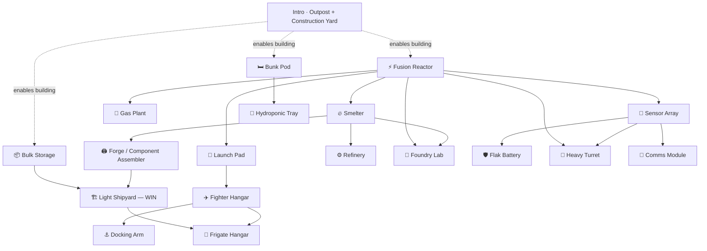

# Ground Base — Module Build Order

> **The recommended order to build base modules**, phased by what's reachable at each step. This is a hand-curated reading of the prereq data — the source of truth is the unlock map in [`progression_base_building.md`](progression_base_building.md) §5.D, and the runtime unlock state is whatever the `ProductionTreeResolver` computes from it. If a prereq changes, edit §5.D first, then refresh this view.
>
> **Spine = the intro-short path** (locked 2026-06-04): `Reactor → Smelter → Forge → Light Shipyard`. The longer material-chain prereqs proposed in [`progression_production_tree.md`](progression_production_tree.md) §4.1 (Forge ← Refinery + Lab) were **declined** in favour of the shorter T1 win path. Refinery, Foundry Lab, and Gas Plant are valuable *depth* modules but are **not** on the critical path.

## Intro (given — placed in the freighter cinematic)

**Outpost chassis + Construction Yard.** The CY's drone builds everything below; nothing is reachable without it.

## Phase 1 — Foundations · *no prereqs, build immediately*

| Module | Role |
|---|---|
| ⚡ **Fusion Reactor T1** | Power. Almost everything downstream needs it — build first. |
| 🛏 **Bunk Pod T1** | Crew housing. Production modules sit idle without crew to run them. |
| 📦 **Bulk Storage T1** | Holds the raw materials you're about to process. |

## Phase 2 — First active modules · *need power / crew*

| Module | Gate | Role |
|---|---|---|
| 🔥 **Smelter T1** | Reactor | Ore → ingots. *(built end-to-end today)* |
| 💨 **Gas Plant T1** | Reactor | Raw gas → gas products. |
| 📡 **Sensor Array T1** | Reactor | Gate for all intel / defense / comms. |
| 🛬 **Internal Launch Pad T1** | Reactor | Gate for all docking. |
| 🌱 **Hydroponic Tray T1** | Bunk Pod | Food to sustain crew. |

## Phase 3 — Production & first defenses

| Module | Gate | Role |
|---|---|---|
| 🖨 **Forge / Component Assembler T1** | Smelter | Materials → **graded parts**. The printer. |
| ⚙️ **Refinery T1** | Smelter | Ingots → alloys *(depth — off the win path)*. |
| 🧪 **Foundry Lab T1** | Smelter + Reactor | Synthesis: super-conductor, composites *(depth)*. |
| 🛡 **Flak Battery T1** | Sensor Array | Point defense. |
| 🎯 **Heavy Turret T1** | Sensor Array + Reactor | Anti-ship. |
| 📶 **Communication Module T1** | Sensor Array | Market / intel relay. |
| ✈️ **Fighter Hangar T1** | Internal Launch Pad | Store & launch fighters. |

## Phase 4 — Assembly · 🏁 *T1 win condition*

| Module | Gate | Role |
|---|---|---|
| 🏗 **Light Shipyard T1** | Forge + Bulk Storage | Parts → hulls → **build a Light Ship**. |
| ⚓ **Docking Arm T1** | Fighter Hangar | Extra mooring. |

## Phase 5 — Capital docking

| Module | Gate | Role |
|---|---|---|
| 🚢 **Frigate Hangar T1** | Fighter Hangar + Light Shipyard | Dock frigate-class hulls. |

## Critical path to the T1 win

`Fusion Reactor → Smelter → Forge → Light Shipyard` (+ Bunk Pod for crew, Bulk Storage for the shipyard). This is the 9-step spine in [`progression_base_building.md`](progression_base_building.md) §5.F.

## Dependency graph

## Outside the tree (always available)

Conduits, chassis pieces, and cosmetic decor have no prereqs and no power draw — place them whenever. Structural pieces are never gated; see [`progression_base_building.md`](progression_base_building.md) §4 (catalog) + §5.D.

## Status & backlog

Per-module built ✅ / to-build ❌ status: [`ground_base_built_vs_todo.md`](ground_base_built_vs_todo.md). Authoring tasks: [`../meta/master_to_do.md`](../meta/master_to_do.md) Phase 6.10.
