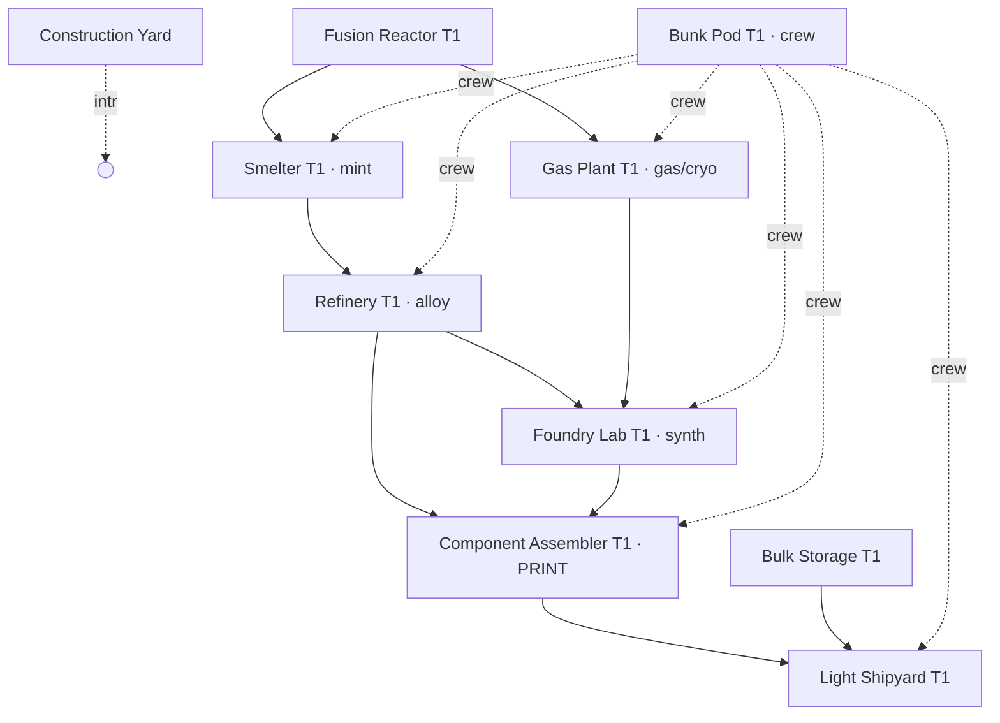

# Base Production Tech Tree

> **Status: DRAFT for review — canon proposal as of 2026-06-04.** Defines the facility-gated production tree that takes raw mined commodities (metal / mineral / gas) up through processing to the **Forge** — the "3D printer" that mints finished graded parts — and into the base/ship build process. This doc is the **spine** that unifies two trees that already exist separately:
>
> - **The materials DAG** — what combines into what — already authored in [`../economy/economy_alchemy_tech_tree.md`](../economy/economy_alchemy_tech_tree.md).
> - **The facility ladder** — what you must build to produce — partially in [`progression_base_building.md` §5](progression_base_building.md).
>
> This doc does **not** re-list the material recipes (that's the alchemy doc) or the module catalog (that's base-building §4). It defines the **production facility families, their tiers, the build-order gating, and the rule by which the tree is *derived* rather than hand-drawn.**

---

## 0. Core thesis — derive the tree, don't draw it

A hand-maintained tech-tree graph rots the moment a recipe changes. Instead we author **two small axes** and let the tree **compute itself**:

- **Axis A — the facility ladder** (this doc §2–§4): each facility family × tier, with build-prereqs, power, and crew.
- **Axis B — recipe→facility bindings** (already on every `RecipeSchema`: `requiredFacility` + `requiredFacilityTier`): which facility runs each recipe.

A production node is **unlocked** iff:

```
node.facility is built at ≥ node.requiredFacilityTier   AND   every input node is itself reachable
```

That's a transitive reachability closure over the recipe DAG, gated by what the player has built. One resolver computes it (§5); the same result drives the build-panel grey-out **and** the browsable tech-tree screen. **Adding a new material or part later is a one-line job: author the recipe, bind its facility — the tree updates itself.** This is the same schema-driven, auto-discovery philosophy the rest of the content pipeline uses (CLAUDE.md "schema-driven pipeline").

---

## 1. The production spine

Three raw classes enter at the bottom; everything converges on the Forge:

```
LAYER 0 · EXTRACTION        ┌─ Metal ore ─┐  ┌─ Minerals ─┐  ┌── Gas ──┐   (+ Scrap from salvage)
  mining ops / salvage      │ Fe Cu Ti Ni │  │ Si C S ice │  │H N He³ …│
                            └──────┬──────┘  └─────┬──────┘  └────┬────┘
LAYER 1 · MINT              ┌──────┴──────┐        │              │
  SMELTER (fac 0)           │ ore → ingot │ (metal only)         │
                            └──────┬──────┘        │              │
LAYER 2 · METALLURGY  ┌────────────┴──────────┐    │              │
  REFINERY (fac 4)    │ ingot+ingot/mineral → │    │              │
                      │ Steel, Ferro-Ti, …    │    │              │
                      │ + scrap → mixed raws  │    │              │
                      └───────────┬───────────┘    │              │
LAYER 2g · GAS/CRYO   ─ ─ ─ ─ ─ ─ │─ ─ ─ ─ ─ ─ ─ ─ │ ─ ─ ─ ┌──────┴──────┐
  GAS PLANT (fac 5) NEW           │                │       │ raw gas →    │
                                  │                │       │ Ammonia, Ion │
                                  │                │       │ Plasma, Cryo │
                                  │                │       └──────┬───────┘
LAYER 3 · SYNTHESIS         ┌─────┴────────────────┴──────────────┴─────┐
  LAB (fac 1)               │ alloys + gas-products + minerals →         │
                            │ Super-Conductor, Composites, Stainless …  │
                            └─────────────────────┬─────────────────────┘
LAYER 4 · FABRICATION   ╔══════════════════════════╩═══════════════════╗
  ★ THE 3D PRINTER ★    ║ FORGE / Component Assembler (fac 3)           ║
                         ║ materials → GRADED PartInstances             ║
                         ║ (weapons, reactors, jammers, ammo, modules)  ║
                         ╚══════════════════════════╦═══════════════════╝
LAYER 5 · ASSEMBLY        ┌──────────────────────────┴──────────────────┐
                          │ SHIPYARD → hulls   │   CONSTRUCTION YARD →   │
                          │                    │   base modules/conduits │
                          └────────────────────┴─────────────────────────┘
```

**Two distinct output mechanisms feed off the materials tree — don't conflate them:**
- **Recipes** (`RecipeSchema`) run *inside* a processing facility: Smelter / Refinery / Gas Plant / Lab produce **materials** (`kind:Resource`); the Forge produces **parts** (`kind:Module`, graded PartInstances).
- **`buildCost`** (`BuildCostRow` on `FacilityModuleSchema`) is consumed by the **Construction Yard drone** to erect base modules/conduits. Not a recipe — a placement-time material deduction validated by `BuildCostValidator`.

---

## 2. Facility families

The processing facilities are the `FacilityType` enum ([`FacilityType.cs`](../../Assets/Scripts/Schemas/FacilityType.cs)). This doc **adds one** family:

| Fac | `FacilityType` | Role | Output | T1 module | Status |
|-----|----------------|------|--------|-----------|--------|
| 0 | `Smelter` | **Mint** — raw metal ore → ingot (1:1) | Resource | `Smelter_T1` | ✅ authored |
| 4 | `Refinery` | **Metallurgy** — ingot + ingot/mineral → alloy; scrap → mixed raws | Resource | — | ❌ **author** |
| 5 | `GasPlant` **NEW** | **Gas & Cryo** — raw gas → gas products, cryogenics, liquefaction | Resource | — | ❌ **author** + enum |
| 1 | `Lab` | **Synthesis** — alloys + gas-products + minerals → composites/exotics (no raw-gas input) | Resource | `Foundry_Lab_T1` | ✅ authored |
| 3 | `Forge` | **Fabrication / 3D printer** — materials → graded parts | **Module** | `Component_Assembler_T1` | ✅ module; ❌ recipes |
| 2 | `Miner` | Mining-yield bonuses (reserved, slice 4) | — | — | reserved |

Assembly sinks (not recipe facilities — they consume the tree's output):
- **Construction Yard** (`facilityType 99`/None, bootstrap) — builds base modules + conduits from `buildCost`. ✅ authored.
- **Light Shipyard** — assembles hulls from parts + materials. ✅ `Light_Shipyard_T1`.

> **New enum value:** `GasPlant = 5` in `FacilityType.cs`. The JS mirror (`cloudscript/recipes.js`) and any `requiredFacility` switch must add the case.

### 2.1 Why Gas Plant is its own family (decision 2026-06-04)

Gases are mechanically distinct *everywhere else already* — `ResourcePhase.Gas` vents on recycle, needs the cylindrical pressure-tank crate mesh, and stores one-type-per-tank (see [`ResourceSchema.cs`](../../Assets/Scripts/Schemas/ResourceSchema.cs) + the unified-inventory design). Giving gas its own **processing** facility makes that distinction consistent end-to-end and creates a real specialization fork: a gas-focused refiner (fuel/coolant/propellant supplier) is a different industrial build than a metals-focused one. This supersedes the older "gas folds into the Lab" framing in [`economy_alchemy_tech_tree.md` §Tier 2](../economy/economy_alchemy_tech_tree.md) — that doc's facility split is updated by §3 below.

---

## 3. The binding rule (Axis B) — mechanical, phase-driven

Because every `ResourceSchema` already declares `phase`, the Gas-Plant boundary is **derivable, not hand-assigned**:

> **A material recipe (`kind:Resource`) whose inputs include any `phase == Gas` resource is Gas-Plant-gated. Otherwise it follows the metal/synthesis rules below. Part recipes (`kind:Module`) are always Forge-gated regardless of inputs.**

Raw gases (`phase == Gas`): `hydrogen`, `methane`, `nitrogen`, `neon`, `xenon`, `helium3`.

This puts the **first** gas transformation at the Gas Plant and downstream assembly (which consumes gas-*derived intermediates*, not raw gas) at the Lab. Concrete bindings for currently-authored recipes:

| Recipe | Inputs | Current `requiredFacility` | Correct under this doc | Action |
|--------|--------|---------------------------|------------------------|--------|
| `iron_ingot` (+ 7 other mints) | raw metal | 0 Smelter | 0 Smelter | ✓ keep |
| `steel`, `ferro_titanium`, `nickel_iron_plating`, `electrum_wire` | ingots/mineral | 4 Refinery | 4 Refinery | ✓ keep |
| `scrap_refining` | scrap | 4 Refinery | 4 Refinery | ✓ keep |
| `super_conductor`, `carbon_fiber_glass`, `aerogel_mesh` | ingots/minerals (no gas) | 1 Lab | 1 Lab | ✓ keep |
| `ammonia` | nitrogen + hydrogen | **1 Lab** | **5 GasPlant** | ⚠️ re-point |
| `ion_plasma` | xenon + hydrogen | **1 Lab** | **5 GasPlant** | ⚠️ re-point |
| `synthetic_polymer` | methane + carbon | **1 Lab** | **5 GasPlant** | ⚠️ re-point |
| `thermal_paste` | silicates + helium3 | **1 Lab** | **5 GasPlant** | ⚠️ re-point |
| `radar_absorbent_pigment` | carbon + methane | **1 Lab** | **5 GasPlant** | ⚠️ re-point |

Tier-3 gas recipes (cryo-coolant, high-velocity plasma, metallic hydrogen) likewise bind to Gas Plant when authored. The full audit of all 22 recipes against this rule is the first authoring task (§6).

---

## 4. Tier ladders (Axis A)

Each facility has a **T1→T5** ladder. **Facility tier caps the recipe tier it can run** (`requiredFacilityTier`). The unlock rule is the same hybrid model as base-building §5: to unlock **T(N+1)** of a facility you need **2× T(N) modules of the same category built** + the named prereqs below.

### 4.1 T1 — concrete (Phase 6.10 target)

Existing authored T1 values (read from the SOs); **Refinery T1** and **Gas Plant T1** are the new rows (proposed, tunable — derived from the §6.C cost-ladder philosophy in base-building):

| Facility T1 | Category | `facilityType` | powerDraw | crew | Build prereq | Unlocks recipe tier |
|-------------|----------|----------------|-----------|------|--------------|---------------------|
| Smelter T1 | Industry | 0 | 8 | 2 | Fusion Reactor T1 | mint T1 |
| **Refinery T1** | Industry | 4 | ~30 *(prop.)* | ~2 | **Smelter T1** | alloy T1 (Steel) |
| **Gas Plant T1** | Industry | 5 | ~12 *(prop.)* | ~1 | **Fusion Reactor T1** | gas T1 (Ammonia, Ion Plasma) |
| Foundry Lab T1 | Lab | 1 | 25 | 3 | **Refinery T1** *(was Smelter)* | synth T1 (Super-Conductor) |
| Component Assembler T1 (Forge) | Industry | 3 | 40 | 4 | **Refinery T1 + Foundry Lab T1** *(was Smelter)* | fabricate T1 parts |

> **Prereq changes vs. base-building §5.D** (proposed — for review): Foundry Lab now requires Refinery (it synthesizes *alloys*, so alloys must be makeable first); Component Assembler now requires both Refinery + Lab (it prints from both material streams). These edges make the dependency chain match the *material* chain. §5.D's table predates the Refinery/Gas-Plant split and gets a Refinery + Gas-Plant row added.

### 4.2 T2–T5 — the ladder rule, not 200 invented numbers

Per-tier scaling is a **rule**, not a hand-authored table, so the ladder stays tunable:

- **Recipe-tier unlock:** facility Tier N runs recipes with `requiredFacilityTier ≤ N`. (E.g. `ferro_titanium` is `requiredFacilityTier: 2` → needs **Refinery T2**, while `steel` runs at Refinery T1.)
- **Power / crew / throughput** scale ~per the base-building §6.C ladder (≈2× per tier).
- **Named tier identities** (already in lore): Reactor T1 Fusion → T5 Antimatter; Lab T1 Foundry → T3 Cryo-Physics → T5 Singularity; Gas Plant T3 = the "Cryo-Physics" gas tier that handles He-3 / metallic-hydrogen.

Only T1 is authored for Phase 6.10; T2–T5 are reserved slots filled in later phases.

---

## 5. The build-order graph + resolver

### 5.1 Cross-facility prereq DAG (proposed canon)



### 5.2 `ProductionTreeResolver` contract

One service, consumed in three places (build panel, recipe/production UI, tech-tree screen). Server mirror in CloudScript (Double-Schema rule — don't trust the client).

```csharp
// Input: the player's built facilities on this body (from MacroBaseRecord).
// Output: reachability verdicts for modules, recipes, and materials/parts.
public sealed class ProductionTreeResolver
{
    UnlockState ResolveModule(FacilityModuleSchema m, MacroBaseRecord baseState);   // prereqs met?
    bool        CanRun(RecipeSchema r, MacroBaseRecord baseState);                  // facility @ tier built?
    Reach       ResolveMaterial(string resourceID, MacroBaseRecord baseState);     // transitive closure
}
// Reach: Reachable | LockedNeedsFacility(FacilityType, tier) | LockedNeedsInput(string resourceID)
```

`ResolveMaterial` is the closure: a material is **Reachable** iff some recipe producing it `CanRun` **and** all that recipe's inputs are themselves Reachable (or mineable / market-buyable — leaf nodes). This is the function the tech-tree screen renders: green = reachable now, greyed = locked with the *reason* (which facility/tier or which missing upstream material).

This **extends, doesn't replace**, the `BaseModuleUnlockResolver` named in base-building §5.B (which still doesn't exist) — module unlock is the `ResolveModule` half.

---

## 6. Worked example — raw → printed Railgun

The full vertical slice the whole tree exists to enable:

| Step | Facility (tier) | Recipe | Consumes → Produces |
|------|-----------------|--------|---------------------|
| Mine | — | — | iron, copper, lithium, carbon ore |
| Mint | Smelter T1 | `iron_ingot`, `copper_ingot`, `lithium_ingot` | ore → ingots |
| Alloy | Refinery T1 | `steel` | iron_ingot + carbon → steel |
| Synthesize | Foundry Lab T1 | `super_conductor` | copper_ingot + carbon + lithium_ingot → super_conductor |
| **Print** | **Forge T1** | `railgun` *(Fabrication, `kind:Module`)* — **not authored yet** | steel + super_conductor → **graded Railgun PartInstance** |

So "print a Railgun" transitively requires **Smelter + Refinery + Lab + Forge**, each powered + crewed — and the resolver derives exactly that chain from the recipe inputs. No hand-drawn tree.

---

## 7. Authoring backlog (what this doc requires building)

In dependency order:

1. **`FacilityType.GasPlant = 5`** — enum + JS mirror + any `requiredFacility` switch.
2. **Audit all 22 recipes** against the §3 phase rule; re-point the 5 gas recipes Lab→GasPlant.
3. **`Refinery_T1` module SO** + prefab (reuses the Smelter pattern; the gap flagged in base-building §5.D).
4. **`GasPlant_T1` module SO** + prefab.
5. **Forge part recipes** (`RecipeCategory.Fabrication`, `kind:Module`) — the printer's actual outputs (Railgun, reactor, jammer…). These don't exist yet (`RecipeSchema` reserves the shape; Slice 2 authored none).
6. **`ProductionTreeResolver`** (+ CloudScript mirror) + the three UI consumers.
7. **Tech-tree screen** — render the alchemy Mermaid annotated with facility+tier gates from the resolver.
8. **Doc reconciliation** — add Refinery + Gas Plant rows to base-building §5.D; update its §6.A `RecipeInput`→`BuildCostRow` drift; update the alchemy doc's facility-split note.

Phase placement: items 1–4 are Phase 6.10 (T1 win-condition spine); items 5–7 gate the first printed part; item 8 is housekeeping alongside.

---

## 8. Open decisions (flagged for review)

- **§4.1 proposed numbers** (Refinery/Gas-Plant power+crew) are placeholders pending an authoring pass — not yet tuned.
- **§4.1 prereq changes** (Lab←Refinery, Forge←Refinery+Lab) revise base-building §5.D; confirm before the §5.D edit lands.
- **Forge part-recipe scope** — which parts are T1-printable is its own design pass (weapons? reactors? both?), tracked when item 5 starts.
- **Construction Yard "refine raws at build time"** (base-building §6.B) — does the CY shortcut the Smelter/Refinery for `buildCost` material, or must the player run the real chain? Affects whether the tree is mandatory or a convenience. **TBD.**
